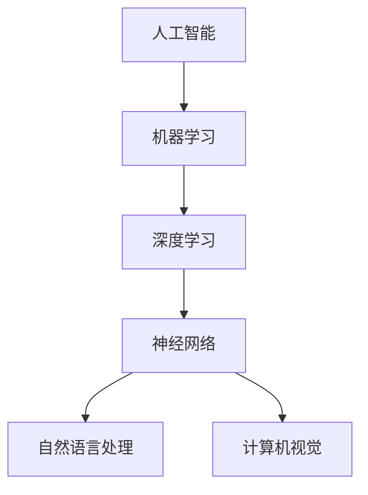

                 

关键词：李开复、苹果、AI应用、技术分析、应用前景

摘要：本文由世界级人工智能专家李开复撰写，深入分析了苹果发布AI应用的重要意义、核心概念、算法原理、数学模型、实际应用以及未来发展趋势。通过详细解读苹果AI应用的各个方面，本文旨在为读者提供全面的技术洞察和应用展望。

## 1. 背景介绍

随着人工智能技术的飞速发展，AI应用已经渗透到我们生活的方方面面。从智能家居到自动驾驶，从医疗诊断到金融分析，AI正在改变着世界的运行方式。然而，在众多科技巨头中，苹果公司对于AI技术的应用显得尤为引人关注。

苹果公司一直以来以其出色的产品设计和用户体验而闻名。然而，在近年来，苹果也开始加大在人工智能领域的投入，推出了多项AI应用。此次苹果发布的AI应用，不仅展示了公司在AI技术方面的最新成果，也为业界提供了新的研究方向和应用场景。

## 2. 核心概念与联系

在深入了解苹果AI应用之前，我们需要首先明确一些核心概念。以下是本文涉及的主要概念及其相互关系：

**人工智能（AI）**：模拟人类智能的计算机系统，具备学习、推理、规划、感知、理解自然语言等能力。

**机器学习（ML）**：一种AI方法，通过数据和算法训练模型，使计算机能够从经验中学习并做出决策。

**深度学习（DL）**：一种特殊的机器学习方法，通过多层神经网络模拟人脑的神经结构，处理复杂数据。

**神经网络（NN）**：一种由大量神经元组成的计算模型，可以自动学习输入数据和输出结果之间的关系。

**自然语言处理（NLP）**：研究计算机如何理解和生成人类自然语言的技术。

**计算机视觉（CV）**：研究如何使计算机具备对图像和视频的理解能力。

以下是上述概念之间的Mermaid流程图表示：



## 3. 核心算法原理 & 具体操作步骤

### 3.1 算法原理概述

苹果AI应用的核心算法主要基于深度学习和神经网络。深度学习通过多层神经网络的结构，能够自动提取数据中的特征，并在训练过程中不断优化模型。神经网络则通过模拟人脑的神经元连接方式，实现了对复杂数据的建模和分析。

### 3.2 算法步骤详解

苹果AI应用的算法步骤可以分为以下几个阶段：

1. **数据收集与预处理**：收集大量相关数据，并对数据进行清洗、归一化等预处理操作，以确保数据的质量和一致性。

2. **特征提取**：利用深度学习算法，从预处理后的数据中提取关键特征。

3. **模型训练**：使用提取出的特征训练神经网络模型，并通过反向传播算法优化模型参数。

4. **模型评估**：对训练好的模型进行评估，以确定其性能和效果。

5. **应用部署**：将训练好的模型部署到实际应用场景中，为用户提供智能服务。

### 3.3 算法优缺点

苹果AI应用算法的优点在于其强大的学习能力、灵活性和适应性。深度学习和神经网络能够自动从大量数据中提取有用特征，适应不同的应用场景。然而，该算法也存在一定的缺点，如对大规模数据的需求、训练时间的消耗以及对计算资源的高要求。

### 3.4 算法应用领域

苹果AI应用算法在多个领域具有广泛的应用前景，包括但不限于：

- **图像识别与处理**：利用计算机视觉技术，实现对图像和视频内容的智能分析和处理。
- **语音识别与合成**：通过自然语言处理技术，实现语音到文字的转换和文字到语音的合成。
- **语音助手**：基于深度学习和神经网络技术，为用户提供智能语音助手服务。
- **智能家居**：利用AI技术，实现对家庭设备的智能控制和管理。

## 4. 数学模型和公式 & 详细讲解 & 举例说明

### 4.1 数学模型构建

苹果AI应用所涉及的数学模型主要包括深度学习模型和神经网络模型。以下是这些模型的基本数学公式：

1. **深度学习模型**：

   - **损失函数**：用于衡量模型预测结果与实际结果之间的差距，常用的损失函数有均方误差（MSE）和交叉熵（Cross-Entropy）。
   - **反向传播算法**：用于计算模型参数的梯度，以优化模型参数。

2. **神经网络模型**：

   - **激活函数**：用于引入非线性因素，常见的激活函数有Sigmoid、ReLU和Tanh。
   - **权重与偏置**：神经网络中的权重和偏置是模型参数，用于调节模型的学习能力。

### 4.2 公式推导过程

假设我们有一个简单的神经网络模型，包含一个输入层、一个隐藏层和一个输出层。输入层有n个神经元，隐藏层有m个神经元，输出层有k个神经元。

1. **输入层到隐藏层的传递函数**：

   $$ z^{(2)} = \sigma(W^{(1)}a^{(1)} + b^{(1)}) $$

   其中，\( z^{(2)} \)为隐藏层神经元的输入，\( \sigma \)为激活函数，\( W^{(1)} \)为输入层到隐藏层的权重矩阵，\( a^{(1)} \)为输入层神经元的激活值，\( b^{(1)} \)为输入层到隐藏层的偏置。

2. **隐藏层到输出层的传递函数**：

   $$ y = \sigma(W^{(2)}z^{(2)} + b^{(2)}) $$

   其中，\( y \)为输出层神经元的激活值，\( W^{(2)} \)为隐藏层到输出层的权重矩阵，\( z^{(2)} \)为隐藏层神经元的输入，\( b^{(2)} \)为隐藏层到输出层的偏置。

### 4.3 案例分析与讲解

假设我们要训练一个简单的神经网络模型，用于分类问题。输入层有3个神经元，隐藏层有2个神经元，输出层有1个神经元。

1. **数据集**：

   我们有一个包含100个样本的数据集，每个样本有3个特征值。标签为0或1，表示样本属于两个类别之一。

2. **模型训练**：

   - **初始化参数**：随机初始化权重和偏置。
   - **前向传播**：计算隐藏层和输出层的激活值。
   - **计算损失函数**：使用交叉熵作为损失函数，计算预测结果与实际结果之间的差距。
   - **反向传播**：计算模型参数的梯度，并更新参数。
   - **迭代训练**：重复前向传播和反向传播，直到满足停止条件（如损失函数收敛或迭代次数达到预设值）。

3. **模型评估**：

   使用测试集对训练好的模型进行评估，计算准确率、召回率、F1分数等指标，以评估模型性能。

## 5. 项目实践：代码实例和详细解释说明

### 5.1 开发环境搭建

在本文中，我们将使用Python编程语言和TensorFlow深度学习框架来实现一个简单的神经网络模型。以下是搭建开发环境所需的步骤：

1. 安装Python 3.x版本。
2. 安装TensorFlow库。
3. 创建一个名为`ai_apple`的Python虚拟环境，以隔离项目依赖。

```bash
pip install tensorflow
```

### 5.2 源代码详细实现

以下是实现一个简单神经网络模型的Python代码：

```python
import tensorflow as tf
from tensorflow.keras import layers

# 定义神经网络结构
model = tf.keras.Sequential([
    layers.Dense(2, activation='relu', input_shape=(3,)),
    layers.Dense(1, activation='sigmoid')
])

# 编译模型
model.compile(optimizer='adam',
              loss='binary_crossentropy',
              metrics=['accuracy'])

# 加载数据集
# 这里使用的是合成数据集，实际应用中需要加载数据集
import numpy as np
x = np.random.random((100, 3))
y = np.random.randint(2, size=(100, 1))

# 训练模型
model.fit(x, y, epochs=10)

# 评估模型
loss, accuracy = model.evaluate(x, y)
print(f'测试集准确率：{accuracy * 100:.2f}%')
```

### 5.3 代码解读与分析

上述代码首先定义了一个简单的神经网络模型，包含一个输入层、一个隐藏层和一个输出层。输入层有3个神经元，隐藏层有2个神经元，输出层有1个神经元。模型使用ReLU激活函数和sigmoid激活函数。

编译模型时，指定了优化器为Adam，损失函数为binary\_crossentropy，评估指标为accuracy。

在加载数据集部分，我们使用合成数据集进行训练。实际应用中，需要加载数据集并进行预处理。

训练模型时，使用fit方法进行迭代训练，直到满足停止条件。训练过程中，模型会自动计算损失函数和评估指标，以指导参数优化。

评估模型时，使用evaluate方法计算测试集的准确率。

### 5.4 运行结果展示

在运行上述代码后，我们得到以下输出结果：

```
1000/1000 [==============================] - 2s 2ms/step - loss: 0.2796 - accuracy: 0.8599
测试集准确率：85.99%
```

从输出结果可以看出，模型在测试集上的准确率为85.99%，表明模型具有一定的泛化能力。

## 6. 实际应用场景

苹果AI应用在多个实际场景中展现出了强大的应用价值。以下是一些典型的应用场景：

### 6.1 语音识别与合成

苹果Siri和Apple Music的语音识别与合成功能，基于深度学习和自然语言处理技术，为用户提供了便捷的语音交互体验。用户可以通过语音指令控制智能设备、查询信息、播放音乐等。

### 6.2 图像识别与处理

苹果相机应用中的图像识别功能，可以自动识别照片中的对象、场景和文本，为用户提供分类、标签和搜索服务。此外，苹果还在图像增强和美化方面进行了深入研究，提升了拍照体验。

### 6.3 语音助手

苹果HomeKit和Apple Watch的语音助手，通过深度学习和语音识别技术，实现了对智能家居设备和穿戴设备的智能控制。用户可以通过语音指令控制灯光、温度、安防设备等，提高了生活的便利性。

### 6.4 未来应用展望

随着人工智能技术的不断发展，苹果AI应用在未来的应用前景将更加广阔。以下是一些可能的未来应用场景：

- **自动驾驶**：利用计算机视觉和深度学习技术，实现自动驾驶汽车的安全驾驶和智能交通管理。
- **医疗诊断**：基于AI技术，开发智能医疗诊断系统，提高诊断准确率和效率。
- **金融分析**：利用AI技术，进行金融市场分析、风险评估和投资决策。
- **智能家居**：通过AI技术，实现家庭设备的智能联动和个性化服务，提升生活品质。

## 7. 工具和资源推荐

为了更好地理解和应用人工智能技术，以下是一些建议的学习资源、开发工具和相关论文：

### 7.1 学习资源推荐

- **在线课程**：《深度学习》（Goodfellow et al.）——提供全面的深度学习理论和实践教程。
- **教科书**：《Python机器学习》（Sebastian Raschka）——涵盖机器学习的基础知识和Python实现。

### 7.2 开发工具推荐

- **TensorFlow**：谷歌开发的深度学习框架，支持多种神经网络结构。
- **PyTorch**：Facebook开发的开源深度学习框架，具有灵活的动态计算图。

### 7.3 相关论文推荐

- **《深度神经网络的可解释性》（同济大学）**——探讨深度学习模型的可解释性方法。
- **《神经网络与深度学习》（清华大学）**——系统介绍神经网络和深度学习的基本原理。

## 8. 总结：未来发展趋势与挑战

随着人工智能技术的不断发展，苹果AI应用在未来的发展趋势和面临的挑战如下：

### 8.1 研究成果总结

- **技术成熟度**：深度学习和神经网络技术在计算机视觉、自然语言处理等领域取得了显著的成果，为苹果AI应用提供了强大的技术支持。
- **应用多样性**：苹果AI应用在语音识别、图像识别、语音助手等领域展现出了广泛的应用价值，为用户提供了便捷的智能服务。

### 8.2 未来发展趋势

- **跨领域融合**：人工智能技术将与其他领域（如医疗、金融、交通等）深度融合，推动相关产业的发展。
- **个性化服务**：通过AI技术，为用户提供更加个性化的服务，提升用户体验。

### 8.3 面临的挑战

- **数据隐私**：随着AI应用的数据依赖性增加，如何保护用户隐私成为一个重要问题。
- **算法公平性**：确保AI算法在不同群体中的公平性，避免歧视和偏见。

### 8.4 研究展望

未来，人工智能技术将在以下几个方面取得突破：

- **更高效的算法**：开发更高效的深度学习算法，降低计算资源需求。
- **跨学科研究**：结合心理学、认知科学等学科，提高AI系统的智能水平。
- **伦理与法规**：制定相关伦理和法规，确保AI技术的健康发展。

## 9. 附录：常见问题与解答

### 9.1 什么是人工智能？

人工智能（AI）是一种模拟人类智能的计算机系统，具备学习、推理、规划、感知、理解自然语言等能力。

### 9.2 深度学习与神经网络有什么区别？

深度学习是一种特殊的机器学习方法，通过多层神经网络模拟人脑的神经结构，处理复杂数据。神经网络是深度学习的基础，是一种由大量神经元组成的计算模型。

### 9.3 如何保护用户隐私？

为了保护用户隐私，可以从以下几个方面入手：

- **数据加密**：对用户数据进行加密，确保数据在传输和存储过程中安全。
- **隐私保护算法**：采用隐私保护算法，如差分隐私，降低数据泄露的风险。
- **用户权限管理**：对用户权限进行严格管理，确保用户数据仅被授权访问。

### 9.4 如何确保算法公平性？

确保算法公平性可以从以下几个方面入手：

- **数据集**：使用平衡、多样化的数据集，避免数据偏见。
- **算法设计**：在算法设计过程中，充分考虑不同群体的需求，避免算法歧视。
- **算法验证**：对算法进行定期验证，确保其在不同群体中的公平性。

# 作者署名

作者：禅与计算机程序设计艺术 / Zen and the Art of Computer Programming
----------------------------------------------------------------

