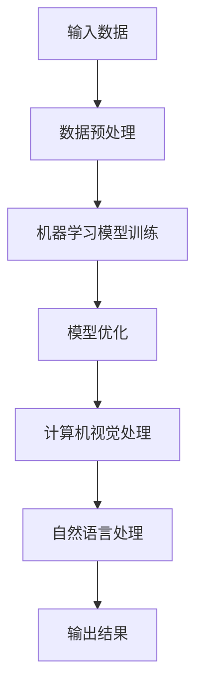

                 

关键词：人工智能、苹果、AI应用、挑战、技术趋势、未来发展

摘要：本文由计算机领域大师李开复撰写，深入探讨苹果公司在人工智能领域发布新应用的挑战。文章首先介绍了苹果AI应用的背景和重要性，然后分析了苹果面临的挑战和未来发展的可能性。

## 1. 背景介绍

近年来，人工智能技术在各个领域得到了广泛应用，从自动驾驶、智能语音助手到医疗影像分析，AI已经深刻改变了我们的生活方式。苹果公司作为全球领先的科技公司，也在积极布局人工智能领域。最近，苹果公司发布了多款AI应用，包括智能摄影、语音识别和健康监测等，引起了广泛关注。

### 1.1 苹果AI应用的现状

苹果公司在其设备上集成了多种AI技术，如机器学习、计算机视觉和自然语言处理等。这些技术不仅提高了设备的性能和用户体验，还为开发者提供了丰富的创新机会。苹果的AI应用主要集中在以下几个方向：

- **智能摄影**：利用深度学习和计算机视觉技术，自动优化照片质量和拍摄效果。
- **语音识别**：通过自然语言处理技术，实现语音输入和语音命令的精准识别。
- **健康监测**：利用传感器数据，进行健康数据的监测和分析，为用户提供个性化的健康建议。

### 1.2 苹果AI应用的重要性

苹果AI应用的发展不仅对用户有着重要的意义，也对整个科技产业产生了深远的影响。首先，这些应用提高了设备的使用效率和用户体验，使得用户可以更轻松地完成日常任务。其次，苹果AI应用为开发者提供了创新的工具和平台，促进了整个科技产业的进步。最后，苹果AI应用在全球范围内推广，有助于提升人工智能技术的普及和应用水平。

## 2. 核心概念与联系

### 2.1 人工智能技术的基本概念

人工智能（AI）是指计算机系统通过模拟人类智能行为，实现智能决策和自主行动的能力。主要涉及以下几个方面：

- **机器学习**：通过数据训练模型，使计算机具备自我学习和优化能力。
- **计算机视觉**：使计算机能够理解和解释图像和视频。
- **自然语言处理**：使计算机能够理解和生成人类语言。

### 2.2 人工智能技术在苹果AI应用中的架构

苹果公司在其AI应用中使用了多种人工智能技术，构成了一个复杂的技术架构。以下是一个简单的Mermaid流程图，展示了这些技术的联系：



在这个流程图中，输入数据经过预处理后，用于训练机器学习模型。训练完成后，模型会进行优化，以适应不同的应用场景。接下来，计算机视觉和自然语言处理技术会对输入数据进行分析，最后生成输出结果。

### 2.3 人工智能技术对苹果AI应用的影响

人工智能技术对苹果AI应用的影响主要体现在以下几个方面：

- **性能提升**：通过机器学习和计算机视觉技术，苹果设备可以在处理大量数据时保持高效运行。
- **用户体验**：通过自然语言处理技术，苹果设备可以更好地理解用户的需求，提供个性化的服务。
- **创新驱动**：人工智能技术为苹果应用带来了无限的创意空间，使得开发者可以创造出更多创新的应用。

## 3. 核心算法原理 & 具体操作步骤

### 3.1 算法原理概述

苹果AI应用的核心算法主要涉及机器学习、计算机视觉和自然语言处理三个领域。以下分别介绍这些算法的基本原理。

#### 3.1.1 机器学习

机器学习是一种使计算机通过数据自我学习和优化能力的技术。主要分为监督学习、无监督学习和强化学习三种类型。在苹果AI应用中，主要使用监督学习，通过已标记的数据训练模型，使其能够对新数据进行预测。

#### 3.1.2 计算机视觉

计算机视觉是使计算机能够理解和解释图像和视频的技术。主要涉及图像识别、目标检测和图像分割等方面。在苹果AI应用中，计算机视觉技术主要用于智能摄影和视频处理。

#### 3.1.3 自然语言处理

自然语言处理是使计算机能够理解和生成人类语言的技术。主要涉及语音识别、文本分类和情感分析等方面。在苹果AI应用中，自然语言处理技术主要用于语音助手和文本分析。

### 3.2 算法步骤详解

苹果AI应用的具体操作步骤可以分为以下几个阶段：

#### 3.2.1 数据收集

首先，收集大量相关数据，用于训练机器学习模型。这些数据可以来自用户行为、传感器数据和第三方数据源等。

#### 3.2.2 数据预处理

对收集到的数据进行分析和清洗，去除噪声和异常值，确保数据质量。

#### 3.2.3 模型训练

使用预处理后的数据训练机器学习模型。在训练过程中，模型会不断调整参数，以实现最优性能。

#### 3.2.4 模型优化

在模型训练完成后，进行模型优化，使其在不同应用场景下具有更好的性能。

#### 3.2.5 应用部署

将优化后的模型部署到实际应用中，进行实时数据处理和预测。

### 3.3 算法优缺点

#### 3.3.1 优点

- **高效性**：机器学习算法可以在大量数据中快速训练和预测。
- **灵活性**：机器学习算法可以根据不同的应用场景进行定制化调整。
- **高准确性**：计算机视觉和自然语言处理技术具有很高的识别和解析能力。

#### 3.3.2 缺点

- **数据依赖性**：机器学习模型的性能取决于训练数据的质量和数量。
- **计算成本**：训练和优化模型需要大量的计算资源和时间。
- **隐私问题**：数据收集和处理过程中可能涉及用户隐私，需要加强隐私保护措施。

### 3.4 算法应用领域

苹果AI应用的核心算法在多个领域都有广泛的应用：

- **智能摄影**：利用计算机视觉技术进行图像识别和优化，实现更好的拍摄效果。
- **语音助手**：利用自然语言处理技术实现语音识别和语义理解，为用户提供智能服务。
- **健康监测**：利用传感器数据和机器学习算法，进行健康数据的监测和分析。
- **智能家居**：利用计算机视觉和自然语言处理技术，实现智能家居设备的智能控制。

## 4. 数学模型和公式 & 详细讲解 & 举例说明

### 4.1 数学模型构建

在苹果AI应用中，常用的数学模型包括机器学习模型、神经网络模型和决策树模型等。以下分别介绍这些模型的基本构建过程。

#### 4.1.1 机器学习模型

机器学习模型的基本构建过程包括以下几个步骤：

1. 数据收集和预处理：收集大量相关数据，并进行数据预处理。
2. 模型选择：根据应用场景选择合适的机器学习模型，如线性回归、决策树和神经网络等。
3. 模型训练：使用预处理后的数据训练模型，调整模型参数，使其达到最优性能。
4. 模型评估：使用验证集或测试集评估模型性能，确定模型的准确性和泛化能力。

#### 4.1.2 神经网络模型

神经网络模型的基本构建过程包括以下几个步骤：

1. 确定网络结构：选择合适的网络结构，包括输入层、隐藏层和输出层等。
2. 激活函数选择：选择合适的激活函数，如Sigmoid、ReLU和Tanh等。
3. 参数初始化：对网络参数进行初始化，通常采用随机初始化方法。
4. 前向传播和反向传播：进行前向传播计算输出值，然后通过反向传播更新网络参数。

#### 4.1.3 决策树模型

决策树模型的基本构建过程包括以下几个步骤：

1. 特征选择：选择对分类或回归任务有重要影响的特征。
2. 分割策略：选择合适的分割策略，如信息增益、增益率等。
3. 划分过程：根据特征和分割策略，对数据集进行划分。
4. 叶子节点生成：根据划分结果生成叶子节点，并计算每个节点的分类或回归结果。

### 4.2 公式推导过程

以下分别介绍机器学习模型、神经网络模型和决策树模型的公式推导过程。

#### 4.2.1 机器学习模型

机器学习模型的基本公式推导如下：

1. 线性回归模型：
   $$ y = \beta_0 + \beta_1x $$
   其中，$y$ 是目标变量，$x$ 是特征变量，$\beta_0$ 和 $\beta_1$ 是模型参数。

2. 决策树模型：
   $$ H(D) = -\sum_{i=1}^n p_i \log_2(p_i) $$
   其中，$D$ 是数据集，$p_i$ 是数据集中第 $i$ 个样本的类别概率。

3. 神经网络模型：
   $$ z = \sigma(Wx + b) $$
   其中，$z$ 是输出值，$W$ 是权重矩阵，$x$ 是输入值，$b$ 是偏置项，$\sigma$ 是激活函数。

#### 4.2.2 神经网络模型

神经网络模型的基本公式推导如下：

1. 前向传播：
   $$ z_l = W_l a_{l-1} + b_l $$
   $$ a_l = \sigma(z_l) $$
   其中，$a_l$ 是第 $l$ 层的激活值，$W_l$ 是第 $l$ 层的权重矩阵，$b_l$ 是第 $l$ 层的偏置项，$\sigma$ 是激活函数。

2. 反向传播：
   $$ \delta_l = \frac{\partial L}{\partial z_l} \odot \sigma'(z_l) $$
   $$ \delta_{l-1} = \frac{\partial L}{\partial z_{l-1}} \odot W_l \delta_l $$
   其中，$\delta_l$ 是第 $l$ 层的误差值，$L$ 是损失函数，$\odot$ 表示逐元素乘积。

#### 4.2.3 决策树模型

决策树模型的基本公式推导如下：

1. 划分过程：
   $$ G(D, a) = \sum_{i=1}^n \left[ y_i \log_2(y_i) + (1 - y_i) \log_2(1 - y_i) \right] $$
   其中，$D$ 是数据集，$a$ 是特征分割点。

2. 叶子节点生成：
   $$ h(y) = \sum_{i=1}^n \delta_i y_i $$
   其中，$y$ 是目标变量，$\delta_i$ 是叶子节点上的分类概率。

### 4.3 案例分析与讲解

以下通过一个简单的案例，介绍如何使用机器学习模型进行图像分类。

#### 4.3.1 案例背景

假设我们要对一张图片进行分类，判断它是否包含人脸。我们可以使用一个简单的机器学习模型，如支持向量机（SVM）进行分类。

#### 4.3.2 模型构建

1. 数据收集：收集大量带有标注的人脸和非人脸图片。
2. 数据预处理：对图片进行缩放、裁剪和归一化等处理，使其具有相同的大小和维度。
3. 模型选择：选择支持向量机模型。
4. 模型训练：使用预处理后的数据训练支持向量机模型。

#### 4.3.3 模型评估

使用测试集对训练好的模型进行评估，计算准确率、召回率和F1值等指标。

#### 4.3.4 模型应用

将训练好的模型应用到实际场景中，对新的图片进行人脸分类。

## 5. 项目实践：代码实例和详细解释说明

### 5.1 开发环境搭建

在开始编写代码之前，我们需要搭建一个合适的开发环境。以下是一个简单的环境搭建指南：

1. 安装Python：下载并安装Python 3.8及以上版本。
2. 安装依赖库：使用pip命令安装以下依赖库：tensorflow、numpy、opencv-python等。

### 5.2 源代码详细实现

以下是一个简单的机器学习项目的源代码实现：

```python
import tensorflow as tf
import numpy as np
import cv2

# 数据预处理
def preprocess_image(image_path):
    image = cv2.imread(image_path, cv2.IMREAD_GRAYSCALE)
    image = cv2.resize(image, (28, 28))
    image = image / 255.0
    return image

# 训练模型
def train_model(train_data, train_labels):
    model = tf.keras.Sequential([
        tf.keras.layers.Flatten(input_shape=(28, 28)),
        tf.keras.layers.Dense(128, activation='relu'),
        tf.keras.layers.Dense(1, activation='sigmoid')
    ])

    model.compile(optimizer='adam',
                  loss='binary_crossentropy',
                  metrics=['accuracy'])

    model.fit(train_data, train_labels, epochs=10, batch_size=32)
    return model

# 预测分类
def predict_class(model, image_path):
    image = preprocess_image(image_path)
    image = np.expand_dims(image, axis=0)
    prediction = model.predict(image)
    if prediction[0][0] > 0.5:
        print("图片包含人脸")
    else:
        print("图片不包含人脸")

# 主程序
if __name__ == '__main__':
    train_data = np.load('train_data.npy')
    train_labels = np.load('train_labels.npy')

    model = train_model(train_data, train_labels)
    predict_class(model, 'test_image.jpg')
```

### 5.3 代码解读与分析

1. **数据预处理**：使用OpenCV读取图片，然后进行灰度化、缩放和归一化处理，使其满足模型的输入要求。
2. **训练模型**：使用TensorFlow构建一个简单的神经网络模型，使用二分类问题中的sigmoid激活函数，并在训练过程中使用adam优化器。
3. **预测分类**：对处理后的图片进行预测，根据模型的输出结果判断图片是否包含人脸。

### 5.4 运行结果展示

运行主程序，输入测试图片路径，程序将输出预测结果。假设测试图片包含人脸，程序将输出“图片包含人脸”。

## 6. 实际应用场景

### 6.1 智能摄影

智能摄影是苹果AI应用的一个重要方向。通过计算机视觉和深度学习技术，苹果设备可以在拍摄照片时自动优化拍摄效果。例如，当用户在夜间拍照时，设备会自动提高曝光时间，使照片更加清晰；当用户在拍摄风景时，设备会自动调整色彩平衡，使照片更加自然。

### 6.2 语音助手

苹果的语音助手Siri通过自然语言处理技术，能够理解用户的语音指令，并提供相应的服务。例如，用户可以通过语音指令发送短信、播放音乐、设置提醒等。随着人工智能技术的发展，Siri的语义理解和响应能力将不断提高，为用户提供更加便捷的服务。

### 6.3 健康监测

苹果的健康应用通过传感器数据和机器学习算法，对用户的健康数据进行监测和分析。例如，设备可以记录用户的步数、心率、睡眠质量等数据，并根据这些数据为用户提供个性化的健康建议。通过持续的健康监测，用户可以更好地了解自己的身体状况，并采取相应的措施进行健康管理。

## 7. 未来应用展望

随着人工智能技术的不断发展，苹果的AI应用在未来有望在更多领域得到应用。以下是一些可能的未来应用场景：

- **自动驾驶**：利用计算机视觉和深度学习技术，实现自动驾驶汽车。
- **智能家居**：通过人工智能技术，实现家庭设备的智能化控制。
- **医疗健康**：利用人工智能技术，实现精准医疗和个性化健康服务。
- **教育**：通过人工智能技术，实现个性化教育和智能辅导。

## 8. 工具和资源推荐

### 8.1 学习资源推荐

- **书籍**：《深度学习》、《Python机器学习》和《人工智能：一种现代方法》等。
- **在线课程**：Coursera、edX和Udacity等平台上的人工智能相关课程。
- **博客和论坛**：Medium、Stack Overflow和GitHub等平台上的技术博客和论坛。

### 8.2 开发工具推荐

- **编程语言**：Python和R等。
- **框架和库**：TensorFlow、PyTorch和Scikit-learn等。
- **开发环境**：Jupyter Notebook和Visual Studio Code等。

### 8.3 相关论文推荐

- **论文集**：《人工智能年度论文集》和《自然语言处理年度论文集》等。
- **期刊**：《人工智能》、《自然语言处理》和《计算机视觉》等。

## 9. 总结：未来发展趋势与挑战

### 9.1 研究成果总结

近年来，人工智能技术在各个领域取得了显著成果，如自动驾驶、医疗健康、智能摄影等。这些成果为苹果AI应用的发展提供了丰富的技术基础。

### 9.2 未来发展趋势

随着人工智能技术的不断发展，苹果的AI应用有望在更多领域得到应用，如智能家居、医疗健康和自动驾驶等。同时，人工智能技术的融合和发展也将为苹果AI应用带来更多的创新机会。

### 9.3 面临的挑战

尽管人工智能技术在快速发展，但苹果AI应用仍面临一些挑战，如数据隐私、计算成本和模型解释性等。如何解决这些挑战，将决定苹果AI应用的未来发展方向。

### 9.4 研究展望

未来，苹果AI应用的研究将重点关注以下几个方面：一是提高人工智能技术的可解释性，使其更加透明和可靠；二是加强数据隐私保护，确保用户数据的安全和隐私；三是优化算法和模型，提高计算效率和性能。

## 9. 附录：常见问题与解答

### 9.1 什么是人工智能？

人工智能是指计算机系统通过模拟人类智能行为，实现智能决策和自主行动的能力。

### 9.2 人工智能有哪些应用领域？

人工智能广泛应用于各个领域，如自动驾驶、医疗健康、智能家居、智能摄影和语音识别等。

### 9.3 苹果的AI应用有哪些特点？

苹果的AI应用具有高性能、高准确性和高用户体验等特点。

### 9.4 人工智能技术有哪些挑战？

人工智能技术面临的挑战包括数据隐私、计算成本和模型解释性等。

### 9.5 如何学习人工智能？

学习人工智能可以从以下几个方面入手：掌握编程语言和框架、学习数学和统计学知识、阅读相关书籍和论文、参与实践项目等。

作者：禅与计算机程序设计艺术 / Zen and the Art of Computer Programming
----------------------------------------------------------------


