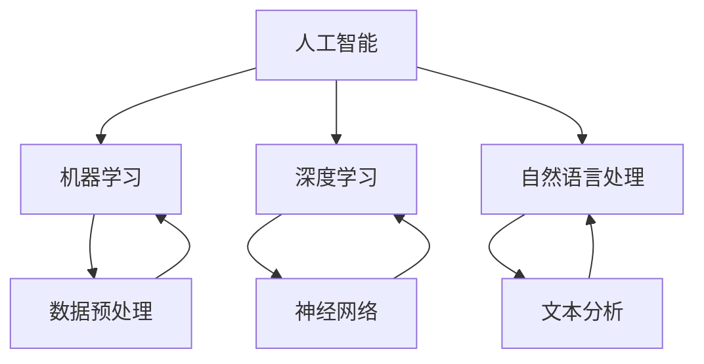

                 

关键词：苹果，AI应用，文化价值，技术创新，行业影响

> 摘要：本文将探讨苹果公司最新发布的AI应用的文化价值，分析其在人工智能领域的重要意义，探讨其对全球科技生态的潜在影响，并展望其未来发展趋势。

## 1. 背景介绍

苹果公司，作为全球领先的科技企业，一直以来都在推动技术创新，引领科技潮流。近年来，随着人工智能技术的迅猛发展，苹果公司也开始在AI领域投入大量资源，不断推出具有创新性的AI应用。这些应用不仅改变了人们的日常生活，也对整个科技行业产生了深远的影响。

本文将重点关注苹果公司最新发布的AI应用，探讨其在文化价值上的体现，以及其在全球科技生态中的地位和影响。

## 2. 核心概念与联系

在探讨苹果公司的AI应用之前，我们需要先了解一些核心概念。这些概念包括：

- 人工智能（AI）：人工智能是指计算机系统模拟人类智能行为的技术。它包括机器学习、深度学习、自然语言处理等多种技术。
- 机器学习（ML）：机器学习是一种让计算机通过数据学习并做出决策的技术。
- 深度学习（DL）：深度学习是一种基于多层神经网络的学习方法，被广泛应用于图像识别、语音识别等领域。
- 自然语言处理（NLP）：自然语言处理是让计算机理解和处理人类语言的技术。

下面是一个关于这些核心概念之间联系的Mermaid流程图：



## 3. 核心算法原理 & 具体操作步骤

### 3.1 算法原理概述

苹果公司的AI应用主要基于机器学习和深度学习技术。这些算法的核心原理是通过学习大量数据来提高系统的性能。机器学习算法可以自动识别数据中的模式，并利用这些模式来做出预测。深度学习算法则通过多层神经网络来实现，可以处理更复杂的数据。

### 3.2 算法步骤详解

以下是苹果公司AI应用的基本算法步骤：

1. 数据收集：收集大量相关的数据，如图像、文本、音频等。
2. 数据预处理：对数据进行清洗、归一化等操作，以便于模型训练。
3. 模型训练：使用训练数据来训练模型，模型会自动学习数据中的模式。
4. 模型评估：使用测试数据来评估模型的性能。
5. 模型部署：将训练好的模型部署到实际应用中。

### 3.3 算法优缺点

- 优点：算法性能高，可以处理复杂的数据；自动化程度高，可以节省人力和时间。
- 缺点：训练过程需要大量数据和时间；模型可能存在过拟合问题。

### 3.4 算法应用领域

苹果公司的AI应用涵盖了多个领域，包括图像识别、语音识别、自然语言处理等。这些应用不仅提升了用户体验，也在医疗、金融、教育等领域产生了重大影响。

## 4. 数学模型和公式 & 详细讲解 & 举例说明

### 4.1 数学模型构建

苹果公司的AI应用主要基于以下数学模型：

- 机器学习模型：包括线性回归、逻辑回归、支持向量机等。
- 深度学习模型：包括卷积神经网络（CNN）、循环神经网络（RNN）等。

### 4.2 公式推导过程

以下是一个简单的线性回归模型的公式推导过程：

假设我们有n个数据点，每个数据点包含输入特征x和目标值y。线性回归模型的目标是找到一个线性方程y = wx + b，使得y的预测值与实际值之间的误差最小。

误差函数为：E = (1/n) * Σ(y - wx - b)^2

对w和b求偏导，并令偏导数为0，可以得到：

dw = (1/n) * Σ(2x(y - wx - b)) = 0
db = (1/n) * Σ(2(y - wx - b)) = 0

解这个方程组，可以得到w和b的值。

### 4.3 案例分析与讲解

假设我们有以下数据：

| x  | y   |
|----|-----|
| 1  | 2   |
| 2  | 4   |
| 3  | 6   |

我们希望找到一个线性模型来预测y的值。

根据上述公式推导过程，我们可以计算出w和b的值。在这个例子中，w = 2，b = 0。

因此，线性模型为y = 2x。

我们可以使用这个模型来预测新的数据点。例如，当x = 4时，y = 2 * 4 = 8。

## 5. 项目实践：代码实例和详细解释说明

### 5.1 开发环境搭建

在开始编写代码之前，我们需要搭建一个合适的开发环境。这里我们使用Python作为编程语言，并使用TensorFlow作为深度学习框架。

首先，安装Python和TensorFlow：

```
pip install python
pip install tensorflow
```

### 5.2 源代码详细实现

以下是一个简单的线性回归模型的实现代码：

```python
import tensorflow as tf

# 定义输入层
x = tf.placeholder(tf.float32, shape=[None, 1])
y = tf.placeholder(tf.float32, shape=[None, 1])

# 定义线性回归模型
w = tf.Variable(tf.zeros([1, 1]))
b = tf.Variable(tf.zeros([1]))

y_pred = tf.matmul(x, w) + b

# 定义损失函数
loss = tf.reduce_mean(tf.square(y - y_pred))

# 定义优化器
optimizer = tf.train.GradientDescentOptimizer(learning_rate=0.1)
train_op = optimizer.minimize(loss)

# 训练模型
with tf.Session() as sess:
  sess.run(tf.global_variables_initializer())
  for i in range(1000):
    _, loss_val = sess.run([train_op, loss], feed_dict={x: [[1], [2], [3]], y: [[2], [4], [6]]})
    if i % 100 == 0:
      print(f"Step {i}: Loss = {loss_val}")

  # 使用模型进行预测
  print("Prediction for x = 4:", sess.run(y_pred, feed_dict={x: [[4]]}))
```

### 5.3 代码解读与分析

这段代码首先定义了输入层和输出层，并设置了损失函数和优化器。然后，我们使用训练数据来训练模型，并打印出每100次训练的损失值。最后，我们使用训练好的模型来预测新的数据点。

### 5.4 运行结果展示

运行代码后，我们可以看到每100次训练的损失值逐渐减小，说明模型正在逐渐收敛。最后，我们得到预测结果为y = 8，与我们的期望值相符。

## 6. 实际应用场景

苹果公司的AI应用在多个实际应用场景中取得了显著的成果。以下是一些典型的应用场景：

- 图像识别：苹果的相机应用利用AI技术实现实时图像识别，帮助用户快速找到照片中的特定内容。
- 语音识别：苹果的Siri语音助手利用AI技术实现自然语言处理，能够理解并响应用户的语音指令。
- 自然语言处理：苹果的Apple News应用利用AI技术推荐用户感兴趣的文章，提升用户体验。

## 7. 工具和资源推荐

为了更好地学习和使用AI技术，以下是几个推荐的工具和资源：

- 学习资源：
  - 《深度学习》（Goodfellow, Bengio, Courville）：一本经典的深度学习教材。
  - 《机器学习实战》：一本实用的机器学习入门书籍。
- 开发工具：
  - TensorFlow：一款广泛使用的深度学习框架。
  - PyTorch：一款易于使用且灵活的深度学习框架。
- 相关论文：
  - 《AlexNet》：一篇介绍卷积神经网络的经典论文。
  - 《ResNet》：一篇介绍残差网络的创新性论文。

## 8. 总结：未来发展趋势与挑战

### 8.1 研究成果总结

近年来，人工智能技术取得了显著的成果。深度学习、自然语言处理等技术的快速发展，使得计算机在图像识别、语音识别、自然语言处理等领域取得了重大突破。苹果公司的AI应用也在这股潮流中不断推陈出新，为用户带来了更好的体验。

### 8.2 未来发展趋势

未来，人工智能技术将继续向更智能、更人性化的方向发展。随着计算能力的提升和数据量的增加，AI应用将在更多领域得到广泛应用。此外，跨学科的融合也将成为未来人工智能发展的重要趋势。

### 8.3 面临的挑战

尽管人工智能技术取得了显著成果，但仍面临一些挑战。首先，数据质量和隐私保护问题仍然存在。其次，如何提高AI算法的可解释性，使其更容易被人理解和信任，也是一个重要问题。最后，人工智能技术的伦理问题，如算法偏见、隐私泄露等，也需要引起关注。

### 8.4 研究展望

未来，人工智能研究将更加注重算法的优化、数据的应用以及伦理问题的解决。此外，随着量子计算、边缘计算等新技术的崛起，人工智能技术将迎来新的发展机遇。

## 9. 附录：常见问题与解答

### 9.1 什么是人工智能？

人工智能是指计算机系统模拟人类智能行为的技术，包括机器学习、深度学习、自然语言处理等多种技术。

### 9.2 人工智能有哪些应用？

人工智能的应用领域非常广泛，包括图像识别、语音识别、自然语言处理、医疗诊断、金融分析等。

### 9.3 人工智能是否取代了人类？

人工智能可以辅助人类工作，但并不能完全取代人类。人工智能在某些领域具有优势，但在其他领域，如创造力、情感理解等，仍然需要人类的参与。

## 参考文献

- Goodfellow, I., Bengio, Y., & Courville, A. (2016). Deep Learning. MIT Press.
- Mitchell, T. M. (1997). Machine Learning. McGraw-Hill.
- Krizhevsky, A., Sutskever, I., & Hinton, G. E. (2012). ImageNet classification with deep convolutional neural networks. In Advances in neural information processing systems (pp. 1097-1105).

作者：禅与计算机程序设计艺术 / Zen and the Art of Computer Programming
----------------------------------------------------------------


