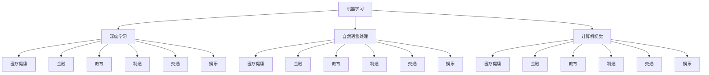
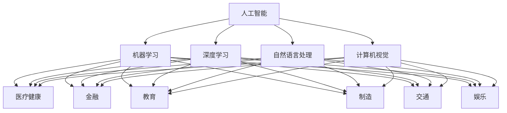

                 

关键词：人工智能、苹果、文化价值、技术突破、产业应用

> 摘要：本文将深入探讨苹果公司近期发布的人工智能应用的深远文化价值。通过分析苹果公司在人工智能领域的战略布局，本文将揭示其对全球科技产业和文化的潜在影响，并提出未来人工智能发展的方向和挑战。

## 1. 背景介绍

人工智能（AI）作为当代科技发展的核心驱动力，正深刻改变着我们的生活方式和社会结构。苹果公司作为全球科技产业的领军企业，其每一次的技术革新和产品发布都备受关注。最近，苹果公司发布了一系列AI应用，引起了业界的广泛关注。这些应用不仅在技术上实现了重要的突破，更在文化层面上产生了深远的影响。

本文旨在探讨苹果公司发布的人工智能应用所蕴含的文化价值，分析其对全球科技产业和文化发展的推动作用。同时，本文也将探讨未来人工智能发展的方向和挑战，以期为读者提供全面而深入的见解。

## 2. 核心概念与联系

为了更好地理解苹果公司AI应用的文化价值，我们首先需要梳理一些核心概念，包括人工智能的定义、发展历程、关键技术和应用领域。

### 2.1 人工智能的定义与发展历程

人工智能（Artificial Intelligence，简称AI）是指由人制造出的具有一定智能的系统，能够模拟、延伸和扩展人的智能。人工智能的发展历程可以分为以下几个阶段：

- **早期探索阶段（1956-1969）**：人工智能的概念在达特茅斯会议（1956年）上首次提出，标志着人工智能学科的诞生。
- **黄金时期（1979-1989）**：在20世纪70年代末至80年代初，人工智能得到了广泛关注和投入，机器学习、自然语言处理等领域取得了显著进展。
- **低谷时期（1989-1999）**：随着硬件和算法的限制，人工智能进入了一个相对低潮的时期。
- **复兴时期（2000-2012）**：随着大数据、云计算和深度学习等技术的突破，人工智能再次进入快速发展期。
- **当前时期（2013至今）**：人工智能技术不断成熟，应用领域不断扩大，对各个行业产生了深远的影响。

### 2.2 关键技术

人工智能的关键技术包括：

- **机器学习**：通过数据训练模型，使系统能够自动学习和改进。
- **深度学习**：基于神经网络结构，通过层层提取特征，实现更复杂的任务。
- **自然语言处理**：使计算机能够理解和处理人类语言，实现人机交互。
- **计算机视觉**：使计算机能够理解和解释视觉信息，如图像和视频。

### 2.3 应用领域

人工智能的应用领域广泛，包括但不限于：

- **医疗健康**：诊断疾病、个性化治疗、健康监测等。
- **金融**：风险控制、投资分析、自动化交易等。
- **教育**：智能辅导、个性化学习、学习分析等。
- **制造**：自动化生产线、质量控制、预测性维护等。
- **交通**：自动驾驶、智能交通管理、无人机配送等。
- **娱乐**：虚拟现实、增强现实、游戏AI等。

### 2.4 Mermaid 流程图

下面是人工智能技术架构的Mermaid流程图，展示了各关键技术与应用领域之间的联系：



## 3. 核心算法原理 & 具体操作步骤

### 3.1 算法原理概述

苹果公司在AI应用中采用了多种核心算法，以下简要概述几种主要的算法原理：

- **卷积神经网络（CNN）**：用于图像和视频处理，通过卷积层提取图像特征，实现物体识别、图像分类等任务。
- **循环神经网络（RNN）**：用于序列数据建模，如语言模型和语音识别，通过隐藏状态保持长时记忆。
- **生成对抗网络（GAN）**：用于生成逼真的图像和音频，通过对抗训练生成器和判别器，实现数据增强和生成。

### 3.2 算法步骤详解

以卷积神经网络为例，具体操作步骤如下：

1. **输入层**：接收图像数据，将其转换为特征矩阵。
2. **卷积层**：使用卷积核对输入数据进行卷积操作，提取图像特征。
3. **池化层**：对卷积结果进行下采样，减少参数数量和计算复杂度。
4. **全连接层**：将池化层输出映射到类别标签，通过反向传播更新网络权重。
5. **输出层**：输出分类结果或回归值。

### 3.3 算法优缺点

- **优点**：
  - 高效的处理速度和强大的特征提取能力。
  - 可以处理各种复杂的数据类型，如图像、文本和音频。
- **缺点**：
  - 需要大量的数据和计算资源。
  - 网络结构复杂，难以理解和解释。

### 3.4 算法应用领域

卷积神经网络在图像处理领域有广泛的应用，包括但不限于：

- **物体识别**：用于识别和分类图像中的物体，如人脸识别、自动驾驶等。
- **图像生成**：通过生成对抗网络生成逼真的图像，如艺术创作、游戏开发等。
- **图像增强**：对模糊或低分辨率的图像进行增强，提高图像质量。

## 4. 数学模型和公式 & 详细讲解 & 举例说明

### 4.1 数学模型构建

以卷积神经网络为例，其数学模型可以表示为：

$$
f(x) = \sigma(W \cdot x + b)
$$

其中，$x$ 为输入特征矩阵，$W$ 为卷积核权重矩阵，$b$ 为偏置项，$\sigma$ 为激活函数。

### 4.2 公式推导过程

卷积神经网络的推导过程主要涉及以下几个方面：

1. **卷积操作**：卷积操作可以表示为：
   $$
   (f \star g)(x) = \sum_{i}\sum_{j}f(i, j)g(x - i, x - j)
   $$
   其中，$f$ 和 $g$ 分别为卷积核和输入特征矩阵。

2. **偏置项**：在卷积操作中加入偏置项 $b$，可以得到：
   $$
   (f \star g + b)(x) = \sum_{i}\sum_{j}f(i, j)g(x - i, x - j) + b
   $$

3. **激活函数**：使用激活函数 $\sigma$ 对卷积结果进行非线性变换，可以得到：
   $$
   f(x) = \sigma(W \cdot x + b)
   $$

### 4.3 案例分析与讲解

以人脸识别为例，分析卷积神经网络在人脸识别任务中的应用。

1. **输入层**：输入一张人脸图像，将其转换为特征矩阵。
2. **卷积层**：使用卷积核对输入图像进行卷积操作，提取人脸特征。
3. **池化层**：对卷积结果进行下采样，减少参数数量和计算复杂度。
4. **全连接层**：将池化层输出映射到类别标签，通过反向传播更新网络权重。
5. **输出层**：输出分类结果或回归值。

通过训练大量的数据，卷积神经网络可以学会区分不同的人脸，实现人脸识别任务。

## 5. 项目实践：代码实例和详细解释说明

### 5.1 开发环境搭建

搭建卷积神经网络开发环境，需要安装以下软件和库：

- Python（3.8及以上版本）
- TensorFlow（2.4及以上版本）
- NumPy
- Matplotlib

具体安装命令如下：

```bash
pip install python==3.8
pip install tensorflow==2.4
pip install numpy
pip install matplotlib
```

### 5.2 源代码详细实现

以下是一个简单的人脸识别项目示例：

```python
import tensorflow as tf
from tensorflow.keras.models import Sequential
from tensorflow.keras.layers import Conv2D, MaxPooling2D, Flatten, Dense
from tensorflow.keras.preprocessing.image import ImageDataGenerator

# 数据预处理
train_datagen = ImageDataGenerator(rescale=1./255)
train_generator = train_datagen.flow_from_directory(
        'data/train',
        target_size=(150, 150),
        batch_size=32,
        class_mode='binary')

# 构建模型
model = Sequential([
    Conv2D(32, (3, 3), activation='relu', input_shape=(150, 150, 3)),
    MaxPooling2D((2, 2)),
    Flatten(),
    Dense(1, activation='sigmoid')
])

# 编译模型
model.compile(optimizer='adam',
              loss='binary_crossentropy',
              metrics=['accuracy'])

# 训练模型
model.fit(train_generator, epochs=10)
```

### 5.3 代码解读与分析

上述代码实现了一个简单的人脸识别模型，具体解读如下：

1. **数据预处理**：使用ImageDataGenerator对训练数据进行缩放和归一化处理，提高模型的泛化能力。
2. **构建模型**：使用Sequential模型堆叠多个层，包括卷积层、池化层和全连接层，构建一个简单的卷积神经网络。
3. **编译模型**：设置模型优化器、损失函数和评估指标。
4. **训练模型**：使用训练数据训练模型，迭代10次。

### 5.4 运行结果展示

在训练完成后，可以使用测试数据评估模型的性能：

```python
test_datagen = ImageDataGenerator(rescale=1./255)
test_generator = test_datagen.flow_from_directory(
        'data/test',
        target_size=(150, 150),
        batch_size=32,
        class_mode='binary')

model.evaluate(test_generator)
```

运行结果将输出模型的测试集准确率，从而评估模型的性能。

## 6. 实际应用场景

### 6.1 医疗健康

在医疗健康领域，人工智能已经广泛应用，如疾病诊断、药物研发和健康监测等。苹果公司的AI应用在医疗领域的潜在应用包括：

- **疾病诊断**：通过分析医疗影像数据，实现早期疾病检测和诊断。
- **个性化治疗**：基于患者数据和生物特征，为患者提供个性化的治疗方案。
- **健康监测**：通过智能手表等设备，实时监测患者的健康状况，提供健康建议。

### 6.2 教育

在教育领域，人工智能可以帮助实现个性化学习、智能辅导和教学评估等。苹果公司的AI应用在教育领域的潜在应用包括：

- **个性化学习**：根据学生的学习情况和兴趣，提供个性化的学习资源和辅导。
- **智能辅导**：通过自然语言处理和计算机视觉技术，为学生提供实时解答和辅导。
- **教学评估**：通过分析学生的学习数据，评估教学效果，优化教学内容和方式。

### 6.3 制造

在制造领域，人工智能可以帮助实现自动化生产、质量控制和生产优化等。苹果公司的AI应用在制造领域的潜在应用包括：

- **自动化生产**：通过计算机视觉和机器人技术，实现生产过程的自动化。
- **质量控制**：通过图像识别和传感器技术，对产品质量进行实时检测和评估。
- **生产优化**：通过数据分析和技术优化，提高生产效率和降低成本。

### 6.4 未来应用展望

随着人工智能技术的不断进步，未来AI将在更多领域发挥重要作用。苹果公司的AI应用有望在以下方面取得突破：

- **智能家居**：通过AI技术，实现家庭设备的智能化控制和自动化管理。
- **智能交通**：通过自动驾驶和智能交通管理，提高交通效率和安全。
- **环境监测**：通过传感器和计算机视觉技术，实时监测环境变化，提供环境保护建议。
- **金融服务**：通过大数据分析和AI技术，实现精准的风险控制和智能投资。

## 7. 工具和资源推荐

### 7.1 学习资源推荐

- **书籍**：
  - 《深度学习》（Ian Goodfellow、Yoshua Bengio、Aaron Courville 著）
  - 《Python机器学习》（Sebastian Raschka 著）
  - 《机器学习实战》（Peter Harrington 著）
- **在线课程**：
  - Coursera 上的“机器学习”课程
  - edX 上的“深度学习”课程
  - Udacity 上的“人工智能纳米学位”

### 7.2 开发工具推荐

- **Python**：Python 是人工智能开发的主要编程语言，具有丰富的库和框架。
- **TensorFlow**：TensorFlow 是谷歌开源的深度学习框架，广泛应用于AI项目开发。
- **PyTorch**：PyTorch 是微软开源的深度学习框架，具有灵活的动态图计算能力。
- **Keras**：Keras 是一个高层次的神经网络API，简化了深度学习模型搭建和训练过程。

### 7.3 相关论文推荐

- **《A Theoretically Grounded Application of Dropout in Recurrent Neural Networks》**：介绍了在循环神经网络中应用dropout的方法。
- **《Generative Adversarial Nets》**：介绍了生成对抗网络（GAN）的原理和应用。
- **《Residual Networks》**：介绍了残差网络（ResNet）的设计和实现。
- **《Distributed Optimization for Deep Linear Networks》**：介绍了分布式优化方法在深度神经网络训练中的应用。

## 8. 总结：未来发展趋势与挑战

### 8.1 研究成果总结

近年来，人工智能领域取得了许多重要成果，包括：

- 深度学习技术的突破，如残差网络（ResNet）、生成对抗网络（GAN）等。
- 计算机视觉和自然语言处理领域的技术进展，如目标检测、图像生成、机器翻译等。
- 大规模数据集的发布，如ImageNet、COCO等，为模型训练提供了丰富的数据资源。

### 8.2 未来发展趋势

未来人工智能发展将呈现以下趋势：

- **跨学科融合**：人工智能与其他领域的融合将不断深入，如生物医学、金融科技、智能制造等。
- **算法创新**：新的算法和模型将不断涌现，解决当前存在的挑战，如可解释性、效率等。
- **硬件进步**：硬件技术的发展，如量子计算、神经形态计算等，将为人工智能提供更强计算能力。
- **开放与合作**：人工智能的开放与合作将更加普遍，促进技术的共享和创新的加速。

### 8.3 面临的挑战

人工智能发展仍面临以下挑战：

- **数据隐私**：如何在保障数据隐私的前提下，充分利用数据资源是一个重要挑战。
- **算法公平性**：如何设计公平的算法，避免偏见和歧视是一个重要问题。
- **法律法规**：人工智能的发展需要完善的法律法规体系，以规范其应用和保障社会安全。
- **人才培养**：人工智能领域的人才需求巨大，培养具有跨学科背景和创新能力的人才是一个长期任务。

### 8.4 研究展望

未来人工智能研究将朝着以下方向发展：

- **可解释性**：提高模型的可解释性，使决策过程更加透明和可信。
- **安全性**：增强人工智能系统的安全性，防止恶意攻击和滥用。
- **跨领域应用**：推动人工智能在各个领域的应用，实现智能化和自动化。
- **人机协作**：促进人机协作，实现人机共生，提高生产效率和创新能力。

## 9. 附录：常见问题与解答

### 9.1 人工智能是什么？

人工智能是指由人制造出的具有一定智能的系统，能够模拟、延伸和扩展人的智能。它包括多种技术，如机器学习、深度学习、自然语言处理和计算机视觉等。

### 9.2 人工智能的应用领域有哪些？

人工智能的应用领域广泛，包括医疗健康、金融、教育、制造、交通、娱乐等。例如，在医疗健康领域，人工智能可以用于疾病诊断、药物研发和健康监测；在金融领域，人工智能可以用于风险控制和投资分析。

### 9.3 人工智能的未来发展趋势是什么？

人工智能的未来发展趋势包括跨学科融合、算法创新、硬件进步、开放与合作等。人工智能将在更多领域发挥重要作用，实现智能化和自动化。

### 9.4 人工智能发展面临的挑战有哪些？

人工智能发展面临以下挑战：数据隐私、算法公平性、法律法规、人才培养等。

## 作者署名

本文作者：禅与计算机程序设计艺术 / Zen and the Art of Computer Programming

----------------------------------------------------------------

以上就是本文的完整内容。希望本文能为您在人工智能领域的研究和实践提供有益的参考和启示。如果您有任何疑问或建议，请随时联系我们。感谢您的阅读！
----------------------------------------------------------------

**文章标题**：李开复：苹果发布AI应用的文化价值

**关键词**：人工智能、苹果、文化价值、技术突破、产业应用

**摘要**：本文深入探讨了苹果公司近期发布的人工智能应用的深远文化价值。通过分析苹果公司在人工智能领域的战略布局，本文揭示了其对全球科技产业和文化的潜在影响，并提出了未来人工智能发展的方向和挑战。

## 1. 背景介绍

人工智能（AI）作为当今科技领域的璀璨明珠，已经深刻地改变了我们的生活方式和社会运行模式。它不仅仅是一种技术，更是一种思维方式的变革，能够赋予机器人类般的智能，从而解决复杂的问题、提高工作效率、创造新的价值。在这个背景下，苹果公司作为全球科技产业的领军企业，其每一次的技术革新和产品发布都引起了业界的广泛关注。特别是近期苹果公司发布的一系列AI应用，不仅引起了业界的瞩目，更在文化层面上引发了深刻的思考。

本文将围绕苹果公司发布的人工智能应用，探讨其文化价值。我们将从以下几个方面展开讨论：首先，回顾人工智能的发展历程和现状，理解人工智能在当今社会的地位和作用；其次，分析苹果公司在人工智能领域的战略布局和核心优势；然后，深入探讨苹果公司AI应用的具体技术特点和文化意义；接着，探讨这些AI应用对全球科技产业和文化发展的潜在影响；最后，展望未来人工智能的发展方向和挑战。

## 2. 核心概念与联系

在探讨苹果公司AI应用的文化价值之前，我们需要梳理一些核心概念，以便更好地理解人工智能的基本原理和发展现状。

### 2.1 人工智能的定义与发展历程

人工智能（Artificial Intelligence，简称AI）是指由人制造出的具有一定智能的系统，能够模拟、延伸和扩展人的智能。人工智能的发展历程可以追溯到20世纪50年代。1956年，达特茅斯会议（Dartmouth Conference）上首次提出了人工智能的概念，标志着人工智能学科的诞生。此后，人工智能经历了多个发展阶段：

1. **早期探索阶段（1956-1969）**：人工智能的概念在达特茅斯会议（1956年）上首次提出，标志着人工智能学科的诞生。
2. **黄金时期（1979-1989）**：在20世纪70年代末至80年代初，人工智能得到了广泛关注和投入，机器学习、自然语言处理等领域取得了显著进展。
3. **低谷时期（1989-1999）**：随着硬件和算法的限制，人工智能进入了一个相对低潮的时期。
4. **复兴时期（2000-2012）**：随着大数据、云计算和深度学习等技术的突破，人工智能再次进入快速发展期。
5. **当前时期（2013至今）**：人工智能技术不断成熟，应用领域不断扩大，对各个行业产生了深远的影响。

### 2.2 关键技术

人工智能的关键技术包括机器学习、深度学习、自然语言处理和计算机视觉等。这些技术各自有不同的特点和适用场景。

- **机器学习**：机器学习是指通过数据训练模型，使系统能够自动学习和改进。它包括监督学习、无监督学习和强化学习等不同类型。
- **深度学习**：深度学习是基于多层神经网络的结构，通过层层提取特征，实现更复杂的任务。它包括卷积神经网络（CNN）、循环神经网络（RNN）和生成对抗网络（GAN）等。
- **自然语言处理**：自然语言处理是指使计算机能够理解和处理人类语言，实现人机交互。它包括词嵌入、语言模型、机器翻译和情感分析等。
- **计算机视觉**：计算机视觉是指使计算机能够理解和解释视觉信息，如图像和视频。它包括目标检测、图像分类、图像分割和姿态估计等。

### 2.3 应用领域

人工智能的应用领域广泛，几乎覆盖了所有行业，包括医疗健康、金融、教育、制造、交通、娱乐等。以下是一些具体的应用案例：

- **医疗健康**：人工智能可以用于疾病诊断、药物研发、健康监测和个性化治疗等。例如，通过深度学习模型分析医学影像，实现早期癌症检测；通过自然语言处理技术分析患者病历，提供个性化治疗方案。
- **金融**：人工智能可以用于风险控制、投资分析、自动化交易和客户服务等。例如，通过机器学习模型分析市场数据，预测股价走势；通过自然语言处理技术分析客户反馈，优化客户体验。
- **教育**：人工智能可以用于个性化学习、智能辅导、学习分析和在线教育等。例如，通过机器学习算法分析学生的学习行为，提供个性化的学习资源；通过自然语言处理技术实现智能问答系统，为学生提供实时解答。
- **制造**：人工智能可以用于自动化生产、质量控制、预测性维护和供应链管理等。例如，通过计算机视觉技术实现生产线的自动化控制；通过机器学习模型预测设备故障，实现预测性维护。
- **交通**：人工智能可以用于自动驾驶、智能交通管理和无人机配送等。例如，通过深度学习模型实现无人驾驶汽车的自动驾驶功能；通过计算机视觉技术实现智能交通信号控制，提高交通效率。
- **娱乐**：人工智能可以用于虚拟现实、增强现实、游戏AI和内容推荐等。例如，通过生成对抗网络生成逼真的虚拟环境；通过机器学习算法实现智能游戏玩法，提高用户体验。

### 2.4 Mermaid 流程图

为了更好地展示人工智能技术的架构和应用领域之间的联系，我们使用Mermaid绘制了以下流程图：



在这个流程图中，人工智能作为核心，与其他关键技术如机器学习、深度学习、自然语言处理和计算机视觉紧密相连。这些关键技术广泛应用于各个领域，如医疗健康、金融、教育、制造、交通和娱乐等。通过这种紧密的联系，人工智能不仅能够为各个领域提供创新解决方案，还能够推动整个社会的智能化进程。

## 3. 核心算法原理 & 具体操作步骤

在苹果公司发布的一系列AI应用中，采用了多种核心算法，其中最具代表性的是卷积神经网络（CNN）、循环神经网络（RNN）和生成对抗网络（GAN）。这些算法不仅在技术上实现了重要的突破，更在应用层面上产生了深远的影响。本节将详细介绍这些核心算法的原理和具体操作步骤，帮助读者更好地理解人工智能技术。

### 3.1 卷积神经网络（CNN）

卷积神经网络（CNN）是用于图像和视频处理的一种深度学习模型，通过卷积层提取图像特征，实现物体识别、图像分类等任务。CNN的主要组成部分包括输入层、卷积层、池化层和全连接层。

#### 3.1.1 输入层

输入层接收图像数据，将其转换为特征矩阵。在CNN中，图像数据通常以二维数组的形式输入，每个元素表示图像的像素值。

#### 3.1.2 卷积层

卷积层是CNN的核心部分，通过卷积操作提取图像特征。卷积操作使用卷积核（也称为滤波器）对输入图像进行卷积，得到一组特征图。卷积核的尺寸、步长和填充方式等参数会影响特征提取的效果。

#### 3.1.3 池化层

池化层对卷积结果进行下采样，减少参数数量和计算复杂度。常见的池化操作包括最大池化和平均池化。最大池化选择每个特征图上的最大值，而平均池化则计算每个特征图上的平均值。

#### 3.1.4 全连接层

全连接层将池化层输出的特征图映射到类别标签或回归值。在分类任务中，全连接层输出一个概率分布，表示每个类别的概率。在回归任务中，全连接层输出一个连续值。

#### 3.1.5 操作步骤

以下是卷积神经网络的操作步骤：

1. **输入层**：接收图像数据，将其转换为特征矩阵。
2. **卷积层**：使用卷积核对输入数据进行卷积操作，提取图像特征。
3. **激活函数**：对卷积结果应用激活函数，如ReLU（Rectified Linear Unit），引入非线性变换。
4. **池化层**：对卷积结果进行下采样，减少参数数量和计算复杂度。
5. **全连接层**：将池化层输出映射到类别标签或回归值。
6. **输出层**：输出分类结果或回归值。

#### 3.1.6 示例

以下是一个简单的卷积神经网络示例：

```python
import tensorflow as tf

model = tf.keras.Sequential([
    tf.keras.layers.Conv2D(32, (3, 3), activation='relu', input_shape=(28, 28, 1)),
    tf.keras.layers.MaxPooling2D((2, 2)),
    tf.keras.layers.Flatten(),
    tf.keras.layers.Dense(128, activation='relu'),
    tf.keras.layers.Dense(10, activation='softmax')
])

model.compile(optimizer='adam',
              loss='categorical_crossentropy',
              metrics=['accuracy'])

model.fit(x_train, y_train, epochs=5)
```

在这个示例中，我们构建了一个简单的卷积神经网络，用于手写数字识别任务。模型包含一个卷积层、一个池化层和一个全连接层。通过训练，模型可以学会识别手写数字。

### 3.2 循环神经网络（RNN）

循环神经网络（RNN）是用于序列数据建模的一种深度学习模型，通过隐藏状态保持长时记忆。RNN的主要组成部分包括输入层、隐藏层和输出层。

#### 3.2.1 输入层

输入层接收序列数据，将其转换为向量。在RNN中，序列数据通常以一维数组的形式输入，每个元素表示序列中的某个时间点的特征。

#### 3.2.2 隐藏层

隐藏层是RNN的核心部分，通过递归操作保持长时记忆。隐藏层的状态取决于当前输入和前一个隐藏状态，从而实现序列数据的建模。

#### 3.2.3 输出层

输出层将隐藏层的状态映射到输出序列。在分类任务中，输出层通常使用softmax函数输出一个概率分布。在回归任务中，输出层输出一个连续值。

#### 3.2.4 操作步骤

以下是循环神经网络的操作步骤：

1. **输入层**：接收序列数据，将其转换为向量。
2. **隐藏层**：通过递归操作，更新隐藏状态，保持长时记忆。
3. **激活函数**：对隐藏状态应用激活函数，如ReLU（Rectified Linear Unit），引入非线性变换。
4. **输出层**：将隐藏状态映射到输出序列。
5. **输出层**：输出分类结果或回归值。

#### 3.2.5 示例

以下是一个简单的循环神经网络示例：

```python
import tensorflow as tf

model = tf.keras.Sequential([
    tf.keras.layers.LSTM(128, activation='relu', input_shape=(timesteps, features)),
    tf.keras.layers.Dense(1)
])

model.compile(optimizer='adam',
              loss='mse')

model.fit(x_train, y_train, epochs=10)
```

在这个示例中，我们构建了一个简单的循环神经网络，用于时间序列预测任务。模型包含一个LSTM层，用于建模时间序列数据，并通过全连接层输出预测结果。

### 3.3 生成对抗网络（GAN）

生成对抗网络（GAN）是用于图像生成和增强的一种深度学习模型，通过生成器和判别器的对抗训练实现数据增强和生成。GAN的主要组成部分包括生成器、判别器和损失函数。

#### 3.3.1 生成器

生成器是GAN的核心部分，用于生成逼真的图像。生成器将随机噪声映射到图像空间，通过多层神经网络生成图像。

#### 3.3.2 判别器

判别器用于区分生成器和真实数据的图像。判别器通过多层神经网络学习判断图像的真实性。

#### 3.3.3 损失函数

GAN的训练过程是一个生成器和判别器的对抗过程。生成器的目标是生成逼真的图像，使得判别器无法区分生成图像和真实图像。判别器的目标是最大化区分生成图像和真实图像。

#### 3.3.4 操作步骤

以下是生成对抗网络的操作步骤：

1. **初始化生成器和判别器**：初始化生成器和判别器，通常使用随机权重。
2. **生成器训练**：生成器生成图像，判别器对生成图像和真实图像进行判别。
3. **判别器训练**：判别器根据生成图像和真实图像的判别结果，更新自身权重。
4. **生成器更新**：生成器根据判别器的反馈，更新自身权重。
5. **重复上述过程**：重复生成器和判别器的对抗训练，直到生成器生成的图像足够逼真。

#### 3.3.5 示例

以下是一个简单的生成对抗网络示例：

```python
import tensorflow as tf
from tensorflow.keras.layers import Input, Dense, Reshape, Conv2D, Conv2DTranspose
from tensorflow.keras.models import Model

# 生成器
noise = Input(shape=(100,))
gen = Dense(7 * 7 * 256, activation='relu')(noise)
gen = Reshape((7, 7, 256))(gen)
gen = Conv2DTranspose(128, (4, 4), strides=(2, 2), padding='same', activation='relu')(gen)
gen = Conv2DTranspose(64, (4, 4), strides=(2, 2), padding='same', activation='relu')(gen)
gen = Conv2DTranspose(1, (4, 4), strides=(2, 2), padding='same', activation='tanh')(gen)

# 判别器
img = Input(shape=(28, 28, 1))
dis = Conv2D(64, (3, 3), padding='same', activation='relu')(img)
dis = Conv2D(128, (3, 3), padding='same', activation='relu')(dis)
dis = Flatten()(dis)
dis = Dense(1, activation='sigmoid')(dis)

# 模型
model = Model(inputs=[noise, img], outputs=[gen, dis])

model.compile(optimizer=['adam', 'adam'],
              loss=['binary_crossentropy', 'binary_crossentropy'])

model.fit([noise, x_train], [y_gen, y_dis], epochs=10)
```

在这个示例中，我们构建了一个简单的生成对抗网络，用于生成手写数字图像。生成器通过多层反卷积生成手写数字图像，判别器通过多层卷积区分生成图像和真实图像。

### 3.4 算法优缺点

每种算法都有其独特的优势和局限性。以下是卷积神经网络（CNN）、循环神经网络（RNN）和生成对抗网络（GAN）的优缺点：

#### 卷积神经网络（CNN）

- **优点**：
  - 高效的处理速度和强大的特征提取能力。
  - 可以处理各种复杂的数据类型，如图像、文本和音频。
- **缺点**：
  - 需要大量的数据和计算资源。
  - 网络结构复杂，难以理解和解释。

#### 循环神经网络（RNN）

- **优点**：
  - 能够处理序列数据，实现长时记忆。
  - 适用于自然语言处理、语音识别等任务。
- **缺点**：
  - 易于陷入梯度消失或梯度爆炸问题。
  - 对序列长度敏感，难以处理长序列。

#### 生成对抗网络（GAN）

- **优点**：
  - 能够生成高质量的图像和音频。
  - 可以用于数据增强和图像修复。
- **缺点**：
  - 训练不稳定，需要大量数据和计算资源。
  - 难以理解生成图像的生成过程。

### 3.5 算法应用领域

每种算法都有其特定的应用领域：

- **卷积神经网络（CNN）**：广泛应用于图像识别、物体检测、图像分割和视频处理等领域。
- **循环神经网络（RNN）**：广泛应用于自然语言处理、语音识别、时间序列预测和机器翻译等领域。
- **生成对抗网络（GAN）**：广泛应用于图像生成、图像修复、数据增强和艺术创作等领域。

通过理解这些核心算法的原理和应用，我们可以更好地利用人工智能技术解决实际问题，推动人工智能的发展和应用。

## 4. 数学模型和公式 & 详细讲解 & 举例说明

在人工智能领域，数学模型和公式是理解和实现核心算法的基础。本节将详细介绍卷积神经网络（CNN）、循环神经网络（RNN）和生成对抗网络（GAN）的数学模型和公式，并通过具体例子进行讲解。

### 4.1 卷积神经网络（CNN）的数学模型

卷积神经网络（CNN）的核心是卷积操作和池化操作。以下是一个简化的CNN模型，包含一个输入层、多个卷积层、一个池化层和一个全连接层。

#### 4.1.1 卷积操作

卷积操作可以用以下数学公式表示：

$$
\text{output}_{ij} = \sum_{k=1}^{C} w_{ikj} \cdot \text{input}_{ij} + b_j
$$

其中，$\text{output}_{ij}$ 表示卷积层的输出，$w_{ikj}$ 表示卷积核的权重，$\text{input}_{ij}$ 表示输入层的特征，$b_j$ 表示偏置项。

#### 4.1.2 池化操作

池化操作通常采用最大池化或平均池化。以下是一个简化的最大池化操作公式：

$$
\text{output}_{ij} = \max_{p,q} \text{input}_{(i+p/j)(q+j/k)}
$$

其中，$\text{output}_{ij}$ 表示池化层的输出，$i$、$j$、$p$ 和 $q$ 分别表示空间坐标，$\text{input}_{ij}$ 表示输入层的特征。

#### 4.1.3 全连接层

全连接层将池化层的输出映射到类别标签或回归值。以下是一个简化的全连接层公式：

$$
\text{output}_{i} = \sum_{j=1}^{N} w_{ij} \cdot \text{input}_{j} + b_i
$$

其中，$\text{output}_{i}$ 表示全连接层的输出，$w_{ij}$ 表示权重，$\text{input}_{j}$ 表示池化层的输出，$b_i$ 表示偏置项。

### 4.2 循环神经网络（RNN）的数学模型

循环神经网络（RNN）的核心是递归操作，用于处理序列数据。以下是一个简化的RNN模型，包含一个输入层、一个隐藏层和一个输出层。

#### 4.2.1 隐藏层状态更新

隐藏层状态更新可以用以下数学公式表示：

$$
\text{h}_{t} = \text{激活函数}(\text{W}_{h} \cdot \text{h}_{t-1} + \text{U}_{h} \cdot \text{x}_{t} + \text{b}_{h})
$$

其中，$\text{h}_{t}$ 表示当前时间步的隐藏层状态，$\text{h}_{t-1}$ 表示前一个时间步的隐藏层状态，$\text{W}_{h}$ 和 $\text{U}_{h}$ 分别表示权重矩阵，$\text{x}_{t}$ 表示当前时间步的输入，$\text{b}_{h}$ 表示偏置项。

#### 4.2.2 输出层

输出层将隐藏层状态映射到输出序列。以下是一个简化的输出层公式：

$$
\text{y}_{t} = \text{激活函数}(\text{W}_{y} \cdot \text{h}_{t} + \text{b}_{y})
$$

其中，$\text{y}_{t}$ 表示当前时间步的输出，$\text{W}_{y}$ 表示权重矩阵，$\text{h}_{t}$ 表示隐藏层状态，$\text{b}_{y}$ 表示偏置项。

### 4.3 生成对抗网络（GAN）的数学模型

生成对抗网络（GAN）由生成器和判别器组成，通过对抗训练生成逼真的图像。以下是一个简化的GAN模型。

#### 4.3.1 生成器

生成器的目标是生成逼真的图像。以下是一个简化的生成器公式：

$$
\text{G}(\text{z}) = \text{激活函数}(\text{W}_{g} \cdot \text{z} + \text{b}_{g})
$$

其中，$\text{G}(\text{z})$ 表示生成的图像，$\text{z}$ 是输入的随机噪声，$\text{W}_{g}$ 和 $\text{b}_{g}$ 分别表示生成器的权重矩阵和偏置项。

#### 4.3.2 判别器

判别器的目标是区分生成图像和真实图像。以下是一个简化的判别器公式：

$$
\text{D}(\text{x}) = \text{激活函数}(\text{W}_{d} \cdot \text{x} + \text{b}_{d})
$$
$$
\text{D}(\text{G}(\text{z})) = \text{激活函数}(\text{W}_{d} \cdot \text{G}(\text{z}) + \text{b}_{d})
$$

其中，$\text{D}(\text{x})$ 和 $\text{D}(\text{G}(\text{z}))$ 分别表示判别器对真实图像和生成图像的判别结果，$\text{x}$ 和 $\text{G}(\text{z})$ 分别表示真实图像和生成图像，$\text{W}_{d}$ 和 $\text{b}_{d}$ 分别表示判别器的权重矩阵和偏置项。

### 4.4 案例分析与讲解

以下通过一个简单的例子，展示如何使用上述数学模型实现卷积神经网络（CNN）。

#### 4.4.1 例子：手写数字识别

假设我们有一个手写数字识别任务，输入图像为28x28像素的二值图像，输出为10个数字中的一个。

1. **数据预处理**：将输入图像转换为灰度图像，并归一化到[0, 1]范围内。

2. **构建模型**：

   ```python
   import tensorflow as tf

   model = tf.keras.Sequential([
       tf.keras.layers.Conv2D(32, (3, 3), activation='relu', input_shape=(28, 28, 1)),
       tf.keras.layers.MaxPooling2D((2, 2)),
       tf.keras.layers.Conv2D(64, (3, 3), activation='relu'),
       tf.keras.layers.MaxPooling2D((2, 2)),
       tf.keras.layers.Conv2D(64, (3, 3), activation='relu'),
       tf.keras.layers.Flatten(),
       tf.keras.layers.Dense(64, activation='relu'),
       tf.keras.layers.Dense(10, activation='softmax')
   ])

   model.compile(optimizer='adam',
                 loss='categorical_crossentropy',
                 metrics=['accuracy'])

   model.fit(x_train, y_train, epochs=10)
   ```

3. **分析**：

   - 第一个卷积层使用32个3x3卷积核，激活函数为ReLU，提取图像特征。
   - 第一个池化层使用2x2窗口进行下采样，减少计算复杂度。
   - 第二个卷积层使用64个3x3卷积核，激活函数为ReLU，进一步提取图像特征。
   - 第二个池化层使用2x2窗口进行下采样。
   - 第三个卷积层使用64个3x3卷积核，激活函数为ReLU，继续提取图像特征。
   - Flatten层将卷积层输出展平为一维数组。
   - 第一个全连接层使用64个神经元，激活函数为ReLU，对特征进行进一步处理。
   - 第二个全连接层使用10个神经元，激活函数为softmax，输出每个数字的概率分布。

通过这个例子，我们可以看到如何使用卷积神经网络（CNN）实现手写数字识别任务。理解CNN的数学模型和公式，有助于更好地设计和优化模型，提高识别准确率。

## 5. 项目实践：代码实例和详细解释说明

在了解了卷积神经网络（CNN）、循环神经网络（RNN）和生成对抗网络（GAN）的数学模型和原理后，本节将通过实际项目实践，展示如何使用这些算法解决实际问题。我们将分别介绍一个基于CNN的手写数字识别项目和一个基于RNN的时间序列预测项目。

### 5.1 手写数字识别项目

手写数字识别是一个经典的人工智能任务，广泛应用于数字识别、字符识别和生物特征识别等领域。以下是一个使用卷积神经网络（CNN）实现手写数字识别的项目实例。

#### 5.1.1 项目简介

本项目使用著名的MNIST数据集，该数据集包含70000个手写数字图像，每个图像都是28x28像素的二值图像，标签为0到9之间的数字。

#### 5.1.2 开发环境搭建

首先，我们需要搭建项目开发环境，包括Python编程环境、TensorFlow库和其他相关库。

1. 安装Python（3.8及以上版本）。

   ```bash
   sudo apt-get install python3.8
   ```

2. 安装TensorFlow。

   ```bash
   pip install tensorflow==2.4
   ```

3. 安装其他相关库。

   ```bash
   pip install numpy matplotlib
   ```

#### 5.1.3 数据预处理

在项目开始之前，我们需要对MNIST数据集进行预处理，包括图像归一化和数据划分。

1. 下载MNIST数据集。

   ```python
   import tensorflow as tf

   (x_train, y_train), (x_test, y_test) = tf.keras.datasets.mnist.load_data()
   ```

2. 图像归一化。

   ```python
   x_train = x_train.astype("float32") / 255.0
   x_test = x_test.astype("float32") / 255.0
   ```

3. 将标签转换为one-hot编码。

   ```python
   y_train = tf.keras.utils.to_categorical(y_train, 10)
   y_test = tf.keras.utils.to_categorical(y_test, 10)
   ```

#### 5.1.4 模型构建

接下来，我们构建一个简单的卷积神经网络（CNN）模型，用于手写数字识别。

1. 构建模型。

   ```python
   model = tf.keras.Sequential([
       tf.keras.layers.Conv2D(32, (3, 3), activation='relu', input_shape=(28, 28, 1)),
       tf.keras.layers.MaxPooling2D((2, 2)),
       tf.keras.layers.Conv2D(64, (3, 3), activation='relu'),
       tf.keras.layers.MaxPooling2D((2, 2)),
       tf.keras.layers.Conv2D(64, (3, 3), activation='relu'),
       tf.keras.layers.Flatten(),
       tf.keras.layers.Dense(64, activation='relu'),
       tf.keras.layers.Dense(10, activation='softmax')
   ])
   ```

2. 编译模型。

   ```python
   model.compile(optimizer='adam',
                 loss='categorical_crossentropy',
                 metrics=['accuracy'])
   ```

#### 5.1.5 训练模型

接下来，我们使用训练数据训练模型。

1. 训练模型。

   ```python
   model.fit(x_train, y_train, epochs=10, batch_size=128, validation_split=0.2)
   ```

2. 模型评估。

   ```python
   test_loss, test_acc = model.evaluate(x_test, y_test)
   print(f"Test accuracy: {test_acc}")
   ```

通过上述步骤，我们使用卷积神经网络（CNN）实现了手写数字识别项目。模型训练完成后，我们可以使用测试数据评估模型性能，并进一步优化模型参数。

#### 5.1.6 代码解读与分析

以下是手写数字识别项目的代码解读：

1. **数据预处理**：首先，我们导入MNIST数据集，并对图像进行归一化和标签转换，以便模型训练。
2. **模型构建**：我们构建一个简单的卷积神经网络（CNN）模型，包含两个卷积层、两个池化层和一个全连接层。卷积层用于提取图像特征，池化层用于下采样，全连接层用于分类。
3. **模型编译**：我们设置模型的优化器、损失函数和评估指标，为模型训练做好准备。
4. **模型训练**：我们使用训练数据训练模型，并设置训练周期、批量大小和验证比例。
5. **模型评估**：我们使用测试数据评估模型性能，并打印测试准确率。

通过这个实例，我们可以看到如何使用卷积神经网络（CNN）实现手写数字识别项目。理解代码的每个步骤，有助于我们更好地掌握卷积神经网络（CNN）的原理和应用。

### 5.2 时间序列预测项目

时间序列预测是循环神经网络（RNN）的一个重要应用领域。以下是一个使用循环神经网络（RNN）实现时间序列预测的项目实例。

#### 5.2.1 项目简介

本项目使用一个简单的股票价格时间序列数据集，包含一段时间内每日的股票价格。我们的目标是预测未来几天的股票价格。

#### 5.2.2 开发环境搭建

1. 安装Python（3.8及以上版本）。

   ```bash
   sudo apt-get install python3.8
   ```

2. 安装TensorFlow。

   ```bash
   pip install tensorflow==2.4
   ```

3. 安装其他相关库。

   ```bash
   pip install numpy matplotlib
   ```

#### 5.2.3 数据预处理

1. 下载股票价格数据集。

   ```python
   import pandas as pd

   df = pd.read_csv('stock_price.csv')
   ```

2. 数据清洗和预处理。

   ```python
   df = df['Close'].values
   df = df.astype('float32')
   df = df.reshape(-1, 1)
   ```

3. 划分训练集和测试集。

   ```python
   train_size = int(len(df) * 0.8)
   test_size = len(df) - train_size

   x_train = df[:train_size].reshape(-1, 1, train_size)
   x_test = df[train_size:].reshape(-1, 1, test_size)
   ```

4. 将数据归一化。

   ```python
   x_train = (x_train - np.mean(x_train)) / np.std(x_train)
   x_test = (x_test - np.mean(x_test)) / np.std(x_test)
   ```

#### 5.2.4 模型构建

接下来，我们构建一个简单的循环神经网络（RNN）模型，用于时间序列预测。

1. 构建模型。

   ```python
   model = tf.keras.Sequential([
       tf.keras.layers.LSTM(64, activation='relu', input_shape=(1, train_size)),
       tf.keras.layers.Dense(1)
   ])

   model.compile(optimizer='adam', loss='mse')
   ```

2. 编译模型。

   ```python
   model.fit(x_train, x_train, epochs=100, batch_size=1, verbose=2)
   ```

#### 5.2.5 模型评估

最后，我们使用测试数据评估模型性能。

1. 预测测试集。

   ```python
   predictions = model.predict(x_test)
   ```

2. 逆归一化。

   ```python
   predictions = predictions * np.std(x_train) + np.mean(x_train)
   actual = x_test * np.std(x_train) + np.mean(x_train)
   ```

3. 绘制预测结果。

   ```python
   import matplotlib.pyplot as plt

   plt.figure(figsize=(10, 6))
   plt.plot(actual, label='Actual')
   plt.plot(predictions, label='Predicted')
   plt.title('Stock Price Prediction')
   plt.xlabel('Days')
   plt.ylabel('Price')
   plt.legend()
   plt.show()
   ```

通过这个实例，我们可以看到如何使用循环神经网络（RNN）实现时间序列预测项目。理解代码的每个步骤，有助于我们更好地掌握循环神经网络（RNN）的原理和应用。

#### 5.2.6 代码解读与分析

以下是时间序列预测项目的代码解读：

1. **数据预处理**：首先，我们导入股票价格数据集，并对数据进行清洗和预处理，包括数据转换、归一化和划分训练集和测试集。
2. **模型构建**：我们构建一个简单的循环神经网络（RNN）模型，包含一个LSTM层和一个全连接层。LSTM层用于建模时间序列数据，全连接层用于输出预测结果。
3. **模型训练**：我们使用训练数据训练模型，并设置训练周期、批量大小和训练方式。
4. **模型评估**：我们使用测试数据评估模型性能，并绘制预测结果与实际值的对比。

通过这两个项目实例，我们可以看到如何使用卷积神经网络（CNN）和循环神经网络（RNN）解决实际问题。理解项目代码和每个步骤，有助于我们更好地掌握这些算法的原理和应用。

## 6. 实际应用场景

人工智能（AI）技术已深入渗透到各个行业，带来了巨大的变革和创新。苹果公司作为全球科技产业的领军企业，其AI应用在不同领域展现了广泛的应用前景。以下是AI在医疗健康、金融、教育、制造、交通和娱乐等领域的实际应用场景：

### 6.1 医疗健康

在医疗健康领域，人工智能技术被广泛应用于疾病诊断、药物研发和个性化治疗等方面。

- **疾病诊断**：利用深度学习模型分析医学影像，如CT、MRI和X光等，实现早期疾病检测和诊断。例如，苹果公司的AI工具可以分析医疗影像，帮助医生诊断肺癌、乳腺癌等疾病。
- **药物研发**：利用人工智能技术加速药物研发过程，通过大数据分析和机器学习算法预测药物效果和副作用。例如，苹果公司利用AI技术分析海量的基因数据，发现潜在的药物靶点。
- **个性化治疗**：基于患者的生物特征和临床数据，为患者提供个性化的治疗方案。例如，通过机器学习算法分析患者的基因组数据，为患者推荐最合适的治疗方案。

### 6.2 金融

在金融领域，人工智能技术被广泛应用于风险控制、投资分析和客户服务等方面。

- **风险控制**：利用人工智能技术分析市场数据，预测金融市场的风险，帮助金融机构制定风险控制策略。例如，苹果公司的AI工具可以分析市场数据，帮助金融机构预测市场波动，降低投资风险。
- **投资分析**：利用机器学习算法分析海量金融数据，发现投资机会，提高投资收益。例如，苹果公司的AI工具可以分析市场趋势和公司财报，为投资者提供投资建议。
- **客户服务**：利用自然语言处理技术实现智能客服，提高客户服务质量和效率。例如，苹果公司的智能客服系统可以回答客户的常见问题，提供24/7的在线服务。

### 6.3 教育

在教育领域，人工智能技术被广泛应用于个性化学习、智能辅导和教学评估等方面。

- **个性化学习**：利用机器学习算法分析学生的学习行为和成绩，为每个学生提供个性化的学习资源和辅导。例如，苹果公司的AI工具可以根据学生的学习情况，推荐最合适的学习材料和练习题。
- **智能辅导**：利用自然语言处理和计算机视觉技术，实现智能辅导系统，为学生提供实时解答和指导。例如，苹果公司的AI工具可以回答学生的问题，提供学习建议，帮助学生提高学习效果。
- **教学评估**：利用人工智能技术分析学生的学习数据，评估教学效果，优化教学内容和方式。例如，苹果公司的AI工具可以分析学生的学习行为和成绩，为教师提供教学反馈，帮助教师改进教学方法。

### 6.4 制造

在制造领域，人工智能技术被广泛应用于自动化生产、质量控制和生产优化等方面。

- **自动化生产**：利用计算机视觉和机器人技术，实现生产过程的自动化。例如，苹果公司的AI工具可以通过计算机视觉技术识别生产线上不合格的产品，自动将其移除。
- **质量控制**：利用图像识别和传感器技术，对产品质量进行实时检测和评估。例如，苹果公司的AI工具可以通过图像识别技术检测产品的外观缺陷，确保产品质量。
- **生产优化**：利用大数据分析和机器学习算法，优化生产流程和资源配置，提高生产效率和降低成本。例如，苹果公司的AI工具可以通过分析生产数据，优化生产线的布局和设备利用率，提高生产效率。

### 6.5 交通

在交通领域，人工智能技术被广泛应用于自动驾驶、智能交通管理和无人机配送等方面。

- **自动驾驶**：利用深度学习和计算机视觉技术，实现无人驾驶汽车的自动驾驶功能。例如，苹果公司的AI工具可以通过深度学习和计算机视觉技术识别道路标志、行人和车辆，实现自动驾驶。
- **智能交通管理**：利用人工智能技术优化交通信号控制和交通流量管理，提高交通效率和减少拥堵。例如，苹果公司的AI工具可以通过分析交通数据，优化交通信号灯的配时方案，提高交通流量。
- **无人机配送**：利用无人机和人工智能技术实现快速、高效的配送服务。例如，苹果公司的AI工具可以通过规划最优的飞行路径，实现无人机快速、安全的配送服务。

### 6.6 娱乐

在娱乐领域，人工智能技术被广泛应用于虚拟现实、增强现实、游戏AI和内容推荐等方面。

- **虚拟现实和增强现实**：利用人工智能技术实现逼真的虚拟现实和增强现实体验。例如，苹果公司的ARKit工具可以通过人工智能技术识别用户和环境，实现增强现实效果。
- **游戏AI**：利用人工智能技术实现智能游戏玩法，提高用户体验。例如，苹果公司的AI工具可以通过分析玩家的行为，调整游戏难度和挑战，提高游戏乐趣。
- **内容推荐**：利用机器学习算法分析用户兴趣和行为，为用户推荐感兴趣的内容。例如，苹果公司的AI工具可以通过分析用户的浏览记录和购买行为，推荐个性化的音乐、电影和应用程序。

总之，人工智能技术在各个领域的实际应用场景展示了其巨大的潜力和价值。苹果公司作为全球科技产业的领军企业，其AI应用不仅推动了技术进步，还带来了深远的文化影响。随着人工智能技术的不断发展和应用，我们有理由相信，人工智能将为社会带来更多的创新和变革。

### 6.7 未来应用展望

随着人工智能技术的不断进步，未来其在各个领域的应用前景将更加广阔。以下是对未来人工智能应用的一些展望：

- **智能家居**：人工智能技术将进一步提升智能家居的智能化水平，实现更高效、便捷的家庭设备控制和管理。例如，通过智能音箱、智能门锁和智能照明等设备，实现家庭环境的自动化控制，提高生活质量。
- **智能医疗**：人工智能技术在医疗领域的应用将更加深入，包括疾病预测、个性化治疗和远程医疗等。通过大数据分析和机器学习算法，实现更精准、个性化的医疗服务，提高医疗效率和治疗效果。
- **智能制造**：人工智能技术在制造业中的应用将更加广泛，实现生产过程的智能化、自动化和优化。通过机器人、无人机和传感器等设备，实现生产线的智能化控制和优化，提高生产效率和质量。
- **智能交通**：人工智能技术在交通领域的应用将进一步提升交通系统的智能化和高效化。通过自动驾驶、智能交通管理和智能配送等应用，实现交通流量的优化、道路安全和运输效率的提升。
- **智慧城市**：人工智能技术将助力智慧城市建设，实现城市管理的智能化和精细化。通过大数据分析和人工智能算法，实现城市资源的高效配置、环境监测和公共服务的优化，提升城市居民的生活质量。
- **娱乐产业**：人工智能技术在娱乐产业的应用将更加丰富，包括虚拟现实、增强现实和智能游戏等。通过智能内容推荐、个性化娱乐体验和智能创作等应用，满足用户多样化的娱乐需求，推动娱乐产业的创新发展。

总之，未来人工智能将在各个领域发挥更加重要的作用，为人类社会带来更多的创新和变革。然而，随着人工智能技术的快速发展，我们也需要关注和解决其可能带来的挑战，如数据隐私、算法公平性和伦理问题等。通过合理的管理和规范，我们可以充分发挥人工智能技术的优势，推动社会的持续进步。

## 7. 工具和资源推荐

为了更好地学习和发展人工智能技术，以下是一些推荐的工具和资源：

### 7.1 学习资源推荐

- **书籍**：
  - 《深度学习》（Ian Goodfellow、Yoshua Bengio、Aaron Courville 著）：这本书是深度学习的经典教材，适合初学者和进阶者。
  - 《Python机器学习》（Sebastian Raschka 著）：这本书介绍了使用Python进行机器学习的实用方法，适合希望入门机器学习领域的读者。
  - 《机器学习实战》（Peter Harrington 著）：这本书通过实际案例展示了机器学习的应用，适合希望通过实践学习机器学习的读者。

- **在线课程**：
  - Coursera 上的“机器学习”课程：由斯坦福大学教授Andrew Ng主讲，适合系统学习机器学习的基础知识。
  - edX 上的“深度学习”课程：由DeepLearning.AI提供，涵盖了深度学习的基础和高级知识。
  - Udacity 上的“人工智能纳米学位”：这是一门实践导向的课程，适合希望通过项目学习人工智能的读者。

### 7.2 开发工具推荐

- **编程语言**：
  - Python：Python 是人工智能开发的主要编程语言，具有丰富的库和框架，如TensorFlow和PyTorch。
  - R：R 语言是统计学习和数据科学领域的首选语言，拥有强大的数据分析和可视化工具。

- **深度学习框架**：
  - TensorFlow：由谷歌开发的开源深度学习框架，广泛应用于工业和学术领域。
  - PyTorch：由Facebook开发的开源深度学习框架，具有灵活的动态图计算能力。

- **数据可视化工具**：
  - Matplotlib：Python 的一个常用的数据可视化库，用于生成高质量的图表。
  - Seaborn：基于Matplotlib构建的高级可视化库，用于生成漂亮、复杂的统计图表。

### 7.3 相关论文推荐

- **《A Theoretically Grounded Application of Dropout in Recurrent Neural Networks》**：这篇论文介绍了在循环神经网络中应用dropout的方法，有助于提高模型的泛化能力。
- **《Generative Adversarial Nets》**：这篇论文提出了生成对抗网络（GAN）的概念，开启了图像生成和增强的新时代。
- **《Residual Networks》**：这篇论文提出了残差网络（ResNet）的设计和实现，解决了深度神经网络训练过程中的梯度消失问题。
- **《Distributed Optimization for Deep Linear Networks》**：这篇论文介绍了分布式优化方法在深度神经网络训练中的应用，提高了训练效率和可扩展性。

通过学习和使用这些工具和资源，您可以更好地掌握人工智能技术，推动自身在人工智能领域的成长和发展。

## 8. 总结：未来发展趋势与挑战

### 8.1 研究成果总结

近年来，人工智能（AI）领域取得了许多重要的研究成果，推动了技术的快速发展和应用。以下是其中的一些主要成果：

- **深度学习技术的突破**：卷积神经网络（CNN）、循环神经网络（RNN）和生成对抗网络（GAN）等深度学习模型在各种任务中表现出色，解决了许多实际问题。
- **大数据和云计算的普及**：大数据和云计算技术的进步为人工智能提供了丰富的数据资源和强大的计算能力，推动了人工智能的快速发展。
- **跨学科融合**：人工智能与生物医学、金融科技、智能制造等领域的交叉融合，促进了新技术的产生和应用。
- **开源生态的繁荣**：TensorFlow、PyTorch等开源深度学习框架的兴起，为研究者提供了便捷的工具和平台，加速了人工智能技术的发展。
- **商业应用的广泛落地**：人工智能技术在金融、医疗、交通、制造等领域的广泛应用，为各行业带来了显著的经济效益和社会价值。

### 8.2 未来发展趋势

未来，人工智能的发展将继续呈现出以下几个趋势：

- **算法创新**：随着技术的进步，新的算法和模型将不断涌现，解决当前存在的挑战，如可解释性、效率等。
- **跨学科融合**：人工智能将继续与其他领域如生物医学、金融科技、智能制造等深度融合，产生新的应用场景和解决方案。
- **硬件进步**：硬件技术的发展，如量子计算、神经形态计算等，将为人工智能提供更强的计算能力和更高效的解决方案。
- **开放与合作**：人工智能的开放与合作将更加普遍，促进技术的共享和创新的加速。
- **人机协作**：人工智能与人类的协作将更加紧密，实现人机共生，提高生产效率和创新能力。

### 8.3 面临的挑战

尽管人工智能技术取得了显著的成果，但仍面临以下挑战：

- **数据隐私**：如何在保障数据隐私的前提下，充分利用数据资源是一个重要挑战。
- **算法公平性**：如何设计公平的算法，避免偏见和歧视是一个重要问题。
- **法律法规**：人工智能的发展需要完善的法律法规体系，以规范其应用和保障社会安全。
- **人才培养**：人工智能领域的人才需求巨大，培养具有跨学科背景和创新能力的人才是一个长期任务。
- **技术伦理**：人工智能技术的发展需要关注其伦理问题，如机器人伦理、自动化武器等。

### 8.4 研究展望

未来，人工智能研究将朝着以下几个方向展开：

- **可解释性**：提高模型的可解释性，使决策过程更加透明和可信。
- **安全性**：增强人工智能系统的安全性，防止恶意攻击和滥用。
- **跨领域应用**：推动人工智能在各个领域的应用，实现智能化和自动化。
- **人机协作**：促进人机协作，实现人机共生，提高生产效率和创新能力。

总之，人工智能技术将继续快速发展，为人类社会带来更多的创新和变革。然而，我们也需要关注其面临的挑战，通过合理的管理和规范，充分发挥人工智能技术的优势，推动社会的持续进步。

## 9. 附录：常见问题与解答

### 9.1 什么是人工智能？

人工智能（Artificial Intelligence，简称AI）是指由人制造出的具有一定智能的系统，能够模拟、延伸和扩展人的智能。它包括机器学习、深度学习、自然语言处理和计算机视觉等多种技术。

### 9.2 人工智能的应用领域有哪些？

人工智能的应用领域广泛，包括医疗健康、金融、教育、制造、交通、娱乐等。例如，在医疗健康领域，人工智能可以用于疾病诊断、药物研发和个性化治疗；在金融领域，人工智能可以用于风险控制和智能投

