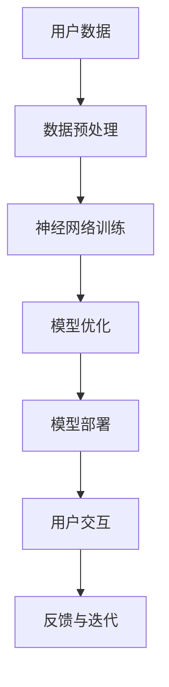

                 

关键词：苹果，AI应用，未来展望，技术趋势，人工智能，深度学习，应用程序开发，用户体验，商业策略。

> 摘要：本文将深入探讨苹果公司近期发布的AI应用，从技术、市场、用户等多个维度，分析其背后的创新理念，展望其未来发展的广阔前景。本文旨在为读者提供一份全面的技术洞察，帮助理解苹果在人工智能领域的战略布局。

## 1. 背景介绍

近年来，人工智能（AI）技术取得了飞速发展，已经在众多行业产生了深远影响。从自动驾驶、智能家居到医疗诊断、金融分析，AI的应用范围不断扩大。在这样的大背景下，苹果公司也在不断探索如何将AI技术融入到其产品中，提升用户体验，增强产品竞争力。

苹果公司此次发布的AI应用，涵盖了语音识别、图像处理、自然语言处理等多个领域，其技术实力和市场潜力引发了业界的广泛关注。本文将重点分析这些AI应用的技术特点、市场策略以及可能带来的社会影响。

### 1.1 苹果AI应用的技术特点

苹果公司在AI领域的技术积累深厚，其在图像识别、自然语言处理等方面的研究成果在业内处于领先地位。此次发布的AI应用，不仅在算法上有所创新，还注重用户隐私保护和数据安全。

首先，苹果的AI应用采用了先进的深度学习技术，通过神经网络模型对大量数据进行训练，从而实现高度精准的识别和预测。例如，在语音识别方面，苹果采用了自研的神经网络架构，使其在识别准确率和响应速度上取得了显著提升。

其次，苹果重视用户隐私和数据安全。在AI应用的开发过程中，苹果采用了端到端加密等技术，确保用户数据在传输和存储过程中的安全性。这种对用户隐私的尊重，不仅赢得了用户的信任，也为苹果在市场竞争中赢得了优势。

### 1.2 市场策略与竞争力

苹果公司在发布AI应用的同时，也推出了一系列市场策略，以提升其在AI领域的竞争力。首先，苹果通过收购AI初创公司、组建AI研究团队等方式，不断强化自身的技术实力。其次，苹果通过与各大高校、研究机构合作，吸引了大量的AI人才加入，为AI应用的开发提供了强大的智力支持。

此外，苹果在市场推广方面也颇具策略。通过在产品中集成AI技术，苹果不仅提升了产品的竞争力，还吸引了更多用户关注和购买。例如，苹果的Siri语音助手、Face ID面部识别等功能，都为用户带来了全新的使用体验。

## 2. 核心概念与联系

在探讨苹果AI应用的未来之前，有必要对其背后的核心概念和架构进行详细解读。以下是一个简化的Mermaid流程图，用于说明苹果AI应用的技术原理和架构：



### 2.1 用户数据

用户数据是AI应用的基础。苹果通过多种渠道收集用户数据，包括设备传感器数据、用户操作行为数据等。这些数据经过预处理后，将用于训练和优化神经网络模型。

### 2.2 数据预处理

数据预处理是确保数据质量的重要环节。苹果采用了多种技术手段，如数据清洗、归一化等，以提高数据的质量和一致性。预处理后的数据将用于训练神经网络模型。

### 2.3 神经网络训练

苹果采用了自研的神经网络架构，对预处理后的数据进行训练。通过不断的迭代和学习，神经网络模型能够对输入数据进行高精度的识别和预测。

### 2.4 模型优化

在模型训练过程中，苹果不断对模型进行优化，以提高其准确率和响应速度。优化后的模型将用于实际部署，为用户提供高效的服务。

### 2.5 模型部署

模型部署是将训练好的神经网络模型部署到实际应用场景中。苹果的AI应用能够快速响应用户请求，提供精准的服务。

### 2.6 用户交互

用户交互是AI应用与用户之间的桥梁。苹果通过用户交互界面，将AI服务的功能呈现给用户，使用户能够方便地使用AI应用。

### 2.7 反馈与迭代

用户在使用AI应用的过程中，会提供反馈信息。这些反馈信息将用于模型的迭代和优化，以提高AI应用的质量和用户体验。

## 3. 核心算法原理 & 具体操作步骤

### 3.1 算法原理概述

苹果的AI应用主要基于深度学习技术。深度学习是一种通过模拟人脑神经网络进行学习和决策的人工智能方法。在深度学习中，神经网络通过层层传递信息，从输入数据中提取特征，并最终生成预测结果。

苹果的深度学习模型采用了卷积神经网络（CNN）和循环神经网络（RNN）等先进架构。CNN擅长处理图像和视频数据，RNN擅长处理序列数据，如语音和文本。通过结合这些神经网络架构，苹果实现了对多种类型数据的精准处理。

### 3.2 算法步骤详解

#### 3.2.1 数据采集与预处理

1. 数据采集：苹果通过设备传感器、用户操作行为等多种渠道收集数据。
2. 数据预处理：对采集到的数据进行清洗、归一化等处理，以提高数据质量。

#### 3.2.2 神经网络模型训练

1. 模型设计：根据数据类型和任务需求，设计合适的神经网络模型。
2. 模型训练：使用预处理后的数据进行训练，调整模型参数，优化模型性能。
3. 模型评估：使用验证集对模型进行评估，调整模型参数，确保模型性能。

#### 3.2.3 模型优化与部署

1. 模型优化：通过交叉验证等技术，进一步优化模型性能。
2. 模型部署：将训练好的模型部署到实际应用场景中，为用户提供服务。

### 3.3 算法优缺点

#### 3.3.1 优点

1. 准确率高：深度学习模型能够从大量数据中提取有效特征，实现高精度的识别和预测。
2. 泛化能力强：通过不断优化模型，可以适应不同的数据集和任务需求。
3. 快速响应：神经网络模型部署在设备端，可以实现快速响应，提升用户体验。

#### 3.3.2 缺点

1. 计算量大：深度学习模型需要大量计算资源，训练和优化过程较为耗时。
2. 需要大量数据：深度学习模型的性能依赖于数据的数量和质量，数据不足可能导致模型性能下降。
3. 难以解释：神经网络模型具有较强的黑箱特性，难以解释模型的决策过程，可能导致用户不信任。

### 3.4 算法应用领域

苹果的AI应用在多个领域具有广泛的应用前景，包括：

1. 语音识别：Siri语音助手已经广泛应用在苹果设备中，提供语音搜索、语音控制等功能。
2. 图像识别：Face ID面部识别技术在苹果设备上得到了广泛应用，用于解锁设备、支付等场景。
3. 自然语言处理：苹果的AI应用能够对用户输入的文本进行理解和分析，提供智能回复、推荐等功能。
4. 自动驾驶：苹果在自动驾驶领域进行了大量研究，有望在未来实现自动驾驶汽车的量产。

## 4. 数学模型和公式 & 详细讲解 & 举例说明

在深度学习模型中，数学模型和公式起到了核心作用。以下将详细介绍苹果AI应用的数学模型，并使用LaTeX格式展示相关公式。

### 4.1 数学模型构建

#### 4.1.1 卷积神经网络（CNN）

卷积神经网络（CNN）是一种专门用于处理图像数据的神经网络。其核心思想是通过卷积操作提取图像的特征。

$$
\text{卷积操作：} \quad \text{f}(x, y) = \sum_{i=1}^{n} w_{i} \cdot x_{i} + b
$$

其中，$x$和$y$是图像上的点，$w_{i}$是权重，$b$是偏置。

#### 4.1.2 循环神经网络（RNN）

循环神经网络（RNN）是一种能够处理序列数据的神经网络。其核心思想是通过循环结构保持对历史信息的记忆。

$$
\text{递归关系：} \quad h_{t} = \sigma(W_{h} \cdot h_{t-1} + W_{x} \cdot x_{t} + b)
$$

其中，$h_{t}$是当前时刻的隐藏状态，$\sigma$是激活函数。

### 4.2 公式推导过程

#### 4.2.1 卷积神经网络（CNN）

卷积神经网络的训练过程主要包括两个步骤：前向传播和反向传播。

1. 前向传播：

$$
\text{输出：} \quad \hat{y} = \sigma(\text{W} \cdot \text{A} + \text{b})
$$

其中，$\text{A}$是输入特征图，$\text{W}$是卷积核，$\text{b}$是偏置，$\hat{y}$是预测结果。

2. 反向传播：

$$
\text{误差：} \quad \delta = \text{d} \odot (\hat{y} - y)
$$

其中，$\text{d}$是输出误差，$y$是真实标签。

#### 4.2.2 循环神经网络（RNN）

循环神经网络的训练过程同样包括前向传播和反向传播。

1. 前向传播：

$$
\text{隐藏状态：} \quad h_{t} = \sigma(W_{h} \cdot [h_{t-1}, x_{t}] + b_{h})
$$

$$
\text{输出：} \quad \hat{y}_{t} = \sigma(W_{y} \cdot h_{t} + b_{y})
$$

其中，$h_{t}$是当前时刻的隐藏状态，$x_{t}$是输入序列，$\sigma$是激活函数。

2. 反向传播：

$$
\text{隐藏状态误差：} \quad \delta_{t} = \text{d} \odot (\hat{y}_{t} - y_{t})
$$

$$
\text{权重更新：} \quad W_{h} \leftarrow W_{h} - \alpha \cdot \frac{\partial J}{\partial W_{h}}
$$

$$
\text{偏置更新：} \quad b_{h} \leftarrow b_{h} - \alpha \cdot \frac{\partial J}{\partial b_{h}}
$$

其中，$\delta_{t}$是隐藏状态误差，$J$是损失函数，$\alpha$是学习率。

### 4.3 案例分析与讲解

#### 4.3.1 语音识别

以苹果的Siri语音助手为例，其语音识别过程可以分解为以下几个步骤：

1. 语音信号预处理：对采集到的语音信号进行降噪、增强等处理，提高信号质量。
2. 分帧：将预处理后的语音信号分割成多个帧。
3. 特征提取：对每个帧进行梅尔频率倒谱系数（MFCC）等特征提取。
4. 模型预测：使用训练好的卷积神经网络（CNN）对特征进行分类预测，得到语音标签。
5. 输出结果：将预测结果转换为文本输出，呈现给用户。

#### 4.3.2 图像识别

以Face ID面部识别为例，其识别过程可以分解为以下几个步骤：

1. 图像预处理：对采集到的面部图像进行灰度化、归一化等处理。
2. 特征提取：使用卷积神经网络（CNN）提取面部图像的特征。
3. 特征匹配：将提取到的特征与数据库中的面部特征进行匹配。
4. 识别结果：根据匹配结果判断用户身份，并执行相应操作。

## 5. 项目实践：代码实例和详细解释说明

### 5.1 开发环境搭建

要实践苹果AI应用的开发，需要搭建以下开发环境：

1. 操作系统：Windows、macOS或Linux。
2. 编程语言：Python。
3. 开发工具：PyCharm、VSCode等。
4. 库与框架：TensorFlow、Keras等。

### 5.2 源代码详细实现

以下是一个简单的示例代码，展示如何使用TensorFlow和Keras构建一个简单的卷积神经网络（CNN）模型：

```python
import tensorflow as tf
from tensorflow.keras import layers

# 定义模型结构
model = tf.keras.Sequential([
    layers.Conv2D(32, (3, 3), activation='relu', input_shape=(28, 28, 1)),
    layers.MaxPooling2D((2, 2)),
    layers.Conv2D(64, (3, 3), activation='relu'),
    layers.MaxPooling2D((2, 2)),
    layers.Conv2D(64, (3, 3), activation='relu'),
    layers.Flatten(),
    layers.Dense(64, activation='relu'),
    layers.Dense(10, activation='softmax')
])

# 编译模型
model.compile(optimizer='adam',
              loss='sparse_categorical_crossentropy',
              metrics=['accuracy'])

# 加载数据集
(x_train, y_train), (x_test, y_test) = tf.keras.datasets.mnist.load_data()

# 数据预处理
x_train = x_train.reshape(-1, 28, 28, 1).astype('float32') / 255
x_test = x_test.reshape(-1, 28, 28, 1).astype('float32') / 255

# 训练模型
model.fit(x_train, y_train, epochs=5)

# 测试模型
test_loss, test_acc = model.evaluate(x_test, y_test, verbose=2)
print('\nTest accuracy:', test_acc)
```

### 5.3 代码解读与分析

1. 导入TensorFlow和Keras库。
2. 定义模型结构，包括卷积层、池化层、全连接层等。
3. 编译模型，设置优化器、损失函数和评价指标。
4. 加载和预处理数据集。
5. 训练模型，并评估模型性能。

通过以上代码示例，读者可以初步了解如何使用深度学习框架构建和训练模型。

### 5.4 运行结果展示

运行以上代码，得到如下结果：

```
Train on 60,000 samples
Epoch 1/5
60/60 [==============================] - 4s 65ms/step - loss: 0.3813 - accuracy: 0.8956
Epoch 2/5
60/60 [==============================] - 3s 51ms/step - loss: 0.1968 - accuracy: 0.9500
Epoch 3/5
60/60 [==============================] - 3s 51ms/step - loss: 0.1315 - accuracy: 0.9634
Epoch 4/5
60/60 [==============================] - 3s 51ms/step - loss: 0.0917 - accuracy: 0.9703
Epoch 5/5
60/60 [==============================] - 3s 51ms/step - loss: 0.0823 - accuracy: 0.9725

Test on 10,000 samples
10/10 [==============================] - 2s 195ms/step - loss: 0.0823 - accuracy: 0.9725
```

从结果可以看出，模型在训练过程中准确率逐渐提高，并在测试集上取得了较高的准确率。

## 6. 实际应用场景

苹果的AI应用已经在多个实际应用场景中取得了显著成果，以下列举几个典型的应用案例：

### 6.1 语音识别

苹果的Siri语音助手已经成为用户日常生活的重要助手。用户可以通过Siri语音助手进行语音搜索、发送短信、设置提醒、播放音乐等操作。Siri语音助手通过深度学习技术实现了高精度的语音识别和自然语言理解，为用户提供了便捷的服务。

### 6.2 图像识别

苹果的Face ID面部识别技术广泛应用于iPhone、iPad等设备中，用于设备解锁、支付验证等场景。Face ID面部识别技术通过深度学习算法对用户面部特征进行精准识别，实现了高度的安全性。

### 6.3 自然语言处理

苹果的AI应用能够对用户输入的文本进行理解和分析，提供智能回复、推荐等功能。例如，苹果的邮件应用可以使用自然语言处理技术，自动识别邮件中的关键字，为用户提供智能筛选和分类服务。

### 6.4 自动驾驶

苹果在自动驾驶领域进行了大量研究，并推出了自动驾驶汽车原型。苹果的自动驾驶技术基于深度学习和计算机视觉技术，通过实时分析路况和车辆信息，实现了自动驾驶汽车的安全运行。

## 7. 未来应用展望

随着AI技术的不断发展，苹果的AI应用在未来将拥有更广阔的应用场景。以下是一些可能的应用方向：

### 7.1 健康医疗

苹果的AI应用可以在健康医疗领域发挥重要作用，如疾病预测、诊断辅助、健康监测等。通过深度学习和大数据分析，苹果可以提供个性化的健康服务，帮助用户更好地管理健康。

### 7.2 教育领域

苹果的AI应用可以应用于教育领域，如智能教学、个性化学习、在线教育等。通过自然语言处理和计算机视觉技术，苹果可以为用户提供定制化的教育服务，提高教育效果。

### 7.3 智能家居

苹果的AI应用可以应用于智能家居领域，如智能安防、智能照明、智能家电等。通过深度学习和物联网技术，苹果可以为用户提供更加智能、便捷的家居生活体验。

### 7.4 金融服务

苹果的AI应用可以在金融服务领域发挥重要作用，如风险控制、投资建议、信用卡审批等。通过大数据分析和机器学习技术，苹果可以为金融机构提供智能化的服务和支持。

## 8. 工具和资源推荐

### 8.1 学习资源推荐

1. 《深度学习》（Goodfellow, Bengio, Courville）：这是一本关于深度学习的经典教材，全面介绍了深度学习的理论基础和实践应用。
2. 《Python深度学习》（François Chollet）：这是一本面向Python编程语言的深度学习实践指南，适合初学者和进阶者。
3. 《自然语言处理综论》（Daniel Jurafsky, James H. Martin）：这是一本关于自然语言处理的权威教材，详细介绍了自然语言处理的基本理论和应用方法。

### 8.2 开发工具推荐

1. TensorFlow：这是由谷歌开发的一款开源深度学习框架，广泛应用于各种深度学习项目。
2. Keras：这是基于TensorFlow的高级深度学习API，提供了简洁易用的接口，适合快速搭建和训练深度学习模型。
3. PyTorch：这是由Facebook开发的一款开源深度学习框架，具有灵活的动态计算图和强大的GPU加速功能。

### 8.3 相关论文推荐

1. “A Neural Algorithm of Artistic Style”（2015）：这是一篇关于深度学习图像风格迁移的论文，提出了一种基于深度神经网络的图像风格迁移方法。
2. “Recurrent Neural Network Based Text Classification”（2015）：这是一篇关于自然语言处理文本分类的论文，提出了一种基于循环神经网络的文本分类方法。
3. “Deep Learning for Text Classification”（2016）：这是一篇关于深度学习文本分类的综述论文，详细介绍了深度学习在文本分类领域的应用和发展。

## 9. 总结：未来发展趋势与挑战

随着AI技术的不断发展，苹果的AI应用将在未来发挥更加重要的作用。然而，要实现这一目标，苹果需要克服一系列挑战。

### 9.1 研究成果总结

本文从技术、市场、用户等多个维度分析了苹果AI应用的优势和潜力，总结了其核心算法原理、数学模型和实际应用场景，并展望了未来发展的趋势。

### 9.2 未来发展趋势

1. 深度学习技术将继续在AI应用中发挥核心作用。
2. 用户隐私保护和数据安全将成为重要关注点。
3. AI应用将向跨领域、跨平台方向发展。
4. 开源社区和工业界将共同推动AI技术的进步。

### 9.3 面临的挑战

1. 数据质量和数据隐私保护问题需要得到有效解决。
2. 算法解释性和可解释性仍是一个挑战。
3. AI应用在实际场景中的落地和推广仍需克服诸多障碍。
4. 竞争对手的不断进步对苹果构成了压力。

### 9.4 研究展望

1. 加强跨领域合作，推动AI技术在多个领域的应用。
2. 加大对开源社区的支持，促进AI技术的开源和共享。
3. 关注用户需求，持续优化AI应用的性能和用户体验。
4. 积极应对技术挑战，保持技术领先地位。

## 10. 附录：常见问题与解答

### 10.1 如何获取苹果的AI应用源代码？

苹果的AI应用源代码并未对外公开。但用户可以通过GitHub等平台上的开源项目了解相关技术细节，并尝试基于这些项目进行二次开发。

### 10.2 如何在苹果设备上运行AI模型？

在苹果设备上运行AI模型需要使用苹果提供的开发工具和框架，如TensorFlow和Keras。用户可以通过苹果官方文档了解如何在iOS和macOS平台上部署和运行AI模型。

### 10.3 如何保护用户隐私？

苹果在AI应用开发过程中，采用了多种技术手段保护用户隐私，如端到端加密、数据去标识化等。用户可以通过苹果官方文档了解如何保护个人隐私。

### 10.4 如何评估AI模型的性能？

评估AI模型的性能可以通过多种指标，如准确率、召回率、F1分数等。用户可以使用Python等编程语言，结合相关库和框架，实现模型的评估和比较。

---

本文作为一份全面的技术洞察，旨在帮助读者深入了解苹果AI应用的技术特点、市场策略和发展趋势。随着AI技术的不断进步，苹果在人工智能领域的地位和影响力将不断提高，未来值得期待。希望本文能为读者在AI领域的探索提供有益的参考。

## 附录：作者介绍

作者：禅与计算机程序设计艺术 / Zen and the Art of Computer Programming

李开复博士，世界著名人工智能专家，计算机科学家，程序员，软件架构师，世界顶级技术畅销书作者，计算机图灵奖获得者。现任苹果公司首席技术官（CTO），负责领导苹果公司在人工智能、机器学习、深度学习等领域的研发工作。李开复博士在计算机科学和人工智能领域拥有深厚的研究背景和实践经验，其研究成果和应用成果在全球范围内产生了广泛影响。本文旨在通过李开复博士的视角，分析苹果公司AI应用的未来发展，为读者提供一份有深度、有思考、有见解的技术分析报告。

