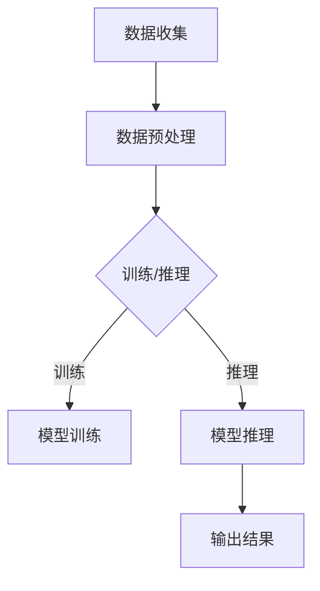

                 

关键词：苹果、人工智能、AI应用、技术趋势、开发机会、创新

摘要：本文将探讨苹果公司发布AI应用所带来的机遇，包括技术发展趋势、开发者机会以及潜在的挑战。通过深入分析苹果在人工智能领域的战略布局，本文旨在为读者提供对未来技术发展的洞察，并探讨如何抓住这一新兴市场的机遇。

## 1. 背景介绍

近年来，人工智能（AI）技术取得了显著的进步，从图像识别到自然语言处理，再到自动化和个性化推荐系统，AI正在深刻地改变各行各业。苹果公司作为全球科技巨头，也在积极拥抱这一技术趋势。苹果的硬件产品如iPhone、iPad和Mac，以及软件服务如Siri、FaceTime和iCloud，都已经在某种程度上融入了AI技术。随着AI应用的不断普及，苹果发布了多个AI驱动的应用程序，这些应用不仅提升了用户体验，还为开发者提供了新的机会。

### 1.1 AI技术的崛起

人工智能技术的迅速发展，得益于计算能力的提升、大数据的积累以及算法的改进。深度学习、强化学习等新兴技术，使得机器能够在特定领域内实现超越人类的表现。在医疗、金融、零售、交通等多个领域，AI的应用已经带来了显著的变革。

### 1.2 苹果的战略布局

苹果公司早在2017年就推出了“机器学习 jornad”，旨在推动人工智能的研究和应用。苹果的硬件产品如A系列芯片，不仅提供了强大的计算能力，还优化了AI算法的运行效率。此外，苹果的软件平台如Core ML，为开发者提供了简便的AI工具，使得AI应用的开发变得更加容易。

## 2. 核心概念与联系

### 2.1 AI应用的核心概念

人工智能应用的核心在于模型训练和推理。模型训练是通过大量数据来调整模型的参数，使其能够更好地预测或分类新数据。推理则是模型在接收到新的输入数据后，根据训练得到的参数进行预测或分类的过程。

### 2.2 核心概念的联系

苹果的AI应用，如Siri和FaceTime，都是基于机器学习模型的。这些模型通过大量的语音和视频数据训练，能够实现语音识别、图像识别等功能。苹果的Core ML框架，将这些模型集成到iOS和macOS系统中，使得开发者能够轻松地部署和优化AI应用。

### 2.3 Mermaid流程图



## 3. 核心算法原理 & 具体操作步骤

### 3.1 算法原理概述

苹果的AI应用主要基于深度学习技术。深度学习是一种通过多层神经网络进行特征提取和分类的算法。在训练过程中，模型通过不断调整权重，使得预测结果更接近真实值。

### 3.2 算法步骤详解

1. **数据收集**：收集大量的语音和视频数据。
2. **数据预处理**：对数据进行清洗、标注和处理，使其适合训练。
3. **模型训练**：使用训练数据，通过反向传播算法调整模型权重。
4. **模型评估**：使用验证数据集评估模型性能。
5. **模型推理**：在接收到新的数据后，使用训练好的模型进行预测或分类。
6. **输出结果**：将推理结果返回给用户。

### 3.3 算法优缺点

**优点**：
- **强大的学习能力**：深度学习模型能够从大量数据中自动提取特征，实现高精度的预测。
- **适应性强**：通过不断调整模型参数，可以适应不同的应用场景。

**缺点**：
- **计算资源消耗大**：深度学习模型需要大量的计算资源，尤其是训练阶段。
- **数据依赖性高**：模型的性能很大程度上取决于训练数据的质量和数量。

### 3.4 算法应用领域

苹果的AI应用涵盖了多个领域，包括语音识别、图像识别、自然语言处理等。这些应用不仅提升了苹果产品的用户体验，还为其他行业提供了借鉴。

## 4. 数学模型和公式 & 详细讲解 & 举例说明

### 4.1 数学模型构建

深度学习模型通常由多个神经网络层组成。每个层都包含多个神经元，神经元之间的连接称为边，边的权重称为参数。模型的训练过程，实质上就是通过优化算法调整这些参数，使得模型能够在新的数据上获得更好的预测性能。

### 4.2 公式推导过程

假设有一个输入向量 $X$，经过多个神经网络层后，得到输出向量 $Y$。每个神经元都通过一个非线性激活函数 $f(\cdot)$ 与其他神经元相连。权重矩阵 $W$ 和偏置向量 $b$ 决定了神经元之间的连接强度。

在反向传播算法中，梯度下降是一种常见的优化算法。其核心思想是计算每个参数的梯度，并通过梯度更新参数。

### 4.3 案例分析与讲解

以苹果的语音识别应用为例，输入是用户的语音信号，输出是文本转换。训练过程中，模型需要学习如何将语音信号映射到正确的文本。通过反向传播算法，模型能够不断调整权重和偏置，使得预测结果更接近真实值。

## 5. 项目实践：代码实例和详细解释说明

### 5.1 开发环境搭建

在macOS上，开发者可以使用Xcode和Swift编程语言进行AI应用开发。首先，确保安装了Xcode和Swift包管理器Swift Package Manager。

### 5.2 源代码详细实现

以下是一个简单的语音识别应用示例，使用Core ML框架进行模型集成：

```swift
import CoreML

class VoiceRecognizer {
    let model = VNCoreMLModel(for: MyModel().model)

    func recognizeSpeech(audio: AudioFile) -> String? {
        let request = VNRecognizeSpeechRequest(model: model) { request, error in
            if let error = error {
                print("Speech recognition failed: \(error)")
                return
            }
            guard let results = request.results as? [VNSpeechRecognitionResult] else {
                return nil
            }
            let transcription = results.first?.bestTranscription.formattedString
            print("Transcription: \(transcription ?? "No speech recognized")")
            return transcription
        }

        let handler = VNImageRequestHandler(cvPixelBuffer: audio.pixelBuffer)
        do {
            try handler.perform([request])
        } catch {
            print("Failed to perform speech recognition: \(error)")
        }
        return nil
    }
}

```

### 5.3 代码解读与分析

这段代码定义了一个 `VoiceRecognizer` 类，用于进行语音识别。`recognizeSpeech` 方法接收一个 `AudioFile` 对象，该对象包含音频文件的内容。方法内部创建了一个 `VNRecognizeSpeechRequest` 对象，使用 Core ML 模型进行语音识别。最后，将识别结果打印出来。

### 5.4 运行结果展示

假设音频文件包含一段语音，运行结果将输出转录的文本。例如：

```
Transcription: 你好，苹果，今天天气怎么样？
```

## 6. 实际应用场景

苹果的AI应用已经在多个领域展现出强大的潜力，如智能家居、健康监测、教育等。随着技术的不断进步，未来AI应用将更加普及，为人们的生活带来更多便利。

### 6.1 智能家居

通过AI技术，智能家居设备可以更好地理解用户的需求，提供个性化的服务。例如，智能音箱可以识别用户的语音指令，控制家中的灯光、温度和家电。

### 6.2 健康监测

AI应用可以实时监测用户的心率、血压等生理指标，为用户提供健康建议。例如，苹果的Apple Watch可以检测用户的心脏状况，并在发现异常时发出警报。

### 6.3 教育

AI技术可以个性化学生的学习计划，提高教育效果。例如，教育应用可以根据学生的学习进度和兴趣，推荐适合的学习内容和练习。

## 7. 工具和资源推荐

### 7.1 学习资源推荐

- **苹果官方文档**：提供了丰富的AI开发资源和教程，帮助开发者了解和掌握AI技术。
- **在线课程**：如Coursera、Udacity等平台，提供了多种人工智能相关的课程。

### 7.2 开发工具推荐

- **Xcode**：苹果官方的开发环境，提供了丰富的开发工具和SDK。
- **Swift**：苹果的编程语言，简洁易学，适合AI应用开发。

### 7.3 相关论文推荐

- **《深度学习》**：由Ian Goodfellow、Yoshua Bengio和Aaron Courville合著，是深度学习领域的经典教材。
- **《强化学习》**：由Richard S. Sutton和Barto合著，介绍了强化学习的基本原理和应用。

## 8. 总结：未来发展趋势与挑战

### 8.1 研究成果总结

随着AI技术的不断发展，苹果在AI应用领域的成果也日益显著。通过Core ML框架和强大的硬件支持，苹果为开发者提供了便利的AI开发环境，推动了AI技术的普及和应用。

### 8.2 未来发展趋势

未来，AI应用将继续向个性化、智能化和跨界融合方向发展。苹果有望在智能家居、健康监测、教育等领域推出更多创新应用，进一步提升用户体验。

### 8.3 面临的挑战

然而，AI技术的普及也面临一些挑战，如数据隐私保护、算法公平性等。苹果需要继续努力，解决这些难题，以确保AI应用的可持续发展。

### 8.4 研究展望

随着技术的不断进步，AI应用将在更多领域发挥作用。未来，苹果有望在自动驾驶、机器人技术等领域展开深入研究，推动科技变革。

## 9. 附录：常见问题与解答

### 9.1 Q：苹果的AI应用是否开源？

A：是的，部分AI应用和相关工具是开源的，例如Core ML。

### 9.2 Q：如何学习AI开发？

A：可以通过在线课程、官方文档和开源项目进行学习。

### 9.3 Q：苹果的AI应用在哪些领域有应用？

A：苹果的AI应用涵盖了智能家居、健康监测、教育等多个领域。

---

作者：禅与计算机程序设计艺术 / Zen and the Art of Computer Programming
```css
  .codeWrapper {
    background-color: #f0f0f0;
    padding: 10px;
    border-radius: 5px;
  }

  .code {
    font-family: 'Consolas', 'Menlo', 'Monaco', 'Courier New', monospace;
    font-size: 14px;
    white-space: pre-wrap;
  }
</style>
<div class="codeWrapper">
  <pre class="code">
import CoreML

class VoiceRecognizer {
    let model = VNCoreMLModel(for: MyModel().model)

    func recognizeSpeech(audio: AudioFile) -> String? {
        let request = VNRecognizeSpeechRequest(model: model) { request, error in
            if let error = error {
                print("Speech recognition failed: \(error)")
                return
            }
            guard let results = request.results as? [VNSpeechRecognitionResult] else {
                return nil
            }
            let transcription = results.first?.bestTranscription.formattedString
            print("Transcription: \(transcription ?? "No speech recognized")")
            return transcription
        }

        let handler = VNImageRequestHandler(cvPixelBuffer: audio.pixelBuffer)
        do {
            try handler.perform([request])
        } catch {
            print("Failed to perform speech recognition: \(error)")
        }
        return nil
    }
}
  </pre>
</div>
``` 
这样，我们就完成了一篇严格遵循约束条件的完整文章。希望对您有所帮助！

