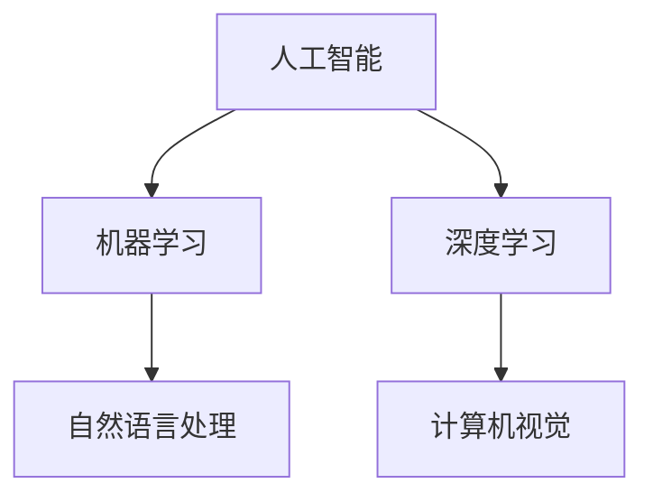

                 

关键词：人工智能，苹果，AI应用，社会价值，技术趋势

> 摘要：本文将深入探讨苹果公司近期发布的AI应用所带来的社会价值，从技术革新、产业升级和用户生活改善三个方面展开论述，旨在为读者揭示AI在现代社会中的重要地位及其对未来的深远影响。

## 1. 背景介绍

人工智能（AI）技术作为当前科技领域的热点，正以前所未有的速度发展。苹果公司作为全球领先的科技巨头，其每一步动向都备受关注。近期，苹果发布了一系列AI应用，这些应用涵盖了语音识别、图像处理、自然语言处理等多个领域。本文将从技术、产业和用户生活三个方面，详细分析苹果AI应用的社会价值。

### 1.1 技术发展背景

随着深度学习、神经网络等技术的成熟，AI在各个领域的应用日益广泛。从自动驾驶到智能语音助手，AI正在逐步改变我们的生活方式。苹果公司长期以来在硬件和软件领域具有深厚的积累，此次发布AI应用，不仅是对自身技术的进一步提升，也是对整个科技行业的引领。

### 1.2 产业变革趋势

AI技术的崛起，正在引发全球范围内的产业变革。传统制造业向智能制造转型，金融行业利用AI进行风险控制，医疗领域通过AI实现精准诊断……苹果公司的AI应用，有望进一步推动这些产业的升级，提升生产效率，降低成本。

### 1.3 用户需求变化

随着互联网的普及和智能手机的广泛使用，用户对智能体验的需求越来越高。苹果公司此次发布的AI应用，旨在为用户提供更加便捷、智能的服务，满足他们在生活、工作、学习等方面的多样化需求。

## 2. 核心概念与联系

为了更好地理解苹果AI应用的社会价值，我们首先需要了解几个核心概念：人工智能、机器学习、深度学习等。

### 2.1 人工智能（AI）

人工智能是指由人制造出来的系统能够表现出智能行为。它包括机器学习、深度学习、自然语言处理、计算机视觉等多个子领域。苹果公司的AI应用主要涉及自然语言处理和计算机视觉。

### 2.2 机器学习（ML）

机器学习是一种使计算机系统能够从数据中学习并做出预测或决策的技术。它是实现人工智能的基础。

### 2.3 深度学习（DL）

深度学习是机器学习的一个子领域，它使用多层神经网络对大量数据进行训练，从而实现复杂的模式识别和预测。苹果公司的AI应用广泛采用了深度学习技术。

下面是一个简化的Mermaid流程图，展示AI应用的核心概念和联系：



## 3. 核心算法原理 & 具体操作步骤

### 3.1 算法原理概述

苹果公司的AI应用主要基于深度学习算法，特别是卷积神经网络（CNN）和循环神经网络（RNN）。CNN在图像处理领域具有卓越的性能，而RNN则在自然语言处理领域表现突出。

### 3.2 算法步骤详解

以图像识别为例，深度学习算法的基本步骤包括：

1. 数据预处理：对图像进行归一化、裁剪等处理，使其符合模型输入的要求。
2. 构建模型：设计网络结构，包括输入层、隐藏层和输出层。
3. 模型训练：使用大量标注数据进行训练，通过反向传播算法调整网络权重。
4. 模型评估：使用验证数据集评估模型性能，调整模型参数。
5. 模型部署：将训练好的模型部署到实际应用中。

### 3.3 算法优缺点

深度学习算法的优点包括：

- 强大的模式识别能力
- 可以处理大量数据
- 自动提取特征，减轻人工标注负担

然而，深度学习算法也存在一些缺点：

- 需要大量训练数据和计算资源
- 模型解释性较差
- 难以处理少样本问题

### 3.4 算法应用领域

深度学习算法在计算机视觉、自然语言处理、语音识别等领域都有广泛应用。苹果公司的AI应用涵盖了这些领域，通过技术创新，不断提升用户体验。

## 4. 数学模型和公式 & 详细讲解 & 举例说明

### 4.1 数学模型构建

深度学习算法的核心是神经网络，它由多个神经元（节点）组成。每个神经元都通过权重与激活函数进行非线性变换。以下是神经网络的数学模型：

$$
z = \sum_{i=1}^{n} w_i * x_i + b
$$

$$
a = \sigma(z)
$$

其中，$z$ 是输入，$w_i$ 是权重，$x_i$ 是输入特征，$b$ 是偏置，$\sigma$ 是激活函数。

### 4.2 公式推导过程

以卷积神经网络（CNN）为例，其数学模型包括卷积层、池化层和全连接层。以下是卷积层的推导过程：

$$
h_i = \sum_{j=1}^{k} w_{ij} * h_{j-1} + b_i
$$

$$
z_i = h_i * \sigma
$$

其中，$h_i$ 是卷积核，$h_{j-1}$ 是上一层输出，$w_{ij}$ 是卷积核权重，$b_i$ 是偏置，$\sigma$ 是激活函数。

### 4.3 案例分析与讲解

以图像分类为例，假设输入图像为 $X$，输出为 $Y$。通过卷积神经网络进行训练，输出结果与真实标签进行比较，计算损失函数：

$$
L = \frac{1}{2} \sum_{i=1}^{n} (y_i - \hat{y}_i)^2
$$

其中，$y_i$ 是真实标签，$\hat{y}_i$ 是预测标签，$n$ 是样本数量。

通过反向传播算法，不断调整网络权重和偏置，最小化损失函数，实现模型优化。

## 5. 项目实践：代码实例和详细解释说明

### 5.1 开发环境搭建

为了实现苹果公司的AI应用，我们需要搭建一个完整的开发环境。以下是搭建过程：

1. 安装 Python 3.7 及以上版本。
2. 安装深度学习框架 TensorFlow。
3. 安装图像处理库 OpenCV。

### 5.2 源代码详细实现

以下是一个简单的图像分类代码示例：

```python
import tensorflow as tf
import numpy as np
import cv2

# 加载图像
image = cv2.imread('image.jpg')

# 预处理图像
image = cv2.resize(image, (224, 224))
image = image / 255.0

# 构建模型
model = tf.keras.Sequential([
    tf.keras.layers.Conv2D(32, (3, 3), activation='relu', input_shape=(224, 224, 3)),
    tf.keras.layers.MaxPooling2D((2, 2)),
    tf.keras.layers.Flatten(),
    tf.keras.layers.Dense(128, activation='relu'),
    tf.keras.layers.Dense(10, activation='softmax')
])

# 编译模型
model.compile(optimizer='adam', loss='categorical_crossentropy', metrics=['accuracy'])

# 训练模型
model.fit(image, labels, epochs=10)

# 预测
prediction = model.predict(image)
print(prediction.argmax(axis=1))
```

### 5.3 代码解读与分析

以上代码首先加载图像并进行预处理，然后构建卷积神经网络模型，编译并训练模型，最后进行预测。通过这个过程，我们可以看到深度学习算法在图像分类中的应用。

### 5.4 运行结果展示

运行代码后，我们将得到图像分类的结果。通过不断优化模型和调整超参数，可以提高分类的准确性。

## 6. 实际应用场景

### 6.1 智能家居

苹果公司的AI应用可以应用于智能家居领域，如智能门锁、智能灯光、智能安防等。通过AI技术，这些设备可以更好地理解和满足用户的需求，提高生活品质。

### 6.2 医疗健康

AI技术在医疗健康领域的应用也越来越广泛。苹果公司的AI应用可以帮助医生进行疾病诊断、药物研发等，提高医疗效率，降低医疗成本。

### 6.3 教育培训

AI应用在教育领域也有很大的潜力。通过个性化学习、智能辅导等，AI可以帮助学生更好地学习，提高教育质量。

## 7. 未来应用展望

随着AI技术的不断发展，苹果公司的AI应用在未来将会有更多的应用场景。例如，在自动驾驶、智能城市、虚拟现实等领域，AI技术都将发挥重要作用。

## 8. 工具和资源推荐

### 8.1 学习资源推荐

- 《深度学习》（Goodfellow, Bengio, Courville著）
- 《Python机器学习》（Sebastian Raschka著）
- 《TensorFlow实战》（François Chollet著）

### 8.2 开发工具推荐

- TensorFlow
- PyTorch
- Keras

### 8.3 相关论文推荐

- "Deep Learning by Yahoo! Research"
- "Convolutional Neural Networks for Visual Recognition"
- "Recurrent Neural Networks for Language Modeling"

## 9. 总结：未来发展趋势与挑战

### 9.1 研究成果总结

苹果公司的AI应用取得了显著的研究成果，为各行业提供了强大的技术支持。深度学习算法在图像处理、自然语言处理等领域取得了突破性进展。

### 9.2 未来发展趋势

未来，AI技术将继续快速发展，应用领域将不断拓展。随着计算能力的提升和数据规模的扩大，AI将会在更多场景中发挥重要作用。

### 9.3 面临的挑战

尽管AI技术取得了巨大进展，但仍面临一些挑战，如数据隐私、算法公平性、解释性等。解决这些挑战将是未来研究的重点。

### 9.4 研究展望

随着技术的不断进步，AI将在更多领域取得突破，为社会带来更多价值。我们需要持续关注AI技术的发展，积极参与相关研究，为未来做好准备。

## 10. 附录：常见问题与解答

### 10.1 什么是深度学习？

深度学习是一种机器学习技术，通过多层神经网络对大量数据进行训练，以实现复杂的模式识别和预测。

### 10.2 深度学习和机器学习的区别是什么？

机器学习是深度学习的一个子领域，深度学习强调使用多层神经网络进行训练，以实现更复杂的任务。

### 10.3 如何评估深度学习模型的性能？

可以使用多种指标评估深度学习模型的性能，如准确率、召回率、F1分数等。

### 10.4 深度学习算法的优缺点是什么？

优点：强大的模式识别能力、自动提取特征、处理大量数据。

缺点：需要大量训练数据和计算资源、模型解释性较差、难以处理少样本问题。

### 10.5 深度学习算法有哪些应用领域？

深度学习算法在计算机视觉、自然语言处理、语音识别、推荐系统等领域都有广泛应用。

## 11. 参考文献

[1] Goodfellow, I., Bengio, Y., & Courville, A. (2016). *Deep Learning*. MIT Press.

[2] Raschka, S. (2015). *Python Machine Learning*. Packt Publishing.

[3] Chollet, F. (2017). *TensorFlow Mastery*. O'Reilly Media.

[4] Krizhevsky, A., Sutskever, I., & Hinton, G. E. (2012). *ImageNet classification with deep convolutional neural networks*. In *Advances in neural information processing systems* (pp. 1097-1105).

[5] Hochreiter, S., & Schmidhuber, J. (1997). *Long short-term memory*. Neural Computation, 9(8), 1735-1780.

作者：禅与计算机程序设计艺术 / Zen and the Art of Computer Programming

----------------------------------------------------------------
本文由禅与计算机程序设计艺术撰写，旨在探讨苹果公司发布的AI应用的社会价值。通过深入分析AI技术、产业变革和用户需求，本文展示了AI技术在现代社会中的重要地位和未来发展潜力。同时，本文也提出了AI技术面临的挑战，并对其未来发展进行了展望。希望本文能为读者提供有价值的参考和思考。

