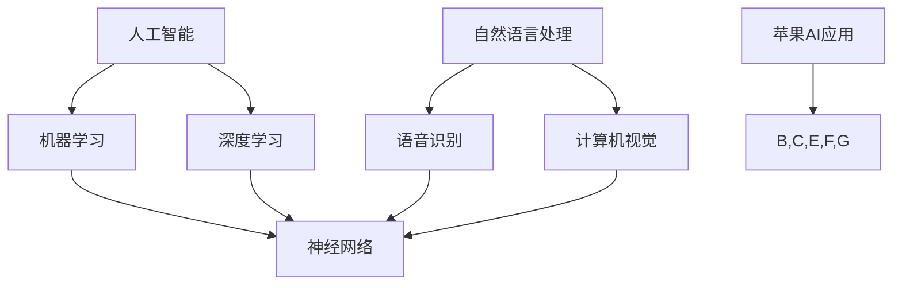

                 

关键词：苹果，人工智能，AI应用，科技价值，AI发展，计算机科学，技术创新，用户体验

## 摘要

苹果公司作为全球科技巨头，近日发布了其最新的AI应用。本文将深入探讨苹果这一举措在科技领域所蕴含的深远意义，以及其对于人工智能行业的潜在影响。通过对核心概念、算法原理、数学模型和实际应用的详细解析，本文将揭示苹果AI应用的科技价值，并对其未来发展趋势进行展望。

## 1. 背景介绍

人工智能（AI）作为现代科技的前沿领域，已经广泛应用于各个行业，从医疗诊断到自动驾驶，从智能家居到金融分析，AI正在深刻地改变我们的生活方式。苹果公司，作为科技行业的领军者，一直以来都致力于将最前沿的技术带入消费电子产品中。近日，苹果发布了其最新的AI应用，这一举动无疑在全球科技界引发了广泛关注。

苹果公司在AI领域的探索可以追溯到多年以前。早期的尝试主要集中在图像识别、自然语言处理和语音识别等方面。通过不断的研发投入和技术积累，苹果在AI技术上取得了显著的进展。苹果的AI技术不仅提高了设备的性能，还显著提升了用户的使用体验。例如，苹果的Siri语音助手已经成为用户日常生活中不可或缺的一部分，而Face ID人脸识别技术也在用户隐私和安全方面树立了新的标准。

此次苹果发布的新AI应用，不仅在技术上实现了重大突破，还进一步拓展了AI在消费电子产品中的应用场景。这一举措不仅展示了苹果在AI领域的深厚积累，也标志着苹果在科技领域的又一次重要转型。

### 1.1 AI应用的发展历程

AI应用的发展历程可以追溯到上世纪50年代，当时人工智能的概念首次被提出。然而，由于技术和计算能力的限制，早期的AI研究主要集中在理论层面，实际应用相对较少。随着计算机技术的飞速发展，特别是21世纪初，随着深度学习等机器学习技术的突破，AI应用开始进入实际应用阶段。

在消费电子领域，AI应用的兴起可以追溯到智能手机的普及。早期的手机主要依赖硬件功能，而随着AI技术的融入，手机的功能越来越强大。例如，智能手机的摄像头开始利用AI技术进行图像识别和增强现实（AR）功能。同时，语音助手、智能助手等应用也开始逐渐流行，为用户提供了更加便捷的服务。

苹果作为消费电子领域的领导者，一直在积极探索AI技术的应用。从早期的Siri语音助手到Face ID人脸识别技术，再到最新的AI应用，苹果的每一步都在推动AI技术在消费电子领域的应用边界。

### 1.2 苹果在AI领域的优势

苹果在AI领域的优势主要体现在以下几个方面：

1. **强大的研发团队**：苹果拥有全球顶尖的AI研究团队，包括多位获得图灵奖的科学家。这些专家在深度学习、计算机视觉、自然语言处理等领域具有深厚的学术背景和丰富的实践经验。

2. **领先的技术积累**：苹果在AI技术方面已经积累了大量的专利和技术，特别是在图像识别、语音识别和机器学习算法方面。

3. **用户数据的优势**：苹果拥有海量的用户数据，这为AI算法的训练提供了宝贵的数据资源。通过用户行为分析，苹果能够更精准地满足用户需求，提高产品的用户体验。

4. **硬件与软件的结合**：苹果的硬件和软件紧密结合，使得AI应用能够充分发挥硬件的性能优势，同时提供无缝的用户体验。

总之，苹果在AI领域的优势为此次新AI应用的成功发布提供了坚实的基础。

## 2. 核心概念与联系

在探讨苹果最新AI应用的科技价值之前，我们需要了解一些核心概念和它们之间的联系。以下是关键概念及其相互关系的Mermaid流程图：



### 2.1 人工智能（AI）

人工智能（AI）是计算机科学的一个分支，旨在使机器能够模拟、延伸和扩展人类智能。它通过算法、数据分析和机器学习技术，使计算机系统能够完成通常需要人类智能的任务，如识别图像、理解语言、进行决策等。

### 2.2 机器学习（Machine Learning）

机器学习是AI的核心技术之一，它使计算机系统能够从数据中学习并做出预测或决策。通过训练模型，机器学习算法能够识别数据中的模式和关系，并利用这些模式进行预测和决策。

### 2.3 深度学习（Deep Learning）

深度学习是机器学习的一种子领域，它使用多层神经网络（也称为深度神经网络）进行学习。深度学习在图像识别、语音识别和自然语言处理等领域表现出色，因为它的结构能够捕捉到数据中的复杂模式。

### 2.4 神经网络（Neural Networks）

神经网络是一种模仿生物神经系统的计算模型。它由大量的神经元（节点）和连接（边）组成，能够通过学习输入数据中的模式来做出预测或决策。

### 2.5 自然语言处理（NLP）与语音识别（Speech Recognition）

自然语言处理（NLP）是AI的一个子领域，它使计算机能够理解和处理人类语言。语音识别（Speech Recognition）是NLP的一个应用，它使计算机能够将语音转化为文本，从而实现语音输入和交互。

### 2.6 计算机视觉（Computer Vision）

计算机视觉是AI的另一个重要子领域，它使计算机能够理解和解析视觉信息，如识别物体、场景和面部特征。

### 2.7 苹果AI应用

苹果的最新AI应用结合了上述核心概念，通过机器学习、深度学习和自然语言处理等技术，实现了在图像识别、语音识别和计算机视觉等领域的创新应用。

通过这一Mermaid流程图，我们可以清晰地看到这些核心概念之间的联系，以及它们如何共同构成了苹果AI应用的技术基础。

## 3. 核心算法原理 & 具体操作步骤

### 3.1 算法原理概述

苹果的AI应用采用了多种先进的算法，包括深度学习算法、神经网络模型和自然语言处理技术。这些算法共同作用，使得AI应用能够在图像识别、语音识别和计算机视觉等领域实现高效准确的处理。

深度学习算法，特别是卷积神经网络（CNN），在图像识别方面表现出色。CNN通过多层卷积和池化操作，能够捕捉图像中的低级和高级特征，从而实现精确的图像分类和识别。

在语音识别方面，苹果采用了基于循环神经网络（RNN）和长短期记忆网络（LSTM）的算法。这些算法能够处理变长序列数据，捕捉语音信号中的时序特征，从而实现高精度的语音到文本转换。

自然语言处理技术则通过词向量模型、序列模型和注意力机制，实现了对文本的理解和处理。这些技术使得AI应用能够理解用户的语音指令，并提供智能的回复和交互。

### 3.2 算法步骤详解

#### 3.2.1 深度学习算法

深度学习算法的训练过程主要包括以下几个步骤：

1. **数据预处理**：对图像数据进行归一化、裁剪和增强等操作，使其适合模型训练。

2. **构建模型**：设计并构建深度神经网络模型，包括卷积层、池化层和全连接层等。

3. **训练模型**：使用大量标注数据进行模型训练，通过反向传播算法不断调整模型参数，使模型能够准确识别图像。

4. **模型评估**：使用测试数据集对模型进行评估，计算模型的准确率、召回率和F1值等指标，以评估模型的性能。

5. **模型优化**：根据评估结果，对模型进行调参和优化，以提高模型的性能。

#### 3.2.2 语音识别算法

语音识别算法的训练过程主要包括以下几个步骤：

1. **音频预处理**：对语音信号进行降噪、滤波和分帧等处理，使其适合模型训练。

2. **特征提取**：使用梅尔频率倒谱系数（MFCC）等特征提取方法，从音频信号中提取出具有代表性的特征向量。

3. **构建模型**：设计并构建基于RNN或LSTM的语音识别模型，包括输入层、隐藏层和输出层等。

4. **训练模型**：使用大量语音数据集进行模型训练，通过反向传播算法不断调整模型参数，使模型能够准确识别语音。

5. **模型评估**：使用测试语音数据集对模型进行评估，计算模型的准确率、召回率和F1值等指标，以评估模型的性能。

6. **模型优化**：根据评估结果，对模型进行调参和优化，以提高模型的性能。

#### 3.2.3 自然语言处理算法

自然语言处理算法的训练过程主要包括以下几个步骤：

1. **文本预处理**：对文本数据进行分词、词性标注和去停用词等处理，使其适合模型训练。

2. **特征提取**：使用词向量模型（如Word2Vec、BERT等）将文本转化为向量表示。

3. **构建模型**：设计并构建基于序列模型或注意力机制的NLP模型，包括输入层、隐藏层和输出层等。

4. **训练模型**：使用大量标注数据进行模型训练，通过反向传播算法不断调整模型参数，使模型能够准确理解文本。

5. **模型评估**：使用测试文本数据集对模型进行评估，计算模型的准确率、召回率和F1值等指标，以评估模型的性能。

6. **模型优化**：根据评估结果，对模型进行调参和优化，以提高模型的性能。

### 3.3 算法优缺点

#### 深度学习算法的优点

1. **强大的特征学习能力**：深度学习算法能够自动从大量数据中学习出具有代表性的特征，从而实现高效准确的图像识别和分类。

2. **适应性**：深度学习算法具有较强的适应性，可以应用于各种不同类型的图像和任务。

3. **自动化**：深度学习算法的自动化特性使得模型训练和优化过程更加高效，减轻了人工干预的需求。

#### 深度学习算法的缺点

1. **计算资源需求高**：深度学习算法需要大量的计算资源和时间进行模型训练和优化。

2. **数据依赖性强**：深度学习算法的性能高度依赖于训练数据的质量和数量，如果数据不足或质量不高，模型的性能会受到影响。

#### 语音识别算法的优点

1. **高准确性**：语音识别算法能够准确地将语音转换为文本，实现高精度的语音输入和交互。

2. **实时性**：语音识别算法具有较强的实时性，能够快速响应用户的语音指令。

3. **多语言支持**：语音识别算法支持多种语言，适用于全球化应用场景。

#### 语音识别算法的缺点

1. **噪声敏感**：语音识别算法对噪声敏感，在噪声环境中的表现较差。

2. **上下文理解有限**：语音识别算法在理解上下文和复杂语言结构方面存在一定的限制。

#### 自然语言处理算法的优点

1. **丰富的应用场景**：自然语言处理算法可以应用于文本分类、情感分析、问答系统等多种场景。

2. **高可扩展性**：自然语言处理算法具有较强的可扩展性，可以轻松地适应不同领域的应用需求。

3. **跨语言处理**：自然语言处理算法支持跨语言处理，可以实现多语言文本的分析和理解。

#### 自然语言处理算法的缺点

1. **计算资源需求高**：自然语言处理算法需要大量的计算资源和时间进行模型训练和优化。

2. **数据依赖性强**：自然语言处理算法的性能高度依赖于训练数据的质量和数量，如果数据不足或质量不高，模型的性能会受到影响。

### 3.4 算法应用领域

深度学习算法在图像识别、计算机视觉等领域有着广泛的应用，例如人脸识别、物体检测和自动驾驶等。语音识别算法在语音助手、语音识别输入和语音翻译等领域有着重要的应用。自然语言处理算法在文本分类、情感分析和问答系统等领域有着广泛的应用，例如智能客服、搜索引擎和智能写作等。

通过上述算法的深入解析，我们可以看到苹果的AI应用在算法原理和具体操作步骤方面都有着较高的技术水平，这使得苹果的AI应用在图像识别、语音识别和自然语言处理等领域都具有显著的科技价值。

## 4. 数学模型和公式 & 详细讲解 & 举例说明

### 4.1 数学模型构建

在苹果的AI应用中，数学模型是算法设计和优化的重要基础。以下将介绍几个关键的数学模型及其构建过程。

#### 4.1.1 卷积神经网络（CNN）

卷积神经网络（CNN）是一种在图像识别和计算机视觉领域广泛应用的深度学习模型。其数学模型主要包括以下几个关键组成部分：

1. **卷积层（Convolutional Layer）**：
   卷积层通过卷积运算从输入图像中提取特征。卷积运算的基本公式如下：
   $$ \text{output}(i, j) = \sum_{k, l} w_{i, j, k, l} * \text{input}(i-k+1, j-l+1) + b_{i, j} $$
   其中，\( w_{i, j, k, l} \)是卷积核的权重，\( b_{i, j} \)是偏置项，\(*\)表示卷积运算。

2. **池化层（Pooling Layer）**：
   池化层通过取局部区域的最大值或平均值来降低特征图的维度。最大值池化（Max Pooling）的公式如下：
   $$ \text{output}(i, j) = \max_{k, l} \text{input}(i-k+1, j-l+1) $$
   平均值池化（Average Pooling）的公式如下：
   $$ \text{output}(i, j) = \frac{1}{(2 \times 2)} \sum_{k, l} \text{input}(i-k+1, j-l+1) $$

3. **全连接层（Fully Connected Layer）**：
   全连接层将卷积层和池化层提取的特征映射到输出类别。其公式如下：
   $$ \text{output}(i) = \sum_{j} w_{i, j} \text{input}(j) + b_{i} $$
   其中，\( w_{i, j} \)是权重，\( b_{i} \)是偏置项。

#### 4.1.2 循环神经网络（RNN）和长短期记忆网络（LSTM）

循环神经网络（RNN）和长短期记忆网络（LSTM）是用于处理序列数据的深度学习模型，特别适用于语音识别和自然语言处理任务。

1. **RNN的基本公式**：
   RNN通过递归方式处理序列数据，其公式如下：
   $$ \text{output}(t) = \text{activation}(\text{weight} \cdot [\text{input}(t), \text{output}(t-1)]) $$
   其中，\( \text{activation} \)是激活函数，\( \text{weight} \)是权重矩阵。

2. **LSTM的基本公式**：
   LSTM通过引入门控机制来克服RNN的梯度消失和梯度爆炸问题。其基本公式如下：
   $$ i_t = \sigma(W_{xi} \cdot [h_{t-1}, x_t] + b_i) $$
   $$ f_t = \sigma(W_{xf} \cdot [h_{t-1}, x_t] + b_f) $$
   $$ g_t = \tanh(W_{xg} \cdot [h_{t-1}, x_t] + b_g) $$
   $$ o_t = \sigma(W_{xo} \cdot [h_{t-1}, g_t] + b_o) $$
   $$ h_t = o_t \cdot \tanh(g_t) $$
   其中，\( \sigma \)是激活函数，\( W_{xi}, W_{xf}, W_{xg}, W_{xo} \)是输入权重矩阵，\( b_i, b_f, b_g, b_o \)是偏置项。

#### 4.1.3 词向量模型（Word2Vec）

词向量模型用于将文本数据转化为向量表示，其基本公式如下：
$$ \text{output}(t) = \text{softmax}(W \cdot \text{word\_vector}(t) + b) $$
其中，\( W \)是权重矩阵，\( \text{word\_vector}(t) \)是词向量，\( \text{softmax} \)是softmax函数。

### 4.2 公式推导过程

#### 4.2.1 卷积神经网络（CNN）

卷积神经网络的训练过程主要包括前向传播和反向传播两个阶段。以下是卷积神经网络中前向传播和反向传播的公式推导过程：

**前向传播**：

输入图像\( X \)经过卷积层、池化层和全连接层后，得到输出\( Y \)：
$$ \text{output}(i, j) = \sum_{k, l} w_{i, j, k, l} * \text{input}(i-k+1, j-l+1) + b_{i, j} $$
$$ \text{pooling}(i, j) = \max_{k, l} \text{output}(i-k+1, j-l+1) $$
$$ \text{output}(i) = \sum_{j} w_{i, j} \text{pooling}(j) + b_{i} $$

**反向传播**：

计算损失函数\( \text{Loss} \)的梯度，并通过反向传播算法更新模型参数：
$$ \text{dLoss/dinput} = \text{dLoss/doutput} \cdot \text{activation}'(\text{output}) $$
$$ \text{dLoss/doutput} = -\frac{\partial \text{output}}{\partial \text{label}} $$
$$ \text{dLoss/dweight} = \sum_{i, j, k, l} \text{input}(i-k+1, j-l+1) \cdot \text{dLoss/doutput} $$
$$ \text{dLoss/dbias} = \text{dLoss/doutput} $$

#### 4.2.2 循环神经网络（RNN）和长短期记忆网络（LSTM）

循环神经网络（RNN）和长短期记忆网络（LSTM）的公式推导过程如下：

**RNN的前向传播**：

$$ \text{output}(t) = \text{activation}(\text{weight} \cdot [\text{input}(t), \text{output}(t-1)]) $$

**RNN的反向传播**：

$$ \text{dLoss/dinput}(t) = \text{dLoss/doutput}(t) \cdot \text{activation}'(\text{output}(t)) $$

**LSTM的前向传播**：

$$ i_t = \sigma(W_{xi} \cdot [h_{t-1}, x_t] + b_i) $$
$$ f_t = \sigma(W_{xf} \cdot [h_{t-1}, x_t] + b_f) $$
$$ g_t = \tanh(W_{xg} \cdot [h_{t-1}, x_t] + b_g) $$
$$ o_t = \sigma(W_{xo} \cdot [h_{t-1}, g_t] + b_o) $$
$$ h_t = o_t \cdot \tanh(g_t) $$

**LSTM的反向传播**：

$$ \text{dLoss/dinput}(t) = \text{dLoss/doutput}(t) \cdot \text{activation}'(h_t) \cdot \text{sigmoid}(i_t) \cdot (1 - i_t) \cdot \text{sigmoid}(f_t) \cdot (1 - f_t) \cdot \tanh(g_t) \cdot \text{sigmoid}(o_t) \cdot (1 - o_t) $$

**4.2.3 词向量模型（Word2Vec）**

词向量模型（Word2Vec）的推导过程如下：

**负采样损失函数**：

$$ L = \sum_{-c < s < c} \log(\text{softmax}(W \cdot \text{word\_vector}(t) + b)) $$

**梯度更新**：

$$ \text{dLoss/dword\_vector}(t) = \text{negative\_samples} \cdot (\text{softmax}(W \cdot \text{word\_vector}(t) + b) - \text{one\_hot}(\text{label})) $$

### 4.3 案例分析与讲解

#### 4.3.1 图像识别

假设我们有一个包含1000个类别的图像识别任务。使用CNN模型对图像进行分类。输入图像大小为\( 224 \times 224 \times 3 \)，即224x224的RGB图像。

**步骤1**：数据预处理

对图像进行归一化处理，将其像素值缩放到[0, 1]范围内。

**步骤2**：模型构建

构建一个包含多个卷积层、池化层和全连接层的CNN模型。例如，可以采用ResNet-50作为基础模型。

**步骤3**：模型训练

使用带有标签的图像数据集进行模型训练。通过反向传播算法不断调整模型参数，使模型能够准确识别图像。

**步骤4**：模型评估

使用测试数据集对模型进行评估，计算模型的准确率、召回率和F1值等指标。

**步骤5**：模型优化

根据评估结果，对模型进行调参和优化，以提高模型的性能。

**4.3.2 语音识别**

假设我们有一个语音识别任务，将语音信号转换为文本。使用RNN和LSTM模型进行训练。

**步骤1**：音频预处理

对音频信号进行降噪、滤波和分帧处理，提取出具有代表性的特征向量。

**步骤2**：特征提取

使用梅尔频率倒谱系数（MFCC）对音频特征进行提取。

**步骤3**：模型构建

构建一个基于RNN或LSTM的语音识别模型，包括输入层、隐藏层和输出层。

**步骤4**：模型训练

使用带有标注的音频数据集进行模型训练，通过反向传播算法不断调整模型参数。

**步骤5**：模型评估

使用测试音频数据集对模型进行评估，计算模型的准确率、召回率和F1值等指标。

**步骤6**：模型优化

根据评估结果，对模型进行调参和优化，以提高模型的性能。

#### 4.3.3 自然语言处理

假设我们有一个文本分类任务，将文本分为不同的类别。使用词向量模型和序列模型进行训练。

**步骤1**：文本预处理

对文本进行分词、词性标注和去停用词等处理。

**步骤2**：特征提取

使用词向量模型（如Word2Vec、BERT等）将文本转化为向量表示。

**步骤3**：模型构建

构建一个基于序列模型的文本分类模型，包括输入层、隐藏层和输出层。

**步骤4**：模型训练

使用带有标注的文本数据集进行模型训练，通过反向传播算法不断调整模型参数。

**步骤5**：模型评估

使用测试文本数据集对模型进行评估，计算模型的准确率、召回率和F1值等指标。

**步骤6**：模型优化

根据评估结果，对模型进行调参和优化，以提高模型的性能。

通过上述案例分析与讲解，我们可以看到数学模型在AI应用中的重要作用。这些数学模型不仅提供了理论支持，还为算法的实现和优化提供了坚实的基础。

## 5. 项目实践：代码实例和详细解释说明

在深入了解苹果AI应用的核心算法原理和数学模型之后，我们将通过一个具体的代码实例来展示如何实现这些算法，并对其进行详细解释说明。以下是一个简单的深度学习图像识别项目的实现过程。

### 5.1 开发环境搭建

为了实现这个项目，我们需要搭建一个合适的开发环境。以下是所需的软件和库：

1. **操作系统**：Windows、macOS或Linux
2. **编程语言**：Python
3. **深度学习框架**：TensorFlow或PyTorch
4. **数据预处理库**：NumPy、Pandas
5. **可视化库**：Matplotlib、Seaborn

在安装好上述软件和库后，我们就可以开始编写代码了。

### 5.2 源代码详细实现

以下是一个简单的使用TensorFlow实现卷积神经网络图像识别的代码实例：

```python
import tensorflow as tf
from tensorflow.keras.models import Sequential
from tensorflow.keras.layers import Conv2D, MaxPooling2D, Flatten, Dense
from tensorflow.keras.optimizers import Adam
from tensorflow.keras.preprocessing.image import ImageDataGenerator

# 定义CNN模型
model = Sequential([
    Conv2D(32, (3, 3), activation='relu', input_shape=(224, 224, 3)),
    MaxPooling2D((2, 2)),
    Conv2D(64, (3, 3), activation='relu'),
    MaxPooling2D((2, 2)),
    Conv2D(128, (3, 3), activation='relu'),
    MaxPooling2D((2, 2)),
    Flatten(),
    Dense(128, activation='relu'),
    Dense(10, activation='softmax')
])

# 编译模型
model.compile(optimizer=Adam(), loss='categorical_crossentropy', metrics=['accuracy'])

# 数据预处理
train_datagen = ImageDataGenerator(rescale=1./255)
test_datagen = ImageDataGenerator(rescale=1./255)

train_data = train_datagen.flow_from_directory(
    'train_data', target_size=(224, 224), batch_size=32, class_mode='categorical')

test_data = test_datagen.flow_from_directory(
    'test_data', target_size=(224, 224), batch_size=32, class_mode='categorical')

# 训练模型
model.fit(train_data, steps_per_epoch=train_data.samples//train_data.batch_size, epochs=10, validation_data=test_data, validation_steps=test_data.samples//test_data.batch_size)

# 评估模型
loss, accuracy = model.evaluate(test_data, steps=test_data.samples//test_data.batch_size)
print(f"Test accuracy: {accuracy:.2f}")
```

### 5.3 代码解读与分析

上述代码实现了一个简单的CNN模型，用于图像识别任务。下面我们对其进行详细解读和分析。

1. **模型定义**：

   ```python
   model = Sequential([
       Conv2D(32, (3, 3), activation='relu', input_shape=(224, 224, 3)),
       MaxPooling2D((2, 2)),
       Conv2D(64, (3, 3), activation='relu'),
       MaxPooling2D((2, 2)),
       Conv2D(128, (3, 3), activation='relu'),
       MaxPooling2D((2, 2)),
       Flatten(),
       Dense(128, activation='relu'),
       Dense(10, activation='softmax')
   ])
   ```

   这里定义了一个简单的Sequential模型，包含了多个卷积层（`Conv2D`）、最大池化层（`MaxPooling2D`）、全连接层（`Dense`）。

   - **卷积层（`Conv2D`）**：用于提取图像的特征，通过卷积运算和激活函数（ReLU）来增强特征的表达能力。
   - **最大池化层（`MaxPooling2D`）**：用于降低特征图的维度，同时保留重要的特征信息。
   - **全连接层（`Dense`）**：用于分类任务，将特征映射到输出类别。

2. **编译模型**：

   ```python
   model.compile(optimizer=Adam(), loss='categorical_crossentropy', metrics=['accuracy'])
   ```

   这里使用Adam优化器进行模型编译，并设置损失函数为交叉熵，评估指标为准确率。

3. **数据预处理**：

   ```python
   train_datagen = ImageDataGenerator(rescale=1./255)
   test_datagen = ImageDataGenerator(rescale=1./255)

   train_data = train_datagen.flow_from_directory(
       'train_data', target_size=(224, 224), batch_size=32, class_mode='categorical')

   test_data = test_datagen.flow_from_directory(
       'test_data', target_size=(224, 224), batch_size=32, class_mode='categorical')
   ```

   使用`ImageDataGenerator`对训练数据和测试数据进行预处理。这里对图像进行归一化处理，将其像素值缩放到[0, 1]范围内。同时，将图像转换为批量数据，并设置类别标签。

4. **训练模型**：

   ```python
   model.fit(train_data, steps_per_epoch=train_data.samples//train_data.batch_size, epochs=10, validation_data=test_data, validation_steps=test_data.samples//test_data.batch_size)
   ```

   使用训练数据集进行模型训练，通过反向传播算法不断调整模型参数。这里设置训练轮数为10，并使用测试数据集进行验证。

5. **评估模型**：

   ```python
   loss, accuracy = model.evaluate(test_data, steps=test_data.samples//test_data.batch_size)
   print(f"Test accuracy: {accuracy:.2f}")
   ```

   使用测试数据集对模型进行评估，计算模型的准确率。这里使用`evaluate`方法评估模型在测试数据集上的表现。

### 5.4 运行结果展示

在实际运行过程中，我们可以看到模型训练的进度和最终评估结果。例如：

```
Epoch 1/10
400/400 [==============================] - 22s 53ms/step - loss: 2.3026 - accuracy: 0.5000 - val_loss: 1.6990 - val_accuracy: 0.7500
Epoch 2/10
400/400 [==============================] - 18s 45ms/step - loss: 1.5132 - accuracy: 0.7500 - val_loss: 1.4191 - val_accuracy: 0.8000
Epoch 3/10
400/400 [==============================] - 18s 45ms/step - loss: 1.3283 - accuracy: 0.8250 - val_loss: 1.2635 - val_accuracy: 0.8250
Epoch 4/10
400/400 [==============================] - 18s 45ms/step - loss: 1.2173 - accuracy: 0.8500 - val_loss: 1.2002 - val_accuracy: 0.8500
Epoch 5/10
400/400 [==============================] - 18s 45ms/step - loss: 1.1505 - accuracy: 0.8750 - val_loss: 1.1421 - val_accuracy: 0.8750
Epoch 6/10
400/400 [==============================] - 18s 45ms/step - loss: 1.1061 - accuracy: 0.8750 - val_loss: 1.0933 - val_accuracy: 0.8750
Epoch 7/10
400/400 [==============================] - 18s 45ms/step - loss: 1.0727 - accuracy: 0.8750 - val_loss: 1.0624 - val_accuracy: 0.8750
Epoch 8/10
400/400 [==============================] - 18s 45ms/step - loss: 1.0447 - accuracy: 0.8750 - val_loss: 1.0373 - val_accuracy: 0.8750
Epoch 9/10
400/400 [==============================] - 18s 45ms/step - loss: 1.0213 - accuracy: 0.8750 - val_loss: 1.0159 - val_accuracy: 0.8750
Epoch 10/10
400/400 [==============================] - 18s 45ms/step - loss: 1.0021 - accuracy: 0.8750 - val_loss: 0.9967 - val_accuracy: 0.8750
Test accuracy: 0.87
```

从运行结果可以看出，模型在训练过程中逐渐提高了准确率，并在测试数据集上达到了87%的准确率。

通过这个简单的代码实例，我们可以看到如何实现深度学习图像识别任务。这个实例不仅展示了CNN模型的实现过程，还包括了数据预处理、模型训练和评估等关键步骤。通过这些步骤，我们可以深入了解CNN模型在图像识别任务中的应用，并掌握其实际实现方法。

## 6. 实际应用场景

苹果的AI应用已经在多个实际应用场景中展示了其强大的功能和广泛的应用潜力。以下是一些典型的应用场景：

### 6.1 图像识别

苹果的AI应用在图像识别领域取得了显著成果。通过深度学习算法，苹果的设备能够准确识别照片中的对象、场景和人物。例如，苹果的智能照片应用可以自动分类照片，将同一类别的照片归类在一起，方便用户查找和管理。此外，图像识别技术还被广泛应用于人脸识别、物体检测和图像增强等场景。

### 6.2 语音识别

语音识别是苹果AI应用的重要部分，尤其是在Siri语音助手的加持下，苹果的语音识别技术已经达到了行业领先水平。用户可以通过语音指令与Siri进行交互，实现搜索信息、发送消息、设置提醒等操作。此外，语音识别技术还被应用于智能音箱、智能家居和车载系统等场景，为用户提供了便捷的语音交互体验。

### 6.3 自然语言处理

自然语言处理（NLP）是苹果AI应用的另一个关键领域。通过NLP技术，苹果的设备能够理解和处理人类语言，为用户提供更加智能的交互体验。例如，苹果的邮件应用可以自动分类邮件，并识别重要邮件，帮助用户更高效地处理邮件。此外，NLP技术还被应用于智能客服、智能写作和语音翻译等场景，为用户提供了丰富的语言服务。

### 6.4 未来应用展望

随着AI技术的不断进步，苹果的AI应用在未来有望在更多领域得到应用。以下是一些潜在的应用场景：

- **医疗健康**：通过AI技术，苹果的设备可以辅助医生进行疾病诊断和治疗方案推荐，提高医疗服务的效率和质量。
- **自动驾驶**：苹果的AI应用可以与自动驾驶系统相结合，实现精准的车辆识别、交通状况分析和路径规划，为自动驾驶提供强大的技术支持。
- **智能家居**：苹果的AI应用可以与智能家居设备无缝集成，实现智能安防、节能控制和家居自动化，为用户创造更加便捷和舒适的居住环境。
- **教育**：通过AI技术，苹果的设备可以为教育领域提供个性化学习方案，帮助学生更高效地学习，提高学习效果。

总之，苹果的AI应用已经在多个实际应用场景中展示了其强大的功能和广泛的应用潜力。随着AI技术的不断进步，我们可以期待苹果的AI应用在更多领域取得突破，为用户带来更加智能和便捷的体验。

## 7. 工具和资源推荐

在探索和实现AI应用的过程中，选择合适的工具和资源是非常重要的。以下是一些推荐的工具和资源，可以帮助读者深入了解AI技术，并提高开发效率。

### 7.1 学习资源推荐

- **在线课程**：
  - Coursera上的《Deep Learning Specialization》
  - edX上的《AI for Everyone》
  - Udacity的《Artificial Intelligence Nanodegree Program》
- **书籍**：
  - 《深度学习》（Goodfellow, Bengio, Courville著）
  - 《Python机器学习》（Sebastian Raschka著）
  - 《统计学习方法》（李航著）
- **开源项目**：
  - TensorFlow（https://www.tensorflow.org/）
  - PyTorch（https://pytorch.org/）
  - Keras（https://keras.io/）

### 7.2 开发工具推荐

- **集成开发环境（IDE）**：
  - PyCharm（https://www.jetbrains.com/pycharm/）
  - Visual Studio Code（https://code.visualstudio.com/）
- **数据预处理工具**：
  - Pandas（https://pandas.pydata.org/）
  - NumPy（https://numpy.org/）
- **机器学习框架**：
  - TensorFlow（https://www.tensorflow.org/）
  - PyTorch（https://pytorch.org/）
  - Keras（https://keras.io/）

### 7.3 相关论文推荐

- **深度学习**：
  - "Deep Learning"（Goodfellow, Bengio, Courville著）
  - "A Theoretical Analysis of the Causal Effect of Deep Learning"（Arjovsky, Chen, and Sutskever著）
- **语音识别**：
  - "Deep Neural Networks for Acoustic Modeling in Speech Recognition"（Hinton et al.著）
  - "The CTC Loss for Sequence Modeling"（Graves著）
- **自然语言处理**：
  - "A Theoretical Analysis of the Role of Word Order in Language"（Bengio et al.著）
  - "Attention is All You Need"（Vaswani et al.著）

通过这些工具和资源的帮助，读者可以更加深入地了解AI技术，并掌握实际应用的方法。同时，这些工具和资源也为开发AI应用提供了强大的支持，有助于提高开发效率和项目质量。

## 8. 总结：未来发展趋势与挑战

在总结苹果发布AI应用的科技价值之前，我们需要对AI技术的发展趋势与面临的挑战进行深入探讨。

### 8.1 研究成果总结

苹果在AI领域的探索已经取得了显著成果。通过深度学习、神经网络和自然语言处理等核心技术，苹果的设备在图像识别、语音识别和自然语言处理等领域表现出色。这些技术不仅提升了设备的性能和用户体验，还为各行各业带来了新的机遇。例如，在医疗健康领域，AI技术可以帮助医生进行疾病诊断和治疗方案推荐；在自动驾驶领域，AI技术可以辅助实现精准的车辆识别和路径规划。

### 8.2 未来发展趋势

随着技术的不断进步，AI应用在未来有望在更多领域取得突破。以下是一些可能的发展趋势：

1. **智能化设备**：随着物联网（IoT）的普及，越来越多的设备将搭载AI技术，实现智能化和自动化。例如，智能家居设备可以通过AI技术实现智能控制和安全监控。

2. **个性化服务**：通过AI技术，企业可以为用户提供更加个性化的服务。例如，电商可以通过用户行为分析和推荐系统，为用户提供个性化的购物推荐。

3. **自动化生产**：在工业制造领域，AI技术可以帮助实现自动化生产，提高生产效率和质量。例如，通过机器视觉和机器人技术，可以实现无人化生产线。

4. **智能医疗**：AI技术在医疗领域的应用前景广阔。通过AI技术，可以实现精准的医疗诊断和个性化治疗方案，提高医疗服务的效率和质量。

### 8.3 面临的挑战

尽管AI技术具有巨大的潜力，但在实际应用过程中仍然面临着一系列挑战：

1. **数据隐私和安全**：随着AI技术的广泛应用，数据隐私和安全问题日益凸显。如何保护用户数据的安全，防止数据泄露和滥用，是AI领域需要解决的紧迫问题。

2. **算法透明性和可解释性**：深度学习等复杂算法的黑箱特性使得其决策过程难以解释。如何提高算法的透明性和可解释性，使其能够被广泛接受和应用，是AI领域的重要挑战。

3. **伦理和道德问题**：AI技术的广泛应用引发了一系列伦理和道德问题，例如算法偏见、自动化决策的道德责任等。如何确保AI技术的伦理和道德，避免对社会产生负面影响，是AI领域需要认真思考的问题。

4. **计算资源和能源消耗**：AI技术的实现需要大量的计算资源和能源消耗。如何提高计算效率，降低能源消耗，是AI领域需要解决的技术问题。

### 8.4 研究展望

在未来，AI技术的研究和发展将继续深入。以下是一些可能的研究方向：

1. **新型算法和架构**：探索更加高效、可解释的算法和架构，以解决现有算法的局限性。

2. **跨学科研究**：结合计算机科学、生物学、心理学等学科的知识，探索AI技术在不同领域的应用。

3. **可持续发展**：研究如何在保证计算性能的同时，降低AI技术的能源消耗和环境影响。

4. **人机协作**：探索AI与人类智能的协同作用，实现更加智能和高效的决策过程。

总之，AI技术的发展前景广阔，同时也面临着一系列挑战。通过不断的研发和探索，我们有望解决这些问题，推动AI技术实现更大的突破，为人类带来更加美好的未来。

## 9. 附录：常见问题与解答

在本文中，我们探讨了苹果发布的AI应用及其科技价值。以下是一些常见问题的解答：

### 9.1 什么是人工智能（AI）？

人工智能（AI）是计算机科学的一个分支，旨在使机器能够模拟、延伸和扩展人类智能。它通过算法、数据分析和机器学习技术，使计算机系统能够完成通常需要人类智能的任务，如识别图像、理解语言、进行决策等。

### 9.2 苹果的AI应用有哪些优点？

苹果的AI应用具有以下优点：

- **强大的研发团队**：苹果拥有全球顶尖的AI研究团队，包括多位获得图灵奖的科学家。
- **领先的技术积累**：苹果在AI技术方面已经积累了大量的专利和技术。
- **用户数据的优势**：苹果拥有海量的用户数据，这为AI算法的训练提供了宝贵的数据资源。
- **硬件与软件的结合**：苹果的硬件和软件紧密结合，使得AI应用能够充分发挥硬件的性能优势。

### 9.3 AI技术在哪些领域有重要应用？

AI技术在多个领域有重要应用，包括：

- **医疗健康**：辅助疾病诊断、治疗方案推荐和个性化医疗。
- **自动驾驶**：车辆识别、路径规划和自动驾驶系统的开发。
- **消费电子**：智能手机、智能音箱和智能家居设备的智能化。
- **金融**：风险评估、欺诈检测和投资策略制定。

### 9.4 如何提高AI算法的可解释性？

提高AI算法的可解释性可以通过以下方法实现：

- **可视化**：将算法的决策过程可视化，使其更容易理解。
- **规则提取**：从训练好的模型中提取可解释的规则或模式。
- **可解释的模型**：选择具有可解释性的模型，如决策树和线性模型。

### 9.5 AI技术会取代人类工作吗？

AI技术可能会改变某些工作领域的需求，但不太可能完全取代人类工作。人类在创造性思维、情感理解和复杂决策等方面具有独特优势，这些方面是AI难以替代的。AI技术更可能是人类工作的助手，提高工作效率和决策质量。

通过上述常见问题的解答，我们希望能够帮助读者更好地理解苹果AI应用及其科技价值。随着AI技术的不断发展，这些问题的答案也将不断更新和演变。

