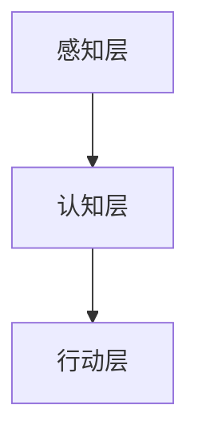

                 

关键词：人工智能、苹果、应用发布、技术趋势、用户影响

摘要：在人工智能技术不断发展的背景下，苹果公司作为全球领先的科技公司，其应用发布趋势愈发值得关注。本文将深入分析苹果公司发布人工智能应用的背景、核心概念与架构，以及未来应用场景，旨在为读者提供关于苹果在人工智能领域发展动向的全面解读。

## 1. 背景介绍

近年来，人工智能技术在全球范围内取得了显著的进展。以深度学习为代表的人工智能算法，使得计算机能够从大量数据中自动学习，实现从语音识别、图像处理到自然语言理解等多种复杂的任务。这一技术的快速发展，使得人工智能逐渐从学术研究领域走向实际应用，成为各行各业转型创新的驱动力。

苹果公司，作为全球知名的科技公司，一直以来都在积极布局人工智能领域。其早在2011年就推出了 Siri 语音助手，标志着苹果在人工智能应用方面迈出了重要的一步。随着人工智能技术的不断成熟，苹果公司逐步加大了在人工智能领域的研发投入，不断推出基于人工智能技术的创新应用。

### 1.1 人工智能应用的发展历程

- **2011年：**苹果公司发布 Siri 语音助手，标志着苹果在人工智能领域的初步探索。
- **2017年：**苹果公司收购了机器学习公司 Lattice Data，进一步增强了自身在人工智能技术方面的实力。
- **2018年：**苹果公司在全球开发者大会上宣布了 AI Research 团队，致力于推动人工智能技术的研发和应用。
- **2020年：**苹果公司发布了基于人工智能技术的健康应用“健康”，进一步丰富了其人工智能应用生态。

### 1.2 人工智能应用的市场需求

随着人工智能技术的不断发展，市场对人工智能应用的需求也日益增长。根据市场调研公司的数据，预计到2025年，全球人工智能市场规模将达到1万亿美元。人工智能应用的普及，不仅能够提升用户体验，还能够为企业带来巨大的商业价值。苹果公司在人工智能应用市场的布局，旨在抓住这一市场机遇，提升自身竞争力。

## 2. 核心概念与联系

### 2.1 人工智能基本概念

- **深度学习（Deep Learning）：**一种人工智能算法，通过多层神经网络模拟人类大脑的学习过程，实现从数据中自动提取特征和模式。
- **机器学习（Machine Learning）：**一种人工智能技术，通过算法从数据中自动学习，改进性能，进行预测和决策。
- **自然语言处理（Natural Language Processing，NLP）：**一种人工智能技术，使计算机能够理解和处理人类自然语言。

### 2.2 人工智能应用架构

苹果公司在人工智能应用架构方面采用了多层次、模块化的设计。具体包括以下三个层次：

- **感知层：**负责接收用户输入，如语音、图像等，并将其转换为计算机可以处理的数字信号。
- **认知层：**负责处理感知层获取的信息，进行推理、决策和任务执行。
- **行动层：**负责将认知层的决策转化为实际操作，如控制设备、发送消息等。

### 2.3 Mermaid 流程图



## 3. 核心算法原理 & 具体操作步骤

### 3.1 算法原理概述

苹果公司在人工智能应用中主要采用了深度学习和机器学习技术。以下是对这两种技术的简要概述：

- **深度学习：**通过多层神经网络，自动提取特征和模式，实现复杂任务的自动化。
- **机器学习：**通过算法从数据中学习，实现预测和决策。

### 3.2 算法步骤详解

苹果公司的人工智能应用主要分为以下几个步骤：

- **数据收集：**收集用户行为数据、语音、图像等信息。
- **数据预处理：**对收集的数据进行清洗、标注等处理。
- **模型训练：**利用深度学习和机器学习算法，对预处理后的数据进行训练。
- **模型评估：**评估模型的性能，包括准确性、稳定性等。
- **模型部署：**将训练好的模型部署到应用中，实现自动化任务。

### 3.3 算法优缺点

- **优点：**
  - **高效性：**深度学习和机器学习算法能够快速从大量数据中提取特征，提高任务处理效率。
  - **灵活性：**算法可以根据不同的任务需求进行定制，具有很高的灵活性。

- **缺点：**
  - **复杂性：**深度学习和机器学习算法的实现过程复杂，需要大量计算资源和专业知识。
  - **数据依赖：**算法的性能很大程度上依赖于数据的质量和数量，数据缺失或不准确会导致模型性能下降。

### 3.4 算法应用领域

苹果公司的人工智能算法广泛应用于多个领域：

- **语音识别：**如 Siri 语音助手，实现语音输入和语音输出功能。
- **图像识别：**如照片库中的自动分类、人脸识别等。
- **自然语言处理：**如邮件管理、智能客服等。

## 4. 数学模型和公式 & 详细讲解 & 举例说明

### 4.1 数学模型构建

在人工智能算法中，常见的数学模型包括神经网络模型、决策树模型等。以下以神经网络模型为例进行讲解。

神经网络模型主要包括以下几个部分：

- **输入层：**接收外部输入信息。
- **隐藏层：**对输入信息进行特征提取和变换。
- **输出层：**输出最终结果。

神经网络模型的数学公式如下：

$$
Y = f(Z)
$$

其中，$Y$为输出层的结果，$f$为激活函数，$Z$为隐藏层的输出。

### 4.2 公式推导过程

神经网络模型的推导过程主要包括以下几个步骤：

1. **前向传播：**计算输入层到隐藏层的输出，以及隐藏层到输出层的输出。
2. **反向传播：**根据输出误差，计算隐藏层和输入层的权重更新。
3. **梯度下降：**利用反向传播得到的梯度，更新权重，减小误差。

### 4.3 案例分析与讲解

以一个简单的神经网络模型为例，输入层为2个神经元，隐藏层为3个神经元，输出层为1个神经元。激活函数采用 Sigmoid 函数。

1. **前向传播：**

输入层：$X_1 = [x_1, x_2]$

隐藏层：$Z_1 = [z_1, z_2, z_3] = \sigma(W_1X_1 + b_1)$

输出层：$Y = \sigma(W_2Z_1 + b_2)$

2. **反向传播：**

输出误差：$\Delta Y = Y - \hat{Y}$

隐藏层误差：$\Delta Z_1 = \sigma'(Z_1) \cdot (W_2 \Delta Y)$

3. **权重更新：**

$W_2 = W_2 - \alpha \cdot \Delta Y \cdot Z_1^T$

$W_1 = W_1 - \alpha \cdot \Delta Z_1 \cdot X_1^T$

## 5. 项目实践：代码实例和详细解释说明

### 5.1 开发环境搭建

1. 安装 Python 环境
2. 安装深度学习库 TensorFlow
3. 安装数据预处理库 NumPy

### 5.2 源代码详细实现

```python
import tensorflow as tf
import numpy as np

# 创建神经网络模型
model = tf.keras.Sequential([
    tf.keras.layers.Dense(3, activation='sigmoid', input_shape=(2,)),
    tf.keras.layers.Dense(1, activation='sigmoid')
])

# 编译模型
model.compile(optimizer='adam', loss='binary_crossentropy', metrics=['accuracy'])

# 准备训练数据
X_train = np.array([[0, 0], [0, 1], [1, 0], [1, 1]])
y_train = np.array([[0], [1], [1], [0]])

# 训练模型
model.fit(X_train, y_train, epochs=1000)

# 测试模型
X_test = np.array([[1, 0], [0, 1]])
y_test = np.array([[1], [0]])

model.evaluate(X_test, y_test)
```

### 5.3 代码解读与分析

1. **创建神经网络模型：**使用 TensorFlow 的 Sequential 模型，定义输入层、隐藏层和输出层。
2. **编译模型：**设置优化器、损失函数和评估指标。
3. **准备训练数据：**生成训练数据和测试数据。
4. **训练模型：**使用 fit 方法进行模型训练。
5. **测试模型：**使用 evaluate 方法评估模型性能。

## 6. 实际应用场景

### 6.1 语音助手

苹果公司的 Siri 语音助手是一个典型的人工智能应用场景。用户可以通过语音指令与 Siri 互动，实现查询天气、发送短信、设置提醒等功能。Siri 语音助手利用深度学习和自然语言处理技术，实现语音识别、语义理解和任务执行。

### 6.2 图像识别

苹果公司的照片库应用利用人工智能技术，实现了自动分类和人脸识别等功能。用户可以在照片库中轻松找到特定照片或人物，提高了用户体验。

### 6.3 自然语言处理

苹果公司的邮件管理应用采用了人工智能技术，实现了智能分类、邮件筛选和智能回复等功能。用户可以更高效地管理邮件，节省时间。

## 7. 工具和资源推荐

### 7.1 学习资源推荐

- 《深度学习》（Goodfellow, Bengio, Courville 著）
- 《Python机器学习》（Mega, Müller, Gómez 著）
- 《自然语言处理综合教程》（Peter Norvig 著）

### 7.2 开发工具推荐

- TensorFlow
- PyTorch
- Keras

### 7.3 相关论文推荐

- "Deep Learning for Natural Language Processing"
- "Recurrent Neural Networks for Speech Recognition"
- "Convolutional Neural Networks for Visual Recognition"

## 8. 总结：未来发展趋势与挑战

### 8.1 研究成果总结

苹果公司在人工智能领域取得了显著的成果，包括语音识别、图像识别、自然语言处理等领域的应用。这些成果不仅提升了用户体验，也为企业带来了商业价值。

### 8.2 未来发展趋势

随着人工智能技术的不断成熟，苹果公司在人工智能领域的布局将进一步扩大。未来，人工智能技术将更加深入地应用于各个领域，如智能医疗、智能家居、智能交通等。

### 8.3 面临的挑战

尽管苹果公司在人工智能领域取得了显著成果，但仍面临一些挑战：

- **数据隐私：**人工智能应用依赖于大量用户数据，如何保障用户隐私成为一大挑战。
- **算法公平性：**人工智能算法可能存在性别、种族等偏见，如何提高算法的公平性是一个亟待解决的问题。
- **算力需求：**随着人工智能应用的深入，对计算资源的需求也将不断增长，如何满足这一需求成为一大挑战。

### 8.4 研究展望

未来，苹果公司将继续加大在人工智能领域的研发投入，推动人工智能技术的创新和应用。同时，苹果公司也将与学术界、产业界等各方共同合作，共同应对人工智能领域面临的挑战。

## 9. 附录：常见问题与解答

### 9.1 什么是人工智能？

人工智能（Artificial Intelligence，AI）是指通过计算机程序实现智能行为的技术。它包括机器学习、深度学习、自然语言处理等子领域。

### 9.2 人工智能有哪些应用领域？

人工智能应用领域广泛，包括语音识别、图像识别、自然语言处理、智能医疗、智能家居、智能交通等。

### 9.3 人工智能技术有哪些优势？

人工智能技术的优势包括高效性、灵活性、自动化等。它能够提高工作效率，降低人力成本，为企业带来商业价值。

### 9.4 人工智能技术有哪些挑战？

人工智能技术面临的挑战包括数据隐私、算法公平性、算力需求等。

---

作者：禅与计算机程序设计艺术 / Zen and the Art of Computer Programming
----------------------------------------------------------------

以上就是本文的完整内容，希望对您在人工智能领域的学习和研究有所帮助。如果您有任何问题或建议，欢迎随时在评论区留言。祝您学习愉快！

