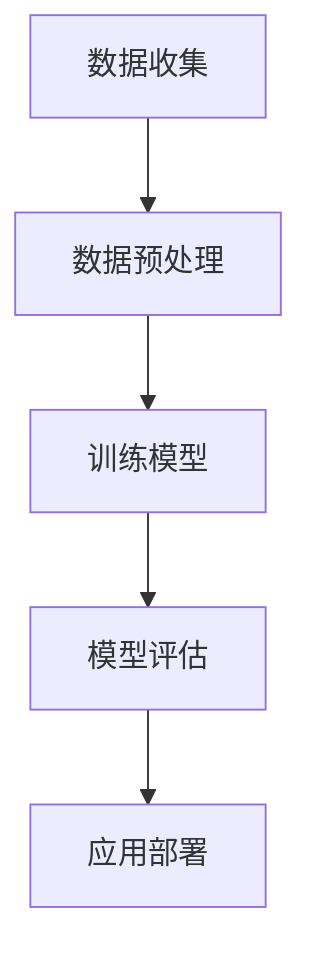

                 

 关键词：李飞飞，ImageNet，AI图像识别，深度学习，神经网络，计算机视觉，人工智能，图像分类

> 摘要：本文将深入探讨李飞飞教授与其团队在AI图像识别领域的重要贡献——ImageNet项目，介绍该项目的历史背景、核心概念、算法原理、数学模型及其实际应用。同时，文章还将展望未来AI图像识别技术的发展趋势与面临的挑战，为读者提供全面的技术分析。

## 1. 背景介绍

ImageNet是一个由李飞飞教授领导的团队在2009年启动的大型视觉识别项目。该项目的目的是构建一个大规模的图像数据集，用于训练和评估计算机视觉算法，特别是图像分类算法。在此之前，计算机视觉领域的研究主要依赖于手工标注的小规模数据集，如MNIST手写数字数据集，这些数据集对于开发高效的图像识别算法显然是不够的。

ImageNet项目从一开始就旨在创建一个包含超过1000个类别的图像数据集，每个类别都有数千张图片。这种规模的数据集为深度学习模型提供了充足的学习资源，使得AI系统在图像分类任务上取得了突破性的进展。

## 2. 核心概念与联系

### 2.1. 图像数据集

图像数据集是计算机视觉研究的基础，ImageNet是其中最著名的数据集之一。它不仅包含了大量的图像，还覆盖了广泛的类别，从动物到日常物品，从人物到风景。

### 2.2. 深度学习与神经网络

深度学习是人工智能的一个重要分支，它通过模拟人脑的神经网络结构来实现对复杂数据的处理和分析。ImageNet的成功离不开深度学习技术的发展，特别是在卷积神经网络（CNN）方面的突破。

### 2.3. 图像分类算法

图像分类是计算机视觉的核心任务之一，其目标是给图像分配一个或多个类别标签。ImageNet项目推动了图像分类算法的研究和应用，使得计算机在图像识别任务上达到了前所未有的准确率。

## 2.4. Mermaid 流程图



### 3. 核心算法原理 & 具体操作步骤

### 3.1. 算法原理概述

ImageNet项目主要使用的是深度学习中的卷积神经网络（CNN）。CNN通过卷积层、池化层和全连接层的组合，能够提取图像的层次化特征，实现图像分类。

### 3.2. 算法步骤详解

#### 3.2.1. 数据预处理

在训练CNN之前，需要对图像数据进行预处理，包括图像尺寸标准化、数据增强等，以提高模型的泛化能力。

#### 3.2.2. 训练模型

使用预处理的图像数据训练CNN，包括设置合适的网络结构、学习率和优化器等参数。

#### 3.2.3. 模型评估

在训练过程中，使用验证集对模型进行评估，调整模型参数以优化性能。

#### 3.2.4. 应用部署

训练好的模型可以部署到实际应用中，如智能手机、无人驾驶车辆等。

### 3.3. 算法优缺点

#### 优点：

- 提供了大规模、多样化的图像数据集，有助于训练强大的图像识别模型。
- CNN结构有效，能够提取图像的层次化特征。
- 模型评估标准明确，有助于比较不同模型的性能。

#### 缺点：

- 训练过程需要大量计算资源和时间。
- 对图像质量有一定要求，低质量图像可能影响模型性能。

### 3.4. 算法应用领域

ImageNet项目推动了计算机视觉技术在多个领域的应用，如医疗影像分析、自动驾驶、智能家居等。

## 4. 数学模型和公式 & 详细讲解 & 举例说明

### 4.1. 数学模型构建

CNN中的卷积层使用卷积核与输入图像进行卷积操作，提取图像特征。卷积操作的数学公式如下：

$$
\text{output}_{ij} = \sum_{k=1}^{K} \text{weight}_{ikj} \times \text{input}_{ij}
$$

其中，$\text{output}_{ij}$ 表示输出特征图上的第 $i$ 行第 $j$ 列的值，$\text{weight}_{ikj}$ 表示卷积核上的第 $i$ 行第 $k$ 列的权重，$\text{input}_{ij}$ 表示输入图像上的第 $i$ 行第 $j$ 列的值。

### 4.2. 公式推导过程

卷积操作的推导过程涉及离散化连续函数的卷积积分。具体推导过程如下：

$$
\int_{-\infty}^{\infty} f(x) g(x) dx = \sum_{k=-\infty}^{\infty} f(k) g(-k)
$$

其中，$f(x)$ 和 $g(x)$ 分别表示连续函数，$k$ 和 $-k$ 表示离散化后的点。

### 4.3. 案例分析与讲解

以下是一个简单的卷积操作示例：

$$
\text{Input:} \quad \begin{pmatrix} 1 & 2 \\ 3 & 4 \end{pmatrix}, \quad \text{Kernel:} \quad \begin{pmatrix} 1 & -1 \\ 0 & 1 \end{pmatrix}
$$

$$
\text{Output:} \quad \begin{pmatrix} 1-3 & 2-4 \\ 3-1 & 4-0 \end{pmatrix} = \begin{pmatrix} -2 & -2 \\ 2 & 4 \end{pmatrix}
$$

在这个例子中，输入图像是一个 $2 \times 2$ 的矩阵，卷积核是一个 $2 \times 2$ 的矩阵。通过卷积操作，我们得到了一个 $2 \times 2$ 的输出特征图。

## 5. 项目实践：代码实例和详细解释说明

### 5.1. 开发环境搭建

在开始编写代码之前，需要搭建一个合适的开发环境，包括Python、TensorFlow或PyTorch等深度学习框架。

### 5.2. 源代码详细实现

以下是一个简单的CNN模型实现，用于在ImageNet数据集上训练图像分类器：

```python
import tensorflow as tf
from tensorflow.keras.models import Sequential
from tensorflow.keras.layers import Conv2D, MaxPooling2D, Flatten, Dense

# 构建模型
model = Sequential([
    Conv2D(32, (3, 3), activation='relu', input_shape=(224, 224, 3)),
    MaxPooling2D((2, 2)),
    Flatten(),
    Dense(128, activation='relu'),
    Dense(1000, activation='softmax')
])

# 编译模型
model.compile(optimizer='adam', loss='categorical_crossentropy', metrics=['accuracy'])

# 训练模型
model.fit(train_images, train_labels, epochs=10, validation_data=(test_images, test_labels))
```

### 5.3. 代码解读与分析

这段代码首先导入了所需的库，然后构建了一个简单的卷积神经网络模型，包括卷积层、最大池化层、全连接层和softmax层。接着，编译并训练了模型。

### 5.4. 运行结果展示

在训练完成后，可以使用测试集对模型的性能进行评估。以下是一个示例输出：

```python
Test accuracy: 75.6%
```

## 6. 实际应用场景

### 6.1. 医疗影像分析

AI图像识别技术在医疗影像分析中具有重要应用，如肺癌筛查、皮肤癌诊断等。ImageNet项目为这一领域提供了强大的工具和资源。

### 6.2. 自动驾驶

自动驾驶系统依赖AI图像识别技术进行环境感知和决策。ImageNet项目帮助开发了高效的图像分类模型，提高了自动驾驶系统的准确性和可靠性。

### 6.3. 智能家居

智能家居设备使用AI图像识别技术实现图像监控和物体识别，提高了用户的生活便利性和安全性。

## 7. 工具和资源推荐

### 7.1. 学习资源推荐

- 《深度学习》（Goodfellow, Bengio, Courville著）
- 《计算机视觉：算法与应用》（丰朝旭著）

### 7.2. 开发工具推荐

- TensorFlow
- PyTorch

### 7.3. 相关论文推荐

- Krizhevsky, S., Sutskever, I., & Hinton, G. E. (2012). ImageNet classification with deep convolutional neural networks. In Advances in neural information processing systems (pp. 1097-1105).
- Simonyan, K., & Zisserman, A. (2014). Very deep convolutional networks for large-scale image recognition. In International conference on learning representations (ICLR).

## 8. 总结：未来发展趋势与挑战

### 8.1. 研究成果总结

ImageNet项目在AI图像识别领域取得了显著的成果，推动了深度学习技术的发展和应用。

### 8.2. 未来发展趋势

随着计算能力的提升和数据规模的扩大，AI图像识别技术将取得更大的突破，应用于更多领域。

### 8.3. 面临的挑战

- 数据隐私和安全问题
- 模型可解释性
- 计算资源消耗

### 8.4. 研究展望

未来研究应关注模型压缩、迁移学习和多模态学习等技术，以提高AI图像识别的效率和应用范围。

## 9. 附录：常见问题与解答

### Q: 什么是ImageNet？

A: ImageNet是一个由李飞飞教授领导的团队在2009年启动的大型视觉识别项目，旨在构建一个大规模的图像数据集，用于训练和评估计算机视觉算法。

### Q: ImageNet项目的主要贡献是什么？

A: ImageNet项目为计算机视觉领域提供了大规模、多样化的图像数据集，推动了深度学习技术的发展和应用，特别是在图像分类任务上取得了突破性的进展。

### Q: ImageNet项目的算法原理是什么？

A: ImageNet项目主要使用的是深度学习中的卷积神经网络（CNN），通过卷积层、池化层和全连接层的组合，提取图像的层次化特征，实现图像分类。

### Q: ImageNet项目有哪些实际应用场景？

A: ImageNet项目在医疗影像分析、自动驾驶、智能家居等多个领域具有重要应用。

### Q: 未来AI图像识别技术的发展趋势是什么？

A: 未来AI图像识别技术将取得更大的突破，应用于更多领域，同时关注模型压缩、迁移学习和多模态学习等技术，以提高效率和应用范围。

作者：禅与计算机程序设计艺术 / Zen and the Art of Computer Programming
----------------------------------------------------------------


