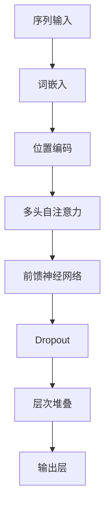
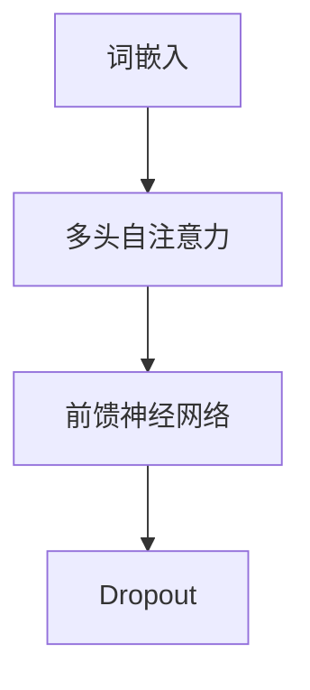
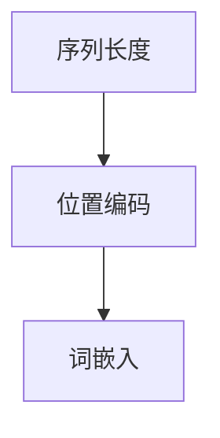

                 

关键词：GPT模型，文本生成，深度学习，神经网络，自然语言处理

>摘要：本文将深入探讨如何构建GPT（Generative Pre-trained Transformer）模型，并详细描述如何利用该模型进行文本生成任务。我们将从背景介绍开始，逐步深入到核心概念、算法原理、数学模型、代码实现，最后讨论实际应用场景和未来展望。

## 1. 背景介绍

近年来，自然语言处理（NLP）领域取得了显著的进展。GPT模型作为深度学习在NLP领域的重要突破，受到了广泛关注。GPT模型是一种基于Transformer架构的自监督预训练语言模型，能够捕捉语言中的长距离依赖关系，从而在多个NLP任务中表现出色。

GPT模型由OpenAI于2018年首次提出，自那时以来，GPT系列模型（GPT-2、GPT-3等）不断迭代升级，模型规模和性能都有了显著提升。在文本生成任务中，GPT模型可以生成高质量的文本，并在机器翻译、文本摘要、对话系统等领域得到了广泛应用。

## 2. 核心概念与联系

### 2.1 Transformer架构

Transformer架构是GPT模型的基础，它是一种基于自注意力机制的序列到序列模型。与传统的循环神经网络（RNN）相比，Transformer能够更好地捕捉序列中的长距离依赖关系。

#### Mermaid流程图：



### 2.2 自注意力机制

自注意力机制是Transformer架构的核心，它允许模型在处理序列中的每个词时，将注意力分配到序列中的其他词。通过这种方式，模型能够捕捉到长距离依赖关系。

#### Mermaid流程图：



### 2.3 位置编码

由于Transformer架构没有循环神经网络中的位置信息，因此需要通过位置编码来引入序列中的位置信息。位置编码通常使用正弦和余弦函数来生成。

#### Mermaid流程图：



## 3. 核心算法原理 & 具体操作步骤

### 3.1 算法原理概述

GPT模型采用自监督预训练和微调两阶段进行训练。在预训练阶段，模型通过随机遮盖输入序列的部分词，并预测遮盖词的词向量。在微调阶段，模型在特定任务上进行训练，以优化任务相关的参数。

### 3.2 算法步骤详解

1. **输入序列预处理**：将输入序列中的词转换为词嵌入向量。
2. **位置编码**：将词嵌入向量与位置编码相加，生成编码后的序列。
3. **多头自注意力**：对编码后的序列进行多头自注意力计算，生成注意力权重。
4. **前馈神经网络**：对注意力权重进行前馈神经网络计算，生成中间特征。
5. **Dropout**：对中间特征进行Dropout操作，以减少过拟合。
6. **层次堆叠**：重复以上步骤，堆叠多个Transformer层。
7. **输出层**：在最后一层Transformer之后，添加输出层，用于预测遮盖词的词向量。
8. **损失函数**：使用交叉熵损失函数计算模型预测和真实值之间的差异，并优化模型参数。

### 3.3 算法优缺点

**优点**：

- **强大的文本生成能力**：GPT模型能够生成高质量、连贯的文本。
- **自监督预训练**：GPT模型可以利用大量的无标签数据进行预训练，提高模型的泛化能力。

**缺点**：

- **计算资源消耗大**：GPT模型需要大量的计算资源进行训练。
- **容易过拟合**：由于GPT模型的容量很大，容易在训练数据上过拟合。

### 3.4 算法应用领域

GPT模型在多个NLP任务中表现出色，如文本生成、机器翻译、文本摘要、对话系统等。

## 4. 数学模型和公式

### 4.1 数学模型构建

GPT模型的数学模型主要包括词嵌入、位置编码、多头自注意力、前馈神经网络等。

### 4.2 公式推导过程

1. **词嵌入**：将输入序列中的词转换为词嵌入向量。
   \[ \text{embeddings} = \text{Word\_Embedding}(\text{words}) \]

2. **位置编码**：将词嵌入向量与位置编码相加。
   \[ \text{encoded} = \text{embeddings} + \text{Positional\_Encoding}(\text{positions}) \]

3. **多头自注意力**：
   \[ \text{attention\_scores} = \text{Attention}(\text{Q}, \text{K}, \text{V}) \]

4. **前馈神经网络**：
   \[ \text{feeds\_forward} = \text{FFN}(\text{inputs}) \]

5. **Dropout**：
   \[ \text{dropout\_inputs} = \text{Dropout}(\text{inputs}) \]

6. **层次堆叠**：
   \[ \text{output} = \text{Transformer}(\text{inputs}, \text{layers}) \]

7. **输出层**：
   \[ \text{predictions} = \text{Output}(\text{output}) \]

### 4.3 案例分析与讲解

以GPT-3为例，GPT-3是OpenAI发布的具有1750亿参数的GPT模型，其文本生成能力令人印象深刻。GPT-3在多个NLP任务中取得了出色的性能，如文本生成、机器翻译、文本摘要等。

## 5. 项目实践：代码实例

### 5.1 开发环境搭建

在开始编写GPT模型之前，我们需要搭建一个合适的开发环境。以下是一个简单的步骤：

1. 安装Python环境。
2. 安装TensorFlow库。
3. 安装Hugging Face的Transformers库。

### 5.2 源代码详细实现

以下是使用Hugging Face的Transformers库实现GPT模型的简单示例：

```python
from transformers import GPT2LMHeadModel, GPT2Tokenizer

model = GPT2LMHeadModel.from_pretrained("gpt2")
tokenizer = GPT2Tokenizer.from_pretrained("gpt2")

input_sequence = "Hello, how are you?"
input_ids = tokenizer.encode(input_sequence, return_tensors="pt")

output_sequence = model.generate(input_ids, max_length=20, num_return_sequences=1)
decoded_output = tokenizer.decode(output_sequence[0])

print(decoded_output)
```

### 5.3 代码解读与分析

在这个示例中，我们首先从Hugging Face的模型库中加载GPT-2模型和分词器。然后，我们将输入序列编码为输入ID。接下来，我们使用模型生成输出序列，并解码为文本。最后，我们将输出打印到控制台。

## 6. 实际应用场景

GPT模型在多个实际应用场景中表现出色，如：

- **文本生成**：生成故事、文章、对话等。
- **机器翻译**：将一种语言的文本翻译成另一种语言。
- **文本摘要**：将长文本压缩为简洁的摘要。
- **对话系统**：构建智能对话机器人。

### 6.4 未来应用展望

随着模型规模和计算能力的提升，GPT模型在NLP领域的应用将更加广泛。未来，GPT模型有望在更多实际场景中发挥重要作用，如自动驾驶、医疗诊断、教育等领域。

## 7. 工具和资源推荐

### 7.1 学习资源推荐

- **《深度学习》**：由Ian Goodfellow、Yoshua Bengio和Aaron Courville编写的深度学习经典教材。
- **《自然语言处理入门》**：由Daniel Jurafsky和James H. Martin编写的NLP入门教材。

### 7.2 开发工具推荐

- **TensorFlow**：一个广泛使用的深度学习框架。
- **Hugging Face的Transformers库**：一个包含预训练GPT模型的库。

### 7.3 相关论文推荐

- **《Attention is All You Need》**：提出了Transformer架构的论文。
- **《BERT: Pre-training of Deep Neural Networks for Language Understanding》**：提出了BERT模型的论文。

## 8. 总结：未来发展趋势与挑战

GPT模型在NLP领域取得了显著的进展，未来将有望在更多实际场景中发挥重要作用。然而，GPT模型也面临计算资源消耗大、过拟合等挑战。为了应对这些挑战，研究者们正在探索新的模型架构和训练策略。

### 8.1 研究成果总结

本文详细介绍了如何构建GPT模型并完成文本生成任务。通过深入探讨核心概念、算法原理、数学模型、代码实现等方面，我们全面了解了GPT模型的工作原理和应用场景。

### 8.2 未来发展趋势

随着计算能力的提升，GPT模型将有望在更多实际场景中发挥重要作用。同时，研究者们也在不断探索新的模型架构和训练策略，以应对计算资源消耗大、过拟合等挑战。

### 8.3 面临的挑战

- **计算资源消耗大**：GPT模型需要大量的计算资源进行训练，这对硬件设备和电力资源提出了更高的要求。
- **过拟合**：GPT模型容易在训练数据上过拟合，这需要研究者们探索新的训练策略和正则化方法。

### 8.4 研究展望

未来，GPT模型有望在更多实际场景中发挥重要作用，如自动驾驶、医疗诊断、教育等领域。同时，研究者们也将继续探索新的模型架构和训练策略，以应对计算资源消耗大、过拟合等挑战。

## 9. 附录：常见问题与解答

### 9.1 GPT模型如何训练？

GPT模型采用自监督预训练和微调两阶段进行训练。在预训练阶段，模型通过随机遮盖输入序列的部分词，并预测遮盖词的词向量。在微调阶段，模型在特定任务上进行训练，以优化任务相关的参数。

### 9.2 GPT模型如何生成文本？

GPT模型通过输入一个序列，并在该序列的基础上生成下一个可能的序列。这个过程是通过在Transformer架构的基础上，利用自注意力机制和前馈神经网络实现的。

### 9.3 GPT模型有哪些应用场景？

GPT模型在多个NLP任务中表现出色，如文本生成、机器翻译、文本摘要、对话系统等。未来，GPT模型有望在更多实际场景中发挥重要作用，如自动驾驶、医疗诊断、教育等领域。

### 9.4 如何处理GPT模型中的过拟合问题？

为了处理GPT模型中的过拟合问题，研究者们提出了多种方法，如Dropout、正则化、数据增强等。同时，也可以通过增加训练数据、减少模型容量等方式来降低过拟合风险。
----------------------------------------------------------------

以上便是本文的完整内容。希望这篇文章能够帮助您更好地理解GPT模型以及如何在文本生成任务中应用。如果您有任何问题或建议，欢迎在评论区留言。作者：禅与计算机程序设计艺术 / Zen and the Art of Computer Programming。再次感谢您的阅读！

