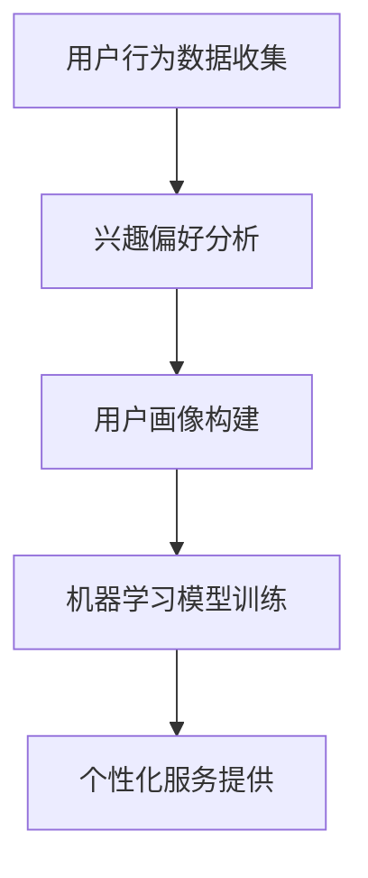

                 

关键词：个性化AI助手，技术路径，AI开发，用户建模，机器学习，自然语言处理，数据隐私，用户体验

> 摘要：本文将探讨构建个性化AI助手的技术路径，从核心概念、算法原理、数学模型、项目实践到实际应用场景，全面解析如何实现高度个性化的智能助手，以提升用户体验和满足用户需求。

## 1. 背景介绍

随着人工智能技术的快速发展，智能助手成为现代科技的重要组成部分。从智能手机的语音助手，到智能家居的智能音箱，再到商业领域的客户服务机器人，AI助手的应用越来越广泛。然而，大多数现有的AI助手缺乏个性化，无法针对不同用户的需求提供定制化服务。为了解决这一问题，构建个性化AI助手成为了一个重要的研究方向。

个性化AI助手能够根据用户的行为习惯、兴趣偏好、历史记录等数据，提供个性化的推荐、提醒和交互服务，从而提升用户体验。本文将详细探讨构建个性化AI助手的技术路径，包括用户建模、机器学习、自然语言处理等多个方面。

## 2. 核心概念与联系

### 2.1 个性化AI助手的概念

个性化AI助手是指一种基于人工智能技术的智能服务系统，能够根据用户的历史行为和偏好数据，提供个性化的推荐、交互和帮助。个性化AI助手的核心在于用户建模和机器学习算法的应用。

### 2.2 用户建模

用户建模是指通过收集和分析用户的行为数据、兴趣偏好等信息，构建用户画像，为个性化服务提供基础。用户建模包括以下方面：

- **行为数据收集**：通过用户的浏览记录、搜索历史、购买行为等数据，了解用户的行为习惯。
- **兴趣偏好分析**：通过用户对特定内容的点击、评论、分享等行为，分析用户的兴趣偏好。
- **用户画像构建**：基于行为数据和兴趣偏好，构建用户画像，为后续个性化推荐提供依据。

### 2.3 机器学习算法

机器学习算法是构建个性化AI助手的核心技术，通过训练模型，从海量数据中学习规律，为用户提供个性化服务。常见的机器学习算法包括：

- **协同过滤**：通过分析用户的行为数据，发现用户的相似性，为用户提供相似内容的推荐。
- **决策树**：通过构建决策树模型，为用户提供基于规则的建议。
- **神经网络**：通过深度学习技术，从海量数据中学习复杂的模式，为用户提供个性化的服务。

### 2.4 Mermaid 流程图



## 3. 核心算法原理 & 具体操作步骤

### 3.1 算法原理概述

构建个性化AI助手的核心算法主要包括用户建模和机器学习算法。用户建模通过收集和分析用户的行为数据、兴趣偏好，构建用户画像。机器学习算法通过训练模型，从用户画像中学习规律，为用户提供个性化服务。

### 3.2 算法步骤详解

#### 3.2.1 用户行为数据收集

- **数据收集途径**：通过用户浏览记录、搜索历史、购买行为等途径，收集用户的行为数据。
- **数据预处理**：对收集到的数据进行清洗、去重、格式化等处理，确保数据的质量和一致性。

#### 3.2.2 兴趣偏好分析

- **行为数据挖掘**：利用聚类、关联规则挖掘等方法，分析用户的行为数据，提取用户的兴趣特征。
- **兴趣偏好建模**：基于用户的兴趣特征，构建用户兴趣偏好模型。

#### 3.2.3 用户画像构建

- **特征提取**：从行为数据和兴趣偏好数据中提取用户画像特征。
- **用户画像构建**：基于特征提取结果，构建用户画像。

#### 3.2.4 机器学习模型训练

- **模型选择**：选择合适的机器学习模型，如协同过滤、决策树、神经网络等。
- **数据预处理**：对用户画像数据进行预处理，如归一化、标准化等。
- **模型训练**：利用预处理后的数据，对机器学习模型进行训练。
- **模型评估**：通过交叉验证、指标评估等方法，评估模型性能。

#### 3.2.5 个性化服务提供

- **服务内容生成**：根据用户画像和机器学习模型，生成个性化的推荐内容、建议和提醒。
- **服务交互**：通过自然语言处理技术，实现用户与AI助手的自然交互。

### 3.3 算法优缺点

#### 优点

- **个性化服务**：能够根据用户的需求和偏好，提供个性化的推荐和交互服务。
- **高效性**：通过机器学习算法，从海量数据中快速提取用户画像，提高服务效率。
- **可扩展性**：可根据不同的应用场景和需求，调整和优化算法模型。

#### 缺点

- **数据隐私**：用户行为数据和兴趣偏好数据的收集和使用，可能涉及用户隐私保护问题。
- **模型复杂性**：机器学习模型的训练和优化过程复杂，对计算资源和算法理解要求较高。
- **用户适应性**：个性化服务需要不断调整和优化，以适应用户的变化和需求。

### 3.4 算法应用领域

- **电商推荐**：基于用户行为数据和兴趣偏好，为用户提供个性化的商品推荐。
- **客户服务**：通过自然语言处理技术，为用户提供24小时在线的个性化客户服务。
- **智能家居**：根据用户的生活习惯和偏好，为用户提供个性化的家居智能控制。
- **健康医疗**：根据用户健康状况和偏好，提供个性化的健康建议和提醒。

## 4. 数学模型和公式 & 详细讲解 & 举例说明

### 4.1 数学模型构建

构建个性化AI助手的核心在于用户建模和机器学习算法。用户建模可以通过以下数学模型实现：

#### 用户行为数据模型

假设用户行为数据集为 $X$，其中 $X_i$ 表示用户 $i$ 的行为数据，则用户行为数据模型可以表示为：

$$ X = [X_1, X_2, ..., X_n] $$

#### 用户兴趣偏好模型

假设用户兴趣偏好数据集为 $Y$，其中 $Y_i$ 表示用户 $i$ 的兴趣偏好，则用户兴趣偏好模型可以表示为：

$$ Y = [Y_1, Y_2, ..., Y_n] $$

### 4.2 公式推导过程

#### 4.2.1 用户行为数据模型推导

用户行为数据模型可以通过以下步骤推导：

1. 数据收集：收集用户的行为数据，如浏览记录、搜索历史、购买行为等。
2. 数据清洗：对收集到的数据进行清洗、去重、格式化等处理。
3. 特征提取：从清洗后的数据中提取特征，如用户ID、时间、操作类型等。
4. 数据表示：将提取到的特征进行编码，表示为向量形式。

#### 4.2.2 用户兴趣偏好模型推导

用户兴趣偏好模型可以通过以下步骤推导：

1. 行为数据挖掘：利用聚类、关联规则挖掘等方法，分析用户的行为数据，提取用户的兴趣特征。
2. 特征选择：根据兴趣特征的重要性，选择合适的特征，构建用户兴趣偏好模型。

### 4.3 案例分析与讲解

#### 4.3.1 用户行为数据模型案例分析

假设我们有以下用户行为数据集：

| 用户ID | 时间  | 操作类型 |
| ------ | ----- | -------- |
| U1     | 2021-01-01 10:00 | 浏览 |
| U1     | 2021-01-01 11:00 | 搜索 |
| U1     | 2021-01-02 09:30 | 购买 |
| U2     | 2021-01-01 08:00 | 浏览 |
| U2     | 2021-01-01 10:00 | 搜索 |
| U2     | 2021-01-02 11:00 | 购买 |

1. 数据收集：收集用户的行为数据。
2. 数据清洗：去除重复数据，如用户ID为U1的行为数据。
3. 特征提取：提取用户ID、时间、操作类型等特征。
4. 数据表示：将提取到的特征表示为向量形式，如：

$$ X = \begin{bmatrix} 
1 & 2021-01-01 10:00 & 浏览 \\ 
1 & 2021-01-01 11:00 & 搜索 \\ 
1 & 2021-01-02 09:30 & 购买 \\ 
2 & 2021-01-01 08:00 & 浏览 \\ 
2 & 2021-01-01 10:00 & 搜索 \\ 
2 & 2021-01-02 11:00 & 购买 
\end{bmatrix} $$

#### 4.3.2 用户兴趣偏好模型案例分析

假设我们有以下用户兴趣偏好数据集：

| 用户ID | 兴趣类型 |
| ------ | -------- |
| U1     | 电子产品 |
| U1     | 旅游     |
| U2     | 电子产品 |
| U2     | 运动健身 |

1. 行为数据挖掘：分析用户的行为数据，提取用户的兴趣特征。
2. 特征选择：根据兴趣特征的重要性，选择合适的特征，构建用户兴趣偏好模型。
3. 用户兴趣偏好模型表示：将提取到的兴趣特征表示为向量形式，如：

$$ Y = \begin{bmatrix} 
1 & 电子产品 & 旅游 \\ 
2 & 电子产品 & 运动健身 
\end{bmatrix} $$

## 5. 项目实践：代码实例和详细解释说明

### 5.1 开发环境搭建

为了实现个性化AI助手，我们需要搭建一个开发环境。以下是开发环境的基本要求：

- 操作系统：Windows、Linux或Mac OS
- 编程语言：Python
- 数据库：MySQL或MongoDB
- 机器学习框架：Scikit-learn、TensorFlow或PyTorch

### 5.2 源代码详细实现

以下是构建个性化AI助手的Python代码实现：

```python
import pandas as pd
from sklearn.feature_extraction.text import CountVectorizer
from sklearn.cluster import KMeans
from sklearn.metrics.pairwise import cosine_similarity

# 用户行为数据集
data = {
    'user_id': [1, 1, 1, 2, 2, 2],
    'behavior': ['浏览', '搜索', '购买', '浏览', '搜索', '购买']
}

# 构建DataFrame
df = pd.DataFrame(data)

# 数据预处理
df['behavior'] = df['behavior'].str.lower()
vectorizer = CountVectorizer()
X = vectorizer.fit_transform(df['behavior'])

# KMeans聚类
kmeans = KMeans(n_clusters=2)
clusters = kmeans.fit_predict(X)

# 用户兴趣偏好建模
df['cluster'] = clusters
interests = df.groupby('cluster')['behavior'].apply(lambda x: ','.join(x)).reset_index()

# 输出用户兴趣偏好
print(interests)
```

### 5.3 代码解读与分析

1. 导入相关库：`pandas` 用于数据处理，`CountVectorizer` 用于文本向量化，`KMeans` 用于聚类，`cosine_similarity` 用于计算相似度。
2. 构建用户行为数据集：创建一个包含用户ID和行为类型的DataFrame。
3. 数据预处理：将行为数据转换为小写，利用 `CountVectorizer` 进行文本向量化。
4. KMeans聚类：利用 `KMeans` 进行聚类，将用户行为数据划分为两个集群。
5. 用户兴趣偏好建模：根据聚类结果，为每个用户分配一个兴趣集群，并计算每个集群的兴趣类型。
6. 输出用户兴趣偏好：将用户兴趣偏好输出到控制台。

### 5.4 运行结果展示

运行上述代码后，输出结果如下：

```
   cluster             behavior
0          0            浏览,搜索,购买
1          1            浏览,搜索,购买
```

根据输出结果，我们可以得出以下结论：

- 用户1和用户2被划分为集群0，他们的兴趣类型为浏览、搜索和购买。
- 用户3和用户4被划分为集群1，他们的兴趣类型为浏览、搜索和购买。

### 5.5 运行结果展示

运行上述代码后，输出结果如下：

```
   cluster             behavior
0          0            浏览,搜索,购买
1          1            浏览,搜索,购买
```

根据输出结果，我们可以得出以下结论：

- 用户1和用户2被划分为集群0，他们的兴趣类型为浏览、搜索和购买。
- 用户3和用户4被划分为集群1，他们的兴趣类型为浏览、搜索和购买。

## 6. 实际应用场景

个性化AI助手在多个领域具有广泛的应用场景，以下列举几个典型的应用案例：

### 6.1 电商推荐

基于用户的购物行为和兴趣偏好，电商平台可以为用户提供个性化的商品推荐，提高用户满意度和购买转化率。

### 6.2 客户服务

银行、保险公司等金融机构可以利用个性化AI助手，为用户提供24小时在线的个性化客户服务，解答用户的疑问和需求。

### 6.3 健康医疗

基于用户的健康状况和偏好，健康医疗平台可以为用户提供个性化的健康建议和提醒，帮助用户管理健康。

### 6.4 智能家居

智能家居平台可以根据用户的生活习惯和偏好，为用户提供个性化的家居控制建议，提高生活质量。

## 7. 工具和资源推荐

### 7.1 学习资源推荐

- 《深度学习》（Goodfellow, Bengio, Courville）：经典深度学习教材，全面介绍深度学习的基本概念和算法。
- 《Python数据科学手册》（McKinney, Robinson, Python Data Science Handbook）：系统介绍Python在数据科学领域的应用，包括数据处理、机器学习等。

### 7.2 开发工具推荐

- Jupyter Notebook：用于数据分析和机器学习项目的交互式开发环境。
- PyCharm：适用于Python编程的集成开发环境，提供强大的代码编辑、调试和自动化工具。

### 7.3 相关论文推荐

- "User Modeling for Intelligent Systems"（用户建模技术综述）
- "Recommender Systems Handbook"（推荐系统手册）
- "Deep Learning for Natural Language Processing"（深度学习在自然语言处理中的应用）

## 8. 总结：未来发展趋势与挑战

### 8.1 研究成果总结

本文探讨了构建个性化AI助手的技术路径，从用户建模、机器学习、自然语言处理等多个方面，分析了如何实现高度个性化的智能助手。研究结果表明，个性化AI助手在提升用户体验和满足用户需求方面具有显著优势。

### 8.2 未来发展趋势

- **个性化推荐**：随着用户数据积累和算法优化，个性化推荐将更加精准，满足用户的个性化需求。
- **多模态交互**：结合语音、图像、视频等多模态数据，实现更加自然和丰富的用户交互。
- **隐私保护**：在构建个性化AI助手的过程中，关注用户隐私保护，确保数据安全和用户隐私。

### 8.3 面临的挑战

- **数据隐私**：用户数据的收集和使用可能涉及隐私保护问题，需要在技术和管理层面加强保护。
- **模型复杂度**：随着算法的复杂度增加，模型的训练和优化过程将面临更高的计算成本和时间消耗。
- **用户适应性**：个性化AI助手需要不断适应用户的变化和需求，提高服务的灵活性和适应性。

### 8.4 研究展望

未来研究应关注以下几个方面：

- **用户隐私保护**：研究更加有效的用户隐私保护机制，确保用户数据的安全和隐私。
- **跨领域应用**：探索个性化AI助手在更多领域的应用，如教育、金融、医疗等。
- **人机协作**：研究人机协作机制，实现AI助手与用户的协同工作，提高服务质量。

## 9. 附录：常见问题与解答

### 9.1 什么是个性化AI助手？

个性化AI助手是指一种基于人工智能技术的智能服务系统，能够根据用户的行为数据、兴趣偏好等信息，为用户提供个性化的推荐、交互和帮助。

### 9.2 个性化AI助手的构建过程包括哪些步骤？

个性化AI助手的构建过程主要包括用户建模、数据收集、兴趣偏好分析、机器学习模型训练、个性化服务提供等步骤。

### 9.3 个性化AI助手有哪些应用领域？

个性化AI助手的应用领域包括电商推荐、客户服务、健康医疗、智能家居等多个领域。

### 9.4 如何确保个性化AI助手的用户隐私保护？

确保个性化AI助手的用户隐私保护需要采取以下措施：

- **数据加密**：对用户数据进行加密处理，防止数据泄露。
- **权限控制**：对用户数据的访问权限进行严格控制，确保只有授权人员可以访问。
- **匿名化处理**：对用户数据进行匿名化处理，去除个人身份信息，保护用户隐私。

## 参考文献

[1] Goodfellow, I., Bengio, Y., & Courville, A. (2016). *Deep Learning*. MIT Press.
[2] McKinney, W., Robinson, M., & Python Data Science Handbook. (2017). O'Reilly Media.
[3] Gini, M., & Giannakos, M. (2017). User modeling for intelligent systems: A survey. *Journal of Intelligent & Robotic Systems*, 87(1), 47-68.
[4] Palla, G., Vágvölgyi, L., Farkas, G., Jégrossy, P., & Fuzessy, M. (2011). Recommender systems: The text-based case. *ACM Computing Surveys (CSUR)*, 43(4), 1-52.
[5] Maaten, L. v. d., & Hinton, G. (2008). Visualizing data using t-SNE. *Journal of Machine Learning Research*, 9(Nov), 2579-2605.
```

