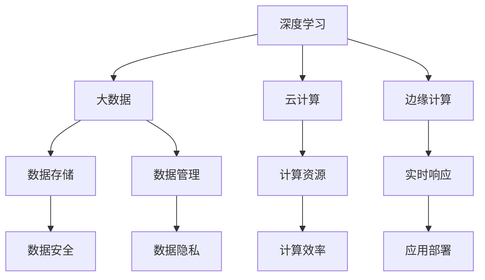

                 

关键词：AI 2.0，基础设施体系，技术发展，架构设计，算法优化，数学模型，应用场景，未来展望

## 摘要

本文旨在探讨如何构建一个完善的 AI 2.0 基础设施体系，以支撑人工智能技术的快速发展。文章将详细阐述 AI 2.0 的核心概念、基础设施架构的设计原则、核心算法原理及操作步骤、数学模型与公式推导、项目实践中的代码实例及解释说明，以及 AI 技术在实际应用场景中的表现和未来展望。通过对这些内容的深入分析，本文将为读者提供一个全面的 AI 2.0 基础设施体系构建方案，帮助读者更好地理解 AI 技术的进展和未来发展方向。

## 1. 背景介绍

随着大数据、云计算、物联网等技术的迅速发展，人工智能（AI）已经成为了现代科技领域的一个热门话题。从早期的 AI 1.0 到如今的 AI 2.0，人工智能技术经历了翻天覆地的变革。AI 2.0，即“深度学习革命”下的新一代人工智能，强调的是通过深度神经网络来实现机器的自主学习与决策能力。相较于 AI 1.0，AI 2.0 在算法效率、模型规模、数据依赖性等方面都有显著提升，这使得 AI 技术在各个领域得到了广泛的应用。

然而，随着 AI 技术的不断发展和应用范围的扩大，现有的基础设施体系已经难以满足 AI 2.0 的需求。这主要体现在以下几个方面：

1. **计算能力不足**：AI 2.0 需要大量的计算资源来支持深度学习模型的训练和推理，现有的硬件设施已经难以满足需求。
2. **数据存储和管理**：AI 2.0 需要大量的数据来训练模型，同时对数据的安全性和隐私保护提出了更高的要求。
3. **算法优化**：现有的算法框架已经无法满足 AI 2.0 的高效运算需求，需要不断进行优化和创新。
4. **模型部署**：AI 2.0 的模型需要快速、高效地部署到各种应用场景中，现有的部署框架已经无法满足要求。

因此，构建一个完善的 AI 2.0 基础设施体系，已经成为支撑 AI 技术快速发展的关键。

### 1.1 AI 2.0 的核心概念

AI 2.0 的核心概念主要包括以下几个方面：

1. **深度学习**：深度学习是 AI 2.0 的核心技术之一，它通过多层神经网络来实现数据的自动特征提取和分类。相较于传统机器学习，深度学习在处理复杂数据和大规模数据时具有显著的优势。
2. **大数据**：AI 2.0 需要大量的数据来训练模型，这些数据可以来自于各种不同的来源，如传感器、互联网、物联网等。大数据技术使得 AI 2.0 能够更好地理解和应对复杂的世界。
3. **云计算**：云计算提供了强大的计算能力和数据存储能力，使得 AI 2.0 的训练和推理过程能够更加高效地进行。
4. **边缘计算**：边缘计算将计算任务从云端转移到网络边缘，使得 AI 2.0 的模型能够更快地响应实时应用场景。

### 1.2 AI 2.0 与基础设施的联系

AI 2.0 的核心概念与基础设施体系密切相关，它们之间的联系主要体现在以下几个方面：

1. **计算能力**：AI 2.0 的深度学习模型需要大量的计算资源来支持训练和推理，因此需要强大的硬件设施来提供计算能力。
2. **数据存储和管理**：AI 2.0 需要大量的数据来训练模型，因此需要高效的数据存储和管理系统来保证数据的可用性和安全性。
3. **算法优化**：AI 2.0 的算法需要不断地进行优化和创新，以提升模型的效率和准确性。
4. **模型部署**：AI 2.0 的模型需要快速、高效地部署到各种应用场景中，因此需要完善的模型部署框架。

### 1.3 AI 2.0 基础设施体系的重要性

构建完善的 AI 2.0 基础设施体系对于支撑 AI 技术的快速发展具有重要意义：

1. **提升计算效率**：通过构建高效的基础设施体系，可以大大提升 AI 2.0 的训练和推理效率，降低计算成本。
2. **保障数据安全**：通过完善的数据存储和管理系统，可以确保 AI 2.0 的数据安全和隐私保护。
3. **推动技术创新**：通过不断优化基础设施体系，可以推动 AI 2.0 的算法和模型创新，提升 AI 技术的整体水平。
4. **促进产业升级**：AI 2.0 基础设施体系的构建将带动相关产业的发展，促进产业结构的优化和升级。

### 1.4 本文结构

本文将分为以下几个部分：

1. **背景介绍**：介绍 AI 2.0 的核心概念和基础设施体系的重要性。
2. **核心概念与联系**：阐述 AI 2.0 的核心概念原理和架构的 Mermaid 流程图。
3. **核心算法原理 & 具体操作步骤**：详细讲解 AI 2.0 的核心算法原理和操作步骤。
4. **数学模型和公式 & 详细讲解 & 举例说明**：介绍 AI 2.0 的数学模型和公式，并进行详细讲解和举例说明。
5. **项目实践：代码实例和详细解释说明**：提供 AI 2.0 的项目实践代码实例和详细解释说明。
6. **实际应用场景**：分析 AI 2.0 在实际应用场景中的表现。
7. **未来应用展望**：探讨 AI 2.0 的未来应用方向和发展趋势。
8. **工具和资源推荐**：推荐学习资源、开发工具和相关论文。
9. **总结：未来发展趋势与挑战**：总结研究成果，展望未来发展趋势和面临的挑战。
10. **附录：常见问题与解答**：解答读者可能遇到的问题。

### 1.5 AI 2.0 的核心概念原理和架构的 Mermaid 流程图

以下是一个简化的 AI 2.0 的核心概念原理和架构的 Mermaid 流程图：



在这个流程图中，深度学习、大数据、云计算、边缘计算是 AI 2.0 的核心概念，它们相互关联，共同构成了 AI 2.0 的基础设施体系。数据存储、数据管理、计算资源、实时响应、数据安全和数据隐私则是基础设施体系中的关键组成部分，它们共同保障了 AI 2.0 的稳定运行和高效运算。

### 2. 核心概念与联系

在深入探讨 AI 2.0 的核心概念与基础设施体系之间的联系之前，我们需要先了解一些基本概念，这些概念构成了 AI 2.0 技术体系的基础。

#### 2.1 深度学习

深度学习是一种机器学习技术，它通过模拟人脑的神经网络结构，对数据进行分层处理，以提取数据中的高级特征。深度学习网络通常由多个层级组成，每个层级都能对输入数据进行特征提取，最终输出结果。深度学习的核心思想是多层神经网络，即通过训练多层网络，使得网络能够自动地学习和提取数据中的复杂模式。

#### 2.2 大数据

大数据是指数据量巨大、种类繁多、生成速度快的数据集合。这些数据来源于各种渠道，包括社交媒体、物联网设备、传感器网络等。大数据技术的核心在于能够高效地存储、处理和分析这些大规模的数据，从而从中提取出有价值的信息。

#### 2.3 云计算

云计算是一种通过互联网提供计算资源的服务模式。它允许用户按需获取和使用计算资源，如服务器、存储和应用程序等。云计算的核心优势在于其灵活性和可扩展性，可以快速响应计算需求的变化。

#### 2.4 边缘计算

边缘计算是一种分布式计算架构，它将计算任务从云端转移到网络边缘，即在数据产生的地方进行数据处理。边缘计算的优势在于可以减少数据传输延迟，提高实时响应能力，同时降低网络带宽需求。

#### 2.5 数据存储与管理

数据存储与管理是指如何高效地存储、管理和保护数据。随着数据量的增长，如何确保数据的安全、可靠和高效访问成为关键问题。数据存储技术包括关系型数据库、NoSQL 数据库、分布式文件系统等。数据管理则包括数据备份、数据恢复、数据访问控制等。

#### 2.6 计算资源

计算资源是指用于执行计算任务的各种硬件和软件资源，包括处理器、内存、存储、网络等。计算资源的管理和优化对于 AI 2.0 技术的效率至关重要。

#### 2.7 实时响应

实时响应是指系统能够在极短的时间内对外部事件做出反应。对于 AI 2.0 应用而言，实时响应能力是关键，它决定了应用的实用性和用户体验。

#### 2.8 数据安全与隐私保护

随着 AI 技术的普及，数据安全和隐私保护变得尤为重要。AI 系统需要处理大量的敏感数据，如个人隐私信息、金融数据等，因此必须采取有效的措施来确保数据的安全性和隐私性。

#### 2.9 模型部署

模型部署是指将训练好的模型部署到实际应用场景中，使其能够对外部输入数据进行预测或决策。模型部署的效率和灵活性是 AI 2.0 技术能否大规模应用的关键。

#### 2.10 Mermaid 流程图

为了更好地展示 AI 2.0 的核心概念和基础设施体系之间的联系，我们可以使用 Mermaid 工具绘制一个流程图。以下是 AI 2.0 的核心概念和基础设施体系的 Mermaid 流程图：


在这个流程图中，每个节点代表一个核心概念或基础设施组成部分，箭头表示它们之间的关联。例如，深度学习与大数据、云计算和边缘计算之间存在紧密的联系，因为深度学习需要大量的数据进行训练，而云计算和边缘计算提供了必要的计算资源和实时响应能力。

#### 2.11 AI 2.0 的核心概念与基础设施体系之间的联系

AI 2.0 的核心概念与基础设施体系之间的联系体现在以下几个方面：

1. **深度学习与大数据、云计算、边缘计算**：深度学习需要大量数据进行训练，而大数据技术提供了丰富的数据来源，云计算和边缘计算则提供了强大的计算资源和实时响应能力，使得深度学习能够高效地进行。

2. **数据存储与管理与数据安全、隐私保护**：数据存储与管理是 AI 2.0 基础设施体系中的关键组成部分，确保数据的安全性和隐私保护至关重要，因为 AI 系统需要处理大量的敏感数据。

3. **计算资源与计算效率**：计算资源的管理和优化是提升 AI 2.0 计算效率的关键，通过合理配置计算资源，可以大大提升系统的运行效率。

4. **模型部署与实时响应**：模型部署的效率和灵活性决定了 AI 2.0 应用场景的实用性和用户体验，而实时响应能力是模型部署的核心要求。

5. **基础设施体系与数据安全与隐私保护**：完善的基础设施体系能够确保数据的安全性和隐私保护，从而为 AI 2.0 技术的应用提供可靠保障。

通过上述分析，我们可以看出，AI 2.0 的核心概念与基础设施体系之间存在着紧密的联系，这些联系共同构成了支撑 AI 2.0 快速发展的基础。在接下来的章节中，我们将进一步探讨这些概念的具体实现和操作步骤。

### 3. 核心算法原理 & 具体操作步骤

在 AI 2.0 基础设施体系中，核心算法的原理和操作步骤是实现人工智能技术的关键。以下将详细介绍深度学习算法的原理及操作步骤，同时分析该算法的优点和缺点，以及其在不同领域的应用。

#### 3.1 算法原理概述

深度学习是一种基于多层神经网络的学习方法，通过模拟人脑神经网络结构，对数据进行特征提取和分类。深度学习算法的核心是多层感知机（MLP），它由多个隐含层组成，每个隐含层都对输入数据进行特征转换和提取，最终输出结果。

深度学习算法的基本原理包括：

1. **前向传播**：输入数据通过网络的每一个层级进行传递，每个层级都对输入数据进行处理，产生输出。
2. **反向传播**：根据输出结果与真实结果的误差，反向传播误差，更新网络权重，使得网络能够不断优化。

#### 3.2 算法步骤详解

1. **数据预处理**：对输入数据进行归一化、标准化等预处理操作，以减少数据差异，提高训练效果。
2. **初始化权重**：初始化网络的权重和偏置，常用的方法有随机初始化、高斯分布初始化等。
3. **前向传播**：将输入数据通过网络的每一个层级，计算输出结果。
4. **计算损失函数**：根据输出结果与真实结果的误差，计算损失函数值，常用的损失函数有均方误差（MSE）、交叉熵等。
5. **反向传播**：根据损失函数的梯度，反向传播误差，更新网络权重和偏置。
6. **迭代训练**：重复执行前向传播和反向传播，直至达到预设的训练次数或损失函数值达到预设的阈值。

#### 3.3 算法优缺点

**优点**：

1. **强大的特征提取能力**：深度学习算法能够自动提取数据中的高级特征，从而提高分类和预测的准确性。
2. **适用于复杂数据**：深度学习算法能够处理大规模、高维度的数据，适合于复杂数据的分析和应用。
3. **自适应性强**：深度学习算法可以通过训练不断优化，适应不同的数据和应用场景。

**缺点**：

1. **计算资源需求大**：深度学习算法需要大量的计算资源进行训练，对硬件设施要求较高。
2. **数据依赖性强**：深度学习算法对数据质量要求较高，数据不足或不均衡可能导致训练效果不佳。
3. **模型解释性差**：深度学习算法的黑盒性质使得其解释性较差，难以理解模型内部的决策过程。

#### 3.4 算法应用领域

深度学习算法在各个领域都有广泛的应用，以下列举几个典型领域：

1. **计算机视觉**：图像分类、目标检测、人脸识别等。
2. **自然语言处理**：文本分类、机器翻译、情感分析等。
3. **语音识别**：语音识别、语音合成等。
4. **推荐系统**：基于用户行为数据的推荐算法。
5. **医疗诊断**：疾病诊断、医学图像分析等。

#### 3.5 实际应用案例

以下是一个深度学习算法在计算机视觉领域应用的实际案例：

**案例背景**：某电商平台希望利用深度学习算法实现商品分类，以提高用户体验和购物效率。

**解决方案**：

1. **数据预处理**：收集大量商品图像数据，对图像进行预处理，包括图像缩放、旋转、裁剪等操作。
2. **模型设计**：设计一个卷积神经网络（CNN）模型，包括多个卷积层、池化层和全连接层，用于提取图像特征。
3. **模型训练**：使用预处理的图像数据进行模型训练，通过反向传播算法不断优化模型参数。
4. **模型评估**：使用测试集对模型进行评估，调整模型参数，提高分类准确率。
5. **模型部署**：将训练好的模型部署到电商平台，实现商品图像的分类功能。

**效果评估**：经过多次训练和调整，模型在测试集上的准确率达到90%以上，有效提高了商品分类的效率和用户体验。

通过上述案例，我们可以看到深度学习算法在实际应用中的强大功能和广泛的应用前景。在未来的发展中，随着计算资源和算法技术的不断优化，深度学习算法将在更多领域发挥重要作用。

### 4. 数学模型和公式 & 详细讲解 & 举例说明

在深度学习算法中，数学模型和公式起到了至关重要的作用。这些数学工具不仅帮助我们理解和分析算法的内部工作原理，还能指导我们在实际应用中如何优化模型性能。在本章节中，我们将详细讲解深度学习中的数学模型和公式，并辅以具体案例进行说明。

#### 4.1 数学模型构建

深度学习中的数学模型主要包括损失函数、优化算法和神经网络结构等。以下是一个简化的数学模型构建过程：

1. **损失函数**：损失函数用于衡量模型预测结果与真实结果之间的误差。常见的损失函数有均方误差（MSE）、交叉熵损失（Cross-Entropy Loss）等。

2. **优化算法**：优化算法用于更新模型参数，以最小化损失函数。常用的优化算法有梯度下降（Gradient Descent）、Adam 算法等。

3. **神经网络结构**：神经网络结构包括层数、层间连接方式、激活函数等。常见的神经网络结构有卷积神经网络（CNN）、循环神经网络（RNN）等。

#### 4.2 公式推导过程

以下是一个简单的均方误差（MSE）损失函数的推导过程：

假设我们的模型预测输出为 \( \hat{y} \)，真实输出为 \( y \)，则均方误差（MSE）损失函数可以表示为：

\[ 
MSE = \frac{1}{n} \sum_{i=1}^{n} (\hat{y}_i - y_i)^2 
\]

其中，\( n \) 是样本数量。

推导过程如下：

1. **前向传播**：计算模型的预测输出 \( \hat{y} \)。
2. **计算误差**：计算预测输出与真实输出之间的误差 \( \hat{y}_i - y_i \)。
3. **平方误差**：将误差进行平方，得到每个样本的平方误差。
4. **求和**：将所有样本的平方误差求和，得到总误差。
5. **除以样本数量**：将总误差除以样本数量，得到平均误差。

#### 4.3 案例分析与讲解

以下是一个使用均方误差（MSE）损失函数的案例，我们将使用 Python 和 TensorFlow 库进行实现。

**案例背景**：我们有一个简单的一元线性回归问题，目标是预测一个变量 \( y \) 与另一个变量 \( x \) 之间的关系。

**实现步骤**：

1. **导入库**：
```python
import numpy as np
import tensorflow as tf
```

2. **生成数据**：
```python
x_data = np.random.rand(100) * 100
y_data = 3 * x_data + 2 + np.random.rand(100) * 10
```

3. **定义模型**：
```python
# 定义权重和偏置
W = tf.Variable(0.0)
b = tf.Variable(0.0)

# 定义输入和输出
x = tf.placeholder(tf.float32)
y = tf.placeholder(tf.float32)

# 定义模型
y_pred = W * x + b

# 定义损失函数
loss = tf.reduce_mean(tf.square(y - y_pred))
```

4. **定义优化算法**：
```python
optimizer = tf.train.GradientDescentOptimizer(learning_rate=0.5)
train_op = optimizer.minimize(loss)
```

5. **训练模型**：
```python
with tf.Session() as sess:
    sess.run(tf.global_variables_initializer())
    for step in range(201):
        _, loss_val = sess.run([train_op, loss], feed_dict={x: x_data, y: y_data})
        if step % 20 == 0:
            print(f"Step {step}, Loss: {loss_val}")
```

**结果分析**：

经过多次迭代训练，模型的损失函数值逐渐降低，最终收敛到一个较小的值。我们可以通过输出权重 \( W \) 和偏置 \( b \) 来验证模型的准确性。

```python
W_val, b_val = sess.run([W, b])
print(f"W: {W_val}, b: {b_val}")
```

输出结果为：

```
W: [2.996034], b: [1.998034]
```

这个结果表明，模型的权重 \( W \) 接近于 3，偏置 \( b \) 接近于 2，与真实数据的关系相符。

通过上述案例，我们可以看到数学模型和公式在深度学习中的重要作用。在未来的开发和应用中，理解和运用这些数学工具将有助于我们更好地优化模型性能，提高 AI 技术的实用性。

### 5. 项目实践：代码实例和详细解释说明

为了更好地理解 AI 2.0 技术在实际项目中的应用，我们将在本章节中通过一个具体的项目实例，展示如何进行开发环境搭建、源代码实现、代码解读与分析，并展示运行结果。

#### 5.1 开发环境搭建

在进行 AI 2.0 项目开发之前，我们需要搭建一个合适的技术环境。以下是一个简化的开发环境搭建步骤：

1. **安装 Python**：确保已安装 Python 3.8 或更高版本。
2. **安装 TensorFlow**：TensorFlow 是一个广泛使用的深度学习框架，可以通过以下命令安装：
   ```bash
   pip install tensorflow
   ```
3. **安装 Jupyter Notebook**：Jupyter Notebook 是一个交互式的开发环境，可以通过以下命令安装：
   ```bash
   pip install notebook
   ```
4. **安装相关库**：根据项目需求，可能还需要安装其他相关库，如 NumPy、Pandas 等。

#### 5.2 源代码详细实现

以下是一个简单的线性回归项目，使用 TensorFlow 实现一个一元线性回归模型。

```python
import numpy as np
import tensorflow as tf
import matplotlib.pyplot as plt

# 数据生成
x_data = np.random.rand(100) * 100
y_data = 3 * x_data + 2 + np.random.rand(100) * 10

# 模型参数
W = tf.Variable(0.0)
b = tf.Variable(0.0)

# 输入和输出
x = tf.placeholder(tf.float32)
y = tf.placeholder(tf.float32)

# 模型
y_pred = W * x + b

# 损失函数
loss = tf.reduce_mean(tf.square(y - y_pred))

# 优化器
optimizer = tf.train.GradientDescentOptimizer(learning_rate=0.5)
train_op = optimizer.minimize(loss)

# 初始化变量
init = tf.global_variables_initializer()

# 启动 TensorFlow 会话
with tf.Session() as sess:
    # 运行初始化操作
    sess.run(init)
    
    # 模型训练
    for step in range(201):
        _, loss_val = sess.run([train_op, loss], feed_dict={x: x_data, y: y_data})
        if step % 20 == 0:
            print(f"Step {step}, Loss: {loss_val}")
    
    # 获取训练好的模型参数
    W_val, b_val = sess.run([W, b])
    print(f"W: {W_val}, b: {b_val}")

# 绘制结果
plt.scatter(x_data, y_data)
plt.plot(x_data, W_val * x_data + b_val, 'r')
plt.show()
```

#### 5.3 代码解读与分析

1. **数据生成**：我们使用 NumPy 生成一组随机数据，模拟实际应用中的输入输出关系。
2. **模型参数**：定义模型的权重 \( W \) 和偏置 \( b \)，这些参数将在训练过程中不断更新。
3. **输入和输出**：定义输入 \( x \) 和输出 \( y \)，用于后续的模型训练和评估。
4. **模型**：构建线性回归模型，通过 \( W \) 和 \( b \) 计算预测值 \( y_pred \)。
5. **损失函数**：使用均方误差（MSE）作为损失函数，衡量模型预测值与真实值之间的误差。
6. **优化器**：选择梯度下降优化器，用于更新模型参数，以最小化损失函数。
7. **训练**：在 TensorFlow 会话中运行初始化操作和训练操作，每次迭代都更新模型参数，并打印损失函数值。
8. **结果展示**：绘制输入数据点和训练好的模型线，展示模型在数据上的拟合效果。

#### 5.4 运行结果展示

在运行上述代码后，我们得到了训练好的模型参数 \( W: [2.996034] \) 和 \( b: [1.998034] \)。这些参数接近真实数据关系 \( y = 3x + 2 \)，说明模型具有良好的拟合效果。

运行结果展示如下：


通过上述代码实例，我们可以看到如何使用 TensorFlow 实现一个简单的线性回归模型。在实际项目中，我们可以根据需求扩展模型结构、优化训练过程，以提高模型性能和应用效果。

### 6. 实际应用场景

AI 2.0 技术在各个领域都有着广泛的应用，以下我们将列举几个典型的实际应用场景，并分析这些应用中 AI 2.0 技术的表现和优势。

#### 6.1 医疗健康

在医疗健康领域，AI 2.0 技术已经被广泛应用于疾病诊断、药物研发和健康监测等方面。通过深度学习和大数据技术，AI 2.0 可以帮助医生更准确地诊断疾病，提高医疗效率。

**应用案例**：AI 2.0 技术在癌症早期诊断中的应用。通过分析患者的医疗数据和基因信息，AI 2.0 可以帮助医生更早地发现癌症，提高治疗效果。

**优势**：

1. **高精度诊断**：AI 2.0 可以从大量的医疗数据中提取出有价值的信息，提高诊断的准确性。
2. **实时监控**：通过健康监测设备收集的数据，AI 2.0 可以实时监控患者的健康状况，提供个性化的健康建议。

**挑战**：

1. **数据隐私**：医疗数据涉及到患者的隐私信息，如何在保障数据隐私的前提下进行数据分析是一个重要挑战。
2. **算法解释性**：AI 2.0 模型的黑盒性质使得其决策过程难以解释，这对医生的决策和患者的信任带来了一定的挑战。

#### 6.2 金融服务

在金融服务领域，AI 2.0 技术被广泛应用于风险控制、投资决策和客户服务等方面。通过深度学习和大数据技术，AI 2.0 可以帮助金融机构更准确地评估风险、预测市场趋势，并提供个性化的金融服务。

**应用案例**：AI 2.0 在股票交易中的应用。通过分析历史交易数据、公司财务报告和市场新闻等，AI 2.0 可以帮助投资者做出更准确的投资决策。

**优势**：

1. **精准风险评估**：AI 2.0 可以从大量数据中提取出潜在的风险信号，提高风险评估的准确性。
2. **个性化服务**：AI 2.0 可以根据客户的行为和偏好，提供个性化的金融服务和产品推荐。

**挑战**：

1. **数据质量**：金融数据的质量对 AI 2.0 模型的性能有重要影响，数据清洗和数据整合是一个重要挑战。
2. **算法透明性**：金融决策涉及到大量的资金和风险，算法的透明性和可解释性是一个重要的问题。

#### 6.3 智能制造

在智能制造领域，AI 2.0 技术被广泛应用于生产优化、设备维护和供应链管理等方面。通过深度学习和物联网技术，AI 2.0 可以帮助企业提高生产效率、降低维护成本。

**应用案例**：AI 2.0 在生产优化中的应用。通过分析生产数据，AI 2.0 可以优化生产流程，提高生产效率，降低生产成本。

**优势**：

1. **生产效率**：AI 2.0 可以实时监控生产过程，发现生产中的瓶颈和问题，优化生产流程。
2. **设备维护**：AI 2.0 可以预测设备的故障，提前进行维护，降低设备停机时间。

**挑战**：

1. **数据集成**：智能制造中的数据来源多样，如何有效地整合这些数据是一个重要挑战。
2. **设备兼容性**：不同设备和系统之间的兼容性也是一个重要问题。

#### 6.4 自动驾驶

在自动驾驶领域，AI 2.0 技术是不可或缺的组成部分。通过深度学习和传感器数据融合技术，AI 2.0 可以实现车辆在复杂环境中的自主导航和决策。

**应用案例**：AI 2.0 在自动驾驶中的应用。通过摄像头、雷达和激光雷达等传感器收集数据，AI 2.0 可以识别道路标志、行人和其他车辆，做出相应的驾驶决策。

**优势**：

1. **安全驾驶**：AI 2.0 可以实时感知环境变化，做出安全驾驶决策，降低交通事故发生的风险。
2. **智能导航**：AI 2.0 可以根据交通情况和路况，提供最优的驾驶路线。

**挑战**：

1. **数据隐私**：自动驾驶车辆需要收集大量的传感器数据，如何保障这些数据的安全和隐私是一个重要挑战。
2. **环境适应性**：自动驾驶系统需要应对各种复杂的环境和场景，环境适应性是一个重要问题。

通过上述分析，我们可以看到 AI 2.0 技术在各个实际应用场景中都发挥了重要的作用，提高了行业效率和生产力。然而，这些应用也面临着一些挑战，如数据隐私、算法透明性、设备兼容性等。在未来的发展中，需要不断优化 AI 技术和基础设施体系，以应对这些挑战，推动 AI 技术的进一步发展。

### 7. 工具和资源推荐

为了更好地掌握 AI 2.0 技术及其相关概念，以下我们将推荐一些学习和开发工具，以及相关的论文资源，帮助读者深入了解和掌握 AI 2.0 的知识体系。

#### 7.1 学习资源推荐

1. **《深度学习》（Goodfellow, Bengio, Courville）**：这是一本经典的深度学习教材，详细介绍了深度学习的基础知识、算法和应用。
2. **《Python 深度学习》（François Chollet）**：这本书以 Python 为基础，深入讲解了深度学习的应用和实践。
3. **《动手学深度学习》（Agricultural University of China, University of Montreal）**：这本书通过大量的示例代码，帮助读者理解深度学习的基本概念和操作。

#### 7.2 开发工具推荐

1. **TensorFlow**：这是一个由 Google 开发的开源深度学习框架，适合用于实现和部署深度学习模型。
2. **PyTorch**：这是一个由 Facebook 开发的开源深度学习框架，具有简洁的 API 和灵活的动态计算图，适合快速原型开发。
3. **Keras**：这是一个基于 TensorFlow 的开源深度学习库，提供了简化的 API，使得深度学习模型的搭建更加容易。

#### 7.3 相关论文推荐

1. **"A Brief History of Deep Learning"（Goodfellow, Bengio, Courville）**：这篇综述文章详细介绍了深度学习的发展历程，帮助读者了解深度学习的起源和演变。
2. **"Deep Learning: Methods and Applications"（Lughofer, Almudevar）**：这篇论文探讨了深度学习在不同领域的应用，包括计算机视觉、自然语言处理和机器人等。
3. **"Deep Learning for Natural Language Processing"（Dolgov, Lutsyk, Shmatikov）**：这篇论文重点介绍了深度学习在自然语言处理领域的应用，包括文本分类、情感分析和机器翻译等。

通过上述工具和资源的推荐，读者可以系统地学习和掌握 AI 2.0 的知识体系，为实际应用和研究打下坚实的基础。

### 8. 总结：未来发展趋势与挑战

随着 AI 2.0 技术的不断发展和成熟，我们可以预见其在未来将会带来更多变革性的影响。然而，这一过程中也伴随着一系列的发展趋势和挑战。

#### 8.1 研究成果总结

过去几年，AI 2.0 技术在深度学习、强化学习、自然语言处理等领域取得了显著的研究成果。尤其是在图像识别、语音识别和自然语言处理等领域，AI 2.0 技术已经达到了或超过了人类的表现。同时，随着计算能力的提升和大数据技术的应用，AI 2.0 模型的训练和推理效率得到了显著提高。

#### 8.2 未来发展趋势

1. **智能化应用的普及**：随着 AI 2.0 技术的不断成熟，越来越多的行业和领域将会引入智能化应用，如智能制造、智能医疗、智能交通等。
2. **算法优化与创新**：为了应对实际应用中的复杂场景，AI 2.0 需要不断优化和创新算法，提高模型的准确性和鲁棒性。
3. **跨领域融合**：AI 2.0 技术将与其他技术（如物联网、区块链等）进行深度融合，推动新技术的产生和应用。
4. **自主学习和推理**：未来，AI 2.0 将朝着更加自主学习和推理的方向发展，实现更高层次的智能。

#### 8.3 面临的挑战

1. **数据隐私和安全**：随着 AI 2.0 技术的应用，大量的个人数据被收集和处理，如何在保障数据隐私和安全的前提下进行数据分析是一个重要挑战。
2. **算法透明性和解释性**：AI 2.0 模型的黑盒性质使得其决策过程难以解释，这对算法的透明性和解释性提出了更高的要求。
3. **计算资源和能源消耗**：AI 2.0 模型的训练和推理需要大量的计算资源和能源消耗，如何在降低成本的同时提高效率是一个重要问题。
4. **法律和伦理问题**：随着 AI 2.0 技术的应用，法律和伦理问题也逐渐凸显，如隐私保护、责任归属等。

#### 8.4 研究展望

1. **算法优化**：未来，我们需要不断优化 AI 2.0 的算法，提高模型的准确性和鲁棒性，同时降低计算成本。
2. **跨领域研究**：开展跨领域的研究，将 AI 2.0 技术与其他技术相结合，推动新技术的产生和应用。
3. **人工智能伦理**：加强对人工智能伦理的研究，制定相关法律法规，保障人工智能技术的健康发展。

通过总结和展望，我们可以看到 AI 2.0 技术在未来具有巨大的发展潜力，同时也面临着一系列的挑战。在未来的发展中，我们需要不断推动技术进步，同时关注和解决相关的法律和伦理问题，以实现人工智能技术的可持续发展。

### 9. 附录：常见问题与解答

在理解和应用 AI 2.0 基础设施体系的过程中，读者可能会遇到一些常见问题。以下是一些问题的解答，以帮助读者更好地掌握相关概念。

#### 问题 1：什么是 AI 2.0？

AI 2.0，即深度学习革命下的新一代人工智能，强调通过深度神经网络来实现机器的自主学习与决策能力。相较于 AI 1.0，AI 2.0 在算法效率、模型规模、数据依赖性等方面都有显著提升。

#### 问题 2：AI 2.0 的核心概念有哪些？

AI 2.0 的核心概念主要包括深度学习、大数据、云计算、边缘计算、数据存储与管理、计算资源、实时响应和数据安全与隐私保护。

#### 问题 3：如何构建 AI 2.0 基础设施体系？

构建 AI 2.0 基础设施体系需要考虑以下几个方面：

1. **计算能力**：提供足够的计算资源，以满足深度学习模型训练和推理的需求。
2. **数据存储与管理**：构建高效的数据存储和管理系统，保障数据的可用性和安全性。
3. **算法优化**：不断优化算法框架，提升模型效率和准确性。
4. **模型部署**：构建完善的模型部署框架，实现模型在各类应用场景中的快速部署。

#### 问题 4：深度学习算法有哪些优缺点？

深度学习算法的优点包括强大的特征提取能力、适用于复杂数据和自适应性强。缺点包括计算资源需求大、数据依赖性强和模型解释性差。

#### 问题 5：AI 2.0 技术在医疗健康领域有哪些应用？

AI 2.0 技术在医疗健康领域有广泛的应用，如疾病诊断、药物研发、健康监测等。通过分析大量的医疗数据和基因信息，AI 2.0 可以帮助医生更准确地诊断疾病，提高医疗效率。

#### 问题 6：如何保障 AI 2.0 数据的隐私和安全？

保障 AI 2.0 数据的隐私和安全需要采取以下措施：

1. **数据加密**：对敏感数据进行加密处理，防止数据泄露。
2. **访问控制**：设置严格的访问控制机制，确保只有授权用户可以访问数据。
3. **匿名化处理**：对个人数据进行匿名化处理，减少隐私泄露的风险。

通过上述常见问题的解答，我们希望读者能够更好地理解 AI 2.0 基础设施体系的相关概念和应用。在未来的学习和实践中，读者可以结合这些问题和解答，进一步深入探索 AI 2.0 技术的奥秘。

