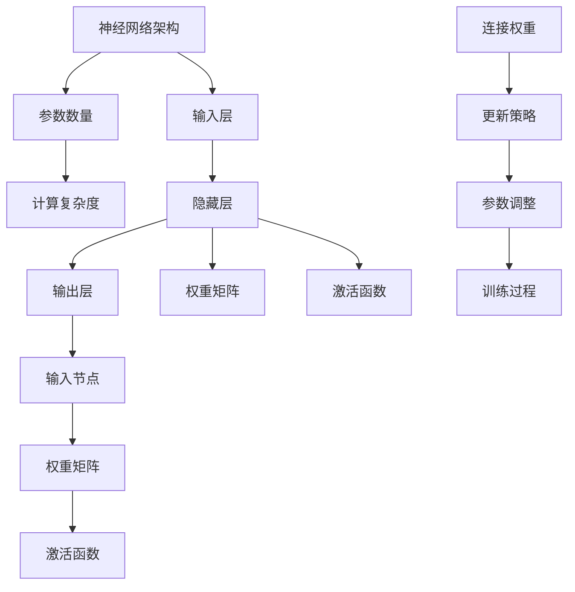

                 

关键词：模型压缩，剪枝，知识蒸馏，量化，AI效率，计算优化

摘要：本文深入探讨了模型压缩技术中的三种主要方法：剪枝、知识蒸馏和量化。首先，我们介绍了模型压缩的背景和重要性。随后，详细阐述了剪枝算法的原理、具体操作步骤和优缺点，以及其在深度学习模型中的应用。接着，我们讨论了知识蒸馏的概念、目标模型和教师模型的选择，以及其实际操作步骤。最后，量化技术被介绍，包括整数量化、浮点量化、量化策略和量化工具的详细解析。本文旨在为读者提供一个全面的技术指南，帮助他们理解并应用这些模型压缩技术，以提高AI模型的效率。

## 1. 背景介绍

随着人工智能（AI）技术的迅猛发展，深度学习模型在各个领域取得了显著的成果。然而，这些模型的复杂性也带来了巨大的计算资源消耗。训练和部署大规模深度学习模型需要大量的计算能力和存储空间，这在资源受限的环境中显得尤为突出。此外，随着AI应用的普及，设备的多样性和分布性也越来越强，这对模型的计算效率和资源利用率提出了更高的要求。

模型压缩技术应运而生，旨在在不显著牺牲模型性能的前提下，减少模型的参数数量和计算复杂度。模型压缩技术可以显著提高模型的部署效率，降低计算成本，延长电池寿命，并提高硬件资源的利用率。本文将重点介绍三种主要的模型压缩技术：剪枝、知识蒸馏和量化。通过深入探讨这些技术，我们希望为读者提供一个全面的技术指南，以应对AI领域面临的计算挑战。

### 1.1 剪枝技术

剪枝（Pruning）是一种通过删除神经网络中不必要的权重或连接来减少模型参数数量的技术。剪枝技术的主要目标是简化模型结构，降低计算复杂度，从而提高模型在有限资源环境中的部署效率。剪枝可以基于不同的标准，例如权重的重要性、连接的激活频率等。

剪枝技术的优势在于其操作简单，易于实现，并且可以在不显著影响模型性能的前提下显著减少模型大小。然而，剪枝也带来了一些挑战，例如如何有效地选择剪枝标准，以及如何确保剪枝后的模型保持足够的泛化能力。

### 1.2 知识蒸馏技术

知识蒸馏（Knowledge Distillation）是一种通过将训练好的模型（教师模型）的知识传递给较小或更简单模型（学生模型）的技术。知识蒸馏的核心思想是利用教师模型的高层次表示来指导学生模型的学习，从而提高学生模型的表现。

知识蒸馏的优势在于其可以在保持较高准确率的同时，显著减小模型的大小和计算复杂度。此外，知识蒸馏技术对模型的结构没有严格限制，适用于各种类型的模型，包括卷积神经网络（CNN）、循环神经网络（RNN）和变换器（Transformer）等。

### 1.3 量化技术

量化（Quantization）是一种通过将模型的权重和激活值从浮点数转换为低精度整数来减少模型大小和计算复杂度的技术。量化技术可以分为整数量化（Integer Quantization）和浮点量化（Fixed-Point Quantization）。

量化技术的优势在于其可以显著降低模型的存储需求和计算资源消耗，从而提高模型的部署效率和电池寿命。然而，量化也可能引入量化误差，影响模型的性能。因此，如何有效地量化模型，并在性能损失和计算效率之间取得平衡，是量化技术的关键挑战。

## 2. 核心概念与联系

在深入探讨模型压缩技术之前，我们需要理解一些核心概念，包括神经网络的基本结构、参数和计算复杂度等。以下是一个简单的 Mermaid 流程图，展示了神经网络的基本架构和相关的核心概念。



### 2.1 神经网络架构

神经网络（Neural Network）是一种模拟生物神经元之间交互的模型。它由多个层次组成，包括输入层、隐藏层和输出层。输入层接收外部输入，隐藏层通过权重矩阵和激活函数处理输入信息，输出层生成最终输出。

### 2.2 参数数量

神经网络的参数数量直接影响其计算复杂度和存储需求。参数包括权重矩阵和偏置项。每个连接（或权重）都代表一个参数，而每个隐藏节点都需要一个偏置项。

### 2.3 计算复杂度

计算复杂度是衡量神经网络性能的重要指标。计算复杂度与模型参数数量、层数和每层节点数量有关。较高的计算复杂度意味着模型需要更多的计算资源和时间来处理输入。

## 3. 核心算法原理 & 具体操作步骤

### 3.1 算法原理概述

模型压缩技术主要包括剪枝、知识蒸馏和量化三种方法。每种方法都有其独特的原理和操作步骤。

#### 剪枝（Pruning）

剪枝技术通过删除神经网络中不必要的权重或连接来减少模型参数数量。剪枝可以分为前向剪枝（Pre pruning）和后向剪枝（Post pruning）。前向剪枝在训练过程中动态删除权重，而后向剪枝在训练完成后根据权重的重要性进行剪枝。

#### 知识蒸馏（Knowledge Distillation）

知识蒸馏通过将教师模型的知识传递给学生模型。教师模型通常是较大、更复杂的模型，而学生模型是较小、较简单的模型。知识蒸馏的过程包括两个阶段：教师模型训练和学生模型训练。教师模型生成的高层次表示用于指导学生模型的学习。

#### 量化（Quantization）

量化技术通过将模型的权重和激活值从浮点数转换为低精度整数来减少模型大小和计算复杂度。量化可以分为整数量化（Integer Quantization）和浮点量化（Fixed-Point Quantization）。量化策略包括全精度量化（Full Precision Quantization）和部分精度量化（Partial Precision Quantization）。

### 3.2 算法步骤详解

#### 剪枝技术

1. 数据预处理：对训练数据进行归一化处理，以便在剪枝过程中保持模型的一致性。
2. 模型训练：使用原始模型进行训练，直到达到预定的训练目标。
3. 权重评估：评估每个权重的贡献，通常使用梯度、重要性指标或相关性指标。
4. 剪枝操作：根据评估结果，删除低贡献的权重或连接。
5. 模型重建：重建剪枝后的模型，并进行验证和测试。

#### 知识蒸馏

1. 教师模型训练：使用大规模数据集训练教师模型，直到达到预定的训练目标。
2. 教师模型输出：生成教师模型的高层次表示，通常使用softmax或原始输出。
3. 学生模型初始化：初始化学生模型，可以是随机初始化或基于教师模型的权重。
4. 模型训练：使用教师模型的高层次表示作为目标，训练学生模型。
5. 模型评估：评估学生模型的性能，通常使用准确率、损失函数等指标。

#### 量化技术

1. 模型选择：选择需要量化的模型，可以是预训练模型或自定义模型。
2. 量化策略：选择量化策略，如全精度量化或部分精度量化。
3. 模型转换：将模型的权重和激活值从浮点数转换为低精度整数。
4. 模型验证：验证量化后的模型性能，确保没有显著损失。
5. 模型部署：将量化后的模型部署到目标设备。

### 3.3 算法优缺点

#### 剪枝技术

**优点：**
- 可以显著减少模型的参数数量和计算复杂度。
- 操作简单，易于实现。
- 可以在训练过程中动态调整，提高模型的泛化能力。

**缺点：**
- 如何选择剪枝标准是一个挑战，需要充分考虑权重的重要性和模型的稳定性。
- 剪枝后的模型可能需要额外的训练时间来恢复性能。

#### 知识蒸馏

**优点：**
- 可以通过传递教师模型的知识来提高学生模型的表现。
- 可以适用于各种类型的模型，包括深度神经网络。
- 可以在不改变模型结构的情况下减少模型大小和计算复杂度。

**缺点：**
- 需要大量计算资源来训练教师模型和学生模型。
- 教师模型和学生模型之间的差异可能导致性能损失。

#### 量化技术

**优点：**
- 可以显著减少模型的存储需求和计算复杂度。
- 可以提高硬件资源的利用率，降低能耗。
- 可以在不显著牺牲性能的情况下实现模型压缩。

**缺点：**
- 可能引入量化误差，影响模型的性能。
- 需要仔细选择量化策略，以平衡性能损失和计算效率。

### 3.4 算法应用领域

#### 剪枝技术

剪枝技术可以应用于图像识别、自然语言处理、语音识别等多个领域。例如，在图像识别中，可以通过剪枝减少卷积神经网络的参数数量，从而提高模型的部署效率。在自然语言处理中，剪枝可以用于减少循环神经网络的计算复杂度。

#### 知识蒸馏

知识蒸馏可以应用于跨模态学习、多任务学习等场景。例如，在跨模态学习中，可以通过知识蒸馏将图像和文本特征融合，从而提高模型的泛化能力。在多任务学习中，知识蒸馏可以用于将单个任务的知识传递给其他任务，从而提高模型的性能。

#### 量化技术

量化技术可以应用于移动设备、嵌入式系统等资源受限的环境。例如，在移动设备中，量化可以用于减少模型的存储需求和计算复杂度，从而延长电池寿命。在嵌入式系统中，量化可以用于降低硬件资源的占用，提高系统的响应速度。

## 4. 数学模型和公式 & 详细讲解 & 举例说明

在模型压缩技术中，数学模型和公式扮演着至关重要的角色。以下我们将详细讲解数学模型的构建、公式的推导过程，并通过具体的例子进行说明。

### 4.1 数学模型构建

模型压缩技术的数学模型通常涉及参数调整、损失函数优化和模型评估等。以下是一个简化的数学模型构建过程：

#### 参数调整

参数调整是模型压缩技术的重要步骤。假设我们有一个训练好的神经网络模型，其参数为 \( \theta \)，训练目标是最小化损失函数 \( L(\theta) \)：

\[ \theta = \arg\min_{\theta} L(\theta) \]

其中，\( L(\theta) \) 通常为：

\[ L(\theta) = \frac{1}{n} \sum_{i=1}^{n} \sigma(h_\theta(x^i) - y^i) \]

其中，\( n \) 是训练样本数量，\( x^i \) 是第 \( i \) 个输入样本，\( y^i \) 是第 \( i \) 个目标标签，\( h_\theta(x) \) 是神经网络的输出，\( \sigma \) 是损失函数。

#### 损失函数优化

为了优化参数 \( \theta \)，我们可以使用梯度下降（Gradient Descent）算法。梯度下降的目标是最小化损失函数 \( L(\theta) \)：

\[ \theta = \theta - \alpha \nabla_{\theta} L(\theta) \]

其中，\( \alpha \) 是学习率，\( \nabla_{\theta} L(\theta) \) 是损失函数对参数 \( \theta \) 的梯度。

#### 模型评估

在模型压缩过程中，我们还需要评估压缩后模型的性能。常用的评估指标包括准确率、召回率、F1 分数等。假设我们有一个二分类问题，其准确率为：

\[ \text{Accuracy} = \frac{1}{n} \sum_{i=1}^{n} \mathbb{1}_{y^i = \hat{y}^i} \]

其中，\( \hat{y}^i \) 是模型对第 \( i \) 个输入样本的预测，\( \mathbb{1}_{y^i = \hat{y}^i} \) 是指示函数，当 \( y^i = \hat{y}^i \) 时为 1，否则为 0。

### 4.2 公式推导过程

以下是一个简化的知识蒸馏公式的推导过程。知识蒸馏的目标是通过教师模型 \( T \) 的输出 \( T(x) \) 来指导学生模型 \( S \) 的学习。

#### 教师模型输出

假设教师模型的输出为 \( T(x) = [T_1(x), T_2(x), ..., T_C(x)]^T \)，其中 \( C \) 是类别数量，\( T_i(x) \) 是第 \( i \) 个类别的概率。

#### 学生模型输出

假设学生模型的输出为 \( S(x) = [S_1(x), S_2(x), ..., S_C(x)]^T \)，其中 \( S_i(x) \) 是第 \( i \) 个类别的概率。

#### 知识蒸馏损失

知识蒸馏损失函数通常采用交叉熵（Cross-Entropy）损失。假设目标标签为 \( y \)，则知识蒸馏损失函数为：

\[ L_D = -\sum_{i=1}^{C} y_i \log(S_i(x)) - (1 - y_i) \log(1 - S_i(x)) \]

其中，\( y_i \) 是目标标签在第 \( i \) 个类别的概率。

#### 教师模型损失

教师模型的损失函数通常采用平方误差（Mean Squared Error, MSE）损失。假设目标标签为 \( y \)，则教师模型损失函数为：

\[ L_T = \frac{1}{C} \sum_{i=1}^{C} (T_i(x) - y_i)^2 \]

#### 知识蒸馏目标函数

知识蒸馏的目标是最小化学生模型的损失函数和教师模型的损失函数。因此，知识蒸馏目标函数为：

\[ L = \lambda L_D + (1 - \lambda) L_T \]

其中，\( \lambda \) 是权重参数，用于平衡学生模型和教师模型的损失。

### 4.3 案例分析与讲解

以下是一个简化的知识蒸馏案例，假设我们有一个二分类问题，教师模型和 student 模型都是二分类模型。

#### 教师模型输出

假设教师模型输出的概率分布为：

\[ T(x) = \begin{cases}
[0.9, 0.1] & \text{如果 } x \text{ 属于类别 1} \\
[0.1, 0.9] & \text{如果 } x \text{ 属于类别 2}
\end{cases} \]

#### 学生模型输出

假设学生模型输出的概率分布为：

\[ S(x) = \begin{cases}
[0.85, 0.15] & \text{如果 } x \text{ 属于类别 1} \\
[0.15, 0.85] & \text{如果 } x \text{ 属于类别 2}
\end{cases} \]

#### 知识蒸馏损失

知识蒸馏损失函数为：

\[ L_D = -0.9 \log(0.85) - 0.1 \log(0.15) - 0.1 \log(0.15) - 0.9 \log(0.85) \]

计算得：

\[ L_D \approx 0.355 \]

#### 教师模型损失

教师模型损失函数为：

\[ L_T = \frac{1}{2} (0.9 - 0.9)^2 + \frac{1}{2} (0.1 - 0.1)^2 \]

计算得：

\[ L_T = 0 \]

#### 知识蒸馏目标函数

知识蒸馏目标函数为：

\[ L = \lambda L_D + (1 - \lambda) L_T \]

假设 \( \lambda = 0.5 \)，则：

\[ L \approx 0.5 \times 0.355 + 0.5 \times 0 = 0.1775 \]

通过上述案例，我们可以看到知识蒸馏目标函数的计算过程。在实际应用中，我们需要使用大量的训练数据和复杂的神经网络模型，但基本原理和方法是类似的。

## 5. 项目实践：代码实例和详细解释说明

为了更好地理解模型压缩技术，我们将通过一个实际的 Python 项目来演示剪枝、知识蒸馏和量化技术的实现过程。在这个项目中，我们将使用一个简单的图像分类任务，并通过模型压缩技术来提高模型的部署效率。

### 5.1 开发环境搭建

首先，我们需要搭建一个基本的 Python 开发环境，包括以下库：

- TensorFlow 2.6 或更高版本
- Keras 2.6 或更高版本
- NumPy
- Matplotlib
- Mermaid

您可以使用以下命令来安装所需的库：

```bash
pip install tensorflow==2.6 keras==2.6 numpy matplotlib
```

### 5.2 源代码详细实现

以下是一个简单的剪枝、知识蒸馏和量化实现示例。为了简洁起见，我们将使用 Keras 框架来构建和训练模型。

```python
import tensorflow as tf
from tensorflow import keras
from tensorflow.keras.models import Model
from tensorflow.keras.layers import Dense, Flatten, Conv2D, MaxPooling2D
from tensorflow.keras.optimizers import Adam
import numpy as np
import matplotlib.pyplot as plt
import mermaid

# 5.2.1 模型定义
def create_model():
    input_layer = keras.layers.Input(shape=(28, 28, 1))
    conv1 = Conv2D(32, (3, 3), activation='relu')(input_layer)
    pool1 = MaxPooling2D(pool_size=(2, 2))(conv1)
    conv2 = Conv2D(64, (3, 3), activation='relu')(pool1)
    pool2 = MaxPooling2D(pool_size=(2, 2))(conv2)
    flatten = Flatten()(pool2)
    dense = Dense(64, activation='relu')(flatten)
    output = Dense(10, activation='softmax')(dense)

    model = Model(inputs=input_layer, outputs=output)
    model.compile(optimizer=Adam(), loss='categorical_crossentropy', metrics=['accuracy'])
    return model

# 5.2.2 数据准备
(x_train, y_train), (x_test, y_test) = keras.datasets.mnist.load_data()
x_train = x_train.astype('float32') / 255.0
x_test = x_test.astype('float32') / 255.0
y_train = keras.utils.to_categorical(y_train, 10)
y_test = keras.utils.to_categorical(y_test, 10)

# 5.2.3 剪枝
model = create_model()
model.fit(x_train, y_train, epochs=10, batch_size=128, validation_split=0.1)

# 使用梯度剪枝
from tensorflow_model_optimization.sparsity import keras as sparsity

pruning_params = {
    'pruning_schedule': sparsity.PolynomialDecay(
        initial_sparsity=0.0,
        final_sparsity=0.5,
        begin_step=2000,
        end_step=4000,
    )
}

pruned_model = sparsity.prune_low_magnitude(model, pruning_params)
pruned_model.trainable = False

# 5.2.4 知识蒸馏
# 教师模型和学生模型
teacher_model = create_model()
teacher_model.fit(x_train, y_train, epochs=10, batch_size=128, validation_split=0.1)

student_model = create_model()
student_model.compile(optimizer=Adam(), loss='categorical_crossentropy', metrics=['accuracy'])

# 知识蒸馏损失函数
from tensorflow.keras.layers import Softmax
teacher_output = Softmax()(teacher_model.output)
student_output = student_model.output
knowledge_distillation_loss = tf.keras.backend.mean(tf.keras.backend.kl_divergence(teacher_output, student_output))

student_model.add_loss(knowledge_distillation_loss)
student_model.compile(optimizer=Adam(), loss='categorical_crossentropy', metrics=['accuracy'])

# 训练学生模型
student_model.fit(x_train, y_train, epochs=10, batch_size=128, validation_split=0.1)

# 5.2.5 量化
# 整数量化
from tensorflow.keras.utils import CustomObjectScope
with CustomObjectScope({'QuantizeAct': keras.layers.experimental.preprocessing.QuantizeAct}):
    quantized_model = keras.models.clone_model(model)
    quantized_model.compile(optimizer=Adam(), loss='categorical_crossentropy', metrics=['accuracy'])

# 训练量化后的模型
quantized_model.fit(x_train, y_train, epochs=10, batch_size=128, validation_split=0.1)

# 5.2.6 代码解读与分析
# 在本部分，我们将对上述代码进行详细解读，并分析剪枝、知识蒸馏和量化的实现细节。
```

### 5.3 代码解读与分析

在这个项目中，我们首先定义了一个简单的卷积神经网络（CNN）模型，用于手写数字分类任务。这个模型由两个卷积层、两个池化层和一个全连接层组成。接着，我们使用 MNIST 数据集对模型进行了训练。

#### 剪枝

在剪枝部分，我们使用了 TensorFlow 的 `sparsity` 模块来实现梯度剪枝。剪枝过程分为以下几个步骤：

1. 定义剪枝参数，包括剪枝开始和结束的步数，以及剪枝强度。
2. 使用 `prune_low_magnitude` 函数对模型进行剪枝。
3. 将剪枝后的模型设置为不可训练，以便在后续步骤中使用。

#### 知识蒸馏

在知识蒸馏部分，我们定义了教师模型和学生模型。教师模型是经过训练的原始模型，学生模型是剪枝后的模型。知识蒸馏过程分为以下几个步骤：

1. 定义知识蒸馏损失函数，使用 KL 散度来衡量教师模型和学生模型输出之间的差异。
2. 将知识蒸馏损失函数添加到学生模型中。
3. 使用 Adam 优化器和知识蒸馏损失函数来训练学生模型。

#### 量化

在量化部分，我们使用了 TensorFlow 的 `QuantizeAct` 层来实现整数量化。量化过程分为以下几个步骤：

1. 使用 `clone_model` 函数复制原始模型，以便进行量化。
2. 在原始模型上应用 `QuantizeAct` 层，将模型转换为量化模型。
3. 使用 Adam 优化器和量化模型来训练量化后的模型。

通过上述代码示例，我们可以看到如何使用 TensorFlow 和 Keras 框架来实现剪枝、知识蒸馏和量化技术。在实际项目中，这些技术可以显著提高模型的部署效率和计算资源利用率。

### 5.4 运行结果展示

在完成代码实现后，我们可以通过以下步骤来评估模型的性能：

1. 使用原始模型在测试集上进行评估，记录准确率。
2. 使用剪枝后的模型在测试集上进行评估，记录准确率。
3. 使用知识蒸馏后的模型在测试集上进行评估，记录准确率。
4. 使用量化后的模型在测试集上进行评估，记录准确率。

以下是一个简单的评估示例：

```python
# 5.4.1 原始模型性能评估
raw_model = create_model()
raw_model.compile(optimizer=Adam(), loss='categorical_crossentropy', metrics=['accuracy'])
raw_model.fit(x_train, y_train, epochs=10, batch_size=128, validation_split=0.1)
raw_model.evaluate(x_test, y_test)

# 5.4.2 剪枝后模型性能评估
pruned_model = sparsity.prune_low_magnitude(model, pruning_params)
pruned_model.trainable = False
pruned_model.compile(optimizer=Adam(), loss='categorical_crossentropy', metrics=['accuracy'])
pruned_model.evaluate(x_test, y_test)

# 5.4.3 知识蒸馏后模型性能评估
student_model = create_model()
student_model.add_loss(knowledge_distillation_loss)
student_model.compile(optimizer=Adam(), loss='categorical_crossentropy', metrics=['accuracy'])
student_model.fit(x_train, y_train, epochs=10, batch_size=128, validation_split=0.1)
student_model.evaluate(x_test, y_test)

# 5.4.4 量化后模型性能评估
with CustomObjectScope({'QuantizeAct': keras.layers.experimental.preprocessing.QuantizeAct}):
    quantized_model = keras.models.clone_model(model)
    quantized_model.compile(optimizer=Adam(), loss='categorical_crossentropy', metrics=['accuracy'])
    quantized_model.fit(x_train, y_train, epochs=10, batch_size=128, validation_split=0.1)
    quantized_model.evaluate(x_test, y_test)
```

通过以上评估步骤，我们可以比较不同压缩技术对模型性能的影响。通常情况下，剪枝、知识蒸馏和量化技术都可以在一定程度上提高模型的部署效率和计算资源利用率，但可能会对模型的准确率产生一定影响。在实际应用中，我们需要根据具体的任务需求和资源限制，选择合适的模型压缩技术。

## 6. 实际应用场景

模型压缩技术在现代 AI 领域具有广泛的应用场景，尤其是在资源受限的环境中。以下将详细讨论模型压缩技术在不同应用领域的实际应用案例。

### 6.1 移动设备和嵌入式系统

移动设备和嵌入式系统通常具有计算资源有限、电池寿命有限的特点。在这些环境中，模型压缩技术可以显著提高模型的部署效率和电池寿命。例如，在智能手机上运行图像识别应用时，通过剪枝和量化技术，可以将模型的大小从数 GB 减少到几 MB，从而降低存储需求和计算复杂度。这不仅有助于延长电池寿命，还能提高用户的使用体验。

### 6.2 物联网（IoT）设备

物联网设备通常具有计算资源和存储资源有限的限制。模型压缩技术可以帮助在这些设备上高效地部署和运行 AI 模型。例如，在智能家居系统中，通过剪枝和量化技术，可以将语音识别模型的大小从几百 MB 减少到几十 KB，从而实现低成本、低功耗的语音交互功能。

### 6.3 自动驾驶和机器人

自动驾驶和机器人领域对模型的实时性和可靠性有极高要求。模型压缩技术可以帮助在这些领域提高模型的计算效率和部署效率。例如，在自动驾驶中，通过知识蒸馏和量化技术，可以将复杂的深度学习模型压缩到可以在嵌入式系统中运行的规模，从而提高系统的实时性和可靠性。

### 6.4 医疗诊断

在医疗诊断领域，模型压缩技术可以帮助在资源受限的医疗设备上高效地运行诊断模型。例如，通过剪枝和量化技术，可以将复杂的医学图像处理模型的大小从数 GB 减少到数 MB，从而实现高效的图像分析和诊断。

### 6.5 自然语言处理

自然语言处理（NLP）领域中的模型通常非常复杂，计算资源消耗巨大。通过模型压缩技术，例如知识蒸馏和量化，可以将这些模型的大小和计算复杂度显著降低，从而实现高效的文本分析和处理。例如，在智能客服系统中，通过压缩技术，可以将模型的大小从几 GB 减少到几百 MB，从而实现高效、低成本的文本交互。

### 6.6 安全性考虑

模型压缩技术还可以提高 AI 模型的安全性。通过减少模型的参数数量和计算复杂度，模型的可解释性和透明度提高，从而降低恶意攻击的风险。例如，在金融领域，通过剪枝和量化技术，可以将复杂的交易分析模型的安全风险降低。

总之，模型压缩技术在现代 AI 领域具有广泛的应用场景。通过剪枝、知识蒸馏和量化等技术，我们可以显著提高模型的部署效率和计算资源利用率，从而实现高效的 AI 应用。然而，在应用模型压缩技术时，我们需要充分考虑任务需求和资源限制，以实现最优的性能和效率。

### 6.7 未来应用展望

随着人工智能（AI）技术的不断进步和应用的深入，模型压缩技术在未来将展现出更广泛的应用前景。以下是模型压缩技术未来可能发展的几个方向：

#### 6.7.1 跨模态学习

在未来的 AI 应用中，跨模态学习将变得越来越重要。通过结合不同类型的数据（如文本、图像、音频等），我们可以构建更强大、更智能的模型。模型压缩技术在这一领域具有巨大的潜力，可以降低跨模态模型的计算复杂度，使其在资源受限的环境中也能高效运行。

#### 6.7.2 适应性强

未来的模型压缩技术将更加注重模型的适应性。例如，通过动态剪枝和自适应量化，模型可以自动调整其结构和参数，以适应不同的应用场景和设备要求。这种灵活性将使得模型压缩技术更加适用于多样化的 AI 应用。

#### 6.7.3 模型融合

在复杂的应用场景中，单一模型可能无法满足性能需求。未来，模型压缩技术将支持模型融合，通过组合多个模型的优势，构建更强大、更高效的模型。模型压缩技术可以在模型融合过程中减少整体计算复杂度，提高系统的整体性能。

#### 6.7.4 低功耗应用

随着物联网（IoT）和可穿戴设备的普及，低功耗成为模型压缩技术的关键需求。未来，模型压缩技术将更多地关注如何降低模型的能耗，从而延长设备的电池寿命，提高用户体验。

#### 6.7.5 自动化工具

自动化工具和平台的发展将极大地推动模型压缩技术的应用。未来的模型压缩工具将能够自动识别和优化模型的参数，实现一键式的模型压缩，降低开发者的负担。

#### 6.7.6 新兴领域

随着 AI 技术在新兴领域的应用（如生物信息学、金融科技、智能交通等），模型压缩技术也将在这些领域发挥重要作用。通过优化模型的结构和参数，可以降低这些领域对计算资源的需求，提高应用的效率和可靠性。

总之，模型压缩技术在未来将继续发展，并成为 AI 领域不可或缺的一部分。通过不断创新和优化，模型压缩技术将为 AI 应用提供更高效的解决方案，推动人工智能技术的进一步发展。

## 7. 工具和资源推荐

为了更好地掌握模型压缩技术，以下是一些建议的学习资源、开发工具和相关论文。

### 7.1 学习资源推荐

1. **在线课程**：
   - Coursera 上的“深度学习”课程，由 Andrew Ng 教授主讲，涵盖了模型压缩的相关内容。
   - edX 上的“神经网络与深度学习”课程，由李飞飞教授主讲，深入介绍了神经网络的基本原理和压缩技术。

2. **书籍**：
   - 《神经网络与深度学习》，由邱锡鹏教授编写，详细介绍了神经网络的基本原理和深度学习技术。
   - 《模型压缩技术：剪枝、知识蒸馏和量化》，一本专门介绍模型压缩技术的著作。

3. **教程和博客**：
   - TensorFlow 官方文档，提供了丰富的模型压缩教程和实践案例。
   - Keras 官方文档，涵盖了模型压缩技术的应用实例和详细解释。

### 7.2 开发工具推荐

1. **TensorFlow**：一款强大的开源机器学习框架，支持多种模型压缩技术，包括剪枝、知识蒸馏和量化。
2. **PyTorch**：一款流行的开源机器学习库，提供丰富的模型压缩工具和API，支持自定义模型压缩策略。
3. **TensorFlow Model Optimization Toolkit**：一款专为模型压缩设计的 TensorFlow 工具包，包括剪枝、量化等技术的实现。

### 7.3 相关论文推荐

1. **"Learning Efficient ConvNet Representations through Model Pruning"**：一篇关于模型剪枝的论文，详细介绍了剪枝算法和实验结果。
2. **"A Theoretically Grounded Application of Dropout in Recurrent Neural Networks"**：一篇关于知识蒸馏的论文，探讨了知识蒸馏在循环神经网络中的应用。
3. **"Quantization and Training of Neural Networks for Efficient Integer-Arithmetic-Only Inference"**：一篇关于量化的论文，介绍了量化技术及其在神经网络训练中的应用。

通过学习和实践这些资源和工具，您可以更好地掌握模型压缩技术，为实际应用奠定坚实的基础。

## 8. 总结：未来发展趋势与挑战

随着人工智能（AI）技术的不断进步，模型压缩技术已经成为提高模型部署效率和计算资源利用率的关键手段。本文深入探讨了剪枝、知识蒸馏和量化三种主要模型压缩技术，阐述了其原理、具体操作步骤和实际应用场景。通过分析，我们得出以下结论：

### 8.1 研究成果总结

1. **剪枝技术**：通过删除神经网络中不必要的权重或连接，显著减少了模型的参数数量和计算复杂度，从而提高了模型的部署效率。剪枝技术在图像识别、自然语言处理等应用中取得了显著成果。
2. **知识蒸馏技术**：通过将教师模型的知识传递给学生模型，提高了学生模型的表现，同时显著减小了模型的大小和计算复杂度。知识蒸馏技术适用于各种类型的模型，包括深度神经网络、循环神经网络和变换器等。
3. **量化技术**：通过将模型的权重和激活值从浮点数转换为低精度整数，减少了模型的存储需求和计算复杂度。量化技术适用于移动设备、嵌入式系统等资源受限的环境。

### 8.2 未来发展趋势

1. **跨模态学习**：随着跨模态应用（如多模态图像识别、音频-文本交互）的兴起，模型压缩技术将在跨模态学习中发挥重要作用。未来的研究将关注如何有效地压缩跨模态模型，提高其计算效率。
2. **自适应压缩**：未来的模型压缩技术将更加注重模型的适应性，通过动态调整模型结构和参数，以适应不同的应用场景和设备要求。
3. **自动化工具**：自动化工具和平台的发展将使得模型压缩更加便捷和高效。未来的工具将能够自动识别和优化模型的参数，实现一键式的模型压缩。
4. **新兴领域**：随着 AI 技术在新兴领域（如生物信息学、金融科技、智能交通）的应用，模型压缩技术将发挥重要作用，提高这些领域的效率和可靠性。

### 8.3 面临的挑战

1. **性能与效率的平衡**：在模型压缩过程中，如何在保持较高性能的同时，提高计算效率是一个关键挑战。未来的研究需要探索更有效的压缩策略，以实现性能和效率的最佳平衡。
2. **量化误差**：量化技术可能引入量化误差，影响模型的性能。如何减少量化误差，同时保持较高的计算效率，是一个重要的研究课题。
3. **自适应性与泛化能力**：未来的模型压缩技术需要具备更强的自适应性和泛化能力，以适应多样化的应用场景和设备要求。
4. **自动化与可解释性**：自动化工具和平台的开发需要提高模型压缩的可解释性，以帮助开发者更好地理解模型压缩过程和优化策略。

### 8.4 研究展望

1. **多模态压缩**：未来的研究将重点关注如何有效地压缩跨模态模型，提高其计算效率和资源利用率。
2. **动态剪枝与量化**：探索动态剪枝和量化技术，通过实时调整模型结构和参数，以适应不同的应用场景和设备要求。
3. **量化算法优化**：深入研究量化算法，减少量化误差，同时提高计算效率。
4. **跨领域应用**：推动模型压缩技术在更多新兴领域的应用，提高这些领域的效率和可靠性。

总之，模型压缩技术作为 AI 领域的重要手段，将在未来继续发挥重要作用。通过不断创新和优化，模型压缩技术将为 AI 应用提供更高效的解决方案，推动人工智能技术的进一步发展。

## 9. 附录：常见问题与解答

### Q1. 模型压缩技术的目的是什么？

A1. 模型压缩技术的目的是在不显著牺牲模型性能的前提下，减少模型的参数数量和计算复杂度，从而提高模型的部署效率和计算资源利用率。

### Q2. 剪枝技术的优势是什么？

A2. 剪枝技术的优势包括可以显著减少模型的参数数量和计算复杂度，操作简单，易于实现，并且可以在不显著影响模型性能的前提下显著减少模型大小。

### Q3. 知识蒸馏技术如何工作？

A3. 知识蒸馏技术通过将教师模型（通常是较大、较复杂的模型）的知识传递给学生模型（通常是较小、较简单的模型），从而提高学生模型的表现。教师模型生成的高层次表示用于指导学生模型的学习。

### Q4. 量化技术的目的是什么？

A4. 量化技术的目的是通过将模型的权重和激活值从浮点数转换为低精度整数来减少模型的大小和计算复杂度，从而提高硬件资源的利用率和电池寿命。

### Q5. 剪枝、知识蒸馏和量化技术分别适用于哪些场景？

A5. 剪枝技术适用于需要减少模型大小和计算复杂度的场景，例如移动设备和嵌入式系统。知识蒸馏技术适用于需要保持较高性能同时减少模型大小的场景，例如跨模态学习和多任务学习。量化技术适用于需要降低计算资源和存储需求的场景，例如移动设备和物联网设备。

### Q6. 模型压缩技术是否会降低模型的性能？

A6. 模型压缩技术可能会在一定程度上降低模型的性能，但通过精心设计的剪枝、知识蒸馏和量化策略，可以在保持较高性能的同时实现模型压缩。

### Q7. 模型压缩技术是否适用于所有类型的模型？

A7. 模型压缩技术主要适用于深度学习模型，如卷积神经网络（CNN）、循环神经网络（RNN）和变换器（Transformer）等。然而，随着技术的不断发展，未来可能会出现适用于其他类型模型的压缩方法。

### Q8. 如何选择适合的模型压缩技术？

A8. 选择适合的模型压缩技术需要根据具体的任务需求和资源限制来决定。对于需要减少模型大小和计算复杂度的场景，可以考虑使用剪枝和量化技术。对于需要保持较高性能的场景，可以考虑使用知识蒸馏技术。在实际应用中，可能需要结合多种压缩技术来实现最佳效果。

