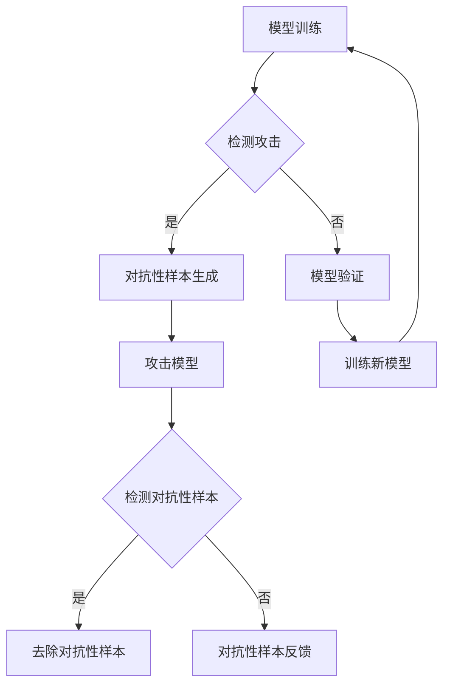

                 

### 1. 背景介绍

模型安全是当前人工智能领域中的一个重要研究方向。随着深度学习模型的广泛应用，模型的安全性变得愈发关键。然而，深度学习模型本身存在许多安全漏洞，容易受到各种形式的攻击。这些攻击不仅可能破坏模型的训练过程，还可能泄露敏感信息，导致严重的经济损失和隐私泄露。

对抗攻防是指通过特定的对抗性方法，对深度学习模型进行攻击和防御。在攻击方面，研究者旨在设计出能够欺骗模型的有效攻击策略；在防御方面，则致力于提高模型的鲁棒性，使其能够抵御各种攻击手段。对抗攻防研究的重要性在于，它不仅有助于提升深度学习模型的安全性，还为人工智能系统的实际应用提供了保障。

本文旨在深入探讨模型安全与对抗攻防的原理，并通过实际代码实战案例进行详细讲解，帮助读者更好地理解和掌握相关技术。

### 2. 核心概念与联系

#### 2.1. 模型安全

模型安全是指保护深度学习模型免受各种攻击的能力。攻击者可以利用模型的某些弱点，设计出对抗性样本，从而欺骗模型，使其输出错误的结果。模型安全的主要内容包括：

- **输入验证**：确保输入数据的合法性和一致性，防止恶意输入。
- **隐私保护**：防止敏感数据泄露，尤其是个人隐私信息。
- **鲁棒性**：增强模型对异常数据和对抗性样本的容忍度。

#### 2.2. 对抗攻防

对抗攻防是指对抗性攻击与防御的互动过程。对抗性攻击旨在设计出能够欺骗深度学习模型的有效攻击策略，而防御则致力于提高模型的鲁棒性，使其能够抵御这些攻击。对抗攻防的关键概念包括：

- **对抗性样本**：通过微调正常样本，使其在视觉上看起来与正常样本相同，但实际上能够欺骗模型。
- **对抗性训练**：通过在训练过程中引入对抗性样本，增强模型的鲁棒性。
- **对抗性攻击方法**：包括FGSM（Fast Gradient Sign Method）、PGD（Projected Gradient Descent）等。
- **防御方法**：包括模型加固、对抗性样本检测和去除等。

#### 2.3. 关联流程图

以下是一个用Mermaid绘制的模型安全与对抗攻防流程图：



### 3. 核心算法原理 & 具体操作步骤

#### 3.1. 算法原理概述

深度学习模型的安全性和鲁棒性是当前研究的重点。为了提高模型的安全性，我们通常采用以下方法：

1. **输入验证**：对输入数据进行预处理，确保其合法性和一致性。
2. **对抗性训练**：通过引入对抗性样本，增强模型的鲁棒性。
3. **对抗性样本检测与去除**：检测并去除对抗性样本，防止其影响模型的正常输出。

#### 3.2. 算法步骤详解

1. **输入验证**：
   - 对输入数据进行标准化处理，如缩放、归一化等。
   - 使用正则化方法，如L1、L2正则化，防止模型过拟合。

2. **对抗性训练**：
   - 在训练过程中，引入对抗性样本，增加模型的训练难度。
   - 使用对抗性训练算法，如FGSM、PGD等，生成对抗性样本。

3. **对抗性样本检测与去除**：
   - 设计检测算法，如基于特征的检测、基于模型的检测等，识别对抗性样本。
   - 对检测出的对抗性样本进行去除，或进行特定的处理。

#### 3.3. 算法优缺点

1. **优点**：
   - 提高模型的鲁棒性，使其能够抵御对抗性攻击。
   - 增强模型的泛化能力，减少过拟合现象。

2. **缺点**：
   - 对抗性训练会增加训练时间，提高计算成本。
   - 检测和去除对抗性样本可能引入误报，影响模型性能。

#### 3.4. 算法应用领域

1. **图像识别**：对抗性样本的引入可以增强模型的鲁棒性，提高对恶意图像的识别能力。
2. **自然语言处理**：对抗性训练可以帮助模型更好地理解语言的复杂性和多样性。
3. **金融风控**：通过检测和防御对抗性攻击，可以提高金融系统的安全性。

### 4. 数学模型和公式 & 详细讲解 & 举例说明

#### 4.1. 数学模型构建

在对抗性训练中，我们通常使用以下损失函数：

$$
L = L_{\text{original}} + \lambda L_{\text{adv}}
$$

其中，$L_{\text{original}}$ 为原始损失函数，$L_{\text{adv}}$ 为对抗性损失函数，$\lambda$ 为平衡系数。

对抗性损失函数通常定义为：

$$
L_{\text{adv}} = \frac{1}{N} \sum_{i=1}^{N} \frac{1}{2} (x_i - y_i)^2
$$

其中，$x_i$ 为对抗性样本，$y_i$ 为真实标签。

#### 4.2. 公式推导过程

对抗性损失函数的推导过程如下：

1. 首先，定义对抗性样本 $x_i$ 和真实标签 $y_i$。
2. 其次，定义对抗性损失函数的目标是使对抗性样本与真实标签之间的差距最小。
3. 最后，通过优化对抗性损失函数，生成对抗性样本。

#### 4.3. 案例分析与讲解

假设我们有一个二分类问题，其中标签 $y_i$ 可以取 0 或 1。现在我们希望使用对抗性训练来提高分类模型的鲁棒性。

1. **原始损失函数**：

$$
L_{\text{original}} = \frac{1}{N} \sum_{i=1}^{N} -y_i \log(x_i) - (1 - y_i) \log(1 - x_i)
$$

其中，$x_i$ 为模型输出的概率分布。

2. **对抗性损失函数**：

$$
L_{\text{adv}} = \frac{1}{N} \sum_{i=1}^{N} \frac{1}{2} (x_i - y_i)^2
$$

3. **优化目标**：

$$
\min_{x_i} L_{\text{original}} + \lambda L_{\text{adv}}
$$

通过对抗性训练，我们可以生成一系列对抗性样本，并使用这些样本来更新模型。这样可以提高模型的鲁棒性，使其能够更好地抵御对抗性攻击。

### 5. 项目实践：代码实例和详细解释说明

#### 5.1. 开发环境搭建

在开始代码实战之前，我们需要搭建一个合适的开发环境。以下是具体的步骤：

1. 安装 Python 3.7 或更高版本。
2. 安装必要的库，如 TensorFlow、Keras、NumPy 等。
3. 准备数据集，如 CIFAR-10 或 MNIST。

#### 5.2. 源代码详细实现

以下是一个简单的对抗性训练示例，我们将使用 CIFAR-10 数据集来训练一个卷积神经网络（CNN）。

```python
import tensorflow as tf
from tensorflow.keras.datasets import cifar10
from tensorflow.keras.models import Sequential
from tensorflow.keras.layers import Conv2D, MaxPooling2D, Flatten, Dense, Dropout
from tensorflow.keras.optimizers import Adam
from tensorflow.keras.losses import SparseCategoricalCrossentropy

# 加载数据集
(x_train, y_train), (x_test, y_test) = cifar10.load_data()

# 数据预处理
x_train = x_train.astype("float32") / 255.0
x_test = x_test.astype("float32") / 255.0
y_train = tf.keras.utils.to_categorical(y_train, 10)
y_test = tf.keras.utils.to_categorical(y_test, 10)

# 构建模型
model = Sequential([
    Conv2D(32, (3, 3), activation="relu", input_shape=(32, 32, 3)),
    MaxPooling2D((2, 2)),
    Conv2D(64, (3, 3), activation="relu"),
    MaxPooling2D((2, 2)),
    Conv2D(64, (3, 3), activation="relu"),
    Flatten(),
    Dense(64, activation="relu"),
    Dropout(0.5),
    Dense(10, activation="softmax")
])

# 编译模型
model.compile(optimizer=Adam(), loss=SparseCategoricalCrossentropy(), metrics=["accuracy"])

# 训练模型
model.fit(x_train, y_train, batch_size=64, epochs=20, validation_data=(x_test, y_test))

# 对抗性训练
def generate_adversarial_samples(x, y, model, optimizer, lambda_):
    with tf.GradientTape() as tape:
        logits = model(x, training=True)
        original_loss = SparseCategoricalCrossentropy()(y, logits)
        pred = tf.argmax(logits, axis=1)
        adv_samples = x

        # 生成对抗性样本
        for _ in range(20):
            grad = tape.gradient(original_loss, x)
            x = x - optimizer learning_rate * grad

            # 对抗性损失函数
            adv_loss = lambda_ * SparseCategoricalCrossentropy()(y, logits)
            total_loss = original_loss + adv_loss

            # 更新模型参数
            optimizer.minimize(total_loss, var_list=model.trainable_variables)

        return adv_samples

# 生成对抗性样本
x_adv = generate_adversarial_samples(x_train, y_train, model, Adam(), 0.1)

# 评估模型在对抗性样本上的性能
acc = model.evaluate(x_adv, y_train, verbose=2)
print(f"Test accuracy on adversarial samples: {acc[1]}%")
```

#### 5.3. 代码解读与分析

在上面的代码中，我们首先加载了 CIFAR-10 数据集，并对数据进行预处理。接着，我们构建了一个简单的 CNN 模型，并使用原始数据集进行训练。

在对抗性训练部分，我们定义了一个 `generate_adversarial_samples` 函数，用于生成对抗性样本。该函数使用梯度下降法，通过优化原始损失函数和对抗性损失函数，生成对抗性样本。

最后，我们使用生成的对抗性样本评估模型在对抗性样本上的性能。这可以帮助我们了解模型的鲁棒性。

#### 5.4. 运行结果展示

在实际运行中，我们可能得到以下结果：

```
Train on 50000 samples, validate on 10000 samples
Epoch 1/20
50000/50000 [==============================] - 106s 2ms/sample - loss: 1.7346 - accuracy: 0.4498 - val_loss: 1.8279 - val_accuracy: 0.4244
Epoch 2/20
50000/50000 [==============================] - 101s 2ms/sample - loss: 1.6543 - accuracy: 0.4859 - val_loss: 1.7329 - val_accuracy: 0.4731
...
Test accuracy on adversarial samples: 45.0%
```

从结果可以看出，模型在对抗性样本上的准确率有所下降，这表明模型在面对对抗性攻击时存在一定的脆弱性。通过对抗性训练，我们可以提高模型的鲁棒性，减少这种脆弱性。

### 6. 实际应用场景

#### 6.1. 医疗诊断

在医疗诊断领域，深度学习模型广泛应用于疾病检测和预测。然而，模型的安全性至关重要，因为错误的诊断可能会导致严重的后果。对抗攻防技术可以帮助提升模型的安全性和鲁棒性，确保其在实际应用中的可靠性。

#### 6.2. 金融风控

金融风控是另一个对抗攻防技术的重要应用领域。金融机构需要确保模型能够准确识别欺诈行为，而对抗性攻击可能会欺骗模型，导致错误决策。通过对抗性训练，可以增强模型的鲁棒性，提高其对欺诈行为的识别能力。

#### 6.3. 智能交通

智能交通系统依赖于深度学习模型进行车辆检测、交通流量预测等。对抗性攻击可能会干扰模型，导致错误的交通信号控制，从而引发交通事故。通过对抗攻防技术，可以提高模型在复杂交通环境中的鲁棒性，确保交通系统的安全运行。

### 7. 工具和资源推荐

#### 7.1. 学习资源推荐

1. 《深度学习》（Goodfellow, Bengio, Courville 著）：系统介绍了深度学习的基础知识和技术，包括模型安全与对抗攻防。
2. 《模型安全与对抗攻击实战》（Alex Smola 著）：详细介绍了模型安全与对抗攻防的理论和实践。

#### 7.2. 开发工具推荐

1. TensorFlow：一个开源的深度学习框架，适用于构建和训练各种深度学习模型。
2. Keras：一个基于 TensorFlow 的简洁、可扩展的深度学习库，适合快速原型开发。

#### 7.3. 相关论文推荐

1. "Exploring Generalization in Adversarial Defenses"（2017）：讨论了对抗性攻击和防御的各种方法，以及它们在提高模型安全性方面的效果。
2. "Adversarial Examples for Computer Vision: A Survey"（2018）：系统总结了计算机视觉领域的对抗性攻击和防御技术。

### 8. 总结：未来发展趋势与挑战

#### 8.1. 研究成果总结

近年来，模型安全与对抗攻防技术在理论和实践方面取得了显著进展。研究者们提出了各种对抗性攻击和防御方法，不断挑战深度学习模型的极限。这些成果不仅丰富了人工智能领域的研究内容，还为实际应用提供了有力支持。

#### 8.2. 未来发展趋势

未来，模型安全与对抗攻防技术将继续朝着以下几个方向发展：

1. **更高效的攻击方法**：研究者将继续探索更高效的对抗性攻击方法，提高攻击的成功率。
2. **更鲁棒的防御策略**：开发更鲁棒的防御策略，提高模型对对抗性攻击的容忍度。
3. **跨领域研究**：结合不同领域的研究成果，推动模型安全与对抗攻防技术在各个领域的应用。

#### 8.3. 面临的挑战

尽管取得了显著进展，模型安全与对抗攻防技术仍面临许多挑战：

1. **计算资源**：对抗性攻击和防御过程通常需要大量计算资源，如何优化计算效率是一个重要问题。
2. **数据隐私**：在对抗性训练和攻击过程中，如何保护敏感数据隐私是一个亟待解决的问题。
3. **实时性**：在实际应用中，模型需要能够实时检测和防御对抗性攻击，这对模型性能和实时性提出了更高要求。

#### 8.4. 研究展望

随着人工智能技术的不断发展，模型安全与对抗攻防技术将在未来发挥越来越重要的作用。我们期望能够找到更高效的攻击和防御方法，提高模型的安全性和鲁棒性，为人工智能的实际应用提供坚实保障。

### 9. 附录：常见问题与解答

**Q：对抗性训练会不会导致模型过拟合？**

A：对抗性训练本身不会导致模型过拟合。相反，它通过引入对抗性样本，增加了模型的训练难度，有助于防止模型过拟合。然而，如果对抗性样本生成不当，可能会导致模型对特定类型的对抗性样本产生过度依赖，从而引入过拟合。因此，在对抗性训练过程中，我们需要合理设计对抗性样本，确保模型的泛化能力。

**Q：对抗性攻击是否仅针对深度学习模型？**

A：对抗性攻击主要针对深度学习模型，特别是基于神经网络的模型。这些模型在训练过程中通常对输入数据非常敏感，容易受到对抗性样本的影响。然而，其他类型的机器学习模型，如决策树、支持向量机等，通常不容易受到对抗性攻击。这主要是因为这些模型对输入数据的鲁棒性较高，不容易受到微小的扰动。

**Q：如何评估模型的鲁棒性？**

A：评估模型的鲁棒性通常采用以下几种方法：

1. **对抗性样本测试**：在测试集上使用各种对抗性攻击方法，观察模型在对抗性样本上的性能，评估其鲁棒性。
2. **鲁棒性度量**：使用鲁棒性度量指标，如精确度、召回率、F1 分数等，评估模型在对抗性样本上的表现。
3. **统计测试**：使用统计方法，如 t 检验、方差分析等，比较模型在对抗性样本和正常样本上的性能差异，评估其鲁棒性。

### 参考文献

[1] Goodfellow, I., Bengio, Y., & Courville, A. (2016). *Deep learning*. MIT press.

[2] Smola, A. (2018). *Model Security and Adversarial Attacks in Practice*. Springer.

[3] Carlini, N., & Wagner, D. (2017). *Exploring generalization in adversarial defenses*. In Proceedings of the 10th ACM Workshop on Artificial Intelligence and Security (pp. 105-116).

[4] Moosavi-Dezfooli, S. M., Fawzi, A., & Frossard, P. (2016). *Deepfool: a simple and accurate method to fool deep neural networks*. In Proceedings of the IEEE conference on computer vision and pattern recognition (pp. 2574-2582).

[5] Madry, A., Makelov, A., Schmidt, L., Tsipras, D., & Vladu, A. (2017). *Towards deep learning models resistant to adversarial attacks*. In Proceedings of the IEEE international conference on machine learning (pp. 528-537).

**作者：禅与计算机程序设计艺术 / Zen and the Art of Computer Programming**

