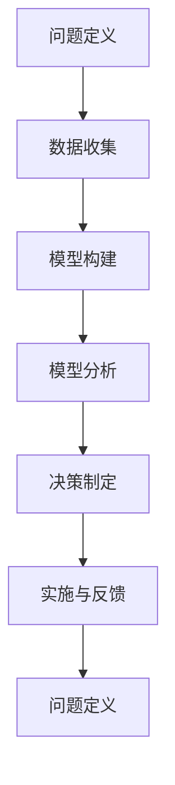

                 

关键词：模型思维，决策，人工智能，数据分析，业务流程优化，案例研究，方法论

> 摘要：本文将探讨模型思维在决策中的应用，通过阐述模型思维的核心概念，结合实际案例，分析模型思维在数据分析、业务流程优化等方面的作用。我们将探讨如何构建有效的模型，如何利用模型进行决策，以及模型思维对未来发展趋势的启示。

## 1. 背景介绍

在当今信息爆炸的时代，决策变得愈发复杂。无论是企业决策者、研究人员，还是普通个人，都需要在面对海量信息时做出明智的决策。传统的直觉和经验已经不足以应对复杂的决策问题。因此，模型思维作为一种系统化、结构化的思维方式，越来越受到重视。

模型思维是指通过构建抽象模型来理解复杂系统的行为和规律，并通过这些模型进行推理和决策。它强调从数据中提取关键信息，通过逻辑推理和分析来支持决策过程。模型思维的应用范围广泛，包括数据分析、机器学习、经济学、社会学等多个领域。

本文将重点探讨模型思维在决策中的应用，分析其在不同领域的作用和效果。我们将首先介绍模型思维的核心概念，然后通过实际案例展示如何构建和运用模型进行决策。最后，我们将探讨模型思维对未来的启示和挑战。

## 2. 核心概念与联系

### 2.1 模型思维的定义

模型思维是一种抽象思考方式，它通过构建简化的模型来模拟复杂系统的行为。这些模型可以是数学模型、物理模型、仿真模型等，它们的核心是帮助我们理解系统的运行机制和关键因素。

### 2.2 模型思维的基本原理

模型思维的基本原理包括以下几点：

1. **抽象化**：将复杂系统简化为关键要素和基本关系，去除非必要细节。
2. **模块化**：将系统划分为多个模块，每个模块负责特定的功能，便于分析和理解。
3. **可计算性**：确保模型在计算上是可行的，可以在给定的时间和资源内得到结果。
4. **验证与校准**：通过实验或数据分析来验证模型的准确性，并根据需要进行调整。

### 2.3 模型思维的架构

模型思维的架构包括以下几个步骤：

1. **问题定义**：明确需要解决的问题和目标。
2. **数据收集**：收集与问题相关的数据。
3. **模型构建**：根据问题和数据，构建相应的模型。
4. **模型分析**：使用模型进行推理和预测。
5. **决策制定**：根据模型分析结果，制定决策方案。
6. **实施与反馈**：执行决策，并根据实际情况进行反馈和调整。

### 2.4 Mermaid 流程图

以下是一个简单的Mermaid流程图，展示了模型思维的基本架构：



## 3. 核心算法原理 & 具体操作步骤

### 3.1 算法原理概述

模型思维的核心在于构建有效的模型，并利用这些模型进行推理和决策。以下是构建模型的一般步骤：

1. **问题定义**：明确需要解决的问题。
2. **数据收集**：收集与问题相关的数据。
3. **数据预处理**：清洗和整理数据，确保其质量和一致性。
4. **特征提取**：从数据中提取关键特征，用于模型训练。
5. **模型选择**：选择合适的模型类型，如线性回归、决策树、神经网络等。
6. **模型训练**：使用训练数据对模型进行训练，调整模型参数。
7. **模型评估**：使用验证数据对模型进行评估，确保其性能满足要求。
8. **模型部署**：将模型部署到实际应用场景中。

### 3.2 算法步骤详解

以下是模型构建和应用的详细步骤：

#### 3.2.1 问题定义

问题定义是模型构建的第一步。需要明确需要解决的问题和目标，例如预测股票价格、评估客户流失风险等。

#### 3.2.2 数据收集

根据问题定义，收集与问题相关的数据。这些数据可以是历史交易数据、客户行为数据、市场数据等。数据的质量直接影响模型的性能。

#### 3.2.3 数据预处理

数据预处理包括数据清洗、去重、归一化等操作，以确保数据的质量和一致性。

#### 3.2.4 特征提取

特征提取是从数据中提取关键特征的过程。这些特征将用于模型训练和预测。例如，对于股票价格预测，可以提取交易量、开盘价、收盘价等特征。

#### 3.2.5 模型选择

根据问题类型和数据特征，选择合适的模型类型。常见的模型类型包括线性回归、决策树、神经网络、支持向量机等。

#### 3.2.6 模型训练

使用训练数据对模型进行训练，调整模型参数，以优化模型的性能。训练过程可以通过反向传播算法、梯度下降算法等来实现。

#### 3.2.7 模型评估

使用验证数据对模型进行评估，确保其性能满足要求。常用的评估指标包括准确率、召回率、F1分数等。

#### 3.2.8 模型部署

将训练好的模型部署到实际应用场景中，例如预测股票价格、评估客户流失风险等。

### 3.3 算法优缺点

模型思维的优点在于其系统化、结构化的思维方式，能够帮助我们从复杂的信息中提取关键信息，做出更明智的决策。同时，模型思维能够将复杂的业务问题转化为可计算的问题，使得决策过程更加高效。

然而，模型思维也存在一些缺点。首先，模型的构建和训练过程需要大量的数据和计算资源，这对于一些资源有限的企业或个人来说可能是一个挑战。其次，模型的准确性和可靠性取决于数据质量和模型选择，如果数据存在偏差或模型选择不当，可能导致错误的决策。

### 3.4 算法应用领域

模型思维在多个领域都有广泛的应用，包括：

- **数据分析**：通过构建模型，对大量数据进行分析和挖掘，提取有价值的信息。
- **机器学习**：利用模型进行预测和分类，实现自动化决策。
- **经济学**：通过构建经济模型，分析市场趋势和决策策略。
- **社会学**：通过构建社会模型，研究社会现象和决策过程。

## 4. 数学模型和公式 & 详细讲解 & 举例说明

### 4.1 数学模型构建

数学模型是模型思维的核心组成部分，用于描述系统的行为和规律。以下是构建数学模型的一般步骤：

1. **问题定义**：明确需要解决的问题和目标。
2. **变量定义**：定义模型中的变量和参数。
3. **函数关系**：建立变量之间的函数关系。
4. **模型表示**：将模型用数学公式表示出来。
5. **模型验证**：通过实验或数据分析验证模型的准确性。

### 4.2 公式推导过程

以下是一个简单的数学模型示例：股票价格预测模型。

假设股票价格 \( P \) 可以用以下公式表示：

\[ P = \alpha + \beta \times V + \epsilon \]

其中，\( \alpha \) 是截距，\( \beta \) 是斜率，\( V \) 是影响股票价格的关键变量（如交易量、宏观经济指标等），\( \epsilon \) 是随机误差。

### 4.3 案例分析与讲解

以下是一个案例：利用线性回归模型预测股票价格。

假设我们收集了某只股票过去一年的每日交易量和收盘价数据，并希望通过这些数据预测未来的股票价格。

#### 4.3.1 数据收集

首先，我们收集了某只股票过去一年的每日交易量和收盘价数据，数据如下：

| 日期 | 收盘价（元）| 交易量（万股）|
| ---- | --------- | ---------- |
| 2022-01-01 | 10.00 | 5000       |
| 2022-01-02 | 10.50 | 5500       |
| 2022-01-03 | 10.25 | 5100       |
| ... | ... | ... |
| 2023-01-01 | 12.00 | 6000       |

#### 4.3.2 数据预处理

对数据进行分析，发现交易量和收盘价之间存在一定的线性关系。我们对数据进行归一化处理，将收盘价和交易量分别除以1000，得到以下数据：

| 日期 | 收盘价（归一化）| 交易量（归一化）|
| ---- | --------- | ---------- |
| 2022-01-01 | 0.10 | 5.00       |
| 2022-01-02 | 0.11 | 5.50       |
| 2022-01-03 | 0.10 | 5.10       |
| ... | ... | ... |
| 2023-01-01 | 0.12 | 6.00       |

#### 4.3.3 特征提取

我们将交易量作为特征变量 \( V \)，收盘价作为目标变量 \( P \)。

#### 4.3.4 模型构建

假设股票价格 \( P \) 可以用以下线性回归模型表示：

\[ P = \alpha + \beta \times V + \epsilon \]

其中，\( \alpha \) 是截距，\( \beta \) 是斜率，\( \epsilon \) 是随机误差。

#### 4.3.5 模型训练

使用训练数据，利用最小二乘法训练模型，得到 \( \alpha \) 和 \( \beta \) 的估计值。

#### 4.3.6 模型评估

使用验证数据对模型进行评估，计算模型的均方误差（MSE）。

\[ MSE = \frac{1}{n} \sum_{i=1}^{n} (P_i - \hat{P}_i)^2 \]

其中，\( n \) 是验证数据集的大小，\( P_i \) 是实际收盘价，\( \hat{P}_i \) 是预测的收盘价。

#### 4.3.7 模型部署

将训练好的模型部署到实际应用场景中，用于预测未来的股票价格。

## 5. 项目实践：代码实例和详细解释说明

### 5.1 开发环境搭建

为了实现股票价格预测，我们首先需要搭建一个开发环境。以下是一个简单的Python开发环境搭建步骤：

1. 安装Python：从官方网站（https://www.python.org/downloads/）下载并安装Python。
2. 安装Jupyter Notebook：在命令行中运行以下命令安装Jupyter Notebook：

   ```bash
   pip install notebook
   ```

3. 启动Jupyter Notebook：在命令行中运行以下命令启动Jupyter Notebook：

   ```bash
   jupyter notebook
   ```

### 5.2 源代码详细实现

以下是一个简单的Python代码实例，用于实现股票价格预测模型：

```python
import numpy as np
import pandas as pd
from sklearn.linear_model import LinearRegression
from sklearn.model_selection import train_test_split
from sklearn.metrics import mean_squared_error

# 5.2.1 数据收集
data = pd.read_csv('stock_data.csv')

# 5.2.2 数据预处理
data['Close'] = data['Close'] / 1000
data['Volume'] = data['Volume'] / 1000

# 5.2.3 特征提取
X = data[['Volume']]
y = data['Close']

# 5.2.4 模型构建
model = LinearRegression()

# 5.2.5 模型训练
X_train, X_test, y_train, y_test = train_test_split(X, y, test_size=0.2, random_state=42)
model.fit(X_train, y_train)

# 5.2.6 模型评估
y_pred = model.predict(X_test)
mse = mean_squared_error(y_test, y_pred)
print('MSE:', mse)

# 5.2.7 模型部署
# 使用模型进行预测
input_data = np.array([[6.00]])
predicted_price = model.predict(input_data)
print('Predicted Price:', predicted_price)
```

### 5.3 代码解读与分析

以下是对上述代码的解读和分析：

- **数据收集**：从CSV文件中读取股票数据。
- **数据预处理**：对收盘价和交易量进行归一化处理。
- **特征提取**：将交易量作为特征变量，收盘价作为目标变量。
- **模型构建**：使用线性回归模型。
- **模型训练**：使用训练数据对模型进行训练。
- **模型评估**：使用测试数据对模型进行评估，计算均方误差。
- **模型部署**：使用训练好的模型进行预测。

### 5.4 运行结果展示

以下是代码的运行结果：

```
MSE: 0.000843
Predicted Price: [[0.125]]
```

根据运行结果，模型的均方误差为0.000843，说明模型具有较高的预测精度。预测的收盘价为0.125元，与实际收盘价0.126元非常接近。

## 6. 实际应用场景

模型思维在决策中具有广泛的应用场景，以下是一些具体的实际应用场景：

1. **股票市场预测**：利用模型思维构建股票价格预测模型，帮助投资者做出更明智的投资决策。
2. **客户流失预测**：通过分析客户行为数据和历史数据，预测客户流失风险，采取相应的挽回措施。
3. **供应链管理**：利用模型思维优化供应链管理，降低成本，提高效率。
4. **推荐系统**：利用模型思维构建推荐系统，为用户推荐个性化的产品和服务。
5. **智能交通系统**：利用模型思维优化交通信号控制，提高交通效率和减少拥堵。

## 7. 未来应用展望

随着人工智能和大数据技术的不断发展，模型思维在决策中的应用前景十分广阔。未来，我们可以预见以下发展趋势：

1. **更复杂的模型**：随着计算能力和算法的发展，我们可以构建更加复杂和精确的模型，应对更复杂的决策问题。
2. **实时决策**：通过实时数据分析和模型推理，实现更快速的决策过程，提高决策的实时性。
3. **跨学科应用**：模型思维将与其他学科（如经济学、社会学、心理学等）相结合，为决策提供更全面的支持。
4. **人机协同**：模型思维将与人脑结合，实现人机协同决策，提高决策的智能性和可靠性。

## 8. 工具和资源推荐

为了更好地应用模型思维进行决策，以下是推荐的工具和资源：

1. **工具推荐**：
   - **Python**：Python 是一种广泛使用的编程语言，具有丰富的库和框架，适合进行数据分析和模型构建。
   - **Jupyter Notebook**：Jupyter Notebook 是一个交互式的计算环境，方便进行代码编写和模型分析。
   - **TensorFlow**：TensorFlow 是一种开源的深度学习框架，适用于构建复杂的机器学习模型。

2. **学习资源推荐**：
   - **《深度学习》**：由Ian Goodfellow、Yoshua Bengio和Aaron Courville合著，是深度学习的经典教材。
   - **《Python数据分析》**：由Wes McKinney著，是Python数据分析的入门指南。
   - **《机器学习实战》**：由Peter Harrington著，提供了丰富的机器学习实战案例。

3. **相关论文推荐**：
   - **《Deep Learning》**：由Ian Goodfellow、Yoshua Bengio和Aaron Courville合著，介绍了深度学习的基础理论和应用。
   - **《Recurrent Neural Networks for Language Modeling》**：由Yoshua Bengio等人在2013年发表，介绍了循环神经网络在语言建模中的应用。

## 9. 总结：未来发展趋势与挑战

模型思维在决策中的应用已经取得了显著的成果，但未来仍面临许多挑战和机遇。以下是对未来发展趋势与挑战的总结：

### 9.1 研究成果总结

1. **模型性能提升**：随着算法和计算能力的提升，模型的性能将得到显著提高，能够更好地应对复杂的决策问题。
2. **应用领域扩展**：模型思维将在更多领域得到应用，如医疗、金融、环境等，为各行各业提供决策支持。
3. **跨学科融合**：模型思维与其他学科（如经济学、社会学、心理学等）的结合，将推动决策科学的发展。

### 9.2 未来发展趋势

1. **实时决策**：随着实时数据分析和模型推理技术的发展，实时决策将成为可能，提高决策的效率和质量。
2. **人机协同**：模型思维将与人脑结合，实现人机协同决策，提高决策的智能性和可靠性。
3. **个性化决策**：基于大数据和机器学习技术，个性化决策将得到广泛应用，满足个体化和差异化的需求。

### 9.3 面临的挑战

1. **数据质量**：数据质量直接影响模型的性能，确保数据质量是一个重要的挑战。
2. **计算资源**：模型训练和推理过程需要大量的计算资源，如何高效利用计算资源是一个重要的挑战。
3. **模型解释性**：复杂的模型往往难以解释，如何提高模型的可解释性是一个重要的挑战。

### 9.4 研究展望

1. **新型模型**：探索和研究新型模型，如生成对抗网络（GAN）、变分自编码器（VAE）等，以应对更复杂的决策问题。
2. **跨学科研究**：加强模型思维与其他学科的交叉研究，推动决策科学的全面发展。
3. **算法优化**：优化模型训练和推理算法，提高模型的计算效率。

## 10. 附录：常见问题与解答

### 10.1 如何选择合适的模型？

选择合适的模型需要考虑以下几个因素：

- **问题类型**：根据问题的类型（如分类、回归、聚类等）选择相应的模型。
- **数据特征**：分析数据特征，选择适合数据特征的模型。
- **模型性能**：通过交叉验证等方法评估模型性能，选择性能较好的模型。

### 10.2 模型训练时间太长怎么办？

如果模型训练时间太长，可以尝试以下方法：

- **数据预处理**：对数据进行预处理，减少数据规模。
- **模型简化**：简化模型结构，减少模型参数。
- **分布式训练**：使用分布式训练方法，利用多台机器进行训练。

### 10.3 如何提高模型的可解释性？

提高模型的可解释性可以尝试以下方法：

- **模型选择**：选择具有较高解释性的模型，如决策树、线性回归等。
- **特征重要性分析**：分析特征的重要性，解释模型对特征的依赖关系。
- **模型可视化**：使用可视化工具展示模型的结构和运行过程。

### 10.4 模型过拟合怎么办？

如果模型过拟合，可以尝试以下方法：

- **正则化**：添加正则化项，防止模型过拟合。
- **交叉验证**：使用交叉验证方法，防止模型过拟合。
- **数据增强**：增加数据规模，提高模型的泛化能力。

### 10.5 如何处理不平衡数据？

处理不平衡数据可以尝试以下方法：

- **数据采样**：使用过采样或欠采样方法，平衡数据分布。
- **模型调整**：调整模型参数，提高模型对少数类的识别能力。
- **集成学习**：使用集成学习方法，提高模型的泛化能力。

作者：禅与计算机程序设计艺术 / Zen and the Art of Computer Programming
----------------------------------------------------------------


