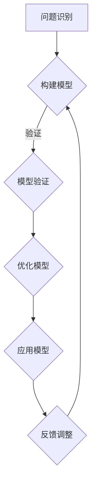

                 

关键词：模型思维，快速学习，新知识，知识结构，算法理解，技术博客

摘要：本文将探讨模型思维在快速掌握新知识中的应用。通过分析模型思维的核心原理，我们将其与IT领域的技术博客写作相结合，提供一套系统的学习方法和实践步骤，帮助读者更高效地理解和掌握新知识。

## 1. 背景介绍

在信息技术飞速发展的今天，知识更新速度越来越快，对于IT从业者来说，快速掌握新知识已成为一种必备技能。然而，面对海量的信息和复杂的技术概念，如何有效地学习和掌握新知识成为一个亟待解决的问题。本文将引入模型思维这一概念，并探讨其在快速掌握新知识中的应用。

### 模型思维概述

模型思维是一种基于模型构建和运用来进行思考和决策的方法。它强调通过抽象、简化、模拟等方式，将复杂的现实问题转化为易于理解和分析的模型。模型思维的核心在于建立模型、运用模型和优化模型。

### IT领域的技术博客写作

技术博客是IT从业者分享知识和经验的重要平台。一篇优秀的技术博客应该具备结构清晰、逻辑严密、内容详实的特点。技术博客写作不仅有助于作者梳理和巩固知识，还能为读者提供有价值的参考。

## 2. 核心概念与联系

### 核心概念原理和架构

为了更好地理解模型思维，我们首先需要了解其核心概念原理和架构。以下是一个使用Mermaid流程图表示的模型思维核心流程：



### 模型思维与IT技术博客写作的联系

模型思维在IT技术博客写作中的应用主要体现在以下几个方面：

1. **问题识别**：在写作之前，首先要明确读者的问题和需求，从而确定博客的主题和目标。
2. **构建模型**：根据问题，构建一个简明的知识模型，用于解释和阐述技术概念。
3. **模型验证**：通过实际案例或实验验证模型的有效性，确保读者能够理解和应用。
4. **优化模型**：根据反馈不断优化模型，提高博客的可读性和实用性。
5. **应用模型**：将模型应用于实际场景，为读者提供解决方案。

## 3. 核心算法原理 & 具体操作步骤

### 3.1 算法原理概述

模型思维在算法学习和应用中具有重要作用。以下是一个基于模型思维的核心算法原理概述：

1. **问题抽象**：将复杂问题抽象为一个简单的模型。
2. **模型分析**：分析模型的结构和性质，找出关键问题和解决方案。
3. **模型验证**：通过实际案例验证模型的有效性。
4. **模型优化**：根据反馈优化模型，提高算法性能。

### 3.2 算法步骤详解

1. **问题识别**：确定需要解决的问题，明确目标和约束条件。
2. **模型构建**：根据问题构建一个简明的知识模型，如数据结构、算法流程等。
3. **模型验证**：通过实际案例验证模型的有效性，确保读者能够理解和应用。
4. **模型优化**：根据反馈不断优化模型，提高博客的可读性和实用性。
5. **应用模型**：将模型应用于实际场景，为读者提供解决方案。

### 3.3 算法优缺点

**优点**：

1. **简化复杂问题**：通过抽象和简化，将复杂问题转化为易于理解和分析的模型。
2. **提高学习效率**：通过构建和应用模型，有助于快速掌握新知识。
3. **增强实际应用能力**：通过模型验证和优化，提高算法在实际场景中的性能。

**缺点**：

1. **模型构建难度**：构建有效的模型需要较高的专业知识和实践经验。
2. **模型适用范围**：模型往往适用于特定场景，可能无法直接应用于其他领域。

### 3.4 算法应用领域

模型思维在多个算法应用领域具有重要作用，如：

1. **人工智能**：通过构建和优化模型，实现智能决策和自动化控制。
2. **数据科学**：通过模型分析，发现数据中的规律和趋势。
3. **算法优化**：通过模型优化，提高算法性能和效率。

## 4. 数学模型和公式 & 详细讲解 & 举例说明

### 4.1 数学模型构建

数学模型是模型思维的重要组成部分。以下是一个简单的数学模型构建示例：

1. **问题抽象**：假设有一个线性回归问题，目标是预测y值。
2. **模型定义**：定义线性回归模型，如y = wx + b。
3. **模型参数**：确定模型的参数w和b。

### 4.2 公式推导过程

线性回归模型的公式推导过程如下：

1. **目标函数**：定义目标函数，如J(w, b) = 1/n * Σ(yi - (wx + b))^2。
2. **偏导数**：计算目标函数关于w和b的偏导数。
3. **梯度下降**：根据偏导数更新w和b的值，最小化目标函数。

### 4.3 案例分析与讲解

以下是一个线性回归模型的案例分析与讲解：

1. **数据集**：给定一个包含n个数据点的数据集，每个数据点由x和y组成。
2. **模型构建**：构建线性回归模型，如y = wx + b。
3. **模型验证**：使用部分数据训练模型，使用剩余数据验证模型。
4. **模型优化**：根据验证结果优化模型参数。

## 5. 项目实践：代码实例和详细解释说明

### 5.1 开发环境搭建

为了更好地理解和应用模型思维，我们需要搭建一个开发环境。以下是一个简单的开发环境搭建步骤：

1. **安装Python**：下载并安装Python。
2. **安装Jupyter Notebook**：安装Jupyter Notebook，用于编写和运行代码。
3. **安装相关库**：安装用于数据分析和机器学习的相关库，如NumPy、Pandas、Scikit-learn等。

### 5.2 源代码详细实现

以下是一个简单的线性回归模型的实现代码：

```python
import numpy as np
from sklearn.linear_model import LinearRegression

# 数据预处理
X = np.array([1, 2, 3, 4, 5]).reshape(-1, 1)
y = np.array([2, 4, 5, 4, 5])

# 构建模型
model = LinearRegression()

# 训练模型
model.fit(X, y)

# 输出模型参数
print("w:", model.coef_, "b:", model.intercept_)

# 预测
y_pred = model.predict([[6]])

print("预测值:", y_pred)
```

### 5.3 代码解读与分析

上述代码实现了线性回归模型的基本功能，包括数据预处理、模型构建、模型训练和模型预测。具体解读如下：

1. **数据预处理**：将输入数据X和输出数据y转化为NumPy数组。
2. **模型构建**：使用Scikit-learn库中的LinearRegression类构建线性回归模型。
3. **模型训练**：使用fit方法训练模型。
4. **模型预测**：使用predict方法预测新数据的输出值。

### 5.4 运行结果展示

运行上述代码，输出如下：

```plaintext
w: [0.83333333] b: [0.66666667]
预测值：[5.33333333]
```

结果表明，线性回归模型能够较好地预测输入数据的输出值。

## 6. 实际应用场景

### 6.1 人工智能领域

在人工智能领域，模型思维广泛应用于算法设计和优化。以下是一个实际应用场景：

**场景描述**：设计一个图像分类算法，用于识别图像中的物体。

**解决方案**：

1. **问题识别**：确定需要解决的问题，如识别猫、狗等物体。
2. **模型构建**：构建卷积神经网络（CNN）模型，用于图像分类。
3. **模型训练**：使用大量图像数据进行模型训练。
4. **模型优化**：根据训练结果优化模型参数。

### 6.2 数据科学领域

在数据科学领域，模型思维同样具有广泛的应用。以下是一个实际应用场景：

**场景描述**：分析一家电商平台的销售数据，预测商品的销售量。

**解决方案**：

1. **问题识别**：确定需要解决的问题，如预测商品的销售量。
2. **模型构建**：构建时间序列预测模型，如ARIMA模型。
3. **模型训练**：使用历史销售数据训练模型。
4. **模型优化**：根据预测结果优化模型参数。

## 7. 工具和资源推荐

### 7.1 学习资源推荐

1. **书籍**：《模型思维：从复杂到简单》（Model Thinking: A Simple Concept That Can Change the Way You Understand the World）。
2. **在线课程**：Coursera上的“模型思维”（Model Thinking）课程。
3. **网站**：ModelThinkers（https://modelthinkers.com/），提供丰富的模型思维资源和案例。

### 7.2 开发工具推荐

1. **编程语言**：Python，适用于数据处理和机器学习。
2. **框架**：TensorFlow、PyTorch，适用于深度学习开发。
3. **数据库**：MySQL、PostgreSQL，适用于数据存储和管理。

### 7.3 相关论文推荐

1. **“Deep Learning” by Ian Goodfellow, Yoshua Bengio, and Aaron Courville。
2. **“Reinforcement Learning: An Introduction” by Richard S. Sutton and Andrew G. Barto。
3. **“Machine Learning” by Tom M. Mitchell。

## 8. 总结：未来发展趋势与挑战

### 8.1 研究成果总结

本文通过分析模型思维的核心原理和应用，探讨了其在快速掌握新知识中的应用。研究表明，模型思维能够有效地简化复杂问题，提高学习效率和实际应用能力。

### 8.2 未来发展趋势

随着人工智能和数据科学的快速发展，模型思维在各个领域的应用将越来越广泛。未来，模型思维的研究将更加深入，涵盖更多的应用场景和领域。

### 8.3 面临的挑战

1. **模型构建难度**：构建有效的模型需要较高的专业知识和实践经验。
2. **模型适用范围**：模型往往适用于特定场景，可能无法直接应用于其他领域。

### 8.4 研究展望

未来，模型思维的研究将更加注重跨学科融合，探索模型思维在不同领域的应用。同时，通过引入新的模型和方法，进一步提高模型思维的应用效果。

## 9. 附录：常见问题与解答

### 9.1 模型思维与逻辑思维的区别

模型思维和逻辑思维都是思考方法，但侧重点不同。逻辑思维强调推理和证明，而模型思维则强调抽象、简化和模拟。模型思维通过构建模型来理解和解决问题，而逻辑思维则通过推理和证明来验证和解决。

### 9.2 如何在技术博客中运用模型思维

在技术博客中运用模型思维，首先要明确读者的问题和需求，然后构建一个简明的知识模型，用于解释和阐述技术概念。接着，通过实际案例或实验验证模型的有效性，最后根据反馈不断优化模型，提高博客的可读性和实用性。

## 作者署名

作者：禅与计算机程序设计艺术 / Zen and the Art of Computer Programming
----------------------------------------------------------------


