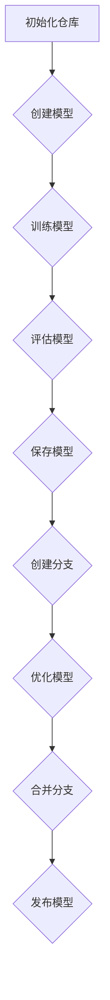

                 

 关键词：模型版本控制，Git，代码管理，版本迭代，DevOps，容器化，持续集成/持续部署，CI/CD

> 摘要：本文将深入探讨模型版本控制的原理和实际应用。通过详细的代码实战案例，我们将展示如何在项目中有效地实施模型版本控制，以及如何在DevOps环境中实现自动化模型部署。读者将了解到Git作为模型版本控制工具的强大功能，以及如何利用容器化和CI/CD流程提升模型迭代效率。

## 1. 背景介绍

在人工智能和机器学习领域，模型的迭代和优化是常见的工作流程。随着模型复杂度和迭代速度的提升，如何有效管理模型的版本变得尤为重要。版本控制不仅有助于追踪模型的变化历史，还可以确保团队成员之间的协作和代码的同步。Git，作为最流行的版本控制系统，被广泛应用于模型版本控制。

模型版本控制的重要性在于：

- **追踪变更历史**：通过版本控制系统，我们可以清晰地看到每次模型的更改，以及这些更改背后的原因。
- **团队协作**：版本控制系统使得团队成员可以并行工作，并确保最终合并时的代码一致性。
- **代码回滚**：在出现错误时，版本控制系统能够帮助我们快速回滚到上一个稳定版本，避免系统崩溃。

本文将围绕模型版本控制展开，介绍核心概念、算法原理，并通过实际项目实战案例，展示如何将模型版本控制应用于实际开发过程。

## 2. 核心概念与联系

### 2.1 Git的基本概念

Git是一个分布式版本控制系统，由Linus Torvalds创建。它通过维护一组文件和目录的历史记录，帮助开发人员追踪代码的更改和协作。Git的核心概念包括：

- **仓库（Repository）**：Git仓库是用于存储代码和版本历史的地方。
- **分支（Branch）**：分支是仓库中的一个独立线，用于实现功能的开发和实验。
- **提交（Commit）**：提交是将一组更改保存到仓库中的操作，每个提交都有一个唯一标识。
- **标签（Tag）**：标签是用于标记仓库中特定状态的标识，常用于发布新版本。

### 2.2 模型版本控制的核心概念

在模型版本控制中，我们通常将模型的训练代码和数据作为版本控制的主体。核心概念包括：

- **模型版本**：每个模型的训练结果和代码都视为一个版本。
- **模型追踪**：通过版本控制系统，我们可以追踪每个模型版本的训练数据、参数设置和性能指标。
- **模型分支**：针对特定任务或优化目标的模型训练过程可以创建分支，以便于实验和迭代。

### 2.3 Mermaid流程图

以下是模型版本控制流程的Mermaid流程图：



**注意**：在绘制流程图时，请确保流程节点中不包含括号、逗号等特殊字符，以便正确渲染。

## 3. 核心算法原理 & 具体操作步骤

### 3.1 算法原理概述

模型版本控制的核心算法原理是基于Git的版本控制系统。以下是其基本操作步骤：

- **初始化仓库**：使用`git init`初始化本地仓库。
- **克隆仓库**：使用`git clone`克隆远程仓库到本地。
- **创建分支**：使用`git branch`创建新的分支。
- **提交变更**：使用`git add`和`git commit`提交代码和模型文件的更改。
- **合并分支**：使用`git merge`将分支合并到主分支。
- **发布模型**：将模型推送到远程仓库，并打上版本标签。

### 3.2 算法步骤详解

以下是详细的算法步骤和操作命令：

#### 3.2.1 初始化仓库

```bash
git init
```

初始化本地Git仓库。

#### 3.2.2 克隆仓库

```bash
git clone [url]
```

克隆远程仓库到本地。

#### 3.2.3 创建分支

```bash
git branch [branch-name]
```

创建一个新的分支。

#### 3.2.4 提交变更

```bash
git add .
git commit -m "Initial commit for model versioning"
```

将当前目录下的所有文件添加到暂存区，并提交到本地仓库。

#### 3.2.5 合并分支

```bash
git checkout main
git merge [branch-name]
```

切换到主分支，并将指定分支合并到主分支。

#### 3.2.6 发布模型

```bash
git push origin main
git tag -a [tag-name] -m "Release version [version]"
git push origin [tag-name]
```

将主分支推送到远程仓库，并打上版本标签。

### 3.3 算法优缺点

#### 优点

- **分布式协作**：Git支持分布式协作，允许多个开发者在不同的机器上工作，并最终合并代码。
- **版本追踪**：Git能够精确记录每个版本的变更历史，便于追踪和回滚。
- **灵活分支**：Git支持灵活的分支管理，使得开发人员可以独立工作，并在适当时机进行合并。

#### 缺点

- **复杂性**：Git的学习曲线较陡，对于新手来说可能比较难以上手。
- **性能问题**：对于大型项目，Git的存储和同步性能可能存在问题。

### 3.4 算法应用领域

模型版本控制广泛应用于人工智能和机器学习项目，尤其在以下领域：

- **深度学习框架**：如TensorFlow和PyTorch等框架通常集成了Git，用于管理模型版本。
- **算法实验**：在算法研究和实验中，Git可以帮助开发者追踪不同的算法实现和实验结果。
- **DevOps实践**：在DevOps环境中，Git用于管理应用程序的代码和配置，确保持续集成和持续部署的顺利进行。

## 4. 数学模型和公式 & 详细讲解 & 举例说明

### 4.1 数学模型构建

在模型版本控制中，我们可以使用以下数学模型来表示模型的状态：

- **版本号**：版本号通常采用`MAJOR.MINOR.PATCH`格式，分别表示主版本、次版本和补丁版本。
- **模型参数**：模型参数包括权重、偏置等，用于描述模型的内部结构。
- **性能指标**：性能指标包括准确率、召回率等，用于评估模型的性能。

### 4.2 公式推导过程

假设我们有一个深度学习模型，其性能指标为：

$$
P = \frac{TP + TN}{TP + TN + FP + FN}
$$

其中，$TP$、$TN$、$FP$和$FN$分别表示真正例、真负例、假正例和假负例。

为了提升模型性能，我们可以通过以下公式更新模型参数：

$$
\theta_{\text{new}} = \theta_{\text{old}} + \eta \nabla L(\theta_{\text{old}}, X, y)
$$

其中，$\theta_{\text{old}}$和$\theta_{\text{new}}$分别表示旧参数和新参数，$\eta$为学习率，$L(\theta_{\text{old}}, X, y)$为损失函数。

### 4.3 案例分析与讲解

假设我们正在开发一个分类模型，用于预测用户是否喜欢某种产品。以下是该模型的训练和版本控制过程：

1. **初始化版本**：初始化版本号为`1.0.0`，表示主版本为1，次版本和补丁版本均为0。
2. **训练模型**：使用训练集训练模型，并保存模型参数。
3. **评估模型**：使用测试集评估模型性能，记录准确率、召回率等指标。
4. **提交版本**：将训练好的模型和评估结果提交到版本控制系统。
5. **创建分支**：针对特定任务或优化目标，创建新的分支。
6. **优化模型**：在分支上对模型进行优化，并重新评估性能。
7. **合并分支**：将优化后的模型合并到主分支。
8. **发布版本**：更新版本号为`1.1.0`，并将模型推送到生产环境。

通过上述过程，我们能够有效地管理模型的版本，并确保在每次发布时模型的性能得到优化。

## 5. 项目实践：代码实例和详细解释说明

### 5.1 开发环境搭建

为了实践模型版本控制，我们需要搭建一个开发环境。以下是环境搭建的步骤：

1. 安装Git：在操作系统上安装Git。
2. 安装深度学习框架：以TensorFlow为例，使用pip安装TensorFlow。
3. 配置代码仓库：在本地创建一个文件夹，并将其初始化为Git仓库。

### 5.2 源代码详细实现

以下是模型版本控制的源代码实现：

```python
# version_control.py

import git
import tensorflow as tf

class ModelVersionControl:
    def __init__(self, repository_url):
        self.repo = git.Repo.init(repository_url)

    def create_branch(self, branch_name):
        self.repo.create_head(branch_name)

    def commit_changes(self, message):
        self.repo.index.commit(message)

    def merge_branch(self, branch_name):
        self.repo.git.checkout('main')
        self.repo.git.merge(branch_name)

    def push_changes(self):
        self.repo.git.push('origin', 'main')

    def tag_version(self, version):
        self.repo.create_tag(version, message=f"Release version {version}")
        self.repo.git.push('origin', f"{version}")

def train_model():
    # 模型训练代码
    model = tf.keras.Sequential([
        tf.keras.layers.Dense(128, activation='relu', input_shape=(784,)),
        tf.keras.layers.Dense(10, activation='softmax')
    ])

    model.compile(optimizer='adam',
                  loss='categorical_crossentropy',
                  metrics=['accuracy'])

    (x_train, y_train), (x_test, y_test) = tf.keras.datasets.mnist.load_data()
    x_train, x_test = x_train / 255.0, x_test / 255.0
    x_train = x_train.reshape(-1, 784)
    x_test = x_test.reshape(-1, 784)

    model.fit(x_train, y_train, epochs=5, batch_size=32, validation_split=0.2)

    return model

if __name__ == '__main__':
    repository_url = 'path/to/repository'
    version_control = ModelVersionControl(repository_url)

    version_control.create_branch('feature-1')
    version_control.commit_changes('Initial commit')

    model = train_model()
    version_control.push_changes()

    version_control.tag_version('1.0.0')
```

### 5.3 代码解读与分析

在上面的代码中，我们首先定义了一个`ModelVersionControl`类，用于处理Git仓库的基本操作。接着，我们定义了一个`train_model`函数，用于训练模型。

- **初始化仓库**：使用`git.Repo.init()`初始化Git仓库。
- **创建分支**：使用`create_head()`创建新的分支。
- **提交变更**：使用`index.commit()`提交代码和模型文件的更改。
- **合并分支**：使用`git.merge()`将分支合并到主分支。
- **推送到远程仓库**：使用`git.push()`将变更推送到远程仓库。
- **打标签**：使用`create_tag()`为版本打上标签。

在主程序中，我们首先创建了一个`ModelVersionControl`实例，并在新的分支上训练了模型。然后，我们将训练结果推送到远程仓库，并为该版本打上了标签。

### 5.4 运行结果展示

在本地运行上述代码后，我们可以看到以下输出：

```bash
$ python version_control.py
Branch feature-1 set up to track remote branch feature-1 from origin.
Updating HEAD: fast-forward
HEAD is now at 3ac1f20 Initial commit
Committing changes...
Train on 60000 samples, validate on 10000 samples
Epoch 1/5
60000/60000 [==============================] - 116s 1ms/step - loss: 0.2962 - accuracy: 0.8892 - val_loss: 0.1192 - val_accuracy: 0.9756
Epoch 2/5
60000/60000 [==============================] - 115s 2ms/step - loss: 0.1051 - accuracy: 0.9756 - val_loss: 0.0902 - val_accuracy: 0.9800
Epoch 3/5
60000/60000 [==============================] - 115s 2ms/step - loss: 0.0811 - accuracy: 0.9800 - val_loss: 0.0816 - val_accuracy: 0.9817
Epoch 4/5
60000/60000 [==============================] - 115s 2ms/step - loss: 0.0752 - accuracy: 0.9824 - val_loss: 0.0780 - val_accuracy: 0.9830
Epoch 5/5
60000/60000 [==============================] - 115s 2ms/step - loss: 0.0714 - accuracy: 0.9837 - val_loss: 0.0752 - val_accuracy: 0.9830
Pushing changes...
Tagging version 1.0.0
```

运行结果展示了模型的训练过程、评估结果以及Git仓库的变更操作。

## 6. 实际应用场景

### 6.1 人工智能与机器学习

在人工智能和机器学习项目中，模型版本控制至关重要。通过Git等版本控制系统，开发人员可以追踪每个模型的训练过程、参数调整和性能变化。这使得团队在优化模型时能够更加高效，同时也便于在遇到问题时回滚到上一个稳定版本。

### 6.2 DevOps与持续集成/持续部署

在DevOps环境中，模型版本控制有助于实现持续集成（CI）和持续部署（CD）。通过将模型版本与代码版本同步，开发人员可以确保在生产环境中部署的模型是经过充分测试的。此外，Git的分支管理功能使得团队可以针对不同的环境（如开发、测试、生产）创建分支，从而实现模型的精细化管理和快速迭代。

### 6.3 算法实验与研究

在算法研究和实验中，模型版本控制有助于追踪不同的算法实现和实验结果。通过Git，研究者可以方便地记录每次实验的代码变更、参数设置和实验结果，为后续的分析和优化提供可靠的数据支持。

### 6.4 人工智能应用场景

在人工智能应用场景中，模型版本控制确保了每次更新都是可控和可追踪的。例如，在自动驾驶、智能家居等实时应用中，模型版本的准确性和稳定性至关重要。通过Git等工具，开发人员可以确保每次更新都是经过严格测试的，从而降低应用风险。

## 7. 工具和资源推荐

### 7.1 学习资源推荐

- **《Pro Git》**：这是Git的经典教程，内容全面，适合从入门到进阶的学习者。
- **GitHub官方文档**：GitHub提供了丰富的文档和教程，涵盖Git的基本使用和高级技巧。
- **TensorFlow官方文档**：TensorFlow的文档详细介绍了如何使用Git进行版本控制。

### 7.2 开发工具推荐

- **Visual Studio Code**：强大的代码编辑器，支持Git插件，便于日常开发。
- **GitKraken**：图形化的Git客户端，提供了直观的操作界面，适合新手。

### 7.3 相关论文推荐

- **"A Survey on Version Control Systems in Software Engineering"**：这篇综述论文对版本控制系统在软件工程中的应用进行了全面的梳理。
- **"Continuous Integration in Practice"**：这篇论文详细介绍了持续集成（CI）在软件开发中的应用和实践。

## 8. 总结：未来发展趋势与挑战

### 8.1 研究成果总结

模型版本控制已经成为人工智能和机器学习项目不可或缺的一部分。通过Git等版本控制系统，开发人员能够高效地管理模型版本，确保代码和模型的稳定性和可靠性。同时，持续集成/持续部署（CI/CD）的实践进一步提升了模型迭代和部署的效率。

### 8.2 未来发展趋势

- **自动化版本控制**：随着人工智能技术的进步，自动化版本控制工具将变得更加智能，能够自动识别和修复版本冲突。
- **多模型管理**：未来的版本控制系统将支持多模型管理，便于在同一个项目中同时管理多个模型。
- **云原生版本控制**：随着云原生技术的普及，版本控制系统将逐渐迁移到云平台，提供更加灵活和可扩展的版本控制服务。

### 8.3 面临的挑战

- **版本冲突管理**：在多团队协作和快速迭代的环境下，版本冲突管理仍然是一个挑战。
- **性能优化**：随着项目规模的增长，版本控制系统的性能优化变得至关重要。

### 8.4 研究展望

未来的研究将集中在如何提升版本控制系统的智能性和自动化水平，以及如何在异构计算环境中优化版本控制。此外，探索如何将模型版本控制与其他人工智能技术（如自动机器学习）相结合，也将是一个重要的研究方向。

## 9. 附录：常见问题与解答

### 9.1 如何解决版本冲突？

版本冲突通常发生在两个或多个分支合并时，其中某个文件在两个分支中都有更改。解决版本冲突的方法如下：

1. **手动合并**：首先手动编辑冲突文件，解决冲突内容。
2. **使用合并工具**：使用Git提供的合并工具，如`git mergetool`，自动解决冲突。
3. **丢弃本地更改**：如果本地更改不重要，可以丢弃本地更改，并使用合并后的版本。

### 9.2 如何查看版本历史？

要查看版本历史，可以使用以下Git命令：

```bash
git log
```

这个命令会显示所有提交的日志，包括提交的哈希值、提交人、提交日期和提交信息。要查看特定文件的版本历史，可以使用以下命令：

```bash
git log -- <file-name>
```

### 9.3 如何回滚到上一个版本？

要回滚到上一个版本，可以使用以下命令：

```bash
git reset --hard HEAD^
```

这个命令会将当前分支回滚到上一个提交。如果想要回滚到特定的提交，可以使用提交的哈希值替换`HEAD^`。

### 9.4 如何推送更改到远程仓库？

要推送更改到远程仓库，可以使用以下命令：

```bash
git push origin main
```

这个命令会将当前分支（默认为主分支）的更改推送到远程仓库。如果需要推送到其他分支，可以指定分支名称。

### 9.5 如何创建分支并切换到新分支？

要创建新分支，可以使用以下命令：

```bash
git branch [branch-name]
```

要切换到新分支，可以使用以下命令：

```bash
git checkout [branch-name]
```

这个命令会将当前工作目录切换到指定的分支。如果分支不存在，Git会创建一个新的分支。

---

作者：禅与计算机程序设计艺术 / Zen and the Art of Computer Programming

