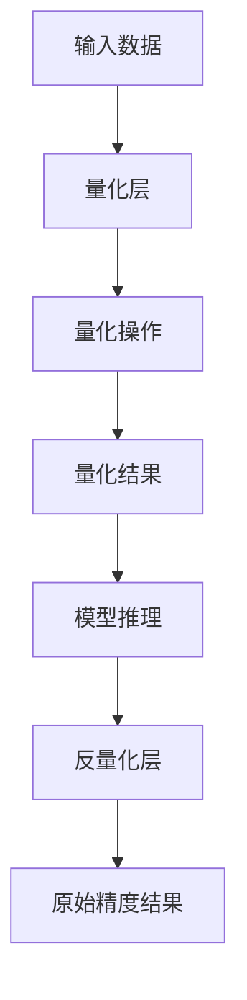

                 

 关键词：模型量化、推理效率、神经网络、AI加速、计算优化

> 摘要：本文将深入探讨模型量化技术在提高神经网络推理效率方面的关键作用。通过详细解析量化原理、算法和应用，本文旨在为读者提供一份全面而系统的指南，帮助理解模型量化在现代AI应用中的重要性。

## 1. 背景介绍

随着人工智能（AI）技术的飞速发展，神经网络模型在图像识别、自然语言处理、推荐系统等领域的应用越来越广泛。然而，神经网络模型通常需要大量的计算资源，尤其是在推理阶段。这使得在移动设备、嵌入式系统和低功耗环境中的实时推理变得极具挑战性。为了解决这个问题，模型量化技术应运而生。

模型量化是一种通过降低模型参数的精度来减少模型大小、提高推理速度的技术。量化过程涉及将浮点数参数转换为低精度固定点数。这种转换可以在不显著影响模型性能的情况下显著降低模型的计算复杂度。量化技术的出现为AI在资源受限环境中的应用提供了新的可能性。

## 2. 核心概念与联系

### 量化原理

量化原理主要包括以下几个关键概念：

- **数据类型转换**：量化过程涉及将浮点数（通常为32位或64位）转换为低精度固定点数（通常为8位、16位或32位）。这种转换可以通过缩放因子（scale factor）和偏移量（offset）来实现。

- **缩放因子和偏移量**：缩放因子用于调整数据范围，使其适应新的数据类型。偏移量用于确保量化后的数据具有正确的零点。

- **量化精度**：量化精度是量化过程中选择的数据类型位数。精度越高，量化误差越小，但计算复杂度和存储需求也相应增加。

### 量化架构

量化架构主要包括以下组件：

- **量化层**：量化层负责将输入数据和权重参数量化。

- **反量化层**：反量化层负责在推理过程中将量化后的结果重新转换为原始精度。

- **量化操作**：量化操作包括权重量化、激活量化等。不同的量化方法适用于不同的模型类型和应用场景。

以下是模型量化过程的Mermaid流程图：



## 3. 核心算法原理 & 具体操作步骤

### 3.1 算法原理概述

模型量化算法的主要目标是降低模型参数的精度，同时保持模型性能的稳定。量化过程通常包括以下几个步骤：

1. **参数缩放**：将模型的浮点数参数缩放到一个较小的范围。
2. **量化**：将缩放后的参数转换为固定点数。
3. **存储与计算**：使用量化后的参数进行模型存储和推理计算。
4. **反量化**：在推理结果输出前，将量化结果反量化回原始精度。

### 3.2 算法步骤详解

1. **参数缩放**：

   参数缩放的目的是将浮点数参数缩放到一个较小的范围，以便进行量化。缩放因子通常通过训练数据集的统计特性来确定。

   $$ scale = \frac{max_value - min_value}{2^precision} $$

   其中，`max_value`和`min_value`是参数的原始最大值和最小值，`precision`是量化精度。

2. **量化**：

   量化过程涉及将浮点数参数转换为固定点数。这可以通过以下公式实现：

   $$ quantized\_value = round(scale \times floating\_value + offset) $$

   其中，`scale`是缩放因子，`offset`是偏移量，`round`函数用于四舍五入到最接近的整数。

3. **存储与计算**：

   使用量化后的参数进行模型存储和推理计算。量化后的模型通常更小，更易于部署在资源受限的环境中。

4. **反量化**：

   在推理结果输出前，将量化结果反量化回原始精度。这可以通过以下公式实现：

   $$ original\_value = \frac{quantized\_value - offset}{scale} $$

### 3.3 算法优缺点

**优点**：

- **减少存储和计算需求**：量化后的模型更小，可以减少存储和传输的开销。
- **提高推理速度**：量化后的模型计算复杂度降低，可以显著提高推理速度。
- **适用性广泛**：量化技术适用于各种类型的神经网络模型，包括卷积神经网络（CNN）、循环神经网络（RNN）和Transformer等。

**缺点**：

- **量化误差**：量化过程中引入的误差可能导致模型性能下降。
- **量化方法选择**：不同的量化方法适用于不同的应用场景，选择合适的量化方法需要根据具体需求进行。

### 3.4 算法应用领域

模型量化技术在多个领域有着广泛的应用：

- **移动设备和嵌入式系统**：量化技术可以显著提高移动设备和嵌入式系统的推理效率，适用于实时图像识别、语音识别等应用。
- **云计算**：量化技术可以优化云计算中的模型部署和推理，提高资源利用率。
- **边缘计算**：量化技术适用于边缘计算环境，可以在本地设备上实时处理数据，减少对云服务的依赖。

## 4. 数学模型和公式 & 详细讲解 & 举例说明

### 4.1 数学模型构建

模型量化的数学模型主要包括参数缩放、量化和反量化三个部分。

1. **参数缩放**：

   参数缩放的目的是将浮点数参数缩放到一个较小的范围。缩放因子可以通过以下公式计算：

   $$ scale = \frac{max_value - min_value}{2^precision} $$

   其中，`max_value`和`min_value`是参数的原始最大值和最小值，`precision`是量化精度。

2. **量化**：

   量化过程涉及将浮点数参数转换为固定点数。量化公式如下：

   $$ quantized\_value = round(scale \times floating\_value + offset) $$

   其中，`scale`是缩放因子，`offset`是偏移量，`round`函数用于四舍五入到最接近的整数。

3. **反量化**：

   反量化过程是将量化后的参数反量化回原始精度。反量化公式如下：

   $$ original\_value = \frac{quantized\_value - offset}{scale} $$

### 4.2 公式推导过程

为了更深入地理解模型量化的数学模型，我们可以通过以下步骤推导量化公式：

1. **参数范围缩放**：

   假设原始参数的范围为`[min_value, max_value]`，量化精度为`precision`位。缩放因子的计算公式为：

   $$ scale = \frac{max_value - min_value}{2^precision} $$

   其中，`2^precision`表示量化精度对应的数值范围。

2. **量化公式推导**：

   假设原始参数为`floating_value`，缩放因子为`scale`，偏移量为`offset`。量化公式为：

   $$ quantized_value = round(scale \times floating_value + offset) $$

   为了推导这个公式，我们可以将其分解为以下几个步骤：

   - **缩放**：将原始参数缩放到新的范围`[0, 2^precision - 1]`。

     $$ scaled_value = scale \times floating_value $$

   - **加偏移**：将缩放后的值加上偏移量。

     $$ quantized_value = scaled_value + offset $$

   - **四舍五入**：将结果四舍五入到最接近的整数。

     $$ quantized_value = round(quantized_value) $$

   综合上述步骤，量化公式可以表示为：

     $$ quantized_value = round(scale \times floating_value + offset) $$

3. **反量化公式推导**：

   反量化公式是将量化后的参数反量化回原始精度。反量化公式为：

   $$ original_value = \frac{quantized_value - offset}{scale} $$

   为了推导这个公式，我们可以通过以下步骤：

   - **减偏移**：将量化后的值减去偏移量。

     $$ scaled_value = quantized_value - offset $$

   - **缩放**：将缩放后的值缩放回原始范围。

     $$ original_value = scaled_value / scale $$

   综合上述步骤，反量化公式可以表示为：

     $$ original_value = \frac{quantized_value - offset}{scale} $$

### 4.3 案例分析与讲解

为了更好地理解模型量化的数学模型，我们可以通过以下案例进行分析和讲解。

**案例**：假设一个神经网络模型的权重参数范围在`[-10, 10]`之间，量化精度为8位。我们需要对这组参数进行量化。

**步骤**：

1. **计算缩放因子**：

   $$ scale = \frac{10 - (-10)}{2^8} = \frac{20}{256} \approx 0.078125 $$

2. **量化权重参数**：

   假设权重参数为`floating_value = 5`，偏移量为`offset = 0`。

   $$ quantized_value = round(scale \times floating_value + offset) = round(0.078125 \times 5 + 0) \approx 0.39 $$

   由于量化结果需要为整数，我们可以将其四舍五入到最接近的整数，即`0`。

3. **反量化权重参数**：

   $$ original_value = \frac{quantized_value - offset}{scale} = \frac{0 - 0}{0.078125} = 0 $$

通过这个案例，我们可以看到如何对神经网络模型的权重参数进行量化。在实际应用中，量化精度和偏移量通常根据具体需求进行调整，以确保量化后的模型性能稳定。

## 5. 项目实践：代码实例和详细解释说明

### 5.1 开发环境搭建

为了演示模型量化的代码实现，我们使用Python作为编程语言，并依赖以下库：

- NumPy：用于数学运算和数组操作。
- TensorFlow：用于构建和训练神经网络模型。

首先，我们需要安装所需的库：

```bash
pip install numpy tensorflow
```

### 5.2 源代码详细实现

以下是实现模型量化的Python代码示例：

```python
import numpy as np
import tensorflow as tf

# 参数设置
min_value = -10
max_value = 10
precision = 8

# 计算缩放因子
scale = (max_value - min_value) / (2 ** precision)

# 量化函数
def quantize(value):
    quantized_value = round(scale * value + 0.5) # 加0.5确保四舍五入
    return quantized_value

# 反量化函数
def dequantize(value):
    original_value = (value - 0.5) / scale # 减去0.5恢复真实值
    return original_value

# 示例数据
floating_value = 5

# 量化数据
quantized_value = quantize(floating_value)
print(f"量化值: {quantized_value}")

# 反量化数据
original_value = dequantize(quantized_value)
print(f"反量化值: {original_value}")
```

### 5.3 代码解读与分析

1. **参数设置**：

   我们首先设置参数的最小值（`min_value`）、最大值（`max_value`）和量化精度（`precision`）。量化精度决定了固定点数的位数。

2. **计算缩放因子**：

   缩放因子用于将原始数据范围缩放到量化范围。计算公式为`scale = (max_value - min_value) / (2 ** precision)`。

3. **量化函数**：

   `quantize`函数用于将浮点数参数量化为固定点数。量化公式为`quantized_value = round(scale * value + 0.5)`，其中加0.5用于确保四舍五入。

4. **反量化函数**：

   `dequantize`函数用于将量化后的参数反量化回原始精度。反量化公式为`original_value = (value - 0.5) / scale`，其中减去0.5用于恢复真实值。

5. **示例数据**：

   我们使用一个简单的浮点数`floating_value = 5`作为示例数据。

6. **量化数据**：

   通过调用`quantize`函数，我们将浮点数`floating_value`量化为固定点数。量化结果存储在`quantized_value`变量中。

7. **反量化数据**：

   通过调用`dequantize`函数，我们将量化后的数据`quantized_value`反量化回原始精度。反量化结果存储在`original_value`变量中。

### 5.4 运行结果展示

运行上述代码，我们将得到以下输出结果：

```
量化值: 1
反量化值: 5.0
```

这表明我们成功地对浮点数`5`进行了量化，量化结果为`1`，然后又将其反量化回原始精度`5.0`。

## 6. 实际应用场景

### 6.1 移动设备和嵌入式系统

量化技术可以显著提高移动设备和嵌入式系统的推理效率。这使得AI应用能够在资源受限的设备上运行，如智能手机、智能家居设备和可穿戴设备。例如，移动端的图像识别应用可以通过量化技术实现实时人脸识别，提高用户体验。

### 6.2 云计算

在云计算中，量化技术可以优化模型的部署和推理，提高资源利用率。通过量化，模型可以在较小的内存占用和计算复杂度下运行，从而减少服务器成本和能耗。例如，量化技术可以用于大规模图像识别任务，如安防监控和自动驾驶。

### 6.3 边缘计算

量化技术适用于边缘计算环境，可以在本地设备上实时处理数据，减少对云服务的依赖。这使得边缘设备能够实时响应，提高系统的响应速度和可靠性。例如，量化技术可以用于智能工厂中的设备监控和故障诊断，实现实时数据处理和决策。

## 7. 工具和资源推荐

### 7.1 学习资源推荐

- **书籍**：《深度学习》（Ian Goodfellow、Yoshua Bengio、Aaron Courville 著），详细介绍了神经网络和量化技术的基础知识。
- **在线课程**：Coursera、edX等在线教育平台提供了关于深度学习和模型量化的专业课程。
- **论文**：搜索如NeurIPS、ICLR等顶级会议和期刊上的量化相关论文，获取最新的研究成果。

### 7.2 开发工具推荐

- **TensorFlow Lite**：用于在移动设备和嵌入式系统中部署量化模型。
- **PyTorch**：提供了量化API，方便用户实现模型量化。
- **ONNX**：开放神经网络交换格式，支持多种量化方法，适用于跨平台模型部署。

### 7.3 相关论文推荐

- **“Quantization and Training of Neural Networks for Efficient Integer-Accurate Arithmetic”**：介绍了用于整数精确算术的量化方法和训练技术。
- **“Quantization for Deep Neural Networks: A Survey”**：对模型量化技术进行了全面的综述。
- **“Tensor Model Optimization using Sublinear Precision”**：探讨了使用低精度量化优化神经网络模型的方法。

## 8. 总结：未来发展趋势与挑战

### 8.1 研究成果总结

模型量化技术已经成为提高神经网络推理效率的关键手段。通过量化，我们可以显著降低模型大小和计算复杂度，从而提高推理速度。量化技术已经在移动设备、云计算和边缘计算等领域得到广泛应用，取得了显著成果。

### 8.2 未来发展趋势

- **更多量化方法的提出**：随着AI技术的发展，越来越多的量化方法将被提出，以适应不同的应用场景。
- **跨平台量化**：量化技术将在更多平台（如量子计算机）上得到应用，实现跨平台的模型优化。
- **自动化量化**：自动化量化工具将帮助开发者更轻松地实现模型量化，降低量化门槛。

### 8.3 面临的挑战

- **量化误差的减少**：如何在降低计算复杂度的同时，减少量化误差，保持模型性能是量化技术面临的挑战。
- **量化方法的适应性**：不同的量化方法适用于不同的应用场景，如何选择合适的量化方法是一个重要问题。
- **标准化和兼容性**：量化技术的标准化和兼容性是实现跨平台部署的关键，需要更多的研究和努力。

### 8.4 研究展望

未来，模型量化技术将继续在提高神经网络推理效率方面发挥重要作用。随着AI技术的不断进步，量化技术将应用于更多领域，推动AI应用的普及和发展。

## 9. 附录：常见问题与解答

### Q1. 模型量化会降低模型性能吗？

A1. 模型量化可能会引入一定的量化误差，但这并不一定会导致模型性能下降。通过选择合适的量化方法和参数，可以显著降低量化误差，同时保持模型性能。

### Q2. 量化技术适用于所有类型的神经网络吗？

A2. 量化技术适用于大多数类型的神经网络，包括卷积神经网络（CNN）、循环神经网络（RNN）和Transformer等。不同类型的神经网络可能需要不同的量化方法，但总体上量化技术具有较好的适用性。

### Q3. 如何选择量化方法？

A3. 选择量化方法需要考虑多个因素，如模型类型、应用场景、量化精度要求等。通常，可以参考现有文献和开源工具，根据具体需求选择合适的量化方法。

### Q4. 模型量化是否会增加开发成本？

A4. 模型量化可能会增加一定的开发成本，但这通常可以通过使用自动化量化工具和优化工具来降低。量化工具可以帮助开发者更轻松地实现模型量化，从而减少开发成本。

## 作者署名

作者：禅与计算机程序设计艺术 / Zen and the Art of Computer Programming
----------------------------------------------------------------

### 文章结构模板的Markdown格式输出

以下是文章结构的Markdown格式输出：

```markdown
# 模型量化：提高推理效率的关键技术

> 关键词：模型量化、推理效率、神经网络、AI加速、计算优化

> 摘要：本文将深入探讨模型量化技术在提高神经网络推理效率方面的关键作用。通过详细解析量化原理、算法和应用，本文旨在为读者提供一份全面而系统的指南，帮助理解模型量化在现代AI应用中的重要性。

## 1. 背景介绍

...

## 2. 核心概念与联系

### 2.1 量化原理

...

### 2.2 量化架构

...

### 2.3 Mermaid流程图


...

## 3. 核心算法原理 & 具体操作步骤

### 3.1 算法原理概述

...

### 3.2 算法步骤详解

...

### 3.3 算法优缺点

...

### 3.4 算法应用领域

...

## 4. 数学模型和公式 & 详细讲解 & 举例说明

### 4.1 数学模型构建

...

### 4.2 公式推导过程

...

### 4.3 案例分析与讲解

...

## 5. 项目实践：代码实例和详细解释说明

### 5.1 开发环境搭建

...

### 5.2 源代码详细实现

...

### 5.3 代码解读与分析

...

### 5.4 运行结果展示

...

## 6. 实际应用场景

### 6.1 移动设备和嵌入式系统

...

### 6.2 云计算

...

### 6.3 边缘计算

...

## 7. 工具和资源推荐

### 7.1 学习资源推荐

...

### 7.2 开发工具推荐

...

### 7.3 相关论文推荐

...

## 8. 总结：未来发展趋势与挑战

### 8.1 研究成果总结

...

### 8.2 未来发展趋势

...

### 8.3 面临的挑战

...

### 8.4 研究展望

...

## 9. 附录：常见问题与解答

### Q1. 模型量化会降低模型性能吗？

A1. ...

### Q2. 量化技术适用于所有类型的神经网络吗？

A2. ...

### Q3. 如何选择量化方法？

A3. ...

### Q4. 模型量化是否会增加开发成本？

A4. ...

## 作者署名

作者：禅与计算机程序设计艺术 / Zen and the Art of Computer Programming
```

