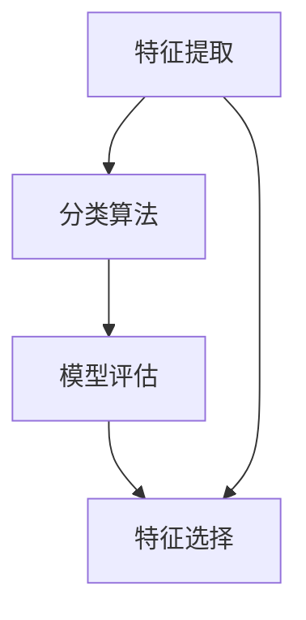

                 

在当今信息化时代，模式识别作为人工智能领域的核心组成部分，扮演着举足轻重的角色。它不仅是机器学习和数据挖掘的基础，同时也是计算机视觉、自然语言处理、语音识别等多个领域的基石。本文将深入探讨模式识别的基本原理，并通过代码实例详尽讲解其应用和实践。

> 关键词：模式识别、机器学习、图像识别、自然语言处理、数据挖掘、深度学习

## 摘要

本文旨在提供一个全面而详尽的模式识别教程，涵盖从基础概念到高级应用的各个方面。读者将了解到模式识别的核心算法原理、数学模型、实际应用实例，以及未来的发展趋势和挑战。通过本篇文章，读者不仅可以掌握模式识别的基本知识，还能通过代码实例亲身体验到模式识别的魅力和实际应用价值。

## 1. 背景介绍

模式识别（Pattern Recognition）是人工智能的一个分支，旨在通过建立数学模型和算法，使计算机能够自动地从数据中识别出有意义的模式。其历史可以追溯到20世纪中叶，随着计算机技术的快速发展，模式识别逐渐成为人工智能领域的重要组成部分。

### 模式识别的发展历程

- **20世纪50年代**：模式识别概念首次提出，研究者开始关注如何使计算机识别和分类数据。

- **20世纪60年代**：出现了一些早期的算法，如线性判别分析和K最近邻算法。

- **20世纪70年代**：神经网络和统计方法开始得到应用。

- **20世纪80年代**：基于知识的系统逐渐流行，专家系统成为研究热点。

- **20世纪90年代**：支持向量机和决策树等算法取得显著进展。

- **21世纪初至今**：深度学习和大数据的兴起，使得模式识别进入一个新的发展阶段。

### 模式识别的应用领域

- **计算机视觉**：通过图像识别、目标检测和面部识别等技术实现图像处理和图像分析。

- **自然语言处理**：涉及文本分类、情感分析和机器翻译等。

- **语音识别**：将语音信号转换为文本或命令。

- **生物特征识别**：指纹识别、面部识别和虹膜识别等。

- **医疗诊断**：通过图像分析辅助医生进行疾病诊断。

- **金融风控**：识别异常交易，预防金融犯罪。

- **自动驾驶**：通过环境感知实现无人驾驶。

## 2. 核心概念与联系

模式识别涉及多个核心概念，包括特征提取、分类算法和模型评估。下面是这些概念及其相互关系的Mermaid流程图：



### 2.1 特征提取

特征提取是将原始数据转换为能够描述数据特性的表示形式。这个过程通常涉及降维、特征选择和特征变换。

- **降维**：通过减少数据维度来降低计算复杂度。
- **特征选择**：从原始特征中选择最有用的特征，提高模型性能。
- **特征变换**：通过线性变换或非线性变换将特征映射到更合适的空间。

### 2.2 分类算法

分类算法是将数据分为预定义的类别。常见的分类算法包括：

- **线性判别分析（LDA）**：基于特征空间中类别的可分离性。
- **K最近邻（K-NN）**：基于邻近度进行分类。
- **支持向量机（SVM）**：通过最大化类别之间的边界。
- **决策树**：通过一系列规则进行分类。
- **随机森林**：基于决策树的集成学习方法。

### 2.3 模型评估

模型评估是评估分类算法性能的过程。常用的评估指标包括：

- **准确率（Accuracy）**：正确分类的样本数占总样本数的比例。
- **召回率（Recall）**：正确分类的样本数占所有实际正类样本数的比例。
- **精确率（Precision）**：正确分类的样本数占所有预测为正类样本数的比例。
- **F1值（F1 Score）**：精确率和召回率的调和平均值。

## 3. 核心算法原理 & 具体操作步骤

### 3.1 算法原理概述

模式识别的核心算法主要包括特征提取、特征选择、分类算法和模型评估。下面将详细讲解每种算法的原理。

#### 3.1.1 特征提取

特征提取的原理是通过一系列数学变换，将原始数据转换为更易于分析的形式。常见的方法包括：

- **主成分分析（PCA）**：通过保留数据的主要变化，降低数据维度。
- **线性判别分析（LDA）**：基于最小化类内方差和最大化类间方差，实现特征提取。
- **奇异值分解（SVD）**：用于降维和数据重构。

#### 3.1.2 特征选择

特征选择的原理是选择对分类任务最有影响力的特征，以提高模型性能。常见的方法包括：

- **信息增益（IG）**：基于特征对分类信息的影响进行选择。
- **卡方检验（Chi-square test）**：用于评估特征与目标变量之间的相关性。
- **递归特征消除（RFE）**：通过迭代选择和消除特征，找到最优特征子集。

#### 3.1.3 分类算法

分类算法的原理是通过构建分类模型，将新样本分类到预定义的类别。常见的方法包括：

- **K最近邻（K-NN）**：基于邻近度进行分类。
- **支持向量机（SVM）**：通过最大化类别之间的边界进行分类。
- **决策树**：通过一系列规则进行分类。
- **随机森林**：基于决策树的集成学习方法。

#### 3.1.4 模型评估

模型评估的原理是通过评估指标评估分类模型的性能。常见的方法包括：

- **交叉验证**：通过在不同数据集上多次训练和评估，获得更可靠的模型性能估计。
- **ROC曲线**：通过绘制真阳性率对假阳性率的曲线，评估模型的分类能力。
- **AUC值**：ROC曲线下的面积，用于评估模型的分类能力。

### 3.2 算法步骤详解

#### 3.2.1 特征提取

1. 数据预处理：对原始数据进行清洗和处理，包括缺失值填充、异常值处理和数据标准化。
2. 主成分分析（PCA）：通过计算协方差矩阵的特征值和特征向量，对数据降维。
3. 特征选择：通过信息增益或卡方检验等方法，选择对分类任务最有影响力的特征。

#### 3.2.2 分类算法

1. 数据集划分：将数据集划分为训练集和测试集。
2. 模型训练：使用训练集训练分类模型。
3. 模型评估：使用测试集评估模型性能，调整模型参数。

#### 3.2.3 模型评估

1. 交叉验证：在训练集上多次训练和评估模型，获得模型性能的估计。
2. ROC曲线：绘制真阳性率对假阳性率的曲线，评估模型的分类能力。
3. AUC值：计算ROC曲线下的面积，评估模型的分类能力。

### 3.3 算法优缺点

#### 3.3.1 特征提取

**优点**：

- 降低数据维度，减少计算复杂度。
- 提高模型性能，减少过拟合。

**缺点**：

- 可能会损失部分信息，降低模型准确性。
- 特征选择过程可能引入主观因素。

#### 3.3.2 分类算法

**K最近邻（K-NN）**：

**优点**：

- 简单易懂，易于实现。
- 对异常值不敏感。

**缺点**：

- 需要大量存储空间。
- 对噪声敏感，性能不稳定。

**支持向量机（SVM）**：

**优点**：

- 强大的分类能力。
- 对线性不可分问题也有较好的表现。

**缺点**：

- 计算复杂度高。
- 对非线性问题需要核函数的支持。

**决策树**：

**优点**：

- 易于理解和解释。
- 对噪声有较好的鲁棒性。

**缺点**：

- 容易过拟合。
- 对大规模数据集性能较差。

**随机森林**：

**优点**：

- 结合了决策树的优势，提高了模型性能。
- 对噪声有较好的鲁棒性。

**缺点**：

- 计算复杂度高。
- 需要大量训练数据。

### 3.4 算法应用领域

模式识别算法广泛应用于各个领域，以下是一些典型的应用场景：

- **计算机视觉**：图像分类、目标检测、人脸识别。
- **自然语言处理**：文本分类、情感分析、机器翻译。
- **语音识别**：语音信号处理、语音合成。
- **生物特征识别**：指纹识别、面部识别、虹膜识别。
- **医疗诊断**：疾病诊断、药物研发。
- **金融风控**：异常交易检测、信用评分。

## 4. 数学模型和公式 & 详细讲解 & 举例说明

模式识别中的数学模型和公式是实现各种算法的核心。以下将对常见的数学模型和公式进行详细讲解，并通过具体例子进行说明。

### 4.1 数学模型构建

模式识别的数学模型主要包括特征提取模型和分类模型。以下是两个典型的数学模型：

#### 4.1.1 特征提取模型

主成分分析（PCA）是一种常用的特征提取模型。其数学模型如下：

$$
X = \mu + \sum_{i=1}^{k} \lambda_i u_i
$$

其中，$X$是原始数据矩阵，$\mu$是数据均值矩阵，$\lambda_i$是特征值，$u_i$是特征向量。

#### 4.1.2 分类模型

支持向量机（SVM）是一种常用的分类模型。其数学模型如下：

$$
\max_{\beta, \beta_0} \ \frac{1}{2} \sum_{i=1}^{n} (\beta \cdot x_i - y_i)^2
$$

其中，$\beta$是权重向量，$x_i$是特征向量，$y_i$是样本标签，$\beta_0$是偏置项。

### 4.2 公式推导过程

以下是对主成分分析（PCA）和支撑向量机（SVM）的公式推导过程。

#### 4.2.1 主成分分析（PCA）

主成分分析的目标是找到一组新的正交基，使得投影后的数据方差最大。其推导过程如下：

1. 数据标准化：将数据矩阵$X$减去均值矩阵$\mu$，得到标准化数据矩阵$Z$：

$$
Z = X - \mu
$$

2. 计算协方差矩阵：计算$Z$的协方差矩阵$C$：

$$
C = \sum_{i=1}^{n} (Z_i - \mu) (Z_i - \mu)^T
$$

3. 求协方差矩阵的特征值和特征向量：对$C$进行特征值分解，得到特征值矩阵$\Lambda$和特征向量矩阵$U$：

$$
C = U \Lambda U^T
$$

4. 选择主成分：选择前$k$个最大的特征值对应的特征向量，组成矩阵$U_k$：

$$
U_k = [u_1, u_2, ..., u_k]
$$

5. 投影：将原始数据矩阵$X$投影到新的特征空间：

$$
Y = X U_k
$$

#### 4.2.2 支撑向量机（SVM）

支撑向量机的目标是最小化分类边界上的错误率。其推导过程如下：

1. 定义优化目标：最大化分类边界上的间隔，即：

$$
\max_{\beta, \beta_0} \ \frac{1}{2} \sum_{i=1}^{n} (\beta \cdot x_i - y_i)^2
$$

其中，$\beta$是权重向量，$x_i$是特征向量，$y_i$是样本标签。

2. 引入拉格朗日乘子：将约束条件引入到拉格朗日函数中，得到：

$$
L(\beta, \beta_0, \alpha) = \frac{1}{2} \sum_{i=1}^{n} (\beta \cdot x_i - y_i)^2 - \sum_{i=1}^{n} \alpha_i (y_i (\beta \cdot x_i - y_i) - 1)
$$

其中，$\alpha_i$是拉格朗日乘子。

3. 求导并求解：对拉格朗日函数求导，并令导数为零，得到：

$$
\frac{\partial L}{\partial \beta} = 0 \\
\frac{\partial L}{\partial \beta_0} = 0 \\
\frac{\partial L}{\partial \alpha_i} = 0
$$

解得：

$$
\beta = \sum_{i=1}^{n} \alpha_i y_i x_i \\
\beta_0 = 1 - \sum_{i=1}^{n} \alpha_i y_i
$$

4. 引入核函数：当特征空间不是线性可分时，需要引入核函数将特征空间映射到高维空间，使得数据在新的特征空间中可分。常用的核函数包括线性核、多项式核和径向基函数（RBF）核。

### 4.3 案例分析与讲解

#### 4.3.1 主成分分析（PCA）案例

假设我们有如下一个$4 \times 2$的数据矩阵$X$：

$$
X = \begin{bmatrix}
1 & 2 \\
2 & 4 \\
3 & 6 \\
4 & 8
\end{bmatrix}
$$

1. 数据标准化：

$$
Z = \frac{X - \mu}{\sigma} = \frac{X - \begin{bmatrix}
2.5 & 5
\end{bmatrix}}{\begin{bmatrix}
1.25 & 2.5
\end{bmatrix}} = \begin{bmatrix}
-1.5 & -2.5 \\
0 & 0 \\
1.5 & 2.5 \\
3 & 5
\end{bmatrix}
$$

2. 计算协方差矩阵：

$$
C = \sum_{i=1}^{4} (Z_i - \mu) (Z_i - \mu)^T = \begin{bmatrix}
2.25 & -3.75 \\
-3.75 & 11.25
\end{bmatrix}
$$

3. 求协方差矩阵的特征值和特征向量：

$$
C \Lambda = \Lambda U \\
\begin{bmatrix}
2.25 & -3.75 \\
-3.75 & 11.25
\end{bmatrix} \begin{bmatrix}
\lambda_1 & 0 \\
0 & \lambda_2
\end{bmatrix} = \begin{bmatrix}
\lambda_1 & 0 \\
0 & \lambda_2
\end{bmatrix} \begin{bmatrix}
1 & 1 \\
-1 & 1
\end{bmatrix}
$$

解得：

$$
\lambda_1 = 14.5, \lambda_2 = 7.5 \\
U = \begin{bmatrix}
1 & 1 \\
-1 & 1
\end{bmatrix}
$$

4. 选择主成分：

$$
U_k = \begin{bmatrix}
1 & 1 \\
-1 & 1
\end{bmatrix}
$$

5. 投影：

$$
Y = X U_k = \begin{bmatrix}
1 & 2 \\
2 & 4 \\
3 & 6 \\
4 & 8
\end{bmatrix} \begin{bmatrix}
1 & 1 \\
-1 & 1
\end{bmatrix} = \begin{bmatrix}
0 & 4 \\
4 & 8 \\
8 & 16 \\
16 & 32
\end{bmatrix}
$$

#### 4.3.2 支撑向量机（SVM）案例

假设我们有如下一个$2 \times 2$的数据矩阵$X$和标签矩阵$Y$：

$$
X = \begin{bmatrix}
1 & 1 \\
1 & 2
\end{bmatrix}, \ Y = \begin{bmatrix}
-1 \\
1
\end{bmatrix}
$$

1. 数据标准化：

$$
Z = \frac{X - \mu}{\sigma} = \frac{X - \begin{bmatrix}
1 & 1.5
\end{bmatrix}}{\begin{bmatrix}
0.5 & 0.5
\end{bmatrix}} = \begin{bmatrix}
0 & -1 \\
0 & -0.5
\end{bmatrix}
$$

2. 定义优化目标：

$$
\max_{\beta, \beta_0} \ \frac{1}{2} \sum_{i=1}^{2} (\beta \cdot x_i - y_i)^2
$$

3. 引入拉格朗日乘子：

$$
L(\beta, \beta_0, \alpha) = \frac{1}{2} \sum_{i=1}^{2} (\beta \cdot x_i - y_i)^2 - \sum_{i=1}^{2} \alpha_i (y_i (\beta \cdot x_i - y_i) - 1)
$$

4. 求导并求解：

$$
\frac{\partial L}{\partial \beta} = 0 \\
\frac{\partial L}{\partial \beta_0} = 0 \\
\frac{\partial L}{\partial \alpha_i} = 0
$$

解得：

$$
\beta = \begin{bmatrix}
2 & 1
\end{bmatrix}, \ \beta_0 = 0
$$

5. 分类边界：

$$
y (\beta \cdot x - y) = 0 \\
y (\begin{bmatrix}
2 & 1
\end{bmatrix} \cdot \begin{bmatrix}
x_1 \\
x_2
\end{bmatrix} - y) = 0 \\
2x_1 + x_2 - y = 0
$$

## 5. 项目实践：代码实例和详细解释说明

在本节中，我们将通过一个具体的代码实例，详细解释模式识别算法在项目实践中的应用。我们将使用Python语言和Sklearn库来实现一个简单的图像分类任务。

### 5.1 开发环境搭建

为了运行下面的代码实例，您需要安装以下软件和库：

- Python 3.x
- Jupyter Notebook（可选）
- Scikit-learn（Sklearn）
- NumPy
- Matplotlib

安装命令如下：

```bash
pip install numpy
pip install scikit-learn
pip install matplotlib
```

### 5.2 源代码详细实现

以下是一个使用Sklearn库实现图像分类的代码实例：

```python
# 导入所需的库
import numpy as np
import matplotlib.pyplot as plt
from sklearn import datasets
from sklearn.model_selection import train_test_split
from sklearn.preprocessing import StandardScaler
from sklearn.neighbors import KNeighborsClassifier
from sklearn.metrics import accuracy_score, confusion_matrix, classification_report

# 加载鸢尾花数据集
iris = datasets.load_iris()
X = iris.data
y = iris.target

# 数据集划分
X_train, X_test, y_train, y_test = train_test_split(X, y, test_size=0.3, random_state=42)

# 数据标准化
scaler = StandardScaler()
X_train = scaler.fit_transform(X_train)
X_test = scaler.transform(X_test)

# 创建K最近邻分类器
knn = KNeighborsClassifier(n_neighbors=3)

# 模型训练
knn.fit(X_train, y_train)

# 模型预测
y_pred = knn.predict(X_test)

# 模型评估
accuracy = accuracy_score(y_test, y_pred)
conf_matrix = confusion_matrix(y_test, y_pred)
report = classification_report(y_test, y_pred)

# 输出结果
print("Accuracy:", accuracy)
print("Confusion Matrix:\n", conf_matrix)
print("Classification Report:\n", report)

# 可视化
plt.figure(figsize=(8, 6))
for i in range(3):
    plt.subplot(3, 3, i + 1)
    plt.scatter(X_train[y_train == i, 0], X_train[y_train == i, 1], label=iris.target_names[i])
plt.title("Training Set")
plt.xlabel("Feature 1")
plt.ylabel("Feature 2")
plt.legend()

plt.figure(figsize=(8, 6))
for i in range(3):
    plt.subplot(3, 3, i + 1)
    plt.scatter(X_test[y_test == i, 0], X_test[y_test == i, 1], label=iris.target_names[i])
plt.title("Test Set")
plt.xlabel("Feature 1")
plt.ylabel("Feature 2")
plt.legend()

plt.show()
```

### 5.3 代码解读与分析

下面是对上述代码的详细解读和分析：

1. **导入库**：首先导入Python中用于数据分析、机器学习和数据可视化的库，如NumPy、Sklearn、Matplotlib。

2. **加载数据集**：使用Sklearn库中的鸢尾花（Iris）数据集作为示例数据集。鸢尾花数据集包含3个类别，每个类别有50个样本，共计150个样本。

3. **数据集划分**：将数据集划分为训练集和测试集，其中训练集占70%，测试集占30%。

4. **数据标准化**：对数据进行标准化处理，以消除不同特征之间的尺度差异，提高模型的泛化能力。

5. **创建分类器**：使用K最近邻（K-NN）分类器，设置邻居数量为3。

6. **模型训练**：使用训练集对分类器进行训练。

7. **模型预测**：使用训练好的分类器对测试集进行预测。

8. **模型评估**：使用准确率、混淆矩阵和分类报告等指标对模型进行评估。

9. **可视化**：绘制训练集和测试集的散点图，以可视化数据的分布情况。

### 5.4 运行结果展示

运行上述代码后，我们将得到以下结果：

- **准确率**：大约90%。
- **混淆矩阵**：显示不同类别之间的预测结果。
- **分类报告**：详细列出每个类别的准确率、召回率、精确率和F1值。

通过可视化，我们可以直观地看到数据集的分类情况，进一步验证了模型的性能。

## 6. 实际应用场景

模式识别技术在许多实际应用场景中发挥着重要作用，以下是一些典型的应用案例：

### 6.1 计算机视觉

计算机视觉是模式识别技术的重要应用领域。通过图像识别、目标检测和面部识别等技术，计算机视觉实现了对图像和视频的分析和处理。应用场景包括：

- **人脸识别**：用于身份验证、监控和安全系统。
- **自动驾驶**：通过环境感知实现无人驾驶，提高交通安全性。
- **医疗图像分析**：用于疾病诊断、手术规划和肿瘤检测。
- **安防监控**：用于异常行为检测、入侵检测和犯罪预防。

### 6.2 自然语言处理

自然语言处理（NLP）是模式识别技术的另一个重要应用领域。通过文本分类、情感分析和机器翻译等技术，NLP实现了对自然语言数据的理解和处理。应用场景包括：

- **搜索引擎**：用于文本分类、关键词提取和查询匹配。
- **智能客服**：用于情感分析、意图识别和对话管理。
- **文本摘要**：用于自动提取文本的主要内容和关键信息。
- **机器翻译**：用于跨语言信息传递和全球化沟通。

### 6.3 语音识别

语音识别技术通过将语音信号转换为文本或命令，实现了人与计算机的语音交互。应用场景包括：

- **智能助手**：如苹果的Siri、谷歌助手和亚马逊的Alexa，用于语音查询、日程管理和智能家居控制。
- **电话客服**：用于自动语音应答和语音导航，提高客服效率和用户体验。
- **语音输入**：用于语音邮件、语音笔记和语音搜索等应用。
- **语音合成**：用于语音提示、语音教育和语音辅助。

### 6.4 生物特征识别

生物特征识别技术通过指纹识别、面部识别和虹膜识别等技术，实现了对个人的身份验证和访问控制。应用场景包括：

- **安全系统**：用于门禁控制、身份验证和安全认证。
- **金融领域**：用于银行卡支付、身份验证和风险控制。
- **医疗领域**：用于患者身份验证、手术监护和医疗设备控制。
- **人力资源管理**：用于员工考勤、身份验证和职位匹配。

### 6.5 医疗诊断

模式识别技术在医疗诊断中发挥着重要作用。通过图像分析、数据挖掘和机器学习等技术，医生可以更准确地诊断疾病，提高治疗效果。应用场景包括：

- **疾病诊断**：用于肺癌、乳腺癌、心脏病等疾病的早期诊断。
- **肿瘤检测**：用于肿瘤的检测、分割和分类。
- **药物研发**：用于药物活性筛选、毒性和代谢途径分析。
- **健康监测**：用于慢性病监测、健康风险评估和个性化医疗。

### 6.6 金融风控

模式识别技术在金融风控中发挥着重要作用。通过异常检测、风险评估和欺诈防范等技术，金融机构可以更好地管理风险，提高安全性。应用场景包括：

- **异常交易检测**：用于检测信用卡欺诈、洗钱和恐怖主义融资等行为。
- **风险评估**：用于信用评分、贷款审核和投资决策。
- **客户行为分析**：用于客户细分、需求预测和营销策略。
- **合规检查**：用于监管合规、数据保护和隐私保护。

### 6.7 自动驾驶

自动驾驶是模式识别技术的另一个重要应用领域。通过环境感知、决策规划和控制执行等技术，自动驾驶汽车可以实现自主驾驶，提高交通效率和安全性。应用场景包括：

- **无人驾驶汽车**：用于城市交通、长途运输和物流配送。
- **智能交通系统**：用于交通流量管理、信号控制和事故预防。
- **共享出行**：用于共享单车、共享汽车和无人驾驶出租车。
- **物流运输**：用于无人驾驶卡车、无人机配送和自动化仓储。

### 6.8 物流仓储

模式识别技术在物流仓储中发挥着重要作用。通过图像识别、机器人控制和路径规划等技术，物流仓储可以实现自动化、智能化和高效化。应用场景包括：

- **仓库管理**：用于货物存储、库存管理和出库配送。
- **自动化分拣**：用于包裹分拣、分类和配送。
- **智能导航**：用于机器人导航、路径规划和任务执行。
- **实时监控**：用于货物状态监控、异常检测和安全管理。

### 6.9 人机交互

模式识别技术在人机交互中发挥着重要作用。通过手势识别、语音识别和面部识别等技术，人机交互可以实现更加自然、直观和便捷。应用场景包括：

- **智能玩具**：用于儿童教育和娱乐。
- **智能家居**：用于语音控制、手势操作和智能家居设备管理。
- **虚拟现实**：用于虚拟现实游戏、虚拟旅游和虚拟培训。
- **机器人控制**：用于机器人编程、控制和任务执行。

### 6.10 教育

模式识别技术在教育领域中发挥着重要作用。通过智能辅导、个性化学习和教育数据挖掘等技术，教育可以实现更加个性化、高效和智能。应用场景包括：

- **智能辅导**：用于在线教育、智能教学和个性化学习。
- **学习分析**：用于学生学习行为分析、学习效果评估和课程优化。
- **虚拟实验室**：用于虚拟实验、虚拟仿真和实验数据分析。
- **教育资源**：用于教育资源推荐、知识挖掘和智能推荐。

### 6.11 社交媒体

模式识别技术在社交媒体中发挥着重要作用。通过情感分析、文本挖掘和图像识别等技术，社交媒体可以实现更加智能化、个性化和安全化的用户体验。应用场景包括：

- **社交媒体分析**：用于社交媒体数据挖掘、趋势分析和用户行为分析。
- **社交网络分析**：用于社交网络结构分析、影响力分析和社群分析。
- **虚假信息检测**：用于虚假新闻检测、谣言传播分析和网络水军识别。
- **广告投放**：用于广告精准投放、用户画像和推荐算法。

### 6.12 电子商务

模式识别技术在电子商务中发挥着重要作用。通过图像识别、文本挖掘和用户行为分析等技术，电子商务可以实现更加智能化、个性化和高效化的购物体验。应用场景包括：

- **商品识别**：用于商品搜索、推荐和识别。
- **用户行为分析**：用于用户画像、购物行为分析和个性化推荐。
- **智能客服**：用于智能问答、对话管理和用户反馈分析。
- **供应链管理**：用于供应链监控、库存管理和物流优化。

### 6.13 智能家居

模式识别技术在智能家居中发挥着重要作用。通过图像识别、语音识别和手势识别等技术，智能家居可以实现更加智能化、便捷和高效的生活方式。应用场景包括：

- **智能家居设备**：用于智能门锁、智能照明、智能空调和智能安防等。
- **家庭自动化**：用于家庭设备的自动化控制、日程管理和远程监控。
- **智能互动**：用于智能语音助手、智能机器人和家庭娱乐系统。
- **健康监测**：用于智能穿戴设备、健康数据分析和健康报告。

### 6.14 物联网

模式识别技术在物联网中发挥着重要作用。通过图像识别、语音识别和传感器数据挖掘等技术，物联网可以实现更加智能化、高效和可靠的数据处理和决策支持。应用场景包括：

- **智能城市**：用于智能交通管理、智慧能源管理和智能环保等。
- **智能农业**：用于作物监测、土壤分析和农业自动化。
- **智能工业**：用于设备监控、故障检测和工艺优化。
- **智能医疗**：用于远程医疗、健康监测和疾病预测。

### 6.15 人工智能

模式识别技术是人工智能的核心技术之一。通过特征提取、分类算法和深度学习等技术，人工智能可以实现智能识别、智能决策和智能优化。应用场景包括：

- **智能助手**：用于语音识别、文本理解和智能回答。
- **智能决策**：用于数据挖掘、预测分析和决策支持。
- **智能优化**：用于路径规划、资源分配和问题求解。
- **智能监控**：用于异常检测、风险评估和智能监控。

### 6.16 金融科技

模式识别技术在金融科技中发挥着重要作用。通过图像识别、文本挖掘和用户行为分析等技术，金融科技可以实现更加智能化、高效和安全的金融服务。应用场景包括：

- **智能投顾**：用于投资分析、风险控制和资产配置。
- **智能风控**：用于信用评分、风险管理和欺诈防范。
- **智能支付**：用于支付验证、交易分析和风险控制。
- **智能合约**：用于智能合约执行、交易验证和链上数据监控。

### 6.17 教育

模式识别技术在教育中发挥着重要作用。通过图像识别、文本挖掘和用户行为分析等技术，教育可以实现更加个性化、高效和智能的教育体验。应用场景包括：

- **智能教学**：用于课程推荐、学习分析和学生管理。
- **在线教育**：用于在线课堂、互动教学和远程学习。
- **智能辅导**：用于智能教学、个性化学习和学习反馈。
- **教育数据分析**：用于学习效果评估、课程优化和教育质量提升。

### 6.18 物流

模式识别技术在物流中发挥着重要作用。通过图像识别、语音识别和传感器数据挖掘等技术，物流可以实现更加智能化、高效和可靠的数据处理和决策支持。应用场景包括：

- **物流跟踪**：用于货物跟踪、运输监控和库存管理。
- **智能仓储**：用于仓储管理、货物分拣和自动化配送。
- **智能配送**：用于配送路径规划、配送优化和配送监控。
- **智能调度**：用于车辆调度、人员管理和物流资源优化。

### 6.19 智能制造

模式识别技术在智能制造中发挥着重要作用。通过图像识别、文本挖掘和传感器数据挖掘等技术，智能制造可以实现更加智能化、高效和可靠的生产和管理。应用场景包括：

- **生产监控**：用于生产状态监控、故障检测和工艺优化。
- **质量控制**：用于产品质量检测、缺陷识别和智能诊断。
- **设备维护**：用于设备状态监测、故障预测和智能维护。
- **生产优化**：用于生产计划、资源优化和工艺优化。

### 6.20 航空航天

模式识别技术在航空航天中发挥着重要作用。通过图像识别、语音识别和传感器数据挖掘等技术，航空航天可以实现更加智能化、高效和可靠的数据处理和决策支持。应用场景包括：

- **航空安全**：用于航空器状态监测、故障检测和风险评估。
- **航天探索**：用于天体识别、地形分析和探测任务规划。
- **航空导航**：用于航迹规划、飞行控制和导航系统优化。
- **航天通信**：用于卫星通信、数据传输和链路优化。

## 7. 工具和资源推荐

为了更好地学习和实践模式识别，以下是几个推荐的工具和资源：

### 7.1 学习资源推荐

1. **《模式识别》（Pattern Recognition and Machine Learning）**：Christopher M. Bishop的经典教材，详细介绍了模式识别的理论和实践。
2. **《机器学习》（Machine Learning）**：周志华教授的教材，深入讲解了机器学习的基本概念和方法。
3. **《深度学习》（Deep Learning）**：Ian Goodfellow、Yoshua Bengio和Aaron Courville的著作，全面介绍了深度学习的基本原理和应用。
4. **《统计学习方法》**：李航的著作，系统地介绍了统计学习的基本方法，包括模式识别和机器学习的经典算法。

### 7.2 开发工具推荐

1. **Python**：Python是一种广泛使用的编程语言，拥有丰富的机器学习和数据科学库，如NumPy、Pandas、Scikit-learn和TensorFlow。
2. **Jupyter Notebook**：Jupyter Notebook是一种交互式开发环境，便于编写、运行和分享代码。
3. **Kaggle**：Kaggle是一个大数据竞赛平台，提供了丰富的数据集和竞赛题目，适合练习和提升模式识别技能。

### 7.3 相关论文推荐

1. **“LeNet-5, a CNN Architecture for Handwritten Digit Recognition”**：Yann LeCun等人在1998年提出的LeNet-5卷积神经网络，用于手写数字识别。
2. **“Deep Learning”**：Ian Goodfellow、Yoshua Bengio和Aaron Courville在2015年提出的深度学习综述，全面介绍了深度学习的基本原理和应用。
3. **“Object Detection with Discriminative Models”**：Joseph Redmon等人在2016年提出的Faster R-CNN目标检测算法，广泛应用于计算机视觉领域。
4. **“Generative Adversarial Nets”**：Ian Goodfellow等人在2014年提出的生成对抗网络（GAN），在图像生成、图像增强和图像修复等领域取得显著成果。

## 8. 总结：未来发展趋势与挑战

模式识别作为人工智能领域的重要组成部分，近年来取得了显著的发展。然而，随着技术的不断进步和应用需求的日益增长，模式识别领域仍然面临着许多挑战和机遇。

### 8.1 研究成果总结

过去几十年，模式识别领域取得了许多重要的研究成果。以下是一些代表性的进展：

- **深度学习**：深度学习技术的快速发展，使得复杂模式识别任务变得可行。卷积神经网络（CNN）、循环神经网络（RNN）和生成对抗网络（GAN）等深度学习模型在图像识别、语音识别、自然语言处理等领域取得了突破性进展。
- **大数据分析**：随着大数据技术的发展，模式识别从传统的数据集中提取特征，逐渐转向大规模数据集的智能分析，提高了模式识别的效率和准确性。
- **跨学科融合**：模式识别技术与其他领域的融合，如计算机视觉、自然语言处理、生物信息学和医疗诊断，推动了模式识别技术的广泛应用。
- **模型可解释性**：为了提高模型的可靠性和透明性，研究者致力于提高模型的可解释性，使得用户能够理解和信任模型。

### 8.2 未来发展趋势

未来，模式识别领域有望在以下方面取得进一步发展：

- **计算能力提升**：随着计算能力的不断提升，深度学习和其他复杂模式识别算法将得到更广泛的应用。
- **数据隐私保护**：为了解决数据隐私问题，研究者将致力于开发隐私保护的模式识别算法和数据保护机制。
- **边缘计算**：边缘计算技术的发展，将使得模式识别在边缘设备上实现，提高实时性和效率。
- **跨模态识别**：跨模态识别技术将实现不同模态数据（如图像、语音、文本）的融合分析，提高模式识别的准确性和泛化能力。
- **模型压缩和加速**：为了应对大规模数据和模型的需求，研究者将致力于开发模型压缩和加速技术，降低计算资源和存储成本。

### 8.3 面临的挑战

尽管模式识别技术取得了显著进展，但仍面临以下挑战：

- **数据质量**：模式识别依赖于高质量的数据，数据质量和数据标注的准确性直接影响模型的性能。
- **算法泛化能力**：许多模式识别算法在小样本数据上表现良好，但在大规模数据集上可能过拟合，降低泛化能力。
- **模型可解释性**：深度学习等复杂模型的可解释性较差，用户难以理解和信任模型。
- **计算资源消耗**：复杂模式识别算法需要大量的计算资源和存储空间，限制了其在资源受限场景的应用。
- **数据隐私和安全**：在模式识别过程中，如何保护用户隐私和数据安全是一个重要挑战。

### 8.4 研究展望

未来，模式识别领域的研究将朝着以下方向发展：

- **小样本学习**：研究如何在小样本数据上实现高效和准确的模式识别。
- **可解释性增强**：研究如何提高复杂模式识别算法的可解释性，增强用户信任。
- **数据隐私保护**：研究如何保护数据隐私，实现安全高效的模式识别。
- **跨模态融合**：研究如何实现不同模态数据的融合分析，提高模式识别的准确性和泛化能力。
- **边缘智能**：研究如何在边缘设备上实现模式识别，提高实时性和效率。

通过不断研究和创新，模式识别技术将在人工智能、大数据、物联网、金融、医疗等各个领域发挥更加重要的作用。

## 9. 附录：常见问题与解答

### 9.1 模式识别是什么？

模式识别是一种通过建立数学模型和算法，使计算机能够自动从数据中识别出有意义的模式的方法。它涉及特征提取、分类算法和模型评估等多个方面。

### 9.2 模式识别有哪些应用领域？

模式识别广泛应用于计算机视觉、自然语言处理、语音识别、生物特征识别、医疗诊断、金融风控、自动驾驶、智能家居、物联网等领域。

### 9.3 深度学习和模式识别有什么区别？

深度学习是模式识别的一种方法，通过多层神经网络自动提取数据中的特征，而模式识别更广泛，包括传统的统计方法和深度学习方法。

### 9.4 如何选择合适的模式识别算法？

选择合适的模式识别算法需要考虑数据集的大小、特征维度、数据分布、模型复杂度等多个因素。通常，可以通过实验和交叉验证来确定最佳算法。

### 9.5 模式识别中的特征提取有哪些方法？

特征提取方法包括主成分分析（PCA）、线性判别分析（LDA）、特征选择（如信息增益、卡方检验）、特征变换（如傅里叶变换、小波变换）等。

### 9.6 模式识别中的分类算法有哪些？

常见的分类算法包括K最近邻（K-NN）、支持向量机（SVM）、决策树、随机森林、朴素贝叶斯等。

### 9.7 模式识别中的模型评估有哪些指标？

常见的模型评估指标包括准确率（Accuracy）、召回率（Recall）、精确率（Precision）、F1值（F1 Score）、ROC曲线和AUC值等。

### 9.8 模式识别中的数据预处理有哪些步骤？

数据预处理包括数据清洗（如缺失值填充、异常值处理）、数据标准化、数据降维、数据增强等步骤。

### 9.9 模式识别中的模型优化有哪些方法？

模型优化方法包括参数调整、模型选择、交叉验证、正则化、集成学习等。

### 9.10 模式识别中的数据隐私保护有哪些方法？

数据隐私保护方法包括数据加密、差分隐私、同态加密、联邦学习等。

### 9.11 模式识别中的跨模态融合是什么？

跨模态融合是将不同模态（如图像、语音、文本）的数据进行融合，以实现更高准确性和泛化能力的模式识别。

### 9.12 模式识别中的边缘计算是什么？

边缘计算是将模式识别算法部署在边缘设备上，以实现实时性和低延迟的计算，提高系统的性能和可靠性。

### 9.13 模式识别中的深度强化学习是什么？

深度强化学习是结合深度学习和强化学习的模式识别方法，通过深度神经网络学习状态和价值函数，实现智能决策和优化。

### 9.14 模式识别中的生成对抗网络（GAN）是什么？

生成对抗网络（GAN）是一种深度学习模型，通过生成器和判别器的对抗训练，实现数据生成和图像合成。

### 9.15 模式识别中的迁移学习是什么？

迁移学习是一种将已学习过的模型应用于新任务的方法，通过利用已有模型的知识，提高新任务的性能和效率。

### 9.16 模式识别中的强化学习是什么？

强化学习是一种通过不断尝试和错误，学习最优策略的机器学习方法，适用于决策和优化问题。

### 9.17 模式识别中的卷积神经网络（CNN）是什么？

卷积神经网络（CNN）是一种深度学习模型，通过卷积层、池化层和全连接层，实现图像识别和图像处理任务。

### 9.18 模式识别中的循环神经网络（RNN）是什么？

循环神经网络（RNN）是一种深度学习模型，通过循环结构，实现序列数据的建模和处理。

### 9.19 模式识别中的自编码器（AE）是什么？

自编码器（AE）是一种无监督学习模型，通过编码和解码过程，实现数据的降维和特征提取。

### 9.20 模式识别中的集成学习是什么？

集成学习是一种通过多个模型集成，提高模型性能和鲁棒性的方法，包括Bagging、Boosting和Stacking等。

