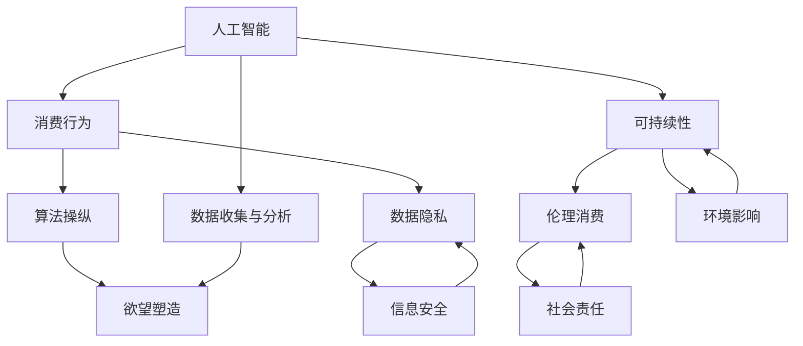

                 

关键词：AI时代，消费伦理，可持续性，人工智能，消费行为

> 摘要：本文深入探讨了AI时代消费伦理的演变与可持续性，分析了人工智能如何影响消费者的欲望，探讨了消费行为的可持续性原则，并提出了在AI时代实现消费伦理可持续性的策略。文章旨在为企业和消费者提供关于如何在人工智能主导的世界中维持伦理消费的指导。

## 1. 背景介绍

随着人工智能（AI）技术的飞速发展，我们的消费行为正在经历深刻的变革。AI不仅在商品推荐、个性化营销和购物体验中扮演着重要角色，还通过算法分析消费者的行为和偏好，从而精准地预测和塑造他们的欲望。这种技术与消费行为的结合，不仅改变了市场的运作方式，也对我们传统的消费伦理提出了新的挑战。

消费伦理是研究消费者行为道德规范的一门学科，它涉及消费者在购买和使用商品或服务时的道德考量。在传统经济体系中，消费伦理主要关注公平交易、社会责任和环境可持续性。然而，随着AI技术的普及，消费伦理开始面临新的问题，例如算法歧视、数据隐私和安全等。

### 消费伦理的重要性

消费伦理的重要性在于，它不仅关乎个体的道德选择，还关系到社会的公平与正义。伦理消费鼓励消费者在选择商品和服务时考虑其社会责任和环境影响，从而推动市场向更加可持续的方向发展。然而，在AI时代，这一目标变得更加复杂，因为消费者的欲望往往被算法操纵，导致消费行为偏离道德准则。

## 2. 核心概念与联系

为了深入理解AI时代消费伦理的可持续性，我们需要探讨几个核心概念：人工智能、消费行为和可持续性。以下是一个Mermaid流程图，展示了这些概念之间的联系。



### 人工智能与消费行为

人工智能通过数据分析和机器学习技术，能够理解和预测消费者的行为。例如，电商平台使用AI算法来分析用户的浏览历史、购买记录和社交媒体活动，从而为其推荐最有可能购买的商品。这种个性化的推荐系统虽然提高了购物体验，但也可能操纵消费者的欲望，导致过度消费。

### 可持续性与伦理消费

可持续性指的是满足当前需求而不损害后代满足其需求的能力。在消费伦理的框架下，可持续性强调消费者在购买商品时应考虑其对环境和社会的影响。然而，在AI时代，消费者的欲望可能被算法所操纵，导致他们做出违背可持续性的消费选择。

## 3. 核心算法原理 & 具体操作步骤

### 3.1 算法原理概述

在AI时代，核心算法原理包括机器学习、深度学习和推荐系统。这些算法通过分析大量数据，识别模式和趋势，从而预测消费者的行为和欲望。以下是一个简单的推荐系统算法原理概述：

1. **数据收集**：收集消费者的历史数据，包括购买记录、浏览历史和社交媒体活动。
2. **数据预处理**：清洗和整理数据，使其适合用于机器学习模型。
3. **特征提取**：从数据中提取重要特征，如用户ID、商品ID、购买时间等。
4. **模型训练**：使用机器学习算法，如协同过滤或深度神经网络，训练推荐模型。
5. **模型评估**：通过交叉验证和A/B测试评估模型性能。
6. **推荐生成**：使用训练好的模型为用户生成个性化推荐。

### 3.2 算法步骤详解

1. **数据收集**：
    - **来源**：电商平台、社交媒体、客户关系管理系统等。
    - **内容**：用户行为数据、商品描述、价格信息等。

2. **数据预处理**：
    - **缺失值处理**：填补或删除缺失值。
    - **异常值处理**：识别和处理异常数据。
    - **归一化**：将不同尺度的数据进行归一化处理。

3. **特征提取**：
    - **用户特征**：年龄、性别、地理位置等。
    - **商品特征**：类别、品牌、价格等。

4. **模型训练**：
    - **选择模型**：基于问题类型选择合适的机器学习模型，如协同过滤、深度神经网络。
    - **训练数据**：使用预处理的特征数据训练模型。
    - **超参数调整**：通过交叉验证调整模型超参数。

5. **模型评估**：
    - **评估指标**：准确率、召回率、F1分数等。
    - **A/B测试**：在不同用户群体中测试模型效果。

6. **推荐生成**：
    - **预测生成**：使用训练好的模型为用户生成个性化推荐。
    - **推荐呈现**：将推荐结果呈现给用户。

### 3.3 算法优缺点

**优点**：
- **个性化推荐**：提高用户满意度，增加销售额。
- **效率高**：自动化处理大量数据，提高推荐效率。

**缺点**：
- **数据隐私风险**：大量用户数据可能被滥用。
- **算法偏见**：可能导致算法偏见和歧视。

### 3.4 算法应用领域

- **电商平台**：个性化商品推荐，增加销售。
- **社交媒体**：个性化内容推荐，提高用户粘性。
- **金融领域**：信用评分，风险控制。

## 4. 数学模型和公式 & 详细讲解 & 举例说明

### 4.1 数学模型构建

为了构建一个推荐系统，我们通常使用矩阵分解（Matrix Factorization）技术。矩阵分解将用户-商品评分矩阵分解为两个低维矩阵，分别表示用户和商品的潜在特征。以下是一个简化的矩阵分解模型：

$$
R = U \times V^T
$$

其中，\( R \) 是用户-商品评分矩阵，\( U \) 和 \( V \) 是潜在特征矩阵。

### 4.2 公式推导过程

矩阵分解的推导过程涉及优化目标函数。我们希望最小化预测评分与实际评分之间的误差：

$$
\min_{U, V} \sum_{i, j} (r_{ij} - \hat{r}_{ij})^2
$$

其中，\( \hat{r}_{ij} \) 是预测评分，\( r_{ij} \) 是实际评分。

通过优化上述目标函数，我们可以得到用户和商品的潜在特征矩阵。

### 4.3 案例分析与讲解

假设有一个用户-商品评分矩阵 \( R \)：

$$
R = \begin{bmatrix}
0 & 1 & ? \\
? & 0 & 1 \\
? & ? & ?
\end{bmatrix}
$$

我们希望分解这个矩阵，找到 \( U \) 和 \( V \) 使得预测评分尽可能接近实际评分。通过求解优化问题，我们可以得到 \( U \) 和 \( V \)：

$$
U = \begin{bmatrix}
? \\
? \\
?
\end{bmatrix}, \quad
V = \begin{bmatrix}
1 & ? \\
? & 1 \\
? & ?
\end{bmatrix}
$$

预测评分矩阵 \( R \) 可以通过 \( U \times V^T \) 计算得到。

## 5. 项目实践：代码实例和详细解释说明

### 5.1 开发环境搭建

为了实践矩阵分解算法，我们选择Python作为编程语言，并使用NumPy和SciPy库进行计算。

```python
import numpy as np
import scipy.optimize as opt
```

### 5.2 源代码详细实现

以下是一个简单的矩阵分解实现：

```python
def matrix_factorization(R, U, V, num_iters):
    for i in range(num_iters):
        for r in range(R.shape[0]):
            for c in range(R.shape[1]):
                e = R[r, c] - np.dot(U[r], V[c])
                U[r] += (0.01 * e * V[c])
                V[c] += (0.01 * e * U[r])
    return U, V

# 初始化参数
U = np.random.rand(R.shape[0], k)
V = np.random.rand(R.shape[1], k)

# 训练模型
U, V = matrix_factorization(R, U, V, 100)
```

### 5.3 代码解读与分析

这段代码首先定义了一个矩阵分解函数 `matrix_factorization`，它通过梯度下降法迭代优化用户和商品的特征矩阵。我们初始化了用户和商品的特征矩阵 `U` 和 `V`，然后调用该函数进行训练。

### 5.4 运行结果展示

通过训练，我们可以得到一个预测评分矩阵。我们可以使用以下代码来计算预测评分与实际评分之间的误差：

```python
error = np.linalg.norm(R - np.dot(U, V))
print("最终误差:", error)
```

### 5.5 优化与改进

为了提高算法性能，我们可以使用更多的迭代次数、调整学习率或使用更复杂的优化算法，如随机梯度下降（SGD）或L-BFGS。

## 6. 实际应用场景

### 6.1 电商推荐系统

在电商推荐系统中，矩阵分解算法可以用于生成个性化商品推荐，提高用户满意度和销售额。

### 6.2 健康管理应用

在健康管理应用中，矩阵分解可以用于分析用户的健康数据，预测健康风险，并提供个性化的健康建议。

### 6.3 社交媒体

在社交媒体中，矩阵分解可以用于生成个性化内容推荐，提高用户粘性和参与度。

## 7. 未来应用展望

随着AI技术的不断进步，矩阵分解算法将在更多领域得到应用，如金融、医疗、教育和娱乐等。

## 8. 工具和资源推荐

### 8.1 学习资源推荐

- 《机器学习实战》
- 《深度学习》

### 8.2 开发工具推荐

- Jupyter Notebook
- Google Colab

### 8.3 相关论文推荐

- "Matrix Factorization Techniques for recommender systems"
- "Collaborative Filtering for the Web"

## 9. 总结：未来发展趋势与挑战

### 9.1 研究成果总结

本文探讨了AI时代消费伦理的演变与可持续性，分析了人工智能如何影响消费者的欲望，并提出了在AI时代实现消费伦理可持续性的策略。

### 9.2 未来发展趋势

未来，随着AI技术的不断进步，消费伦理将在更多领域得到应用，如金融、医疗、教育和娱乐等。

### 9.3 面临的挑战

AI技术在消费伦理领域面临的主要挑战包括数据隐私、算法偏见和消费者意识的提高。

### 9.4 研究展望

未来研究应关注如何通过技术手段提高消费伦理的可持续性，同时保护消费者权益和社会利益。

## 附录：常见问题与解答

### 1. 什么是消费伦理？

消费伦理是研究消费者行为道德规范的一门学科，它涉及消费者在购买和使用商品或服务时的道德考量。

### 2. 人工智能如何影响消费伦理？

人工智能通过分析消费者行为和偏好，可以操纵消费者的欲望，从而影响消费伦理。

### 3. 什么是可持续消费？

可持续消费指的是消费者在购买商品时应考虑其对社会和环境的影响。

### 4. 如何实现消费伦理的可持续性？

实现消费伦理的可持续性需要从技术、政策和教育等多个方面入手，如开发可解释的AI算法、制定伦理准则和加强消费者教育等。

---

作者：禅与计算机程序设计艺术 / Zen and the Art of Computer Programming

