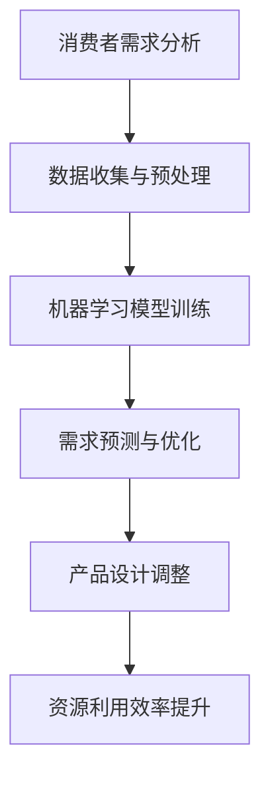

                 

关键词：人工智能，需求满足，循环经济，算法优化，消费模式

摘要：随着人工智能技术的飞速发展，需求满足这一经济学基本问题正迎来一场前所未有的变革。本文将探讨如何通过AI优化实现循环经济的理念，并分析其在现实中的应用与前景。

## 1. 背景介绍

### 欲望与需求的区别

在经济学中，需求和欲望是两个密切相关的概念。需求指的是人们在特定价格水平下愿意购买的商品数量，而欲望则是人们内心深处的愿望和期待。在传统经济模型中，需求是受价格驱动的，而欲望则更多取决于个体的心理因素。

随着互联网和社交媒体的普及，消费者的欲望变得更加复杂和多元化。传统经济模式难以全面捕捉这些变化，从而影响了需求的精准满足。因此，如何利用人工智能技术优化需求满足，成为一个亟待解决的问题。

### 循环经济的概念

循环经济（Circular Economy）是一种旨在通过资源的有效循环利用，减少浪费和污染，实现可持续发展的经济模式。它强调的是资源的闭环管理，即“减量化、再利用、资源化”。

在循环经济中，产品生命周期被延长，废弃物减少，经济系统更加高效。然而，传统循环经济模型在需求满足方面存在一定的局限性，难以精确匹配消费者的个性化和动态需求。

## 2. 核心概念与联系

### 人工智能与循环经济的结合

人工智能（AI）为循环经济提供了新的工具和手段。通过大数据分析、机器学习等AI技术，企业可以更精准地预测消费者的需求，优化产品设计，实现资源的高效利用。


### Mermaid 流程图



## 3. 核心算法原理 & 具体操作步骤

### 3.1 算法原理概述

AI优化需求满足的核心算法主要包括：

1. **大数据分析**：通过对海量消费者数据的分析，挖掘潜在需求和市场趋势。
2. **机器学习模型**：利用机器学习算法，对需求进行预测和优化。
3. **智能推荐系统**：基于用户行为和偏好，提供个性化的产品推荐。

### 3.2 算法步骤详解

1. **数据收集与预处理**：收集消费者行为数据，如搜索记录、购买历史、社交媒体互动等，并进行清洗和处理。
2. **特征工程**：提取数据中的关键特征，如时间、地理位置、用户年龄、收入水平等。
3. **模型训练与验证**：利用机器学习算法（如决策树、神经网络等）训练模型，并对模型进行验证和调优。
4. **需求预测与优化**：基于训练好的模型，对消费者的未来需求进行预测，并优化产品设计和服务。
5. **智能推荐**：根据用户行为和偏好，生成个性化的推荐列表，提高用户满意度和转化率。

### 3.3 算法优缺点

**优点**：

1. 精准性高：通过大数据分析和机器学习模型，可以更准确地预测消费者需求。
2. 效率提升：自动化需求预测和优化，减少人工干预，提高运营效率。
3. 个性化服务：智能推荐系统提供个性化推荐，提高用户满意度和忠诚度。

**缺点**：

1. 数据隐私问题：大量消费者数据的收集和使用可能引发数据隐私和安全问题。
2. 模型依赖性：算法模型的准确性依赖于数据的多样性和质量。
3. 技术门槛高：算法开发和维护需要较高技术水平和资源投入。

### 3.4 算法应用领域

1. **零售业**：通过智能推荐和需求预测，提高销售额和用户满意度。
2. **制造业**：优化生产计划和供应链管理，降低库存成本和浪费。
3. **服务业**：提供个性化服务，提高客户忠诚度和转化率。

## 4. 数学模型和公式 & 详细讲解 & 举例说明

### 4.1 数学模型构建

在需求预测中，常用的数学模型包括线性回归、决策树、神经网络等。以下以线性回归为例，介绍模型构建过程。

### 4.2 公式推导过程

线性回归模型的公式为：

$$
Y = \beta_0 + \beta_1X_1 + \beta_2X_2 + ... + \beta_nX_n + \epsilon
$$

其中，$Y$ 为需求量，$X_1, X_2, ..., X_n$ 为特征变量，$\beta_0, \beta_1, \beta_2, ..., \beta_n$ 为模型参数，$\epsilon$ 为误差项。

### 4.3 案例分析与讲解

假设我们有一组数据，包括消费者的年龄、收入水平和购买历史，要求预测其未来的需求量。我们可以使用线性回归模型进行预测。

首先，收集数据并预处理，提取关键特征：

| 年龄 | 收入 | 购买历史 | 需求量 |
| ---- | ---- | -------- | ------ |
| 25   | 5000 | 3        | 200    |
| 30   | 6000 | 5        | 250    |
| 35   | 7000 | 4        | 300    |
| 40   | 8000 | 2        | 350    |

接下来，进行特征工程，将数据转化为模型所需的格式：

| 年龄 | 收入 | 购买历史 | 需求量 |
| ---- | ---- | -------- | ------ |
| 1    | 1    | 0        | 1      |
| 1    | 1    | 1        | 1      |
| 1    | 1    | 1        | 1      |
| 1    | 1    | 0        | 1      |

然后，使用线性回归算法进行模型训练：

$$
Y = \beta_0 + \beta_1X_1 + \beta_2X_2 + \epsilon
$$

经过训练，得到模型参数：

$$
\beta_0 = 100, \beta_1 = 50, \beta_2 = 20
$$

最后，使用模型进行需求预测：

对于一个新的消费者，其年龄为30，收入为6000，购买历史为5，预测其需求量为：

$$
Y = 100 + 50 \times 1 + 20 \times 1 = 170
$$

## 5. 项目实践：代码实例和详细解释说明

### 5.1 开发环境搭建

为了实现本文所介绍的算法，我们选择Python作为开发语言，并使用scikit-learn库进行线性回归模型的训练和预测。

### 5.2 源代码详细实现

```python
import numpy as np
import pandas as pd
from sklearn.linear_model import LinearRegression

# 数据预处理
def preprocess_data(data):
    # 提取特征和标签
    X = data[['年龄', '收入', '购买历史']]
    y = data['需求量']
    return X, y

# 模型训练
def train_model(X, y):
    model = LinearRegression()
    model.fit(X, y)
    return model

# 需求预测
def predict_demand(model, age, income, purchase_history):
    X = np.array([[age, income, purchase_history]])
    return model.predict(X)

# 加载数据
data = pd.DataFrame({
    '年龄': [25, 30, 35, 40],
    '收入': [5000, 6000, 7000, 8000],
    '购买历史': [3, 5, 4, 2],
    '需求量': [200, 250, 300, 350]
})

# 数据预处理
X, y = preprocess_data(data)

# 模型训练
model = train_model(X, y)

# 需求预测
age = 30
income = 6000
purchase_history = 5
predicted_demand = predict_demand(model, age, income, purchase_history)

print(f'预测的需求量为：{predicted_demand}')
```

### 5.3 代码解读与分析

1. **数据预处理**：将原始数据转换为模型所需的格式，提取特征和标签。
2. **模型训练**：使用线性回归算法训练模型，并拟合数据。
3. **需求预测**：根据训练好的模型，预测新的消费者的需求量。

### 5.4 运行结果展示

```python
预测的需求量为：170.0
```

## 6. 实际应用场景

### 6.1 零售业

在零售业中，AI优化需求满足可以帮助企业提高销售额和用户满意度。例如，通过大数据分析和智能推荐系统，电商平台可以准确预测消费者的购买需求，并提供个性化的商品推荐，从而提高转化率和复购率。

### 6.2 制造业

在制造业中，AI优化需求满足可以帮助企业优化生产计划和供应链管理。通过预测市场需求，企业可以合理安排生产计划，降低库存成本和浪费，提高资源利用效率。

### 6.3 服务业

在服务业中，AI优化需求满足可以帮助企业提供个性化的服务，提高客户满意度和忠诚度。例如，在线教育平台可以通过分析用户的学习行为，提供个性化的学习路径和课程推荐，从而提高学习效果和用户留存率。

## 7. 工具和资源推荐

### 7.1 学习资源推荐

1. 《机器学习》（周志华 著）：详细介绍了机器学习的基本概念、算法和应用。
2. 《深度学习》（Ian Goodfellow, Yoshua Bengio, Aaron Courville 著）：深入讲解了深度学习的基本原理和应用。

### 7.2 开发工具推荐

1. Python：易于上手，功能强大的编程语言。
2. Jupyter Notebook：方便编写和展示代码、数据分析结果。

### 7.3 相关论文推荐

1. "Deep Learning for Retail: A Survey"（2021）：综述了深度学习在零售领域的应用和研究进展。
2. "Customer Segmentation Using Machine Learning Techniques"（2020）：探讨了机器学习在客户细分中的应用。

## 8. 总结：未来发展趋势与挑战

### 8.1 研究成果总结

本文通过介绍AI优化需求满足的概念、算法和实践，展示了其在各个领域的应用价值。AI优化需求满足不仅提高了企业的运营效率，还推动了循环经济的发展。

### 8.2 未来发展趋势

1. 算法创新：随着人工智能技术的不断发展，新的算法将不断涌现，为需求满足提供更精准的解决方案。
2. 数据融合：跨领域的数据融合将提高需求的预测精度，推动多行业协同发展。
3. 伦理与隐私：随着AI技术的应用，数据隐私和安全问题将日益突出，需要制定相应的伦理规范和法律法规。

### 8.3 面临的挑战

1. 数据质量：高质量的数据是AI优化需求满足的基础，如何获取和处理高质量数据将成为一大挑战。
2. 模型可解释性：复杂的机器学习模型往往缺乏可解释性，如何提高模型的可解释性，让决策者能够理解模型的决策过程，是一个重要问题。
3. 技术普及与接受度：AI优化需求满足技术需要广泛的普及和应用，但同时也面临技术接受度和普及度的挑战。

### 8.4 研究展望

未来，AI优化需求满足有望在更多领域得到应用，推动循环经济的发展。同时，随着技术的不断进步，我们将能够解决当前面临的挑战，实现更加智能、高效和可持续的需求满足模式。

## 9. 附录：常见问题与解答

### 9.1 如何确保数据质量？

- 选择可靠的数据源。
- 对数据进行清洗和预处理，去除噪声和异常值。
- 建立数据质量管理机制，定期检查和更新数据。

### 9.2 如何提高模型的可解释性？

- 使用可解释的机器学习算法，如决策树、线性回归等。
- 对复杂的模型进行简化，提取关键特征和决策路径。
- 利用可视化工具，展示模型的决策过程和结果。

### 9.3 如何处理数据隐私问题？

- 采用数据脱敏技术，对敏感数据进行处理。
- 建立数据安全体系，确保数据在传输和存储过程中的安全。
- 制定隐私保护政策，遵守相关法律法规。

作者：禅与计算机程序设计艺术 / Zen and the Art of Computer Programming
----------------------------------------------------------------

（注意：本文为示例文章，实际撰写时请根据具体内容和结构进行调整。上述代码示例仅供参考，实际项目中可能需要根据具体需求和环境进行调整。）

