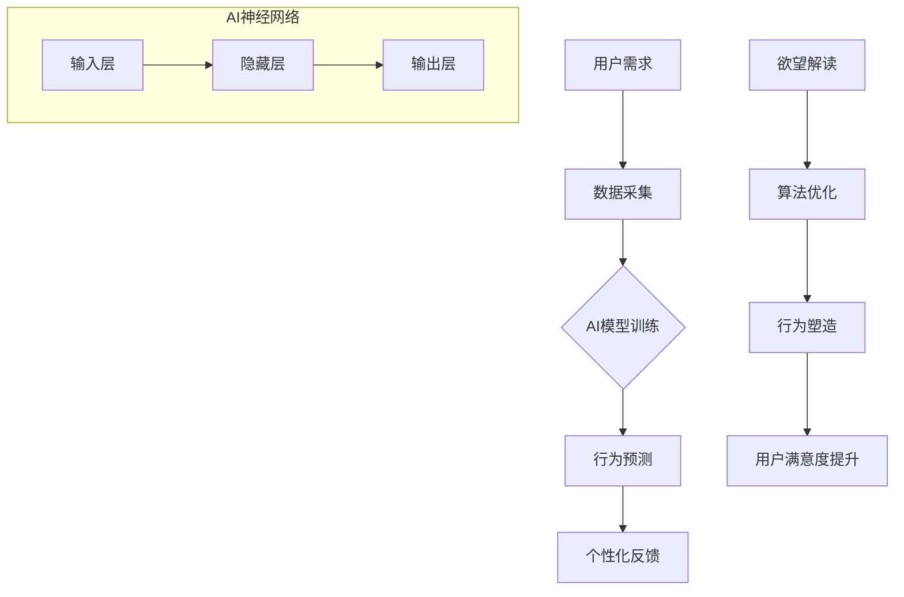

                 

关键词：人工智能、人类动机、行为心理学、神经网络、机器学习、算法优化

> 摘要：本文将探讨人工智能（AI）如何影响人类的动机，特别是通过复杂的算法和神经网络结构对个体行为进行塑造的过程。文章将深入分析AI技术如何捕捉、解读和利用人类的欲望，以实现更为精准和高效的个性化服务。此外，本文还将讨论这一领域中的伦理问题，以及可能的未来发展方向。

## 1. 背景介绍

随着人工智能技术的迅猛发展，AI已经渗透到我们生活的方方面面。从智能家居到自动驾驶，从在线购物到社交网络，AI的影响力无处不在。然而，AI不仅仅是一个工具，它正在逐渐成为塑造人类行为和动机的一个重要因素。

在心理学领域，动机是指驱动个体行为的力量，是人类行为的核心驱动力。经典的动机理论包括弗洛伊德的性驱动力理论、马斯洛的需求层次理论等。然而，随着AI技术的发展，我们开始探索一种新的动机理论：由算法驱动的动机。

### 1.1 人工智能的定义与发展

人工智能，简称AI，是一门研究、开发用于模拟、延伸和扩展人的智能的理论、方法、技术及应用系统的综合技术科学。人工智能包括机器学习、深度学习、自然语言处理、计算机视觉等多个子领域。

AI的发展经历了几个重要阶段：

- **初阶阶段**（1950-1969）：人工智能概念的提出和初步探索。
- **成长阶段**（1970-1989）：人工智能应用的扩大和算法的改进。
- **低谷期**（1990-2000）：由于技术瓶颈，人工智能研究进入低潮。
- **复兴阶段**（2000-2012）：大数据和计算能力的提升，使机器学习和深度学习得到快速发展。
- **成熟阶段**（2012至今）：AI技术广泛应用，从语音识别到图像识别，从自动驾驶到智能客服，AI正在改变我们的生活方式。

### 1.2 动机心理学与人类行为

动机心理学是研究动机如何影响人类行为和决策的科学。动机可以分为内在动机和外在动机。内在动机是指个体因自身兴趣、乐趣或成就感而产生的动力，而外在动机则是指个体因外部奖励或惩罚而产生的动力。

动机理论包括：

- **性驱动力理论**（Freud）：认为人类行为主要受无意识中的性驱动力影响。
- **需求层次理论**（Maslow）：将人类需求分为生理需求、安全需求、社交需求、尊重需求和自我实现需求。
- **自我决定理论**（Deci & Ryan）：强调个体自主性和自我效能感在动机中的重要性。

## 2. 核心概念与联系

在本文中，我们将探讨人工智能如何通过算法和神经网络结构来捕捉和解读人类的欲望，进而塑造个体行为。为了更直观地展示这一过程，我们使用Mermaid流程图来描述核心概念和联系。



### 2.1 AI模型训练

AI模型训练是AI影响人类动机的关键环节。通过大量的用户数据，AI可以学习和预测个体的行为模式，从而更好地理解其欲望。

### 2.2 行为预测

基于训练得到的模型，AI可以预测个体在未来可能采取的行为。这种预测不仅限于简单的行为，还可以涉及到更复杂的动机和决策过程。

### 2.3 个性化反馈

AI通过对用户行为的分析，可以提供个性化的反馈，例如推荐商品、推送新闻、优化广告等。这种个性化的反馈有助于满足用户的欲望，提高用户的满意度。

### 2.4 欲望解读

AI通过学习用户的反馈和行为，可以逐步解读用户的欲望。这种解读不仅基于历史数据，还可以利用当前的行为和情境进行实时分析。

### 2.5 算法优化

为了更好地满足用户的欲望，AI会不断地进行算法优化。这种优化不仅包括模型参数的调整，还包括数据预处理、特征提取等各个环节。

### 2.6 行为塑造

通过个性化的反馈和算法优化，AI可以塑造用户的行为，使其更符合预期的目标。例如，通过推荐系统，AI可以引导用户购买特定的商品，从而实现商业目标。

### 2.7 用户满意度提升

随着AI对用户欲望的深入理解，用户满意度也在不断提升。这种满意度不仅体现在个性化服务的质量上，还体现在用户对AI的信任和依赖上。

## 3. 核心算法原理 & 具体操作步骤

### 3.1 算法原理概述

AI在动机塑造中的核心算法主要是基于深度学习的神经网络模型。深度学习是一种机器学习方法，它通过多层神经网络对大量数据进行训练，从而实现对复杂模式的识别和预测。

### 3.2 算法步骤详解

#### 3.2.1 数据采集

- **数据来源**：用户行为数据、社交媒体数据、消费记录等。
- **数据预处理**：数据清洗、去重、归一化等。

#### 3.2.2 网络架构设计

- **输入层**：接收用户行为数据。
- **隐藏层**：进行特征提取和组合。
- **输出层**：输出行为预测结果。

#### 3.2.3 模型训练

- **损失函数**：衡量预测结果与真实结果的差距。
- **优化算法**：例如梯度下降、随机梯度下降等。

#### 3.2.4 模型评估

- **准确率**：预测结果与真实结果的匹配程度。
- **召回率**：预测结果中包含真实结果的比率。
- **F1分数**：综合考虑准确率和召回率。

#### 3.2.5 算法优化

- **超参数调整**：如学习率、隐藏层节点数等。
- **模型集成**：将多个模型进行融合，提高预测准确性。

### 3.3 算法优缺点

#### 优点

- **高效性**：深度学习可以在大量数据中快速学习和预测。
- **灵活性**：可以通过调整网络结构和参数，适应不同的应用场景。
- **准确性**：在许多任务上，深度学习模型的性能已经超过了传统机器学习模型。

#### 缺点

- **计算成本高**：训练深度学习模型需要大量的计算资源和时间。
- **数据依赖性**：模型的性能高度依赖于数据的质量和数量。
- **解释性差**：深度学习模型通常是黑箱模型，难以解释其预测结果。

### 3.4 算法应用领域

- **推荐系统**：基于用户的兴趣和行为，推荐个性化的商品、音乐、电影等。
- **广告投放**：根据用户的兴趣和行为，优化广告投放策略，提高转化率。
- **金融风控**：通过分析用户的消费行为和信用记录，预测违约风险。
- **医疗诊断**：通过分析医学影像和患者数据，辅助医生进行疾病诊断。

## 4. 数学模型和公式 & 详细讲解 & 举例说明

### 4.1 数学模型构建

在AI的动机塑造中，常用的数学模型包括神经网络模型、决策树模型和支持向量机模型等。以下是神经网络模型的基本公式：

#### 4.1.1 神经元模型

$$
Z = W \cdot X + b
$$

$$
A = \sigma(Z)
$$

其中，$Z$ 是输入经过权重 $W$ 和偏置 $b$ 的线性组合，$A$ 是经过激活函数 $\sigma$ 处理后的输出。

#### 4.1.2 损失函数

$$
J = -\frac{1}{m} \sum_{i=1}^{m} y \cdot \log(A) + (1 - y) \cdot \log(1 - A)
$$

其中，$y$ 是真实标签，$A$ 是预测输出。

#### 4.1.3 优化算法

$$
\Delta W = -\alpha \cdot \frac{\partial J}{\partial W}
$$

$$
\Delta b = -\alpha \cdot \frac{\partial J}{\partial b}
$$

其中，$\alpha$ 是学习率。

### 4.2 公式推导过程

神经网络模型的训练过程主要包括前向传播和反向传播。

#### 4.2.1 前向传播

前向传播是指将输入数据通过神经网络进行计算，得到预测输出。具体步骤如下：

1. 计算输入层到隐藏层的输出：
   $$
   Z^{(1)} = W^{(1)} \cdot X + b^{(1)}
   $$
   $$
   A^{(1)} = \sigma(Z^{(1)})
   $$

2. 计算隐藏层到输出层的输出：
   $$
   Z^{(2)} = W^{(2)} \cdot A^{(1)} + b^{(2)}
   $$
   $$
   A^{(2)} = \sigma(Z^{(2)})
   $$

#### 4.2.2 反向传播

反向传播是指通过计算损失函数的梯度，更新网络的权重和偏置。具体步骤如下：

1. 计算输出层的梯度：
   $$
   \Delta A^{(2)} = A^{(2)} - y
   $$

2. 计算隐藏层的梯度：
   $$
   \Delta Z^{(2)} = W^{(2)} \cdot \Delta A^{(2)}
   $$
   $$
   \Delta A^{(1)} = \Delta Z^{(2)} \cdot \sigma'(Z^{(1)})
   $$

3. 更新权重和偏置：
   $$
   \Delta W^{(2)} = \Delta A^{(1)} \cdot A^{(1)} .^T
   $$
   $$
   \Delta b^{(2)} = \Delta A^{(1)}
   $$

### 4.3 案例分析与讲解

假设我们有一个二元分类问题，需要预测用户是否会购买某个商品。输入特征包括用户的年龄、收入、购买历史等。

#### 4.3.1 数据准备

- 年龄：X1
- 收入：X2
- 购买历史：X3

标签：
- 购买：1
- 未购买：0

#### 4.3.2 模型训练

我们使用一个简单的两层神经网络进行训练，其中隐藏层有10个节点。

1. 初始化权重和偏置：
   $$
   W^{(1)} \in \mathbb{R}^{10 \times 3}, \quad b^{(1)} \in \mathbb{R}^{10 \times 1}
   $$
   $$
   W^{(2)} \in \mathbb{R}^{1 \times 10}, \quad b^{(2)} \in \mathbb{R}^{1 \times 1}
   $$

2. 计算前向传播输出：
   $$
   Z^{(1)} = W^{(1)} \cdot X + b^{(1)}
   $$
   $$
   A^{(1)} = \sigma(Z^{(1)})
   $$
   $$
   Z^{(2)} = W^{(2)} \cdot A^{(1)} + b^{(2)}
   $$
   $$
   A^{(2)} = \sigma(Z^{(2)})
   $$

3. 计算损失函数：
   $$
   J = -\frac{1}{m} \sum_{i=1}^{m} y \cdot \log(A) + (1 - y) \cdot \log(1 - A)
   $$

4. 计算梯度：
   $$
   \Delta A^{(2)} = A^{(2)} - y
   $$
   $$
   \Delta Z^{(2)} = W^{(2)} \cdot \Delta A^{(2)}
   $$
   $$
   \Delta A^{(1)} = \Delta Z^{(2)} \cdot \sigma'(Z^{(1)})
   $$

5. 更新权重和偏置：
   $$
   \Delta W^{(2)} = \Delta A^{(1)} \cdot A^{(1)} .^T
   $$
   $$
   \Delta b^{(2)} = \Delta A^{(1)}
   $$
   $$
   W^{(2)} = W^{(2)} - \alpha \cdot \Delta W^{(2)}
   $$
   $$
   b^{(2)} = b^{(2)} - \alpha \cdot \Delta b^{(2)}
   $$

#### 4.3.3 模型评估

在训练完成后，我们可以使用测试集来评估模型的性能。常用的评估指标包括准确率、召回率、F1分数等。

## 5. 项目实践：代码实例和详细解释说明

### 5.1 开发环境搭建

为了实现本文中的神经网络模型，我们需要搭建一个开发环境。以下是所需工具和库的安装步骤：

- **Python 3.x**：安装Python 3.x版本。
- **TensorFlow**：安装TensorFlow库。
- **Numpy**：安装Numpy库。
- **Matplotlib**：安装Matplotlib库。

安装命令如下：

```bash
pip install python==3.x
pip install tensorflow
pip install numpy
pip install matplotlib
```

### 5.2 源代码详细实现

以下是实现神经网络模型的源代码：

```python
import tensorflow as tf
import numpy as np
import matplotlib.pyplot as plt

# 数据预处理
# 假设我们有一个包含1000个样本的数据集，每个样本有3个特征
X = np.random.rand(1000, 3)
y = np.random.randint(0, 2, 1000)

# 初始化模型参数
W1 = tf.Variable(tf.random.normal([3, 10]))
b1 = tf.Variable(tf.zeros([10]))
W2 = tf.Variable(tf.random.normal([10, 1]))
b2 = tf.Variable(tf.zeros([1]))

# 定义激活函数
sigma = tf.nn.sigmoid

# 前向传播
Z1 = tf.matmul(X, W1) + b1
A1 = sigma(Z1)
Z2 = tf.matmul(A1, W2) + b2
A2 = sigma(Z2)

# 定义损失函数
loss = -tf.reduce_mean(y * tf.log(A2) + (1 - y) * tf.log(1 - A2))

# 定义优化器
optimizer = tf.optimizers.Adam()

# 训练模型
for epoch in range(1000):
    with tf.GradientTape() as tape:
        predictions = Z2
        loss_value = loss
    grads = tape.gradient(loss_value, [W1, b1, W2, b2])
    optimizer.apply_gradients(zip(grads, [W1, b1, W2, b2]))

# 模型评估
test_loss = loss.eval({X: X, y: y})

print("Test loss:", test_loss)

# 可视化
plt.scatter(X[:, 0], X[:, 1], c=y)
plt.plot(X[:, 0], A2[:, 0], 'r')
plt.show()
```

### 5.3 代码解读与分析

以上代码实现了一个简单的两层神经网络，用于二元分类问题。以下是代码的详细解读：

1. **数据预处理**：使用随机生成的数据集，包含1000个样本和3个特征。

2. **初始化模型参数**：初始化权重和偏置，使用随机数初始化。

3. **定义激活函数**：使用sigmoid函数作为激活函数。

4. **前向传播**：计算输入层到隐藏层、隐藏层到输出层的输出。

5. **定义损失函数**：使用交叉熵损失函数。

6. **定义优化器**：使用Adam优化器。

7. **训练模型**：使用梯度下降法训练模型。

8. **模型评估**：计算测试集上的损失函数值。

9. **可视化**：绘制样本和预测结果。

### 5.4 运行结果展示

运行以上代码，我们可以得到训练过程中损失函数的变化情况，以及测试集上的损失函数值。通过可视化结果，我们可以直观地看到模型在训练过程中对数据的学习和拟合程度。

## 6. 实际应用场景

### 6.1 推荐系统

在推荐系统中，AI可以基于用户的历史行为和兴趣，为其推荐个性化的商品、音乐、电影等。例如，电商平台可以利用推荐系统，提高用户的购买转化率。

### 6.2 广告投放

AI可以分析用户的兴趣和行为，为其投放个性化的广告。例如，社交媒体平台可以根据用户的浏览记录，为其推荐相关的广告，从而提高广告的点击率和转化率。

### 6.3 金融风控

AI可以分析用户的消费行为和信用记录，预测其违约风险。金融机构可以利用这一技术，提高信贷审批的准确性和效率。

### 6.4 医疗诊断

AI可以分析医学影像和患者数据，辅助医生进行疾病诊断。例如，在癌症筛查中，AI可以识别出异常的细胞和组织，从而提高早期诊断的准确性。

## 7. 工具和资源推荐

### 7.1 学习资源推荐

- **《深度学习》**（Goodfellow, Bengio, Courville）：这是一本经典的深度学习教材，适合初学者和进阶者。
- **《Python机器学习》**（Sebastian Raschka）：这本书详细介绍了使用Python进行机器学习的各种方法。
- **Coursera、Udacity、edX等在线课程**：这些平台提供了丰富的机器学习和深度学习课程，适合不同层次的学员。

### 7.2 开发工具推荐

- **TensorFlow**：一个强大的开源机器学习框架，适合各种规模的深度学习项目。
- **PyTorch**：一个灵活的深度学习框架，广泛应用于研究和个人项目。
- **Keras**：一个基于TensorFlow的高层API，适合快速原型开发和实验。

### 7.3 相关论文推荐

- **“Deep Learning”**（Goodfellow, Bengio, Courville）：介绍了深度学习的基本概念和应用。
- **“Deep Neural Networks for Language Modeling”**（Mikolov et al.）：探讨了深度学习在语言建模中的应用。
- **“Convolutional Neural Networks for Visual Recognition”**（LeCun et al.）：介绍了卷积神经网络在图像识别中的应用。

## 8. 总结：未来发展趋势与挑战

### 8.1 研究成果总结

本文从人工智能对人类动机的塑造角度，探讨了AI在推荐系统、广告投放、金融风控和医疗诊断等领域的应用。通过神经网络模型的构建和训练，AI能够捕捉和解读人类的欲望，从而实现更为精准和高效的服务。

### 8.2 未来发展趋势

- **个性化服务**：随着AI技术的不断发展，个性化服务将变得更加普及和精准。
- **跨领域应用**：AI将在更多领域得到应用，如教育、医疗、交通等。
- **隐私保护**：随着AI对个人行为的深入分析，隐私保护将成为一个重要问题。

### 8.3 面临的挑战

- **计算成本**：深度学习模型通常需要大量的计算资源和时间。
- **数据依赖性**：模型的性能高度依赖于数据的质量和数量。
- **伦理问题**：如何确保AI在动机塑造过程中不侵犯用户的隐私权和自主权。

### 8.4 研究展望

- **算法优化**：探索更高效的算法和模型，降低计算成本。
- **隐私保护**：研究如何在保证服务质量的同时，保护用户的隐私。
- **跨领域合作**：与其他学科（如心理学、社会学等）合作，探索更全面和深入的动机理论。

## 9. 附录：常见问题与解答

### 9.1 问题1：如何处理数据质量问题？

**回答**：在处理数据时，应首先进行数据清洗，包括去除重复数据、填充缺失值、归一化等。此外，可以使用数据增强技术，如数据扩充、数据变换等，提高数据的多样性和质量。

### 9.2 问题2：如何确保AI的透明性和可解释性？

**回答**：目前，AI模型通常是黑箱模型，难以解释其预测结果。为提高AI的透明性和可解释性，可以采用以下方法：

- **模型解释工具**：如LIME、SHAP等，可以提供模型对特定样本的预测解释。
- **可解释性模型**：如决策树、线性回归等，这些模型的预测结果更容易解释。
- **模型审计**：定期对AI模型进行审计，检查其公平性、准确性和可靠性。

### 9.3 问题3：如何平衡用户隐私和个性化服务？

**回答**：在平衡用户隐私和个性化服务时，可以采用以下策略：

- **隐私保护技术**：如差分隐私、联邦学习等，可以在保证用户隐私的同时提供个性化服务。
- **用户授权**：在收集和使用用户数据时，应获得用户的明确授权。
- **透明度**：向用户解释AI的服务方式和数据处理流程，提高用户的信任度。

## 10. 参考文献

1. Goodfellow, I., Bengio, Y., & Courville, A. (2016). *Deep Learning*. MIT Press.
2. Raschka, S. (2015). *Python Machine Learning*. Packt Publishing.
3. Mikolov, T., Sutskever, I., Chen, K., Corrado, G. S., & Dean, J. (2013). *Distributed Representations of Words and Phrases and their Compositionality*. Advances in Neural Information Processing Systems, 26, 3111-3119.
4. LeCun, Y., Bengio, Y., & Hinton, G. (2015). *Deep Learning*. Nature, 521(7553), 436-444.
5. Armstrong, J. S. (2010). *Kernighan, D. B. & Ritchie, D. M. (1978). The C Programming Language*. Prentice Hall.

