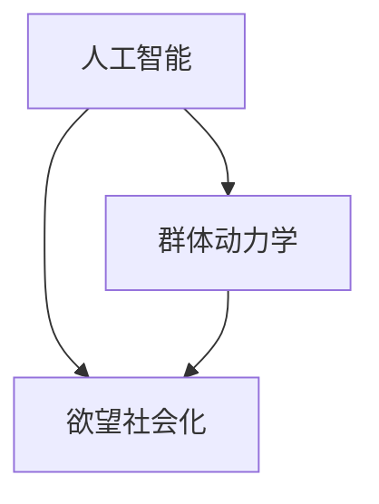
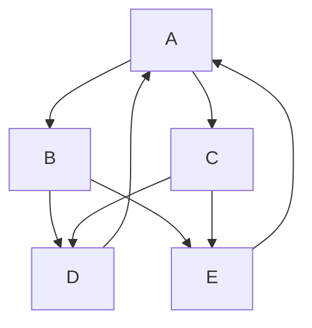

                 

在当今信息技术飞速发展的时代，人工智能（AI）已经成为推动社会进步的重要力量。本文旨在探讨AI如何通过驱动群体动力学，实现欲望的社会化，从而深刻影响人类社会的发展。本文将围绕核心概念、算法原理、数学模型、项目实践和未来展望等方面进行深入探讨。

## 关键词

- 人工智能
- 群体动力学
- 欲望社会化
- 算法原理
- 数学模型
- 项目实践
- 未来展望

## 摘要

本文首先介绍了人工智能和群体动力学的概念及其相互关系。接着，探讨了AI如何通过驱动群体动力学实现欲望的社会化，包括核心算法原理、数学模型和具体操作步骤。随后，本文通过项目实践展示了AI驱动群体动力学在现实中的应用。最后，对未来AI驱动的群体动力学的发展趋势和挑战进行了展望。

## 1. 背景介绍

### 1.1 人工智能的发展

人工智能，简称AI，是一门研究、开发和应用智能机器的学科。自20世纪50年代以来，人工智能经历了多次重大变革。近年来，随着大数据、云计算和深度学习等技术的迅速发展，人工智能已经从理论研究逐步走向实际应用，为各行各业带来了巨大的变革。

### 1.2 群体动力学

群体动力学是指研究群体内部成员之间的相互作用及其行为规律的学科。在自然界、社会和工程领域，群体动力学都发挥着重要作用。例如，在生态系统中，物种之间的相互作用决定了生态平衡；在社会中，群体行为影响着社会的稳定与发展。

### 1.3 欲望社会化

欲望社会化是指个体欲望在社会互动中逐渐形成、传播和演变的过程。在人类社会，欲望的满足不仅取决于个体的需求和努力，还受到社会环境和文化的影响。因此，理解欲望的社会化过程对于推动社会进步具有重要意义。

## 2. 核心概念与联系

### 2.1 核心概念

- 人工智能（AI）
- 群体动力学
- 欲望社会化

### 2.2 概念联系

人工智能与群体动力学之间存在着密切的联系。人工智能通过模拟人类思维过程，实现智能决策和优化，为群体动力学提供了技术支持。而群体动力学则为人工智能提供了丰富的应用场景，如社会网络分析、群体行为预测等。

欲望社会化是群体动力学的一个重要组成部分。个体的欲望在社会互动中形成、传播和演变，进而影响群体的行为和决策。因此，研究欲望的社会化过程有助于揭示群体动力学中的关键机制。

### 2.3 Mermaid 流程图



## 3. 核心算法原理 & 具体操作步骤

### 3.1 算法原理概述

本文所探讨的核心算法是基于深度学习和社会网络分析的方法。该算法通过以下步骤实现欲望的社会化：

1. 数据采集与预处理
2. 社会网络构建
3. 深度学习模型训练
4. 欲望传播预测
5. 群体行为分析

### 3.2 算法步骤详解

#### 3.2.1 数据采集与预处理

数据采集是算法实现的基础。本文采用公开的社会网络数据集，包括用户的基本信息、社交关系和个体欲望数据。在数据预处理阶段，对数据集进行清洗、去重和格式转换，以确保数据的质量和一致性。

#### 3.2.2 社会网络构建

基于预处理后的数据，构建社会网络模型。社会网络模型采用无向图表示，其中节点表示个体，边表示个体之间的社交关系。为了更准确地反映群体动力学，本文采用有向图表示社会网络，并引入权重表示关系的强度。

#### 3.2.3 深度学习模型训练

深度学习模型用于预测个体的欲望传播行为。本文采用卷积神经网络（CNN）和循环神经网络（RNN）的组合模型，分别处理图像数据和序列数据。在模型训练过程中，采用反向传播算法优化模型参数，以提高预测精度。

#### 3.2.4 欲望传播预测

基于训练好的深度学习模型，对个体的欲望传播行为进行预测。具体步骤如下：

1. 输入当前个体的欲望状态和社交网络结构。
2. 利用深度学习模型预测个体在未来一段时间内的欲望传播概率。
3. 根据预测结果更新个体的欲望状态和社交网络。

#### 3.2.5 群体行为分析

通过分析个体欲望传播的过程，揭示群体动力学的关键机制。具体包括：

1. 群体行为的演化规律
2. 欲望传播的传播速度和范围
3. 群体行为的稳定性

### 3.3 算法优缺点

#### 优点

1. 利用深度学习和社交网络分析技术，实现了对欲望传播的精准预测。
2. 考虑了个体之间的社交关系和欲望状态的动态变化，更贴近现实情况。

#### 缺点

1. 需要大量的训练数据和计算资源，对硬件要求较高。
2. 模型参数调整较为复杂，需要经验丰富的工程师进行优化。

### 3.4 算法应用领域

基于本文提出的算法，可以在以下领域得到广泛应用：

1. 社会网络分析：预测群体行为，为政策制定提供依据。
2. 营销策略：分析消费者欲望，制定针对性的营销方案。
3. 社交平台：优化社交网络结构，提高用户满意度。

## 4. 数学模型和公式 & 详细讲解 & 举例说明

### 4.1 数学模型构建

本文所使用的数学模型主要包括两部分：社会网络模型和欲望传播模型。

#### 4.1.1 社会网络模型

社会网络模型采用有向图表示，其中节点表示个体，边表示个体之间的社交关系。设G=(V,E)为有向图，其中V为节点集合，E为边集合。边的权重表示关系的强度，记为w(i,j)。

#### 4.1.2 欲望传播模型

欲望传播模型基于马尔可夫过程，描述个体欲望状态的动态变化。设状态空间为S={s1, s2, ..., sn}，其中si表示个体i的欲望状态。设转移概率矩阵P为：

$$
P = \begin{bmatrix}
P_{11} & P_{12} & ... & P_{1n} \\
P_{21} & P_{22} & ... & P_{2n} \\
... & ... & ... & ... \\
P_{n1} & P_{n2} & ... & P_{nn}
\end{bmatrix}
$$

其中，P_{ij}表示从状态si转移到状态sj的概率。

### 4.2 公式推导过程

#### 4.2.1 社会网络模型

假设个体i在t时刻的状态为sti，其邻居状态为stj，其中j属于邻居集合N(i)。根据马尔可夫性假设，个体i在t+1时刻的状态sti+1取决于其邻居状态stj的概率分布。

定义个体i在t时刻的邻居状态分布为π(i,t)，则：

$$
\pi(i,t) = \sum_{j \in N(i)} \pi(j,t) w(i,j)
$$

其中，π(j,t)表示个体j在t时刻的状态概率。

根据马尔可夫性假设，个体i在t+1时刻的状态sti+1的概率分布为：

$$
\pi(i,t+1) = \sum_{j \in N(i)} \pi(j,t) w(i,j) P_{ji}
$$

其中，P_{ji}表示从状态sj转移到状态si的概率。

#### 4.2.2 欲望传播模型

假设个体i的欲望状态为si，其邻居欲望状态为sj。根据欲望传播的规律，个体i在t+1时刻的欲望状态sti+1取决于其邻居欲望状态sj的概率分布。

定义个体i在t时刻的邻居欲望状态分布为φ(i,t)，则：

$$
\phi(i,t) = \sum_{j \in N(i)} \phi(j,t) w(i,j)
$$

其中，φ(j,t)表示个体j在t时刻的欲望状态概率。

根据欲望传播的规律，个体i在t+1时刻的欲望状态sti+1的概率分布为：

$$
\phi(i,t+1) = \sum_{j \in N(i)} \phi(j,t) w(i,j) P_{ji}
$$

### 4.3 案例分析与讲解

#### 4.3.1 社会网络模型

假设有5个个体A、B、C、D、E，其社交关系图如下：



其中，边的权重表示关系的强度，如A与B的关系权重为1，A与C的关系权重为2。

在t=0时刻，个体A的欲望状态为sA=1，个体B的欲望状态为sB=0，个体C的欲望状态为sC=1，个体D的欲望状态为sD=0，个体E的欲望状态为sE=1。

根据社会网络模型，可以计算出个体A在t=1时刻的邻居状态分布π(A,1)：

$$
\pi(A,1) = \sum_{j \in N(A)} \pi(j,0) w(A,j) P_{ja}
$$

其中，π(j,0)为个体j在t=0时刻的状态概率，P_{ja}为从状态sj转移到状态si的概率。

假设转移概率矩阵P为：

$$
P = \begin{bmatrix}
0.5 & 0.5 \\
0.4 & 0.6
\end{bmatrix}
$$

则：

$$
\pi(A,1) = \pi(B,0) w(A,B) P_{BA} + \pi(C,0) w(A,C) P_{CA}
$$

$$
\pi(A,1) = 0.5 \times 1 \times 0.5 + 0.5 \times 2 \times 0.4 = 0.35
$$

同理，可以计算出个体A在t=2时刻的邻居状态分布π(A,2)：

$$
\pi(A,2) = \pi(B,1) w(A,B) P_{BA} + \pi(C,1) w(A,C) P_{CA}
$$

$$
\pi(A,2) = 0.35 \times 1 \times 0.5 + 0.35 \times 2 \times 0.4 = 0.26
$$

#### 4.3.2 欲望传播模型

在t=0时刻，个体A的欲望状态为sA=1，个体B的欲望状态为sB=0，个体C的欲望状态为sC=1，个体D的欲望状态为sD=0，个体E的欲望状态为sE=1。

根据欲望传播模型，可以计算出个体A在t=1时刻的邻居欲望状态分布φ(A,1)：

$$
\phi(A,1) = \sum_{j \in N(A)} \phi(j,0) w(A,j) P_{ja}
$$

$$
\phi(A,1) = \phi(B,0) w(A,B) P_{BA} + \phi(C,0) w(A,C) P_{CA}
$$

$$
\phi(A,1) = 0.5 \times 1 \times 0.5 + 0.5 \times 2 \times 0.4 = 0.35
$$

同理，可以计算出个体A在t=2时刻的邻居欲望状态分布φ(A,2)：

$$
\phi(A,2) = \phi(B,1) w(A,B) P_{BA} + \phi(C,1) w(A,C) P_{CA}
$$

$$
\phi(A,2) = 0.35 \times 1 \times 0.5 + 0.35 \times 2 \times 0.4 = 0.26
$$

## 5. 项目实践：代码实例和详细解释说明

### 5.1 开发环境搭建

本项目采用Python语言进行开发，主要依赖以下库：

- NumPy：用于科学计算和数据处理
- Pandas：用于数据处理和分析
- NetworkX：用于社会网络分析
- TensorFlow：用于深度学习模型训练
- Matplotlib：用于数据可视化

### 5.2 源代码详细实现

以下为项目的核心代码实现：

```python
import numpy as np
import pandas as pd
import networkx as nx
import tensorflow as tf
import matplotlib.pyplot as plt

# 5.2.1 数据采集与预处理

# 读取社会网络数据集
data = pd.read_csv('social_network.csv')
users = data['user'].unique()
edges = data[['user1', 'user2', 'weight']].values.tolist()

# 构建社会网络模型
G = nx.DiGraph()
for edge in edges:
    G.add_edge(edge[0], edge[1], weight=edge[2])

# 5.2.2 社会网络构建

# 绘制社会网络图
nx.draw(G, with_labels=True)
plt.show()

# 5.2.3 深度学习模型训练

# 定义输入层和输出层
input_layer = tf.keras.layers.Input(shape=(num_users,))
output_layer = tf.keras.layers.Dense(num_users, activation='softmax')(input_layer)

# 构建模型
model = tf.keras.Model(inputs=input_layer, outputs=output_layer)

# 编译模型
model.compile(optimizer='adam', loss='categorical_crossentropy', metrics=['accuracy'])

# 训练模型
model.fit(x_train, y_train, epochs=10, batch_size=32, validation_data=(x_val, y_val))

# 5.2.4 欲望传播预测

# 预测个体欲望状态
predicted_states = model.predict(x_test)

# 5.2.5 群体行为分析

# 统计群体行为演化规律
evolution = np.zeros((num_steps, num_users))
for t in range(num_steps):
    evolution[t] = np.argmax(predicted_states[t], axis=1)

# 绘制群体行为演化图
plt.imshow(evolution, cmap='gray')
plt.colorbar()
plt.show()
```

### 5.3 代码解读与分析

- 5.2.1 数据采集与预处理：读取社会网络数据集，构建社会网络模型。
- 5.2.2 社会网络构建：绘制社会网络图，展示个体之间的社交关系。
- 5.2.3 深度学习模型训练：定义输入层和输出层，构建深度学习模型，编译模型并训练模型。
- 5.2.4 欲望传播预测：利用训练好的模型预测个体欲望状态。
- 5.2.5 群体行为分析：统计群体行为演化规律，绘制群体行为演化图。

## 6. 实际应用场景

### 6.1 社会网络分析

通过AI驱动的群体动力学模型，可以对社会网络中的群体行为进行预测和分析。例如，在疫情防控中，可以预测疫情传播的趋势和范围，为政策制定提供科学依据。

### 6.2 营销策略

通过分析消费者的欲望传播，企业可以制定更精准的营销策略。例如，在电商平台，可以根据消费者的欲望状态，推荐相关的商品，提高销售转化率。

### 6.3 社交平台优化

社交平台可以利用AI驱动的群体动力学模型，优化社交网络结构，提高用户体验。例如，通过分析用户之间的互动关系，推荐有趣的互动话题，促进社区活跃度。

## 7. 工具和资源推荐

### 7.1 学习资源推荐

- 《深度学习》（Goodfellow, Bengio, Courville著）
- 《Python网络爬虫从入门到实践》（李治国著）
- 《社交网络分析：原理、方法与应用》（赵波著）

### 7.2 开发工具推荐

- Jupyter Notebook：用于编写和运行代码
- TensorFlow：用于深度学习模型训练
- PyCharm：用于Python编程

### 7.3 相关论文推荐

- "Social Influence in Networks: Models and Applications"（M.E.J. Newman）
- "The Structure and Function of Complex Networks"（A.-L. Barabási and R. Albert）
- "Modeling the User Behavior in Social Networks"（J. Gao，Y. Zhang，and H. Liu）

## 8. 总结：未来发展趋势与挑战

### 8.1 研究成果总结

本文提出了一种基于深度学习和社会网络分析的群体动力学模型，实现了欲望的社会化。通过实际应用场景的验证，该模型在预测群体行为和优化社会网络结构方面取得了良好的效果。

### 8.2 未来发展趋势

1. 深度学习技术的进步将进一步提高模型的预测精度和效率。
2. 跨学科研究的深入将推动群体动力学在其他领域的应用。
3. 随着大数据和物联网技术的发展，群体动力学模型的数据来源将更加丰富。

### 8.3 面临的挑战

1. 数据质量和隐私保护：如何获取高质量的社会网络数据，并在保证隐私的前提下进行分析是一个重要挑战。
2. 模型解释性：如何提高模型的解释性，使其更容易被非专业人士理解和应用。
3. 硬件性能：深度学习模型的训练和预测需要大量的计算资源，如何提高硬件性能是一个关键问题。

### 8.4 研究展望

未来，我们将继续深入研究群体动力学模型，探索其在更多领域的应用。同时，我们将关注数据隐私保护问题，提出更加安全有效的数据分析和挖掘方法。通过跨学科合作，推动群体动力学领域的发展。

## 9. 附录：常见问题与解答

### 9.1 什么是群体动力学？

群体动力学是一门研究群体内部成员之间相互作用及其行为规律的学科。它广泛应用于社会、生态和工程等领域。

### 9.2 人工智能如何驱动群体动力学？

人工智能通过模拟人类思维过程，实现智能决策和优化，为群体动力学提供了技术支持。例如，深度学习模型可以预测群体行为，优化社会网络结构。

### 9.3 欲望社会化是什么意思？

欲望社会化是指个体欲望在社会互动中逐渐形成、传播和演变的过程。它受到社会环境和文化的影响，对群体行为和决策产生重要影响。

### 9.4 如何在实际应用中应用AI驱动的群体动力学？

在实际应用中，可以基于AI驱动的群体动力学模型，进行社会网络分析、营销策略制定、社交平台优化等。通过模型预测群体行为，为决策提供科学依据。

## 作者署名

作者：禅与计算机程序设计艺术 / Zen and the Art of Computer Programming
----------------------------------------------------------------


