                 

关键词：AI、需求层次、进化、人类行为、技术变革

> 摘要：本文探讨了人工智能（AI）如何通过重塑人类需求层次，推动社会、文化和经济领域的深刻变革。本文首先回顾了马斯洛的需求层次理论，然后分析AI如何在不同层次上影响人类需求，最后对未来AI与人类需求层次的互动进行了展望。

## 1. 背景介绍

人工智能，作为21世纪最具变革性的技术之一，正在以前所未有的速度影响着我们的生活方式、工作模式和社会结构。AI技术的迅猛发展不仅改变了人类的生产方式，还深刻地重塑了人类的需求层次。在这篇文章中，我们将探讨AI如何推动人类需求的进化，以及这种进化对个人、社会和整个经济体系的影响。

### 1.1 马斯洛的需求层次理论

在心理学领域，马斯洛的需求层次理论是研究人类需求行为的重要理论。该理论将人类需求分为五个层次，从最基本的生理需求到最高级的自我实现需求。这一理论为我们理解人类需求行为提供了一个清晰的框架。

1. **生理需求（Physiological needs）**：包括食物、水、空气、住所等基本生存需求。
2. **安全需求（Safety needs）**：包括安全感、健康保障、就业稳定等。
3. **社交需求（Social needs）**：包括爱与被爱、家庭、友谊等。
4. **尊重需求（Esteem needs）**：包括自尊、成就感、社会地位等。
5. **自我实现需求（Self-actualization needs）**：包括个人潜力、创造力、自我实现等。

### 1.2 人工智能与人类需求层次的互动

人工智能技术正在以不同的方式影响人类需求的满足。例如，通过自动化和智能化，AI提高了生产效率，降低了成本，从而满足了人类对安全和尊重的需求。同时，AI也改变了人类社交的方式，满足了人类社交需求。本文将深入探讨AI如何在不同层次上重塑人类需求。

## 2. 核心概念与联系

为了更好地理解AI如何影响人类需求层次，我们需要从技术原理和架构上对其进行详细分析。以下是一个用Mermaid绘制的流程图，展示了AI在不同需求层次中的应用：

```mermaid
graph TB
    A(生理需求) --> B(自动化生产)
    A --> C(医疗健康)
    B --> D(安全保障)
    B --> E(就业机会)
    C --> F(心理健康)
    C --> G(疾病预防)
    D --> H(网络安全)
    D --> I(自然灾害预警)
    E --> J(技能提升)
    E --> K(远程工作)
    F --> L(心理咨询)
    F --> M(生活方式建议)
    G --> N(健康管理)
    G --> O(个性化医疗)
    H --> P(隐私保护)
    H --> Q(数据安全)
    I --> R(救援行动)
    I --> S(资源分配)
    J --> T(在线教育)
    J --> U(技能认证)
    K --> V(沟通效率)
    K --> W(虚拟社交)
    L --> X(个性化咨询)
    L --> Y(情感支持)
    M --> Z(健康促进)
    M --> AA(生活便捷)
    N --> BB(健康数据管理)
    N --> CC(疾病监测)
    O --> DD(基因检测)
    O --> EE(精准治疗)
    P --> FF(隐私政策)
    P --> GG(伦理标准)
    Q --> HH(数据加密)
    Q --> II(法律法规)
    R --> JJ(快速响应)
    R --> KK(协调行动)
    S --> LL(资源优化)
    S --> MM(环境监测)
    T --> NN(在线课程)
    T --> OO(虚拟实验)
    U --> PP(远程认证)
    U --> QQ(技能评估)
    V --> RR(沟通工具)
    V --> SS(社交网络)
    W --> TT(虚拟互动)
    W --> UU(社交媒体)
    X --> VV(心理测评)
    X --> WW(情绪分析)
    Y --> XX(情绪调节)
    Y --> YY(心理治疗)
    Z --> ZZ(智能推荐)
    Z --> AAA(个性化服务)
    AA --> BBB(智能家居)
    AA --> CCC(智能设备)
    BB --> DDD(健康数据)
    BB --> EEE(生活记录)
    CC --> FFF(实时监控)
    CC --> GGG(早期预警)
    DD --> HHH(遗传分析)
    EE --> III(靶向治疗)
    FF --> JJJ(隐私保护机制)
    GG --> KKK(伦理审查)
    HH --> IIII(安全协议)
    II --> JJJJ(法律咨询)
    JJ --> KKKK(协调响应)
    KK --> LLLL(资源调度)
    MM --> NNNN(环境监控)
    NN --> OOOO(虚拟实验室)
    OO --> PPPP(技能评估)
    PP --> QQQQ(在线认证)
    QQ --> RRRR(技能提升)
    RR --> SSSS(在线沟通)
    SS --> TTTT(社交互动)
    TT --> UUUU(虚拟体验)
    UU --> VVVV(信息共享)
    VV --> WWWW(情感交流)
    WW --> XXXX(心理支持)
    XX --> YYYY(情绪分析)
    YY --> ZZZZ(情绪调节)
    ZZ --> AAAA(个性化推荐)
    AAA --> BBBB(智能服务)
    BBB --> CCCD(智能家居)
    CCCC --> DDDD(设备交互)
```



## 3. 核心算法原理 & 具体操作步骤

### 3.1 算法原理概述

人工智能的核心在于其算法，这些算法通过学习大量数据来模拟人类的思维过程。在满足人类需求的过程中，AI算法主要包括以下几个方面：

1. **机器学习**：通过分析数据，从中学习规律，从而对未知数据进行预测或分类。
2. **深度学习**：基于多层神经网络的结构，对大量数据进行训练，以实现复杂的模式识别和特征提取。
3. **强化学习**：通过试错和奖励机制，使AI在特定环境中找到最优策略。

### 3.2 算法步骤详解

1. **数据收集**：收集相关领域的大量数据，例如医疗数据、社交网络数据、经济数据等。
2. **数据预处理**：对收集到的数据进行清洗、格式化，确保数据的准确性和一致性。
3. **模型训练**：利用预处理后的数据，通过机器学习或深度学习算法训练模型。
4. **模型评估**：通过测试数据评估模型的性能，调整模型参数以优化性能。
5. **应用部署**：将训练好的模型部署到实际应用场景中，满足具体需求。

### 3.3 算法优缺点

**优点**：

- 高效性：AI算法可以处理大量数据，比人类更快、更准确。
- 自适应性：AI模型可以根据新数据不断学习，提高其性能。
- 客观性：AI算法不受情感和偏见的影响，可以提供客观的决策支持。

**缺点**：

- 数据依赖：AI模型的性能高度依赖于数据质量，如果数据存在偏差，模型也可能产生偏差。
- 解释性差：深度学习模型往往被视为“黑箱”，其决策过程难以解释。
- 道德和伦理问题：AI的应用可能涉及隐私、歧视等道德和伦理问题。

### 3.4 算法应用领域

AI算法在多个领域都有广泛应用，包括：

- **医疗健康**：用于疾病诊断、治疗建议和个性化医疗。
- **金融**：用于风险评估、投资建议和自动化交易。
- **教育**：用于个性化学习、在线教育评估和智能辅导。
- **工业**：用于生产优化、质量控制和管理。
- **交通**：用于智能交通管理、自动驾驶和无人机配送。

## 4. 数学模型和公式 & 详细讲解 & 举例说明

### 4.1 数学模型构建

在人工智能中，数学模型是核心。以下是一个简单的线性回归模型：

$$
y = \beta_0 + \beta_1x
$$

其中，$y$ 是因变量，$x$ 是自变量，$\beta_0$ 和 $\beta_1$ 是模型参数。

### 4.2 公式推导过程

线性回归模型的推导过程主要包括以下几个步骤：

1. **最小二乘法**：通过最小化误差平方和来确定模型参数。
2. **梯度下降法**：用于优化模型参数，使其误差最小。

### 4.3 案例分析与讲解

假设我们有一组数据：

$$
\begin{aligned}
    x_1 &= 1, y_1 = 2 \\
    x_2 &= 2, y_2 = 3 \\
    x_3 &= 3, y_3 = 4
\end{aligned}
$$

我们希望通过线性回归模型预测 $x=4$ 时的 $y$ 值。

首先，计算模型参数：

$$
\beta_0 = \frac{\sum y_i - \beta_1\sum x_i}{n} = \frac{2+3+4 - \beta_1(1+2+3)}{3} = 1
$$

$$
\beta_1 = \frac{n\sum x_iy_i - \sum x_i\sum y_i}{n\sum x_i^2 - (\sum x_i)^2} = \frac{3(2+3+4) - (1+2+3)(2+3+4)}{3(1^2+2^2+3^2) - (1+2+3)^2} = 1
$$

因此，线性回归模型为：

$$
y = 1 + 1x = x + 1
$$

当 $x=4$ 时，$y=5$。

## 5. 项目实践：代码实例和详细解释说明

### 5.1 开发环境搭建

为了实现线性回归模型，我们需要搭建一个Python开发环境。以下是搭建步骤：

1. 安装Python（建议使用3.8版本或更高）。
2. 安装必要的库，例如 NumPy 和 Matplotlib。

```bash
pip install numpy matplotlib
```

### 5.2 源代码详细实现

以下是实现线性回归模型的Python代码：

```python
import numpy as np
import matplotlib.pyplot as plt

# 数据
x = np.array([1, 2, 3])
y = np.array([2, 3, 4])

# 计算模型参数
n = len(x)
sum_x = np.sum(x)
sum_y = np.sum(y)
sum_xy = np.sum(x * y)
sum_x2 = np.sum(x ** 2)

beta_0 = (n * sum_y - sum_x * sum_y) / (n * sum_x2 - sum_x ** 2)
beta_1 = (n * sum_xy - sum_x * sum_y) / (n * sum_x2 - sum_x ** 2)

# 构建模型
model = np.array([beta_0, beta_1])

# 预测
x_new = np.array([4])
y_pred = model[0] + model[1] * x_new

# 可视化
plt.scatter(x, y, label='Data')
plt.plot(x_new, y_pred, 'r', label='Prediction')
plt.xlabel('x')
plt.ylabel('y')
plt.legend()
plt.show()
```

### 5.3 代码解读与分析

这段代码首先导入了必要的库，然后定义了数据集。接下来，通过计算模型参数，构建了线性回归模型。最后，使用Matplotlib库将实际数据和预测结果进行了可视化。

### 5.4 运行结果展示

运行代码后，我们将看到以下可视化结果：


## 6. 实际应用场景

AI技术已经广泛应用于各个领域，极大地改变了我们的生活方式和工作方式。以下是一些典型的实际应用场景：

### 6.1 医疗健康

- **疾病诊断**：通过分析患者的病历、基因数据和生物标志物，AI可以辅助医生进行疾病诊断。
- **个性化治疗**：基于患者的病史和基因信息，AI可以推荐个性化的治疗方案。

### 6.2 金融

- **风险评估**：AI可以通过分析历史数据和市场趋势，为金融机构提供准确的风险评估。
- **自动化交易**：AI可以自动执行交易策略，提高交易效率和收益。

### 6.3 教育

- **个性化学习**：AI可以根据学生的学习习惯和进度，提供个性化的学习建议和资源。
- **智能辅导**：AI可以实时监测学生的学习状态，提供针对性的辅导。

### 6.4 工业

- **生产优化**：AI可以通过分析生产数据，优化生产流程，提高生产效率。
- **质量控制**：AI可以实时监测产品质量，发现潜在的问题。

### 6.5 交通

- **智能交通管理**：AI可以通过分析交通数据，优化交通信号控制，减少交通拥堵。
- **自动驾驶**：AI可以控制自动驾驶汽车，提高道路安全性。

## 7. 未来应用展望

随着AI技术的不断进步，我们可以预见其在各个领域的应用将更加广泛和深入。以下是对未来AI应用的一些展望：

- **智能化生活**：AI将更加深入地融入我们的日常生活，从智能家居到个性化服务，带来前所未有的便捷和舒适。
- **智能化城市**：AI将帮助城市实现智能化管理，从能源管理到环境保护，提高城市的可持续发展能力。
- **个性化医疗**：AI将推动个性化医疗的发展，从疾病预防到治疗，提供更加精准和高效的健康服务。

## 8. 工具和资源推荐

为了更好地学习和实践AI技术，以下是一些建议的工具和资源：

### 8.1 学习资源推荐

- **在线课程**：《深度学习》（Goodfellow, Bengio, Courville著）
- **书籍**：《Python机器学习》（Sebastian Raschka著）
- **博客**：Medium、Kaggle Blog、Towards Data Science

### 8.2 开发工具推荐

- **编程环境**：Jupyter Notebook、Google Colab
- **框架**：TensorFlow、PyTorch
- **数据集**：Kaggle、UCI Machine Learning Repository

### 8.3 相关论文推荐

- **深度学习**：《Deep Learning》（Goodfellow, Bengio, Courville著）
- **强化学习**：《Deep Reinforcement Learning》（Szepesvári, L.著）
- **自然语言处理**：《Natural Language Processing with Python》（Bird, Loper,eds.著）

## 9. 总结：未来发展趋势与挑战

AI技术正在以惊人的速度发展，不断改变我们的生活和需求层次。在未来，AI将在更多领域发挥作用，带来巨大的社会和经济价值。然而，AI的发展也面临着诸多挑战，包括数据隐私、算法偏见、道德和伦理问题等。因此，我们需要在推动AI发展的同时，加强相关法规和伦理建设，确保AI技术的可持续发展。

### 9.1 研究成果总结

本文系统地介绍了AI如何通过重塑人类需求层次，推动社会、文化和经济领域的变革。我们分析了AI在不同需求层次上的应用，并探讨了AI算法的原理和应用场景。同时，我们还通过一个简单的线性回归模型，展示了如何使用Python进行AI项目实践。

### 9.2 未来发展趋势

未来，AI将在更多领域发挥重要作用，包括个性化医疗、智能交通、智能制造等。随着技术的进步，AI将更加智能化、自适应化，能够更好地满足人类需求。

### 9.3 面临的挑战

然而，AI的发展也面临着诸多挑战。首先，数据隐私和安全是一个重要问题。其次，算法偏见可能导致不公平的结果。此外，AI的道德和伦理问题也需要引起重视。

### 9.4 研究展望

未来，我们需要加强AI技术的理论研究，提高算法的可解释性和透明度。同时，我们还需要建立完善的法律法规和伦理标准，确保AI技术的可持续发展。

## 10. 附录：常见问题与解答

### 10.1 什么是最小二乘法？

最小二乘法是一种用于估计模型参数的方法，其目标是最小化模型预测值与实际观测值之间的误差平方和。

### 10.2 如何评估一个机器学习模型的效果？

可以通过计算模型的准确率、召回率、F1分数等指标来评估模型的效果。

### 10.3 什么是深度学习？

深度学习是一种基于多层神经网络的机器学习技术，通过模拟人脑的神经网络结构，实现复杂的数据分析和模式识别。

### 10.4 AI技术在医疗领域有哪些应用？

AI技术在医疗领域有广泛的应用，包括疾病诊断、个性化治疗、药物研发等。

### 10.5 AI技术是否会取代人类工作？

AI技术可能会取代一些重复性和低技能的工作，但也会创造新的工作岗位，对劳动力市场产生深远影响。

---

作者：禅与计算机程序设计艺术 / Zen and the Art of Computer Programming

以上就是本文的完整内容，希望能够对您了解AI如何重塑人类需求层次提供有益的参考。在未来的发展中，让我们共同探索AI技术的无限可能。|user|

