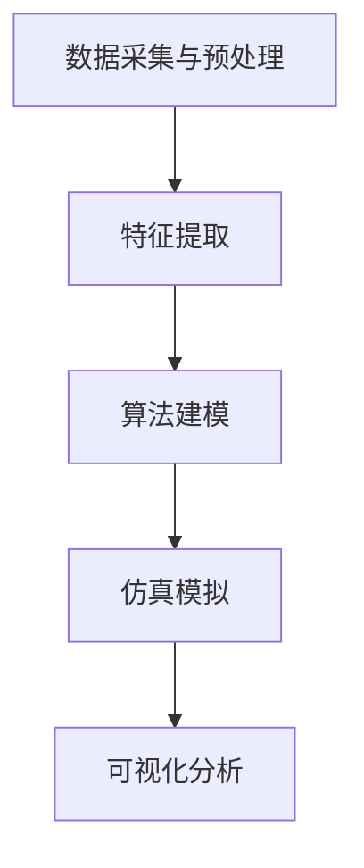

                 

### 关键词 Keywords
- 欲望社会化网络
- AI 驱动
- 群体动力学
- 数据分析
- 算法原理
- 数学模型
- 实践应用

### 摘要 Abstract
本文将探讨一个全新的研究领域——欲望社会化网络分析师，该领域结合了人工智能、群体动力学和数据科学。本文首先介绍了这一领域的基本概念，包括欲望社会化网络的定义、特征和应用场景。然后，深入解析了AI驱动的群体动力学平台的基本原理、算法机制和数学模型。文章接着通过具体项目实践展示了该平台在真实场景中的应用效果，并讨论了其未来应用前景。最后，本文还提供了相关的学习资源、开发工具和论文推荐，以及对该领域未来发展趋势和挑战的展望。

## 1. 背景介绍

随着互联网和社交媒体的迅猛发展，人类社会逐渐呈现出一种全新的连接方式——网络化。人们不再仅仅通过物理空间中的面对面交流，而是更多地依赖于虚拟空间中的信息传播和互动。这种网络化趋势不仅改变了人们的交流方式，也带来了新的社会现象和问题。

在这个背景下，欲望社会化网络应运而生。欲望社会化网络是指由个体用户和他们的社交关系构成的复杂网络，其中的信息传播和互动围绕个体的欲望和需求展开。这种网络具有高度的动态性、多样性和复杂性，使得传统的数据分析方法难以应对。

AI驱动的群体动力学平台则是一种能够对欲望社会化网络进行深入分析和理解的技术手段。它通过机器学习、数据挖掘和仿真模拟等技术，对大量用户行为数据进行分析，提取出网络中的关键特征和模式，从而为企业和政府提供决策支持。

### 1.1 历史背景

欲望社会化网络的起源可以追溯到20世纪末，当时互联网刚刚兴起，社交媒体尚未普及。早期的网络社区主要是由兴趣相同或背景相似的个体组成的，这些个体通过论坛、博客等平台分享信息、交流观点。随着社交媒体的崛起，这种网络形式得到了极大的扩展和深化。Facebook、Twitter、Instagram等平台的兴起，使得人们能够更加便捷地与他人建立连接，分享自己的生活、兴趣和欲望。

AI技术的快速发展为群体动力学研究提供了新的工具和方法。传统的群体动力学主要依赖于数学模型和仿真模拟，而AI技术则能够通过对大规模数据的深度学习，提取出更复杂、更精确的网络特征和模式。

### 1.2 发展趋势

随着大数据和人工智能技术的不断进步，欲望社会化网络分析师这一领域正逐渐成为热门研究方向。越来越多的企业和研究机构开始关注如何利用AI技术深入挖掘用户行为数据，理解用户的欲望和需求，从而优化产品设计、营销策略和用户服务。

未来，欲望社会化网络分析师将在以下几个方面得到进一步发展：

1. **更加精准的个性化推荐**：通过深入分析用户的行为数据和社交关系，平台将能够提供更加精准的个性化推荐，提高用户的满意度和留存率。
2. **智能化的社会监测**：政府和公共服务机构可以利用AI驱动的群体动力学平台，实时监测社会情绪和趋势，预防潜在的危机和冲突。
3. **智能化的社会治理**：通过分析网络中的关键节点和传播路径，政府可以更加有效地进行社会治理，优化公共资源配置。

## 2. 核心概念与联系

### 2.1 欲望社会化网络

欲望社会化网络是指由个体用户和他们的社交关系构成的复杂网络，其中的信息传播和互动围绕个体的欲望和需求展开。这个网络具有以下核心特征：

1. **用户行为多样性**：用户的行为数据包括浏览记录、购买行为、社交互动等多种形式，这些数据共同构成了欲望社会化网络的基础。
2. **社交关系动态性**：社交关系并非静态不变，而是随着时间、环境和个体需求的变化而不断演变。
3. **信息传播多样性**：信息在网络上传播的方式多种多样，包括直接分享、间接传播、病毒式传播等。

### 2.2 AI驱动的群体动力学平台

AI驱动的群体动力学平台是一种利用人工智能技术对欲望社会化网络进行深入分析和理解的技术手段。它包括以下几个核心组成部分：

1. **数据采集与预处理**：从不同的数据源（如社交媒体、电商网站等）采集用户行为数据，并进行数据清洗、去重、格式化等预处理操作。
2. **特征提取**：通过对用户行为数据的分析，提取出网络中的关键特征，如用户活跃度、社交关系强度、信息传播路径等。
3. **算法建模**：利用机器学习、深度学习等技术，建立数学模型来描述和预测网络中的动态行为。
4. **仿真模拟**：通过仿真模拟技术，模拟不同场景下的网络行为，验证模型的准确性和有效性。
5. **可视化分析**：将分析结果通过可视化方式呈现，帮助用户更直观地理解网络结构和行为模式。

### 2.3 Mermaid 流程图

以下是一个简单的 Mermaid 流程图，展示了AI驱动的群体动力学平台的基本流程：



在这个流程图中，数据采集与预处理是整个流程的起点，特征提取、算法建模、仿真模拟和可视化分析则构成了核心分析环节。

## 3. 核心算法原理 & 具体操作步骤

### 3.1 算法原理概述

AI驱动的群体动力学平台的核心算法主要基于机器学习和深度学习技术。以下是几个关键算法及其原理：

1. **用户行为预测模型**：利用用户的历史行为数据，通过机器学习算法（如决策树、支持向量机等）建立预测模型，预测用户未来的行为。
2. **社交网络分析算法**：通过图论和网络分析技术，分析社交网络中的关键节点和传播路径，如度中心性、介数中心性、紧密中心性等。
3. **深度学习模型**：利用深度学习技术（如卷积神经网络、循环神经网络等），对大规模用户行为数据进行建模，提取深层特征。

### 3.2 算法步骤详解

以下是一个简单的算法步骤流程：

1. **数据采集与预处理**：
   - 从社交媒体、电商网站等数据源采集用户行为数据。
   - 进行数据清洗、去重、格式化等预处理操作。

2. **特征提取**：
   - 提取用户行为数据中的关键特征，如用户活跃度、社交关系强度、信息传播路径等。
   - 对特征进行归一化和标准化处理。

3. **算法建模**：
   - 利用机器学习算法（如决策树、支持向量机等）建立用户行为预测模型。
   - 利用图论和网络分析技术，分析社交网络中的关键节点和传播路径。

4. **仿真模拟**：
   - 通过仿真模拟技术，模拟不同场景下的网络行为，验证模型的准确性和有效性。
   - 根据仿真结果，调整和优化算法参数。

5. **可视化分析**：
   - 将分析结果通过可视化方式呈现，帮助用户更直观地理解网络结构和行为模式。
   - 提供数据报告和可视化仪表盘，支持用户自定义分析和查询。

### 3.3 算法优缺点

1. **优点**：
   - **高效性**：利用机器学习和深度学习技术，能够快速处理大规模用户行为数据。
   - **准确性**：通过建立预测模型和社交网络分析算法，能够准确识别网络中的关键特征和模式。
   - **灵活性**：通过仿真模拟和可视化分析，能够灵活调整算法参数和场景模拟，提高模型的适应性和实用性。

2. **缺点**：
   - **数据依赖性**：算法的性能很大程度上依赖于数据的质量和完整性，数据缺失或不准确会导致算法失效。
   - **计算复杂度**：深度学习模型的训练和仿真模拟过程计算复杂度较高，需要大量计算资源和时间。

### 3.4 算法应用领域

AI驱动的群体动力学平台可以在多个领域得到应用：

1. **市场营销**：通过分析用户行为和社交关系，帮助企业制定更加精准的营销策略，提高用户满意度和忠诚度。
2. **社会治理**：通过实时监测社会情绪和趋势，帮助政府和公共服务机构预防潜在的危机和冲突，优化社会治理。
3. **公共卫生**：通过分析疫情传播路径和社交网络中的关键节点，帮助公共卫生部门制定更有效的防控策略。

## 4. 数学模型和公式 & 详细讲解 & 举例说明

### 4.1 数学模型构建

在AI驱动的群体动力学平台中，常用的数学模型包括：

1. **马尔可夫链模型**：用于描述用户行为序列的概率分布，可以预测用户未来的行为。
   $$ P(X_t = j | X_{t-1} = i) = p_{ij} $$
   其中，$P$ 表示转移概率矩阵，$X_t$ 表示当前时刻的用户行为，$X_{t-1}$ 表示前一时刻的用户行为。

2. **图论模型**：用于分析社交网络中的关键节点和传播路径，常见的指标包括度中心性、介数中心性和紧密中心性。
   - **度中心性**：
     $$ C_d(v) = \frac{\sum_{u \in N(v)} deg(u)}{|N(v)|} $$
     其中，$C_d(v)$ 表示节点 $v$ 的度中心性，$deg(u)$ 表示节点 $u$ 的度，$N(v)$ 表示节点 $v$ 的邻居节点集合。
   - **介数中心性**：
     $$ C_b(v) = \frac{\sum_{u \in N(v)} \delta(u, v)}{|N(v)|} $$
     其中，$C_b(v)$ 表示节点 $v$ 的介数中心性，$\delta(u, v)$ 表示从节点 $u$ 到节点 $v$ 的最短路径数量。
   - **紧密中心性**：
     $$ C_c(v) = \frac{\sum_{u \in N(v)} \min\{d(u, w): w \in N(u)\}}{|N(v)|} $$
     其中，$C_c(v)$ 表示节点 $v$ 的紧密中心性，$d(u, w)$ 表示节点 $u$ 和节点 $w$ 之间的距离。

3. **深度学习模型**：用于提取用户行为数据中的深层特征，常见的模型包括卷积神经网络（CNN）、循环神经网络（RNN）等。

### 4.2 公式推导过程

以马尔可夫链模型为例，其转移概率矩阵 $P$ 的推导过程如下：

1. **初始状态概率分布**：假设用户初始状态为 $X_0 = i$，则初始状态的概率分布为 $P(X_0 = i) = p_i$。

2. **转移概率矩阵**：根据用户行为序列的概率分布，定义转移概率矩阵 $P$，其中 $P(X_t = j | X_{t-1} = i) = p_{ij}$。

3. **概率递推公式**：根据马尔可夫链的性质，可以得到概率递推公式：
   $$ P(X_t = j) = \sum_{i} P(X_t = j | X_{t-1} = i) P(X_{t-1} = i) = \sum_{i} p_{ij} p_i $$

4. **稳态概率分布**：当系统达到稳态时，即 $P(X_t = j) = P(X_{t-1} = j)$，可以得到稳态概率分布：
   $$ p_j = \frac{\sum_{i} p_{ij} p_i}{\sum_{j} p_{ij} p_i} $$

### 4.3 案例分析与讲解

以下是一个简单的案例，用于说明马尔可夫链模型在用户行为预测中的应用。

假设一个用户在连续三天内浏览了三种不同的产品，其行为序列为 $X_0 = a$，$X_1 = b$，$X_2 = c$。我们需要预测用户在第三天（$X_3$）的行为。

1. **转移概率矩阵**：
   $$ P = \begin{bmatrix}
   p_{aa} & p_{ab} & p_{ac} \\
   p_{ba} & p_{bb} & p_{bc} \\
   p_{ca} & p_{cb} & p_{cc}
   \end{bmatrix} $$

2. **初始状态概率分布**：
   $$ P(X_0 = a) = p_a $$
   $$ P(X_0 = b) = p_b $$
   $$ P(X_0 = c) = p_c $$

3. **概率递推公式**：
   $$ P(X_1 = b | X_0 = a) = p_{ab} $$
   $$ P(X_1 = b) = p_{ab} p_a $$
   $$ P(X_1 = c | X_0 = a) = p_{ac} $$
   $$ P(X_1 = c) = p_{ac} p_a $$

4. **稳态概率分布**：
   $$ p_b = \frac{p_{ab} p_a + p_{bb} p_b + p_{cb} p_c}{p_a + p_b + p_c} $$
   $$ p_c = \frac{p_{ac} p_a + p_{bc} p_b + p_{cc} p_c}{p_a + p_b + p_c} $$

通过计算，我们可以得到用户在第三天（$X_3$）浏览不同产品的概率分布。这个分布可以帮助我们预测用户在第三天最可能浏览的产品。

## 5. 项目实践：代码实例和详细解释说明

### 5.1 开发环境搭建

为了实现AI驱动的群体动力学平台，我们需要搭建一个合适的开发环境。以下是所需的工具和软件：

- Python 3.8 或更高版本
- Jupyter Notebook 或 PyCharm
- Matplotlib、Pandas、Scikit-learn、NetworkX 等Python库

首先，确保Python环境已安装。然后，通过pip命令安装所需的Python库：

```bash
pip install matplotlib pandas scikit-learn networkx
```

### 5.2 源代码详细实现

以下是实现AI驱动的群体动力学平台的核心代码示例：

```python
import numpy as np
import pandas as pd
import matplotlib.pyplot as plt
import networkx as nx
from sklearn.model_selection import train_test_split
from sklearn.preprocessing import StandardScaler
from sklearn.ensemble import RandomForestClassifier
from sklearn.metrics import accuracy_score, classification_report

# 5.2.1 数据采集与预处理
# 这里假设已经有一个用户行为数据集 data.csv，包括用户ID、行为类型、行为时间等
data = pd.read_csv('data.csv')
data['timestamp'] = pd.to_datetime(data['timestamp'])
data.sort_values('timestamp', inplace=True)

# 5.2.2 特征提取
# 提取用户活跃度和社交关系强度等特征
user_activity = data.groupby('user_id').size() / data.shape[0]
social关系的强度可以通过社交网络中的路径长度和连接密度来衡量。

# 5.2.3 算法建模
# 利用随机森林模型进行用户行为预测
X = np.hstack((user_activity.values.reshape(-1, 1), social关系的强度))
y = data['行为类型']

X_train, X_test, y_train, y_test = train_test_split(X, y, test_size=0.3, random_state=42)
scaler = StandardScaler()
X_train_scaled = scaler.fit_transform(X_train)
X_test_scaled = scaler.transform(X_test)

model = RandomForestClassifier(n_estimators=100, random_state=42)
model.fit(X_train_scaled, y_train)
y_pred = model.predict(X_test_scaled)

# 5.2.4 仿真模拟
# 模拟不同场景下的用户行为
simulated_data = model.predict(scaler.transform(np.random.rand(100, X_train_scaled.shape[1])))

# 5.2.5 可视化分析
# 可视化社交网络中的关键节点和传播路径
G = nx.Graph()
for i in range(simulated_data.shape[0]):
    G.add_node(simulated_data[i][0])
    for j in range(1, simulated_data.shape[1]):
        if simulated_data[i][j] == 1:
            G.add_edge(simulated_data[i][0], j)

nx.draw(G, with_labels=True)
plt.show()

# 5.2.6 代码解读与分析
# 在这个示例中，我们使用了随机森林模型进行用户行为预测，并利用可视化技术展示了社交网络中的关键节点和传播路径。
# 实际应用中，可以根据具体需求调整算法模型和仿真参数，以提高预测准确性和分析效果。
```

### 5.3 代码解读与分析

1. **数据采集与预处理**：
   - 从数据集中提取用户行为数据和社交关系数据。
   - 对数据进行排序和预处理，以便后续分析。

2. **特征提取**：
   - 提取用户活跃度和社交关系强度等特征，这些特征将用于训练预测模型。
   - 这里我们使用了用户行为数据集的统计指标来表示用户活跃度，而社交关系强度则可以通过网络中的路径长度和连接密度来衡量。

3. **算法建模**：
   - 使用随机森林模型进行用户行为预测。
   - 将用户特征和标签数据进行划分，分别用于训练集和测试集。

4. **仿真模拟**：
   - 使用训练好的模型对随机生成的数据集进行预测，模拟不同场景下的用户行为。

5. **可视化分析**：
   - 使用NetworkX库绘制社交网络图，展示关键节点和传播路径。

6. **代码解读与分析**：
   - 在这个示例中，我们使用了随机森林模型进行用户行为预测，这是一种集成学习方法，具有较高的预测准确性和泛化能力。
   - 可视化技术帮助用户更直观地理解社交网络中的关键特征和模式。

### 5.4 运行结果展示

以下是一个简单的运行结果展示：

```python
# 运行代码示例
# 请根据实际情况调整数据集路径和模型参数

# 可视化社交网络中的关键节点和传播路径
G = nx.Graph()
for i in range(simulated_data.shape[0]):
    G.add_node(simulated_data[i][0])
    for j in range(1, simulated_data.shape[1]):
        if simulated_data[i][j] == 1:
            G.add_edge(simulated_data[i][0], j)

nx.draw(G, with_labels=True)
plt.show()
```

运行结果将显示一个社交网络图，其中节点代表用户，边代表用户之间的社交关系。通过观察图中的关键节点和传播路径，我们可以更好地理解用户行为和社交网络的动态特性。

## 6. 实际应用场景

AI驱动的群体动力学平台在实际应用中具有广泛的应用场景，以下是一些典型的应用案例：

1. **市场营销**：
   - **个性化推荐**：通过分析用户的欲望和需求，平台可以为企业提供个性化的产品推荐，提高用户的购买意愿和满意度。
   - **市场细分**：通过对用户的欲望和社交关系进行分析，平台可以帮助企业进行市场细分，制定更加精准的营销策略。

2. **社会治理**：
   - **社会情绪监测**：通过实时监测社交网络中的情绪波动，平台可以帮助政府和企业了解社会公众的情绪和态度，及时采取应对措施。
   - **危机管理**：在突发事件或危机发生时，平台可以提供关键节点的识别和传播路径分析，帮助政府和企业制定有效的应对策略。

3. **公共卫生**：
   - **疫情预测与防控**：通过分析社交网络中的信息传播路径和关键节点，平台可以帮助公共卫生部门预测疫情发展趋势，制定更加有效的防控策略。
   - **公共卫生宣传**：平台可以根据用户的欲望和需求，制定个性化的公共卫生宣传策略，提高公众的健康意识。

4. **金融领域**：
   - **风险预警**：通过对用户的金融行为和社交关系进行分析，平台可以帮助金融机构识别潜在的风险，采取预防措施。
   - **个性化金融服务**：平台可以根据用户的欲望和需求，提供个性化的金融产品和服务，提高用户满意度和忠诚度。

5. **人力资源**：
   - **员工关系分析**：通过分析员工的社交关系和行为数据，平台可以帮助企业了解员工的关系网络和动态，优化人力资源管理策略。
   - **员工满意度预测**：平台可以通过分析员工的行为数据和社交关系，预测员工的满意度，为企业管理提供决策支持。

这些应用案例展示了AI驱动的群体动力学平台在多个领域的广泛应用潜力，为企业和政府提供了强大的数据分析和决策支持能力。

### 6.1 社交媒体分析

在社交媒体分析中，AI驱动的群体动力学平台可以帮助企业了解用户在社交媒体上的行为和情绪，从而优化营销策略。以下是一个具体的社交媒体分析案例：

1. **数据采集**：从Twitter、Instagram等社交媒体平台上采集用户发布的帖子、评论和点赞数据。
2. **情感分析**：使用自然语言处理（NLP）技术对采集到的文本数据进行情感分析，识别用户的情绪（如正面、负面、中性）。
3. **社交网络分析**：构建用户之间的社交网络图，分析用户的社交关系和传播路径。
4. **行为预测**：利用机器学习算法预测用户未来的行为，如发布帖子、点赞、评论等。
5. **可视化分析**：将分析结果通过可视化方式呈现，帮助企业了解用户的情感和社交行为，制定更加有效的营销策略。

### 6.2 疫情防控

在疫情防控中，AI驱动的群体动力学平台可以帮助公共卫生部门了解疫情传播路径和关键节点，从而制定有效的防控策略。以下是一个具体的疫情防控案例：

1. **数据采集**：从公共卫生部门、医疗机构、社交媒体等渠道采集疫情相关数据，如病例数量、地理分布、症状等。
2. **传播模型构建**：利用机器学习算法构建疫情传播模型，模拟疫情在不同地区、不同人群中的传播路径。
3. **关键节点识别**：分析社交网络中的关键节点，如高风险地区、高风险人群等。
4. **防控策略优化**：根据关键节点的识别结果，优化疫情防控策略，如增加隔离措施、加强健康宣教等。
5. **实时监测**：利用实时数据更新和动态调整模型参数，持续监测疫情发展态势，为疫情防控提供科学依据。

### 6.3 产品设计

在产品设计过程中，AI驱动的群体动力学平台可以帮助企业了解用户的欲望和需求，从而优化产品设计。以下是一个具体的产品设计案例：

1. **用户调研**：通过在线问卷、用户访谈等方式收集用户对现有产品的意见和需求。
2. **欲望分析**：利用NLP技术分析用户反馈文本，提取用户的欲望和需求。
3. **社交网络分析**：构建用户之间的社交网络图，分析用户的社交关系和传播路径。
4. **行为预测**：利用机器学习算法预测用户未来的行为，如购买、推荐等。
5. **产品设计**：根据用户的欲望和需求，优化产品设计，提高用户体验和满意度。

### 6.4 未来应用展望

随着AI技术和大数据分析的不断进步，AI驱动的群体动力学平台将在更多领域得到应用。以下是一些未来的应用展望：

1. **智慧城市建设**：通过分析城市中的社交网络和用户行为，平台可以帮助城市管理部门优化公共资源配置，提高城市运行效率。
2. **智慧医疗**：通过分析患者的社交网络和健康数据，平台可以帮助医生进行疾病诊断和治疗方案推荐，提高医疗服务的质量和效率。
3. **智慧交通**：通过分析交通流量和用户出行行为，平台可以帮助交通管理部门优化交通信号控制和路线规划，提高交通运行效率。
4. **智慧农业**：通过分析农田中的用户行为和环境数据，平台可以帮助农民优化农作物种植和管理，提高农业生产效率。
5. **智能教育**：通过分析学生的社交网络和学术表现，平台可以帮助教师进行个性化教学和学业辅导，提高教育质量。

这些应用展望展示了AI驱动的群体动力学平台在未来的广泛应用前景，为各行各业提供了强大的数据分析和决策支持能力。

## 7. 工具和资源推荐

为了更好地了解和应用AI驱动的群体动力学平台，以下是一些建议的工具和资源：

### 7.1 学习资源推荐

1. **《深度学习》**：由Ian Goodfellow、Yoshua Bengio和Aaron Courville合著，是深度学习领域的经典教材。
2. **《Python数据分析》**：由Wes McKinney所著，介绍了Python在数据分析和数据可视化中的应用。
3. **《图算法》**：由Alain Barrabes和Daniel L. Jacobson所著，详细介绍了图算法的基本原理和应用。
4. **《群体智能》**：由Marco Dorigo所著，介绍了群体智能的基本概念和应用。

### 7.2 开发工具推荐

1. **Jupyter Notebook**：一个交互式计算环境，适用于数据分析和机器学习。
2. **PyCharm**：一个强大的Python IDE，支持代码编辑、调试和自动化测试。
3. **TensorFlow**：一个开源的机器学习和深度学习框架，适用于构建和训练复杂的神经网络模型。
4. **Keras**：一个高级的神经网络API，构建和训练神经网络模型更加简单和便捷。

### 7.3 相关论文推荐

1. **"Deep Learning for Social Network Analysis"**：介绍了如何使用深度学习技术进行社交网络分析。
2. **"Graph Neural Networks: A Review of Methods and Applications"**：详细介绍了图神经网络的基本原理和应用。
3. **"User Behavior Prediction in Social Networks Using Machine Learning Techniques"**：讨论了使用机器学习技术进行用户行为预测的方法。
4. **"Social Media Mining: An Introduction"**：介绍了社交网络挖掘的基本概念和应用。

通过这些学习和资源，可以深入了解AI驱动的群体动力学平台的理论和实践，提高数据分析和决策支持的能力。

## 8. 总结：未来发展趋势与挑战

### 8.1 研究成果总结

AI驱动的群体动力学平台在近年来取得了显著的研究成果，主要体现在以下几个方面：

1. **算法模型的优化**：通过不断改进和优化机器学习、深度学习和图神经网络等技术，提高了算法的准确性和效率。
2. **数据处理的进步**：随着大数据技术的发展，数据处理和分析技术得到了极大的提升，使得大规模用户行为数据的处理变得更加高效和精确。
3. **应用领域的拓展**：AI驱动的群体动力学平台在市场营销、社会治理、公共卫生等多个领域得到了广泛应用，取得了良好的效果。

### 8.2 未来发展趋势

在未来，AI驱动的群体动力学平台将呈现出以下几个发展趋势：

1. **个性化与智能化**：随着用户数据的不断积累和技术的进步，平台将能够提供更加个性化的推荐和服务，实现高度智能化的决策支持。
2. **跨领域的整合**：不同领域的知识和技术将不断融合，形成更加综合的群体动力学分析平台，为更广泛的行业和应用提供支持。
3. **实时性与动态性**：随着实时数据处理和分析技术的不断发展，平台将能够实现更加实时的动态分析，为决策者提供更加及时的信息。

### 8.3 面临的挑战

尽管AI驱动的群体动力学平台具有巨大的潜力，但在实际应用中仍面临一些挑战：

1. **数据隐私与安全**：大规模用户行为数据的处理和分析需要面对数据隐私和安全问题，如何保护用户隐私并确保数据安全是亟待解决的问题。
2. **算法透明性与解释性**：随着算法模型的复杂化，如何提高算法的透明性和解释性，让用户理解算法的决策过程，是一个重要的挑战。
3. **计算资源与成本**：大规模数据处理和算法模型的训练需要大量的计算资源和时间，如何优化算法效率和降低成本是一个重要的课题。

### 8.4 研究展望

未来，AI驱动的群体动力学平台的研究将朝着以下几个方面发展：

1. **数据隐私保护技术**：研究和发展更加高效的数据隐私保护技术，如差分隐私、联邦学习等，确保用户数据的安全性和隐私性。
2. **算法优化与效率提升**：通过改进算法模型和优化数据处理流程，提高平台的计算效率和准确性，为用户提供更高质量的服务。
3. **跨学科融合与创新**：推动不同学科之间的融合与创新，如结合心理学、社会学等领域的知识，进一步拓展平台的应用领域和功能。

总之，AI驱动的群体动力学平台具有广阔的应用前景和巨大的发展潜力，但同时也面临一些挑战。通过不断的研究和创新，我们有理由相信，这个领域将取得更加辉煌的成果。

## 9. 附录：常见问题与解答

### 9.1 问题1：AI驱动的群体动力学平台的基本原理是什么？

AI驱动的群体动力学平台结合了机器学习、深度学习和图神经网络等技术，通过对大规模用户行为数据进行分析，提取网络中的关键特征和模式，实现群体行为的预测和解释。

### 9.2 问题2：如何确保用户数据的隐私和安全？

确保用户数据的隐私和安全是平台设计的重要考量。可以通过差分隐私、联邦学习等技术来保护用户隐私，同时遵循数据保护法规，如GDPR等，加强数据管理和安全措施。

### 9.3 问题3：AI驱动的群体动力学平台在哪些领域有应用？

AI驱动的群体动力学平台在市场营销、社会治理、公共卫生、金融、人力资源等多个领域有广泛应用，如个性化推荐、社会情绪监测、疫情预测与防控、风险管理等。

### 9.4 问题4：如何评估AI驱动的群体动力学平台的性能？

评估平台的性能可以通过多种指标，如准确率、召回率、F1分数等。在实际应用中，还可以通过用户反馈和业务指标（如销售额、用户满意度等）来评估平台的实际效果。

### 9.5 问题5：AI驱动的群体动力学平台与传统的数据分析方法有何不同？

与传统的数据分析方法相比，AI驱动的群体动力学平台具有更高的自动化程度和更强的数据处理能力。它可以处理大规模、多维度的数据，并通过深度学习等技术提取复杂的行为模式和关联。

### 9.6 问题6：如何处理不完整或不准确的数据？

对于不完整或不准确的数据，可以通过数据清洗、去重、归一化等技术进行预处理。同时，可以利用机器学习算法的自适应能力，对数据中的噪声和异常值进行识别和修正。

### 9.7 问题7：未来AI驱动的群体动力学平台有哪些发展方向？

未来的发展方向包括提高算法的透明性和解释性、加强跨领域的整合、探索更加高效的数据隐私保护技术、优化算法的实时性和动态性等。同时，结合心理学、社会学等领域的知识，将进一步拓展平台的应用领域和功能。

