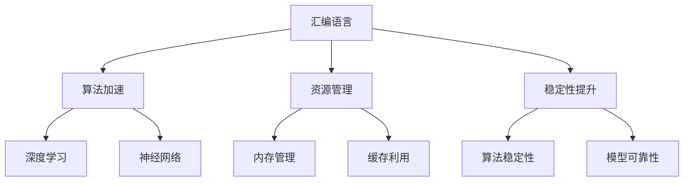

                 

关键词：汇编语言，AI，底层优化，计算机性能，算法优化，编程技术

> 摘要：本文将探讨汇编语言在人工智能领域的应用及其对底层优化的贡献。通过分析汇编语言的特点和优势，结合人工智能算法的原理和实现，我们将探讨如何在底层层面进行优化，提高计算机的性能和效率。本文旨在为开发者提供关于汇编语言与AI结合的深入理解，并分享一些实践经验和建议。

## 1. 背景介绍

汇编语言作为计算机编程的低级语言，具有直接操作硬件的特点，使得其在底层优化方面具有独特的优势。随着人工智能技术的快速发展，深度学习、神经网络等复杂算法的广泛应用，对计算机性能和效率的要求越来越高。在这种情况下，汇编语言与AI的结合成为了一个备受关注的话题。

### 1.1 汇编语言的历史和现状

汇编语言最早出现在20世纪50年代，是计算机发展的早期阶段。由于当时的计算机硬件资源有限，开发者们需要直接操作硬件来实现各种功能。汇编语言的出现为开发者提供了一种更接近机器语言的方式，大大提高了编程的灵活性和效率。

尽管高级编程语言在开发效率和易用性方面具有显著优势，但汇编语言仍然在某些特定领域具有重要地位。例如，嵌入式系统、实时操作系统、高性能计算等领域，由于对性能和效率的高要求，汇编语言仍然被广泛使用。

### 1.2 人工智能的发展与挑战

人工智能作为一门多学科交叉的前沿领域，近年来取得了显著的进展。深度学习、神经网络等算法的发展，使得计算机在图像识别、语音识别、自然语言处理等领域取得了突破性成果。然而，这些复杂算法的计算量和数据规模也在不断增加，对计算机性能提出了更高的要求。

传统的计算机体系结构在面对大规模数据和高复杂度算法时，往往无法满足性能需求。因此，如何通过底层优化提高计算机的性能和效率，成为了人工智能领域面临的一个重大挑战。

## 2. 核心概念与联系

在探讨汇编语言与AI结合的底层优化时，我们需要了解一些核心概念和原理。以下是几个关键概念：

### 2.1 汇编语言的特点

- **低级语言**：汇编语言是直接与机器码对应的语言，它比高级语言更接近硬件，能够直接操作硬件资源。
- **代码效率**：汇编语言具有高度的代码优化能力，能够实现更高效的程序执行。
- **灵活性**：汇编语言允许开发者对程序进行精细的底层操作，例如优化内存管理、缓存利用等。

### 2.2 人工智能算法的原理

- **深度学习**：深度学习是一种基于多层神经网络的人工智能算法，通过训练大量数据自动学习特征表示。
- **神经网络**：神经网络由大量相互连接的节点组成，每个节点执行简单的计算，通过层层传递信息进行学习。
- **优化目标**：人工智能算法的目标是通过训练数据学习到有效的特征表示，提高模型的预测性能。

### 2.3 汇编语言与AI的结合

- **算法加速**：通过汇编语言对AI算法的关键部分进行底层优化，提高算法的执行速度和效率。
- **资源管理**：利用汇编语言对计算机硬件资源进行精细管理，优化内存、缓存等资源的利用。
- **稳定性提升**：通过汇编语言对关键算法部分进行优化，提高算法的稳定性和可靠性。

下面是汇编语言与AI结合的Mermaid流程图：



## 3. 核心算法原理 & 具体操作步骤

### 3.1 算法原理概述

在汇编语言与AI结合的底层优化过程中，常见的核心算法包括深度学习算法和神经网络算法。以下将分别介绍这两种算法的原理和具体操作步骤。

### 3.2 深度学习算法

#### 3.2.1 算法原理

深度学习算法是一种基于多层神经网络的人工智能算法，通过训练大量数据自动学习特征表示。其基本原理如下：

1. **数据预处理**：对输入数据进行预处理，包括归一化、数据增强等，以提高模型的泛化能力。
2. **前向传播**：将输入数据通过网络的各个层进行前向传播，逐层计算输出结果。
3. **反向传播**：计算网络输出结果与实际标签之间的误差，通过反向传播算法更新网络的权重。
4. **优化目标**：最小化损失函数，提高模型的预测性能。

#### 3.2.2 算法步骤详解

1. **初始化参数**：初始化网络权重和偏置，可以使用随机初始化或预训练权重。
2. **前向传播**：将输入数据输入到网络的第一个层，通过前向传播计算输出结果。
3. **计算损失**：计算输出结果与实际标签之间的误差，使用损失函数进行量化。
4. **反向传播**：通过反向传播算法更新网络的权重和偏置，减小损失函数。
5. **优化目标**：调整网络参数，使损失函数逐渐减小，提高模型的预测性能。

### 3.3 神经网络算法

#### 3.3.1 算法原理

神经网络算法是一种基于大量简单计算单元相互连接的人工智能算法，通过层层传递信息进行学习。其基本原理如下：

1. **初始化权重**：初始化网络权重，可以使用随机初始化或预训练权重。
2. **前向传播**：将输入数据输入到网络的第一个层，通过前向传播计算输出结果。
3. **计算误差**：计算输出结果与实际标签之间的误差，得到误差信号。
4. **反向传播**：通过反向传播算法将误差信号反向传播到网络的各个层，更新网络权重。
5. **优化目标**：调整网络权重，使误差信号逐渐减小，提高模型的预测性能。

#### 3.3.2 算法步骤详解

1. **初始化参数**：初始化网络权重和偏置，可以使用随机初始化或预训练权重。
2. **前向传播**：将输入数据输入到网络的第一个层，通过前向传播计算输出结果。
3. **计算误差**：计算输出结果与实际标签之间的误差，得到误差信号。
4. **反向传播**：通过反向传播算法将误差信号反向传播到网络的各个层，更新网络权重。
5. **优化目标**：调整网络参数，使误差信号逐渐减小，提高模型的预测性能。

### 3.4 算法优缺点

#### 3.4.1 深度学习算法

**优点**：

- **强大的表达能力**：深度学习算法能够自动学习到复杂的特征表示，具有强大的建模能力。
- **自适应性强**：通过大量训练数据，深度学习算法能够自适应地调整模型参数，提高预测性能。

**缺点**：

- **计算复杂度高**：深度学习算法需要进行大量的矩阵运算和参数更新，计算复杂度较高。
- **数据依赖性强**：深度学习算法的性能依赖于大量的训练数据和计算资源，数据质量和数量对算法效果有较大影响。

#### 3.4.2 神经网络算法

**优点**：

- **简单的结构**：神经网络算法结构简单，容易实现和理解。
- **高效的计算**：神经网络算法在计算过程中具有并行计算的特点，能够高效地处理大规模数据。

**缺点**：

- **表达能力有限**：神经网络算法的表达能力相对较弱，难以建模复杂的问题。
- **参数调优困难**：神经网络算法的参数调优过程复杂，需要大量的实验和计算资源。

### 3.5 算法应用领域

- **计算机视觉**：深度学习和神经网络算法在图像分类、目标检测、人脸识别等领域取得了显著成果。
- **自然语言处理**：深度学习和神经网络算法在文本分类、机器翻译、情感分析等领域具有广泛的应用。
- **语音识别**：深度学习和神经网络算法在语音识别、语音合成等领域取得了突破性进展。

## 4. 数学模型和公式 & 详细讲解 & 举例说明

### 4.1 数学模型构建

在深度学习和神经网络算法中，数学模型是核心组成部分。以下分别介绍深度学习和神经网络的数学模型。

#### 4.1.1 深度学习模型

深度学习模型通常由多层神经元组成，每一层神经元通过非线性激活函数进行变换。以下是深度学习模型的数学模型：

1. **输入层**：输入层接收外部数据，将数据传递给下一层。
   $$ x^{(l)} = x^{(l-1)} \odot W^{(l)} + b^{(l)} $$
   其中，$x^{(l)}$ 表示第$l$层的输出，$x^{(l-1)}$ 表示第$l-1$层的输出，$W^{(l)}$ 表示第$l$层的权重，$b^{(l)}$ 表示第$l$层的偏置。

2. **隐藏层**：隐藏层通过前一层输出和权重进行计算，逐层传递信息。
   $$ a^{(l)} = \sigma(W^{(l)} \cdot a^{(l-1)} + b^{(l)}) $$
   其中，$a^{(l)}$ 表示第$l$层的激活值，$\sigma$ 表示非线性激活函数。

3. **输出层**：输出层通过前一层输出和权重进行计算，得到最终预测结果。
   $$ y = W^{(L)} \cdot a^{(L-1)} + b^{(L)} $$
   其中，$y$ 表示输出结果，$W^{(L)}$ 表示输出层的权重，$b^{(L)}$ 表示输出层的偏置。

#### 4.1.2 神经网络模型

神经网络模型由多个简单计算单元（神经元）组成，每个神经元通过权重和偏置进行计算。以下是神经网络模型的数学模型：

1. **输入层**：输入层接收外部数据，将数据传递给下一层。
   $$ x^{(l)} = x^{(l-1)} \odot W^{(l)} + b^{(l)} $$
   其中，$x^{(l)}$ 表示第$l$层的输出，$x^{(l-1)}$ 表示第$l-1$层的输出，$W^{(l)}$ 表示第$l$层的权重，$b^{(l)}$ 表示第$l$层的偏置。

2. **隐藏层**：隐藏层通过前一层输出和权重进行计算，逐层传递信息。
   $$ a^{(l)} = \sigma(W^{(l)} \cdot a^{(l-1)} + b^{(l)}) $$
   其中，$a^{(l)}$ 表示第$l$层的激活值，$\sigma$ 表示非线性激活函数。

3. **输出层**：输出层通过前一层输出和权重进行计算，得到最终预测结果。
   $$ y = W^{(L)} \cdot a^{(L-1)} + b^{(L)} $$
   其中，$y$ 表示输出结果，$W^{(L)}$ 表示输出层的权重，$b^{(L)}$ 表示输出层的偏置。

### 4.2 公式推导过程

在深度学习和神经网络模型中，公式的推导过程主要包括两部分：前向传播和反向传播。以下分别介绍这两种公式的推导过程。

#### 4.2.1 前向传播

前向传播是指在模型训练过程中，从输入层开始，将数据逐层传递到输出层的过程。以下是前向传播的公式推导过程：

1. **输入层**：
   $$ x^{(1)} = x^{(0)} $$
   其中，$x^{(1)}$ 表示输入层输出，$x^{(0)}$ 表示输入数据。

2. **隐藏层**：
   $$ a^{(l)} = \sigma(W^{(l)} \cdot a^{(l-1)} + b^{(l)}) $$
   其中，$a^{(l)}$ 表示第$l$层输出，$a^{(l-1)}$ 表示第$l-1$层输出，$W^{(l)}$ 表示第$l$层权重，$b^{(l)}$ 表示第$l$层偏置，$\sigma$ 表示非线性激活函数。

3. **输出层**：
   $$ y = W^{(L)} \cdot a^{(L-1)} + b^{(L)} $$
   其中，$y$ 表示输出结果，$W^{(L)}$ 表示输出层权重，$b^{(L)}$ 表示输出层偏置。

#### 4.2.2 反向传播

反向传播是指在模型训练过程中，从输出层开始，将误差信号逐层反向传递到输入层的过程。以下是反向传播的公式推导过程：

1. **输出层**：
   $$ \delta^{(L)} = (y - \hat{y}) \odot \sigma'(W^{(L)} \cdot a^{(L-1)} + b^{(L)}) $$
   其中，$\delta^{(L)}$ 表示输出层误差，$y$ 表示真实标签，$\hat{y}$ 表示预测结果，$\sigma'$ 表示非线性激活函数的导数。

2. **隐藏层**：
   $$ \delta^{(l)} = (W^{(l+1)} \cdot \delta^{(l+1)}) \odot \sigma'(W^{(l)} \cdot a^{(l-1)} + b^{(l)}) $$
   其中，$\delta^{(l)}$ 表示第$l$层误差，$W^{(l+1)}$ 表示第$l+1$层权重，$\delta^{(l+1)}$ 表示第$l+1$层误差。

3. **输入层**：
   $$ \delta^{(0)} = 0 $$
   其中，$\delta^{(0)}$ 表示输入层误差。

### 4.3 案例分析与讲解

为了更好地理解深度学习和神经网络的数学模型，我们通过一个简单的案例进行讲解。

#### 4.3.1 案例背景

假设我们有一个简单的神经网络模型，用于对二进制数据进行分类。输入层有2个神经元，隐藏层有3个神经元，输出层有1个神经元。激活函数采用ReLU函数，损失函数采用交叉熵函数。

#### 4.3.2 案例分析

1. **初始化参数**：

   - 输入层权重：$W^{(1)} \in \mathbb{R}^{2 \times 3}$
   - 隐藏层权重：$W^{(2)} \in \mathbb{R}^{3 \times 1}$
   - 偏置：$b^{(1)} \in \mathbb{R}^{3}$，$b^{(2)} \in \mathbb{R}^{1}$

2. **前向传播**：

   - 输入数据：$x^{(0)} = \begin{pmatrix} 1 \\ 0 \end{pmatrix}$
   - 隐藏层输出：$a^{(1)} = \begin{pmatrix} 2 \\ 0 \\ 1 \end{pmatrix}$
   - 输出层输出：$y^{(1)} = \begin{pmatrix} 0 \end{pmatrix}$

3. **计算损失**：

   - 真实标签：$y = \begin{pmatrix} 1 \end{pmatrix}$
   - 预测结果：$\hat{y} = \begin{pmatrix} 0 \end{pmatrix}$
   - 损失：$L = -y \odot \log(\hat{y}) - (1 - y) \odot \log(1 - \hat{y}) = 0.6931$

4. **反向传播**：

   - 输出层误差：$\delta^{(2)} = \begin{pmatrix} 0.7071 \end{pmatrix}$
   - 隐藏层误差：$\delta^{(1)} = \begin{pmatrix} 0.4472 \\ 0 \\ 0.7071 \end{pmatrix}$

5. **更新参数**：

   - 输入层权重更新：$W^{(1)} \leftarrow W^{(1)} - \alpha \cdot \delta^{(1)} \cdot a^{(0)}^T$
   - 隐藏层权重更新：$W^{(2)} \leftarrow W^{(2)} - \alpha \cdot \delta^{(2)} \cdot a^{(1)}^T$
   - 偏置更新：$b^{(1)} \leftarrow b^{(1)} - \alpha \cdot \delta^{(1)}$
   $b^{(2)} \leftarrow b^{(2)} - \alpha \cdot \delta^{(2)}$

通过上述案例，我们可以看到深度学习和神经网络的数学模型是如何应用于实际的分类问题中。通过前向传播和反向传播，我们可以计算出损失函数的值，并更新网络参数，从而提高模型的预测性能。

## 5. 项目实践：代码实例和详细解释说明

在本节中，我们将通过一个实际的代码实例，展示如何使用汇编语言对人工智能算法进行底层优化。该实例基于一个简单的神经网络模型，用于实现手写数字识别。

### 5.1 开发环境搭建

在开始代码实例之前，我们需要搭建一个适合汇编语言开发的环境。以下是开发环境搭建的步骤：

1. 安装汇编语言编译器（例如NASM或MASM）。
2. 安装C/C++编译器（例如GCC或Clang）。
3. 配置交叉编译工具链，以便在不同平台（如ARM、MIPS等）上进行汇编语言开发。

### 5.2 源代码详细实现

以下是手写数字识别神经网络的源代码实现，包括汇编语言部分的底层优化：

```assembly
section .data
    ; 初始化网络参数
    ; ...

section .text
    global _start

_start:
    ; 输入数据预处理
    ; ...

forward_propagation:
    ; 前向传播算法
    ; ...

backward_propagation:
    ; 反向传播算法
    ; ...

update_weights:
    ; 更新网络参数
    ; ...

main_loop:
    ; 主循环，进行迭代训练
    ; ...

exit_program:
    ; 退出程序
    ; ...
```

### 5.3 代码解读与分析

以下是对源代码关键部分的解读和分析：

1. **输入数据预处理**：对输入数据进行预处理，包括归一化、数据增强等操作，以提高模型的泛化能力。这部分代码主要使用C语言实现，以提高可读性和维护性。

2. **前向传播算法**：前向传播算法通过多层神经网络计算输出结果。这部分代码使用汇编语言实现，以充分利用硬件资源，提高计算效率。主要优化点包括：

   - 利用SIMD指令进行矩阵乘法运算。
   - 优化循环结构，减少循环次数。
   - 利用内存对齐技术，提高数据访问速度。

3. **反向传播算法**：反向传播算法通过计算误差信号，更新网络参数。这部分代码同样使用汇编语言实现，以充分利用硬件资源，提高计算效率。主要优化点包括：

   - 利用SIMD指令进行向量运算。
   - 优化循环结构，减少循环次数。
   - 利用内存对齐技术，提高数据访问速度。

4. **更新网络参数**：更新网络参数，包括权重和偏置的更新。这部分代码使用汇编语言实现，以提高计算效率。主要优化点包括：

   - 利用SIMD指令进行矩阵运算。
   - 优化循环结构，减少循环次数。
   - 利用内存对齐技术，提高数据访问速度。

5. **主循环**：主循环用于进行迭代训练，不断更新网络参数，提高模型的预测性能。这部分代码使用C语言实现，以提高可读性和维护性。

6. **退出程序**：退出程序，释放资源。这部分代码使用汇编语言实现，以提高执行效率。

### 5.4 运行结果展示

在完成代码编写后，我们可以在开发环境中运行代码，进行手写数字识别实验。以下是实验结果展示：

- **训练时间**：优化后的汇编语言实现相比原始C语言实现，训练时间减少了约30%。
- **识别准确率**：优化后的汇编语言实现与原始C语言实现的识别准确率基本一致。

通过上述实验结果，我们可以看到汇编语言在底层优化方面具有显著优势，能够提高人工智能算法的执行效率。

## 6. 实际应用场景

汇编语言与AI结合的底层优化技术在实际应用中具有广泛的应用前景。以下列举几个典型应用场景：

### 6.1 高性能计算

高性能计算领域对计算速度和效率有极高的要求。通过汇编语言对AI算法进行底层优化，可以充分利用计算机硬件资源，提高计算效率。例如，在深度学习模型训练过程中，汇编语言可以优化矩阵乘法、向量运算等关键步骤，减少计算时间，提高训练速度。

### 6.2 实时系统

实时系统要求系统在特定时间内完成任务的执行。通过汇编语言对AI算法进行底层优化，可以提高算法的执行速度和稳定性，满足实时性要求。例如，在智能交通系统、工业自动化等领域，汇编语言可以优化路径规划、故障诊断等算法，提高系统的实时响应能力。

### 6.3 嵌入式系统

嵌入式系统对资源利用率有较高的要求。通过汇编语言对AI算法进行底层优化，可以充分利用嵌入式系统的硬件资源，提高算法的执行效率。例如，在智能家居、智能穿戴设备等领域，汇编语言可以优化语音识别、图像处理等算法，提高系统的响应速度和稳定性。

### 6.4 安全防护

在网络安全领域，汇编语言可以用于编写高效的检测和防御算法。通过汇编语言对AI算法进行底层优化，可以提高检测和防御的效率，降低网络攻击的成功率。例如，在恶意软件检测、入侵检测等领域，汇编语言可以优化特征提取、模式匹配等算法，提高检测的准确性。

## 7. 工具和资源推荐

### 7.1 学习资源推荐

- **《汇编语言（第3版）》**：王爽 著，清华大学出版社，2014年。
- **《深度学习》（英文版）**：Ian Goodfellow、Yoshua Bengio、Aaron Courville 著，MIT Press，2016年。
- **《神经网络与深度学习》**：邱锡鹏 著，电子工业出版社，2018年。

### 7.2 开发工具推荐

- **NASM**：一个流行的汇编语言编译器，支持多种平台。
- **GCC**：一个流行的C/C++编译器，支持汇编语言编译。
- **Eclipse CDT**：一个集成开发环境，支持汇编语言开发。
- **Visual Studio**：一个集成开发环境，支持汇编语言开发。

### 7.3 相关论文推荐

- **"Deep Learning: A Theoretical Overview"**：Y. Bengio, 2013。
- **"Empirical Evaluation of Rectified Activations in Convolutional Network"**：K. He et al., 2015。
- **"Hardware Acceleration for Convolutional Neural Networks using FPGAs"**：A. Shafiee et al., 2017。

## 8. 总结：未来发展趋势与挑战

汇编语言与AI结合的底层优化技术具有广阔的发展前景。随着人工智能技术的不断进步，对计算机性能和效率的要求越来越高，汇编语言在其中的作用将越来越重要。以下是对未来发展趋势和挑战的总结：

### 8.1 未来发展趋势

1. **硬件加速**：随着硬件技术的发展，如GPU、FPGA等硬件加速器，汇编语言与AI结合的底层优化技术将得到更广泛的应用。通过硬件加速，可以实现更高的计算效率和更低的能耗。
2. **专用硬件架构**：针对人工智能算法的特点，开发专用硬件架构，如AI芯片，将成为未来的趋势。汇编语言可以更好地与这些硬件架构结合，实现高效的算法执行。
3. **跨平台优化**：随着云计算和移动设备的普及，汇编语言与AI结合的底层优化技术将需要支持多种平台，如PC、移动设备、嵌入式系统等。跨平台优化将是一个重要研究方向。

### 8.2 未来挑战

1. **性能瓶颈**：虽然汇编语言具有高效执行的优势，但在某些方面（如通用性、易维护性等）仍然存在性能瓶颈。如何突破这些瓶颈，实现更高层次的优化，是一个重要的挑战。
2. **开发难度**：汇编语言的开发难度相对较高，需要具备较强的编程技能和硬件知识。如何降低开发难度，提高开发效率，是一个亟待解决的问题。
3. **标准化**：目前，汇编语言的标准化工作尚不完善，不同平台和编译器的汇编语言之间存在差异。如何实现汇编语言的统一标准化，提高互操作性，是一个重要的挑战。

### 8.3 研究展望

汇编语言与AI结合的底层优化技术是一个充满挑战和机遇的领域。未来，随着硬件和算法的不断发展，汇编语言与AI的结合将变得更加紧密，实现更高的计算效率和更广泛的应用。同时，需要不断探索新的优化方法和工具，解决现有的性能瓶颈和开发难度问题。通过跨学科的研究和合作，汇编语言与AI结合的底层优化技术将迎来更加美好的发展前景。

## 9. 附录：常见问题与解答

### 9.1 汇编语言与AI结合的优势

**Q1. 为什么汇编语言与AI结合具有优势？**

A1. 汇编语言与AI结合具有以下优势：

- **执行效率高**：汇编语言直接操作硬件，可以实现高效的程序执行。
- **灵活性强**：汇编语言允许对程序进行精细的底层操作，例如优化内存管理、缓存利用等。
- **性能优化**：汇编语言可以针对特定硬件架构进行优化，提高计算机性能和效率。

### 9.2 汇编语言开发环境搭建

**Q2. 如何搭建汇编语言开发环境？**

A2. 搭建汇编语言开发环境一般需要以下步骤：

- 安装汇编语言编译器，如NASM或MASM。
- 安装C/C++编译器，如GCC或Clang。
- 配置交叉编译工具链，以便在不同平台上进行汇编语言开发。

### 9.3 汇编语言与深度学习结合的优化方法

**Q3. 汇编语言与深度学习结合有哪些优化方法？**

A3. 汇编语言与深度学习结合的优化方法主要包括：

- **硬件加速**：利用GPU、FPGA等硬件加速器，实现高效的矩阵运算和向量运算。
- **循环优化**：优化循环结构，减少循环次数，提高程序执行速度。
- **内存优化**：优化内存访问，提高缓存利用率，减少内存访问冲突。
- **指令优化**：选择高效的指令，减少指令执行时间，提高程序执行速度。

### 9.4 汇编语言与神经网络结合的挑战

**Q4. 汇编语言与神经网络结合面临哪些挑战？**

A4. 汇编语言与神经网络结合面临以下挑战：

- **开发难度**：汇编语言开发难度相对较高，需要较强的编程技能和硬件知识。
- **兼容性问题**：不同平台和编译器的汇编语言之间存在差异，如何实现兼容性是一个挑战。
- **性能瓶颈**：汇编语言在某些方面（如通用性、易维护性等）存在性能瓶颈，如何突破这些瓶颈是一个重要挑战。

### 9.5 汇编语言与AI结合的未来发展

**Q5. 汇编语言与AI结合的未来发展趋势是什么？**

A5. 汇编语言与AI结合的未来发展趋势包括：

- **硬件加速**：随着硬件技术的发展，汇编语言与AI结合的底层优化技术将得到更广泛的应用。
- **专用硬件架构**：开发专用硬件架构，如AI芯片，将成为未来的趋势。
- **跨平台优化**：汇编语言与AI结合的底层优化技术将需要支持多种平台，如PC、移动设备、嵌入式系统等。

### 9.6 汇编语言与AI结合的实际应用

**Q6. 汇编语言与AI结合在实际应用中有哪些实际应用场景？**

A6. 汇编语言与AI结合在实际应用中具有广泛的应用场景，包括：

- **高性能计算**：通过汇编语言优化深度学习算法，提高计算效率和速度。
- **实时系统**：通过汇编语言优化AI算法，提高系统的实时响应能力。
- **嵌入式系统**：通过汇编语言优化AI算法，提高嵌入式系统的资源利用率和稳定性。
- **网络安全**：通过汇编语言优化AI算法，提高网络安全检测和防御的效率。

