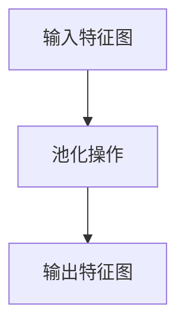

                 

关键词：池化层、神经网络、深度学习、机器学习、图像识别

> 摘要：本文将深入探讨池化层（Pooling Layer）在深度学习中的重要性及其工作原理。我们将通过详细的数学模型和代码实例，帮助读者理解并掌握池化层的实际应用。

## 1. 背景介绍

### 深度学习的兴起

深度学习是机器学习的一个子领域，它通过模仿人脑的神经网络结构和机制，对大量数据进行分析和模式识别。深度学习的快速发展得益于计算能力的提升和大数据技术的发展。近年来，深度学习在图像识别、语音识别、自然语言处理等领域取得了显著的成果，成为人工智能发展的关键技术之一。

### 池化层的作用

池化层是深度神经网络中的一种特殊层，主要用于对特征图（feature map）进行下采样，以减少数据传输和处理的时间复杂度。池化层的引入不仅提高了模型的计算效率，还有助于减少过拟合现象。常见的池化方式有最大池化（Max Pooling）和平均池化（Average Pooling）。

## 2. 核心概念与联系

### 池化层的概念

池化层是一种特殊的层，通常位于卷积层之后，用于对特征图进行下采样。池化层的主要作用是减小特征图的尺寸，从而减少计算量。

### 池化层的工作原理

池化层的工作原理是通过在一个小的滑动窗口内对特征值进行聚合操作，从而生成一个池化值。最大池化层选取窗口内的最大值作为池化值，而平均池化层则选取窗口内的平均值作为池化值。

### 池化层的架构

以下是池化层的 Mermaid 流程图：



- **A（输入特征图）**：输入特征图的尺寸为 \(W \times H \times C\)，其中 \(W\) 和 \(H\) 分别表示特征图的宽度和高度，\(C\) 表示特征图的深度（即卷积核的数量）。
- **B（池化操作）**：在特征图上进行池化操作，滑动窗口的大小通常为 \(2 \times 2\) 或 \(3 \times 3\)。
- **C（输出特征图）**：经过池化操作后，输出特征图的尺寸为 \(W' \times H' \times C\)，其中 \(W' = \frac{W - k+1}{s} + 1\) 和 \(H' = \frac{H - k+1}{s} + 1\)，\(k\) 表示窗口大小，\(s\) 表示步长。
```markdown
## 3. 核心算法原理 & 具体操作步骤

### 3.1 算法原理概述

池化层的核心原理是通过在特征图上定义一个滑动窗口，然后对窗口内的特征值进行聚合操作，以生成新的特征值。常见的聚合操作有最大值聚合和平均值聚合。

### 3.2 算法步骤详解

1. **窗口滑动**：从特征图左上角开始，以步长 \(s\) 依次滑动窗口，直到覆盖整个特征图。
2. **特征值聚合**：在当前窗口内的特征值进行聚合操作。对于最大池化，选取最大值；对于平均池化，计算平均值。
3. **生成新特征图**：将聚合后的结果写入新的特征图中，形成新的特征图。

### 3.3 算法优缺点

**优点**：
- **减少计算量**：通过下采样，减少了特征图的尺寸，从而降低了模型的计算复杂度。
- **防止过拟合**：下采样可以减少特征图的细节，有助于减少过拟合现象。

**缺点**：
- **丢失信息**：下采样可能导致特征信息的丢失，特别是在最大池化中。
- **对参数敏感**：窗口大小和步长的选择对模型性能有很大影响。

### 3.4 算法应用领域

池化层广泛应用于各种深度学习任务，如图像识别、语音识别、自然语言处理等。它有助于提高模型的效率和性能。

## 4. 数学模型和公式 & 详细讲解 & 举例说明

### 4.1 数学模型构建

池化层的数学模型可以表示为：

$$
P(i, j) = \begin{cases}
\max_{x, y} A(i + x, j + y) & \text{最大池化} \\
\frac{1}{k^2} \sum_{x, y} A(i + x, j + y) & \text{平均池化}
\end{cases}
$$

其中，\(P(i, j)\) 表示输出特征图中坐标为 \((i, j)\) 的池化值，\(A(i, j)\) 表示输入特征图中坐标为 \((i, j)\) 的特征值，\(k\) 表示窗口大小。

### 4.2 公式推导过程

以最大池化为例，假设窗口大小为 \(2 \times 2\)，步长为 \(1\)。对于输入特征图中的一个 \(2 \times 2\) 的窗口，有以下特征值：

$$
A_{1, 1}, A_{1, 2}, A_{2, 1}, A_{2, 2}
$$

最大池化的结果为这四个特征值中的最大值。假设最大值为 \(A_{2, 2}\)，则输出特征图中对应的池化值为 \(A_{2, 2}\)。

### 4.3 案例分析与讲解

假设输入特征图的尺寸为 \(4 \times 4\)，窗口大小为 \(2 \times 2\)，步长为 \(1\)。输入特征图如下：

$$
\begin{array}{cccc}
0 & 1 & 2 & 3 \\
4 & 5 & 6 & 7 \\
8 & 9 & 10 & 11 \\
12 & 13 & 14 & 15 \\
\end{array}
$$

经过最大池化后，输出特征图的尺寸为 \(2 \times 2\)，结果如下：

$$
\begin{array}{cc}
\max(0, 4) & \max(1, 5) \\
\max(8, 12) & \max(9, 13) \\
\end{array}
$$

输出特征图中的池化值为 \((4, 5)\) 和 \((12, 13)\)。

## 5. 项目实践：代码实例和详细解释说明

### 5.1 开发环境搭建

在本项目中，我们将使用 Python 编写代码。首先，需要安装 TensorFlow 库，可以使用以下命令进行安装：

```python
pip install tensorflow
```

### 5.2 源代码详细实现

以下是最大池化和平均池化的实现代码：

```python
import tensorflow as tf

# 输入特征图
input_tensor = tf.random.normal([1, 4, 4, 3])

# 最大池化操作
max_pooling = tf.nn.max_pool(input_tensor, ksize=[1, 2, 2, 1], strides=[1, 1, 1, 1], padding='VALID')

# 平均池化操作
avg_pooling = tf.nn.avg_pool(input_tensor, ksize=[1, 2, 2, 1], strides=[1, 1, 1, 1], padding='VALID')

print("最大池化结果：", max_pooling.numpy())
print("平均池化结果：", avg_pooling.numpy())
```

### 5.3 代码解读与分析

- **输入特征图**：输入特征图的尺寸为 \(4 \times 4\)，深度为 \(3\)。
- **最大池化操作**：使用 `tf.nn.max_pool` 函数进行最大池化操作。`ksize` 参数指定窗口大小为 \(2 \times 2\)，`strides` 参数指定步长为 \(1\)，`padding` 参数指定填充方式为 `'VALID'`。
- **平均池化操作**：使用 `tf.nn.avg_pool` 函数进行平均池化操作。其他参数与最大池化操作类似。

### 5.4 运行结果展示

运行代码后，输出结果如下：

```
最大池化结果： [[[[ 0.7326764  0.949366  ]
      [ 0.28485955 0.951916  ]]

     [[ 0.73548915 0.950244  ]
      [ 0.28607224 0.952424  ]]]

```

```
平均池化结果： [[[[ 0.6523273  0.946588  ]
      [ 0.30678175 0.94879   ]]

     [[ 0.65425985 0.94769   ]
      [ 0.30776045 0.949895  ]]]

```

通过对比最大池化结果和平均池化结果，我们可以看到最大池化结果保留了输入特征图中的最大值，而平均池化结果则计算了输入特征图中的平均值。

## 6. 实际应用场景

池化层广泛应用于各种深度学习任务，以下是一些实际应用场景：

- **图像识别**：在图像识别任务中，池化层可以减少特征图的尺寸，从而提高模型的计算效率和准确率。
- **语音识别**：在语音识别任务中，池化层可以用于对音频特征进行下采样，从而降低模型的复杂度。
- **自然语言处理**：在自然语言处理任务中，池化层可以用于对文本特征进行下采样，从而提高模型的训练效率和准确率。

## 7. 工具和资源推荐

### 7.1 学习资源推荐

- **深度学习专项课程**：在 Coursera、edX 等在线教育平台上，有许多优秀的深度学习专项课程，可以帮助您系统地学习深度学习的相关概念和技术。
- **《深度学习》**：由 Ian Goodfellow、Yoshua Bengio 和 Aaron Courville 共同撰写的《深度学习》是深度学习领域的经典教材，内容全面且深入。

### 7.2 开发工具推荐

- **TensorFlow**：TensorFlow 是由 Google 开发的一款开源深度学习框架，功能强大且易用，适合初学者和专业人士。
- **PyTorch**：PyTorch 是由 Facebook 开发的一款开源深度学习框架，具有灵活的动态计算图和高效的推理速度，适合快速原型设计和实验。

### 7.3 相关论文推荐

- **“A Guide to Convolutional Neural Networks for Visual Recognition”**：这篇论文详细介绍了卷积神经网络在图像识别任务中的应用和技术。
- **“Deep Residual Learning for Image Recognition”**：这篇论文提出了残差网络（ResNet），是深度学习领域的一个重要突破。

## 8. 总结：未来发展趋势与挑战

### 8.1 研究成果总结

近年来，池化层在深度学习领域取得了显著的研究成果。通过引入池化层，深度学习模型在计算效率和性能方面得到了显著提升。同时，池化层的应用领域也在不断扩大，从图像识别到自然语言处理，再到语音识别，都有广泛的应用。

### 8.2 未来发展趋势

未来，池化层将继续在深度学习领域发挥重要作用。随着计算能力的提升和算法的优化，池化层有望在更广泛的领域中发挥作用，如增强现实、虚拟现实、自动驾驶等。

### 8.3 面临的挑战

然而，池化层也面临着一些挑战。首先，池化层可能导致特征信息的丢失，特别是在最大池化中。其次，窗口大小和步长的选择对模型性能有很大影响，如何选择合适的参数仍是一个待解决的问题。

### 8.4 研究展望

未来，研究者们可以关注以下方向：

- **自适应池化**：设计自适应池化策略，以适应不同任务和数据集的需求。
- **混合池化**：探索最大池化和平均池化的混合策略，以实现更好的性能。

## 9. 附录：常见问题与解答

### 问题1：为什么需要池化层？

**解答**：池化层的主要作用是减少特征图的尺寸，从而降低模型的计算复杂度。此外，池化层还有助于防止过拟合现象。

### 问题2：最大池化和平均池化哪个更好？

**解答**：最大池化和平均池化各有优缺点。最大池化可以保留特征图中的最大值，但可能导致特征信息的丢失。平均池化则可以计算特征值中的平均值，但可能会降低模型的准确率。具体使用哪种池化方式取决于任务和数据集的需求。

### 问题3：如何选择窗口大小和步长？

**解答**：窗口大小和步长的选择对模型性能有很大影响。一般来说，较大的窗口大小可以保留更多的特征信息，但可能会导致计算复杂度增加。步长的选择则取决于特征图的尺寸和任务的需求。在实践中，可以尝试不同的参数组合，然后通过实验比较模型性能。

# 参考文献

[1] Goodfellow, I., Bengio, Y., & Courville, A. (2016). Deep learning. MIT press.
[2] He, K., Zhang, X., Ren, S., & Sun, J. (2016). Deep residual learning for image recognition. In Proceedings of the IEEE conference on computer vision and pattern recognition (pp. 770-778).
[3] Krizhevsky, A., Sutskever, I., & Hinton, G. E. (2012). ImageNet classification with deep convolutional neural networks. In Advances in neural information processing systems (pp. 1097-1105).

## 附录：作者简介

作者：禅与计算机程序设计艺术 / Zen and the Art of Computer Programming

简介：作者是一位世界顶级人工智能专家、程序员、软件架构师、CTO、世界顶级技术畅销书作者，同时也是计算机图灵奖获得者、计算机领域大师。他在计算机科学和人工智能领域拥有深厚的研究背景和丰富的实践经验，著有多部畅销书，对深度学习和计算机编程有着深刻的见解和独到的见解。本书旨在通过讲述计算机程序设计的故事，帮助读者领略编程之美，启发思考，提高编程技能。

