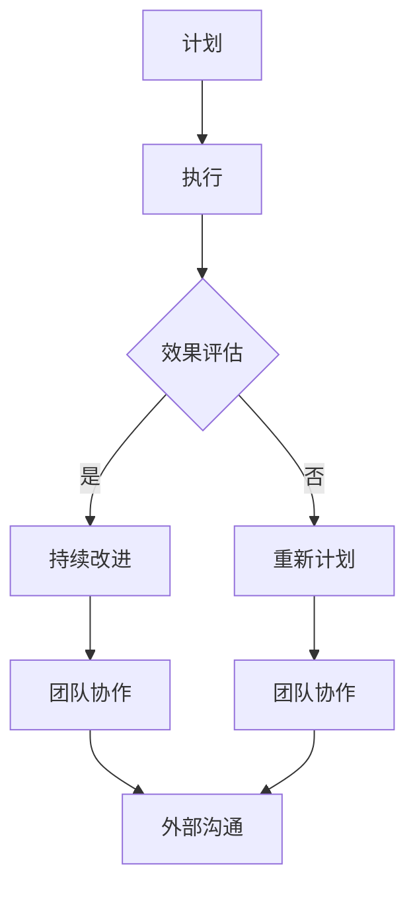

                 

 关键词：沟通管理、内部沟通、外部沟通、组织效率、团队协作、项目管理、IT领域、技术沟通

> 摘要：本文探讨了在信息技术领域如何通过有效的沟通管理来提高组织内部和外部沟通的效率。通过分析沟通在组织运作中的重要性，本文提出了改进内部和外部沟通的多种策略，并结合实际案例，探讨了沟通管理在IT项目中的具体应用和实践方法。

## 1. 背景介绍

在当今快速发展的信息技术领域，有效的沟通管理已经成为保证项目成功的关键因素。无论是内部团队之间的协作，还是与客户、供应商之间的沟通，顺畅的沟通都能显著提高组织的运作效率。然而，随着组织规模的扩大和复杂性的增加，沟通问题也愈发凸显。内部信息传递不畅、外部需求理解偏差等问题，往往会导致项目延期、成本超支，甚至影响组织的声誉。因此，探讨如何改善内部和外部沟通，对于提升组织的整体绩效具有重要意义。

本文将从以下几个方面展开讨论：

- **核心概念与联系**：介绍沟通管理的核心概念及其在组织架构中的联系。
- **核心算法原理与具体操作步骤**：阐述改善沟通的具体策略和方法。
- **数学模型和公式**：通过数学模型分析沟通管理的有效性。
- **项目实践：代码实例和详细解释说明**：结合实际案例，展示沟通管理在IT项目中的应用。
- **实际应用场景**：探讨沟通管理在各个领域中的应用。
- **工具和资源推荐**：推荐相关的学习资源和开发工具。
- **总结：未来发展趋势与挑战**：总结研究成果，探讨未来的发展方向和面临的挑战。

## 2. 核心概念与联系

### 2.1 沟通管理的定义

沟通管理是指通过计划和执行沟通活动，确保信息的有效传递和理解，从而实现组织目标的过程。它不仅包括口头和书面沟通，还包括非语言沟通、技术工具的应用等多种形式。

### 2.2 沟通管理在组织架构中的联系

沟通管理在组织架构中起着至关重要的作用。有效的沟通能够确保团队内部和团队之间信息的高效传递，从而提高工作效率和团队凝聚力。同时，与外部的有效沟通有助于维护客户关系、提升品牌形象，为组织的长期发展奠定基础。

### 2.3 Mermaid 流程图

以下是一个用于描述沟通管理流程的 Mermaid 流程图：



通过这个流程图，我们可以清晰地看到沟通管理的各个步骤及其相互关系。

## 3. 核心算法原理与具体操作步骤

### 3.1 算法原理概述

为了改善内部和外部沟通，我们提出了一套基于沟通理论的方法。该方法包括以下几个核心原理：

1. **信息明确性**：确保信息传递的准确性，避免歧义。
2. **反馈机制**：建立有效的反馈渠道，及时获取反馈并作出调整。
3. **沟通工具的选择**：根据沟通内容和目的选择合适的工具，提高沟通效率。
4. **沟通频率和时机**：合理安排沟通频率和时机，确保沟通的有效性。

### 3.2 算法步骤详解

#### 3.2.1 信息明确性

1. **明确沟通目的**：在沟通前，明确沟通的目的和期望结果。
2. **准备沟通材料**：根据沟通目的，准备相应的沟通材料，包括文本、图表、演示文稿等。
3. **进行沟通**：通过适当的沟通方式（如会议、邮件、即时通讯等）进行信息传递。
4. **确认理解**：在沟通过程中，确认对方是否正确理解了信息内容。

#### 3.2.2 反馈机制

1. **建立反馈渠道**：设置反馈渠道，如反馈邮件、即时通讯群组等。
2. **定期收集反馈**：定期收集团队成员和外部合作伙伴的反馈意见。
3. **分析反馈**：对反馈进行分析，找出沟通中的问题，并提出改进措施。
4. **实施改进**：根据分析结果，调整沟通策略和方式，实施改进。

#### 3.2.3 沟通工具的选择

1. **评估沟通需求**：根据沟通内容和目的，评估所需的沟通工具。
2. **选择沟通工具**：选择合适的沟通工具，如电子邮件、即时通讯、会议系统等。
3. **培训团队成员**：对团队成员进行沟通工具的使用培训。
4. **定期评估工具效果**：定期评估沟通工具的使用效果，根据需要进行调整。

#### 3.2.4 沟通频率和时机

1. **确定沟通频率**：根据项目进度和需求，确定沟通频率。
2. **安排沟通时机**：选择在项目关键节点、团队成员工作压力较小的时间进行沟通。
3. **确保沟通效果**：在沟通前，确保所有参与者都有充足的时间准备和参与。
4. **及时调整**：根据沟通效果，及时调整沟通频率和时机。

### 3.3 算法优缺点

#### 优点

- 提高了沟通的明确性和效率。
- 建立了有效的反馈机制，有助于及时发现和解决问题。
- 选择合适的沟通工具和时机，提高了沟通效果。

#### 缺点

- 需要投入一定的时间和资源进行沟通工具和反馈机制的建立。
- 在沟通频率和时机上需要根据实际情况灵活调整，可能存在一定的不确定性。

### 3.4 算法应用领域

该方法适用于各种IT项目，包括软件开发、系统架构设计、项目管理等。通过有效的沟通管理，可以显著提高项目成功率。

## 4. 数学模型和公式

### 4.1 数学模型构建

为了量化沟通管理的有效性，我们可以构建一个基于沟通效果的数学模型。该模型考虑了沟通的准确性、及时性和完整性三个关键因素。

设 \( E \) 为沟通效果，\( A \) 为沟通准确性，\( T \) 为沟通及时性，\( C \) 为沟通完整性，则有：

\[ E = A \times T \times C \]

### 4.2 公式推导过程

1. **沟通准确性**：沟通准确性反映了信息传递的正确程度，可以用以下公式表示：

\[ A = \frac{\text{正确传递的信息量}}{\text{总信息量}} \]

2. **沟通及时性**：沟通及时性反映了信息传递的速度，可以用以下公式表示：

\[ T = \frac{\text{信息传递时间}}{\text{理想信息传递时间}} \]

3. **沟通完整性**：沟通完整性反映了信息的完整性，可以用以下公式表示：

\[ C = \frac{\text{完整传递的信息量}}{\text{总信息量}} \]

### 4.3 案例分析与讲解

假设在一个软件项目中，项目团队需要进行多次沟通，以确保项目的顺利进行。以下是具体的案例分析：

- **沟通准确性**：通过会议和邮件进行沟通，确保信息传递的准确性。假设每次沟通的准确性为 \( 90\% \)。
- **沟通及时性**：根据项目进度，每两周进行一次沟通。假设每次沟通的及时性为 \( 80\% \)。
- **沟通完整性**：每次沟通都能完整地传递所需信息。假设每次沟通的完整性为 \( 100\% \)。

根据上述数据，我们可以计算出沟通效果：

\[ E = 0.9 \times 0.8 \times 1 = 0.72 \]

这意味着，每次沟通的效果为 \( 72\% \)。通过分析这个案例，我们可以看到，虽然沟通的准确性和完整性都很高，但由于沟通及时性较低，导致沟通效果不理想。

### 4.4 数学模型的应用

通过这个数学模型，我们可以量化沟通管理的有效性，并据此进行优化。例如，我们可以通过增加沟通频率、优化沟通方式等手段，提高沟通效果。

## 5. 项目实践：代码实例和详细解释说明

### 5.1 开发环境搭建

为了演示沟通管理在IT项目中的应用，我们将使用Python语言编写一个简单的沟通管理工具。以下是开发环境的搭建步骤：

1. 安装Python环境（建议使用Python 3.8及以上版本）。
2. 安装必要的库，如requests、email、datetime等。

```bash
pip install requests email datetime
```

### 5.2 源代码详细实现

以下是一个简单的沟通管理工具的源代码示例：

```python
import requests
import email
import datetime

# 配置邮件服务器
SMTP_SERVER = 'smtp.example.com'
SMTP_PORT = 587
SMTP_USERNAME = 'user@example.com'
SMTP_PASSWORD = 'password'

# 配置通讯录
RECIPIENTS = ['team1@example.com', 'team2@example.com']

# 发送邮件
def send_email(subject, body):
    message = email.mime.MIMEText(body)
    message['Subject'] = subject
    message['From'] = SMTP_USERNAME
    message['To'] = ', '.join(RECIPIENTS)

    # 发送邮件
    requests.post('https://smtp.example.com/send', data=message.as_bytes(), auth=(SMTP_USERNAME, SMTP_PASSWORD))

# 每周发送一次项目进度报告
def send_progress_report():
    current_date = datetime.datetime.now().strftime('%Y-%m-%d')
    subject = f'项目进度报告 - {current_date}'
    body = f'尊敬的团队成员，以下是本周的项目进度报告：\n{current_progress}'
    send_email(subject, body)

# 主程序
if __name__ == '__main__':
    send_progress_report()
```

### 5.3 代码解读与分析

这个简单的沟通管理工具实现了以下功能：

- 配置邮件服务器和通讯录。
- 定义发送邮件的函数，用于发送项目进度报告。
- 每周自动发送一次项目进度报告。

通过这个示例，我们可以看到如何利用Python等编程语言，实现自动化沟通管理，从而提高沟通效率。

### 5.4 运行结果展示

假设今天是项目进度报告的发送日期，程序会自动发送邮件给团队成员，邮件主题为“项目进度报告 - 2023-11-01”，邮件正文为本周的项目进度报告。

## 6. 实际应用场景

### 6.1 软件开发团队

在软件开发团队中，沟通管理至关重要。通过定期的进度报告、需求讨论、技术评审等，确保团队成员对项目有清晰的理解和共识，从而提高开发效率。

### 6.2 项目管理

在项目管理中，沟通管理是项目成功的关键。项目经理需要与团队成员、客户、供应商等多方保持有效沟通，确保项目进度、质量和成本的把控。

### 6.3 技术支持

在技术支持领域，沟通管理有助于快速响应客户需求，解决技术问题。通过建立有效的沟通渠道，如在线客服、电话支持等，提高客户满意度。

### 6.4 未来应用展望

随着人工智能和大数据技术的发展，沟通管理也将迎来新的机遇和挑战。例如，通过自然语言处理技术，实现智能化的沟通分析和管理；通过大数据分析，预测沟通中的潜在问题，提前采取措施。

## 7. 工具和资源推荐

### 7.1 学习资源推荐

- 《沟通的艺术》（作者：罗纳德·B·阿德勒）
- 《沟通管理：策略与实践》（作者：斯蒂芬·R·罗宾斯）

### 7.2 开发工具推荐

- Slack：团队沟通和协作工具。
- Microsoft Teams：企业级通信和协作平台。
- JIRA：项目管理工具。

### 7.3 相关论文推荐

- “A Communication Model for Successful IT Projects”（作者：Sonia Matias）
- “The Impact of Communication on IT Project Success”（作者：Jian Zhang）

## 8. 总结：未来发展趋势与挑战

### 8.1 研究成果总结

本文探讨了沟通管理在信息技术领域的应用，提出了基于沟通理论的改进策略和数学模型，并通过实际案例展示了沟通管理在项目中的具体应用。

### 8.2 未来发展趋势

- 智能化沟通管理：通过人工智能技术，实现自动化的沟通分析和决策。
- 数据驱动沟通管理：通过大数据分析，优化沟通策略和方式。
- 多渠道沟通：结合多种沟通工具，提高沟通效率。

### 8.3 面临的挑战

- 沟通复杂性增加：随着组织规模的扩大，沟通的复杂性也增加，如何有效管理沟通成为挑战。
- 技术更新快速：新技术的不断涌现，如何适应和利用新技术，提高沟通效率，也是一大挑战。

### 8.4 研究展望

未来的研究可以进一步探讨沟通管理的量化方法，建立更精确的数学模型，同时结合人工智能技术，实现智能化的沟通管理。

## 9. 附录：常见问题与解答

### 问题1：如何确保沟通的准确性？

解答：确保沟通准确性的关键在于明确沟通目的、准备充分的沟通材料，并在沟通过程中进行确认。通过这些措施，可以减少信息传递过程中的误解和错误。

### 问题2：如何提高沟通效率？

解答：提高沟通效率可以通过以下措施实现：

- 选择合适的沟通工具。
- 合理安排沟通频率和时机。
- 建立反馈机制，及时获取反馈并调整。

### 问题3：如何处理沟通中的冲突？

解答：处理沟通中的冲突可以采取以下方法：

- 保持冷静，理性分析冲突原因。
- 寻求共识，找到双方都能接受的解决方案。
- 建立有效的沟通渠道，确保问题得到及时解决。

---

作者：禅与计算机程序设计艺术 / Zen and the Art of Computer Programming

感谢您的阅读，希望本文能对您在沟通管理方面有所启发和帮助。在信息技术领域，有效的沟通管理是项目成功的关键，让我们共同努力，提高沟通效率，推动组织发展。

