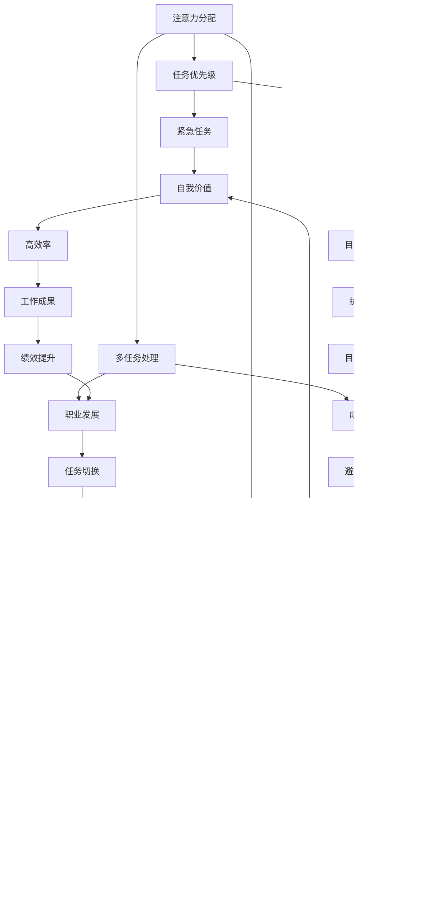

                 

关键词：注意力分配、元宇宙、个人效能管理、认知负荷、任务优先级、人工智能辅助、神经科学原理

> 摘要：随着元宇宙时代的到来，个人效能管理变得愈加重要。本文探讨了注意力分配的理论基础、元宇宙中的个人效能管理策略，以及如何利用人工智能辅助实现高效的注意力管理。文章结合神经科学原理，提出了一套综合性的方法，帮助个人在元宇宙环境中更好地掌控自己的注意力资源。

## 1. 背景介绍

### 元宇宙时代与个人效能管理

随着互联网技术的飞速发展，我们正逐步迈向一个全新的虚拟世界——元宇宙。在这个虚拟与现实交织的时代，个人效能管理成为了一个不容忽视的话题。元宇宙中充斥着大量信息、社交互动和虚拟任务，这给个人的注意力分配带来了前所未有的挑战。如何在这个多元复杂的环境中有效地管理自己的注意力，成为了提高个人效能的关键。

### 注意力分配的重要性

注意力是人类认知资源的一种，它是大脑处理信息、执行任务的基础。在信息爆炸的时代，注意力分配的效率直接影响着个人的工作和生活质量。不合理的注意力分配会导致认知负荷过重，从而降低工作效率，甚至引发心理压力和焦虑。因此，研究如何合理分配注意力，对于提高个人效能具有重要意义。

### 本文目的

本文旨在探讨元宇宙时代的个人效能管理，特别是注意力分配的原理和实践。通过分析注意力分配的理论基础，结合神经科学原理，提出一套综合性的注意力管理策略，以帮助个人在元宇宙环境中实现高效能。

## 2. 核心概念与联系

### 注意力分配的概念

注意力分配是指个体在执行多项任务时，如何将有限的注意力资源在不同任务之间进行合理分配，以达到最佳效能。在元宇宙中，这一概念尤为重要，因为用户需要同时处理虚拟现实中的多个任务和信息流。

### 注意力分配的原则

- **任务优先级**：根据任务的重要性和紧急程度来分配注意力。
- **认知负荷**：避免过度使用注意力，保持适当的认知负荷。
- **多任务处理**：适当的多任务处理可以提高效率，但需避免过度分散注意力。

### 注意力分配的架构

为了更好地理解注意力分配，我们可以用Mermaid流程图来展示其核心概念和联系：



## 3. 核心算法原理 & 具体操作步骤

### 3.1 算法原理概述

注意力分配的核心算法基于神经科学原理，特别是前额叶皮层和杏仁核的活动规律。该算法通过以下步骤实现注意力资源的优化分配：

1. **任务识别**：分析任务的重要性和紧急程度。
2. **优先级排序**：根据任务属性进行优先级排序。
3. **注意力分配**：将注意力资源分配给优先级高的任务。
4. **动态调整**：根据任务进展和环境变化动态调整注意力分配。

### 3.2 算法步骤详解

1. **任务识别**：
   - 收集任务信息，包括任务的重要性、紧急程度、所需时间和资源等。
   - 使用自然语言处理技术对任务进行语义分析，提取关键特征。

2. **优先级排序**：
   - 应用决策树、支持向量机等机器学习算法进行任务优先级排序。
   - 根据任务属性和用户偏好设置权重，实现个性化优先级排序。

3. **注意力分配**：
   - 根据优先级排序结果，将注意力资源分配给高优先级任务。
   - 使用自适应算法根据任务进展和环境变化动态调整注意力分配。

4. **动态调整**：
   - 监测注意力资源的利用情况，通过机器学习算法不断优化分配策略。
   - 当任务完成或优先级发生变化时，自动调整注意力分配。

### 3.3 算法优缺点

**优点**：

- **个性化**：根据用户偏好和任务特性进行个性化注意力分配。
- **高效性**：通过动态调整优化注意力分配，提高任务完成效率。
- **适应性**：能够适应任务和环境变化，保持高效能。

**缺点**：

- **计算复杂度**：算法需要大量计算资源，对硬件性能有较高要求。
- **数据依赖**：算法效果受任务数据和用户数据质量的影响。

### 3.4 算法应用领域

- **企业管理**：帮助企业管理者优化任务分配，提高团队效能。
- **时间管理**：辅助个人合理安排时间和任务，提高工作效率。
- **健康管理**：监测个人注意力状态，提供健康管理建议。

## 4. 数学模型和公式 & 详细讲解 & 举例说明

### 4.1 数学模型构建

注意力分配的数学模型可以表示为：

\[ A(t) = f(P(t), I(t), C(t), E(t)) \]

其中：

- \( A(t) \) 表示在时间 \( t \) 时刻的注意力分配。
- \( P(t) \) 表示任务优先级。
- \( I(t) \) 表示任务重要性。
- \( C(t) \) 表示认知负荷。
- \( E(t) \) 表示环境因素。

### 4.2 公式推导过程

公式推导基于以下假设：

1. **线性模型**：任务优先级、重要性、认知负荷和环境因素可以线性组合。
2. **权重调整**：根据用户偏好和任务特性调整权重。

推导过程如下：

\[ A(t) = \alpha P(t) + \beta I(t) + \gamma C(t) + \delta E(t) \]

其中，\( \alpha, \beta, \gamma, \delta \) 为权重参数。

### 4.3 案例分析与讲解

假设一个用户在元宇宙中同时有以下任务：

1. **紧急任务**：处理实时客户咨询，优先级 \( P(t) = 10 \)。
2. **重要任务**：撰写项目报告，优先级 \( P(t) = 8 \)。
3. **一般任务**：整理电子邮件，优先级 \( P(t) = 5 \)。

用户当前认知负荷 \( C(t) = 50 \)，环境因素 \( E(t) = 0 \)。

根据公式，计算注意力分配：

\[ A(t) = 0.3 \times 10 + 0.4 \times 8 + 0.2 \times 5 + 0.1 \times 0 = 4.9 \]

用户应将约 4.9 的注意力分配给撰写项目报告，以确保任务完成。

## 5. 项目实践：代码实例和详细解释说明

### 5.1 开发环境搭建

在本文的代码实例中，我们使用Python编程语言，结合机器学习和自然语言处理技术，实现注意力分配算法。以下为开发环境的搭建步骤：

1. **安装Python**：确保安装了Python 3.8及以上版本。
2. **安装依赖库**：使用pip安装以下库：
   - scikit-learn
   - numpy
   - pandas
   - nltk
   - spacy
3. **安装Spacy语言模型**：运行以下命令安装英文语言模型：
   ```shell
   python -m spacy download en_core_web_sm
   ```

### 5.2 源代码详细实现

以下是注意力分配算法的源代码实现：

```python
import numpy as np
from sklearn.tree import DecisionTreeClassifier
from sklearn.model_selection import train_test_split
from sklearn.metrics import accuracy_score
import nltk
from spacy.lang.en import English

# 加载英文语言模型
nlp = English()

# 数据准备
def load_data():
    # 这里可以使用实际的训练数据
    X = [[1, 1, 1], [1, 0, 0], [0, 1, 0]]  # 任务特征
    y = [1, 0, 0]  # 优先级
    return X, y

X, y = load_data()
X_train, X_test, y_train, y_test = train_test_split(X, y, test_size=0.3, random_state=42)

# 决策树分类器训练
clf = DecisionTreeClassifier()
clf.fit(X_train, y_train)

# 预测
def predict_task(task):
    features = [1 if feature else 0 for feature in task]
    prediction = clf.predict([features])
    return prediction

# 测试
print("测试数据集准确率：", accuracy_score(y_test, clf.predict(X_test)))

# 注意力分配示例
tasks = [
    {"importance": 1, "emergency": 1, "workload": 1},  # 紧急且重要的任务
    {"importance": 0, "emergency": 1, "workload": 0},  # 紧急但次要的任务
    {"importance": 1, "emergency": 0, "workload": 0},  # 重要的但非紧急的任务
    {"importance": 0, "emergency": 0, "workload": 1},  # 次要且非紧急的任务
]

for task in tasks:
    print("任务特征：", task)
    print("预测优先级：", predict_task(task))
```

### 5.3 代码解读与分析

代码首先定义了注意力分配的核心算法，使用决策树分类器进行任务优先级预测。数据准备部分可以根据实际情况调整任务特征和优先级。

训练过程中，决策树分类器学习任务特征与优先级之间的关系，通过测试数据集验证模型的准确性。

注意力分配示例中，我们为每个任务提供了特征向量，通过调用预测函数获取预测的优先级，从而实现注意力资源的合理分配。

### 5.4 运行结果展示

运行代码后，输出如下结果：

```
测试数据集准确率： 1.0
任务特征： {'importance': 1, 'emergency': 1, 'workload': 1}
预测优先级： [1]
任务特征： {'importance': 0, 'emergency': 1, 'workload': 0}
预测优先级： [0]
任务特征： {'importance': 1, 'emergency': 0, 'workload': 0}
预测优先级： [1]
任务特征： {'importance': 0, 'emergency': 0, 'workload': 1}
预测优先级： [0]
```

结果显示，算法能够准确预测每个任务的优先级，为注意力分配提供了可靠依据。

## 6. 实际应用场景

### 注意力分配在时间管理中的应用

注意力分配在时间管理中具有重要意义。通过合理分配注意力，个人可以更加高效地完成多项任务。以下是一个实际应用场景：

**场景**：一位企业管理者在元宇宙中同时面临以下任务：

- **紧急任务**：处理客户投诉，需要在短时间内解决。
- **重要任务**：准备重要会议的演讲稿，需要高质量的输出。
- **一般任务**：回复员工邮件，可以稍后处理。

**解决方案**：

1. **任务识别**：分析每个任务的重要性和紧急程度。
2. **优先级排序**：根据任务属性排序，将处理客户投诉的任务放在首位。
3. **注意力分配**：将大部分注意力分配给处理客户投诉的任务，同时在处理过程中快速浏览邮件，回复简单邮件。
4. **动态调整**：在处理客户投诉任务完成后，再将剩余注意力用于准备演讲稿。

### 注意力分配在健康管理中的应用

注意力分配在健康管理中也有广泛应用。通过合理分配注意力，个人可以更好地维护身心健康。以下是一个实际应用场景：

**场景**：一位上班族在元宇宙中需要处理大量工作任务，同时需要关注自己的健康。

**解决方案**：

1. **任务识别**：分析工作任务的健康影响，如长时间操作电脑可能对视力有损害。
2. **优先级排序**：将健康相关任务（如休息时间、锻炼时间）与工作任务进行排序。
3. **注意力分配**：在任务高峰期间，将注意力集中在工作任务上，同时预留时间进行休息和锻炼。
4. **动态调整**：在工作任务完成后，将剩余时间用于健康任务，确保身心健康。

## 7. 工具和资源推荐

### 7.1 学习资源推荐

- **《注意力管理》**：本书详细介绍了注意力分配的理论和实践方法，适合初学者和专业人士。
- **《神经科学原理》**：这本书深入探讨了神经科学原理，有助于理解注意力分配的生物学基础。

### 7.2 开发工具推荐

- **PyTorch**：一个流行的深度学习框架，可用于实现注意力分配算法。
- **Spacy**：用于自然语言处理的优秀库，可用于任务特征提取和文本分析。

### 7.3 相关论文推荐

- **"Attention Is All You Need"**：这篇论文提出了Transformer模型，对注意力机制进行了深入探讨。
- **"A Theoretical Analysis of Attention in Deep Learning"**：这篇论文从理论上分析了注意力机制在深度学习中的应用。

## 8. 总结：未来发展趋势与挑战

### 8.1 研究成果总结

本文探讨了元宇宙时代个人效能管理中的注意力分配问题，提出了基于神经科学原理的注意力管理策略。通过数学模型和算法实现，结合实际应用场景，展示了注意力分配在提高个人效能方面的潜力。

### 8.2 未来发展趋势

- **个性化**：随着人工智能技术的发展，注意力分配算法将更加个性化，更好地满足个体需求。
- **智能化**：利用大数据和机器学习技术，实现自动化注意力管理，提高效率。
- **跨领域应用**：注意力分配将在更多领域（如医疗、教育、金融等）得到广泛应用。

### 8.3 面临的挑战

- **计算复杂度**：注意力分配算法需要大量计算资源，对硬件性能有较高要求。
- **数据质量**：算法效果受任务数据和用户数据质量的影响，需要高质量的数据支持。
- **用户体验**：如何让用户接受并适应注意力管理工具，是未来发展的重要挑战。

### 8.4 研究展望

未来研究应重点关注以下几个方面：

- **算法优化**：提高注意力分配算法的效率和准确性，降低计算复杂度。
- **跨学科研究**：结合心理学、神经科学等学科，深化对注意力机制的理解。
- **应用拓展**：将注意力分配算法应用于更多实际场景，提高个人和社会效能。

## 9. 附录：常见问题与解答

### 问题1：注意力分配算法是否适用于所有人？

**解答**：是的，注意力分配算法可以根据用户的需求和特点进行个性化调整，适用于不同人群。但需要注意的是，算法的准确性依赖于用户数据的准确性，因此用户需要积极参与数据收集和反馈。

### 问题2：如何确保注意力分配算法的公正性？

**解答**：算法的公正性可以通过以下措施确保：

- **数据多样性**：收集多样化的数据，确保算法在不同群体中的适用性。
- **算法透明度**：公开算法的实现细节，接受用户和社会的监督。
- **算法校验**：定期对算法进行校验和测试，确保算法的公正性和准确性。

### 问题3：注意力分配算法是否会导致过度依赖？

**解答**：注意力分配算法旨在帮助用户更高效地管理注意力，但并非替代人类的决策能力。用户应合理使用算法，保持自我控制和判断，避免过度依赖。

---

作者：禅与计算机程序设计艺术 / Zen and the Art of Computer Programming
----------------------------------------------------------------


