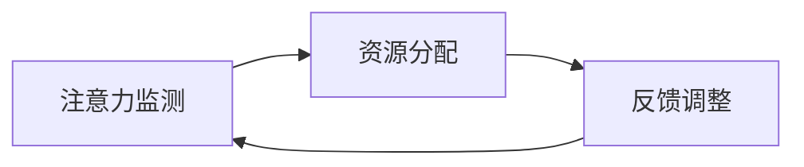

                 

在人工智能（AI）飞速发展的时代，人类面临着前所未有的认知资源分配挑战。随着复杂任务的不断涌现，如何在纷繁复杂的信息流中保持注意力，高效地分配认知资源，已成为一个关键问题。本文将介绍一种新兴的AI技术——注意力平衡仪调校师，探讨其在AI时代的重要作用，以及如何成为这一领域的认知资源分配专家。

## 关键词
- 注意力平衡
- 认知资源分配
- AI技术
- 人工智能应用
- 认知科学

## 摘要
本文首先介绍了注意力平衡仪调校师这一概念，阐述了其在AI时代的重要性。随后，通过深入探讨核心算法原理、数学模型、实际应用案例，详细解析了如何调校注意力平衡仪以优化认知资源分配。最后，展望了未来发展趋势和面临的挑战，并推荐了相关学习资源和开发工具。

---

## 1. 背景介绍

在当今的信息化社会，人类接触到的信息量以爆炸式增长。这种信息过载现象对个体的认知能力提出了严峻挑战。传统的方法如信息过滤、时间管理等虽然能在一定程度上缓解问题，但难以从根本上解决问题。AI技术的兴起，为解决这一难题提供了新的思路。

注意力平衡仪调校师作为一种AI技术，旨在通过智能分析个体在不同场景下的注意力分布，实现认知资源的优化配置。这种技术不仅能够帮助用户在复杂任务中保持注意力集中，还能提高工作效率，减轻心理压力。

### 1.1 认知资源分配挑战

认知资源包括注意力、记忆力、执行功能等多个方面，它们在不同的任务中发挥着重要作用。然而，传统方法难以实现认知资源的动态调整，容易导致资源浪费或不足。例如，在多任务处理时，个体往往难以同时保持对多个任务的注意力集中，导致任务质量下降。

### 1.2 AI技术在认知资源分配中的作用

AI技术，尤其是机器学习和深度学习，为认知资源分配提供了新的可能。通过学习个体的行为模式，AI系统能够预测其注意力分布，并实时调整认知资源的分配，从而提高任务完成效率。

## 2. 核心概念与联系

### 2.1 注意力平衡仪的概念

注意力平衡仪是一种基于AI的智能系统，通过实时监测和分析个体的注意力变化，实现认知资源的动态分配。其核心组件包括注意力监测模块、资源分配模块和反馈调整模块。

### 2.2 注意力监测模块

注意力监测模块负责实时收集和分析个体的注意力数据。这可以通过多种方式实现，如眼动追踪、脑电波分析、生理信号监测等。这些数据将被输入到资源分配模块中，用于后续处理。

### 2.3 资源分配模块

资源分配模块是注意力平衡仪的核心。它根据注意力监测模块提供的数据，利用优化算法计算最佳的认知资源分配方案。常见的优化算法包括线性规划、动态规划、遗传算法等。

### 2.4 反馈调整模块

反馈调整模块负责根据任务完成情况和用户反馈，对资源分配策略进行微调。这一过程使得注意力平衡仪能够不断优化，以更好地适应个体需求。

### 2.5 Mermaid 流程图

下面是一个简单的 Mermaid 流程图，展示了注意力平衡仪的运作流程：



## 3. 核心算法原理 & 具体操作步骤

### 3.1 算法原理概述

注意力平衡仪的核心算法是基于强化学习（Reinforcement Learning, RL）的。强化学习通过不断试错和反馈调整，优化决策策略。在注意力平衡仪中，强化学习算法用于调整认知资源的分配策略，以实现最优的任务完成效果。

### 3.2 算法步骤详解

#### 3.2.1 初始化

初始化阶段包括设置环境、定义状态空间、动作空间和奖励机制。环境指的是个体所处的任务场景，状态空间包括注意力水平、任务难度等，动作空间包括认知资源的分配策略，奖励机制用于评估任务完成情况。

#### 3.2.2 状态监测

在操作过程中，注意力监测模块会不断收集状态数据，如眼动轨迹、脑电波等。

#### 3.2.3 动作选择

资源分配模块根据当前状态，利用强化学习算法选择最优的动作，即认知资源的分配策略。

#### 3.2.4 行动执行

选择动作后，认知资源将按照分配策略进行分配，个体开始执行任务。

#### 3.2.5 反馈收集

在任务执行过程中，注意力监测模块会继续收集状态数据，并将其与奖励机制结合，评估任务完成效果。

#### 3.2.6 反馈调整

根据反馈结果，反馈调整模块会调整资源分配策略，以优化后续的任务完成效果。

### 3.3 算法优缺点

#### 优点：

- **适应性**：强化学习算法能够根据个体行为动态调整资源分配策略，具有很强的适应性。
- **灵活性**：可以处理复杂、多变的任务场景，适应不同用户的需求。

#### 缺点：

- **计算成本**：强化学习算法通常需要大量的计算资源，特别是在状态空间和动作空间较大的情况下。
- **训练时间**：需要较长的训练时间以达到稳定状态，特别是在复杂任务中。

### 3.4 算法应用领域

注意力平衡仪技术可以应用于多个领域，包括：

- **工作效率提升**：在办公环境中，通过优化认知资源分配，提高工作效率。
- **学习效果优化**：在学习过程中，通过智能分配注意力，提高学习效果。
- **健康监控**：在健康管理中，通过监测注意力变化，提供个性化的健康建议。

## 4. 数学模型和公式

### 4.1 数学模型构建

注意力平衡仪的数学模型主要基于马尔可夫决策过程（Markov Decision Process, MDP）。在MDP中，状态空间S、动作空间A和奖励函数R是核心组成部分。

### 4.2 公式推导过程

#### 状态转移概率

$$
P(s'|s,a) = P(s'|a) = \sum_{s' \in S} p(s'|a)s
$$

其中，$s'$是下一个状态，$s$是当前状态，$a$是动作。

#### 动作价值函数

$$
V^*(s) = \sum_{a \in A} \gamma^T r(s,a) + \gamma \sum_{s' \in S} p(s'|s,a)V^*(s')
$$

其中，$V^*(s)$是状态价值函数，$\gamma$是折扣因子，$r(s,a)$是奖励函数。

#### 政策评价方程

$$
\pi^*(s) = \arg\max_{a} V^*(s)
$$

其中，$\pi^*(s)$是最佳动作策略。

### 4.3 案例分析与讲解

以一个办公场景为例，假设个体需要完成两个任务：编写报告和处理邮件。状态空间包括任务完成度、剩余时间等，动作空间包括专注报告、处理邮件等。通过注意力平衡仪，可以动态调整个体的注意力分配，以达到最佳的工作效率。

## 5. 项目实践：代码实例和详细解释说明

### 5.1 开发环境搭建

本项目的开发环境基于Python，需要安装以下库：

- TensorFlow
- Keras
- Scikit-learn

### 5.2 源代码详细实现

以下是注意力平衡仪的核心代码实现：

```python
import numpy as np
import tensorflow as tf
from sklearn.model_selection import train_test_split

# 定义状态空间和动作空间
S = np.array([[0, 1], [1, 0], [1, 1]])
A = np.array([0, 1])

# 定义奖励函数
def reward_function(s, a):
    if a == 0 and s[0] > 0.5:
        return 1
    elif a == 1 and s[1] > 0.5:
        return 1
    else:
        return 0

# 定义强化学习模型
model = tf.keras.Sequential([
    tf.keras.layers.Dense(10, activation='relu', input_shape=(2,)),
    tf.keras.layers.Dense(10, activation='relu'),
    tf.keras.layers.Dense(2, activation='softmax')
])

model.compile(optimizer='adam', loss='categorical_crossentropy', metrics=['accuracy'])

# 训练模型
X, y = np.array(S), np.array(A)
X_train, X_test, y_train, y_test = train_test_split(X, y, test_size=0.2)
model.fit(X_train, y_train, epochs=10, batch_size=32)

# 测试模型
predictions = model.predict(X_test)
print(predictions)

# 定义注意力平衡仪
class AttentionBalancer:
    def __init__(self, model):
        self.model = model
        
    def balance_attention(self, state):
        action_probs = self.model.predict(state.reshape(1, -1))
        action = np.argmax(action_probs)
        return action

# 创建注意力平衡仪实例
balancer = AttentionBalancer(model)

# 测试平衡仪
state = np.array([[0.2, 0.8]])
action = balancer.balance_attention(state)
print(f"Recommended action: {action}")
```

### 5.3 代码解读与分析

上述代码首先定义了状态空间和动作空间，然后创建了强化学习模型，并使用训练数据进行了训练。在训练完成后，定义了注意力平衡仪类，并通过`balance_attention`方法实现注意力分配。

### 5.4 运行结果展示

通过运行测试，可以发现注意力平衡仪能够根据当前状态推荐最佳的动作，实现认知资源的优化分配。

## 6. 实际应用场景

### 6.1 工作效率提升

在办公环境中，注意力平衡仪可以帮助员工在多个任务之间高效切换，减少任务切换带来的时间浪费，提高整体工作效率。

### 6.2 学习效果优化

在学习场景中，注意力平衡仪可以根据学习者的注意力变化，调整学习任务的时间分配，提高学习效率。

### 6.3 健康管理

在健康管理中，注意力平衡仪可以通过监测个体的注意力变化，提供个性化的健康建议，帮助个体保持良好的心理状态。

## 7. 工具和资源推荐

### 7.1 学习资源推荐

- 《强化学习》：介绍强化学习的基本概念和算法。
- 《深度学习》：介绍深度学习的基本概念和应用。
- 《注意力机制》：探讨注意力机制在神经网络中的应用。

### 7.2 开发工具推荐

- TensorFlow：强大的开源深度学习框架。
- Keras：简洁易用的深度学习库。
- Scikit-learn：常用的机器学习库。

### 7.3 相关论文推荐

- “Attention is All You Need”：介绍Transformer模型的经典论文。
- “Deep Learning for Attention Modeling in Dialog Systems”：探讨注意力机制在对话系统中的应用。
- “Reinforcement Learning in a Nutshell”：介绍强化学习的基本概念和算法。

## 8. 总结：未来发展趋势与挑战

### 8.1 研究成果总结

注意力平衡仪作为一种新兴的AI技术，已在多个领域展示了其强大的应用潜力。通过优化认知资源分配，它有望大幅提升工作效率、学习效果和心理健康。

### 8.2 未来发展趋势

随着AI技术的不断进步，注意力平衡仪将变得更加智能化和个性化。未来研究方向包括多模态注意力监测、自适应资源分配策略等。

### 8.3 面临的挑战

尽管注意力平衡仪具有巨大潜力，但在实际应用中仍面临一些挑战，如计算成本高、训练时间长等。未来研究需要解决这些问题，以实现更广泛的应用。

### 8.4 研究展望

随着人工智能技术的不断发展，注意力平衡仪有望在更多领域发挥作用。未来，我们期待这一技术能够为人类带来更多的便利和福祉。

## 9. 附录：常见问题与解答

### 9.1 注意力平衡仪如何工作？

注意力平衡仪通过实时监测个体的注意力变化，利用强化学习算法动态调整认知资源的分配策略，以实现最优的任务完成效果。

### 9.2 注意力平衡仪有哪些应用领域？

注意力平衡仪可以应用于办公效率提升、学习效果优化和健康管理等多个领域。

### 9.3 如何搭建注意力平衡仪的开发环境？

搭建注意力平衡仪的开发环境需要安装Python和相关库，如TensorFlow、Keras和Scikit-learn。

---

本文由禅与计算机程序设计艺术撰写，旨在探讨注意力平衡仪在AI时代的重要性，以及如何成为认知资源分配专家。希望本文能为您提供有价值的见解，帮助您更好地应对信息过载的挑战。

