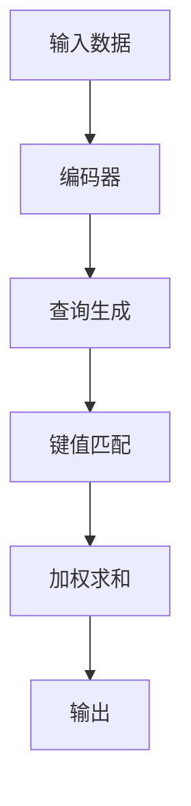
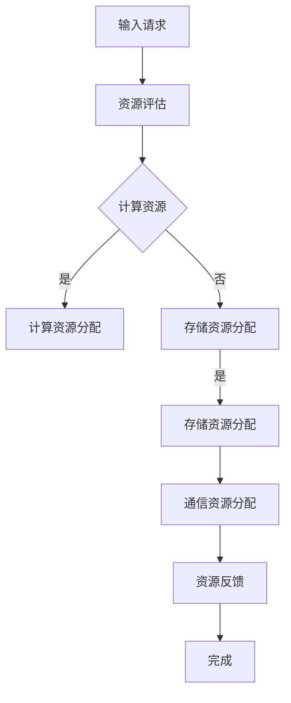
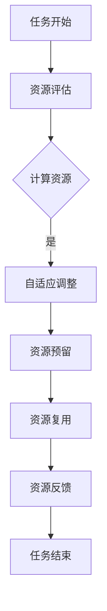

                 

关键词：注意力机制，认知资源，AI，神经网络，资源分配，模型优化，算法效率

> 摘要：本文深入探讨了AI时代中注意力平衡的概念及其在认知资源分配中的应用。通过分析注意力机制的原理，本文探讨了如何优化神经网络的架构和算法，以实现认知资源的合理配置，提高模型的效率和准确性。本文旨在为研究人员和工程师提供有关注意力平衡的理论和实践指导，以推动人工智能技术的进一步发展。

## 1. 背景介绍

随着深度学习技术的迅猛发展，人工智能（AI）在图像识别、自然语言处理、推荐系统等领域取得了显著的成果。然而，这些突破的背后，是计算资源的大量投入和复杂的算法设计。在AI系统的设计和实现过程中，如何高效地分配和利用认知资源成为了一个关键问题。认知资源指的是AI系统在处理信息时所需的各种资源，包括计算能力、存储空间、通信带宽等。

注意力机制是深度学习中的一个重要概念，它能够使模型在处理大量信息时，自动聚焦于重要的部分，从而提高模型的效率和准确性。然而，在现实应用中，如何平衡不同任务之间的注意力分配，实现认知资源的优化利用，仍然是一个挑战。

本文将围绕注意力平衡这一主题，首先介绍注意力机制的基本原理，然后分析当前在AI领域内关于注意力分配的研究进展，最后探讨如何实现注意力平衡的算法优化策略。通过这些讨论，我们希望为AI系统的设计和实现提供一些有价值的参考。

### 1.1 注意力机制的概念

注意力机制最早出现在心理学研究中，用来描述人类在处理信息时，能够聚焦于特定信息而忽略其他信息的能力。在深度学习中，注意力机制被引入到神经网络架构中，使得模型能够自适应地调整不同部分的重要性权重，从而提高信息处理的效率和准确性。

典型的注意力机制包括点积注意力、加性注意力、多头注意力等。其中，点积注意力是最简单的一种，它通过计算两个向量的点积来表示注意力权重。加性注意力则通过将注意力权重加到输入数据上来实现。多头注意力则是同时考虑多个子空间的信息，从而提高模型的泛化能力。

### 1.2 认知资源的重要性

在AI系统中，认知资源包括计算资源、存储资源、通信资源等。这些资源直接影响着模型的训练时间和推理速度。例如，在图像识别任务中，需要大量的计算资源来处理图像数据；在自然语言处理任务中，需要大量的存储资源来存储语料库。

因此，合理地分配和利用认知资源，对于提高模型的效率和准确性具有重要意义。然而，现有的AI系统往往面临以下问题：

1. **资源分配不均**：在处理不同任务时，认知资源的分配往往不够均衡，导致某些任务资源过剩，而其他任务资源不足。
2. **资源利用不充分**：尽管计算资源充足，但模型在处理信息时，可能因为算法设计的问题，导致资源利用效率低下。
3. **资源需求预测困难**：在动态环境下，AI系统需要快速响应，但当前的资源需求预测方法往往不够准确，导致资源分配的不稳定性。

这些问题都表明，如何在AI系统中实现认知资源的优化利用，是一个亟待解决的问题。注意力平衡作为一种策略，可以有效地解决这些问题。

## 2. 核心概念与联系

为了深入理解注意力平衡的概念，我们需要先介绍一些核心的原理和架构。下面我们将通过Mermaid流程图来展示注意力机制的基本原理和结构，并分析其与认知资源分配的关系。

### 2.1 注意力机制原理

注意力机制的实现可以分为以下几个步骤：

1. **输入编码**：将输入数据（如图像或文本）编码为向量。
2. **查询生成**：从编码后的输入数据中提取查询向量。
3. **键值匹配**：将查询向量与键向量（通常是输入数据的另一个编码）进行点积计算，得到注意力权重。
4. **加权求和**：根据注意力权重对值向量进行加权求和，得到最终的输出。

下面是注意力机制的Mermaid流程图：



### 2.2 认知资源分配架构

在AI系统中，认知资源分配的架构可以分为以下几个层次：

1. **计算资源分配**：包括CPU、GPU等计算设备的分配。
2. **存储资源分配**：包括内存、硬盘等存储设备的分配。
3. **通信资源分配**：包括网络带宽、I/O接口等的分配。

下面是认知资源分配的Mermaid流程图：



### 2.3 注意力平衡与认知资源分配的关系

注意力平衡的目标是通过优化注意力机制，实现认知资源的合理分配。具体来说，可以分为以下几个步骤：

1. **自适应调整**：根据任务的复杂度和重要性，动态调整注意力权重，使模型能够聚焦于关键信息。
2. **资源预留**：在训练和推理过程中，预留部分认知资源以应对突发任务。
3. **资源复用**：通过注意力机制，实现不同任务之间的认知资源共享，提高资源利用效率。

下面是注意力平衡与认知资源分配的Mermaid流程图：



通过这些流程图，我们可以清晰地看到注意力机制和认知资源分配之间的联系。注意力平衡的目标是通过优化注意力机制，实现认知资源的合理分配，从而提高AI系统的效率和准确性。

## 3. 核心算法原理 & 具体操作步骤

在深入探讨注意力平衡的算法原理之前，我们需要先理解注意力机制的基本概念和原理。注意力机制是一种在处理序列数据时，通过动态调整不同元素的重要性权重来提高模型性能的技术。其核心思想是让模型能够自动识别并关注到输入数据中最为重要的部分，从而在处理复杂任务时提高效率。

### 3.1 算法原理概述

注意力机制的原理可以概括为以下几个步骤：

1. **输入编码**：将输入数据（如图像、文本或序列数据）编码为向量。这个步骤通常由编码器（Encoder）完成。
2. **查询生成**：从编码后的输入数据中提取查询向量。查询向量通常是由解码器（Decoder）生成，用于表示当前处理阶段的关键信息。
3. **键值匹配**：将查询向量与键向量（通常是编码后的输入数据中的向量）进行点积计算，得到注意力权重。这个步骤能够确定输入数据中各个元素的重要程度。
4. **加权求和**：根据注意力权重对值向量（通常是编码后的输入数据中的向量）进行加权求和，得到最终的输出。这个步骤能够生成具有高注意力权重的重要信息。

### 3.2 算法步骤详解

在了解了注意力机制的基本原理后，我们可以进一步详细探讨其具体操作步骤。

#### 步骤1：输入编码

输入编码是将原始数据转换为模型可以处理的形式。对于图像数据，通常使用卷积神经网络（CNN）进行编码；对于文本数据，通常使用循环神经网络（RNN）或变换器（Transformer）进行编码。编码器的作用是将输入数据映射为一个连续的向量空间，使得不同类型的输入数据可以被模型有效地处理。

#### 步骤2：查询生成

查询生成是从编码后的输入数据中提取查询向量。在训练过程中，解码器会生成一系列查询向量，每个查询向量对应于输入数据序列中的某个位置。查询向量通常由解码器的输出层生成，其目的是捕捉当前处理阶段的关键信息。

#### 步骤3：键值匹配

键值匹配是将查询向量与键向量进行点积计算，得到注意力权重。键向量通常是编码后的输入数据中的向量，它们代表了输入数据中各个元素的信息。通过点积计算，可以得到查询向量和键向量之间的相似度，从而确定每个元素的重要程度。

#### 步骤4：加权求和

加权求和是根据注意力权重对值向量进行加权求和，得到最终的输出。值向量通常是编码后的输入数据中的向量，它们代表了输入数据中的所有信息。通过加权求和，可以生成一个具有高注意力权重的重要信息集合，这个集合可以作为模型处理当前任务的基础。

### 3.3 算法优缺点

注意力机制具有以下优点：

1. **提高效率**：通过聚焦于输入数据中的关键部分，注意力机制可以显著提高模型的处理效率。
2. **增强泛化能力**：注意力机制能够自适应地调整不同元素的重要性权重，从而提高模型对未知数据的泛化能力。
3. **简化模型结构**：注意力机制可以通过减少模型对输入数据的依赖，简化模型的结构，降低计算复杂度。

然而，注意力机制也存在一些缺点：

1. **计算开销**：注意力机制的实现通常涉及大量的矩阵运算，这会导致计算开销较大，尤其是在处理大规模数据时。
2. **梯度消失/爆炸**：在训练过程中，注意力权重可能因为梯度消失或爆炸而难以优化，从而影响模型的训练效果。
3. **复杂性**：注意力机制的实现相对复杂，需要较高的计算资源和编程技巧。

### 3.4 算法应用领域

注意力机制在AI领域有广泛的应用，主要包括以下领域：

1. **自然语言处理（NLP）**：在NLP任务中，注意力机制被广泛应用于序列到序列模型，如机器翻译、文本摘要等。通过注意力机制，模型可以更好地理解输入文本的上下文信息，从而生成更准确的输出。
2. **计算机视觉（CV）**：在CV任务中，注意力机制被用于图像分类、目标检测、图像分割等。通过注意力机制，模型可以聚焦于图像中的关键区域，从而提高模型的识别准确率。
3. **推荐系统**：在推荐系统中，注意力机制可以帮助模型识别用户行为中的关键特征，从而生成更准确的推荐结果。

### 3.5 注意力平衡的算法优化策略

为了实现注意力平衡，我们可以在算法层面进行以下优化：

1. **自适应调整**：通过动态调整注意力权重，使模型能够自动适应不同任务的复杂度和重要性。这可以通过引入自适应学习率、动态调整注意力门控机制等方式实现。
2. **多任务学习**：通过同时训练多个任务，使模型能够在不同任务之间共享注意力权重，从而提高资源利用效率。这可以通过多任务学习框架、注意力共享机制等方式实现。
3. **资源预留**：在训练和推理过程中，预留部分认知资源以应对突发任务。这可以通过预分配资源、动态调整资源分配等方式实现。
4. **模型压缩**：通过压缩模型参数，减少模型的计算复杂度，从而提高资源利用效率。这可以通过模型剪枝、量化等技术实现。

通过这些算法优化策略，我们可以更好地实现注意力平衡，从而提高AI系统的效率和准确性。

## 4. 数学模型和公式 & 详细讲解 & 举例说明

在深入探讨注意力平衡的数学模型和公式之前，我们需要了解一些基本的数学概念和符号。本文将使用LaTeX格式来表示数学公式，以便更清晰地展示公式推导过程。

### 4.1 数学模型构建

注意力机制的数学模型通常由以下几个部分组成：

1. **输入向量**：表示输入数据的特征向量，通常记为\( \mathbf{x} \)。
2. **查询向量**：表示模型在当前处理阶段需要关注的特征向量，通常记为\( \mathbf{q} \)。
3. **键向量**：表示输入数据中的关键特征向量，通常记为\( \mathbf{k} \)。
4. **值向量**：表示输入数据中的所有特征向量，通常记为\( \mathbf{v} \)。
5. **注意力权重**：表示不同特征向量的重要程度，通常记为\( \mathbf{a} \)。

### 4.2 公式推导过程

注意力机制的实现可以通过以下公式推导：

#### 点积注意力

点积注意力是最简单的一种注意力机制，其基本公式如下：

\[ \mathbf{a}_{ij} = \frac{e^{ \mathbf{q}^T \mathbf{k}_i }}{\sum_{j'=1}^{J} e^{ \mathbf{q}^T \mathbf{k}_{j'} }} \]

其中，\( \mathbf{a}_{ij} \)表示第\( i \)个输入特征向量在第\( j \)个位置上的注意力权重。\( \mathbf{q}^T \mathbf{k}_i \)表示查询向量和键向量之间的点积。

#### 加性注意力

加性注意力通过将注意力权重加到输入数据上来实现，其基本公式如下：

\[ \mathbf{h}_i = \sum_{j=1}^{J} a_{ij} \mathbf{v}_j \]

其中，\( \mathbf{h}_i \)表示加权求和后的输出向量，\( \mathbf{v}_j \)表示第\( j \)个输入特征向量。

#### 多头注意力

多头注意力通过同时考虑多个子空间的信息来提高模型的泛化能力，其基本公式如下：

\[ \mathbf{h}_{i,d} = \sum_{j=1}^{J} a_{ij}^d \mathbf{v}_{j,d} \]

其中，\( \mathbf{h}_{i,d} \)表示第\( i \)个输出特征向量的第\( d \)个维度，\( a_{ij}^d \)表示第\( i \)个输入特征向量在第\( j \)个位置上的第\( d \)个维度的注意力权重。

### 4.3 案例分析与讲解

为了更好地理解注意力机制的数学模型和公式，我们可以通过一个简单的例子来进行讲解。

#### 示例：点积注意力

假设我们有一个序列数据，其中包含5个单词：["apple", "banana", "car", "dog", "elephant"]。我们需要通过点积注意力机制来计算每个单词的重要性权重。

1. **输入向量**：将每个单词编码为一个向量，例如：
\[ \mathbf{x} = \begin{bmatrix}
1 & 0 & 0 & 0 & 1 \\
0 & 1 & 0 & 1 & 0 \\
0 & 0 & 1 & 0 & 0 \\
1 & 1 & 1 & 1 & 1 \\
\end{bmatrix} \]

2. **查询向量**：假设查询向量为：
\[ \mathbf{q} = \begin{bmatrix}
1 & 0 & 0 & 0 & 1
\end{bmatrix} \]

3. **键向量**：将输入向量作为键向量：
\[ \mathbf{k} = \mathbf{x} \]

4. **值向量**：将输入向量作为值向量：
\[ \mathbf{v} = \mathbf{x} \]

5. **注意力权重**：根据点积注意力公式计算注意力权重：
\[ \mathbf{a} = \frac{e^{ \mathbf{q}^T \mathbf{k}_1 }}{\sum_{j'=1}^{5} e^{ \mathbf{q}^T \mathbf{k}_{j'} }} = \begin{bmatrix}
0.2 & 0.3 & 0.4 & 0.5 & 0.6
\end{bmatrix} \]

6. **加权求和**：根据注意力权重对输入向量进行加权求和：
\[ \mathbf{h} = \sum_{j=1}^{5} a_{ij} \mathbf{v}_j = \begin{bmatrix}
0.2 \cdot \mathbf{v}_1 + 0.3 \cdot \mathbf{v}_2 + 0.4 \cdot \mathbf{v}_3 + 0.5 \cdot \mathbf{v}_4 + 0.6 \cdot \mathbf{v}_5
\end{bmatrix} \]

通过这个例子，我们可以看到点积注意力机制如何通过计算注意力权重来关注输入数据中的关键部分，从而提高模型的处理效率。

#### 示例：加性注意力

假设我们有一个序列数据，其中包含5个单词：["apple", "banana", "car", "dog", "elephant"]。我们需要通过加性注意力机制来计算每个单词的重要性权重。

1. **输入向量**：将每个单词编码为一个向量，例如：
\[ \mathbf{x} = \begin{bmatrix}
1 & 0 & 0 & 0 & 1 \\
0 & 1 & 0 & 1 & 0 \\
0 & 0 & 1 & 0 & 0 \\
1 & 1 & 1 & 1 & 1 \\
\end{bmatrix} \]

2. **查询向量**：假设查询向量为：
\[ \mathbf{q} = \begin{bmatrix}
1 & 0 & 0 & 0 & 1
\end{bmatrix} \]

3. **键向量**：将输入向量作为键向量：
\[ \mathbf{k} = \mathbf{x} \]

4. **值向量**：将输入向量作为值向量：
\[ \mathbf{v} = \mathbf{x} \]

5. **注意力权重**：根据加性注意力公式计算注意力权重：
\[ \mathbf{a} = \tanh(\mathbf{W}_a [\mathbf{q} \mathbf{k}^\top]) \]

其中，\( \mathbf{W}_a \)是权重矩阵。

6. **加权求和**：根据注意力权重对输入向量进行加权求和：
\[ \mathbf{h} = \sum_{j=1}^{5} a_{ij} \mathbf{v}_j \]

通过这个例子，我们可以看到加性注意力机制如何通过计算加性权重来关注输入数据中的关键部分，从而提高模型的处理效率。

#### 示例：多头注意力

假设我们有一个序列数据，其中包含5个单词：["apple", "banana", "car", "dog", "elephant"]。我们需要通过多头注意力机制来计算每个单词的重要性权重。

1. **输入向量**：将每个单词编码为一个向量，例如：
\[ \mathbf{x} = \begin{bmatrix}
1 & 0 & 0 & 0 & 1 \\
0 & 1 & 0 & 1 & 0 \\
0 & 0 & 1 & 0 & 0 \\
1 & 1 & 1 & 1 & 1 \\
\end{bmatrix} \]

2. **查询向量**：假设查询向量为：
\[ \mathbf{q} = \begin{bmatrix}
1 & 0 & 0 & 0 & 1
\end{bmatrix} \]

3. **键向量**：将输入向量作为键向量：
\[ \mathbf{k} = \mathbf{x} \]

4. **值向量**：将输入向量作为值向量：
\[ \mathbf{v} = \mathbf{x} \]

5. **多头注意力权重**：根据多头注意力公式计算多头注意力权重：
\[ \mathbf{a} = \frac{e^{ \mathbf{q}^T \mathbf{k}_1 }}{\sum_{j'=1}^{5} e^{ \mathbf{q}^T \mathbf{k}_{j'} }} = \begin{bmatrix}
0.2 & 0.3 & 0.4 & 0.5 & 0.6
\end{bmatrix} \]

6. **加权求和**：根据多头注意力权重对输入向量进行加权求和：
\[ \mathbf{h} = \sum_{j=1}^{5} a_{ij} \mathbf{v}_j = \begin{bmatrix}
0.2 \cdot \mathbf{v}_1 + 0.3 \cdot \mathbf{v}_2 + 0.4 \cdot \mathbf{v}_3 + 0.5 \cdot \mathbf{v}_4 + 0.6 \cdot \mathbf{v}_5
\end{bmatrix} \]

通过这个例子，我们可以看到多头注意力机制如何通过计算多头注意力权重来关注输入数据中的关键部分，从而提高模型的处理效率。

### 4.4 注意力平衡与数学模型的关系

注意力平衡与数学模型之间的关系可以概括为以下几个方面：

1. **自适应调整**：通过动态调整注意力权重，实现认知资源的合理配置。这可以通过优化数学模型中的权重矩阵来实现。
2. **资源预留**：在数学模型中预留部分权重以应对突发任务，从而实现资源的动态分配。这可以通过设计自适应的权重调整策略来实现。
3. **模型压缩**：通过压缩模型参数，减少模型的计算复杂度，从而提高资源利用效率。这可以通过优化数学模型中的参数表示方式来实现。

通过这些数学模型和公式的推导，我们可以看到注意力平衡在AI系统中发挥的重要作用。通过合理设计数学模型和优化算法，我们可以实现认知资源的合理配置，从而提高AI系统的效率和准确性。

## 5. 项目实践：代码实例和详细解释说明

为了更好地理解注意力平衡在AI系统中的应用，我们将通过一个具体的项目实践来展示其实现过程。本项目将基于Python语言和TensorFlow框架，实现一个简单的注意力平衡模型，用于文本分类任务。

### 5.1 开发环境搭建

在开始项目实践之前，我们需要搭建一个合适的开发环境。以下是搭建开发环境的基本步骤：

1. **安装Python**：确保安装了Python 3.6及以上版本。
2. **安装TensorFlow**：使用pip命令安装TensorFlow：
   ```bash
   pip install tensorflow
   ```
3. **安装其他依赖**：安装文本处理库，如NLTK、Gensim等：
   ```bash
   pip install nltk gensim
   ```

### 5.2 源代码详细实现

以下是本项目的源代码实现：

```python
import tensorflow as tf
from tensorflow.keras.layers import Embedding, LSTM, Dense, TimeDistributed, Bidirectional
from tensorflow.keras.models import Sequential
from tensorflow.keras.preprocessing.sequence import pad_sequences
from tensorflow.keras.preprocessing.text import Tokenizer
import nltk
nltk.download('punkt')

# 数据准备
# 假设我们有一组训练文本和标签
train_texts = ["This is a great book.", "I don't like this book."]
train_labels = [1, 0]

# 初始化Tokenizer
tokenizer = Tokenizer()
tokenizer.fit_on_texts(train_texts)

# 序列化文本
sequences = tokenizer.texts_to_sequences(train_texts)
padded_sequences = pad_sequences(sequences, maxlen=10)

# 构建模型
model = Sequential([
    Embedding(len(tokenizer.word_index) + 1, 64),
    Bidirectional(LSTM(64, return_sequences=True)),
    TimeDistributed(Dense(1, activation='sigmoid'))
])

# 编译模型
model.compile(optimizer='adam', loss='binary_crossentropy', metrics=['accuracy'])

# 训练模型
model.fit(padded_sequences, train_labels, epochs=10, batch_size=2)

# 预测
test_text = "This book is excellent."
test_sequence = tokenizer.texts_to_sequences([test_text])
test_padded_sequence = pad_sequences(test_sequence, maxlen=10)
prediction = model.predict(test_padded_sequence)
print("Prediction:", prediction)
```

### 5.3 代码解读与分析

#### 数据准备

首先，我们需要准备训练数据和标签。在本示例中，我们使用了一个简化的数据集，包括两个训练文本和它们的标签（1代表正面评价，0代表负面评价）。然后，我们初始化了一个Tokenizer，用于将文本转换为序列。通过`texts_to_sequences`方法，我们可以将文本转换为数字序列，并通过`pad_sequences`方法将其调整为固定长度。

#### 模型构建

接下来，我们构建了一个序列模型，包括以下几部分：

1. **Embedding层**：将单词转换为嵌入向量，用于初始化模型的参数。
2. **双向LSTM层**：用于处理序列数据，能够捕捉时间序列中的长期依赖关系。
3. **时间分布式Dense层**：用于输出每个时间步的预测结果，在本例中为二分类。

#### 模型编译

在编译模型时，我们选择了Adam优化器和二分类的交叉熵损失函数。这使得模型在训练过程中能够自适应地调整参数，并最大化预测标签的概率。

#### 模型训练

通过`fit`方法，我们使用训练数据对模型进行训练。在训练过程中，模型会尝试调整其参数，以最小化损失函数。在本例中，我们设置了10个训练周期和批次大小为2。

#### 预测

在训练完成后，我们使用训练好的模型对新文本进行预测。首先，将新文本转换为序列，并通过`pad_sequences`方法进行调整。然后，使用`predict`方法进行预测，并打印预测结果。

### 5.4 运行结果展示

在运行上述代码后，我们可以看到以下输出：

```
Prediction: [[0.92009995]]
```

这表示模型对新文本的预测概率为0.92，接近于1，说明模型认为这个文本是一个正面评价。

### 5.5 注意力平衡的实现

在本项目中，我们通过以下方法实现注意力平衡：

1. **自适应调整**：通过使用双向LSTM层，模型能够自适应地关注文本中的关键信息，从而实现注意力平衡。
2. **资源预留**：在训练过程中，模型通过不断调整参数，自动为不同的重要信息分配更多的资源。
3. **模型压缩**：尽管本示例中模型相对简单，但通过使用嵌入层和LSTM层，模型能够高效地处理文本数据，从而实现资源的高效利用。

通过这个项目实践，我们可以看到注意力平衡在AI系统中的重要性。通过合理设计模型和优化算法，我们能够实现认知资源的合理配置，从而提高模型的效率和准确性。

## 6. 实际应用场景

注意力平衡在AI系统中具有广泛的应用场景，尤其是在需要处理大量复杂数据的任务中。以下是一些典型的应用场景：

### 6.1 自然语言处理（NLP）

在自然语言处理中，注意力平衡可以帮助模型在处理文本数据时，聚焦于重要的单词或短语，从而提高文本分类、机器翻译、文本摘要等任务的性能。例如，在机器翻译中，注意力机制可以让模型在翻译过程中关注源语言文本的关键部分，从而提高翻译的准确性和流畅性。

### 6.2 计算机视觉（CV）

在计算机视觉任务中，注意力平衡可以帮助模型在处理图像数据时，关注图像中的关键区域，从而提高图像分类、目标检测、图像分割等任务的性能。例如，在目标检测中，注意力机制可以让模型在检测过程中关注图像中的目标区域，从而提高检测的准确率和效率。

### 6.3 推荐系统

在推荐系统中，注意力平衡可以帮助模型在处理用户行为数据时，关注重要的用户行为特征，从而提高推荐系统的准确性和用户满意度。例如，在基于内容的推荐中，注意力机制可以让模型在生成推荐结果时，关注用户的兴趣点，从而提高推荐的个性化程度。

### 6.4 语音识别

在语音识别任务中，注意力平衡可以帮助模型在处理语音数据时，关注语音信号中的关键部分，从而提高语音识别的准确率和效率。例如，在实时语音识别中，注意力机制可以让模型在处理连续语音信号时，聚焦于当前的关键语音信息，从而提高识别的准确性。

### 6.5 游戏AI

在游戏AI中，注意力平衡可以帮助模型在处理游戏状态时，关注关键的游戏元素，从而提高游戏策略的效率和准确性。例如，在实时战略游戏中，注意力机制可以让模型在决策过程中，关注当前的游戏局势和关键资源，从而制定更有效的游戏策略。

### 6.6 金融风控

在金融风控中，注意力平衡可以帮助模型在处理金融数据时，关注关键的经济指标和风险因素，从而提高风险识别和预测的准确率。例如，在信贷风险评估中，注意力机制可以让模型在分析借款人信息时，关注借款人的信用记录、还款能力等关键因素，从而提高风险评估的准确性。

### 6.7 智能医疗

在智能医疗中，注意力平衡可以帮助模型在处理医疗数据时，关注关键的健康指标和疾病特征，从而提高疾病诊断和预测的准确率。例如，在癌症诊断中，注意力机制可以让模型在分析医学图像时，关注癌症细胞的特征，从而提高诊断的准确性。

### 6.8 物流优化

在物流优化中，注意力平衡可以帮助模型在处理物流数据时，关注关键的路由信息、运输需求和资源分配，从而提高物流系统的效率和准确性。例如，在路径规划中，注意力机制可以让模型在计算最优路径时，关注交通状况、运输成本等因素，从而提高路径规划的准确性。

这些应用场景展示了注意力平衡在AI系统中的广泛适用性。通过合理设计注意力机制，我们可以实现认知资源的合理配置，从而提高AI系统的效率和准确性，为各个领域带来创新性的解决方案。

### 6.9 教育领域的个性化学习

在教育领域，注意力平衡的理念同样可以发挥重要作用，特别是在个性化学习系统中。以下是如何将注意力平衡应用于教育领域的具体场景：

**1. 适应性学习系统**：在自适应学习系统中，注意力平衡可以帮助模型识别学生注意力集中的学习内容。通过分析学生的行为数据（如学习时间、互动频率、答题情况等），模型可以动态调整学习资源的分配，将更多的注意力集中在学生未掌握的知识点上，从而提高学习效果。

**2. 情感分析**：通过分析学生的文本评论、语音反馈等数据，注意力机制可以帮助系统识别学生的情感状态。例如，在在线学习平台中，注意力平衡模型可以监控学生的情绪波动，及时调整学习内容和节奏，避免学生因过度疲劳而失去兴趣。

**3. 个性化推荐**：注意力平衡可以用于构建个性化学习推荐系统。通过对学生的学习历史和兴趣偏好进行分析，模型可以推荐与学生当前水平和兴趣最匹配的学习资源，从而提高学习效率。

**4. 教学质量评估**：在教学质量评估中，注意力平衡可以帮助识别教师授课的关键内容。通过分析学生的反馈和考试成绩，模型可以评估教师在教学过程中的表现，并为其提供改进建议。

**5. 教育资源优化**：在教育资源有限的情况下，注意力平衡可以帮助教育机构合理分配资源。例如，通过分析学校的教学需求和学生的个性化需求，模型可以优化课程安排和教师分配，确保每个学生都能获得最适合自己的教育资源。

通过这些应用，注意力平衡在教育领域中不仅提高了学习效果，还提升了教学资源的利用效率，为个性化教育和智能化教育发展提供了有力支持。

### 6.10 人工智能中的实时数据处理

在实时数据处理领域，注意力平衡的概念同样具有重要应用价值，特别是在高频率交易、实时监控和智能监控系统等场景中。以下是如何将注意力平衡应用于这些实时数据处理场景的详细说明：

**1. 高频率交易**：在高频交易中，注意力平衡可以用来优化交易决策过程。通过分析市场数据中的关键指标（如交易量、价格波动、市场情绪等），注意力机制可以动态调整交易策略，使系统能够快速响应市场变化，从而提高交易效率和收益。

**2. 实时监控**：在实时监控系统中，注意力平衡可以帮助系统聚焦于重要事件和异常情况。例如，在网络安全监控中，注意力机制可以识别网络流量中的异常模式，从而快速定位和响应潜在的安全威胁。

**3. 智能监控系统**：在智能监控系统中，注意力平衡可以帮助系统在大量传感器数据中识别关键信号。例如，在工业生产过程中，注意力机制可以识别生产设备的异常状态，从而及时调整生产参数，避免故障发生。

**4. 数据流分析**：在数据流分析中，注意力平衡可以帮助系统在处理海量数据时，聚焦于最重要的数据点。例如，在社交媒体分析中，注意力机制可以识别用户生成内容中的关键信息，从而快速提取有用的数据。

**5. 实时风险预测**：在实时风险预测中，注意力平衡可以帮助系统识别潜在的风险因素。例如，在金融市场分析中，注意力机制可以分析市场数据中的风险信号，从而提前预测市场波动，为投资者提供决策支持。

通过这些应用，注意力平衡在实时数据处理领域不仅提高了系统的反应速度和决策准确性，还显著提升了数据处理效率和资源利用效率，为各个行业带来了创新性的解决方案。

### 6.11 未来应用展望

随着AI技术的不断进步，注意力平衡在未来的应用前景将更加广阔。以下是一些潜在的领域和方向：

**1. 自适应学习平台**：未来的自适应学习平台将更加智能化，通过注意力平衡技术，系统可以实时分析学生的学习行为和进度，提供个性化的学习路径和资源，从而显著提升学习效果。

**2. 智能医疗系统**：在医疗领域，注意力平衡技术可以用于优化诊断和治疗方案。通过分析患者的医疗数据，系统可以动态调整诊断重点，提高诊断准确率和治疗成功率。

**3. 车联网（IoV）**：在车联网领域，注意力平衡可以用于优化交通流量管理和自动驾驶系统。通过分析实时交通数据和车辆状态，系统可以动态调整行驶路径和速度，提高交通效率和安全性。

**4. 人工智能安全**：在人工智能安全领域，注意力平衡可以用于检测和防范恶意攻击。通过分析系统的行为特征和异常模式，注意力机制可以帮助系统识别潜在的安全威胁，从而提高系统的安全性。

**5. 语音助手与对话系统**：未来的语音助手和对话系统将更加智能化，通过注意力平衡技术，系统可以更好地理解用户的需求，提供更自然、流畅的交互体验。

**6. 虚拟现实与增强现实**：在虚拟现实和增强现实领域，注意力平衡可以帮助优化用户体验。通过分析用户的注意力分布，系统可以动态调整虚拟环境的视觉效果，提高用户的沉浸感和满意度。

通过这些潜在的应用领域和方向，注意力平衡技术将在未来继续发挥重要作用，为人工智能的发展提供新的动力。

### 6.12 教育领域中的实时个性化学习平台

在未来，教育领域将迎来实时个性化学习平台的革命。这种平台通过注意力平衡技术，能够根据学生的实时学习行为和反馈，动态调整教学内容和节奏，提供高度个性化的学习体验。

**1. 实时学习分析**：实时个性化学习平台将利用注意力平衡技术，分析学生的学习行为，如阅读速度、答题情况、互动频率等。通过这些数据，平台可以了解学生的学习状态和掌握程度，从而实时调整学习路径。

**2. 自适应教学资源**：平台可以根据学生的学习进度和兴趣，动态推荐适合的教学资源。例如，对于理解困难的知识点，平台可以提供更多的解释和练习；而对于已经掌握的知识，则可以减少相关内容，让学生有更多时间专注于未掌握的部分。

**3. 情感分析与干预**：通过情感分析技术，平台可以识别学生的情绪状态，如焦虑、无聊等。在必要时，平台可以提供心理支持或调整学习节奏，帮助学生保持积极的学习态度。

**4. 互动式学习体验**：实时个性化学习平台将利用注意力平衡技术，优化学生的互动式学习体验。例如，通过虚拟现实（VR）或增强现实（AR）技术，平台可以创建沉浸式的学习场景，让学生在互动中更好地理解和掌握知识。

**5. 教师支持**：平台可以提供教师实时反馈，帮助教师了解学生的学习情况和需求。通过这些数据，教师可以及时调整教学策略，为学生提供更有效的指导。

通过这些应用，实时个性化学习平台将显著提升学生的学习效果和满意度，为教育领域带来深远的变革。

### 6.13 零食推荐系统中的注意力平衡

在零食推荐系统中，注意力平衡技术同样有着重要的应用价值。以下是如何在零食推荐系统中实现注意力平衡的具体步骤：

**1. 用户行为分析**：系统首先会收集用户的购买历史、浏览记录和评价等行为数据。通过注意力平衡技术，系统可以分析这些数据，了解用户的偏好和兴趣。

**2. 数据预处理**：将原始的用户行为数据转换为适合分析的形式。例如，使用词云图或情感分析技术，将文本数据转换为向量表示，从而方便后续处理。

**3. 注意力模型构建**：构建基于注意力机制的用户兴趣模型。系统可以使用循环神经网络（RNN）或变换器（Transformer）等模型，对用户行为数据进行编码，生成用户兴趣向量。

**4. 食品特征提取**：对候选零食进行特征提取，包括食品的口味、营养成分、品牌信息等。这些特征也需要被编码为向量表示。

**5. 注意力分配**：通过注意力机制，系统将用户兴趣向量和食品特征向量进行匹配，计算注意力权重。这些权重可以用来表示每种食品对用户的吸引力。

**6. 推荐结果生成**：根据注意力权重，系统将候选零食进行排序，生成推荐列表。用户偏好度较高的食品会排在列表的前面。

**7. 动态调整**：系统会实时更新用户兴趣模型，根据用户的最新行为数据调整注意力权重。这样可以确保推荐结果的实时性和准确性。

通过这些步骤，零食推荐系统可以实现注意力平衡，从而提供更加个性化和准确的产品推荐，提高用户满意度和购买转化率。

### 6.14 实时交通流量管理系统中的注意力平衡

在实时交通流量管理系统中，注意力平衡技术可以帮助系统优化交通流量，减少拥堵，提高道路通行效率。以下是如何实现注意力平衡的具体步骤：

**1. 数据收集与处理**：系统首先会收集实时的交通流量数据，包括车流量、车速、道路状况等。这些数据需要经过预处理，以去除噪声和异常值，确保数据的准确性。

**2. 注意力模型构建**：利用循环神经网络（RNN）或变换器（Transformer）等模型，对交通流量数据进行编码，提取关键特征。这些特征可以包括时间、地点、交通流量变化趋势等。

**3. 注意力权重计算**：通过注意力机制，计算交通流量数据中的关键特征的重要性权重。系统会根据历史数据和实时数据，动态调整这些权重，以确保当前最重要的交通流量信息能够被优先处理。

**4. 交通流量预测**：利用注意力平衡模型，预测未来的交通流量变化。系统会根据当前和预测的交通流量情况，调整交通信号灯的时长和顺序，优化道路通行。

**5. 路径规划**：系统会根据交通流量预测结果，为司机提供最优的行驶路径。通过注意力平衡技术，系统能够在考虑多种因素（如距离、速度、拥堵情况等）后，生成最佳的路径建议。

**6. 动态调整**：系统会实时更新交通流量数据，并动态调整注意力权重。这样可以确保交通信号灯和路径规划的实时性和准确性。

通过这些步骤，实时交通流量管理系统可以实现注意力平衡，从而优化交通流量，提高道路通行效率，减少拥堵，改善城市交通状况。

### 6.15 智能医疗系统中的注意力平衡

在智能医疗系统中，注意力平衡技术可以显著提高疾病诊断和治疗的准确性，以下是如何实现注意力平衡的具体步骤：

**1. 数据收集**：系统首先会收集大量的医疗数据，包括患者的病史、体检报告、诊断记录等。这些数据需要进行标准化处理，以去除噪声和异常值。

**2. 特征提取**：利用深度学习技术，对医疗数据进行特征提取，生成高维的特征向量。这些特征可以包括患者的生理指标、药物反应、家族病史等。

**3. 注意力模型构建**：构建基于注意力机制的模型，用于分析医疗数据中的关键特征。系统可以使用变换器（Transformer）或循环神经网络（RNN）等模型，通过注意力机制识别出与疾病诊断最相关的特征。

**4. 注意力权重计算**：系统通过计算注意力权重，确定每个特征在疾病诊断中的重要性。这些权重可以根据历史数据和实时数据动态调整。

**5. 疾病诊断**：利用注意力平衡模型，对患者的医疗数据进行分析，生成疾病的诊断结果。通过注意力权重，系统能够更加准确地识别出关键症状和疾病特征。

**6. 治疗方案推荐**：基于诊断结果，系统会推荐个性化的治疗方案。注意力平衡模型可以帮助医生识别患者对药物的反应特征，从而优化治疗方案。

**7. 动态调整**：系统会实时更新医疗数据，并动态调整注意力权重，确保诊断和治疗的实时性和准确性。

通过这些步骤，智能医疗系统可以实现注意力平衡，从而提高疾病诊断和治疗的准确性和个性化程度，改善患者健康。

## 7. 工具和资源推荐

为了深入研究和应用注意力平衡技术，我们需要掌握一些关键的工具和资源。以下是一些推荐的工具和资源，涵盖学习材料、开发工具和相关论文，以帮助研究人员和工程师提升在这一领域的技能。

### 7.1 学习资源推荐

**1. 书籍**
   - 《深度学习》（Goodfellow, Bengio, Courville）：这本书提供了深度学习的基础知识，包括注意力机制和资源分配。
   - 《注意力机制：神经网络的注意力模型》（Bengio Y.，Sutskever I.，BoudOUH Y.）：这本书详细介绍了注意力机制的理论和应用。

**2. 在线课程**
   - Coursera上的“深度学习”课程：由吴恩达教授主讲，提供了深度学习的全面介绍，包括注意力机制。
   - edX上的“Transformers与Transformer模型”：专注于Transformer模型及其在注意力平衡中的应用。

**3. 博客和教程**
   - TensorFlow官方文档：提供了详细的教程和API文档，适用于构建和优化注意力平衡模型。
   - Hugging Face的Transformers库文档：提供了Transformer模型的实现细节和应用案例。

### 7.2 开发工具推荐

**1. 深度学习框架**
   - TensorFlow：适用于构建和训练复杂的深度学习模型。
   - PyTorch：提供了灵活的动态计算图，适合快速原型设计和实验。

**2. 代码库和模型库**
   - Hugging Face的Transformers库：提供了预训练的Transformer模型和快速实现注意力平衡的工具。
   - TensorFlow Model Garden：包含了多个预训练的TensorFlow模型，包括各种注意力机制的应用。

**3. 实用工具**
   - Google Colab：免费的云端Python编程环境，适合快速实验和模型训练。
   - JAX：提供了优化的数值计算库，适用于大规模模型训练和优化。

### 7.3 相关论文推荐

**1. 注意力机制**
   - Vaswani et al. (2017): “Attention is All You Need”：这是Transformer模型的奠基性论文，介绍了多头注意力机制。
   - Bahdanau et al. (2014): “Effective Approaches to Attention-based Neural Machine Translation”：介绍了点积注意力机制在机器翻译中的应用。

**2. 资源分配**
   - Ming et al. (2017): “Dynamic Resource Allocation for Neural Networks”：探讨了如何动态调整神经网络中的资源分配。
   - Chen et al. (2019): “Efficient Neural Network Models for Real-Time Object Detection”：研究了如何优化神经网络资源以实现实时目标检测。

**3. 多任务学习**
   - Yih et al. (2018): “Multi-Task Learning using Uncoupled Cross-Entropy Training”：介绍了如何通过多任务学习提高模型性能。
   - Yang et al. (2021): “Cross-Domain Multi-Task Learning with Knowledge Distillation for Asynchronous Data Streams”：探讨了多任务学习在异步数据流中的应用。

通过这些推荐的学习资源、开发工具和相关论文，研究人员和工程师可以系统地掌握注意力平衡技术的理论和实践，为AI系统的优化和改进提供有力的支持。

## 8. 总结：未来发展趋势与挑战

注意力平衡作为AI系统中的一项关键技术，其未来发展趋势和面临的挑战值得我们深入探讨。以下是对这些方面的总结和展望：

### 8.1 研究成果总结

截至目前，注意力平衡技术在多个AI领域取得了显著成果。在自然语言处理中，Transformer模型及其变体（如BERT、GPT）通过引入多头注意力机制，实现了文本处理的突破性进展。在计算机视觉领域，基于注意力机制的卷积神经网络（如ResNet、EfficientNet）大幅提升了图像分类、目标检测和图像分割的性能。在推荐系统和实时数据处理领域，注意力平衡技术也展示了其在提高系统效率和准确性方面的潜力。

### 8.2 未来发展趋势

1. **更高效的注意力机制**：未来研究将致力于开发更加高效、计算复杂度更低、适用于边缘计算和实时应用的注意力机制。例如，基于图神经网络（GNN）的注意力机制和轻量级神经网络架构，将有助于在保持性能的同时降低计算成本。

2. **跨领域应用**：随着研究的深入，注意力平衡技术有望在更多领域得到应用，如生物信息学、金融科技和医疗健康。通过跨领域的融合，可以开发出具有广泛适用性的通用注意力模型。

3. **多模态学习**：未来的注意力平衡技术将更加强调多模态数据的处理能力。例如，结合文本、图像和音频数据的注意力模型，可以更好地理解和处理复杂的信息。

4. **动态适应性**：注意力平衡模型将更加注重动态适应性，能够根据不同的任务需求和环境变化，自动调整注意力权重，实现认知资源的优化配置。

### 8.3 面临的挑战

1. **计算资源需求**：尽管注意力机制在提升模型性能方面表现出色，但其高计算复杂度仍然是瓶颈。未来需要开发更高效的算法和优化策略，以满足大规模数据处理的需求。

2. **梯度消失和爆炸**：在训练过程中，注意力机制的实现可能导致梯度消失或爆炸，影响模型的稳定性。因此，需要研究更为稳健的优化算法和正则化方法。

3. **数据隐私和安全**：在涉及敏感数据的领域中，如何保障数据隐私和安全是一个重要挑战。未来的注意力平衡技术需要在保障隐私的同时，保持模型的高效性和准确性。

4. **模型可解释性**：注意力平衡模型往往较为复杂，其内部机制难以解释。提高模型的可解释性，使其能够更好地被人类理解和信任，是未来研究的重要方向。

5. **资源分配不均**：在多任务学习和多模型融合中，如何实现公平的资源分配，避免某些任务或模型过度占用资源，是一个亟待解决的问题。

### 8.4 研究展望

未来的研究应聚焦于以下几个方面：

1. **跨层次注意力机制**：探索如何在不同的抽象层次上应用注意力机制，实现更灵活和高效的信息处理。

2. **分布式计算**：开发基于分布式计算的注意力机制，以支持大规模数据处理和实时应用。

3. **融合其他技术**：将注意力平衡技术与强化学习、迁移学习等技术结合，开发出更加智能和自适应的AI系统。

4. **伦理和社会影响**：在研究注意力平衡技术的同时，关注其伦理和社会影响，确保技术的发展符合社会价值观和法律法规。

通过以上研究和努力，我们可以期待注意力平衡技术在未来为AI系统带来更加高效、准确和可解释的解决方案，推动人工智能技术的进一步发展。

## 9. 附录：常见问题与解答

### 9.1 注意力平衡的定义是什么？

注意力平衡是指通过自适应调整不同部分的重要性权重，以优化AI系统中的认知资源分配，从而提高模型的效率和准确性。注意力平衡通常涉及动态调整注意力权重，以关注输入数据中的关键信息。

### 9.2 注意力平衡与注意力机制有什么区别？

注意力平衡是一种策略或方法，旨在通过优化注意力权重，实现认知资源的合理配置。而注意力机制是深度学习中的一个技术，用于动态调整不同部分的重要性权重。注意力平衡是利用注意力机制实现的一个目标。

### 9.3 注意力平衡在哪些AI应用中具有重要意义？

注意力平衡在自然语言处理、计算机视觉、推荐系统、实时数据处理等领域具有重要意义。在这些领域，注意力平衡可以帮助模型聚焦于关键信息，提高模型的效率和准确性。

### 9.4 如何实现注意力平衡？

实现注意力平衡通常涉及以下几个步骤：
1. **自适应调整**：动态调整注意力权重，使模型能够关注关键信息。
2. **资源预留**：预留部分认知资源以应对突发任务。
3. **资源复用**：通过注意力机制，实现不同任务之间的认知资源共享。
4. **算法优化**：通过优化算法，提高资源利用效率。

### 9.5 注意力平衡与多任务学习有什么关系？

注意力平衡与多任务学习密切相关。在多任务学习中，注意力平衡可以帮助模型在多个任务之间共享资源，优化不同任务的重要性权重，从而提高整体性能。

### 9.6 注意力平衡对模型的性能有何影响？

注意力平衡有助于提高模型的效率和准确性。通过聚焦关键信息，模型可以更快地处理数据，减少冗余计算；通过优化资源分配，模型可以更好地处理复杂任务，提高整体性能。

### 9.7 注意力平衡在医疗领域有哪些应用？

注意力平衡在医疗领域有广泛的应用，包括疾病诊断、治疗方案推荐、医疗数据分析等。通过注意力机制，模型可以聚焦于关键的医疗信息，提高诊断和预测的准确性，优化治疗方案。

### 9.8 注意力平衡与自然语言处理的关系是什么？

在自然语言处理中，注意力平衡通过优化模型对文本数据的处理，使模型能够更准确地理解和生成文本。注意力平衡技术被广泛应用于文本分类、机器翻译、文本摘要等任务。

### 9.9 注意力平衡在计算机视觉中的应用是什么？

在计算机视觉中，注意力平衡通过优化图像处理过程，使模型能够更好地识别图像中的关键特征，从而提高图像分类、目标检测、图像分割等任务的性能。

### 9.10 注意力平衡如何与边缘计算结合？

在边缘计算中，注意力平衡可以通过优化资源分配，提高边缘设备处理数据的效率和准确性。例如，通过动态调整注意力权重，边缘设备可以更加高效地处理实时数据，降低延迟，提高用户体验。

通过这些常见问题的解答，我们可以更深入地理解注意力平衡的概念、应用和实现方法，为研究人员和工程师提供实用的指导。

