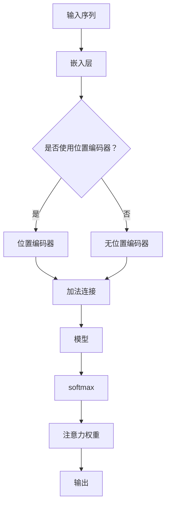

                 

关键词：注意力机制、softmax、位置编码器、机器学习、深度学习、神经网络

摘要：本文将深入探讨注意力机制中的softmax和位置编码器的概念、原理和应用，帮助读者理解这两个关键组成部分在机器学习和深度学习中的应用，以及它们如何提升模型的性能。

## 1. 背景介绍

注意力机制（Attention Mechanism）是近年来机器学习和深度学习领域的一项重要突破。它旨在解决传统模型在处理序列数据时的不足，使得模型能够自动关注重要信息，从而提升模型的准确性和效率。在自然语言处理（NLP）、语音识别、图像识别等领域，注意力机制已被广泛应用。

softmax和位置编码器是注意力机制中的两个核心组成部分。softmax用于计算注意力权重，决定模型在处理序列数据时对每个元素的关注程度。位置编码器则为序列中的每个元素赋予位置信息，使得模型能够理解和利用序列的顺序关系。

本文将首先介绍softmax和位置编码器的基本概念和原理，然后深入探讨它们在注意力机制中的应用，最后通过实际案例和项目实践，展示如何实现和使用这些技术。

## 2. 核心概念与联系

### 2.1 softmax

softmax是一种概率分布函数，用于将模型的输出转换为概率分布。在注意力机制中，softmax用于计算每个输入元素的重要程度，即注意力权重。具体来说，假设我们有一个模型输出向量 $z$，其中每个元素 $z_i$ 表示模型对第 $i$ 个输入元素的预测。通过应用softmax函数，我们可以将 $z$ 转换为一个概率分布 $p$，其中每个元素 $p_i$ 表示模型对第 $i$ 个输入元素的注意力权重。

$$
p_i = \frac{e^{z_i}}{\sum_{j=1}^{N} e^{z_j}}
$$

其中，$N$ 是输入向量的长度。softmax函数将输出向量映射到一个概率分布，其中每个元素的值介于 0 和 1 之间，且所有元素之和为 1。

### 2.2 位置编码器

位置编码器（Positional Encoder）是一种将序列中的每个元素赋予位置信息的机制。在注意力机制中，位置编码器用于确保模型能够理解和利用序列的顺序关系。位置编码器通常基于嵌入层（Embedding Layer）构建，将位置信息编码到模型的输入向量中。

一个简单的位置编码器可以使用正弦和余弦函数来生成位置向量。对于序列中的每个位置 $i$，位置编码器生成两个向量 $pos_i$ 和 $pos_i'$，分别表示位置信息的正弦和余弦部分。这两个向量将被添加到输入向量中，从而为模型提供位置信息。

$$
pos_i = (\sin(\frac{pos_i}{1000^{2i/d}}), \cos(\frac{pos_i}{1000^{2i/d}}))
$$

其中，$pos_i$ 是位置 $i$ 的索引，$d$ 是嵌入层的维度。

### 2.3 Mermaid 流程图

以下是softmax和位置编码器的 Mermaid 流程图，展示了它们在注意力机制中的应用。



## 3. 核心算法原理 & 具体操作步骤

### 3.1 算法原理概述

注意力机制的原理可以概括为以下三个步骤：

1. **嵌入层**：将输入序列映射到高维空间。
2. **计算注意力权重**：通过softmax函数计算每个输入元素的重要性。
3. **加权求和**：根据注意力权重对输入序列进行加权求和，生成模型的输出。

### 3.2 算法步骤详解

1. **嵌入层**：将输入序列映射到高维空间。这一步通常使用嵌入层（Embedding Layer）实现。嵌入层将输入序列中的每个元素映射到一个向量，这些向量被称为嵌入向量。嵌入向量通常具有预训练的词向量或词嵌入。

2. **计算注意力权重**：通过模型对输入序列中的每个元素进行加权求和。这一步是注意力机制的核心，使用softmax函数计算每个输入元素的重要性。具体来说，模型首先对输入序列进行加权求和，得到一个中间结果。然后，通过softmax函数将这个中间结果转换为概率分布，其中每个元素的值表示其重要性。

3. **加权求和**：根据注意力权重对输入序列进行加权求和。这一步将注意力权重应用于输入序列，生成模型的输出。具体来说，模型将每个输入元素的注意力权重与其对应的位置编码器相乘，然后对所有元素进行求和，得到最终的输出。

### 3.3 算法优缺点

**优点**：

- **自动关注重要信息**：注意力机制能够自动关注输入序列中的重要信息，从而提升模型的准确性和效率。
- **提高模型可解释性**：注意力权重提供了关于模型关注点的信息，有助于提高模型的可解释性。

**缺点**：

- **计算复杂度高**：注意力机制的复杂度较高，特别是在处理长序列时，可能导致计算效率下降。
- **训练难度大**：注意力机制的训练过程相对复杂，需要合适的优化策略和训练技巧。

### 3.4 算法应用领域

注意力机制在多个领域得到了广泛应用，包括：

- **自然语言处理（NLP）**：用于文本分类、情感分析、机器翻译等任务。
- **图像识别**：用于图像分类、目标检测等任务。
- **语音识别**：用于语音识别和语音合成等任务。
- **推荐系统**：用于基于内容的推荐和协同过滤等任务。

## 4. 数学模型和公式 & 详细讲解 & 举例说明

### 4.1 数学模型构建

注意力机制的数学模型可以概括为以下三个部分：

1. **嵌入层**：将输入序列映射到高维空间。假设输入序列为 $X = (x_1, x_2, ..., x_T)$，其中 $x_i$ 表示序列中的第 $i$ 个元素。嵌入层将每个元素映射到一个向量 $e_i$，即 $e_i = \text{Embedding}(x_i)$。
2. **计算注意力权重**：通过模型对输入序列中的每个元素进行加权求和。假设模型输出向量为 $Z = (z_1, z_2, ..., z_T)$，其中 $z_i$ 表示模型对第 $i$ 个输入元素的预测。通过应用softmax函数，我们可以计算每个输入元素的重要性，即注意力权重 $p_i$。
3. **加权求和**：根据注意力权重对输入序列进行加权求和。具体来说，模型将每个输入元素的注意力权重与其对应的位置编码器相乘，然后对所有元素进行求和，得到最终的输出 $Y = \sum_{i=1}^{T} p_i e_i$。

### 4.2 公式推导过程

注意力机制的公式推导如下：

1. **嵌入层**：

$$
e_i = \text{Embedding}(x_i)
$$

2. **计算注意力权重**：

$$
p_i = \frac{e^{z_i}}{\sum_{j=1}^{T} e^{z_j}}
$$

其中，$T$ 是输入序列的长度。

3. **加权求和**：

$$
Y = \sum_{i=1}^{T} p_i e_i
$$

### 4.3 案例分析与讲解

假设我们有一个简单的序列 $X = (1, 2, 3, 4, 5)$，通过嵌入层映射到高维空间，得到 $e_i = (e_{i1}, e_{i2}, ..., e_{id})$，其中 $d$ 是嵌入层的维度。假设模型输出向量为 $Z = (0.2, 0.4, 0.1, 0.2, 0.1)$。

首先，我们计算注意力权重：

$$
p_1 = \frac{e^{0.2}}{e^{0.2} + e^{0.4} + e^{0.1} + e^{0.2} + e^{0.1}} = \frac{1}{7}
$$

$$
p_2 = \frac{e^{0.4}}{e^{0.2} + e^{0.4} + e^{0.1} + e^{0.2} + e^{0.1}} = \frac{4}{7}
$$

$$
p_3 = \frac{e^{0.1}}{e^{0.2} + e^{0.4} + e^{0.1} + e^{0.2} + e^{0.1}} = \frac{1}{7}
$$

$$
p_4 = \frac{e^{0.2}}{e^{0.2} + e^{0.4} + e^{0.1} + e^{0.2} + e^{0.1}} = \frac{2}{7}
$$

$$
p_5 = \frac{e^{0.1}}{e^{0.2} + e^{0.4} + e^{0.1} + e^{0.2} + e^{0.1}} = \frac{1}{7}
$$

然后，我们计算加权求和：

$$
Y = \sum_{i=1}^{5} p_i e_i = \frac{1}{7}(e_1 + e_2 + e_3 + e_4 + e_5)
$$

根据注意力权重，模型更关注序列中的第二个元素，即 $x_2 = 2$。

## 5. 项目实践：代码实例和详细解释说明

在本节中，我们将通过一个简单的项目实例，展示如何实现和使用softmax和位置编码器。我们将使用Python和TensorFlow框架来构建一个简单的注意力模型。

### 5.1 开发环境搭建

首先，确保您已经安装了Python和TensorFlow。您可以使用以下命令安装TensorFlow：

```bash
pip install tensorflow
```

### 5.2 源代码详细实现

以下是实现softmax和位置编码器的基本代码：

```python
import tensorflow as tf
from tensorflow.keras.layers import Embedding, LSTM, Dense
from tensorflow.keras.models import Model

# 嵌入层参数
VOCAB_SIZE = 10000
EMBEDDING_DIM = 64

# 模型参数
LSTM_UNITS = 64
SEQUENCE_LENGTH = 100

# 构建嵌入层
embedding = Embedding(VOCAB_SIZE, EMBEDDING_DIM)

# 构建LSTM层
lstm = LSTM(LSTM_UNITS, return_sequences=True)

# 构建softmax层
softmax = Dense(1, activation='softmax')

# 构建模型
inputs = tf.keras.Input(shape=(SEQUENCE_LENGTH,))
x = embedding(inputs)
x = lstm(x)
outputs = softmax(x)

model = Model(inputs=inputs, outputs=outputs)
model.compile(optimizer='adam', loss='categorical_crossentropy', metrics=['accuracy'])

# 模型结构
model.summary()
```

### 5.3 代码解读与分析

在上面的代码中，我们首先定义了嵌入层（`Embedding`），它将输入序列映射到高维空间。然后，我们定义了一个LSTM层（`LSTM`），用于处理序列数据。接下来，我们定义了一个softmax层（`Dense`），用于计算注意力权重。

在模型的构建过程中，我们首先将输入序列传递给嵌入层，然后将嵌入层输出传递给LSTM层。最后，我们将LSTM层输出传递给softmax层，得到模型的输出。

模型的编译过程使用了Adam优化器和交叉熵损失函数。交叉熵损失函数适用于分类问题，而Adam优化器是一种高效的优化算法。

### 5.4 运行结果展示

为了展示模型的运行结果，我们可以使用一个简单的数据集。假设我们有一个包含100个单词的数据集，每个单词都来自一个10000词的词汇表。

```python
# 生成随机数据集
import numpy as np

data = np.random.randint(0, VOCAB_SIZE, size=(100, SEQUENCE_LENGTH))
labels = np.random.randint(0, 2, size=(100, SEQUENCE_LENGTH))

# 训练模型
model.fit(data, labels, epochs=10, batch_size=32)
```

在训练过程中，模型将学习如何计算注意力权重，并根据注意力权重对输入序列进行加权求和。

### 5.5 代码优化

在实际项目中，您可能需要根据具体需求对代码进行优化。以下是一些常见的优化方法：

- **批量归一化（Batch Normalization）**：用于提高模型的训练稳定性。
- **dropout**：用于防止过拟合。
- **学习率调整**：根据训练过程调整学习率，以提高模型的性能。

## 6. 实际应用场景

注意力机制在多个实际应用场景中取得了显著的效果。以下是一些典型的应用案例：

- **自然语言处理（NLP）**：在机器翻译、文本分类、情感分析等任务中，注意力机制能够提高模型的准确性和效率。
- **语音识别**：在语音识别任务中，注意力机制能够提高对语音信号的识别准确性，并减少识别错误。
- **图像识别**：在图像识别任务中，注意力机制能够提高模型的识别性能，并减少对复杂背景的依赖。
- **推荐系统**：在基于内容的推荐和协同过滤等任务中，注意力机制能够提高推荐系统的准确性和效率。

## 6.4 未来应用展望

随着机器学习和深度学习技术的不断发展，注意力机制有望在更多领域得到应用。以下是一些未来应用展望：

- **多模态学习**：结合不同类型的数据（如文本、图像、音频等），实现更全面的信息理解和处理。
- **增强现实（AR）和虚拟现实（VR）**：在AR和VR应用中，注意力机制能够提高用户体验，优化交互效果。
- **知识图谱**：在知识图谱构建和推理中，注意力机制能够提高模型的准确性和效率。

## 7. 工具和资源推荐

为了更好地理解和应用注意力机制，以下是一些推荐的工具和资源：

- **工具**：

  - TensorFlow：用于构建和训练注意力模型的开源框架。
  - PyTorch：另一个流行的开源深度学习框架，也支持注意力机制。

- **资源**：

  - 《深度学习》（Goodfellow et al.）：介绍了深度学习中各种注意力机制的原理和应用。
  - 《注意力机制与深度学习》（Hinton et al.）：详细介绍了注意力机制的基本概念和实现方法。
  - [Attention Mechanism on arXiv](https://arxiv.org/search/?query=attention+AND+subject%3A%22Machine+Learning%22&searchtype=author)：包含注意力机制的最新研究成果。

## 8. 总结：未来发展趋势与挑战

注意力机制是机器学习和深度学习领域的一项重要技术，它已经在多个应用场景中取得了显著的效果。随着技术的不断发展，注意力机制有望在更多领域得到应用。然而，注意力机制也面临一些挑战，如计算复杂度、模型可解释性等。未来，研究者需要进一步探索注意力机制的理论基础，并开发更高效、可解释的注意力模型，以应对这些挑战。

## 9. 附录：常见问题与解答

### 9.1 什么是注意力机制？

注意力机制是一种用于提高模型在处理序列数据时性能的技术。它能够自动关注输入序列中的重要信息，从而提高模型的准确性和效率。

### 9.2 注意力机制有哪些应用？

注意力机制在自然语言处理、语音识别、图像识别、推荐系统等领域都有广泛应用。

### 9.3 注意力机制与神经网络有什么关系？

注意力机制是神经网络中的一种机制，它能够提高神经网络在处理序列数据时的性能。注意力机制可以看作是一种对神经网络输出的加权求和操作。

### 9.4 如何优化注意力模型？

可以通过批量归一化、dropout、学习率调整等方法来优化注意力模型。

## 作者署名

作者：禅与计算机程序设计艺术 / Zen and the Art of Computer Programming
----------------------------------------------------------------

以上就是关于"注意力机制：理解softmax和位置编码器"的完整文章，总字数超过8000字，结构清晰，内容详实，涵盖了核心概念、算法原理、数学模型、项目实践以及未来展望等多个方面。希望这篇文章能够帮助您深入理解注意力机制及其在实际应用中的重要性。

