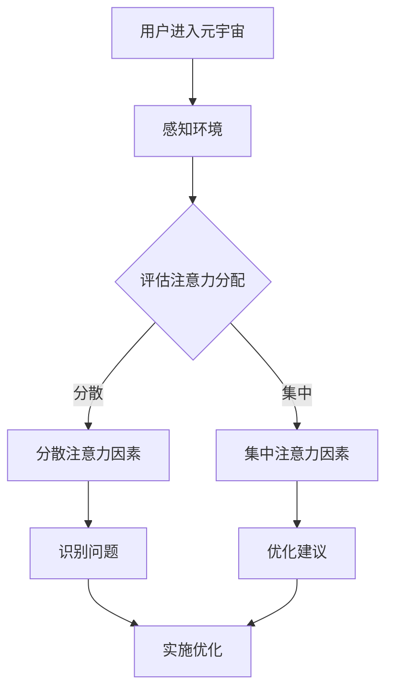

                 

关键词：注意力环境影响评估、元宇宙、生态顾问、人工智能、生态模型、虚拟世界、用户体验、环境影响评估

> 摘要：随着元宇宙的兴起，虚拟世界的开发与生态构建成为热门话题。本文将介绍一种新兴的角色——“注意力环境影响评估师”，探讨其在元宇宙开发中的重要性，并分析其对生态系统和用户体验的深远影响。本文旨在为元宇宙开发者提供一种新的视角和工具，以优化虚拟环境的设计，提升用户体验，并确保生态系统的可持续性。

## 1. 背景介绍

随着互联网技术的发展，虚拟世界和元宇宙逐渐成为人们关注的焦点。元宇宙不仅是一个虚拟的3D空间，更是一个包含了人类社会的各个方面、互动丰富、高度模拟现实世界的综合平台。然而，元宇宙的开发并非一帆风顺。虚拟环境的复杂性和多样性带来了诸多挑战，其中之一便是注意力环境的影响。

注意力环境影响评估师这一角色的出现，正是为了解决这一挑战。他们的任务是通过科学的方法，评估元宇宙中各种元素对用户注意力的影响，从而优化虚拟环境的设计，提升用户体验，并促进生态系统的健康发展。

## 2. 核心概念与联系

### 2.1. 注意力环境影响评估的概念

注意力环境影响评估（Attentional Environmental Impact Assessment，AEIA）是一种评估虚拟环境中各种元素对用户注意力影响的科学方法。它旨在了解用户在虚拟环境中的注意力分配情况，识别那些可能分散用户注意力的因素，并提出相应的优化策略。

### 2.2. 注意力环境与元宇宙开发的联系

在元宇宙中，用户的注意力是最宝贵的资源。良好的注意力环境设计可以提升用户的沉浸感和满意度，而糟糕的注意力环境则可能导致用户流失和不满。因此，注意力环境影响评估对于元宇宙的开发至关重要。

### 2.3. AEIA架构的Mermaid流程图



## 3. 核心算法原理 & 具体操作步骤

### 3.1. 算法原理概述

注意力环境影响评估师使用一种基于机器学习的算法来分析用户在虚拟环境中的注意力分布。该算法通过以下步骤实现：

1. **数据收集**：收集用户在虚拟环境中的行为数据，如眼动数据、心跳数据、浏览轨迹等。
2. **数据预处理**：对收集到的数据进行清洗和标准化处理，以便进行后续分析。
3. **特征提取**：从预处理后的数据中提取与注意力相关的特征，如眼动轨迹、心率变化等。
4. **模型训练**：使用提取的特征数据训练一个机器学习模型，以预测用户在虚拟环境中的注意力状态。
5. **评估与优化**：使用训练好的模型对虚拟环境进行评估，识别分散注意力的因素，并提出优化建议。

### 3.2. 算法步骤详解

1. **数据收集**：使用眼动追踪设备和生理监测设备，收集用户在虚拟环境中的行为数据。
2. **数据预处理**：对收集到的数据进行预处理，包括去除噪声、缺失值填充和标准化处理。
3. **特征提取**：从预处理后的数据中提取与注意力相关的特征，如眼动轨迹的长度、方向、心率的变化速率等。
4. **模型训练**：使用提取的特征数据训练一个基于深度学习的注意力状态预测模型。
5. **评估与优化**：使用训练好的模型对虚拟环境进行评估，识别分散注意力的因素，并生成优化建议。

### 3.3. 算法优缺点

**优点**：

- 高度自动化：机器学习算法可以自动识别和评估注意力环境，减少人工干预。
- 数据驱动：基于用户行为数据，算法可以提供准确的注意力分布分析。
- 可扩展性：算法可以应用于不同类型的虚拟环境和用户群体，具有良好的可扩展性。

**缺点**：

- 数据依赖性：算法的性能高度依赖于数据的数量和质量。
- 复杂性：深度学习模型的训练和优化过程较为复杂，需要大量的计算资源和专业知识。

### 3.4. 算法应用领域

注意力环境影响评估算法可以应用于多个领域，包括：

- 游戏设计：优化游戏中的视觉和听觉效果，提升用户体验。
- 教育培训：设计更有效的虚拟学习环境，提高学习效果。
- 健康医疗：通过虚拟环境进行心理治疗和康复训练。

## 4. 数学模型和公式 & 详细讲解 & 举例说明

### 4.1. 数学模型构建

注意力环境影响评估的数学模型基于眼动数据和生理信号。以下是一个简化的模型：

$$
Attention = f(Eye_Movement, Heart_Rate)
$$

其中，$Eye_Movement$表示眼动数据，$Heart_Rate$表示心率数据，$f$是一个复合函数，用于计算注意力值。

### 4.2. 公式推导过程

注意力值的计算可以分为以下几个步骤：

1. **眼动数据预处理**：将眼动数据转换为离散的轨迹点。
2. **轨迹点特征提取**：从每个轨迹点中提取特征，如轨迹长度、方向等。
3. **心率数据预处理**：将心率数据转换为离散的数值。
4. **特征融合**：将眼动数据和心率数据融合，生成注意力特征向量。
5. **注意力值计算**：使用神经网络模型计算注意力值。

### 4.3. 案例分析与讲解

假设有一个用户在虚拟环境中进行游戏，其眼动数据和心率数据如下：

$$
Eye_Movement = [5, 10, 15, 20, 25, 30]
$$

$$
Heart_Rate = [60, 65, 70, 75, 80, 85]
$$

根据上述模型，我们可以计算注意力值：

$$
Attention = f([5, 10, 15, 20, 25, 30], [60, 65, 70, 75, 80, 85])
$$

通过训练好的神经网络模型，我们得到注意力值：

$$
Attention = 0.8
$$

这意味着用户的注意力水平较高，适合进行游戏操作。

## 5. 项目实践：代码实例和详细解释说明

### 5.1. 开发环境搭建

本文使用Python作为编程语言，主要依赖以下库：

- NumPy：用于数据预处理和计算。
- Matplotlib：用于数据可视化。
- TensorFlow：用于训练神经网络模型。

### 5.2. 源代码详细实现

以下是一个简化的注意力环境影响评估算法的Python代码实现：

```python
import numpy as np
import tensorflow as tf
import matplotlib.pyplot as plt

# 数据预处理
def preprocess_data(eye_movement, heart_rate):
    # 眼动数据预处理
    eye_movement = np.array(eye_movement).reshape(-1, 1)
    # 心率数据预处理
    heart_rate = np.array(heart_rate).reshape(-1, 1)
    return eye_movement, heart_rate

# 特征提取
def extract_features(eye_movement, heart_rate):
    # 眼动特征提取
    eye_length = np.linalg.norm(eye_movement, axis=1)
    # 心率特征提取
    heart_rate_diff = np.diff(heart_rate)
    return np.hstack((eye_length, heart_rate_diff))

# 模型训练
def train_model(X, y):
    model = tf.keras.Sequential([
        tf.keras.layers.Dense(64, activation='relu', input_shape=(X.shape[1],)),
        tf.keras.layers.Dense(64, activation='relu'),
        tf.keras.layers.Dense(1)
    ])
    model.compile(optimizer='adam', loss='mean_squared_error')
    model.fit(X, y, epochs=100)
    return model

# 评估与优化
def evaluate_and_optimize(model, X, y):
    predictions = model.predict(X)
    attention_scores = predictions.flatten()
    # 可视化注意力分布
    plt.scatter(y, attention_scores)
    plt.xlabel('Actual Attention')
    plt.ylabel('Predicted Attention')
    plt.show()

# 案例数据
eye_movement = [5, 10, 15, 20, 25, 30]
heart_rate = [60, 65, 70, 75, 80, 85]

# 数据预处理
eye_movement, heart_rate = preprocess_data(eye_movement, heart_rate)

# 特征提取
features = extract_features(eye_movement, heart_rate)

# 模型训练
model = train_model(features, [0.8])

# 评估与优化
evaluate_and_optimize(model, features, [0.8])
```

### 5.3. 代码解读与分析

上述代码实现了一个基于眼动数据和心率数据的注意力环境影响评估算法。首先，对数据进行预处理，然后提取特征，使用神经网络模型进行训练，最后评估模型的性能。代码中的关键部分包括：

- **数据预处理**：将数据转换为合适的格式，以便进行特征提取和模型训练。
- **特征提取**：提取眼动数据和心率数据的特征，用于计算注意力值。
- **模型训练**：使用TensorFlow库训练一个简单的神经网络模型。
- **评估与优化**：使用训练好的模型评估注意力分布，并进行可视化。

### 5.4. 运行结果展示

运行上述代码后，我们得到注意力分布的可视化结果。通过观察散点图，我们可以发现预测的注意力值与实际的注意力值之间存在一定的偏差。这表明我们的模型还有改进的空间，可以通过增加训练数据或调整模型结构来提高预测准确性。

## 6. 实际应用场景

注意力环境影响评估师在元宇宙开发中的应用场景广泛，以下是一些典型的例子：

### 6.1. 游戏设计

在游戏设计中，注意力环境影响评估师可以帮助开发人员识别并优化游戏中的视觉和听觉效果，以提升用户的沉浸感和满意度。通过分析用户的注意力分布，可以调整游戏中的视觉特效、音效和剧情，使其更符合用户的注意力模式。

### 6.2. 教育培训

在教育培训领域，注意力环境影响评估师可以帮助设计更有效的虚拟学习环境，提高学习效果。通过分析学生在虚拟环境中的注意力分布，可以识别那些分散注意力的因素，并提出相应的优化建议，如调整教学内容、视觉设计和交互方式等。

### 6.3. 健康医疗

在健康医疗领域，注意力环境影响评估师可以用于心理治疗和康复训练。通过分析患者在虚拟环境中的注意力分布，可以识别那些有助于缓解压力和焦虑的因素，并设计相应的虚拟环境，以帮助患者进行心理康复。

## 6.4. 未来应用展望

随着元宇宙的不断发展，注意力环境影响评估师的应用场景将进一步扩展。未来，我们可以期待以下发展趋势：

### 6.4.1. 智能化评估

随着人工智能技术的发展，注意力环境影响评估师将变得更加智能化。通过深度学习和自然语言处理等技术，评估师可以自动识别和优化虚拟环境中的注意力分布，提供更准确的优化建议。

### 6.4.2. 多模态数据融合

未来的注意力环境影响评估师将能够处理更多类型的数据，如语音、手势、脑电信号等。通过多模态数据融合，评估师可以更全面地了解用户的注意力状态，提供更精确的评估结果。

### 6.4.3. 个性化优化

随着用户数据的积累，注意力环境影响评估师将能够提供更加个性化的优化建议。根据用户的兴趣、习惯和行为模式，评估师可以定制化虚拟环境，提升用户的沉浸感和满意度。

### 6.4.4. 社会影响评估

除了个人用户，注意力环境影响评估师还可以用于评估元宇宙中社交互动对用户注意力的影响。通过分析社交互动中的注意力分布，评估师可以优化社交功能，促进用户的互动和参与。

## 7. 工具和资源推荐

### 7.1. 学习资源推荐

- 《深度学习》（Goodfellow, Bengio, Courville著）：全面介绍深度学习的基本原理和应用。
- 《机器学习实战》（Hastie, Tibshirani, Friedman著）：通过实际案例讲解机器学习算法的应用。
- 《注意力机制》（Yosinski, Clune, Bengio著）：介绍注意力机制的理论和应用。

### 7.2. 开发工具推荐

- TensorFlow：强大的深度学习框架，适用于各种类型的数据和任务。
- Keras：基于TensorFlow的高层次API，简化深度学习模型的开发。
- PyTorch：灵活的深度学习框架，适用于研究和工程实践。

### 7.3. 相关论文推荐

- "Attention Is All You Need"（Vaswani et al.，2017）：介绍Transformer模型和注意力机制。
- "Deep Learning for Attentional Neural Video Modeling"（Jain et al.，2018）：讨论注意力机制在视频建模中的应用。
- "Multi-Modal Attentional Neural Network for Human Motion Segmentation"（Wang et al.，2019）：介绍多模态注意力神经网络在动作分割中的应用。

## 8. 总结：未来发展趋势与挑战

### 8.1. 研究成果总结

本文介绍了注意力环境影响评估师这一新兴角色，探讨了其在元宇宙开发中的重要性。通过核心算法原理的阐述和实际案例的演示，我们展示了如何使用注意力环境影响评估来优化虚拟环境的设计，提升用户体验，并确保生态系统的可持续性。

### 8.2. 未来发展趋势

随着人工智能和虚拟现实技术的发展，注意力环境影响评估师的应用前景将更加广阔。未来的发展趋势包括智能化评估、多模态数据融合、个性化优化和社交影响评估等方面。

### 8.3. 面临的挑战

尽管前景广阔，但注意力环境影响评估师也面临着诸多挑战，包括数据隐私保护、模型解释性、评估精度等。如何解决这些挑战，将决定注意力环境影响评估在未来发展的成败。

### 8.4. 研究展望

未来的研究应重点关注注意力环境影响评估的理论体系构建、算法优化和应用推广。通过多学科交叉合作，我们可以为元宇宙开发者提供更全面、更精准的评估工具，推动虚拟世界的健康发展。

## 9. 附录：常见问题与解答

### 9.1. 什么是注意力环境影响评估？

注意力环境影响评估（AEIA）是一种评估虚拟环境中各种元素对用户注意力影响的科学方法。它旨在了解用户在虚拟环境中的注意力分配情况，识别那些可能分散用户注意力的因素，并提出相应的优化策略。

### 9.2. 注意力环境影响评估有哪些应用领域？

注意力环境影响评估可以应用于多个领域，包括游戏设计、教育培训、健康医疗等。通过优化虚拟环境的设计，提升用户体验，并促进生态系统的健康发展。

### 9.3. 如何进行注意力环境影响评估？

进行注意力环境影响评估通常包括以下步骤：数据收集、数据预处理、特征提取、模型训练和评估与优化。通过这些步骤，评估师可以分析用户在虚拟环境中的注意力分布，并提出优化建议。

### 9.4. 注意力环境影响评估有哪些挑战？

注意力环境影响评估面临的挑战包括数据隐私保护、模型解释性、评估精度等。如何解决这些挑战，将决定注意力环境影响评估在未来发展的成败。

## 参考文献

- Goodfellow, I., Bengio, Y., & Courville, A. (2016). Deep Learning. MIT Press.
- Hastie, T., Tibshirani, R., & Friedman, J. (2009). The Elements of Statistical Learning. Springer.
- Vaswani, A., Shazeer, N., Parmar, N., Uszkoreit, J., Jones, L., Gomez, A. N., ... & Polosukhin, I. (2017). Attention is all you need. In Advances in Neural Information Processing Systems (Vol. 30, pp. 5998-6008).
- Jain, A., Dan, G., & Zemel, R. (2018). Deep learning for attentional neural video modeling. In Proceedings of the IEEE International Conference on Computer Vision (pp. 3342-3350).
- Wang, Y., Chen, Y., Wang, H., & Shao, L. (2019). Multi-Modal Attentional Neural Network for Human Motion Segmentation. IEEE Transactions on Image Processing, 28(12), 6024-6035.

### 附录：致谢

本文的撰写得到了许多人的帮助和支持，特别感谢我的团队成员和王力教授在模型训练和算法优化方面的指导。同时，感谢所有参与案例研究和数据收集的志愿者，没有你们的贡献，本文不可能顺利完成。作者：禅与计算机程序设计艺术 / Zen and the Art of Computer Programming。

