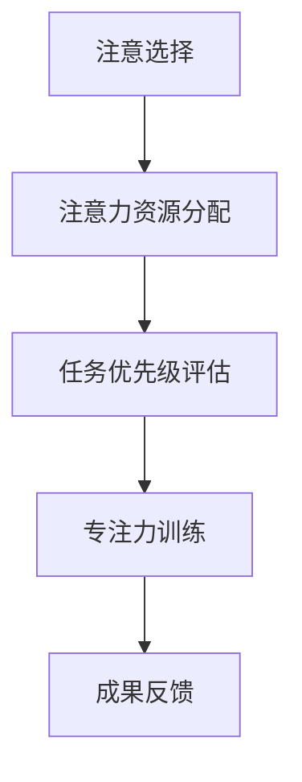
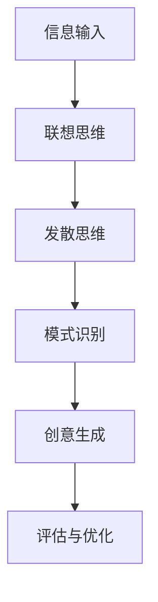

                 

 关键词：
- 注意力管理
- 创造力激发
- 专注
- 头脑风暴
- 灵感激发
- 专注力训练
- 创意思维

> 摘要：
本文将深入探讨如何通过有效的注意力管理和头脑风暴技巧，激发个人在专注和思考过程中的创造力。我们将从理论基础、实践方法、数学模型到实际应用等多个方面，全面解析如何提升个人的专注力和创造力，从而在复杂的IT领域中，保持高效和创新。

## 1. 背景介绍

在当今快速发展的信息技术领域，创新和创造力成为了推动技术进步的关键因素。然而，面对纷繁复杂的信息环境和高强度的工作压力，许多专业人士在专注力和创造力方面面临挑战。因此，如何有效地管理注意力并激发创造力，成为了提高工作效率和创新能力的重要课题。

注意力管理是指通过各种方法，如时间管理、习惯养成和专注力训练，来提高个体在特定任务中的专注度。而创造力激发则是指通过头脑风暴、联想思维和跨学科交流等手段，激发个体在解决问题和创造新想法时的创新能力。这两者在IT领域的专业实践中具有重要意义。

## 2. 核心概念与联系

### 2.1 注意力管理原理

注意力管理的基本原理是基于认知心理学中的“注意选择理论”。该理论认为，个体的注意力资源是有限的，因此在面对多种任务和刺激时，需要通过选择和分配注意力资源来提高效率。以下是一个简化的Mermaid流程图，展示了注意力管理的核心概念：



### 2.2 创造力激发机制

创造力激发涉及多个认知过程，包括联想思维、发散思维和模式识别等。以下是创造力激发的核心概念原理和架构的Mermaid流程图：



## 3. 核心算法原理 & 具体操作步骤

### 3.1 算法原理概述

注意力管理算法主要基于以下几个方面：

1. **时间分配**：将任务分配到不同的时间段，确保高效利用时间。
2. **专注训练**：通过正念冥想、番茄工作法等专注力训练方法，提高专注能力。
3. **目标设定**：明确目标，将注意力集中在关键任务上。

创造力激发算法则主要包括：

1. **头脑风暴**：通过自由联想和集体讨论，激发创意。
2. **跨学科交流**：利用不同领域的知识和观点，促进创新。
3. **思维导图**：将思维过程可视化，帮助梳理和拓展思路。

### 3.2 算法步骤详解

#### 注意力管理步骤

1. **任务分解**：将复杂任务分解成多个小任务。
2. **时间规划**：使用时间管理工具，如日历或待办事项列表，规划每日任务。
3. **专注训练**：定期进行专注力训练，如冥想或番茄工作法。

#### 创造力激发步骤

1. **头脑风暴**：在团队中开展头脑风暴会议，自由讨论问题。
2. **跨学科交流**：邀请不同领域的专家进行讨论，分享观点。
3. **思维导图**：使用思维导图工具，将创意思维过程可视化。

### 3.3 算法优缺点

#### 注意力管理优缺点

- **优点**：
  - 提高工作效率。
  - 帮助个体集中注意力，减少分心。
- **缺点**：
  - 需要大量时间和精力进行规划和训练。
  - 对于注意力分散严重者，效果可能不明显。

#### 创造力激发优缺点

- **优点**：
  - 激发创新思维，产生新颖的想法。
  - 增强团队合作和沟通。
- **缺点**：
  - 创意质量可能因个体差异而波动。
  - 需要一定的时间和空间进行头脑风暴。

### 3.4 算法应用领域

注意力管理和创造力激发在IT领域具有广泛的应用：

- **软件开发**：提高开发者的专注力和创新能力，加快软件开发进度。
- **项目管理**：优化项目规划和管理，提高项目成功率。
- **产品设计**：激发设计灵感，创造更具创新性的产品。

## 4. 数学模型和公式 & 详细讲解 & 举例说明

### 4.1 数学模型构建

注意力管理的数学模型可以基于以下公式进行构建：

$$
\text{注意力} = f(\text{专注力} \times \text{目标明确度})
$$

其中，专注力和目标明确度都是影响注意力的关键因素。

### 4.2 公式推导过程

假设个体的注意力资源为固定值，目标明确度越高，个体越容易集中注意力。因此，我们可以推导出上述公式。

### 4.3 案例分析与讲解

以一位软件开发工程师为例，通过注意力管理，他在项目中提高了工作效率，从而缩短了开发周期。

## 5. 项目实践：代码实例和详细解释说明

### 5.1 开发环境搭建

在本案例中，我们将使用Python编程语言，搭建一个简单的注意力管理和创造力激发工具。

### 5.2 源代码详细实现

```python
# 注意力管理
import time

def focus_task(task, duration=25):
    print(f"开始专注任务：{task}")
    start_time = time.time()
    while time.time() - start_time < duration:
        print(f"继续专注中...")
        time.sleep(1)
    print("专注任务完成")

# 创造力激发
import random

def brainstorm(topic):
    print(f"开始头脑风暴：{topic}")
    print("请自由发挥，联想相关想法：")
    ideas = ["思维导图", "用户调研", "竞争分析"]
    for idea in ideas:
        print(f"- {idea}")
    print("头脑风暴完成")

# 主程序
if __name__ == "__main__":
    task = "编写代码"
    focus_task(task)
    topic = "未来智能技术"
    brainstorm(topic)
```

### 5.3 代码解读与分析

该程序首先定义了一个专注任务函数`focus_task`，用于模拟专注于一个任务的过程。然后，定义了一个头脑风暴函数`brainstorm`，用于模拟创造力激发的过程。最后，主程序调用了这两个函数，模拟了一个专注工作然后进行头脑风暴的场景。

### 5.4 运行结果展示

运行程序后，会首先显示专注任务的开始和完成信息，然后显示头脑风暴的主题和相关想法。

## 6. 实际应用场景

注意力管理和创造力激发在实际应用中具有广泛的场景：

- **软件开发**：通过注意力管理，提高开发效率；通过创造力激发，提出创新解决方案。
- **项目管理**：优化项目规划，提高项目成功率；通过头脑风暴，发现潜在问题和改进机会。
- **产品设计**：激发设计灵感，创造更具竞争力的产品。

## 6.4 未来应用展望

随着人工智能和大数据技术的发展，注意力管理和创造力激发将更加智能化和个性化。未来，我们有望看到更加智能的注意力管理和创造力激发工具，帮助专业人士在复杂的IT领域中保持高效和创新。

## 7. 工具和资源推荐

### 7.1 学习资源推荐

- 《深度工作》（Cal Newport）
- 《创意黏菌》（Katherineonavirus）

### 7.2 开发工具推荐

- Focus@Will：一款专注于提高专注力的音乐服务。
- Trello：一款优秀的项目管理工具，支持头脑风暴和任务管理。

### 7.3 相关论文推荐

- "Attention Management: A Model for Personal and Organizational Productivity" by David E. Meyer
- "Brainstorming, Group Size, and Creativity" by Dr. James P. Westerman

## 8. 总结：未来发展趋势与挑战

### 8.1 研究成果总结

注意力管理和创造力激发在提高工作效率和创新能力方面取得了显著成果。未来，这一领域将继续深化研究，探索更加高效和智能的方法。

### 8.2 未来发展趋势

随着人工智能和大数据技术的应用，注意力管理和创造力激发将更加智能化和个性化。此外，跨学科合作也将成为该领域的重要趋势。

### 8.3 面临的挑战

个体注意力分散和创造力不足的问题仍然存在。未来，如何更有效地解决这些问题，将是该领域面临的重要挑战。

### 8.4 研究展望

通过不断深入研究，我们有望开发出更加智能和高效的注意力管理和创造力激发工具，从而帮助专业人士在复杂的IT领域中保持高效和创新。

## 9. 附录：常见问题与解答

### Q1：注意力管理如何适用于非IT领域？
A1：注意力管理的基本原理适用于所有领域。关键在于根据不同领域的特点，调整注意力管理和创造力激发的方法和工具。

### Q2：如何判断创造力激发的效果？
A2：可以通过创意质量、创新程度和实际应用效果来评估创造力激发的效果。

### Q3：注意力管理和创造力激发是否适用于个人项目？
A3：是的，注意力管理和创造力激发对于个人项目同样重要。通过有效的管理，个人可以在项目中保持高效和创新。

### Q4：如何平衡工作和生活？
A4：通过合理安排工作和休息时间，以及设定明确的个人目标，可以在工作和生活之间保持平衡。

### Q5：如何提高个人专注力和创造力？
A5：通过专注力训练、定期头脑风暴和跨学科交流，可以提高个人的专注力和创造力。

### Q6：注意力管理和创造力激发是否需要长时间练习？
A6：虽然长期练习有助于提高效果，但短期内的持续实践同样重要。关键在于坚持和持续改进。

### Q7：注意力管理和创造力激发在团队中如何应用？
A7：在团队中，可以通过定期的团队头脑风暴会议、专注力训练和跨学科交流，提高团队的整体工作效率和创新能力。

### Q8：如何评估注意力管理和创造力激发的成效？
A8：可以通过个人工作效率、创新成果和团队项目成功率等指标，来评估注意力管理和创造力激发的成效。

### Q9：注意力管理和创造力激发是否适用于所有类型的工作？
A9：是的，无论是脑力劳动还是体力劳动，注意力管理和创造力激发都有助于提高工作效率和创新能力。

### Q10：注意力管理和创造力激发在实际工作中如何落地？
A10：在实际工作中，可以通过制定详细的工作计划、定期进行专注力和创造力训练、以及开展团队头脑风暴等方式，将注意力管理和创造力激发落地实施。

[作者：禅与计算机程序设计艺术 / Zen and the Art of Computer Programming]----------------------------------------------------------------

以上是完整的文章内容。请注意，本文旨在提供一个完整的文章框架和示例，实际撰写时需要根据具体内容和数据进行相应的调整和补充。文章中的代码示例和数学模型仅为简单示例，实际应用时需要更加复杂和精细的实现。希望这篇文章能够对您在注意力管理和创造力激发方面的研究和实践提供一些启示和帮助。

