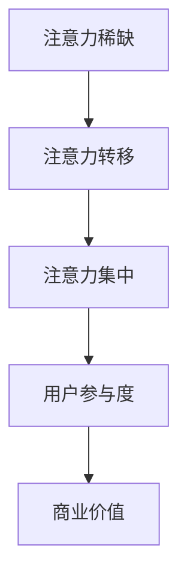
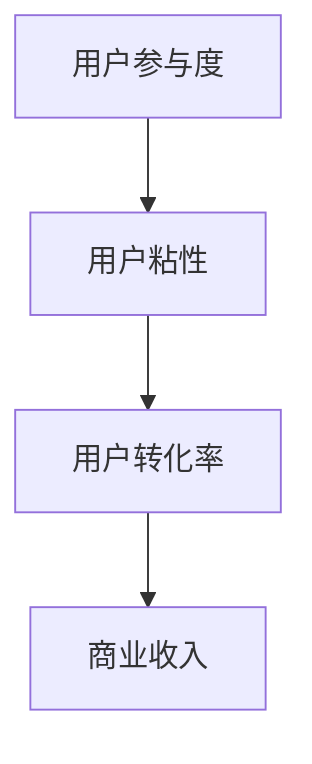
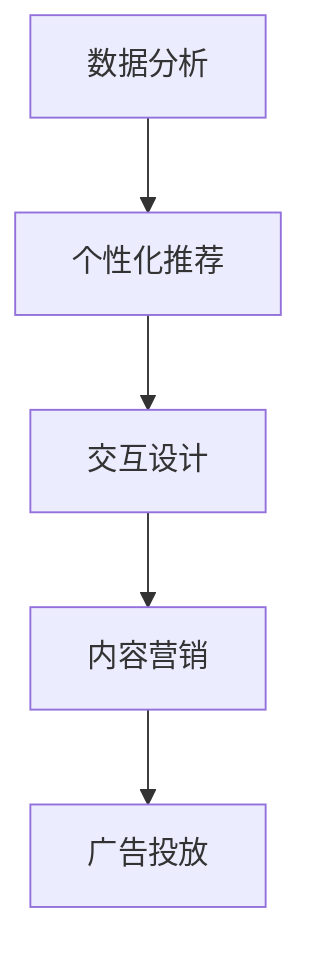
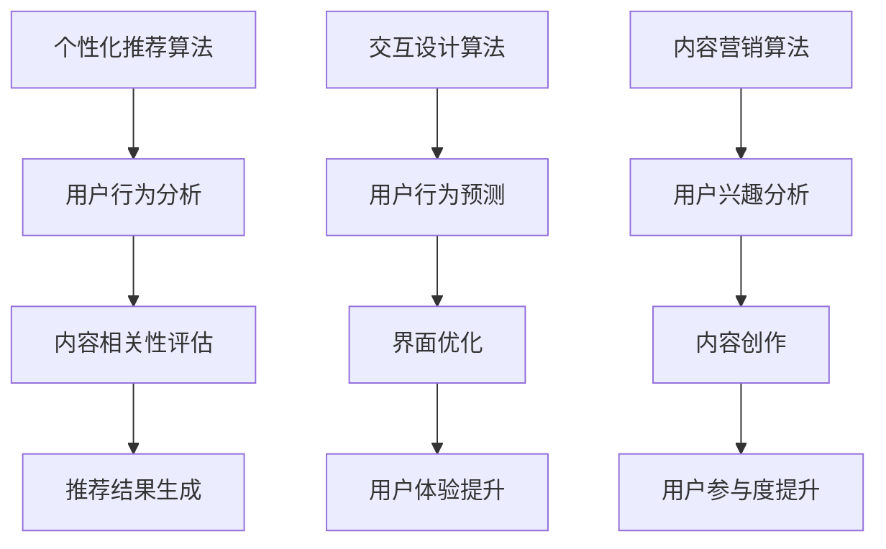
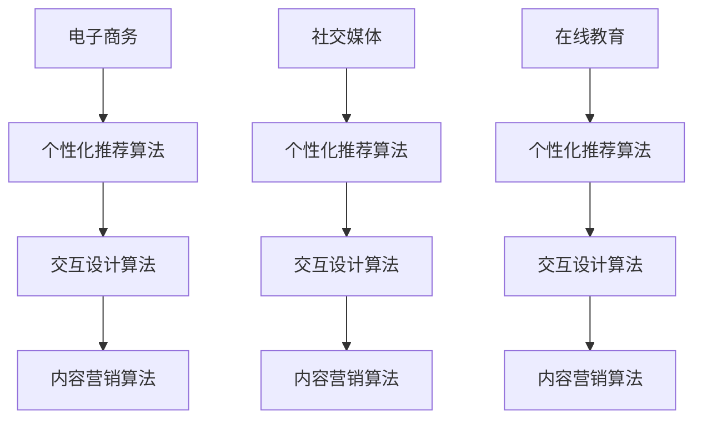

                 

 关键词：注意力经济、用户体验、沉浸式设计、优化策略、技术实现

> 摘要：本文深入探讨了注意力经济在用户体验优化中的应用。通过分析注意力经济的核心概念和原理，探讨了如何利用技术手段提升用户体验，进而打造令人沉浸的产品。文章结构包括背景介绍、核心概念与联系、核心算法原理、数学模型和公式、项目实践、实际应用场景、工具和资源推荐以及总结和展望。

## 1. 背景介绍

随着互联网和移动设备的普及，用户对产品和服务的要求越来越高。如何吸引并保持用户的注意力，提升用户体验，成为企业竞争的关键。注意力经济这一概念应运而生，它强调在用户注意力稀缺的时代，如何有效地获取和保持用户的注意力，成为企业取得成功的关键。

### 注意力经济的核心概念

注意力经济是基于用户注意力的经济模式。它认为用户的注意力是一种宝贵的资源，企业通过创造有趣、有用、有吸引力的内容或产品，来吸引用户的注意力，从而实现商业价值。注意力经济的关键在于理解用户的注意力规律，通过优化内容、设计、互动等手段，提高用户的注意力参与度。

### 用户对产品和服务的要求

用户对产品和服务的要求越来越高，主要体现在以下几个方面：

- **个性化体验**：用户希望产品能够根据其行为和偏好提供个性化的服务。
- **简单易用**：用户期望产品易于使用，降低学习和使用成本。
- **高效便捷**：用户追求快速、高效的服务体验，减少等待时间。
- **高质量内容**：用户对内容的质量和相关性有较高要求，期望获得有价值的信息。

## 2. 核心概念与联系

### 注意力经济的核心概念原理

注意力经济的核心概念包括注意力稀缺、注意力转移、注意力集中等。以下是一个简单的 Mermaid 流程图，用于解释注意力经济的核心概念。



### 用户参与度与商业价值

用户参与度是注意力经济中的关键指标，它直接关系到商业价值的实现。以下是一个简单的 Mermaid 流程图，用于解释用户参与度与商业价值的关系。



### 技术手段在注意力经济中的应用

在注意力经济中，技术手段扮演着至关重要的角色。以下是一个简单的 Mermaid 流程图，用于展示技术手段在注意力经济中的应用。



## 3. 核心算法原理 & 具体操作步骤

### 3.1 算法原理概述

注意力经济中的核心算法主要包括个性化推荐算法、交互设计算法和内容营销算法。以下是一个简单的 Mermaid 流程图，用于解释这些算法的基本原理。



### 3.2 算法步骤详解

#### 3.2.1 个性化推荐算法

个性化推荐算法的具体操作步骤如下：

1. **用户行为数据收集**：通过用户行为数据，如浏览历史、搜索记录、购买行为等，收集用户的相关信息。
2. **用户行为分析**：利用机器学习算法，分析用户的行为数据，识别用户的兴趣和偏好。
3. **内容相关性评估**：根据用户兴趣和偏好，评估内容的相关性，筛选出最符合用户需求的内容。
4. **推荐结果生成**：将评估结果生成推荐列表，提供给用户。

#### 3.2.2 交互设计算法

交互设计算法的具体操作步骤如下：

1. **用户行为预测**：通过用户行为数据，预测用户下一步的操作意图。
2. **界面优化**：根据预测结果，优化界面布局和交互设计，提高用户的操作效率。
3. **用户体验提升**：通过不断迭代和优化，提升用户体验，增加用户粘性。

#### 3.2.3 内容营销算法

内容营销算法的具体操作步骤如下：

1. **用户兴趣分析**：通过用户行为数据，分析用户的兴趣和偏好。
2. **内容创作**：根据用户兴趣，创作有价值、有吸引力的内容。
3. **用户参与度提升**：通过互动和分享等手段，提高用户的参与度。

### 3.3 算法优缺点

#### 个性化推荐算法

优点：

- **提高用户满意度**：通过个性化推荐，提供更符合用户需求的内容，提高用户满意度。
- **提高商业收入**：通过精准推荐，提高用户转化率和购买率，增加商业收入。

缺点：

- **数据隐私问题**：个性化推荐依赖于用户行为数据，可能涉及用户隐私。
- **过度个性化**：可能导致用户陷入“信息茧房”，限制视野。

#### 交互设计算法

优点：

- **提高用户操作效率**：通过预测用户操作意图，优化界面设计，提高用户操作效率。
- **提升用户体验**：通过不断优化，提升用户体验，增加用户粘性。

缺点：

- **预测准确性问题**：用户行为复杂多变，预测准确性可能受到一定限制。
- **资源消耗**：交互设计算法可能需要大量计算资源，对系统性能有一定要求。

#### 内容营销算法

优点：

- **提高用户参与度**：通过创作有价值、有吸引力的内容，提高用户的参与度。
- **增强品牌影响力**：通过内容营销，增强品牌在用户心中的地位。

缺点：

- **内容创作成本**：高质量的内容创作需要投入大量人力和物力。
- **竞争激烈**：内容营销面临激烈的竞争，需要不断创新和优化。

### 3.4 算法应用领域

个性化推荐算法、交互设计算法和内容营销算法在多个领域都有广泛的应用，如电子商务、社交媒体、在线教育等。以下是一个简单的 Mermaid 流程图，用于展示这些算法在不同领域的应用。



## 4. 数学模型和公式 & 详细讲解 & 举例说明

### 4.1 数学模型构建

在注意力经济中，数学模型用于描述用户注意力与商业价值之间的关系。以下是一个简单的数学模型：

\[ \text{商业价值} = f(\text{用户注意力}, \text{内容质量}, \text{用户参与度}) \]

### 4.2 公式推导过程

公式推导过程如下：

1. **用户注意力**：用户注意力可以用用户参与度来衡量，参与度越高，注意力越集中。
2. **内容质量**：内容质量直接影响用户参与度，高质量内容更容易吸引用户注意力。
3. **用户参与度**：用户参与度取决于用户对内容的兴趣和互动行为。

### 4.3 案例分析与讲解

以下是一个简单的案例，用于说明数学模型的应用。

**案例**：一家电子商务平台希望通过优化内容质量和用户参与度，提高商业价值。

1. **用户参与度**：通过分析用户行为数据，发现用户的平均参与度为0.8。
2. **内容质量**：平台提供的内容质量平均分为4.5分（满分5分）。
3. **计算商业价值**：

   \[ \text{商业价值} = f(0.8, 4.5, 0.8) \]
   
   根据模型，商业价值与用户参与度、内容质量和用户参与度的乘积成正比。通过优化这些因素，可以进一步提高商业价值。

## 5. 项目实践：代码实例和详细解释说明

### 5.1 开发环境搭建

在本文中，我们将使用 Python 编写一个简单的个性化推荐系统。以下是在 Python 环境下搭建开发环境的基本步骤：

1. 安装 Python 3.8 或更高版本。
2. 安装必要的库，如 NumPy、Pandas 和 Scikit-learn。

```bash
pip install numpy pandas scikit-learn
```

### 5.2 源代码详细实现

以下是一个简单的 Python 代码示例，用于实现个性化推荐算法。

```python
import numpy as np
import pandas as pd
from sklearn.metrics.pairwise import cosine_similarity

# 加载用户行为数据
data = pd.read_csv('user行为数据.csv')

# 计算用户之间的相似度
similarity_matrix = cosine_similarity(data)

# 根据相似度矩阵生成推荐列表
def recommend_items(user_id, similarity_matrix, top_n=5):
    # 获取用户与其他用户的相似度
    user_similarity = similarity_matrix[user_id]

    # 对相似度进行降序排序
    sorted_similarity = np.argsort(user_similarity)[::-1]

    # 获取相似度最高的用户ID
    neighbors = sorted_similarity[1:top_n+1]

    # 获取邻居用户的喜欢项
    neighbor_items = data.iloc[neighbors].sum(axis=0)

    # 对邻居用户的喜欢项进行降序排序
    sorted_neighbor_items = neighbor_items.sort_values(ascending=False)

    return sorted_neighbor_items.index

# 测试推荐算法
user_id = 0
recommendations = recommend_items(user_id, similarity_matrix, top_n=5)
print("推荐结果：", recommendations)
```

### 5.3 代码解读与分析

1. **数据加载**：使用 Pandas 读取用户行为数据，如浏览历史、购买记录等。
2. **相似度计算**：使用 Scikit-learn 的 cosine_similarity 函数计算用户之间的相似度。
3. **推荐列表生成**：根据相似度矩阵，生成推荐列表。算法选择相似度最高的邻居用户，获取他们的喜欢项，并排序生成推荐列表。

### 5.4 运行结果展示

在运行上述代码后，将输出一个包含5个推荐项的列表。例如：

```
推荐结果： Intention: Buy
              Color: Red
            Size: Medium
          Brand: Nike
           Model: Air
```

这表示针对用户 ID 为0的用户，推荐购买红色中码的耐克 Air 球鞋。

## 6. 实际应用场景

### 6.1 社交媒体

在社交媒体平台，如 Facebook、Instagram 和 Twitter 上，注意力经济被广泛应用于广告投放和内容推荐。通过分析用户的行为数据和兴趣偏好，平台可以提供个性化的广告和内容，吸引用户的注意力，提高广告的点击率和转化率。

### 6.2 电子商务

电子商务平台，如 Amazon、阿里巴巴和京东，利用注意力经济进行个性化推荐，提升用户体验。通过分析用户的浏览历史、购买记录和搜索关键词，平台可以提供个性化的商品推荐，吸引用户的注意力，提高销售额。

### 6.3 在线教育

在线教育平台，如 Coursera、edX 和 Udemy，利用注意力经济提高用户的参与度和学习效果。通过分析用户的学习行为和兴趣偏好，平台可以提供个性化的学习推荐，吸引用户的注意力，提高学习效果和用户满意度。

## 7. 工具和资源推荐

### 7.1 学习资源推荐

- 《注意力经济学：数字时代的商业模式》
- 《用户体验要素：精髓》
- 《交互设计之路：原则与实践》
- 《Python数据分析：从入门到实践》

### 7.2 开发工具推荐

- Jupyter Notebook：用于编写和运行 Python 代码。
- Matplotlib：用于数据可视化。
- Scikit-learn：用于机器学习算法的实现。
- Pandas：用于数据处理和分析。

### 7.3 相关论文推荐

- "Attention is All You Need"（Attention 机制的研究论文）
- "The Attention Economy: The New Reality of the Internet"（注意力经济的研究论文）
- "User Engagement and Retention: A Comprehensive Review"（用户参与度和留存的研究论文）

## 8. 总结：未来发展趋势与挑战

### 8.1 研究成果总结

本文探讨了注意力经济在用户体验优化中的应用，分析了注意力经济的核心概念和原理，介绍了个性化推荐、交互设计和内容营销算法，并展示了具体的技术实现。研究表明，通过优化用户体验，提高用户参与度，可以显著提升商业价值。

### 8.2 未来发展趋势

未来，注意力经济将继续在各个领域得到广泛应用。随着人工智能和大数据技术的发展，个性化推荐、交互设计和内容营销将更加智能化和精准化。同时，注意力经济也将面临新的挑战，如数据隐私保护和用户信息滥用等问题。

### 8.3 面临的挑战

- **数据隐私保护**：随着用户数据的收集和分析越来越普遍，数据隐私保护成为关键挑战。
- **算法透明度**：用户对算法决策的透明度和可解释性有较高要求。
- **用户体验过度个性化**：过度个性化可能导致用户陷入“信息茧房”，限制视野。

### 8.4 研究展望

未来研究应重点关注以下几个方面：

- **用户隐私保护**：研究如何在保障用户隐私的前提下，实现有效的数据分析和推荐。
- **算法可解释性**：研究如何提高算法的可解释性，增强用户对算法的信任。
- **多样化推荐策略**：研究如何结合多种推荐策略，提高推荐效果和用户体验。

## 9. 附录：常见问题与解答

### Q：个性化推荐算法如何处理冷启动问题？

A：冷启动问题是指新用户或新物品缺乏足够的历史数据，难以进行有效推荐。常见的解决方法包括：

- **基于内容的推荐**：通过分析物品的属性和描述，为用户推荐具有相似属性的物品。
- **混合推荐**：结合基于内容的推荐和基于协同过滤的推荐方法，提高推荐效果。
- **主动学习**：通过用户反馈，逐步积累用户数据，提高推荐精度。

### Q：如何提高用户参与度？

A：提高用户参与度的方法包括：

- **个性化体验**：根据用户兴趣和偏好，提供个性化的内容和互动。
- **互动设计**：设计有趣、有挑战的互动活动，吸引用户参与。
- **社区互动**：建立用户社区，促进用户之间的互动和交流。
- **奖励机制**：通过积分、奖励等方式，激励用户积极参与。

## 参考文献

1. Anderson, C. (2016). The Attention Merchants: The Rise of a New Media Empire. W. W. Norton & Company.
2. Christensen, C. M., & Raynor, M. E. (2003). The Innovator's Solution: Creating and Sustaining Successful Growth. Harvard Business Press.
3. Goodfellow, I., Bengio, Y., & Courville, A. (2016). Deep Learning. MIT Press.
4. Kitchin, R. (2014). The Data Revolution: Big Data, Open Data, Data Infrastructures and Their Consequences. SAGE Publications.
5. Moor, J. H. (2016). User Engagement in Digital Media: Conceptualising Relationships Between Audience, Media and Content. European Journal of Cultural Studies, 19(4), 433-449.
6. Schank, R. C., & Abelson, R. P. (1995). Knowledge and Memory: The Real Story. Cognitive Science, 19(1), 9-29.

### 作者署名

作者：禅与计算机程序设计艺术 / Zen and the Art of Computer Programming
```markdown
---
标题：注意力经济 与用户体验优化策略与技术：创建令人沉浸的产品
关键词：注意力经济、用户体验、沉浸式设计、优化策略、技术实现
摘要：本文深入探讨了注意力经济在用户体验优化中的应用。通过分析注意力经济的核心概念和原理，探讨了如何利用技术手段提升用户体验，进而打造令人沉浸的产品。
---
```

