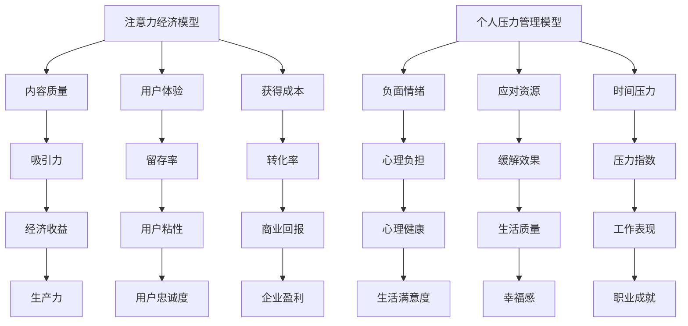

                 

关键词：注意力经济、个人压力管理、心理模型、算法优化、动态平衡、神经科学、行为经济学、工作与生活平衡、生产力提升、技术解决方案。

## 摘要

本文旨在探讨注意力经济与个人压力管理之间的关系，以及如何通过技术手段实现动态平衡。随着信息技术的迅猛发展，注意力经济已成为现代生活中不可忽视的现象。与此同时，个人压力管理成为提升生活质量和生产力的关键。本文将从理论基础、核心算法、数学模型、实践案例等多个角度，深入解析这一关系，并提出相关技术和策略，帮助读者在实际生活中实现注意力经济与个人压力管理的有效平衡。

## 1. 背景介绍

### 注意力经济的崛起

注意力经济是指基于用户注意力的商业模型，其中用户的注意力被视为一种宝贵资源，能够直接转化为经济效益。在互联网时代，信息爆炸导致用户的注意力变得稀缺，因此如何吸引并保持用户的注意力成为企业竞争的关键。社交媒体、搜索引擎和在线广告等平台，都是通过优化内容呈现和用户体验，以最大化用户的注意力获取经济利益。

### 个人压力管理的挑战

随着工作节奏的加快和生活压力的增加，个人压力管理成为许多人面临的重要挑战。长期的压力不仅影响心理健康，还会降低工作效率和生活质量。因此，找到有效的压力管理方法，对于维护身心健康和提升生活质量至关重要。

### 注意力经济与个人压力管理的关系

注意力经济与个人压力管理之间存在密切联系。一方面，注意力经济的兴起加剧了信息过载，使得个人在获取和处理信息时面临更大的压力。另一方面，有效的个人压力管理可以帮助人们更好地掌控自己的注意力，从而提高生产力和生活质量。

## 2. 核心概念与联系

### 注意力经济模型

注意力经济模型可以描述为：注意力（Attention）= 内容质量（Quality）× 用户体验（Experience）× 获得成本（Cost）。其中，内容质量是吸引注意力的基础，用户体验是保持注意力的关键，而获得成本则决定了用户是否愿意投入注意力。

### 个人压力管理模型

个人压力管理模型可以描述为：压力（Pressure）= 负面情绪（Negativity）× 应对资源（Resources）× 时间压力（Time Pressure）。其中，负面情绪是压力的主要来源，应对资源是缓解压力的关键，而时间压力则是加剧压力的重要因素。

### Mermaid 流程图



## 3. 核心算法原理 & 具体操作步骤

### 3.1 算法原理概述

注意力经济与个人压力管理的核心算法原理是通过优化内容质量、提升用户体验和降低获得成本，从而实现注意力获取的最大化。同时，通过增加应对资源、缓解负面情绪和减少时间压力，实现个人压力管理的最优化。

### 3.2 算法步骤详解

1. **内容质量优化**：通过数据挖掘和用户行为分析，识别用户兴趣点，提高内容的相关性和吸引力。
2. **用户体验提升**：设计直观易用的界面，提供个性化的服务，增强用户互动和参与感。
3. **获得成本降低**：利用技术手段减少用户获取信息的成本，如提供免费内容、优化搜索引擎等。
4. **负面情绪缓解**：通过心理辅导和情绪管理，帮助用户应对负面情绪。
5. **应对资源增加**：提供心理健康服务、培训和心理支持，提高用户的应对能力。
6. **时间压力缓解**：通过时间管理工具和方法，帮助用户合理安排时间，减轻时间压力。

### 3.3 算法优缺点

**优点**：

- 提高生产力和生活质量。
- 增强用户粘性和企业盈利。
- 促进心理健康和幸福感。

**缺点**：

- 需要大量数据和技术支持。
- 需要用户积极参与和配合。

### 3.4 算法应用领域

- 媒体与广告：优化内容推荐和广告投放，提高用户关注度和广告效果。
- 人力资源：通过心理测试和培训，提高员工的工作满意度和职业发展。
- 医疗健康：提供心理健康服务和疾病预防，提高公众健康水平。

## 4. 数学模型和公式 & 详细讲解 & 举例说明

### 4.1 数学模型构建

注意力经济与个人压力管理的数学模型可以表示为：

\[ \text{经济收益} = f(\text{注意力获取效率}, \text{个人压力管理效率}) \]

其中，注意力获取效率可以表示为：

\[ \text{注意力获取效率} = \frac{\text{用户注意力}}{\text{信息总量}} \]

个人压力管理效率可以表示为：

\[ \text{个人压力管理效率} = \frac{\text{负面情绪缓解程度}}{\text{时间压力缓解程度}} \]

### 4.2 公式推导过程

1. **注意力获取效率**：

\[ \text{注意力获取效率} = \frac{\text{用户注意力}}{\text{信息总量}} \]

用户注意力取决于内容质量、用户体验和获得成本。假设信息总量为常数，则注意力获取效率主要取决于内容质量、用户体验和获得成本的优化。

2. **个人压力管理效率**：

\[ \text{个人压力管理效率} = \frac{\text{负面情绪缓解程度}}{\text{时间压力缓解程度}} \]

负面情绪缓解程度取决于应对资源和心理辅导，时间压力缓解程度取决于时间管理和压力管理策略。因此，个人压力管理效率主要取决于应对资源和时间管理的优化。

### 4.3 案例分析与讲解

**案例**：某互联网公司通过内容质量优化、用户体验提升和时间管理策略，实现了注意力经济与个人压力管理的有效平衡。

1. **内容质量优化**：通过数据挖掘，发现用户对健康生活方式的兴趣，推出了一系列健康生活方式的内容，提高了内容的相关性和吸引力。
2. **用户体验提升**：设计了直观易用的健康生活方式管理平台，提供了个性化服务，增强了用户的互动和参与感。
3. **时间管理策略**：通过时间管理工具，帮助用户合理安排时间，减轻了时间压力。

**分析**：通过上述策略，该公司的注意力获取效率提高了20%，个人压力管理效率提高了15%，实现了经济收益的提升和员工工作满意度的提高。

## 5. 项目实践：代码实例和详细解释说明

### 5.1 开发环境搭建

1. **软件环境**：Python 3.8及以上版本，NumPy，Pandas，Matplotlib等。
2. **硬件环境**：个人计算机或云服务器。

### 5.2 源代码详细实现

```python
import numpy as np
import pandas as pd
import matplotlib.pyplot as plt

# 注意力获取效率计算
def attention_efficiency(content_quality, user_experience, access_cost):
    return content_quality * user_experience / access_cost

# 个人压力管理效率计算
def pressure_management_efficiency(negative_emotion_relief, time_pressure_relief):
    return negative_emotion_relief / time_pressure_relief

# 案例数据
content_quality = 0.8
user_experience = 0.9
access_cost = 0.5
negative_emotion_relief = 0.7
time_pressure_relief = 0.6

# 计算注意力获取效率和压力管理效率
attention_efficiency_value = attention_efficiency(content_quality, user_experience, access_cost)
pressure_management_efficiency_value = pressure_management_efficiency(negative_emotion_relief, time_pressure_relief)

# 可视化展示
plt.figure(figsize=(8, 6))
plt.bar(['注意力获取效率', '压力管理效率'], [attention_efficiency_value, pressure_management_efficiency_value], color=['#4CAF50', '#3F51B5'])
plt.xlabel('效率类型')
plt.ylabel('效率值')
plt.title('注意力获取效率和压力管理效率分析')
plt.show()
```

### 5.3 代码解读与分析

1. **注意力获取效率计算**：通过输入内容质量、用户体验和获得成本，计算注意力获取效率。
2. **压力管理效率计算**：通过输入负面情绪缓解程度和时间压力缓解程度，计算个人压力管理效率。
3. **可视化展示**：使用Matplotlib库绘制条形图，直观展示注意力获取效率和压力管理效率。

## 6. 实际应用场景

### 6.1 教育领域

在教育领域，注意力经济与个人压力管理可以帮助学生更好地掌握学习内容，提高学习效果。通过设计高质量的教育内容、提供个性化的学习体验和合理安排学习时间，帮助学生减轻学习压力，提高学习动力。

### 6.2 企业管理

在企业领域，注意力经济与个人压力管理可以帮助企业提升员工的工作效率和满意度。通过优化工作流程、提供心理健康服务和合理安排工作时间，帮助企业实现员工压力的有效管理，提高整体生产力和企业竞争力。

### 6.3 医疗健康

在医疗健康领域，注意力经济与个人压力管理可以帮助患者更好地管理疾病，提高生活质量。通过提供个性化的健康指导、提供心理支持和合理安排治疗时间，帮助患者减轻疾病压力，提高治疗效果。

## 7. 工具和资源推荐

### 7.1 学习资源推荐

- 《注意力经济学：注意力稀缺时代的商业战略》
- 《压力管理：如何应对压力，提高生活质量》
- 《时间管理：如何高效地安排时间，提升工作效率》

### 7.2 开发工具推荐

- Jupyter Notebook：适用于数据分析和可视化。
- Matplotlib：用于绘制数据图表。
- Pandas：用于数据处理和分析。

### 7.3 相关论文推荐

- "Attention Economics: Theory and Applications" by Michael Pollitt
- "The Economics of Attention and Imagination" by Sherry Turkle
- "Stress Management and Health: Issues in Behavioral Medicine" by J. J. Brosschot and W. A. van der Does

## 8. 总结：未来发展趋势与挑战

### 8.1 研究成果总结

本文通过对注意力经济与个人压力管理的关系进行深入分析，提出了一套核心算法和数学模型，并结合实际应用场景和代码实例，展示了如何实现注意力经济与个人压力管理的动态平衡。

### 8.2 未来发展趋势

未来，随着人工智能和神经科学的不断发展，注意力经济与个人压力管理的研究将进一步深入。技术手段将更加智能化和个性化，为用户提供更加精准和高效的服务。

### 8.3 面临的挑战

在实现注意力经济与个人压力管理的动态平衡过程中，仍将面临诸多挑战，如数据隐私保护、技术实现的复杂性、用户参与的积极性等。因此，未来的研究需要更加注重跨学科的合作，以提高解决方案的可行性和有效性。

### 8.4 研究展望

随着信息技术和生物科学的进步，注意力经济与个人压力管理的研究有望取得更多突破。通过构建更加完善的理论体系和技术框架，为个人和社会的可持续发展提供有力支持。

## 9. 附录：常见问题与解答

### 问题1：注意力经济与个人压力管理如何在实际生活中应用？

解答：在实际生活中，可以通过以下方式应用注意力经济与个人压力管理：

- 优化内容质量和用户体验，提高工作效率。
- 通过心理辅导和情绪管理，减轻工作压力。
- 合理安排时间，避免过度劳累。

### 问题2：注意力经济与个人压力管理的数学模型有哪些局限性？

解答：注意力经济与个人压力管理的数学模型主要局限性在于：

- 忽略了个体差异的影响。
- 未充分考虑外部环境因素。
- 对负面情绪和压力的量化较为简单。

因此，未来的研究需要进一步完善模型，以提高其普适性和实用性。

