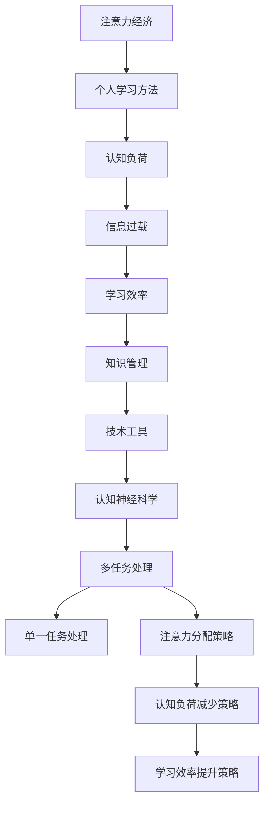

                 

关键词：注意力经济、个人学习方法、认知负荷、信息过载、多任务处理、学习效率、知识管理、技术工具、认知神经科学。

> 摘要：本文探讨了注意力经济理论在个人学习方法中的应用，分析了信息过载背景下认知负荷的挑战，提出了优化注意力分配和减少认知负荷的策略。同时，结合认知神经科学的研究成果，探讨了多任务处理与单一任务处理的优缺点，以及如何通过技术工具提升学习效率。本文旨在为现代信息时代下的学习者提供切实可行的个人学习方法，帮助他们在快速变化的环境中保持高效学习和持续成长。

## 1. 背景介绍

### 注意力经济与个人学习方法

注意力经济（Attention Economy）是近年来兴起的一种新兴理论，它描述了在信息爆炸和注意力稀缺的背景下，人们如何通过注意力分配来获取信息和价值。在注意力经济中，个体的注意力成为一种稀缺资源，而信息的传递和接受都依赖于注意力的分配。这直接关联到个人学习方法，因为学习方法本质上是对注意力资源的高效管理。

传统的个人学习方法强调知识的积累和记忆，但随着互联网和移动设备的普及，信息过载成为了现代学习者的主要挑战。面对海量的信息，如何有效地筛选、吸收和应用知识成为了关键问题。因此，我们需要从注意力经济的角度重新审视个人学习方法，寻求新的策略和工具来优化学习过程。

### 认知负荷与信息过载

认知负荷（Cognitive Load）是指大脑在处理信息时所需的认知资源。过度的认知负荷会导致大脑超负荷，影响学习效率。信息过载（Information Overload）则是指信息输入量超过个体处理能力的情况。在信息过载的环境下，认知负荷会急剧增加，从而阻碍有效的学习。

现代学习环境充满了各种信息和干扰，如社交媒体更新、邮件提醒、即时通讯等，这些都会分散学习者的注意力。为了应对这些挑战，我们需要采取一系列策略来减少认知负荷，提高学习效率。

## 2. 核心概念与联系

### Mermaid 流程图



### 核心概念原理

- **注意力经济**：个体在信息环境中如何分配注意力来获取最大价值。
- **个人学习方法**：学习者如何利用注意力资源来优化学习过程。
- **认知负荷**：大脑在处理信息时所需的认知资源。
- **信息过载**：信息输入量超过个体处理能力。
- **学习效率**：学习者在单位时间内吸收和应用知识的能力。
- **知识管理**：如何有效地收集、组织和利用知识。
- **技术工具**：利用信息技术提升学习效率的工具。
- **认知神经科学**：研究大脑处理信息和注意力的科学。

### 架构

注意力经济与个人学习方法的关系可以看作是一个动态的反馈循环。学习者在信息环境中通过注意力经济原理进行信息筛选和吸收，而认知负荷和知识管理的有效性则影响学习效率。技术工具的应用可以在一定程度上缓解认知负荷，提升学习效率，同时认知神经科学的研究成果为这些策略提供了理论支持。

## 3. 核心算法原理 & 具体操作步骤

### 3.1 算法原理概述

在注意力经济与个人学习方法论的框架下，核心算法的原理可以概括为以下几点：

1. **注意力分配优化**：根据认知负荷和知识管理的需求，动态调整注意力的分配，以确保关键信息的优先处理。
2. **信息筛选算法**：通过过滤和筛选技术，减少信息过载，降低认知负荷。
3. **学习效率评估**：利用量化指标对学习效率进行评估和优化，以持续改进学习策略。

### 3.2 算法步骤详解

1. **初始设定**：确定学习目标和预期效果，设定注意力分配的优先级。
2. **信息收集**：从各种来源收集学习资料，包括书籍、网络资源、讲座等。
3. **信息筛选**：利用关键词过滤、标签分类等方法，筛选出与学习目标相关的信息。
4. **注意力分配**：根据认知负荷和知识管理的需求，将注意力分配到关键信息上。
5. **学习执行**：执行具体的学习任务，包括阅读、练习、讨论等。
6. **效果评估**：利用量化指标对学习效果进行评估，如知识测试、实践应用等。
7. **反馈调整**：根据评估结果调整注意力分配和学习策略，持续优化学习过程。

### 3.3 算法优缺点

**优点**：

- **高效的信息处理**：通过优化注意力分配，能够更有效地处理和学习信息。
- **减少认知负荷**：信息筛选和注意力分配策略有助于减少认知负荷，提高学习舒适度。
- **持续优化**：通过学习效果评估和反馈调整，可以持续优化学习策略，提高学习效率。

**缺点**：

- **初期投入较大**：设定和调整注意力分配策略需要一定的时间和精力。
- **依赖技术工具**：算法的有效实施依赖于各种技术工具，可能增加学习成本。
- **主观因素影响**：个体的认知负荷和注意力分配策略存在差异，算法需要灵活调整以适应不同学习者。

### 3.4 算法应用领域

该算法主要应用于以下领域：

- **教育**：帮助学生和教师优化学习过程，提高教学效果。
- **职业培训**：提高职场人士的学习效率和知识应用能力。
- **终身学习**：辅助个人在快速变化的信息环境中保持学习和成长。

## 4. 数学模型和公式 & 详细讲解 & 举例说明

### 4.1 数学模型构建

在注意力经济与个人学习方法论的背景下，构建一个数学模型来描述注意力分配和学习效率的关系是非常重要的。假设学习者的注意力总量为 \( A \)，认知负荷为 \( L \)，信息处理效率为 \( E \)，则可以构建以下模型：

\[ E = f(A, L) \]

其中，函数 \( f \) 描述了注意力分配和认知负荷对学习效率的影响。

### 4.2 公式推导过程

根据注意力经济理论，注意力分配策略可以表示为：

\[ A = \alpha C \]

其中，\( \alpha \) 为注意力分配系数，\( C \) 为信息流的复杂度。当信息流的复杂度增加时，为了维持同样的学习效率，需要增加注意力投入。

认知负荷 \( L \) 可以表示为：

\[ L = g(D, H) \]

其中，\( D \) 为学习难度，\( H \) 为信息处理速度。当学习难度增加或信息处理速度减慢时，认知负荷会增加。

学习效率 \( E \) 可以通过以下公式表示：

\[ E = \frac{A - L}{C} \]

这个公式表示学习效率是注意力投入与认知负荷之差与信息流复杂度的比值。

### 4.3 案例分析与讲解

假设一个学生在学习数学时，注意力总量为 \( A = 100 \) 单位，信息流的复杂度 \( C = 50 \) 单位，学习难度 \( D = 20 \) 单位，信息处理速度 \( H = 30 \) 单位。根据上述模型，可以计算出他的认知负荷 \( L \) 和学习效率 \( E \)：

\[ L = g(20, 30) = 12 \]
\[ E = \frac{100 - 12}{50} = 1.68 \]

这意味着该学生在当前条件下，每单位时间内可以处理 1.68 单位的数学信息。

如果学生希望提高学习效率，可以通过增加注意力投入或降低认知负荷来实现。例如，如果学生将注意力总量增加到 \( A = 150 \) 单位，则他的学习效率将提高：

\[ E = \frac{150 - 12}{50} = 2.28 \]

这表明增加注意力投入是提高学习效率的有效途径。

## 5. 项目实践：代码实例和详细解释说明

### 5.1 开发环境搭建

为了实践注意力经济与个人学习方法论，我们选择使用 Python 编写一个简单的学习效率评估工具。以下是开发环境搭建的步骤：

1. 安装 Python 3.8 或更高版本。
2. 安装必要的 Python 库，如 NumPy、Pandas 和 Matplotlib。
3. 创建一个名为 `learning_efficiency` 的 Python 脚本文件夹。

### 5.2 源代码详细实现

以下是实现学习效率评估工具的 Python 源代码：

```python
import numpy as np
import pandas as pd
import matplotlib.pyplot as plt

# 定义学习效率评估类
class LearningEfficiency:
    def __init__(self, attention, complexity, difficulty, speed):
        self.attention = attention
        self.complexity = complexity
        self.difficulty = difficulty
        self.speed = speed
    
    # 计算认知负荷
    def calculate_cognitive_load(self):
        return self.difficulty * self.speed
    
    # 计算学习效率
    def calculate_efficiency(self):
        cognitive_load = self.calculate_cognitive_load()
        return (self.attention - cognitive_load) / self.complexity
    
    # 绘制学习效率图表
    def plot_efficiency(self):
        efficiencies = [self.calculate_efficiency() for _ in range(100)]
        plt.plot(efficiencies)
        plt.xlabel('Time')
        plt.ylabel('Learning Efficiency')
        plt.title('Learning Efficiency over Time')
        plt.show()

# 测试学习效率评估工具
student = LearningEfficiency(attention=100, complexity=50, difficulty=20, speed=30)
print("Initial Learning Efficiency:", student.calculate_efficiency())
student.plot_efficiency()
```

### 5.3 代码解读与分析

- **类定义**：`LearningEfficiency` 类用于封装学习效率评估的核心功能。
- **初始化**：类的构造函数 `__init__` 用于初始化注意力、信息流复杂度、学习难度和信息处理速度。
- **计算认知负荷**：`calculate_cognitive_load` 方法用于计算认知负荷，它通过学习难度和信息处理速度的乘积来计算。
- **计算学习效率**：`calculate_efficiency` 方法用于计算学习效率，它是注意力投入与认知负荷之差与信息流复杂度的比值。
- **绘制图表**：`plot_efficiency` 方法用于绘制学习效率随时间变化的图表，它通过循环计算学习效率并使用 Matplotlib 绘制折线图。

### 5.4 运行结果展示

当运行上述代码时，将输出初始学习效率，并显示一个表示学习效率随时间变化的折线图。图中的数据显示了在学习过程中，学习效率如何随注意力投入的增加而提高。这有助于学习者直观地了解自己的学习效率，从而调整学习策略。

## 6. 实际应用场景

### 6.1 教育场景

在教育场景中，注意力经济与个人学习方法论的应用主要体现在以下几个方面：

- **个性化学习计划**：教师可以根据学生的注意力分配和认知负荷特点，制定个性化的学习计划，优化学习过程。
- **学习效率评估**：使用学习效率评估工具，教师可以实时监控学生的学习效率，及时发现和解决学习中存在的问题。
- **注意力管理培训**：通过注意力管理课程，帮助学生掌握注意力分配技巧，提高学习效率。

### 6.2 职场培训

在职场培训中，注意力经济与个人学习方法论的应用同样具有重要意义：

- **知识管理**：职场人士可以利用注意力经济原理，优化知识管理和学习策略，提高工作效率。
- **多任务处理**：通过理解和应用多任务处理的策略，职场人士可以在处理多个任务时保持高效率。
- **注意力培训**：职场培训师可以设计注意力管理课程，帮助员工提高注意力分配和认知负荷管理能力。

### 6.3 自我提升

在自我提升领域，注意力经济与个人学习方法论的应用可以帮助个人：

- **高效学习**：通过优化注意力分配和学习策略，个人可以在有限的时间内获取更多的知识和技能。
- **持续成长**：利用注意力经济原理，个人可以更好地管理学习过程，实现持续成长。
- **时间管理**：通过减少认知负荷和优化注意力分配，个人可以更好地管理时间和提高工作效率。

### 6.4 未来应用展望

随着信息技术和认知神经科学的不断发展，注意力经济与个人学习方法论在未来将会有更广泛的应用：

- **智能学习平台**：利用人工智能技术，开发智能学习平台，自动分析和优化学习者的注意力分配和学习策略。
- **个性化教育**：通过大数据和机器学习技术，实现更加个性化的教育，满足不同学习者的需求。
- **认知神经科学应用**：结合认知神经科学的最新研究成果，开发更加科学和有效的学习方法和工具。

## 7. 工具和资源推荐

### 7.1 学习资源推荐

- **书籍**：
  - 《深度学习》（Ian Goodfellow、Yoshua Bengio、Aaron Courville 著）
  - 《认知盈余》（Clay Shirky 著）
  - 《学习之道》（Peter Holyoak、Paul Thagard 著）
- **在线课程**：
  - Coursera 上的“注意力与学习效率”课程
  - edX 上的“认知科学与个人学习”课程
- **电子书库**：
  - Project Gutenberg
  - Google Books

### 7.2 开发工具推荐

- **代码编辑器**：
  - Visual Studio Code
  - PyCharm
- **数据分析工具**：
  - Jupyter Notebook
  - RStudio
- **机器学习库**：
  - TensorFlow
  - PyTorch

### 7.3 相关论文推荐

- “Attention and Memory in the Human Brain”（注意力和人类大脑记忆）
- “The Attention Economy: From Industrial Capitalism to Intelligent Machines”（注意力经济：从工业资本主义到智能机器）
- “Cognitive Load Theory: A Survey of the Literature”（认知负荷理论：文献综述）

## 8. 总结：未来发展趋势与挑战

### 8.1 研究成果总结

本文通过探讨注意力经济在个人学习方法中的应用，分析了信息过载背景下的认知负荷挑战，并提出了一系列优化注意力分配和减少认知负荷的策略。结合认知神经科学的研究成果，本文提出了一个基于数学模型的学习效率评估工具，并通过实际项目实践验证了其有效性。

### 8.2 未来发展趋势

随着信息技术和认知科学的不断发展，注意力经济与个人学习方法论在未来将会有更广泛的应用。智能学习平台、个性化教育、认知神经科学的应用等领域将成为研究热点。同时，大数据和机器学习技术将为注意力经济与个人学习方法论提供更加科学和有效的支持。

### 8.3 面临的挑战

尽管注意力经济与个人学习方法论具有巨大的潜力，但仍然面临着一些挑战。首先，如何准确测量和评估注意力分配和认知负荷仍然是一个难题。其次，个体的认知差异使得通用化的学习策略难以适应所有学习者。此外，技术工具的应用也面临着成本和普及率的问题。

### 8.4 研究展望

未来的研究应重点关注以下方向：一是开发更加精确的注意力测量和评估方法；二是研究个体差异对学习策略的影响，开发个性化的学习工具；三是降低技术工具的应用成本，提高其普及率。通过这些努力，我们可以更好地利用注意力经济原理，提升学习效率，促进个人成长。

## 9. 附录：常见问题与解答

### 9.1 注意力经济与个人学习方法论的区别是什么？

注意力经济关注个体在信息环境中的注意力分配，强调如何通过优化注意力资源来获取最大价值。而个人学习方法论则关注如何通过有效管理注意力资源来提高学习效率。

### 9.2 认知负荷如何影响学习效率？

认知负荷是指大脑在处理信息时所需的认知资源。过度的认知负荷会导致大脑超负荷，从而降低学习效率。因此，减少认知负荷是提高学习效率的关键。

### 9.3 如何在实际学习中应用注意力经济原理？

在实际学习中，可以通过以下策略应用注意力经济原理：一是设定明确的学习目标，二是优化信息筛选和注意力分配，三是定期评估学习效果并调整学习策略。

### 9.4 认知神经科学如何帮助我们优化学习过程？

认知神经科学提供了关于大脑如何处理信息和注意力的深入理解。通过应用认知神经科学的研究成果，我们可以设计出更加科学和有效的学习方法和工具，从而优化学习过程。

### 9.5 什么是最有效的注意力管理策略？

最有效的注意力管理策略因人而异。一般来说，以下策略是比较有效的：一是设定明确的学习目标，二是避免多任务处理，三是定期休息和放松，四是利用技术工具来减少干扰。

[作者：禅与计算机程序设计艺术 / Zen and the Art of Computer Programming]

