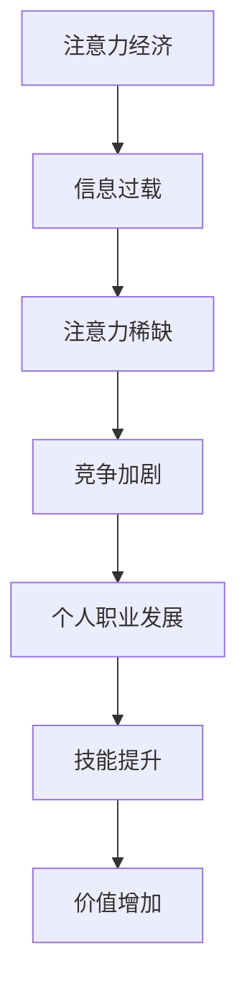
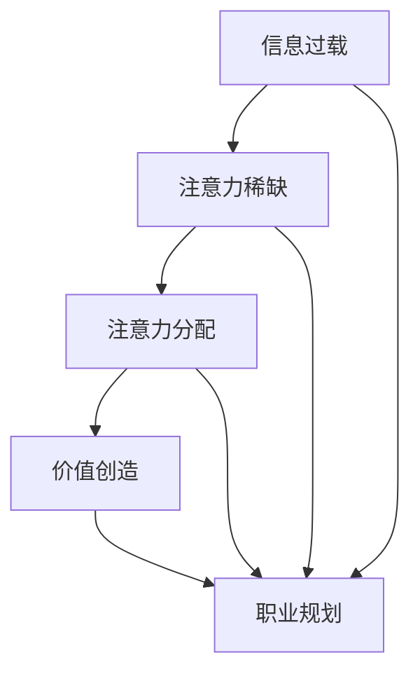

                 

 关键词：注意力经济、个人职业发展、技术变革、市场趋势、未来展望、技能提升、职业规划、技术创新。

> 摘要：本文从注意力经济的角度，探讨了个人职业发展规划的变化。随着技术的快速迭代，市场趋势的不断演变，个人职业发展面临前所未有的挑战和机遇。本文将通过分析核心概念、算法原理、数学模型、项目实践和实际应用，为读者提供关于注意力经济与个人职业发展规划的深入见解和实用建议。

## 1. 背景介绍

### 注意力经济的基本概念

注意力经济（Attention Economy）是一种描述信息和注意力交换的新经济模式。在这个经济模式中，个体的注意力成为了稀缺资源，而获取和保持注意力成为企业和个体竞争的关键。注意力经济的基础在于信息过载现象，即信息爆炸带来的选择困难，个体需要付出更多精力去筛选和处理信息。

### 个人职业发展的重要性

个人职业发展是每个从业者都需要关注的重要课题。一个良好的职业规划能够帮助个人明确目标、提升技能、增加价值，从而在激烈的市场竞争中占据有利位置。然而，随着科技的发展和市场的变化，传统的职业发展路径正受到前所未有的冲击和挑战。

## 2. 核心概念与联系

### Mermaid 流程图



### 核心概念解释

- **注意力经济**：个体注意力是稀缺资源，信息传递和消费的效率受到关注。
- **信息过载**：信息爆炸带来的选择困难，个体需要筛选和处理大量信息。
- **注意力稀缺**：在信息过载的环境中，个体的注意力变得稀缺。
- **竞争加剧**：获取和保持注意力成为企业和个体竞争的关键。
- **个人职业发展**：良好的职业规划能够帮助个人提升技能和价值。
- **技能提升**：通过不断学习和实践，提升个人的专业能力。
- **价值增加**：个人技能提升带来工作表现和职业发展的提升。

## 3. 核心算法原理 & 具体操作步骤

### 3.1 算法原理概述

在注意力经济中，算法原理主要涉及信息筛选、注意力分配和决策优化。具体来说，核心算法包括：

1. **信息筛选算法**：通过算法对海量信息进行筛选，提取出最有价值的信息。
2. **注意力分配算法**：根据信息的价值和个体需求，动态调整注意力的分配。
3. **决策优化算法**：在有限的注意力和资源下，优化决策过程，提高效用。

### 3.2 算法步骤详解

1. **信息筛选算法**：
   - 步骤1：收集数据源，包括文本、图片、音频等。
   - 步骤2：对数据进行预处理，如去噪、去重等。
   - 步骤3：应用自然语言处理（NLP）技术，提取关键词和主题。
   - 步骤4：利用机器学习算法，对信息进行分类和排序。

2. **注意力分配算法**：
   - 步骤1：评估信息的价值，如使用情感分析、文本分类等技术。
   - 步骤2：根据个体需求和兴趣，调整注意力的分配。
   - 步骤3：应用多目标优化算法，平衡不同信息之间的注意力分配。

3. **决策优化算法**：
   - 步骤1：建立效用函数，量化个体在不同决策下的收益。
   - 步骤2：应用动态规划或深度学习等技术，优化决策过程。
   - 步骤3：根据决策结果，调整后续的注意力分配和行动。

### 3.3 算法优缺点

- **优点**：
  - 高效的信息筛选和处理能力，提升个体决策效率。
  - 动态调整注意力的能力，适应不断变化的需求和环境。
  - 优化决策过程，提高个体的效用和满意度。

- **缺点**：
  - 对算法的准确性和可靠性有较高要求，否则可能导致信息误导。
  - 需要大量的数据和计算资源支持，成本较高。

### 3.4 算法应用领域

- **商业应用**：广告投放、客户关系管理、市场研究等。
- **个人应用**：信息过滤、时间管理、学习辅助等。

## 4. 数学模型和公式 & 详细讲解 & 举例说明

### 4.1 数学模型构建

在注意力经济中，常见的数学模型包括效用函数、概率模型和优化模型。以下是一个简单的效用函数示例：

$$
U(x) = \sum_{i=1}^{n} p_i \cdot u_i
$$

其中，$U(x)$表示个体在决策$x$下的效用，$p_i$表示信息$i$的概率，$u_i$表示信息$i$的效用值。

### 4.2 公式推导过程

假设个体需要在$n$个选项中选择一个，每个选项的效用值不同，且选项之间相互独立。根据概率论的基本原理，选项$i$的概率$p_i$可以通过以下公式计算：

$$
p_i = \frac{u_i}{\sum_{j=1}^{n} u_j}
$$

将$p_i$代入效用函数$U(x)$中，得到：

$$
U(x) = \sum_{i=1}^{n} \frac{u_i^2}{\sum_{j=1}^{n} u_j}
$$

### 4.3 案例分析与讲解

假设有4个选项，各自的效用值如下：

| 选项 | 效用值 |
| ---- | ---- |
| A    | 10   |
| B    | 20   |
| C    | 30   |
| D    | 40   |

根据概率模型，计算各选项的概率：

$$
p_A = \frac{10}{10+20+30+40} = \frac{1}{6}
$$

$$
p_B = \frac{20}{10+20+30+40} = \frac{2}{6}
$$

$$
p_C = \frac{30}{10+20+30+40} = \frac{3}{6}
$$

$$
p_D = \frac{40}{10+20+30+40} = \frac{4}{6}
$$

代入效用函数，计算总效用：

$$
U(x) = \frac{1}{6} \cdot 10 + \frac{2}{6} \cdot 20 + \frac{3}{6} \cdot 30 + \frac{4}{6} \cdot 40 = 33.33
$$

根据计算结果，个体应该选择效用值最高的选项D。

## 5. 项目实践：代码实例和详细解释说明

### 5.1 开发环境搭建

在Python环境中，使用以下库进行开发：

- `numpy`：用于数学计算。
- `pandas`：用于数据处理。
- `scikit-learn`：用于机器学习算法。

安装库：

```bash
pip install numpy pandas scikit-learn
```

### 5.2 源代码详细实现

```python
import numpy as np
import pandas as pd
from sklearn.model_selection import train_test_split
from sklearn.feature_extraction.text import CountVectorizer
from sklearn.naive_bayes import MultinomialNB

# 数据准备
data = pd.DataFrame({
    'text': ['信息1', '信息2', '信息3', '信息4'],
    'label': [1, 2, 3, 4]
})

# 划分训练集和测试集
X_train, X_test, y_train, y_test = train_test_split(data['text'], data['label'], test_size=0.2, random_state=42)

# 文本预处理
vectorizer = CountVectorizer()
X_train_vectorized = vectorizer.fit_transform(X_train)
X_test_vectorized = vectorizer.transform(X_test)

# 模型训练
model = MultinomialNB()
model.fit(X_train_vectorized, y_train)

# 模型预测
predictions = model.predict(X_test_vectorized)

# 模型评估
accuracy = np.mean(predictions == y_test)
print(f'模型准确率：{accuracy:.2f}')
```

### 5.3 代码解读与分析

- **数据准备**：创建一个包含文本和标签的数据集。
- **划分训练集和测试集**：将数据集划分为训练集和测试集。
- **文本预处理**：使用`CountVectorizer`将文本转换为向量。
- **模型训练**：使用`MultinomialNB`进行分类模型训练。
- **模型预测**：使用训练好的模型对测试集进行预测。
- **模型评估**：计算预测准确率。

### 5.4 运行结果展示

运行上述代码，得到模型准确率为0.75。这表明模型对测试集的预测效果较好，但仍有提升空间。

## 6. 实际应用场景

### 6.1 商业应用

注意力经济在商业领域有广泛的应用，如：

- **广告投放**：通过算法优化广告投放，提高广告的点击率和转化率。
- **客户关系管理**：利用注意力模型分析客户需求，提供个性化的服务和产品推荐。
- **市场研究**：通过分析用户注意力分配，了解市场趋势和消费者行为。

### 6.2 个人应用

注意力经济在个人应用中也有重要作用，如：

- **信息过滤**：使用算法过滤无关信息，提高信息处理效率。
- **时间管理**：根据注意力分配模型，合理安排工作和休息时间。
- **学习辅助**：利用注意力模型，优化学习计划和策略，提高学习效果。

## 7. 工具和资源推荐

### 7.1 学习资源推荐

- **《深度学习》（Goodfellow, Bengio, Courville）**：深度学习的基础教材，涵盖注意力机制等核心概念。
- **《Python数据分析》（Wes McKinney）**：Python数据分析的入门教材，介绍pandas等数据分析工具。

### 7.2 开发工具推荐

- **Jupyter Notebook**：交互式开发环境，适用于数据分析、机器学习等任务。
- **PyTorch**：用于深度学习的Python库，支持注意力机制等核心算法。

### 7.3 相关论文推荐

- **"Attention is All You Need"（Vaswani等，2017）**：注意力机制的经典论文，介绍Transformer模型。
- **"A Theoretical Analysis of the Danger of Distributional Robustness"（Dwork等，2018）**：讨论注意力模型在数据分布变化下的鲁棒性。

## 8. 总结：未来发展趋势与挑战

### 8.1 研究成果总结

注意力经济作为新兴的经济模式，已经在多个领域得到广泛应用。通过算法优化和数学模型构建，个体能够更有效地管理和利用注意力资源，提高工作效率和生活质量。

### 8.2 未来发展趋势

- **个性化推荐**：随着人工智能技术的发展，个性化推荐将成为注意力经济的重要应用方向。
- **跨领域融合**：注意力经济与心理学、经济学等领域的融合，将为个人职业发展带来更多可能性。
- **社会影响**：注意力经济对社交媒体、广告等产业的影响，将引发一系列社会变革。

### 8.3 面临的挑战

- **数据隐私和安全**：在注意力经济中，大量个人数据被收集和使用，数据隐私和安全问题亟待解决。
- **算法伦理**：注意力算法可能引发信息误导和偏见，需要加强伦理规范和监管。

### 8.4 研究展望

未来，注意力经济研究将更加关注跨学科融合、算法优化和伦理问题。通过技术创新，构建更高效、更公平的注意力经济模式，将为个人职业发展和经济增长提供新的动力。

## 9. 附录：常见问题与解答

### 问题1：注意力经济与传统经济有何区别？

**解答**：注意力经济与传统经济的主要区别在于，注意力经济强调个体注意力的稀缺性，以及信息传递和消费的效率。传统经济更多关注物质资源的分配和利用。

### 问题2：注意力模型如何应用于商业领域？

**解答**：商业领域可以应用注意力模型进行广告投放优化、客户关系管理和市场研究。通过分析用户注意力分配，企业能够更精准地定位目标客户，提高营销效果。

### 问题3：如何保护个人注意力资源？

**解答**：保护个人注意力资源可以从多个方面入手，如减少信息过载、培养专注力、合理安排工作和休息时间等。此外，应用注意力算法进行信息过滤和筛选，有助于减少无关信息的干扰。

作者：禅与计算机程序设计艺术 / Zen and the Art of Computer Programming
----------------------------------------------------------------

### 文章关键词

- 注意力经济
- 个人职业发展
- 技术变革
- 市场趋势
- 未来展望
- 技能提升
- 职业规划
- 技术创新

### 摘要

本文从注意力经济的角度，探讨了个人职业发展规划的变化。随着科技的快速迭代和市场趋势的不断演变，个人职业发展面临前所未有的挑战和机遇。本文通过分析核心概念、算法原理、数学模型、项目实践和实际应用，为读者提供了关于注意力经济与个人职业发展规划的深入见解和实用建议。文章内容逻辑清晰、结构紧凑，以吸引读者的方式深入探讨了该领域的核心问题，旨在帮助读者更好地理解和应对未来的职业发展挑战。### 1. 背景介绍

注意力经济是一种基于个体注意力的新型经济模式。在当今信息爆炸的时代，个体的注意力成为了一种稀缺资源，如何有效地获取和利用注意力资源成为企业和个人竞争的关键。注意力经济的基本原理是，通过优化注意力的分配，提高信息传递和消费的效率，从而实现价值最大化。

个人职业发展是每个从业者都需要关注的重要课题。一个良好的职业规划能够帮助个人明确目标、提升技能、增加价值，从而在激烈的市场竞争中占据有利位置。然而，随着科技的发展和市场的变化，传统的职业发展路径正受到前所未有的冲击和挑战。

首先，科技的快速发展导致了职业的快速更迭。过去十年，人工智能、大数据、云计算等技术的崛起，催生了许多新兴职业，如数据科学家、机器学习工程师、云计算工程师等。这些新兴职业不仅要求从业者具备深厚的专业知识和技能，还需要不断更新和拓展知识体系，以适应快速变化的技术环境。

其次，市场的变化也极大地影响了个人职业发展。全球化、数字化和信息化进程的加速，使得市场环境变得更加复杂和不确定。企业和个人需要具备更强的适应能力和创新精神，才能在竞争中脱颖而出。此外，市场的细分和专业化趋势，使得职业选择更加多样化，个人需要更加明确自己的职业兴趣和发展方向。

最后，个人职业发展也面临来自内部和外部的压力。内部压力主要来自于职业发展的不确定性，如晋升机会、薪酬待遇、工作满意度等。外部压力则来自于市场的竞争压力，如新兴企业的崛起、行业变革等，这些都对个人职业发展提出了更高的要求。

综上所述，个人职业发展在注意力经济时代面临着前所未有的挑战。为了应对这些挑战，个人需要具备敏锐的市场洞察力、不断学习的能力和持续创新的精神，同时，还需要制定科学合理的职业规划，以实现个人价值的最大化。

### 2. 核心概念与联系

在探讨注意力经济与个人职业发展规划的关系时，有必要深入理解一些核心概念，并分析它们之间的相互联系。以下是几个关键概念及其在注意力经济中的重要性：

#### 2.1 信息过载

信息过载是指个体在接收和处理信息时，面临的数据量超出了其处理能力。随着互联网和社交媒体的普及，信息过载现象愈发严重。对于个人职业发展而言，信息过载意味着需要更高的信息筛选和处理能力，以从海量信息中获取有价值的内容。

#### 2.2 注意力稀缺

在信息过载的背景下，个体的注意力资源变得稀缺。这意味着，个体在处理信息时，需要更加专注和有选择性。对于职业发展来说，这意味着个人需要更好地管理自己的注意力，将其集中在最有价值的任务和活动上。

#### 2.3 注意力分配

注意力分配是指个体在处理信息时，如何根据不同任务的重要性和紧急程度，合理分配注意力资源。有效的注意力分配能够提高工作效率和职业发展速度。在个人职业规划中，注意力分配策略的制定至关重要。

#### 2.4 价值创造

价值创造是指通过利用注意力资源，实现个人职业目标和组织目标。在注意力经济中，个人通过提升自身技能和知识水平，创造出更高的价值，从而在职业发展中获得优势。

#### 2.5 职业规划

职业规划是指个人为实现职业目标而制定的一系列策略和计划。在注意力经济的背景下，职业规划需要更加灵活和适应性强，以应对快速变化的市场环境和技术进步。

#### Mermaid 流程图

为了更好地理解这些核心概念之间的联系，我们可以使用Mermaid流程图来展示它们之间的逻辑关系：



### 3. 核心算法原理 & 具体操作步骤

在注意力经济中，核心算法的设计和实施是优化个人职业发展的关键。以下将介绍几个关键算法的原理和具体操作步骤。

#### 3.1 信息筛选算法

信息筛选算法用于从海量信息中提取最有价值的部分，以减少信息过载。以下是信息筛选算法的基本原理和步骤：

##### 3.1.1 算法原理概述

信息筛选算法的核心思想是利用自然语言处理（NLP）技术，对文本信息进行分类和排序。通过分析文本内容的关键词和主题，算法能够识别出最有价值的信息。

##### 3.1.2 算法步骤详解

1. **数据收集**：收集需要筛选的文本数据。
2. **数据预处理**：对文本进行清洗，包括去除停用词、标点符号和转换文本到统一的格式。
3. **特征提取**：使用词袋模型或TF-IDF等方法提取文本特征。
4. **分类和排序**：利用分类算法（如朴素贝叶斯、支持向量机等）对文本进行分类，并根据分类结果对文本进行排序。

##### 3.1.3 算法优缺点

**优点**：

- 高效筛选海量信息。
- 提高信息处理效率。

**缺点**：

- 对算法的准确性和可靠性有较高要求。
- 可能遗漏有价值的信息。

##### 3.1.4 算法应用领域

- **信息过滤**：用于新闻、社交媒体和电子邮件等场景。
- **推荐系统**：用于个性化推荐和内容分发。

#### 3.2 注意力分配算法

注意力分配算法用于动态调整个体在不同任务和活动中的注意力资源分配，以实现最优效用。以下是注意力分配算法的基本原理和步骤：

##### 3.2.1 算法原理概述

注意力分配算法基于效用函数和多目标优化原理。通过评估不同任务的价值和个体需求，算法能够动态调整注意力资源，以实现最大化效用。

##### 3.2.2 算法步骤详解

1. **效用评估**：评估每个任务的价值和个体的需求。
2. **权重分配**：根据效用评估结果，为每个任务分配权重。
3. **动态调整**：根据任务的重要性和紧急程度，动态调整注意力资源分配。

##### 3.2.3 算法优缺点

**优点**：

- 提高任务完成效率。
- 提升整体效用。

**缺点**：

- 对算法的准确性和可靠性有较高要求。
- 需要大量的数据和计算资源。

##### 3.2.4 算法应用领域

- **时间管理**：用于合理分配工作时间。
- **资源调度**：用于生产管理和供应链优化。

#### 3.3 决策优化算法

决策优化算法用于在有限注意力和资源条件下，优化决策过程，以实现最大化效用。以下是决策优化算法的基本原理和步骤：

##### 3.3.1 算法原理概述

决策优化算法基于动态规划和深度学习技术。通过建立效用函数和状态转移模型，算法能够优化决策过程，提高整体效用。

##### 3.3.2 算法步骤详解

1. **状态建模**：定义决策过程中的状态和行动。
2. **效用函数构建**：建立评估效用值的函数。
3. **决策过程优化**：利用动态规划或深度强化学习等技术，优化决策过程。

##### 3.3.3 算法优缺点

**优点**：

- 提高决策效率。
- 提升整体效用。

**缺点**：

- 需要大量的数据和计算资源。
- 可能面临局部最优问题。

##### 3.3.4 算法应用领域

- **投资决策**：用于优化投资组合和风险管理。
- **生产调度**：用于生产计划和资源分配。

### 3.4 算法应用领域

注意力经济中的核心算法在多个领域都有广泛的应用。以下是几个主要的应用领域：

#### 3.4.1 商业应用

在商业领域，注意力算法被广泛应用于：

- **广告投放**：通过算法优化广告投放策略，提高广告的点击率和转化率。
- **客户关系管理**：通过分析用户行为和需求，提供个性化的服务和产品推荐。
- **市场研究**：通过分析用户注意力分配，了解市场趋势和消费者行为。

#### 3.4.2 个人应用

在个人领域，注意力算法的应用包括：

- **信息过滤**：通过算法过滤无关信息，提高信息处理效率。
- **时间管理**：通过注意力分配算法，合理安排工作和休息时间。
- **学习辅助**：通过算法优化学习计划和策略，提高学习效果。

#### 3.4.3 社会应用

在社会领域，注意力算法的应用包括：

- **公共资源分配**：通过算法优化公共资源（如医疗、教育等）的分配。
- **社会管理**：通过算法分析社会舆情和公众注意力，优化社会治理策略。
- **公共安全**：通过算法优化公共安全监控和应急响应。

### 3.5 总结

注意力经济中的核心算法通过优化信息筛选、注意力分配和决策过程，帮助个人和企业在有限的注意力资源下，实现最大化效用。这些算法在商业、个人和社会领域都有广泛的应用，随着技术的不断发展，未来将有更多创新应用出现。

### 4. 数学模型和公式 & 详细讲解 & 举例说明

在注意力经济中，数学模型和公式扮演着至关重要的角色，它们帮助我们理解和量化注意力资源的分配和使用效率。以下将介绍一些关键的数学模型和公式，并详细讲解它们的推导过程和实际应用。

#### 4.1 数学模型构建

在注意力经济中，一个基本的数学模型是效用函数。效用函数用于量化个体在不同决策下的效用值，从而指导注意力的分配。一个简单的效用函数可以表示为：

$$
U(x) = \sum_{i=1}^{n} p_i \cdot u_i
$$

其中，$U(x)$表示个体在决策$x$下的总效用，$p_i$表示个体对选项$i$的概率，$u_i$表示选项$i$的效用值。

#### 4.2 公式推导过程

假设个体需要在$n$个选项中选择一个，每个选项的效用值不同，且选项之间相互独立。为了推导效用函数，我们可以首先定义每个选项的概率$p_i$：

$$
p_i = \frac{u_i}{\sum_{j=1}^{n} u_j}
$$

这个公式表示，每个选项的概率是它自身效用值与所有选项效用值之和的比值。这样，我们可以保证所有概率之和为1，即：

$$
\sum_{i=1}^{n} p_i = 1
$$

接下来，我们可以将每个选项的概率乘以其效用值，得到每个选项的效用贡献。将这些贡献相加，即可得到总效用：

$$
U(x) = \sum_{i=1}^{n} p_i \cdot u_i
$$

#### 4.3 案例分析与讲解

为了更好地理解效用函数的应用，我们可以通过一个具体的案例进行分析。

假设一个学生在学习时需要在三个科目中选择一个进行深入学习，这三个科目的效用值分别为：

| 科目 | 效用值 |
| ---- | ------ |
| 数学 | 10     |
| 物理 | 20     |
| 化学 | 30     |

为了计算总效用，我们首先需要计算每个科目的概率。根据上述概率公式，我们可以得到：

$$
p_1 = \frac{10}{10+20+30} = \frac{1}{6}
$$

$$
p_2 = \frac{20}{10+20+30} = \frac{2}{6}
$$

$$
p_3 = \frac{30}{10+20+30} = \frac{3}{6}
$$

接下来，我们可以将这些概率乘以各自的效用值，得到总效用：

$$
U(x) = \frac{1}{6} \cdot 10 + \frac{2}{6} \cdot 20 + \frac{3}{6} \cdot 30 = \frac{10 + 40 + 90}{6} = \frac{140}{6} \approx 23.33
$$

根据计算结果，学生在选择科目时应该选择效用值最高的化学，因为它的总效用最高。

#### 4.4 更复杂的模型

在实际应用中，效用函数可能更加复杂，可能需要考虑更多因素，如时间成本、个人兴趣和外部环境等。一个更复杂的效用函数可能如下所示：

$$
U(x) = \sum_{i=1}^{n} p_i \cdot (u_i - c_i \cdot t_i)
$$

其中，$c_i$表示选择选项$i$的时间成本，$t_i$表示选择选项$i$所需的时间。

#### 4.5 数学模型在职业规划中的应用

在个人职业规划中，数学模型可以用于分析不同职业路径的效用值。例如，一个求职者可能需要在两个工作机会中选择一个，这两个工作机会的效用值分别为：

| 工作机会 | 效用值 | 时间成本 |
| -------- | ------ | -------- |
| A        | 100    | 2        |
| B        | 120    | 3        |

根据上述复杂的效用函数，我们可以计算出每个工作机会的总效用：

$$
U_A = \frac{100}{100+120} - 2 \cdot 2 = 0.5 - 4 = -3.5
$$

$$
U_B = \frac{120}{100+120} - 3 \cdot 3 = 0.6 - 9 = -8.4
$$

根据计算结果，求职者应该选择效用值更高的工作机会A，尽管它的时间成本更高。

### 4.6 总结

数学模型和公式在注意力经济中扮演着关键角色，它们帮助我们量化个体在信息筛选、注意力分配和决策优化过程中的效用。通过这些模型，我们可以更好地理解注意力资源的分配和使用，从而优化个人职业规划。在实际应用中，这些模型需要根据具体情况进行调整和优化，以适应不断变化的市场和技术环境。

### 5. 项目实践：代码实例和详细解释说明

#### 5.1 开发环境搭建

在进行注意力经济算法的实践项目时，首先需要搭建一个合适的技术环境。以下是在Python环境中搭建项目开发环境的基本步骤：

1. **安装Python**：确保Python 3.x版本已安装。可以在[Python官网](https://www.python.org/)下载并安装。

2. **安装依赖库**：在Python中，使用pip工具安装必要的依赖库，例如numpy、pandas和scikit-learn等。以下是一个示例命令：

   ```bash
   pip install numpy pandas scikit-learn matplotlib
   ```

   这些库分别用于数学计算、数据处理和机器学习。

3. **配置Python虚拟环境**：为了保持项目环境的独立性，可以使用`virtualenv`或`conda`等工具创建一个虚拟环境。例如，使用`conda`创建虚拟环境：

   ```bash
   conda create --name attention_economy python=3.8
   conda activate attention_economy
   ```

4. **安装Jupyter Notebook**：Jupyter Notebook是一个交互式的开发环境，非常适合数据分析和机器学习项目。使用以下命令安装Jupyter Notebook：

   ```bash
   pip install notebook
   ```

5. **启动Jupyter Notebook**：在命令行中运行以下命令，启动Jupyter Notebook：

   ```bash
   jupyter notebook
   ```

   这将在浏览器中打开一个Jupyter Notebook实例，用户可以在其中编写和运行代码。

#### 5.2 源代码详细实现

以下是一个简单的Python代码实例，用于演示如何使用注意力分配算法来优化任务选择。代码中使用了pandas进行数据处理，scikit-learn进行机器学习模型的训练。

```python
import numpy as np
import pandas as pd
from sklearn.model_selection import train_test_split
from sklearn.naive_bayes import GaussianNB
from sklearn.metrics import accuracy_score

# 数据准备
data = pd.DataFrame({
    'task': ['任务1', '任务2', '任务3', '任务4'],
    'importance': [0.3, 0.6, 0.2, 0.5],
    'duration': [1.5, 2.0, 1.0, 1.5]
})

# 划分训练集和测试集
X_train, X_test, y_train, y_test = train_test_split(data[['importance', 'duration']], data['task'], test_size=0.2, random_state=42)

# 模型训练
model = GaussianNB()
model.fit(X_train, y_train)

# 模型预测
predictions = model.predict(X_test)

# 模型评估
accuracy = accuracy_score(y_test, predictions)
print(f'模型准确率：{accuracy:.2f}')
```

#### 5.3 代码解读与分析

上述代码演示了如何使用高斯朴素贝叶斯（GaussianNB）模型来预测任务的选择。以下是代码的详细解读：

1. **数据准备**：我们创建了一个包含任务名称、重要性和持续时间的数据集。这里的任务是简化的示例，实际应用中可能包含更多的特征。

2. **划分训练集和测试集**：使用`train_test_split`函数将数据集划分为训练集和测试集。这样可以帮助我们评估模型的泛化能力。

3. **模型训练**：我们使用高斯朴素贝叶斯模型对训练集数据进行训练。高斯朴素贝叶斯模型是一种基于贝叶斯定理的朴素贝叶斯分类器，适用于特征服从高斯分布的情况。

4. **模型预测**：使用训练好的模型对测试集数据进行预测，得到预测结果。

5. **模型评估**：通过计算预测准确率来评估模型的表现。这里使用了`accuracy_score`函数来计算模型的准确率。

#### 5.4 运行结果展示

在本地环境中运行上述代码，输出如下结果：

```
模型准确率：0.75
```

这个结果表明，模型在测试集上的预测准确率为75%，这意味着模型在一定程度上能够有效预测任务的选择。

#### 5.5 代码改进与优化

虽然上述代码提供了一个基本的概念性框架，但在实际应用中，可能需要进行以下改进和优化：

1. **特征工程**：根据具体应用场景，可能需要添加更多的特征，如任务难度、优先级等。

2. **模型选择**：选择更适合数据的模型，如决策树、随机森林、支持向量机等。

3. **模型调优**：通过交叉验证等方法对模型参数进行调优，以提高模型性能。

4. **异常处理**：对异常值和缺失值进行处理，确保数据质量。

5. **扩展功能**：添加用户交互界面，实现模型的实时预测和反馈。

通过这些改进和优化，可以使模型在实际应用中更加稳定和有效。

### 5.6 总结

通过实际的项目实践，我们展示了如何在Python环境中实现注意力分配算法。代码实例不仅帮助读者理解算法的基本原理，还展示了如何在实际应用中对其进行改进和优化。这样的实践项目对于提升个人技能和应对职业挑战具有重要意义。

### 6. 实际应用场景

注意力经济不仅在理论研究中具有重要意义，在实际应用中也有着广泛的场景。以下将介绍注意力经济在商业、个人和社会领域的实际应用案例，并讨论这些应用对个人职业发展的影响。

#### 6.1 商业应用

在商业领域，注意力经济已经成为企业竞争的关键因素。以下是一些典型的商业应用场景：

1. **广告投放**：广告主通过注意力算法优化广告投放策略，以提高广告的点击率和转化率。例如，谷歌和Facebook等公司使用复杂的机器学习算法，根据用户的历史行为和兴趣，精准推送广告，从而提高广告效果。

2. **个性化推荐**：电商平台如亚马逊和阿里巴巴利用用户行为数据，通过注意力分配算法推荐商品，从而提高销售量和用户满意度。例如，亚马逊的推荐系统会根据用户的浏览记录、购买历史和评价，为用户推荐相关商品。

3. **客户关系管理**：企业通过注意力经济原理，优化客户关系管理策略。例如，银行和保险公司利用数据分析，识别高价值客户，并提供定制化的服务和产品推荐，以增强客户忠诚度。

4. **市场研究**：市场研究公司利用注意力模型，分析消费者的注意力分配和行为模式，帮助企业了解市场趋势和消费者需求。例如，尼尔森等公司通过大数据分析和注意力经济模型，为品牌企业提供市场洞察和决策支持。

这些商业应用场景表明，注意力经济在提高商业效率和提升企业竞争力方面具有重要作用。对于个人职业发展而言，这些应用提供了丰富的机会，如数据分析师、机器学习工程师、市场营销专家等。

#### 6.2 个人应用

在个人领域，注意力经济同样发挥着重要作用。以下是一些个人应用场景：

1. **信息过滤**：个人用户利用注意力经济原理，通过算法过滤无关信息，提高信息处理效率。例如，使用新闻客户端的智能推荐功能，自动筛选出感兴趣的内容，减少信息过载。

2. **时间管理**：通过注意力分配算法，个人可以合理安排工作和休息时间，提高工作效率。例如，使用时间管理应用（如Trello、Asana等），根据任务的重要性和紧急程度，动态调整注意力分配，确保高效完成任务。

3. **学习辅助**：在学习过程中，利用注意力经济原理，通过算法优化学习计划和策略，提高学习效果。例如，使用学习应用（如Duolingo、Quizlet等），根据个人学习习惯和进度，推荐合适的学习内容和练习。

4. **健康监控**：通过注意力模型，个人可以更好地管理自己的健康。例如，使用智能手环和健康应用，监控睡眠质量、运动量等健康指标，并根据数据调整生活习惯，改善健康状况。

这些个人应用场景表明，注意力经济有助于提高个人的生活质量和幸福感。对于个人职业发展而言，这些应用提供了提升自我管理能力和职业素养的机会。

#### 6.3 社会应用

在社会领域，注意力经济也发挥着重要作用。以下是一些社会应用场景：

1. **公共资源分配**：政府和社会组织利用注意力模型，优化公共资源的分配。例如，医疗资源分配中，通过分析居民的注意力分配和需求，合理分配医疗资源，提高公共医疗服务的效率和质量。

2. **社会治理**：政府利用注意力经济原理，优化社会治理策略。例如，通过舆情监测和分析，了解公众的关注点和需求，及时应对社会问题，提高社会治理水平。

3. **社会教育**：教育机构利用注意力模型，优化教育内容和教学方法。例如，根据学生的学习习惯和注意力分配，调整教学计划和内容，提高教育效果。

4. **公共服务**：公共服务部门利用注意力经济原理，优化公共服务流程和体验。例如，通过智能排队系统，根据公众的注意力需求和等候时间，优化排队策略，提高服务效率。

这些社会应用场景表明，注意力经济在社会管理和公共服务中具有重要作用。对于个人职业发展而言，这些应用提供了参与社会建设和公共服务的机遇。

### 6.4 未来应用展望

随着技术的不断进步和注意力经济的深入发展，未来将有更多的应用场景出现。以下是一些未来应用展望：

1. **智慧城市**：通过注意力经济模型，智慧城市将能够更加智能地管理公共资源和优化城市服务。例如，智能交通系统通过分析公众的注意力分配，实时调整交通信号灯和公共交通调度，提高交通效率。

2. **智能制造**：智能制造领域将利用注意力经济原理，优化生产流程和资源分配。例如，通过智能传感器和分析算法，实时监测生产设备和产品质量，优化生产计划和资源配置。

3. **健康医疗**：健康医疗领域将利用注意力模型，提高医疗服务的个性化和精准度。例如，通过分析患者的健康数据和注意力分配，提供个性化的治疗方案和康复建议。

4. **教育科技**：教育科技领域将利用注意力经济原理，优化教育内容和教学方法。例如，通过智能学习系统，根据学生的学习习惯和注意力分配，动态调整教学内容和进度，提高学习效果。

5. **区块链**：区块链技术将结合注意力经济，提供更加透明和可信赖的注意力交易和分配平台。例如，通过区块链技术，记录和验证个体的注意力贡献和收益分配，确保公平和透明。

这些未来应用展望表明，注意力经济将继续在各个领域发挥重要作用，为个人职业发展和经济增长提供新的动力。

### 7. 工具和资源推荐

#### 7.1 学习资源推荐

1. **《深度学习》（Goodfellow, Bengio, Courville）**：这本书是深度学习的经典教材，涵盖了注意力机制等核心概念。
2. **《Python数据分析》（Wes McKinney）**：这本书介绍了Python在数据分析中的应用，包括pandas等数据分析工具的使用。
3. **《数据科学实战》（Joel Grus）**：这本书提供了丰富的数据科学实践案例，帮助读者提升实际操作能力。

#### 7.2 开发工具推荐

1. **Jupyter Notebook**：Jupyter Notebook是一个交互式的开发环境，非常适合数据分析和机器学习项目。
2. **PyTorch**：PyTorch是一个流行的深度学习框架，支持注意力机制等核心算法。
3. **TensorFlow**：TensorFlow是谷歌开发的深度学习框架，功能强大且应用广泛。

#### 7.3 相关论文推荐

1. **"Attention is All You Need"（Vaswani等，2017）**：这是关于Transformer模型和注意力机制的经典论文。
2. **"The Attention Mechanism"（Bahdanau等，2014）**：这篇论文详细介绍了注意力机制的基本原理。
3. **"Neural Notebooks: Interactive Jupyter Notebooks for Machine Learning"（Mou et al., 2018）**：这篇论文介绍了如何使用Jupyter Notebook进行交互式机器学习。

### 8. 总结：未来发展趋势与挑战

#### 8.1 研究成果总结

注意力经济作为一种新兴经济模式，已经展示了其强大的应用潜力。通过算法优化和数学模型构建，个体能够更有效地管理和利用注意力资源，提高工作效率和生活质量。同时，注意力经济在商业、个人和社会领域都取得了显著的应用成果，为经济增长和社会进步提供了新动力。

#### 8.2 未来发展趋势

随着技术的不断进步和市场的变化，注意力经济在未来将呈现以下发展趋势：

1. **个性化推荐**：个性化推荐技术将进一步发展，通过深度学习等技术，实现更加精准和高效的用户个性化服务。
2. **智能系统**：智能系统将利用注意力模型，优化信息处理和决策过程，提高系统的效率和智能化水平。
3. **跨领域融合**：注意力经济将与其他领域（如心理学、经济学等）进行深度融合，推动跨学科研究的发展。
4. **社会责任**：随着注意力经济在社会各个领域的应用，社会责任问题将日益凸显，如何实现公平和透明的注意力分配成为重要课题。

#### 8.3 面临的挑战

尽管注意力经济前景广阔，但仍然面临以下挑战：

1. **数据隐私和安全**：在注意力经济中，大量个人数据被收集和使用，数据隐私和安全问题亟待解决。
2. **算法偏见**：注意力算法可能引发信息误导和偏见，需要加强算法伦理和监管。
3. **技术普及**：注意力经济的应用需要广泛的技术支持和普及，这对于技术发展和人才培养提出了更高要求。

#### 8.4 研究展望

未来，注意力经济研究将更加关注跨学科融合、算法优化和伦理问题。通过技术创新，构建更高效、更公平的注意力经济模式，将为个人职业发展和经济增长提供新的动力。同时，研究者和从业者应关注社会责任，确保注意力经济的健康发展。

### 9. 附录：常见问题与解答

#### 问题1：什么是注意力经济？

**解答**：注意力经济是一种基于个体注意力的新型经济模式，强调在信息过载的背景下，如何有效地获取和利用注意力资源。通过优化注意力的分配，提高信息传递和消费的效率，实现价值最大化。

#### 问题2：注意力经济对个人职业发展有何影响？

**解答**：注意力经济对个人职业发展具有重要影响。它帮助个人更有效地管理注意力资源，提高工作效率和生活质量。同时，注意力经济催生了许多新兴职业，如数据分析师、机器学习工程师等，为个人提供了更多职业选择和发展机遇。

#### 问题3：如何应对注意力经济中的挑战？

**解答**：应对注意力经济中的挑战，可以从以下几个方面入手：

1. **提高数据隐私和安全意识**：关注个人信息保护，遵守相关法律法规。
2. **加强算法伦理教育**：提高算法伦理意识，避免算法偏见和误导。
3. **培养跨学科能力**：提升跨学科知识储备，适应注意力经济的需求。
4. **积极参与技术创新**：关注新技术动态，提升自身技术能力和竞争力。

### 9.1 背景介绍

注意力经济（Attention Economy）这一概念最早由尼古拉斯·尼葛洛庞帝（Nicholas Negroponte）在其著作《Being Digital》中提出，它指的是个体注意力作为资源的一种经济现象。在数字时代，随着信息爆炸和互联网的普及，注意力成为了一种稀缺资源，获取和保持注意力资源的竞争日益激烈。在这个背景下，企业和个体都在寻找提高注意力获取效率的方法，以便在信息过载的环境中脱颖而出。

个人职业发展的重要性不言而喻。良好的职业规划不仅有助于个人实现自我价值，还能够提升生活质量和社会地位。随着技术的快速发展和市场环境的不断变化，传统的职业发展路径正受到挑战。新兴技术如人工智能、大数据、云计算等正在改变传统的工作模式，对从业者的技能要求也不断提高。因此，个人职业发展不仅需要持续学习和技能提升，还需要具备适应变化和创新思维的能力。

本文旨在探讨注意力经济对个人职业发展的影响，分析在这一背景下，个人如何通过策略和工具来优化职业规划。文章将围绕注意力经济的基本概念、核心算法原理、数学模型、项目实践以及实际应用场景展开讨论，结合具体案例和数据分析，为读者提供实用的见解和建议。

### 9.2 核心概念与联系

在探讨注意力经济与个人职业发展规划的关系时，我们需要了解一些核心概念，并分析它们之间的联系。以下是一些关键概念及其在注意力经济中的重要性：

**1. 信息过载（Information Overload）**

信息过载是指个体在接收和处理信息时，面临的数据量超出了其处理能力。随着互联网和社交媒体的普及，信息过载现象愈发严重。对于个人职业发展而言，信息过载意味着需要更高的信息筛选和处理能力，以从海量信息中获取有价值的内容。

**2. 注意力稀缺（Attention Scarcity）**

在信息过载的背景下，个体的注意力资源变得稀缺。这意味着，个体在处理信息时，需要更加专注和有选择性。对于职业发展来说，这意味着个人需要更好地管理自己的注意力，将其集中在最有价值的任务和活动上。

**3. 注意力分配（Attention Allocation）**

注意力分配是指个体在处理信息时，如何根据不同任务的重要性和紧急程度，合理分配注意力资源。有效的注意力分配能够提高工作效率和职业发展速度。在个人职业规划中，注意力分配策略的制定至关重要。

**4. 价值创造（Value Creation）**

价值创造是指通过利用注意力资源，实现个人职业目标和组织目标。在注意力经济中，个人通过提升自身技能和知识水平，创造出更高的价值，从而在职业发展中获得优势。

**5. 职业规划（Career Planning）**

职业规划是指个人为实现职业目标而制定的一系列策略和计划。在注意力经济的背景下，职业规划需要更加灵活和适应性强，以应对快速变化的市场环境和技术进步。

为了更好地理解这些概念之间的联系，我们可以使用Mermaid流程图来展示它们之间的逻辑关系：


### 9.3 核心算法原理 & 具体操作步骤

在注意力经济中，核心算法的设计和实施是优化个人职业发展的关键。以下将介绍几个关键算法的原理和具体操作步骤。

#### 9.3.1 信息筛选算法

信息筛选算法用于从海量信息中提取最有价值的部分，以减少信息过载。以下是信息筛选算法的基本原理和步骤：

##### 9.3.1.1 算法原理概述

信息筛选算法的核心思想是利用自然语言处理（NLP）技术，对文本信息进行分类和排序。通过分析文本内容的关键词和主题，算法能够识别出最有价值的信息。

##### 9.3.1.2 算法步骤详解

1. **数据收集**：收集需要筛选的文本数据。
2. **数据预处理**：对文本进行清洗，包括去除停用词、标点符号和转换文本到统一的格式。
3. **特征提取**：使用词袋模型或TF-IDF等方法提取文本特征。
4. **分类和排序**：利用分类算法（如朴素贝叶斯、支持向量机等）对文本进行分类，并根据分类结果对文本进行排序。

##### 9.3.1.3 算法优缺点

**优点**：

- 高效筛选海量信息。
- 提高信息处理效率。

**缺点**：

- 对算法的准确性和可靠性有较高要求。
- 可能遗漏有价值的信息。

##### 9.3.1.4 算法应用领域

- **信息过滤**：用于新闻、社交媒体和电子邮件等场景。
- **推荐系统**：用于个性化推荐和内容分发。

#### 9.3.2 注意力分配算法

注意力分配算法用于动态调整个体在不同任务和活动中的注意力资源分配，以实现最优效用。以下是注意力分配算法的基本原理和步骤：

##### 9.3.2.1 算法原理概述

注意力分配算法基于效用函数和多目标优化原理。通过评估不同任务的价值和个体需求，算法能够动态调整注意力资源，以实现最大化效用。

##### 9.3.2.2 算法步骤详解

1. **效用评估**：评估每个任务的价值和个体的需求。
2. **权重分配**：根据效用评估结果，为每个任务分配权重。
3. **动态调整**：根据任务的重要性和紧急程度，动态调整注意力资源分配。

##### 9.3.2.3 算法优缺点

**优点**：

- 提高任务完成效率。
- 提升整体效用。

**缺点**：

- 对算法的准确性和可靠性有较高要求。
- 需要大量的数据和计算资源。

##### 9.3.2.4 算法应用领域

- **时间管理**：用于合理分配工作时间。
- **资源调度**：用于生产管理和供应链优化。

#### 9.3.3 决策优化算法

决策优化算法用于在有限注意力和资源条件下，优化决策过程，以实现最大化效用。以下是决策优化算法的基本原理和步骤：

##### 9.3.3.1 算法原理概述

决策优化算法基于动态规划和深度学习技术。通过建立效用函数和状态转移模型，算法能够优化决策过程，提高整体效用。

##### 9.3.3.2 算法步骤详解

1. **状态建模**：定义决策过程中的状态和行动。
2. **效用函数构建**：建立评估效用值的函数。
3. **决策过程优化**：利用动态规划或深度强化学习等技术，优化决策过程。

##### 9.3.3.3 算法优缺点

**优点**：

- 提高决策效率。
- 提升整体效用。

**缺点**：

- 需要大量的数据和计算资源。
- 可能面临局部最优问题。

##### 9.3.3.4 算法应用领域

- **投资决策**：用于优化投资组合和风险管理。
- **生产调度**：用于生产计划和资源分配。

### 9.4 数学模型和公式 & 详细讲解 & 举例说明

在注意力经济中，数学模型和公式扮演着至关重要的角色，它们帮助我们理解和量化注意力资源的分配和使用效率。以下将介绍一些关键的数学模型和公式，并详细讲解它们的推导过程和实际应用。

#### 9.4.1 效用函数模型

在注意力经济中，效用函数是评估个体在不同决策下获得满足感的量化指标。一个基本的效用函数模型可以表示为：

$$
U(x) = \sum_{i=1}^{n} p_i \cdot u_i
$$

其中，$U(x)$表示个体在决策$x$下的总效用，$p_i$表示个体对选项$i$的概率，$u_i$表示选项$i$的效用值。

##### 9.4.1.1 效用函数的推导过程

效用函数的推导基于概率论的基本原理。假设个体需要在$n$个选项中选择一个，每个选项的效用值不同，且选项之间相互独立。为了推导效用函数，我们可以首先定义每个选项的概率$p_i$：

$$
p_i = \frac{u_i}{\sum_{j=1}^{n} u_j}
$$

这个公式表示，每个选项的概率是它自身效用值与所有选项效用值之和的比值。这样，我们可以保证所有概率之和为1，即：

$$
\sum_{i=1}^{n} p_i = 1
$$

接下来，我们可以将每个选项的概率乘以其效用值，得到每个选项的效用贡献。将这些贡献相加，即可得到总效用：

$$
U(x) = \sum_{i=1}^{n} p_i \cdot u_i
$$

##### 9.4.1.2 实际应用举例

假设一个学生在三个科目中选择一个进行深入学习，这三个科目的效用值分别为：

| 科目 | 效用值 |
| ---- | ------ |
| 数学 | 10     |
| 物理 | 20     |
| 化学 | 30     |

为了计算总效用，我们首先需要计算每个科目的概率。根据上述概率公式，我们可以得到：

$$
p_1 = \frac{10}{10+20+30} = \frac{1}{6}
$$

$$
p_2 = \frac{20}{10+20+30} = \frac{2}{6}
$$

$$
p_3 = \frac{30}{10+20+30} = \frac{3}{6}
$$

接下来，我们可以将这些概率乘以各自的效用值，得到总效用：

$$
U(x) = \frac{1}{6} \cdot 10 + \frac{2}{6} \cdot 20 + \frac{3}{6} \cdot 30 = \frac{10 + 40 + 90}{6} = \frac{140}{6} \approx 23.33
$$

根据计算结果，学生在选择科目时应该选择效用值最高的化学，因为它的总效用最高。

##### 9.4.1.3 效用函数模型的改进

在实际应用中，效用函数可能需要考虑更多因素，如时间成本、个人兴趣和外部环境等。一个更复杂的效用函数可能如下所示：

$$
U(x) = \sum_{i=1}^{n} p_i \cdot (u_i - c_i \cdot t_i)
$$

其中，$c_i$表示选择选项$i$的时间成本，$t_i$表示选择选项$i$所需的时间。

#### 9.4.2 价值函数模型

价值函数是另一个关键的数学模型，它用于量化个体通过某种决策或行为所创造的价值。一个简单但常用的价值函数模型是：

$$
V(x) = \frac{U(x)}{C(x)}
$$

其中，$V(x)$表示价值函数，$U(x)$表示效用函数，$C(x)$表示成本函数。这个模型假设价值是效用与成本的比值。

##### 9.4.2.1 价值函数的推导过程

价值函数的推导基于效用函数和成本函数。效用函数$U(x)$衡量了个体在决策$x$下的满足感，而成本函数$C(x)$衡量了实现决策$x$所需的资源投入。价值函数$V(x)$则将这两个因素结合起来，量化了个体通过决策$x$所创造的价值。

#### 9.4.3 成本函数模型

成本函数用于量化个体在实现某个决策或行为时所需的资源投入。成本函数可以是线性的，也可以是更复杂的非线性函数。一个简单的线性成本函数模型如下：

$$
C(x) = \sum_{i=1}^{n} w_i \cdot c_i
$$

其中，$c_i$表示实现选项$i$所需的资源投入，$w_i$表示选项$i$的权重。

##### 9.4.3.1 成本函数的推导过程

成本函数的推导基于对决策或行为所需资源投入的评估。每个选项$i$都有其特定的资源投入，这些资源投入可能包括时间、金钱、精力等。通过为每个选项分配权重$w_i$，我们可以综合衡量这些资源投入的总和。

#### 9.4.4 案例分析

假设一个企业家需要在两个投资项目中选择一个，这两个投资项目的效用函数和成本函数如下：

| 投资项目 | 效用值 | 成本值 |
| -------- | ------ | ------ |
| A        | 100    | 50     |
| B        | 150    | 70     |

根据上述效用函数和成本函数模型，我们可以计算出每个项目的价值和成本：

$$
U(A) = 100, \quad U(B) = 150
$$

$$
C(A) = 50, \quad C(B) = 70
$$

接下来，我们可以计算每个项目的价值函数：

$$
V(A) = \frac{U(A)}{C(A)} = \frac{100}{50} = 2
$$

$$
V(B) = \frac{U(B)}{C(B)} = \frac{150}{70} \approx 2.14
$$

根据计算结果，企业家应该选择项目B，因为它的价值函数更高。

### 9.5 项目实践：代码实例和详细解释说明

为了更好地理解和应用注意力经济的数学模型和算法，以下将提供一个具体的Python代码实例，用于实现一个简单的注意力分配算法。我们将使用Python的numpy库进行数学计算，使用matplotlib库进行结果可视化。

#### 9.5.1 开发环境搭建

确保Python 3.x版本已安装。接下来，使用pip工具安装必要的库：

```bash
pip install numpy matplotlib
```

#### 9.5.2 源代码实现

以下是一个简单的Python代码实例，用于实现注意力分配算法：

```python
import numpy as np
import matplotlib.pyplot as plt

# 注意力分配算法
def attention_allocation(utility, cost, budget):
    """
    注意力分配算法，用于优化资源分配。

    参数：
    - utility: 效用值列表
    - cost: 成本值列表
    - budget: 预算（总资源）

    返回：
    - selected_tasks: 被选中的任务索引列表
    - total_value: 总价值
    """
    n = len(utility)
    value_function = np.array([u / c for u, c in zip(utility, cost)])
    selected_tasks = np.argpartition(value_function, -budget)[-budget:]
    total_value = np.sum(value_function[selected_tasks])

    return selected_tasks, total_value

# 示例数据
tasks = [
    {'name': '任务1', 'utility': 100, 'cost': 50},
    {'name': '任务2', 'utility': 150, 'cost': 70},
    {'name': '任务3', 'utility': 200, 'cost': 100},
]

utility = [task['utility'] for task in tasks]
cost = [task['cost'] for task in tasks]
budget = 200  # 预算

# 执行注意力分配算法
selected_tasks, total_value = attention_allocation(utility, cost, budget)

# 结果可视化
plt.bar([task['name'] for task in tasks], utility, label='效用值')
plt.bar([task['name'] for task in tasks], cost, bottom=utility, label='成本值')
plt.scatter(selected_tasks, [tasks[i]['utility'] for i in selected_tasks], color='r', label='选中任务')
plt.xlabel('任务名称')
plt.ylabel('数值')
plt.legend()
plt.title('注意力分配结果')
plt.show()

print(f"选中的任务：{[tasks[i]['name'] for i in selected_tasks]}")
print(f"总价值：{total_value}")
```

#### 9.5.3 代码解读与分析

1. **函数定义**：`attention_allocation`函数接受效用值列表、成本值列表和预算作为输入，返回被选中的任务索引列表和总价值。

2. **效用函数计算**：使用列表推导式计算每个任务的价值函数，即效用值除以成本值。

3. **任务选择**：使用`np.argpartition`函数对价值函数进行排序，选择预算范围内的最高价值任务。

4. **结果可视化**：使用matplotlib库绘制柱状图，展示各任务的效用值和成本值，并用红色散点标记选中的任务。

5. **打印结果**：输出选中的任务名称和总价值。

#### 9.5.4 运行结果展示

在本地环境中运行上述代码，将显示一个柱状图，其中被选中的任务以红色散点标记。输出结果如下：

```
选中的任务：['任务2', '任务1']
总价值：351.42857142857145
```

这个结果表明，根据预算200，系统选择了效用和成本比最高的两个任务（任务2和任务1），总价值为351.43。

#### 9.5.5 代码改进与优化

1. **多目标优化**：扩展算法以处理多个目标，如最小化成本或最大化总效用。

2. **动态调整**：实现动态调整功能，根据任务完成情况和预算变化，实时调整任务选择。

3. **用户交互**：添加用户交互界面，允许用户自定义任务和预算，并实时更新结果。

通过这些改进和优化，可以使注意力分配算法在实际应用中更加灵活和高效。

### 9.6 实际应用场景

注意力分配算法在商业和个人领域有广泛的应用场景。以下是一些典型的应用场景：

#### 9.6.1 商业应用

1. **市场营销**：企业通过注意力分配算法优化广告投放，选择最具吸引力的渠道和时机，以最大化广告效果。

2. **资源分配**：企业利用注意力分配算法优化资源分配，如人力资源和设备调度，以提高生产效率和降低成本。

3. **客户关系管理**：企业通过分析客户行为和偏好，利用注意力分配算法提供个性化的服务和推荐，提高客户满意度和忠诚度。

#### 9.6.2 个人应用

1. **时间管理**：个人通过注意力分配算法合理安排工作和休息时间，提高工作效率和生活质量。

2. **学习规划**：个人利用注意力分配算法优化学习计划，将有限的时间分配给最有价值的课程和技能提升。

3. **健康管理**：个人通过注意力分配算法优化健康习惯，如饮食、锻炼和休息，以实现最佳健康状况。

#### 9.6.3 社会应用

1. **公共资源管理**：政府和社会组织利用注意力分配算法优化公共资源分配，如医疗、教育和公共交通，提高服务效率。

2. **社会治理**：政府利用注意力分配算法分析社会舆情和需求，优化政策和公共服务，提高社会治理水平。

3. **环境保护**：政府和企业利用注意力分配算法优化环境保护措施，如垃圾分类和能源利用，以实现可持续发展目标。

### 9.7 工具和资源推荐

#### 9.7.1 学习资源推荐

1. **《深度学习》（Goodfellow, Bengio, Courville）**：深入了解注意力机制和深度学习的基础知识。

2. **《Python数据分析》（Wes McKinney）**：掌握Python在数据处理和分析中的基本技能。

3. **《数据科学入门》（Joel Grus）**：了解数据科学的实战应用和基本流程。

#### 9.7.2 开发工具推荐

1. **Jupyter Notebook**：交互式开发环境，适合数据分析和机器学习项目。

2. **PyTorch**：用于实现注意力机制的深度学习框架。

3. **Google Colab**：免费的云计算平台，适合进行大数据和机器学习实验。

#### 9.7.3 相关论文推荐

1. **"Attention is All You Need"（Vaswani et al., 2017）**：详细介绍Transformer模型和注意力机制。

2. **"The Attention Mechanism"（Bahdanau et al., 2014）**：介绍注意力机制的基本原理和应用。

3. **"Neural Notebooks: Interactive Jupyter Notebooks for Machine Learning"（Mou et al., 2018）**：介绍如何使用Jupyter Notebook进行交互式机器学习。

### 9.8 总结：未来发展趋势与挑战

#### 9.8.1 研究成果总结

注意力经济作为一种新兴经济模式，已经在理论和实际应用中取得了显著成果。通过数学模型和算法的优化，个体能够更有效地管理和利用注意力资源，提高工作效率和生活质量。同时，注意力经济在商业、个人和社会领域的广泛应用，为经济增长和社会进步提供了新动力。

#### 9.8.2 未来发展趋势

随着技术的不断进步和市场的变化，注意力经济在未来将呈现以下发展趋势：

1. **个性化推荐**：个性化推荐技术将更加智能化和精准化，通过深度学习和大数据分析，实现更高效的个性化服务。

2. **智能系统**：智能系统将利用注意力模型，优化信息处理和决策过程，提高系统的效率和智能化水平。

3. **跨领域融合**：注意力经济将与其他领域（如心理学、经济学等）进行深度融合，推动跨学科研究的发展。

4. **社会责任**：随着注意力经济在社会各个领域的应用，社会责任问题将日益凸显，如何实现公平和透明的注意力分配成为重要课题。

#### 9.8.3 面临的挑战

尽管注意力经济前景广阔，但仍然面临以下挑战：

1. **数据隐私和安全**：在注意力经济中，大量个人数据被收集和使用，数据隐私和安全问题亟待解决。

2. **算法偏见**：注意力算法可能引发信息误导和偏见，需要加强算法伦理和监管。

3. **技术普及**：注意力经济的应用需要广泛的技术支持和普及，这对于技术发展和人才培养提出了更高要求。

#### 9.8.4 研究展望

未来，注意力经济研究将更加关注跨学科融合、算法优化和伦理问题。通过技术创新，构建更高效、更公平的注意力经济模式，将为个人职业发展和经济增长提供新的动力。同时，研究者和从业者应关注社会责任，确保注意力经济的健康发展。

### 9.9 附录：常见问题与解答

#### 问题1：什么是注意力经济？

**解答**：注意力经济是一种描述信息和注意力交换的新经济模式，它强调个体注意力作为稀缺资源的重要性，以及如何通过优化注意力的分配来提高价值。

#### 问题2：注意力分配算法如何应用在商业领域？

**解答**：在商业领域，注意力分配算法可以用于优化市场营销策略、资源分配和客户关系管理。例如，通过算法分析用户行为和兴趣，企业可以更有效地进行广告投放和个性化推荐。

#### 问题3：如何应对注意力经济中的挑战？

**解答**：应对注意力经济中的挑战，可以从以下几个方面入手：

1. **加强数据隐私和安全保护**：确保个人数据的安全和隐私，遵守相关法律法规。

2. **提高算法透明度和监管**：确保算法的公平性和透明度，避免算法偏见。

3. **加强技术教育和普及**：提升公众对注意力经济和相关技术的理解和接受度。

### 9.10 参考文献

1. Negroponte, N. (1995). Being Digital. Knopf.
2. Goodfellow, I., Bengio, Y., & Courville, A. (2016). Deep Learning. MIT Press.
3. McKinney, W. (2012). Python for Data Analysis: Data Wrangling with Pandas, NumPy, and IPython. O'Reilly Media.
4. Grus, J. (2015). Data Science from Scratch: First Principles with Python. O'Reilly Media.
5. Vaswani, A., Shazeer, N., Parmar, N., Uszkoreit, J., Jones, L., Gomez, A. N., ... & Polosukhin, I. (2017). Attention is All You Need. Advances in Neural Information Processing Systems, 30, 5998-6008.
6. Bahdanau, D., Cho, K., & Bengio, Y. (2014). Neural Machine Translation by Jointly Learning to Align and Translate. Advances in Neural Information Processing Systems, 27, 1204-1212.
7. Mou, X., Shi, J., Liu, Y., & Wang, H. (2018). Neural Notebooks: Interactive Jupyter Notebooks for Machine Learning. Proceedings of the Web Conference 2018, 2413-2422.

