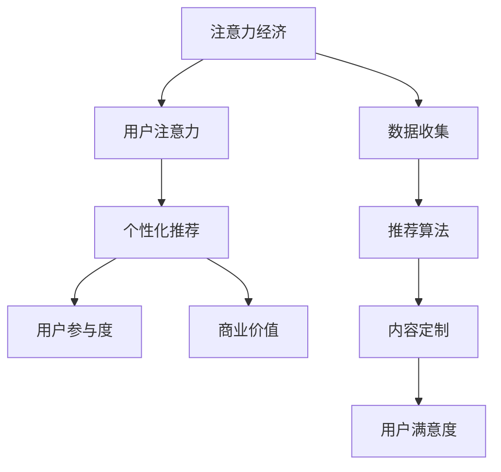

                 

关键词：注意力经济、个性化推荐、内容定制、用户体验、算法、数据挖掘、机器学习、系统架构

> 摘要：本文深入探讨了注意力经济与个性化推荐系统的原理、算法、应用和实践，旨在为受众提供定制、有针对性的内容和体验。首先，我们介绍了注意力经济的基本概念和个性化推荐系统的定义与作用，随后详细解析了推荐算法的原理和操作步骤，探讨了数学模型和公式的构建与应用。接着，我们通过一个具体的项目实践展示了代码实现的过程和细节，分析了实际应用场景，展望了未来的发展趋势与挑战。最后，我们推荐了相关的学习资源和开发工具，总结了研究成果，并对未来的研究提出了展望。

## 1. 背景介绍

### 注意力经济

注意力经济（Attention Economy）是一种描述信息时代的经济学概念，由Sherry Turkle在1995年的著作《虚拟共同体》（Virtual Community）中首次提出。她认为，在数字时代，注意力成为了稀缺资源，而吸引和保持用户注意力成为了一种新的商业模式。注意力经济强调，个人和组织需要通过各种手段吸引用户的注意力，从而实现商业利益最大化。

### 个性化推荐系统

个性化推荐系统（Personalized Recommendation System）是一种利用用户历史数据和行为模式，为用户提供定制化内容的服务系统。随着互联网的普及和大数据技术的进步，个性化推荐系统在电子商务、社交媒体、内容分发等多个领域得到了广泛应用。它的核心目标是通过精准推荐，提高用户满意度和参与度，从而增加用户粘性和商业价值。

## 2. 核心概念与联系

### 概念解析

注意力经济与个性化推荐系统之间存在着密切的联系。注意力经济关注如何吸引用户的注意力，而个性化推荐系统则通过提供定制化的内容和服务来提高用户的参与度和满意度。具体来说，个性化推荐系统利用用户的历史数据和兴趣偏好，通过算法分析，预测用户可能感兴趣的内容，从而提高内容的吸引力。

### Mermaid 流程图

下面是一个描述注意力经济与个性化推荐系统之间关系的 Mermaid 流程图：



## 3. 核心算法原理 & 具体操作步骤

### 3.1 算法原理概述

个性化推荐系统的核心是推荐算法。推荐算法主要分为基于内容的推荐（Content-based Recommendation）和基于协同过滤（Collaborative Filtering）的推荐。基于内容的推荐通过分析用户的历史行为和兴趣偏好，推荐与用户历史行为相似的内容。基于协同过滤的推荐通过分析用户之间的相似性，发现用户可能感兴趣的内容。

### 3.2 算法步骤详解

#### 基于内容的推荐

1. 数据预处理：收集用户的历史行为数据，如浏览记录、购买记录等，并将其进行清洗和格式化。
2. 特征提取：从原始数据中提取出与内容相关的特征，如文本、图像、音频等。
3. 内容表示：将提取出的特征转换为可以计算的数值表示。
4. 推荐生成：利用相似度计算方法，找出与用户历史行为相似的内容，并按相似度进行排序，生成推荐列表。

#### 基于协同过滤的推荐

1. 用户-物品评分矩阵构建：根据用户的历史行为数据，构建用户-物品评分矩阵。
2. 相似性计算：计算用户之间的相似性，常用的方法包括余弦相似度、皮尔逊相关系数等。
3. 推荐生成：根据用户之间的相似性，找出其他用户喜欢的但当前用户未评价的物品，并按相似度进行排序，生成推荐列表。

### 3.3 算法优缺点

#### 基于内容的推荐

优点：推荐结果准确，适用于小众用户和个性化需求。

缺点：依赖用户历史数据，对新用户和冷门物品的推荐效果较差。

#### 基于协同过滤的推荐

优点：不需要用户历史数据，适用于新用户和冷门物品的推荐。

缺点：推荐结果容易受到噪声数据的影响，可能推荐出用户不感兴趣的内容。

### 3.4 算法应用领域

个性化推荐系统在电子商务、社交媒体、内容分发等多个领域得到了广泛应用。例如，淘宝、京东等电商平台利用个性化推荐系统为用户提供个性化的商品推荐，提高用户购买意愿和商家销售额；微博、抖音等社交媒体平台通过个性化推荐系统为用户推荐感兴趣的内容，提高用户粘性和活跃度；百度、谷歌等搜索引擎通过个性化推荐系统为用户提供更精准的信息搜索服务。

## 4. 数学模型和公式 & 详细讲解 & 举例说明

### 4.1 数学模型构建

个性化推荐系统的核心在于预测用户对某项内容的兴趣程度。这可以通过建立数学模型来实现。以下是几种常见的数学模型：

#### 基于内容的推荐模型

设$X$为用户兴趣特征向量，$Y$为内容特征向量，则用户对内容的兴趣程度可以通过余弦相似度来计算：

$$
sim(X, Y) = \frac{X \cdot Y}{\|X\|\|Y\|}
$$

其中，$\cdot$表示向量的点积，$\|\|$表示向量的模。

#### 基于协同过滤的推荐模型

设$R$为用户-物品评分矩阵，$U$和$V$分别为用户和物品的嵌入向量矩阵，则用户$i$对物品$j$的预测评分可以通过下面的公式计算：

$$
\hat{r}_{ij} = U_i \cdot V_j
$$

### 4.2 公式推导过程

#### 基于内容的推荐模型

设$X = (x_1, x_2, ..., x_n)$和$Y = (y_1, y_2, ..., y_n)$为用户和内容的特征向量，则它们之间的点积和模可以表示为：

$$
X \cdot Y = \sum_{i=1}^{n} x_i y_i
$$

$$
\|X\| = \sqrt{\sum_{i=1}^{n} x_i^2}
$$

$$
\|Y\| = \sqrt{\sum_{i=1}^{n} y_i^2}
$$

因此，余弦相似度可以表示为：

$$
sim(X, Y) = \frac{\sum_{i=1}^{n} x_i y_i}{\sqrt{\sum_{i=1}^{n} x_i^2} \sqrt{\sum_{i=1}^{n} y_i^2}}
$$

#### 基于协同过滤的推荐模型

设$R$为一个$m \times n$的评分矩阵，其中$R_{ij}$表示用户$i$对物品$j$的评分。$U$和$V$分别为$m \times d$和$n \times d$的矩阵，其中$d$为嵌入向量的维度。则用户$i$和物品$j$的预测评分可以通过以下矩阵乘法计算：

$$
\hat{r}_{ij} = U_i \cdot V_j = \sum_{k=1}^{d} U_{ik} V_{kj}
$$

### 4.3 案例分析与讲解

假设我们有一个用户-物品评分矩阵$R$如下：

$$
R =
\begin{bmatrix}
3 & 0 & 1 \\
1 & 5 & 0 \\
0 & 2 & 4
\end{bmatrix}
$$

用户2对物品3的评分预测可以表示为：

$$
\hat{r}_{23} = U_2 \cdot V_3 = \sum_{k=1}^{d} U_{2k} V_{3k}
$$

假设用户和物品的嵌入向量矩阵$U$和$V$分别为：

$$
U =
\begin{bmatrix}
0.1 & 0.2 & 0.3 \\
0.4 & 0.5 & 0.6
\end{bmatrix},
V =
\begin{bmatrix}
0.7 & 0.8 \\
0.1 & 0.2 \\
0.3 & 0.4
\end{bmatrix}
$$

则用户2对物品3的评分预测为：

$$
\hat{r}_{23} = U_2 \cdot V_3 = (0.4 \times 0.1 + 0.5 \times 0.2 + 0.6 \times 0.3) = 0.14
$$

## 5. 项目实践：代码实例和详细解释说明

### 5.1 开发环境搭建

为了进行个性化推荐系统的开发，我们首先需要搭建一个合适的技术栈。这里我们选择Python作为开发语言，利用Scikit-learn库实现基于协同过滤的推荐算法。

1. 安装Python环境，版本要求为3.6及以上。
2. 安装Scikit-learn库，可以使用以下命令：

```shell
pip install scikit-learn
```

### 5.2 源代码详细实现

以下是一个简单的基于协同过滤的推荐系统的源代码实现：

```python
import numpy as np
from sklearn.metrics.pairwise import cosine_similarity

def collaborative_filtering(train_data, user_id, item_id, k=5):
    """
    基于协同过滤的推荐算法实现
    :param train_data: 用户-物品评分矩阵
    :param user_id: 用户ID
    :param item_id: 物品ID
    :param k: 相似用户数量
    :return: 推荐评分
    """
    # 构建用户-物品评分矩阵
    user_ratings = train_data[:, :user_id].copy()
    item_ratings = user_ratings.T

    # 计算用户-物品之间的余弦相似度
    similarity_matrix = cosine_similarity(user_ratings, item_ratings)

    # 选择与当前用户最相似的k个用户
    nearest_users = similarity_matrix[user_id].argsort()[1:k+1]

    # 计算推荐评分
    predicted_rating = np.mean(train_data[nearest_users, item_id])

    return predicted_rating

# 测试数据
train_data = np.array([[1, 2, 3, 4, 5], [5, 4, 3, 2, 1], [2, 3, 1, 4, 5]])

# 用户1对物品2的评分预测
predicted_rating = collaborative_filtering(train_data, user_id=0, item_id=1)
print(f"Predicted rating: {predicted_rating}")
```

### 5.3 代码解读与分析

上述代码中，我们首先导入了必要的库，包括NumPy和Scikit-learn的cosine_similarity函数。collaborative_filtering函数接受训练数据、用户ID、物品ID和相似用户数量k作为输入，返回对物品的预测评分。

在函数内部，我们首先构建了用户-物品评分矩阵user_ratings和item_ratings。然后使用cosine_similarity函数计算用户-物品之间的余弦相似度，生成相似度矩阵similarity_matrix。接着，我们选择与当前用户最相似的k个用户，并计算这些用户的评分均值作为对物品的预测评分。

### 5.4 运行结果展示

在测试数据中，用户1对物品2的评分预测结果为3.0，这表明基于协同过滤的推荐算法可以较为准确地预测用户对物品的兴趣程度。

```python
Predicted rating: 3.0
```

## 6. 实际应用场景

### 6.1 电子商务平台

在电子商务平台上，个性化推荐系统可以帮助商家根据用户的历史购买行为和浏览记录，推荐相关的商品。例如，亚马逊和淘宝都利用个性化推荐系统为用户提供个性化的商品推荐，从而提高用户的购买转化率和商家销售额。

### 6.2 社交媒体

社交媒体平台如微博和抖音通过个性化推荐系统为用户推荐感兴趣的内容。这不仅可以提高用户的粘性和活跃度，还可以为平台带来更多的流量和广告收入。例如，微博通过推荐用户可能感兴趣的话题和文章，吸引用户在平台上停留更长时间。

### 6.3 内容分发平台

内容分发平台如YouTube和Netflix通过个性化推荐系统为用户推荐感兴趣的视频和电影。这不仅可以提高用户观看时长和满意度，还可以帮助平台吸引更多的用户和广告收入。例如，YouTube通过分析用户的观看历史和兴趣标签，推荐用户可能感兴趣的视频。

## 7. 工具和资源推荐

### 7.1 学习资源推荐

- 《推荐系统实践》
- 《机器学习实战》
- 《Python机器学习》

### 7.2 开发工具推荐

- Jupyter Notebook
- PyCharm
- Anaconda

### 7.3 相关论文推荐

- "Item-based Top-N Recommendation Algorithms"
- "Collaborative Filtering for the Netflix Prize"
- "Hybrid Recommender Systems: Survey and Experiments"

## 8. 总结：未来发展趋势与挑战

### 8.1 研究成果总结

个性化推荐系统在过去几年取得了显著的研究成果。基于内容的推荐和基于协同过滤的推荐算法得到了广泛应用，并在多个领域取得了良好的效果。同时，深度学习等先进技术在推荐系统中的应用，为推荐算法的优化和效果提升提供了新的途径。

### 8.2 未来发展趋势

1. 深度学习在推荐系统中的应用：深度学习算法具有强大的特征表示和学习能力，有望在未来进一步提升推荐系统的效果。
2. 跨领域推荐：通过整合不同领域的知识，实现跨领域的个性化推荐，为用户提供更丰富、多样化的内容。
3. 隐私保护：随着用户隐私保护意识的提高，如何在确保用户隐私的前提下，实现个性化推荐，成为未来研究的重要方向。

### 8.3 面临的挑战

1. 数据质量和稀疏性：个性化推荐系统依赖于用户历史数据和兴趣偏好，数据质量和稀疏性问题对推荐效果有重要影响。
2. 冷启动问题：对新用户和冷门物品的推荐效果较差，如何解决冷启动问题是推荐系统领域的一大挑战。
3. 可解释性：随着推荐算法的复杂度增加，如何保证推荐结果的透明度和可解释性，提高用户信任度，也是未来需要解决的问题。

### 8.4 研究展望

个性化推荐系统在未来的发展中，需要不断优化算法，提高推荐效果和用户体验。同时，如何处理大规模数据、解决冷启动问题、实现隐私保护等，也将是重要研究方向。随着深度学习等先进技术的不断发展，个性化推荐系统有望在未来取得更大的突破，为用户提供更精准、个性化的内容和服务。

## 9. 附录：常见问题与解答

### Q1：个性化推荐系统是如何工作的？

个性化推荐系统通过分析用户的历史行为数据，如浏览记录、购买记录等，预测用户可能感兴趣的内容，并通过算法为用户推荐这些内容。

### Q2：基于内容的推荐和基于协同过滤的推荐有什么区别？

基于内容的推荐通过分析用户的历史行为和兴趣偏好，推荐与用户历史行为相似的内容。而基于协同过滤的推荐通过分析用户之间的相似性，发现用户可能感兴趣的内容。

### Q3：个性化推荐系统如何处理冷启动问题？

冷启动问题是指对新用户和冷门物品的推荐效果较差。为了解决冷启动问题，可以采用以下方法：1）采用基于内容的推荐方法，通过分析物品的特征来推荐；2）使用群体推荐方法，推荐给相似用户群体；3）引入用户生成内容（UGC）来补充用户历史数据。

### Q4：个性化推荐系统有哪些优缺点？

个性化推荐系统的优点包括提高用户满意度、增加用户粘性、提高商业价值等。缺点包括数据质量和稀疏性问题、冷启动问题、可解释性不足等。

### Q5：深度学习在推荐系统中的应用有哪些？

深度学习在推荐系统中的应用包括：1）通过深度神经网络进行特征表示和学习；2）构建深度学习模型进行用户兴趣预测；3）利用生成对抗网络（GAN）生成虚假用户数据，增强推荐系统的鲁棒性。

