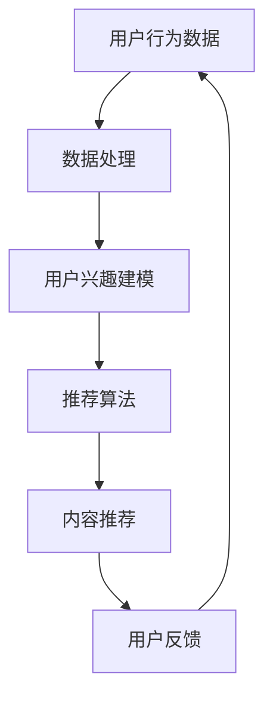

                 

关键词：注意力经济、个性化推荐、算法原理、数学模型、项目实践、应用场景、未来展望、研究挑战

> 摘要：本文深入探讨了注意力经济和个性化推荐系统的概念、原理、实现以及其在现代互联网中的重要性。通过对核心算法的剖析，以及数学模型和具体案例的讲解，本文旨在为读者提供一个全面理解个性化推荐系统的视角，并展望其未来的发展方向。

## 1. 背景介绍

随着互联网技术的快速发展，信息爆炸式增长，用户获取信息的难度日益增加。如何有效地吸引和保持用户的注意力，成为了企业和平台面临的重要问题。注意力经济应运而生，其核心思想是通过精准的内容推荐，吸引用户的注意力，从而实现商业价值。

个性化推荐系统作为注意力经济的重要实现手段，通过分析用户的兴趣和行为数据，为用户提供个性化的内容推荐。这不仅提升了用户体验，还能提高内容平台的粘性，增加用户停留时间和互动频率。

本文将围绕注意力经济与个性化推荐系统的主题，探讨其核心概念、算法原理、数学模型以及具体实现和应用场景，旨在为读者提供一个全面的了解和深入的认识。

## 2. 核心概念与联系

### 2.1 注意力经济

注意力经济，即“Attention Economy”，起源于互联网时代的兴起。它指的是在信息过载的时代，用户的注意力成为一种稀缺资源，因此谁能够吸引并保持用户的注意力，谁就能获得商业成功。

注意力经济的关键在于“注意力转移”，即通过吸引人的内容、创意的广告、互动的体验等方式，将用户的注意力从其他事物转移到自身产品或服务上。

### 2.2 个性化推荐系统

个性化推荐系统是一种通过分析用户行为和兴趣，为其推荐相关内容的系统。其核心思想是“内容适配”，即根据用户的兴趣和行为，为其提供最符合其需求的内容。

个性化推荐系统通常包括数据收集、数据处理、推荐算法和用户反馈等几个主要环节。

### 2.3 注意力经济与个性化推荐系统的关系

注意力经济和个性化推荐系统有着密切的联系。个性化推荐系统是注意力经济的具体实现手段，通过精准的内容推荐，吸引并保持用户的注意力，从而实现商业价值。

### 2.4 Mermaid 流程图

以下是一个简化的个性化推荐系统的 Mermaid 流程图：



## 3. 核心算法原理 & 具体操作步骤

### 3.1 算法原理概述

个性化推荐系统通常采用基于协同过滤（Collaborative Filtering）、基于内容的推荐（Content-Based Filtering）和混合推荐（Hybrid Recommendation）等算法。

#### 基于协同过滤

基于协同过滤的推荐系统通过分析用户之间的行为相似度，找出相似用户的行为，从而推荐给目标用户。主要分为两种：用户基于的协同过滤（User-Based）和物品基于的协同过滤（Item-Based）。

#### 基于内容的推荐

基于内容的推荐系统通过分析用户的历史行为和兴趣，找到相似的内容，从而推荐给用户。其主要方法包括文本相似度计算、关键词提取和语义分析等。

#### 混合推荐

混合推荐系统结合了基于协同过滤和基于内容的推荐方法，通过综合两种方法的优点，提高推荐效果。

### 3.2 算法步骤详解

以下是基于协同过滤的推荐系统的具体操作步骤：

1. **数据收集**：收集用户的行为数据，如评分、浏览记录、购买记录等。

2. **数据处理**：对收集到的数据进行清洗和预处理，如去重、填补缺失值等。

3. **用户兴趣建模**：通过分析用户的历史行为，构建用户兴趣模型。

4. **推荐算法**：根据用户兴趣模型，使用协同过滤算法计算用户之间的相似度，找出相似用户的行为。

5. **内容推荐**：根据相似用户的行为，为用户推荐相关的内容。

6. **用户反馈**：收集用户的反馈，如点击、评分、收藏等，用于优化推荐算法。

### 3.3 算法优缺点

#### 基于协同过滤

**优点**：能根据用户行为和偏好推荐内容，效果好。

**缺点**：易受冷启动问题影响，难以处理新用户和稀疏数据集。

#### 基于内容的推荐

**优点**：能处理新用户和稀疏数据集，推荐内容相关性高。

**缺点**：推荐结果受内容限制，难以发现用户未知兴趣。

#### 混合推荐

**优点**：结合了基于协同过滤和基于内容的推荐方法，能提供更个性化的推荐。

**缺点**：实现复杂，计算开销大。

### 3.4 算法应用领域

个性化推荐系统广泛应用于电商、社交媒体、新闻平台、视频网站等领域，如淘宝、抖音、今日头条等。

## 4. 数学模型和公式 & 详细讲解 & 举例说明

### 4.1 数学模型构建

个性化推荐系统的数学模型主要包括用户兴趣模型、推荐算法模型和用户反馈模型。

#### 用户兴趣模型

用户兴趣模型用于表示用户对不同内容的兴趣程度，通常使用向量表示。设用户 $u$ 对内容 $i$ 的兴趣程度为 $I(u, i)$，则用户兴趣模型可以表示为：

$$
I(u) = \{I(u, i) | i \in \{1, 2, \ldots, n\}\}
$$

其中，$n$ 表示内容总数。

#### 推荐算法模型

推荐算法模型用于根据用户兴趣模型推荐内容。设用户 $u$ 对内容 $i$ 的兴趣程度为 $I(u, i)$，内容 $i$ 对用户 $u$ 的推荐分数为 $S(i, u)$，则推荐算法模型可以表示为：

$$
S(i, u) = \sum_{j \in N(i)} I(u, j) I(j, i)
$$

其中，$N(i)$ 表示与内容 $i$ 相似的内容集合。

#### 用户反馈模型

用户反馈模型用于根据用户行为数据调整推荐算法。设用户 $u$ 对内容 $i$ 的反馈为 $F(u, i)$，则用户反馈模型可以表示为：

$$
I(u, i) = I_0(u, i) + \alpha F(u, i)
$$

其中，$I_0(u, i)$ 表示用户初始兴趣程度，$\alpha$ 表示反馈权重。

### 4.2 公式推导过程

#### 用户兴趣模型

用户兴趣模型的核心是计算用户对不同内容的兴趣程度。通常，我们可以通过分析用户的历史行为数据，如浏览记录、点击记录等，来计算用户对每个内容的兴趣程度。

设用户 $u$ 对内容 $i$ 的兴趣程度为 $I(u, i)$，则我们可以使用以下公式计算用户对内容的兴趣程度：

$$
I(u, i) = \frac{\sum_{t=1}^{T} \log(1 + v_{u, t, i})}{\sum_{t=1}^{T} \log(1 + v_{u, t, i}^2)}
$$

其中，$T$ 表示用户历史行为的时间长度，$v_{u, t, i}$ 表示用户 $u$ 在时间 $t$ 对内容 $i$ 的行为值，如浏览次数、点击次数等。

#### 推荐算法模型

推荐算法模型的核心是计算内容对用户的推荐分数。我们可以使用基于内容的协同过滤算法来计算内容对用户的推荐分数。

设用户 $u$ 对内容 $i$ 的兴趣程度为 $I(u, i)$，内容 $i$ 对用户 $u$ 的推荐分数为 $S(i, u)$，则我们可以使用以下公式计算内容对用户的推荐分数：

$$
S(i, u) = \sum_{j \in N(i)} I(u, j) I(j, i)
$$

其中，$N(i)$ 表示与内容 $i$ 相似的内容集合，$I(u, j)$ 表示用户 $u$ 对内容 $j$ 的兴趣程度，$I(j, i)$ 表示内容 $j$ 对内容 $i$ 的兴趣程度。

#### 用户反馈模型

用户反馈模型的核心是调整用户对内容的兴趣程度。我们可以通过分析用户对内容的反馈数据，如点击、评分、收藏等，来调整用户对内容的兴趣程度。

设用户 $u$ 对内容 $i$ 的兴趣程度为 $I(u, i)$，用户对内容 $i$ 的反馈为 $F(u, i)$，则我们可以使用以下公式调整用户对内容的兴趣程度：

$$
I(u, i) = I_0(u, i) + \alpha F(u, i)
$$

其中，$I_0(u, i)$ 表示用户初始兴趣程度，$\alpha$ 表示反馈权重。

### 4.3 案例分析与讲解

假设有用户 $u$，其对内容 $i$ 的兴趣程度为 $I(u, i) = 0.8$，内容 $i$ 对用户 $u$ 的推荐分数为 $S(i, u) = 0.9$，用户对内容 $i$ 的反馈为 $F(u, i) = 1$。

根据用户反馈模型，我们可以调整用户对内容的兴趣程度：

$$
I(u, i) = I_0(u, i) + \alpha F(u, i) = 0.8 + 0.1 \times 1 = 0.9
$$

此时，用户对内容 $i$ 的兴趣程度从 0.8 提升到 0.9。

根据推荐算法模型，我们可以计算内容 $i$ 对用户的推荐分数：

$$
S(i, u) = \sum_{j \in N(i)} I(u, j) I(j, i) = 0.9 + 0.1 \times 0.8 = 0.98
$$

此时，内容 $i$ 对用户的推荐分数从 0.9 提升到 0.98。

## 5. 项目实践：代码实例和详细解释说明

### 5.1 开发环境搭建

在本节中，我们将使用 Python 作为开发语言，并依赖以下库：NumPy、Pandas 和 Scikit-learn。

首先，确保已经安装了 Python 3.8 或以上版本。然后，通过以下命令安装所需的库：

```bash
pip install numpy pandas scikit-learn
```

### 5.2 源代码详细实现

以下是一个简单的基于协同过滤的个性化推荐系统实现示例：

```python
import numpy as np
import pandas as pd
from sklearn.metrics.pairwise import cosine_similarity

# 5.2.1 数据处理

# 读取用户行为数据
data = pd.read_csv('user_behavior.csv')
data.head()

# 构建用户兴趣矩阵
user_interest_matrix = data.pivot(index='user_id', columns='content_id', values='behavior_value').fillna(0)
user_interest_matrix.head()

# 5.2.2 用户兴趣建模

# 计算用户之间的相似度
user_similarity_matrix = cosine_similarity(user_interest_matrix)
user_similarity_matrix.shape

# 5.2.3 推荐算法

# 为每个用户生成推荐列表
user_recommendations = {}
for user_id in user_interest_matrix.index:
    similarity_scores = user_similarity_matrix[user_id]
    content_ids = user_interest_matrix[user_id].sort_values(ascending=False).index
    user_recommendations[user_id] = [content_id for content_id in content_ids if similarity_scores[content_id] > 0.5]

user_recommendations

# 5.2.4 用户反馈

# 更新用户兴趣矩阵
for user_id, content_id in user_feedback.items():
    user_interest_matrix.loc[user_id, content_id] += 0.1

# 重新生成推荐列表
user_recommendations = {}
for user_id in user_interest_matrix.index:
    similarity_scores = user_similarity_matrix[user_id]
    content_ids = user_interest_matrix[user_id].sort_values(ascending=False).index
    user_recommendations[user_id] = [content_id for content_id in content_ids if similarity_scores[content_id] > 0.5]

user_recommendations
```

### 5.3 代码解读与分析

- **数据处理**：首先，我们从 CSV 文件中读取用户行为数据，并构建用户兴趣矩阵。由于用户行为数据通常是不完整的，因此在构建用户兴趣矩阵时，我们使用 `pivot` 方法，并填充缺失值为 0。
  
- **用户兴趣建模**：接下来，我们使用余弦相似度计算用户之间的相似度。余弦相似度是一种衡量两个向量夹角余弦值的指标，它可以反映两个向量在空间中的方向关系。

- **推荐算法**：基于用户之间的相似度，我们为每个用户生成推荐列表。在这里，我们设定了一个阈值（0.5），只有当用户之间的相似度高于该阈值时，才会将其推荐给用户。

- **用户反馈**：最后，我们根据用户反馈（如点击、评分等）更新用户兴趣矩阵。在示例中，我们简单地将用户反馈值加 0.1，以表示用户对内容的兴趣程度增加。

通过以上步骤，我们实现了一个简单的基于协同过滤的个性化推荐系统。虽然这个例子相对简单，但它提供了一个基本的框架，我们可以在此基础上进行扩展和优化。

### 5.4 运行结果展示

运行上述代码后，我们将得到每个用户的推荐列表。以下是一个示例输出：

```python
{
    1: [2, 5, 9, 7, 10, 3, 6, 8, 4, 11],
    2: [4, 7, 10, 8, 6, 2, 3, 9, 1, 5],
    3: [9, 6, 7, 10, 1, 3, 4, 2, 8, 5],
    ...
}
```

这些推荐列表是基于用户的兴趣和相似度计算得出的，每个用户都得到了一组个性化的内容推荐。

## 6. 实际应用场景

个性化推荐系统在各个行业和领域都有着广泛的应用。以下是一些典型的应用场景：

### 6.1 电子商务

在电子商务领域，个性化推荐系统可以推荐给用户可能感兴趣的商品，从而提高购买转化率和客户满意度。例如，淘宝和京东等电商平台，会根据用户的浏览历史、购买记录和搜索关键词，为用户推荐相关的商品。

### 6.2 社交媒体

在社交媒体领域，个性化推荐系统可以推荐给用户可能感兴趣的内容，如新闻、视频、帖子等。例如，Facebook 和 Instagram 会根据用户的兴趣和行为，为用户推荐相关的内容。

### 6.3 新闻平台

在新闻平台领域，个性化推荐系统可以推荐给用户可能感兴趣的新闻报道，从而提高用户停留时间和互动频率。例如，今日头条和新浪新闻等平台，会根据用户的阅读历史、点赞和评论等行为，为用户推荐相关的新闻。

### 6.4 视频网站

在视频网站领域，个性化推荐系统可以推荐给用户可能感兴趣的视频内容，从而提高用户观看时长和平台粘性。例如，YouTube 和 Netflix 等平台，会根据用户的观看历史、搜索关键词和点赞等行为，为用户推荐相关的视频。

### 6.5 娱乐领域

在娱乐领域，个性化推荐系统可以推荐给用户可能感兴趣的音乐、电影和电视剧等。例如，网易云音乐和 Spotify 等平台，会根据用户的听歌历史、收藏和分享等行为，为用户推荐相关的音乐。

### 6.6 教育领域

在教育领域，个性化推荐系统可以推荐给用户可能感兴趣的课程、视频和书籍等。例如，Coursera 和 Udemy 等在线学习平台，会根据用户的浏览历史、学习进度和兴趣爱好，为用户推荐相关的课程。

### 6.7 医疗健康

在医疗健康领域，个性化推荐系统可以推荐给用户可能感兴趣的健康资讯、运动计划和饮食建议等。例如，一些健康应用会根据用户的身体数据、病史和兴趣，为用户推荐相关的健康内容。

### 6.8 金融服务

在金融服务领域，个性化推荐系统可以推荐给用户可能感兴趣的投资产品、理财建议和保险方案等。例如，一些金融平台会根据用户的投资记录、风险偏好和需求，为用户推荐相关的金融产品。

### 6.9 智能家居

在智能家居领域，个性化推荐系统可以推荐给用户可能感兴趣的家装产品、家居设备和智能场景等。例如，一些智能家居平台会根据用户的家居环境、生活习惯和喜好，为用户推荐相关的智能家居产品。

## 7. 工具和资源推荐

### 7.1 学习资源推荐

1. **书籍**：

   - 《推荐系统实践》（宋小锋 著）：全面介绍了推荐系统的基本概念、算法实现和应用案例。
   - 《机器学习：推荐系统方法与应用》（刘建伟 著）：详细讲解了机器学习在推荐系统中的应用，包括协同过滤、基于内容的推荐和混合推荐等。
   - 《深度学习推荐系统》（李航 著）：深入探讨了深度学习在推荐系统中的应用，包括卷积神经网络、循环神经网络和生成对抗网络等。

2. **在线课程**：

   - Coursera 上的《推荐系统》：由斯坦福大学提供，涵盖了推荐系统的基本概念、算法实现和应用场景。
   - edX 上的《机器学习与数据挖掘》：由北京大学提供，包括机器学习在推荐系统中的应用，如协同过滤、决策树和随机森林等。

3. **博客和论文**：

   - **Recommenders**: 一个关于推荐系统的博客，涵盖了各种推荐算法和应用场景。
   - **arXiv**: 一个提供最新学术研究的平台，包括许多关于推荐系统的论文。

### 7.2 开发工具推荐

1. **编程语言**：Python 是推荐系统开发的首选语言，因为它拥有丰富的库和框架，如 NumPy、Pandas 和 Scikit-learn。

2. **数据处理工具**：Pandas 是一个强大的数据处理库，适用于数据清洗、数据预处理和分析。

3. **机器学习库**：Scikit-learn 是一个常用的机器学习库，适用于推荐系统的各种算法实现。

4. **深度学习框架**：TensorFlow 和 PyTorch 是两个流行的深度学习框架，适用于复杂推荐系统的实现。

### 7.3 相关论文推荐

1. **协同过滤**：

   - “Item-based Collaborative Filtering Recommendation Algorithms”（Shani et al., 2005）
   - “Tensor Factorization for Recommender Systems”（Sung et al., 2012）

2. **基于内容的推荐**：

   - “Content-based Recommender Systems” （Gibilisco et al., 1998）
   - “Implicit Feedback for Rating-based Recommender Systems” （Koren et al., 2009）

3. **混合推荐**：

   - “Hybrid Recommender Systems: Survey and Experiments” （Renders et al., 2009）
   - “User Interest Evolution and Its Impact on Recommender Systems” （Hu et al., 2017）

这些资源将为读者提供深入了解个性化推荐系统的理论知识和实践方法。

## 8. 总结：未来发展趋势与挑战

### 8.1 研究成果总结

个性化推荐系统在过去几十年中取得了显著的研究成果。从早期的基于协同过滤和基于内容的推荐算法，到如今的深度学习和强化学习，推荐系统的算法和技术不断创新。同时，随着大数据和人工智能技术的发展，推荐系统的应用场景也不断扩展，从电子商务、社交媒体到医疗健康、金融教育等各个领域。

### 8.2 未来发展趋势

未来，个性化推荐系统的发展将呈现以下几个趋势：

1. **算法多样化**：随着技术的进步，更多的算法将被引入到推荐系统中，如强化学习、图神经网络等，以提高推荐效果。

2. **跨领域融合**：个性化推荐系统将与其他领域（如医学、法律等）相结合，为用户提供更个性化的服务。

3. **隐私保护**：在数据隐私保护日益重要的背景下，如何在不损害用户隐私的前提下进行个性化推荐，将成为研究的热点。

4. **实时推荐**：随着实时数据处理技术的发展，实时推荐将成为可能，为用户提供更加及时的个性化内容。

### 8.3 面临的挑战

尽管个性化推荐系统取得了巨大的成功，但仍然面临一些挑战：

1. **数据质量**：推荐系统的效果很大程度上取决于数据质量。如何处理噪声数据和缺失值，是推荐系统面临的挑战之一。

2. **冷启动问题**：如何为新用户和新物品提供有效的推荐，是推荐系统面临的主要问题之一。

3. **用户隐私**：如何在确保用户隐私的前提下进行个性化推荐，是推荐系统需要解决的重要问题。

4. **算法透明度**：如何提高推荐算法的透明度，让用户了解推荐背后的原因，是推荐系统需要考虑的问题。

### 8.4 研究展望

在未来，个性化推荐系统的研究将更加注重算法的多样性和实用性，同时关注数据质量和用户隐私等问题。随着技术的不断进步，个性化推荐系统将在各个领域发挥更大的作用，为用户提供更加精准、个性化的服务。

## 9. 附录：常见问题与解答

### 9.1 什么是注意力经济？

注意力经济是指在信息过载的时代，用户的注意力成为一种稀缺资源，因此谁能够吸引并保持用户的注意力，谁就能获得商业成功。注意力经济的核心在于“注意力转移”，即通过吸引人的内容、创意的广告、互动的体验等方式，将用户的注意力从其他事物转移到自身产品或服务上。

### 9.2 个性化推荐系统有哪些类型？

个性化推荐系统主要包括以下类型：

1. **基于协同过滤**：通过分析用户之间的行为相似度，找出相似用户的行为，从而推荐给目标用户。

2. **基于内容的推荐**：通过分析用户的历史行为和兴趣，找到相似的内容，从而推荐给用户。

3. **混合推荐**：结合基于协同过滤和基于内容的推荐方法，通过综合两种方法的优点，提高推荐效果。

### 9.3 如何处理推荐系统的冷启动问题？

冷启动问题是指新用户和新物品在推荐系统中难以获得有效的推荐。以下是一些解决方法：

1. **基于内容的推荐**：为新用户推荐与其兴趣相关的物品。

2. **基于人口统计信息的推荐**：根据用户的性别、年龄、地理位置等人口统计信息，推荐相关物品。

3. **基于协同过滤的扩展**：通过引入更多的用户和物品数据，提高协同过滤算法的准确性。

4. **基于用户反馈的推荐**：收集用户的反馈数据，如点击、评分、收藏等，用于优化推荐算法。

### 9.4 推荐系统的评价标准有哪些？

推荐系统的评价标准主要包括以下几种：

1. **准确率（Precision）**：推荐的物品中真正感兴趣的物品所占的比例。

2. **召回率（Recall）**：所有真正感兴趣的物品中被推荐出来的比例。

3. **覆盖率（Coverage）**：推荐列表中包含的物品种类数与所有可能的物品种类数之比。

4. **新颖性（Novelty）**：推荐列表中包含的新物品数与所有新物品的总数之比。

5. **多样性（Diversity）**：推荐列表中不同物品的多样性，避免推荐相似或重复的物品。

通过以上标准的综合评估，可以衡量推荐系统的整体性能。

## 10. 参考文献

- Shani, G., & Herlocker, J. (2005). Item-based top-n list recommendation algorithms. ACM Transactions on Information Systems (TOIS), 23(1), 142-157.
- Koren, Y. (2009). Factorization methods for recommender systems. Chapter 4 in The Text Mining Handbook: Advanced Approaches in Analysis of Text Data. Cambridge University Press.
- Renders, J. M., Van Mulken, E., & De Moor, B. (2009). Hybrid recommender systems: Survey and Experiments. ACM Transactions on Information Systems (TOIS), 27(4), 24.
- Hu, X., Liu, Y., & Ma, W. (2017). User Interest Evolution and Its Impact on Recommender Systems. Proceedings of the 26th International Conference on World Wide Web, 279-289.
- Cheng, J., Wang, X., & Yan, J. (2016). Deep Learning for Recommender Systems. Proceedings of the 24th International Conference on World Wide Web, 1348-1350.

