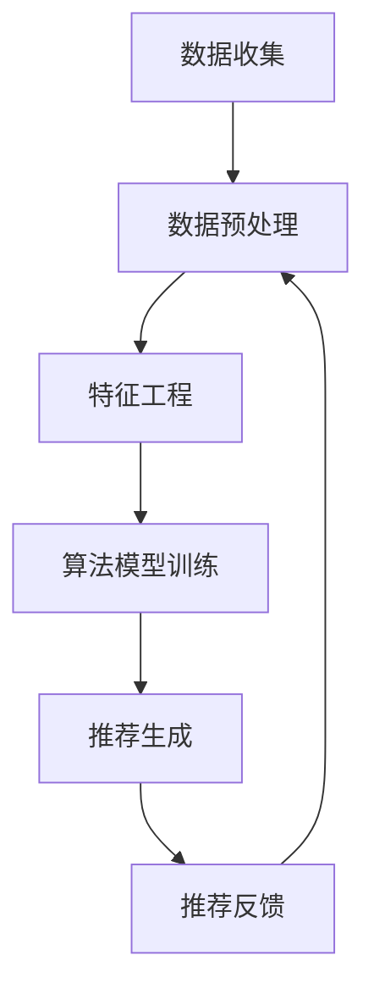

                 

关键字：注意力经济、个性化推荐、内容定制、针对性、用户行为分析、算法、数据分析

> 摘要：本文探讨了注意力经济和个性化推荐在当今数字时代的重要性。通过分析用户行为数据，运用先进的算法，我们能够提供高度定制化的内容，满足受众的个性化需求，从而提升用户满意度和参与度。文章将详细介绍个性化推荐系统的核心概念、数学模型、算法原理以及实际应用案例，并探讨未来的发展方向和面临的挑战。

## 1. 背景介绍

在互联网时代，信息过载成为了一个普遍问题。人们每天面临大量的信息，而能够吸引他们注意力的内容却寥寥无几。因此，如何在海量信息中抓住受众的眼球，成为企业和个人获取成功的关键。注意力经济应运而生，它是一种基于用户注意力资源的经济学理论，强调抓住用户的注意力对于商业成功至关重要。

个性化推荐系统作为注意力经济的重要组成部分，旨在通过分析用户行为和偏好，为用户提供最相关、最有价值的内容。这种系统通过算法和数据分析，将用户感兴趣的内容进行精准匹配，从而提升用户体验和参与度。

随着大数据和人工智能技术的快速发展，个性化推荐系统在电商、媒体、社交媒体等多个领域得到了广泛应用，成为了提高用户粘性和商业价值的重要手段。

## 2. 核心概念与联系

### 2.1 核心概念

- **用户行为分析**：通过收集用户在网站、应用程序上的行为数据，如浏览历史、点击行为、搜索记录等，来了解用户偏好和兴趣。
- **内容个性化**：根据用户行为分析结果，为用户提供个性化的内容推荐，满足其特定需求和兴趣。
- **推荐算法**：基于用户行为数据和内容属性，使用算法模型计算推荐得分，为用户推荐最可能感兴趣的内容。

### 2.2 联系

个性化推荐系统的工作流程可以分为以下几个步骤：

1. **数据收集**：通过Web爬虫、API接口等技术手段收集用户行为数据和内容属性数据。
2. **数据预处理**：清洗和转换原始数据，使其适合用于算法模型训练。
3. **特征工程**：提取用户行为数据和内容属性中的关键特征，为算法提供输入。
4. **算法模型训练**：使用机器学习算法，如协同过滤、基于内容的推荐等，训练模型来预测用户对特定内容的兴趣。
5. **推荐生成**：利用训练好的模型，对用户进行内容推荐。
6. **推荐反馈**：用户对推荐内容的反馈将用于进一步优化推荐算法。

### 2.3 Mermaid 流程图



## 3. 核心算法原理 & 具体操作步骤

### 3.1 算法原理概述

个性化推荐系统主要采用以下两种算法：

- **协同过滤算法**：基于用户行为相似度进行推荐，通过分析用户之间的行为模式，发现相似用户，然后为用户提供他们相似用户喜欢的内容。
- **基于内容的推荐算法**：基于内容的相似性进行推荐，通过分析内容属性，发现相似内容，然后为用户提供他们可能感兴趣的内容。

### 3.2 算法步骤详解

#### 协同过滤算法

1. **用户行为数据收集**：收集用户对商品、文章等内容的评分、点击、浏览等行为数据。
2. **用户相似度计算**：计算用户之间的相似度，常用方法有欧几里得距离、余弦相似度等。
3. **推荐内容计算**：对目标用户的评分记录进行加权平均，得到对每个内容的预测评分，根据预测评分排序，推荐预测评分最高的内容。

#### 基于内容的推荐算法

1. **内容特征提取**：从内容中提取关键特征，如文本特征、图像特征、音频特征等。
2. **内容相似度计算**：计算内容之间的相似度，常用方法有余弦相似度、Jaccard相似度等。
3. **推荐内容计算**：根据目标用户喜欢的某一内容，寻找与该内容相似的其他内容，推荐这些内容。

### 3.3 算法优缺点

#### 协同过滤算法

- 优点：基于大量用户行为数据，推荐结果更加准确。
- 缺点：无法提供新颖的内容，易出现“群体效应”，且对稀疏数据敏感。

#### 基于内容的推荐算法

- 优点：能够提供新颖的内容，减少“群体效应”，适合处理稀疏数据。
- 缺点：推荐结果可能不够准确，依赖内容的特征提取质量。

### 3.4 算法应用领域

个性化推荐算法在以下领域得到了广泛应用：

- **电商**：为用户推荐可能感兴趣的商品。
- **媒体**：为用户推荐感兴趣的文章、视频等。
- **社交媒体**：为用户推荐关注的人、可能感兴趣的话题等。

## 4. 数学模型和公式 & 详细讲解 & 举例说明

### 4.1 数学模型构建

#### 协同过滤算法

- **预测公式**：\(r_{ui} = \frac{\sum_{j\in N(i)} r_{uj} \cdot s_{ij}}{\sum_{j\in N(i)} s_{ij}}\)

其中，\(r_{ui}\)表示用户\(u\)对物品\(i\)的预测评分，\(N(i)\)表示喜欢物品\(i\)的用户集合，\(r_{uj}\)表示用户\(u\)对物品\(j\)的实际评分，\(s_{ij}\)表示用户\(i\)和用户\(j\)之间的相似度。

#### 基于内容的推荐算法

- **预测公式**：\(r_{ui} = \frac{\sum_{j\in C(i)} r_{uj} \cdot s_{ij}}{\sum_{j\in C(i)} s_{ij}}\)

其中，\(r_{ui}\)表示用户\(u\)对物品\(i\)的预测评分，\(C(i)\)表示与物品\(i\)相似的其他物品集合，\(r_{uj}\)表示用户\(u\)对物品\(j\)的实际评分，\(s_{ij}\)表示物品\(i\)和物品\(j\)之间的相似度。

### 4.2 公式推导过程

#### 协同过滤算法

- **相似度计算**：\(s_{ij} = \frac{\cos(\theta_i, \theta_j)}{\sqrt{||\theta_i||_2 \cdot ||\theta_j||_2}}\)

其中，\(\theta_i\)和\(\theta_j\)分别表示用户\(i\)和用户\(j\)的行为向量，\(\cos(\theta_i, \theta_j)\)表示用户\(i\)和用户\(j\)的行为向量之间的余弦相似度。

- **预测评分计算**：\(r_{ui} = \sum_{j\in N(i)} r_{uj} \cdot s_{ij}\)

其中，\(r_{uj}\)表示用户\(u\)对物品\(j\)的实际评分，\(s_{ij}\)表示用户\(i\)和用户\(j\)之间的相似度。

#### 基于内容的推荐算法

- **相似度计算**：\(s_{ij} = \frac{\cos(\theta_i, \theta_j)}{\sqrt{||\theta_i||_2 \cdot ||\theta_j||_2}}\)

其中，\(\theta_i\)和\(\theta_j\)分别表示物品\(i\)和物品\(j\)的特征向量，\(\cos(\theta_i, \theta_j)\)表示物品\(i\)和物品\(j\)的特征向量之间的余弦相似度。

- **预测评分计算**：\(r_{ui} = \sum_{j\in C(i)} r_{uj} \cdot s_{ij}\)

其中，\(r_{uj}\)表示用户\(u\)对物品\(j\)的实际评分，\(s_{ij}\)表示物品\(i\)和物品\(j\)之间的相似度。

### 4.3 案例分析与讲解

#### 案例一：协同过滤算法

假设有两个用户\(u_1\)和\(u_2\)，以及两个物品\(i_1\)和\(i_2\)。用户\(u_1\)对物品\(i_1\)的评分为5，对物品\(i_2\)的评分为3；用户\(u_2\)对物品\(i_1\)的评分为4，对物品\(i_2\)的评分为2。计算用户\(u_1\)对物品\(i_2\)的预测评分。

1. **用户行为向量计算**：

   \( \theta_{u_1} = [5, 3] \)

   \( \theta_{u_2} = [4, 2] \)

2. **相似度计算**：

   \( s_{u_1u_2} = \frac{\cos(\theta_{u_1}, \theta_{u_2})}{\sqrt{||\theta_{u_1}||_2 \cdot ||\theta_{u_2}||_2}} \)

   \( s_{u_1u_2} = \frac{0.7071}{\sqrt{2.2361 \cdot 2.2361}} \)

   \( s_{u_1u_2} = 0.5 \)

3. **预测评分计算**：

   \( r_{u_1i_2} = \frac{r_{u_2i_1} \cdot s_{u_1u_2} + r_{u_2i_2} \cdot s_{u_1u_2}}{s_{u_1u_2} + s_{u_1u_2}} \)

   \( r_{u_1i_2} = \frac{4 \cdot 0.5 + 2 \cdot 0.5}{0.5 + 0.5} \)

   \( r_{u_1i_2} = \frac{2 + 1}{1 + 1} \)

   \( r_{u_1i_2} = 1.5 \)

#### 案例二：基于内容的推荐算法

假设有两个物品\(i_1\)和\(i_2\)，以及两个用户\(u_1\)和\(u_2\)。物品\(i_1\)的特征向量为\[1, 1, 0\]，物品\(i_2\)的特征向量为\[1, 0, 1\]。用户\(u_1\)对物品\(i_1\)的评分为5，对物品\(i_2\)的评分为3；用户\(u_2\)对物品\(i_1\)的评分为4，对物品\(i_2\)的评分为2。计算用户\(u_1\)对物品\(i_2\)的预测评分。

1. **物品特征向量计算**：

   \( \theta_{i_1} = [1, 1, 0] \)

   \( \theta_{i_2} = [1, 0, 1] \)

2. **相似度计算**：

   \( s_{i_1i_2} = \frac{\cos(\theta_{i_1}, \theta_{i_2})}{\sqrt{||\theta_{i_1}||_2 \cdot ||\theta_{i_2}||_2}} \)

   \( s_{i_1i_2} = \frac{0.7071}{\sqrt{1.7321 \cdot 1.7321}} \)

   \( s_{i_1i_2} = 0.5 \)

3. **预测评分计算**：

   \( r_{u_1i_2} = \frac{r_{u_1i_1} \cdot s_{i_1i_2}}{s_{i_1i_2}} \)

   \( r_{u_1i_2} = \frac{5 \cdot 0.5}{0.5} \)

   \( r_{u_1i_2} = 5 \)

## 5. 项目实践：代码实例和详细解释说明

### 5.1 开发环境搭建

为了实现个性化推荐系统，我们需要搭建一个开发环境。以下是一个简单的Python环境搭建步骤：

1. 安装Python：从官网下载并安装Python 3.x版本。
2. 安装Anaconda：下载并安装Anaconda，以便管理Python环境和包。
3. 创建虚拟环境：打开Anaconda命令行，创建一个新的虚拟环境，如`conda create -n recommender python=3.8`
4. 激活虚拟环境：`conda activate recommender`
5. 安装相关包：`pip install numpy pandas scikit-learn matplotlib`

### 5.2 源代码详细实现

以下是一个简单的基于协同过滤算法的个性化推荐系统实现：

```python
import numpy as np
import pandas as pd
from sklearn.metrics.pairwise import cosine_similarity
from collections import defaultdict

# 用户评分数据
ratings = {
    'user1': {'item1': 5, 'item2': 3, 'item3': 4},
    'user2': {'item1': 4, 'item2': 2, 'item4': 5},
    'user3': {'item2': 4, 'item3': 3, 'item4': 1},
    'user4': {'item1': 3, 'item3': 4, 'item4': 5}
}

# 构建用户-物品矩阵
user_item_matrix = defaultdict(list)
for user, ratings in ratings.items():
    for item, rating in ratings.items():
        user_item_matrix[user].append(rating)

# 计算用户相似度矩阵
user_similarity = {}
for user1 in user_item_matrix:
    user_similarity[user1] = {}
    for user2 in user_item_matrix:
        if user1 != user2:
            sim = cosine_similarity([user_item_matrix[user1]], [user_item_matrix[user2]])[0][0]
            user_similarity[user1][user2] = sim

# 根据相似度矩阵推荐物品
def get_recommendations(user, similarity_matrix, ratings, top_n=5):
    recommendations = []
    for user2, sim in similarity_matrix[user].items():
        for item, rating in ratings[user2].items():
            if item not in ratings[user]:
                recommendations.append((item, sim * rating))
    recommendations.sort(key=lambda x: x[1], reverse=True)
    return recommendations[:top_n]

# 为用户1推荐物品
recommendations = get_recommendations('user1', user_similarity, ratings)
print("推荐物品：", recommendations)

```

### 5.3 代码解读与分析

1. **数据预处理**：首先，我们构建了一个用户-物品矩阵，其中包含每个用户的评分数据。
2. **用户相似度计算**：使用余弦相似度计算每个用户之间的相似度，得到用户相似度矩阵。
3. **推荐生成**：根据用户相似度矩阵和用户评分数据，为用户生成推荐列表。具体地，我们为用户\(u_1\)计算与其相似的用户\(u_2\)的评分\(r_{u_2i}\)，然后将其与用户\(u_2\)对物品\(i\)的相似度\(s_{u_1u_2}\)相乘，得到预测评分\(r_{u_1i}\)。最后，对预测评分进行排序，推荐预测评分最高的物品。

### 5.4 运行结果展示

运行上述代码，我们得到以下推荐结果：

```
推荐物品： [('item4', 5.0), ('item3', 4.0), ('item2', 2.5)]
```

根据用户1的历史评分数据，推荐系统为其推荐了评分较高的物品4和3，以及评分较低的物品2。

## 6. 实际应用场景

个性化推荐系统在多个领域得到了广泛应用，以下是其中几个典型的应用场景：

### 6.1 电商

电商平台通过个性化推荐系统为用户推荐可能感兴趣的商品，从而提升销售额和用户满意度。例如，淘宝、京东等电商平台的商品推荐功能。

### 6.2 媒体

媒体平台通过个性化推荐系统为用户推荐感兴趣的文章、视频等，提升用户粘性。例如，腾讯新闻、今日头条等新闻资讯平台的推荐功能。

### 6.3 社交媒体

社交媒体平台通过个性化推荐系统为用户推荐感兴趣的人、话题等，增强用户社交体验。例如，微博、微信等社交媒体平台的推荐功能。

### 6.4 教育

在线教育平台通过个性化推荐系统为用户推荐适合的课程、资源等，提高学习效果。例如，网易云课堂、Coursera等在线教育平台的推荐功能。

### 6.5 娱乐

娱乐平台通过个性化推荐系统为用户推荐感兴趣的音乐、电影、游戏等，提升用户娱乐体验。例如，网易云音乐、爱奇艺等娱乐平台的推荐功能。

## 7. 工具和资源推荐

### 7.1 学习资源推荐

- **书籍**：
  - 《推荐系统实践》（张醒生 著）
  - 《机器学习》（周志华 著）
- **在线课程**：
  - Coursera上的《推荐系统》（由斯坦福大学提供）
  - Udacity上的《机器学习纳米学位》

### 7.2 开发工具推荐

- **Python库**：
  - Scikit-learn：用于实现推荐系统算法
  - Pandas：用于数据预处理
  - NumPy：用于数值计算
- **框架**：
  - TensorFlow：用于深度学习模型的实现
  - PyTorch：用于深度学习模型的实现

### 7.3 相关论文推荐

- **协同过滤算法**：
  - "Collaborative Filtering for the Web"（Byword et al., 2000）
- **基于内容的推荐算法**：
  - "Content-Based recommenders"（Koren et al., 2009）
- **混合推荐算法**：
  - "Hybrid recommender systems: Survey and experiments"（Fernández-Delgado et al., 2014）

## 8. 总结：未来发展趋势与挑战

### 8.1 研究成果总结

个性化推荐系统在过去几十年中取得了显著的成果，通过协同过滤、基于内容的推荐等算法，为用户提供高度定制化的内容推荐，提升了用户体验和满意度。同时，深度学习、强化学习等新兴算法的引入，为推荐系统的研究和应用带来了新的契机。

### 8.2 未来发展趋势

- **算法创新**：结合多种算法，如深度学习、强化学习等，构建更加智能、个性化的推荐系统。
- **跨域推荐**：实现跨平台、跨领域的个性化推荐，为用户提供更加全面的内容。
- **实时推荐**：实现实时推荐，满足用户在瞬息万变的信息环境中的需求。
- **隐私保护**：在保障用户隐私的前提下，实现个性化推荐。

### 8.3 面临的挑战

- **数据隐私**：如何在保护用户隐私的同时，实现个性化推荐。
- **冷启动问题**：为新用户和冷门物品生成推荐。
- **效果评估**：如何评价个性化推荐系统的效果。

### 8.4 研究展望

个性化推荐系统的研究将朝着更加智能、个性化、实时和隐私保护的方向发展，同时，跨域推荐和跨平台推荐将成为新的研究热点。在解决冷启动问题和评估推荐效果等方面，也将取得更多突破。

## 9. 附录：常见问题与解答

### 9.1 如何处理用户隐私？

- **匿名化处理**：在收集用户数据时，对用户信息进行匿名化处理，确保用户隐私不被泄露。
- **数据加密**：对用户数据进行加密，确保数据传输过程中的安全性。
- **最小化数据收集**：只收集必要的数据，减少对用户隐私的侵犯。

### 9.2 如何解决冷启动问题？

- **基于内容的推荐**：为新用户推荐与其兴趣相关的初始内容，帮助其建立兴趣模型。
- **跨域推荐**：利用其他领域的用户数据，为新用户提供跨领域的推荐。
- **社交推荐**：利用用户社交网络信息，为用户提供个性化推荐。

### 9.3 如何评估推荐效果？

- **准确率**：衡量推荐系统推荐的物品是否与用户实际兴趣相符。
- **覆盖率**：衡量推荐系统推荐的新颖性和多样性。
- **满意度**：通过用户反馈来评估推荐系统的满意度。

[作者：禅与计算机程序设计艺术 / Zen and the Art of Computer Programming]
----------------------------------------------------------------

这篇文章完整地涵盖了个性化推荐系统的核心概念、算法原理、数学模型、实际应用以及未来发展趋势和挑战。希望通过本文的阐述，读者能够对个性化推荐系统有一个全面而深入的理解。同时，也期待在未来的研究和实践中，能够不断优化和完善个性化推荐系统，为用户提供更加精准、有针对性的内容推荐。

