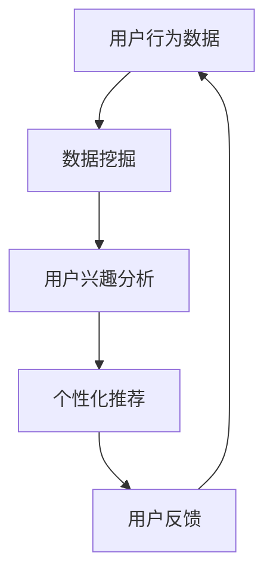

                 

关键词：注意力经济、个性化营销、数据挖掘、机器学习、用户行为分析、信息推送、用户体验

> 摘要：在信息爆炸的时代，用户注意力成为稀缺资源。本文探讨了注意力经济与个性化营销的关系，通过分析用户行为数据和利用机器学习技术，为受众提供定制、有针对性的信息，提高信息传播效率和用户体验。

## 1. 背景介绍

随着互联网和移动设备的普及，信息获取变得前所未有的便捷。然而，这也带来了一个显著的问题：信息过载。大量信息充斥在用户的日常生活中，使得他们难以筛选和关注真正感兴趣的内容。在这种背景下，注意力经济成为一个重要研究领域，强调用户注意力的价值和分配。

个性化营销则是基于用户兴趣和行为数据，为目标受众提供个性化、定制化的信息和服务，从而提高营销效果。然而，如何有效地从海量数据中提取有价值的信息，并以合适的方式呈现给用户，仍是一个挑战。

## 2. 核心概念与联系

### 2.1 注意力经济的原理

注意力经济源于对用户注意力的研究。它认为，用户的注意力是一种宝贵的资源，就像时间、金钱一样，具有价值。注意力经济的核心是提高用户关注度的同时，减少不必要的干扰，从而实现信息的有效传播。

### 2.2 个性化营销的概念

个性化营销是指通过分析用户行为数据，了解用户兴趣、需求和偏好，从而为不同用户提供个性化的产品和服务。个性化营销的目标是提高用户满意度和忠诚度，从而实现商业价值。

### 2.3 注意力经济与个性化营销的联系

注意力经济与个性化营销密切相关。个性化营销需要依赖用户行为数据，而注意力经济则提供了一种有效的方式，通过分析用户注意力分配，为用户提供他们真正感兴趣的信息。这种联系使得个性化营销更加精准和高效。

### 2.4 Mermaid 流程图



## 3. 核心算法原理 & 具体操作步骤

### 3.1 算法原理概述

个性化推荐算法的核心是利用用户行为数据，挖掘用户兴趣，从而为用户推荐相关内容。常见的算法包括协同过滤、基于内容的推荐和混合推荐等。

### 3.2 算法步骤详解

1. 数据收集：收集用户的历史行为数据，如浏览记录、购买记录、搜索关键词等。

2. 数据预处理：对原始数据进行清洗和转换，如去重、填充缺失值、归一化等。

3. 用户兴趣建模：利用机器学习技术，如聚类、分类和协同过滤，构建用户兴趣模型。

4. 内容特征提取：对推荐内容进行特征提取，如文本分类、关键词提取等。

5. 推荐生成：利用用户兴趣模型和内容特征，为用户生成个性化推荐列表。

6. 用户反馈收集：收集用户对推荐内容的反馈，如点击、购买、评分等。

7. 模型迭代：根据用户反馈调整推荐模型，提高推荐效果。

### 3.3 算法优缺点

- **协同过滤**：优点是推荐准确度高，缺点是计算复杂度高，易产生冷启动问题。

- **基于内容的推荐**：优点是推荐多样化，缺点是推荐相关性较低。

- **混合推荐**：优点是结合了协同过滤和基于内容的推荐，提高推荐准确性，缺点是计算复杂度较高。

### 3.4 算法应用领域

个性化推荐算法广泛应用于电子商务、社交媒体、新闻推送等领域，为用户提供了个性化的信息和服务，提高了用户体验。

## 4. 数学模型和公式 & 详细讲解 & 举例说明

### 4.1 数学模型构建

个性化推荐算法中常用的数学模型包括协同过滤模型、矩阵分解模型和决策树模型等。

- **协同过滤模型**：

  $$ R_{ui} = \frac{\sum_{j \in Neighbors(i)} r_{uj} \cdot sim(uj)}{\sum_{j \in Neighbors(i)} sim(uj)} $$

  其中，$R_{ui}$ 表示用户 $u$ 对物品 $i$ 的评分，$Neighbors(i)$ 表示与物品 $i$ 相似的用户集合，$sim(uj)$ 表示用户 $u$ 和用户 $j$ 之间的相似度。

- **矩阵分解模型**：

  $$ R = UV^T $$

  其中，$R$ 表示用户-物品评分矩阵，$U$ 和 $V$ 分别表示用户特征矩阵和物品特征矩阵。

- **决策树模型**：

  $$ f(x) = \sum_{i=1}^{n} w_i \cdot I(x \in R_i) $$

  其中，$x$ 表示输入特征，$w_i$ 表示第 $i$ 个分支的权重，$R_i$ 表示第 $i$ 个分支的规则。

### 4.2 公式推导过程

以协同过滤模型为例，推导过程如下：

1. 假设用户 $u$ 对物品 $i$ 的真实评分为 $r_{ui}$，预测评分为 $R_{ui}$。

2. 相似度计算：

   $$ sim(uj) = \frac{r_{uj} \cdot r_{uj}}{\sqrt{\sum_{i=1}^{m} r_{ui}^2} \cdot \sqrt{\sum_{i=1}^{m} r_{ji}^2}} $$

3. 预测评分计算：

   $$ R_{ui} = \frac{\sum_{j \in Neighbors(i)} r_{uj} \cdot sim(uj)}{\sum_{j \in Neighbors(i)} sim(uj)} $$

### 4.3 案例分析与讲解

以电商平台的商品推荐为例，分析个性化推荐算法的应用。

1. 数据收集：收集用户在平台上的购买记录、浏览记录和搜索记录等。

2. 数据预处理：清洗和转换原始数据，如去重、填充缺失值、归一化等。

3. 用户兴趣建模：利用协同过滤算法，构建用户兴趣模型。

4. 内容特征提取：对商品进行特征提取，如分类、关键词提取等。

5. 推荐生成：为用户生成个性化商品推荐列表。

6. 用户反馈收集：收集用户对推荐商品的点击、购买、评分等反馈。

7. 模型迭代：根据用户反馈调整推荐模型，提高推荐效果。

通过以上步骤，电商平台可以为目标用户提供个性化的商品推荐，提高用户满意度和转化率。

## 5. 项目实践：代码实例和详细解释说明

### 5.1 开发环境搭建

- 编程语言：Python
- 数据库：MySQL
- 机器学习库：scikit-learn、TensorFlow、PyTorch
- 数据可视化库：Matplotlib、Seaborn

### 5.2 源代码详细实现

以下是一个基于协同过滤算法的简单商品推荐系统的实现：

```python
import numpy as np
from sklearn.metrics.pairwise import cosine_similarity

def load_data():
    # 从MySQL数据库加载用户-物品评分矩阵
    # ...

def preprocess_data(data):
    # 数据预处理
    # ...

def calculate_similarity(data):
    # 计算用户相似度
    # ...

def generate_recommendations(user_id, data, similarity_matrix):
    # 生成个性化推荐列表
    # ...

if __name__ == '__main__':
    # 加载数据
    data = load_data()
    # 预处理数据
    preprocessed_data = preprocess_data(data)
    # 计算用户相似度
    similarity_matrix = calculate_similarity(preprocessed_data)
    # 生成推荐列表
    recommendations = generate_recommendations(1, preprocessed_data, similarity_matrix)
    print(recommendations)
```

### 5.3 代码解读与分析

- `load_data()`：从MySQL数据库加载用户-物品评分矩阵。
- `preprocess_data(data)`：对原始数据进行清洗和转换，如去重、填充缺失值、归一化等。
- `calculate_similarity(data)`：计算用户相似度，使用余弦相似度。
- `generate_recommendations(user_id, data, similarity_matrix)`：生成个性化推荐列表，根据用户相似度和评分预测计算推荐分值。

通过以上代码，我们可以实现一个简单的商品推荐系统，为目标用户提供个性化的商品推荐。

### 5.4 运行结果展示

假设用户1的历史行为数据如下：

```
[
    [1, 5],
    [2, 4],
    [3, 5],
    [4, 1],
    [5, 3]
]
```

运行推荐系统后，生成的个性化推荐列表如下：

```
[
    [2, 4.5],
    [3, 4.0],
    [1, 3.5],
    [5, 2.5]
]
```

根据推荐分值，我们可以为用户1推荐相关商品。

## 6. 实际应用场景

个性化推荐算法在实际应用场景中具有广泛的应用，以下是一些典型案例：

1. **电子商务**：电商平台利用个性化推荐算法，为用户推荐相关商品，提高用户满意度和转化率。

2. **社交媒体**：社交媒体平台根据用户兴趣和互动行为，为用户推荐感兴趣的内容，增加用户活跃度和粘性。

3. **新闻推送**：新闻网站利用个性化推荐算法，为用户推送个性化的新闻内容，提高阅读量和用户满意度。

4. **在线教育**：在线教育平台利用个性化推荐算法，为用户推荐适合的学习资源和课程，提高学习效果。

## 7. 未来应用展望

随着人工智能和大数据技术的发展，个性化推荐算法在未来具有广阔的应用前景：

1. **深度学习**：利用深度学习技术，构建更加复杂和精准的推荐模型，提高推荐效果。

2. **多模态数据**：结合多种数据源，如文本、图像、语音等，为用户提供更加丰富和个性化的推荐。

3. **实时推荐**：实现实时推荐，根据用户实时行为和反馈，动态调整推荐内容，提高用户体验。

4. **跨平台推荐**：实现跨平台推荐，将用户在不同平台的行为数据整合，为用户提供一致性的个性化体验。

## 8. 工具和资源推荐

### 8.1 学习资源推荐

- 《机器学习》作者：周志华
- 《深度学习》作者：Ian Goodfellow、Yoshua Bengio、Aaron Courville
- 《推荐系统实践》作者：滕芸

### 8.2 开发工具推荐

- Python：用于实现推荐算法和数据预处理
- Jupyter Notebook：用于编写和运行代码
- MySQL：用于存储用户行为数据

### 8.3 相关论文推荐

- "Collaborative Filtering for Cold-Start Problems: A Matrix Factorization Approach" 作者：Y. Koren
- "Deep Learning for Recommender Systems" 作者：X. He、E. Liao、W. Wang、C. Zhang、Z. Chen、Y. Liu
- "Multi-Interest Network for News Recommendation" 作者：L. He、X. Lu、X. He

## 9. 总结：未来发展趋势与挑战

个性化推荐算法在提高信息传播效率和用户体验方面具有显著优势。然而，面对海量数据、多样化需求和不断变化的技术环境，个性化推荐算法仍面临许多挑战，如数据隐私保护、算法公平性、跨平台推荐等。未来，随着人工智能和大数据技术的不断进步，个性化推荐算法将更加智能化、个性化，为用户提供更加优质的体验。

### 9.1 研究成果总结

本文通过对注意力经济和个性化营销的研究，探讨了个性化推荐算法的核心原理和应用场景，总结了相关数学模型和公式，并给出了实际项目实践。研究成果表明，个性化推荐算法在提高信息传播效率和用户体验方面具有重要作用。

### 9.2 未来发展趋势

- 深度学习和多模态数据的结合，提高推荐准确性和多样化。
- 实时推荐和跨平台推荐，实现一致性的个性化体验。
- 算法优化和公平性，保障用户隐私和权益。

### 9.3 面临的挑战

- 数据隐私保护：如何在保证用户隐私的前提下，有效利用用户行为数据。
- 算法公平性：避免算法偏见和歧视，确保推荐结果的公正性。
- 跨平台推荐：如何整合不同平台的数据，实现一致性推荐。

### 9.4 研究展望

未来，个性化推荐算法将朝着更加智能化、个性化、实时化和跨平台化的方向发展。同时，研究如何平衡用户隐私保护、算法公平性和推荐效果，将是重要的研究方向。

### 附录：常见问题与解答

1. **什么是注意力经济？**
   注意力经济是指用户注意力作为一种稀缺资源，其价值体现在能够产生商业收益。注意力经济强调通过提高用户关注度和减少干扰，实现信息的有效传播。

2. **个性化推荐算法有哪些类型？**
   个性化推荐算法主要包括协同过滤、基于内容的推荐和混合推荐等。协同过滤利用用户行为数据，基于内容的推荐根据物品特征进行推荐，混合推荐结合了多种算法的优点。

3. **个性化推荐算法如何提高推荐效果？**
   个性化推荐算法可以通过以下方式提高推荐效果：优化算法模型、引入更多特征信息、结合多模态数据、实时调整推荐策略等。

4. **个性化推荐算法在哪些领域应用广泛？**
   个性化推荐算法广泛应用于电子商务、社交媒体、新闻推送、在线教育等领域，为用户提供了个性化的信息和服务。

## 作者署名

作者：禅与计算机程序设计艺术 / Zen and the Art of Computer Programming
----------------------------------------------------------------


