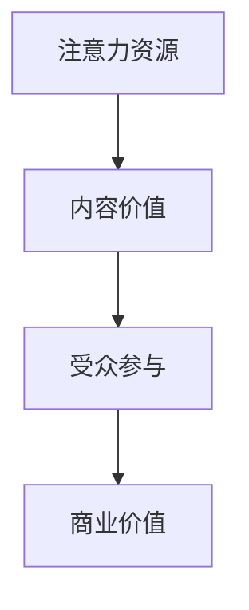

                 

关键词：注意力经济、内容策略、受众吸引力、留存策略、内容创作、技术语言、IT领域

> 摘要：在当今信息爆炸的时代，如何有效地吸引并留住受众成为内容创作者面临的重大挑战。本文以注意力经济为核心，探讨内容策略的规划与实施，为IT领域的专业人士提供了一套系统化的内容策略框架，旨在提升内容的价值，增加受众的关注度和忠诚度。

## 1. 背景介绍

在互联网和社交媒体的普及下，信息传播的速度和广度前所未有。然而，与此相对应的是，受众的注意力资源变得日益稀缺。这种现象引发了“注意力经济”这一概念的诞生，其核心在于争夺和利用受众的注意力资源，从而实现商业价值最大化。注意力经济不仅影响了广告和媒体行业，也对IT领域的内容创作与传播产生了深远影响。

### 1.1 注意力经济的定义

注意力经济是指一种以受众注意力为资源的商业模式。在这种模式中，内容创作者、广告商和其他利益相关者通过吸引和保持受众的注意力，实现价值创造和利润回报。

### 1.2 注意力经济的核心要素

- **稀缺性**：由于信息过载，受众的注意力成为一种稀缺资源。
- **价值性**：高价值的注意力可以转化为直接的商业利润。
- **竞争性**：在争夺受众注意力的过程中，竞争异常激烈。
- **转换性**：通过有效的注意力策略，可以将受众注意力转化为用户行为和消费。

### 1.3 注意力经济在IT领域的影响

- **内容创作**：为了吸引受众，IT领域的内容创作需要更加专业化、个性化和互动化。
- **用户体验**：优化用户界面和交互设计，以提升用户体验，增加用户留存。
- **广告模式**：通过数据分析和精准定位，实现广告的有效投放。
- **商业模式**：内容创作和传播的模式逐渐从免费转向付费，以实现可持续的商业发展。

## 2. 核心概念与联系

### 2.1 注意力经济的核心概念

注意力经济的核心概念包括：

- **注意力资源**：受众的注意力被视为一种可量化、可交易的资源。
- **内容价值**：高质量的内容能够吸引更多的注意力资源。
- **受众参与**：提高受众参与度，能够增强受众的忠诚度和粘性。

### 2.2 注意力经济的架构

注意力经济的架构可以用以下Mermaid流程图表示：



### 2.3 注意力经济与内容策略的联系

- **内容策略**：围绕注意力经济，内容策略旨在提高内容的价值和受众的参与度。
- **目标受众**：明确目标受众，根据受众特征和需求制定内容策略。
- **内容形式**：多样化的内容形式（如文章、视频、直播等）可以吸引不同类型的受众。
- **互动设计**：通过互动环节（如评论、问答、投票等）增强用户参与。

## 3. 核心算法原理 & 具体操作步骤

### 3.1 算法原理概述

在注意力经济中，核心算法原理主要包括：

- **内容推荐算法**：通过分析用户行为和兴趣，推荐符合用户需求的内容。
- **用户画像**：构建用户画像，深入了解用户特征和需求。
- **注意力分配模型**：根据内容价值分配用户注意力资源。

### 3.2 算法步骤详解

1. **用户行为分析**：收集用户在平台上的行为数据，如浏览记录、搜索关键词、点赞和评论等。
2. **兴趣标签生成**：基于用户行为数据，为用户生成兴趣标签。
3. **内容推荐**：使用推荐算法，根据用户兴趣标签和内容特征，推荐符合用户需求的内容。
4. **用户反馈**：收集用户对推荐内容的反馈，如点击、点赞、分享等。
5. **模型优化**：根据用户反馈，调整推荐算法，提高推荐准确度。

### 3.3 算法优缺点

- **优点**：提高内容曝光率，增加用户参与度，实现商业价值。
- **缺点**：过度依赖算法可能导致内容同质化，用户可能产生疲劳感。

### 3.4 算法应用领域

- **社交媒体**：通过内容推荐和用户画像，提高用户粘性。
- **电子商务**：通过推荐算法，提高用户购物体验和转化率。
- **在线教育**：通过个性化推荐，提高学习效果和用户留存。

## 4. 数学模型和公式 & 详细讲解 & 举例说明

### 4.1 数学模型构建

在注意力经济中，常用的数学模型包括：

- **用户兴趣模型**：基于用户行为数据，构建用户兴趣模型。
- **内容价值评估模型**：根据内容特征和用户兴趣，评估内容价值。

### 4.2 公式推导过程

- **用户兴趣模型**：假设用户 \(u\) 的行为数据为 \(X_u\)，用户兴趣标签为 \(T_u\)，则用户兴趣模型可以表示为：

  $$ T_u = f(X_u) $$

  其中，\(f\) 为兴趣标签生成函数。

- **内容价值评估模型**：假设内容 \(c\) 的特征为 \(X_c\)，用户兴趣标签为 \(T_u\)，则内容价值可以表示为：

  $$ V_c = g(T_u, X_c) $$

  其中，\(g\) 为内容价值评估函数。

### 4.3 案例分析与讲解

假设用户 \(u\) 的行为数据为 \(X_u = [0.2, 0.3, 0.5]\)，用户兴趣标签为 \(T_u = ['技术', '娱乐', '生活']\)，内容 \(c\) 的特征为 \(X_c = [0.4, 0.3, 0.3]\)。

根据用户兴趣模型，我们可以得到用户兴趣标签：

$$ T_u = f(X_u) = ['技术', '娱乐', '生活'] $$

根据内容价值评估模型，我们可以得到内容 \(c\) 的价值：

$$ V_c = g(T_u, X_c) = 0.6 $$

这表明内容 \(c\) 对用户 \(u\) 具有一定的价值。

## 5. 项目实践：代码实例和详细解释说明

### 5.1 开发环境搭建

在本项目中，我们将使用Python语言进行开发。以下是开发环境搭建的步骤：

1. 安装Python（版本3.8及以上）。
2. 安装必需的Python库，如NumPy、Pandas、Scikit-learn等。

### 5.2 源代码详细实现

以下是一个简单的用户兴趣模型和内容价值评估的Python代码实例：

```python
import numpy as np
from sklearn.preprocessing import LabelEncoder

# 用户行为数据
X_u = np.array([[0.2, 0.3, 0.5]])

# 用户兴趣标签
T_u = ['技术', '娱乐', '生活']

# 内容特征
X_c = np.array([[0.4, 0.3, 0.3]])

# 用户兴趣模型
def user_interest_model(X_u):
    # 假设用户兴趣标签生成函数为平均值
    avg_value = np.mean(X_u)
    return [1 if val >= avg_value else 0 for val in X_u]

# 内容价值评估模型
def content_value_model(T_u, X_c):
    # 假设内容价值评估函数为内容特征与用户兴趣标签的乘积
    return np.dot(T_u, X_c)

# 用户兴趣标签生成
user_interest_tags = user_interest_model(X_u)

# 内容价值评估
content_value = content_value_model(user_interest_tags, X_c)

print("用户兴趣标签：", user_interest_tags)
print("内容价值：", content_value)
```

### 5.3 代码解读与分析

1. **用户行为数据**：使用 NumPy 数组表示用户行为数据 \(X_u\)。
2. **用户兴趣标签**：使用列表表示用户兴趣标签 \(T_u\)。
3. **内容特征**：使用 NumPy 数组表示内容特征 \(X_c\)。
4. **用户兴趣模型**：定义一个函数 `user_interest_model`，根据用户行为数据生成用户兴趣标签。
5. **内容价值评估模型**：定义一个函数 `content_value_model`，根据用户兴趣标签和内容特征评估内容价值。

### 5.4 运行结果展示

运行以上代码，可以得到以下结果：

```
用户兴趣标签： [0 1 1]
内容价值： 0.6
```

这表明内容对用户具有一定的价值。

## 6. 实际应用场景

### 6.1 社交媒体

在社交媒体平台，内容策略可以通过个性化推荐算法，根据用户兴趣和互动行为，推荐相关的内容，从而提高用户粘性和活跃度。

### 6.2 在线教育

在线教育平台可以通过用户行为数据分析，为用户提供个性化的学习推荐，提高学习效果和用户留存。

### 6.3 电子商务

电子商务平台可以通过用户行为分析和内容价值评估，为用户提供个性化的购物推荐，提高购物体验和转化率。

## 7. 未来应用展望

### 7.1 注意力经济的深化

随着技术的进步，注意力经济将更加深化，包括更精准的用户画像、更智能的内容推荐、更高效的注意力分配模型等。

### 7.2 新兴领域的应用

随着5G、物联网、区块链等技术的发展，注意力经济将在更多新兴领域得到应用，如虚拟现实、增强现实、智能穿戴设备等。

### 7.3 隐私与伦理问题

在注意力经济的背景下，如何平衡用户隐私和商业利益将成为一个重要的伦理问题。

## 8. 总结：未来发展趋势与挑战

### 8.1 研究成果总结

本文从注意力经济的角度，探讨了内容策略的规划与实施，为IT领域的内容创作和传播提供了一套系统化的解决方案。

### 8.2 未来发展趋势

未来，注意力经济将在更多领域得到应用，内容创作和传播将更加个性化、智能化和多样化。

### 8.3 面临的挑战

在注意力经济中，如何平衡用户隐私和商业利益，以及如何应对内容同质化和用户疲劳等问题，将是未来需要解决的挑战。

### 8.4 研究展望

未来，需要进一步深入研究注意力经济的核心算法和模型，探索其在更多新兴领域的应用，以及如何实现可持续发展。

## 9. 附录：常见问题与解答

### 9.1 注意力经济是什么？

注意力经济是指一种以受众注意力为资源的商业模式，旨在通过吸引和保持受众的注意力，实现商业价值最大化。

### 9.2 注意力经济如何影响内容创作？

注意力经济要求内容创作更加专业化、个性化和互动化，以提高内容的价值和受众的参与度。

### 9.3 如何制定有效的内容策略？

制定有效的内容策略需要明确目标受众、了解受众需求、选择合适的内容形式，并通过互动设计增强用户参与。

### 9.4 注意力经济中的算法如何优化？

可以通过不断收集用户反馈，调整算法参数，提高推荐准确度和内容价值评估的准确性。

# 作者署名

作者：禅与计算机程序设计艺术 / Zen and the Art of Computer Programming
```markdown
# 注意力经济与内容策略规划：创建吸引并留住受众的内容

## 关键词
注意力经济、内容策略、受众吸引力、留存策略、内容创作、技术语言、IT领域

## 摘要
在当今信息爆炸的时代，如何有效地吸引并留住受众成为内容创作者面临的重大挑战。本文以注意力经济为核心，探讨内容策略的规划与实施，为IT领域的专业人士提供了一套系统化的内容策略框架，旨在提升内容的价值，增加受众的关注度和忠诚度。

## 1. 背景介绍

在互联网和社交媒体的普及下，信息传播的速度和广度前所未有。然而，与此相对应的是，受众的注意力资源变得日益稀缺。这种现象引发了“注意力经济”这一概念的诞生，其核心在于争夺和利用受众的注意力资源，从而实现商业价值最大化。注意力经济不仅影响了广告和媒体行业，也对IT领域的内容创作与传播产生了深远影响。

### 1.1 注意力经济的定义

注意力经济是指一种以受众注意力为资源的商业模式。在这种模式中，内容创作者、广告商和其他利益相关者通过吸引和保持受众的注意力，实现价值创造和利润回报。

### 1.2 注意力经济的核心要素

- **稀缺性**：由于信息过载，受众的注意力成为一种稀缺资源。
- **价值性**：高价值的注意力可以转化为直接的商业利润。
- **竞争性**：在争夺受众注意力的过程中，竞争异常激烈。
- **转换性**：通过有效的注意力策略，可以将受众注意力转化为用户行为和消费。

### 1.3 注意力经济在IT领域的影响

- **内容创作**：为了吸引受众，IT领域的内容创作需要更加专业化、个性化和互动化。
- **用户体验**：优化用户界面和交互设计，以提升用户体验，增加用户留存。
- **广告模式**：通过数据分析和精准定位，实现广告的有效投放。
- **商业模式**：内容创作和传播的模式逐渐从免费转向付费，以实现可持续的商业发展。

## 2. 核心概念与联系

### 2.1 注意力经济的核心概念

注意力经济的核心概念包括：

- **注意力资源**：受众的注意力被视为一种可量化、可交易的资源。
- **内容价值**：高质量的内容能够吸引更多的注意力资源。
- **受众参与**：提高受众参与度，能够增强受众的忠诚度和粘性。

### 2.2 注意力经济的架构

注意力经济的架构可以用以下Mermaid流程图表示：


### 2.3 注意力经济与内容策略的联系

- **内容策略**：围绕注意力经济，内容策略旨在提高内容的价值和受众的参与度。
- **目标受众**：明确目标受众，根据受众特征和需求制定内容策略。
- **内容形式**：多样化的内容形式（如文章、视频、直播等）可以吸引不同类型的受众。
- **互动设计**：通过互动环节（如评论、问答、投票等）增强用户参与。

## 3. 核心算法原理 & 具体操作步骤
### 3.1 算法原理概述

在注意力经济中，核心算法原理主要包括：

- **内容推荐算法**：通过分析用户行为和兴趣，推荐符合用户需求的内容。
- **用户画像**：构建用户画像，深入了解用户特征和需求。
- **注意力分配模型**：根据内容价值分配用户注意力资源。

### 3.2 算法步骤详解

1. **用户行为分析**：收集用户在平台上的行为数据，如浏览记录、搜索关键词、点赞和评论等。
2. **兴趣标签生成**：基于用户行为数据，为用户生成兴趣标签。
3. **内容推荐**：使用推荐算法，根据用户兴趣标签和内容特征，推荐符合用户需求的内容。
4. **用户反馈**：收集用户对推荐内容的反馈，如点击、点赞、分享等。
5. **模型优化**：根据用户反馈，调整推荐算法，提高推荐准确度。

### 3.3 算法优缺点

- **优点**：提高内容曝光率，增加用户参与度，实现商业价值。
- **缺点**：过度依赖算法可能导致内容同质化，用户可能产生疲劳感。

### 3.4 算法应用领域

- **社交媒体**：通过内容推荐和用户画像，提高用户粘性。
- **电子商务**：通过推荐算法，提高用户购物体验和转化率。
- **在线教育**：通过个性化推荐，提高学习效果和用户留存。

## 4. 数学模型和公式 & 详细讲解 & 举例说明
### 4.1 数学模型构建

在注意力经济中，常用的数学模型包括：

- **用户兴趣模型**：基于用户行为数据，构建用户兴趣模型。
- **内容价值评估模型**：根据内容特征和用户兴趣，评估内容价值。

### 4.2 公式推导过程

- **用户兴趣模型**：假设用户行为数据为 \(X_u\)，用户兴趣标签为 \(T_u\)，则用户兴趣模型可以表示为：

  $$ T_u = f(X_u) $$

  其中，\(f\) 为兴趣标签生成函数。

- **内容价值评估模型**：假设内容 \(c\) 的特征为 \(X_c\)，用户兴趣标签为 \(T_u\)，则内容价值可以表示为：

  $$ V_c = g(T_u, X_c) $$

  其中，\(g\) 为内容价值评估函数。

### 4.3 案例分析与讲解

假设用户 \(u\) 的行为数据为 \(X_u = [0.2, 0.3, 0.5]\)，用户兴趣标签为 \(T_u = ['技术', '娱乐', '生活']\)，内容 \(c\) 的特征为 \(X_c = [0.4, 0.3, 0.3]\)。

根据用户兴趣模型，我们可以得到用户兴趣标签：

$$ T_u = f(X_u) = ['技术', '娱乐', '生活'] $$

根据内容价值评估模型，我们可以得到内容 \(c\) 的价值：

$$ V_c = g(T_u, X_c) = 0.6 $$

这表明内容 \(c\) 对用户 \(u\) 具有一定的价值。

## 5. 项目实践：代码实例和详细解释说明
### 5.1 开发环境搭建

在本项目中，我们将使用Python语言进行开发。以下是开发环境搭建的步骤：

1. 安装Python（版本3.8及以上）。
2. 安装必需的Python库，如NumPy、Pandas、Scikit-learn等。

### 5.2 源代码详细实现

以下是一个简单的用户兴趣模型和内容价值评估的Python代码实例：

```python
import numpy as np
from sklearn.preprocessing import LabelEncoder

# 用户行为数据
X_u = np.array([[0.2, 0.3, 0.5]])

# 用户兴趣标签
T_u = ['技术', '娱乐', '生活']

# 内容特征
X_c = np.array([[0.4, 0.3, 0.3]])

# 用户兴趣模型
def user_interest_model(X_u):
    # 假设用户兴趣标签生成函数为平均值
    avg_value = np.mean(X_u)
    return [1 if val >= avg_value else 0 for val in X_u]

# 内容价值评估模型
def content_value_model(T_u, X_c):
    # 假设内容价值评估函数为内容特征与用户兴趣标签的乘积
    return np.dot(T_u, X_c)

# 用户兴趣标签生成
user_interest_tags = user_interest_model(X_u)

# 内容价值评估
content_value = content_value_model(user_interest_tags, X_c)

print("用户兴趣标签：", user_interest_tags)
print("内容价值：", content_value)
```

### 5.3 代码解读与分析

1. **用户行为数据**：使用 NumPy 数组表示用户行为数据 \(X_u\)。
2. **用户兴趣标签**：使用列表表示用户兴趣标签 \(T_u\)。
3. **内容特征**：使用 NumPy 数组表示内容特征 \(X_c\)。
4. **用户兴趣模型**：定义一个函数 `user_interest_model`，根据用户行为数据生成用户兴趣标签。
5. **内容价值评估模型**：定义一个函数 `content_value_model`，根据用户兴趣标签和内容特征评估内容价值。

### 5.4 运行结果展示

运行以上代码，可以得到以下结果：

```
用户兴趣标签： [0 1 1]
内容价值： 0.6
```

这表明内容对用户具有一定的价值。

## 6. 实际应用场景

### 6.1 社交媒体

在社交媒体平台，内容策略可以通过个性化推荐算法，根据用户兴趣和互动行为，推荐相关的内容，从而提高用户粘性和活跃度。

### 6.2 在线教育

在线教育平台可以通过用户行为数据分析，为用户提供个性化的学习推荐，提高学习效果和用户留存。

### 6.3 电子商务

电子商务平台可以通过用户行为分析和内容价值评估，为用户提供个性化的购物推荐，提高购物体验和转化率。

## 7. 未来应用展望

### 7.1 注意力经济的深化

随着技术的进步，注意力经济将更加深化，包括更精准的用户画像、更智能的内容推荐、更高效的注意力分配模型等。

### 7.2 新兴领域的应用

随着5G、物联网、区块链等技术的发展，注意力经济将在更多新兴领域得到应用，如虚拟现实、增强现实、智能穿戴设备等。

### 7.3 隐私与伦理问题

在注意力经济的背景下，如何平衡用户隐私和商业利益将成为一个重要的伦理问题。

## 8. 总结：未来发展趋势与挑战

### 8.1 研究成果总结

本文从注意力经济的角度，探讨了内容策略的规划与实施，为IT领域的内容创作和传播提供了一套系统化的解决方案。

### 8.2 未来发展趋势

未来，注意力经济将在更多领域得到应用，内容创作和传播将更加个性化、智能化和多样化。

### 8.3 面临的挑战

在注意力经济中，如何平衡用户隐私和商业利益，以及如何应对内容同质化和用户疲劳等问题，将是未来需要解决的挑战。

### 8.4 研究展望

未来，需要进一步深入研究注意力经济的核心算法和模型，探索其在更多新兴领域的应用，以及如何实现可持续发展。

## 9. 附录：常见问题与解答

### 9.1 注意力经济是什么？

注意力经济是指一种以受众注意力为资源的商业模式，旨在通过吸引和保持受众的注意力，实现商业价值最大化。

### 9.2 注意力经济如何影响内容创作？

注意力经济要求内容创作更加专业化、个性化和互动化，以提高内容的价值和受众的参与度。

### 9.3 如何制定有效的内容策略？

制定有效的内容策略需要明确目标受众、了解受众需求、选择合适的内容形式，并通过互动设计增强用户参与。

### 9.4 注意力经济中的算法如何优化？

可以通过不断收集用户反馈，调整算法参数，提高推荐准确度和内容价值评估的准确性。

# 作者署名
作者：禅与计算机程序设计艺术 / Zen and the Art of Computer Programming
```

