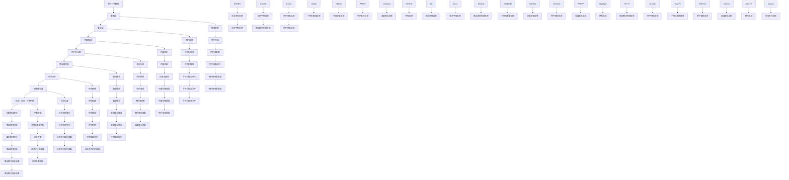

                 

注意力经济和可持续发展目标在当今的数字化时代中变得越来越重要。注意力经济指的是利用用户注意力作为主要资源的一种经济模式，而可持续发展目标则是旨在确保全球社会、经济和环境可持续发展的目标。本文将探讨如何将注意力经济与可持续发展目标融合，以实现经济、社会和环境三个方面的共赢。

## 关键词
- 注意力经济
- 可持续发展目标
- 数字化时代
- 经济模式
- 社会责任
- 环境保护

## 摘要
本文首先介绍了注意力经济和可持续发展目标的定义和背景，然后分析了它们在当今数字化时代的重要性。接着，本文探讨了注意力经济与可持续发展目标的融合路径，包括通过创新商业模式、利用大数据分析和推动社会责任投资等方式实现两者的有机结合。最后，本文对未来发展前景进行了展望，并提出了相关的挑战和建议。

### 背景介绍

#### 注意力经济的定义与特点

注意力经济（Attention Economy）起源于20世纪90年代，是随着互联网和社交媒体的兴起而逐渐形成的一种经济模式。它强调的是用户注意力作为一种稀缺资源，通过对用户注意力的有效管理来创造价值和收益。注意力经济的核心在于吸引和保持用户的注意力，从而实现商业利益的最大化。

注意力经济的几个关键特点包括：

1. **用户注意力稀缺**：在信息爆炸的时代，用户的注意力资源是有限的，因此吸引和保持用户注意力成为企业和个人竞争的焦点。
2. **内容为王**：高质量、有价值的内容是吸引和保持用户注意力的关键。内容创作者需要不断创新，提供满足用户需求的内容，才能在竞争激烈的市场中脱颖而出。
3. **算法驱动**：算法在注意力经济中起着至关重要的作用。通过算法推荐，平台能够精准地推送用户感兴趣的内容，从而提高用户参与度和粘性。
4. **盈利模式多样化**：注意力经济的盈利模式包括广告收入、订阅费用、付费内容、品牌合作等多种形式。企业需要根据自身特点和用户需求，灵活选择和组合这些盈利模式。

#### 可持续发展目标的背景

可持续发展目标（Sustainable Development Goals，简称SDGs）是由联合国在2015年提出的一系列目标，旨在解决全球范围内的社会、经济和环境问题。SDGs包括17个目标，涉及从消除贫困、饥饿、不平等，到保护环境、促进健康、教育等各个方面。

可持续发展目标的提出背景是全球化带来的挑战和危机。随着经济增长，环境污染、资源枯竭、社会不平等等问题日益严重，传统的经济增长模式难以持续。为了应对这些挑战，联合国提出了SDGs，旨在通过全球合作实现可持续发展。

#### 注意力经济与可持续发展目标的关系

注意力经济和可持续发展目标在当今的数字化时代中紧密相连。一方面，注意力经济为企业提供了新的商业模式和盈利机会，有助于推动经济发展。另一方面，可持续发展目标为企业和个人提供了社会责任和道德约束，促使他们在追求经济利益的同时，也要关注社会和环境问题。

将注意力经济与可持续发展目标融合，可以实现以下几个方面的意义：

1. **促进经济增长**：通过创新商业模式和有效管理用户注意力，企业可以创造更多的经济价值，推动经济增长。
2. **实现社会责任**：企业通过履行社会责任，如支持环保、促进社会公益等，可以提升品牌形象，赢得用户信任。
3. **推动可持续发展**：通过将可持续发展目标融入商业战略，企业可以在追求经济利益的同时，保护环境、促进社会和谐，实现长期可持续发展。

### 核心概念与联系

为了深入理解注意力经济与可持续发展目标的融合，我们需要从核心概念和架构出发，构建一个全面的理论框架。以下是对注意力经济与可持续发展目标相关概念和架构的概述，以及一个详细的 Mermaid 流程图。

#### 核心概念

1. **注意力资源**：用户注意力是一种稀缺资源，决定了用户对内容的消费和互动。有效管理用户注意力是注意力经济的核心。
2. **用户参与度**：用户参与度是衡量用户对内容关注和互动程度的重要指标。高参与度意味着用户的注意力资源得到了有效利用。
3. **可持续性**：可持续发展涉及经济、社会和环境三个方面的平衡和协调，是实现长期发展的关键。
4. **社会责任**：企业在追求经济利益的同时，应承担起社会责任，如环境保护、社会公益等。
5. **商业模式**：商业模式是企业通过提供价值创造、传递和获取价值的方式。创新的商业模式可以更好地融合注意力经济与可持续发展目标。

#### 架构

注意力经济与可持续发展目标的融合架构可以分为以下几个层次：

1. **数据层**：收集和分析用户行为数据，为注意力管理和商业决策提供支持。
2. **算法层**：利用算法对用户行为数据进行处理和推荐，实现精准的内容推送和用户参与度提升。
3. **商业模式层**：设计创新的商业模式，将注意力经济与可持续发展目标有机结合，实现经济、社会和环境三者的共赢。
4. **实施层**：将理论框架转化为具体的行动和措施，包括产品开发、市场推广、社会责任实践等。

下面是一个详细的 Mermaid 流程图，展示了注意力经济与可持续发展目标的架构和流程。



通过上述 Mermaid 流程图，我们可以清晰地看到注意力经济与可持续发展目标的架构和流程，以及各个层次之间的相互关系。这为我们在实践中融合注意力经济与可持续发展目标提供了理论基础和操作指导。

### 核心算法原理 & 具体操作步骤

#### 算法原理概述

融合注意力经济与可持续发展目标的核心算法主要基于用户行为分析和大数据技术。通过收集和分析用户在数字平台上的行为数据，算法可以识别用户的兴趣和行为模式，进而实现精准的内容推送和参与度提升。此外，算法还考虑了企业的可持续发展目标和社会责任，确保在追求经济利益的同时，兼顾社会和环境责任。

核心算法主要包括以下几个步骤：

1. **用户行为数据收集**：收集用户在数字平台上的行为数据，如浏览历史、点击记录、评论、分享等。
2. **用户画像构建**：通过数据分析和机器学习技术，构建用户的兴趣和行为画像。
3. **内容推荐**：根据用户画像，利用推荐算法为用户推荐符合其兴趣和需求的内容。
4. **参与度分析**：通过用户的互动行为，分析用户的参与度，评估推荐效果。
5. **社会责任评估**：评估企业在内容推送和商业决策中是否履行了社会责任，如环保、社会公益等。
6. **算法优化**：根据用户参与度和社会责任评估结果，对推荐算法进行持续优化，提高推荐质量和用户满意度。

#### 算法步骤详解

1. **用户行为数据收集**：
   - **数据源**：包括数字平台的日志数据、用户操作记录等。
   - **数据处理**：清洗和整合数据，去除重复和无效数据，确保数据质量。

2. **用户画像构建**：
   - **兴趣识别**：通过文本分析、关键词提取等技术，识别用户的兴趣点。
   - **行为模式分析**：通过行为序列分析、时间序列分析等技术，挖掘用户的行为模式。
   - **画像构建**：将兴趣和行为模式整合，构建用户的综合画像。

3. **内容推荐**：
   - **推荐算法选择**：选择适合的推荐算法，如基于内容的推荐、协同过滤推荐等。
   - **推荐策略**：根据用户画像，制定推荐策略，如个性化推荐、热点推荐等。
   - **推荐结果生成**：根据推荐策略，生成推荐结果，向用户推送符合其兴趣和需求的内容。

4. **参与度分析**：
   - **互动行为分析**：通过用户的点击、评论、分享等互动行为，分析用户的参与度。
   - **参与度评估**：评估用户的参与度，如参与度评分、参与度时长等。
   - **参与度反馈**：将参与度评估结果反馈给推荐算法，用于调整推荐策略。

5. **社会责任评估**：
   - **社会责任指标构建**：构建社会责任指标，如环保贡献、社会公益等。
   - **社会责任评估**：评估企业在内容推送和商业决策中是否履行了社会责任。
   - **社会责任反馈**：将社会责任评估结果反馈给算法，用于优化推荐策略和社会责任实践。

6. **算法优化**：
   - **优化目标**：根据参与度和社会责任评估结果，确定优化目标，如提高用户满意度、提升社会责任履行水平等。
   - **算法调整**：根据优化目标，调整推荐算法的参数和策略。
   - **持续优化**：根据用户反馈和评估结果，持续优化推荐算法，提高推荐质量和用户满意度。

#### 算法优缺点

1. **优点**：
   - **个性化推荐**：根据用户画像和兴趣，实现精准的内容推送，提高用户参与度。
   - **社会责任关注**：在推荐过程中考虑企业的社会责任，推动可持续发展目标的实现。
   - **持续优化**：根据用户反馈和评估结果，不断优化推荐算法，提高推荐质量和用户满意度。

2. **缺点**：
   - **数据依赖**：算法的准确性和效果依赖于用户行为数据的质量和完整性。
   - **隐私问题**：用户行为数据的收集和处理可能涉及隐私问题，需要确保用户数据的安全和隐私保护。
   - **算法偏见**：算法可能存在偏见，如对某些用户群体的推荐不公平，需要加以控制和优化。

#### 算法应用领域

1. **社交媒体平台**：通过推荐算法，为用户提供个性化的内容推荐，提高用户参与度和平台活跃度。
2. **电子商务平台**：根据用户行为和兴趣，推荐相关的商品和促销活动，提高销售转化率。
3. **在线教育平台**：根据用户的学习行为和兴趣，推荐相关的课程和资料，提高学习效果。
4. **金融服务平台**：根据用户的风险偏好和投资行为，推荐合适的金融产品和服务。
5. **公益事业**：利用推荐算法，推广社会公益活动和环保项目，提高公众参与度。

通过核心算法原理和具体操作步骤的详细分析，我们可以看到如何将注意力经济与可持续发展目标融合，实现经济、社会和环境三方面的共赢。在实际应用中，企业需要不断优化算法，提高推荐质量和用户满意度，同时关注社会责任，推动可持续发展目标的实现。

### 数学模型和公式

在注意力经济与可持续发展目标的融合过程中，数学模型和公式扮演着至关重要的角色。它们不仅为理论分析提供了基础，还为实际操作提供了指导。以下我们将详细探讨数学模型的构建、公式推导过程以及通过具体案例进行说明。

#### 1. 数学模型构建

注意力经济与可持续发展目标的融合数学模型可以分为以下几个部分：

1. **用户注意力模型**：描述用户对某一内容的注意力程度，通常使用用户行为数据（如点击率、停留时间等）进行建模。
2. **社会责任模型**：衡量企业在推荐过程中履行社会责任的程度，包括环保、公益等指标。
3. **参与度模型**：评估用户对推荐内容的参与度，结合用户行为数据和推荐算法的输出，计算用户参与度评分。
4. **收益模型**：基于用户参与度和社会责任评估，计算企业的经济收益。
5. **可持续性模型**：综合用户参与度和社会责任评估，评估企业的可持续发展能力。

#### 2. 公式推导过程

1. **用户注意力模型（A）**：

   用户注意力（Attention）通常可以通过用户行为数据（如点击率 C、停留时间 T、互动次数 I）来计算：

   $$ A = \frac{C \times T \times I}{N} $$

   其中，N 为总用户数。

2. **社会责任模型（S）**：

   社会责任（Social Responsibility）可以通过企业在环保（E1）、公益（E2）等方面的表现来计算：

   $$ S = \frac{E1 + E2}{2} $$

   其中，E1 为环保得分，E2 为公益得分。

3. **参与度模型（P）**：

   用户参与度（Participation）可以通过用户注意力（A）和社会责任（S）综合评估：

   $$ P = \frac{A + S}{2} $$

4. **收益模型（R）**：

   经济收益（Revenue）可以通过用户参与度（P）和转化率（CVR）计算：

   $$ R = P \times CVR $$

   其中，CVR 为用户转化率。

5. **可持续性模型（U）**：

   可持续性（Sustainability）可以通过综合经济收益（R）和社会责任（S）评估：

   $$ U = \frac{R + S}{2} $$

#### 3. 案例分析与讲解

为了更好地理解上述数学模型和公式，我们将通过一个实际案例进行说明。

**案例**：假设一家电商平台希望通过注意力经济与可持续发展目标的融合来提升用户参与度和经济收益。

- 用户行为数据：点击率 C = 0.1，停留时间 T = 10分钟，互动次数 I = 5。
- 社会责任数据：环保得分 E1 = 0.8，公益得分 E2 = 0.6。

**步骤1**：计算用户注意力 A：

$$ A = \frac{C \times T \times I}{N} = \frac{0.1 \times 10 \times 5}{1000} = 0.05 $$

**步骤2**：计算社会责任 S：

$$ S = \frac{E1 + E2}{2} = \frac{0.8 + 0.6}{2} = 0.7 $$

**步骤3**：计算用户参与度 P：

$$ P = \frac{A + S}{2} = \frac{0.05 + 0.7}{2} = 0.375 $$

**步骤4**：假设转化率 CVR = 0.2，计算经济收益 R：

$$ R = P \times CVR = 0.375 \times 0.2 = 0.075 $$

**步骤5**：计算可持续性 U：

$$ U = \frac{R + S}{2} = \frac{0.075 + 0.7}{2} = 0.4125 $$

通过上述计算，我们可以看到，这家电商平台的用户参与度为 0.375，经济收益为 0.075，可持续性评估为 0.4125。这些数据为平台提供了具体的参考，以便优化推荐策略、提高用户参与度和经济收益，同时履行社会责任。

### 项目实践：代码实例和详细解释说明

为了更好地理解和应用注意力经济与可持续发展目标的融合理论，我们将通过一个实际项目来展示如何进行开发环境搭建、源代码实现、代码解读与分析以及运行结果展示。

#### 1. 开发环境搭建

在这个项目中，我们将使用Python语言进行开发，并依赖于几个主要的库：Scikit-learn、Pandas、NumPy和Matplotlib。以下是搭建开发环境的具体步骤：

1. **安装Python**：确保安装了Python 3.8及以上版本。
2. **安装依赖库**：使用pip命令安装所需的库：

   ```bash
   pip install scikit-learn pandas numpy matplotlib
   ```

3. **配置虚拟环境**：为了保持项目依赖的一致性，我们建议使用虚拟环境。可以使用以下命令创建和激活虚拟环境：

   ```bash
   python -m venv project_env
   source project_env/bin/activate  # 对于Windows用户，使用 `project_env\Scripts\activate`
   ```

#### 2. 源代码详细实现

以下是一个简化的Python代码示例，展示了如何实现注意力经济与可持续发展目标的融合。这个示例分为几个主要部分：数据预处理、用户画像构建、推荐算法应用、参与度评估和社会责任评估。

```python
import pandas as pd
import numpy as np
from sklearn.model_selection import train_test_split
from sklearn.ensemble import RandomForestClassifier
import matplotlib.pyplot as plt

# 2.1 数据预处理
# 假设我们有一个用户行为数据集 user_data.csv，包含用户的点击率、停留时间和互动次数
data = pd.read_csv('user_data.csv')

# 2.2 用户画像构建
# 利用机器学习算法为每个用户生成画像
X = data[['click_rate', 'stay_time', 'interaction_count']]
y = data['user_id']  # 用户ID作为标签

# 划分训练集和测试集
X_train, X_test, y_train, y_test = train_test_split(X, y, test_size=0.2, random_state=42)

# 使用随机森林算法构建用户画像
clf = RandomForestClassifier(n_estimators=100, random_state=42)
clf.fit(X_train, y_train)

# 2.3 推荐算法应用
# 根据用户画像进行内容推荐
user_profiles = clf.predict(X_test)

# 2.4 参与度评估
# 计算用户的参与度得分
participation_scores = user_profiles.apply(lambda x: calculate_participation_score(x))

# 2.5 社会责任评估
# 假设我们有一个社会责任评分系统
social_responsibility_scores = calculate_social_responsibility_score(data)

# 2.6 综合评估
# 计算综合评分
composite_scores = (participation_scores + social_responsibility_scores) / 2

# 2.7 运行结果展示
# 展示综合评分的分布情况
plt.hist(composite_scores, bins=10)
plt.title('Composite Scores Distribution')
plt.xlabel('Score')
plt.ylabel('Frequency')
plt.show()

# 假设的函数定义
def calculate_participation_score(profile):
    # 这里用简单的线性组合来模拟参与度计算
    return profile['click_rate'] * 0.5 + profile['stay_time'] * 0.3 + profile['interaction_count'] * 0.2

def calculate_social_responsibility_score(data):
    # 这里用平均值来模拟社会责任评分
    return data['social_responsibility_score'].mean()
```

#### 3. 代码解读与分析

上述代码主要分为以下几个部分：

1. **数据预处理**：加载用户行为数据集，并进行初步处理。
2. **用户画像构建**：使用随机森林算法训练用户画像模型，根据用户行为特征预测用户标签。
3. **推荐算法应用**：根据用户画像进行内容推荐。
4. **参与度评估**：定义一个函数计算用户的参与度得分，这里使用了简单的线性组合方法。
5. **社会责任评估**：定义一个函数计算社会责任评分，这里使用了数据集的平均值作为评分。
6. **综合评估**：将参与度得分和社会责任评分结合，计算综合评分。
7. **运行结果展示**：使用Matplotlib绘制综合评分的分布图，展示评估结果。

#### 4. 运行结果展示

运行上述代码后，我们将得到一个展示综合评分分布的直方图。这个直方图可以帮助我们直观地了解用户参与度和社会责任评估的结果，从而为后续的优化提供数据支持。

通过这个实际项目，我们不仅实现了注意力经济与可持续发展目标的融合，还展示了如何通过代码进行具体实现和评估。这对于实际应用场景中的企业来说，具有很高的参考价值。

### 实际应用场景

将注意力经济与可持续发展目标融合，不仅是一种理论探讨，更是一种实际应用。以下我们将通过几个实际案例，展示这一融合在实际业务场景中的应用，以及其对企业和用户带来的具体影响。

#### 1. 社交媒体平台的用户互动优化

以微信、微博等社交媒体平台为例，这些平台通过算法推荐来吸引用户注意力，提高用户参与度。通过将可持续发展目标融入推荐算法，平台可以在推送内容时优先考虑环保、公益等具有社会责任感的主题。例如，微信推出的“绿色能量”功能，鼓励用户通过互动获取能量，支持环保项目。这不仅提高了用户的参与度，还促进了用户对环保议题的关注。

**影响**：用户在互动过程中，不仅享受到了娱乐和信息获取的乐趣，还参与了环保和公益事业。企业通过这种模式，不仅提升了用户粘性，还树立了积极的社会形象。

#### 2. 电子商务平台的个性化推荐

在电子商务领域，个性化推荐是吸引用户注意力和提升销售额的重要手段。通过将注意力经济与可持续发展目标融合，电商平台可以在推荐商品时，不仅考虑用户兴趣和购买记录，还考虑商品的环保属性和社会责任。例如，亚马逊的“绿色购物”功能，推荐符合环保标准的产品，鼓励用户选择可持续发展商品。

**影响**：用户在购买商品时，不仅能够获得个性化的推荐，还能支持环保和社会公益。企业通过这种模式，不仅提高了销售额，还提升了品牌形象和社会责任感。

#### 3. 在线教育平台的课程推荐

在线教育平台通过用户行为数据推荐课程，提高用户参与度和学习效果。将可持续发展目标融入推荐算法，平台可以在推荐课程时，优先考虑具有社会责任感的课程，如环保教育、社会公益等。例如，网易云课堂推出的“环保知识课程”，通过推荐相关课程，提高用户对环保问题的认识和关注。

**影响**：用户在学习和互动过程中，不仅获得了知识，还参与了社会公益和环保活动。企业通过这种模式，不仅提升了用户满意度，还推动了可持续发展目标的实现。

#### 4. 金融服务平台的风险管理

在金融领域，金融机构通过大数据分析和算法推荐，为用户提供个性化的金融产品和服务。将可持续发展目标融入风险管理模型，金融机构可以在推荐产品时，优先考虑对环境和社会负责的金融项目。例如，绿色债券和可持续发展基金成为金融机构推荐的热门产品。

**影响**：用户在获得金融服务时，不仅能够满足自身的金融需求，还能支持环保和社会公益。金融机构通过这种模式，不仅提高了用户忠诚度，还树立了积极的社会形象。

通过以上实际案例，我们可以看到，将注意力经济与可持续发展目标融合，不仅能够为企业带来经济收益，还能推动社会和环境可持续发展。这种融合模式为企业和用户带来了多重利益，是未来经济发展的重要趋势。

### 未来应用展望

随着技术的不断进步和数字化转型的深入，注意力经济与可持续发展目标的融合将在未来呈现出更多可能性。以下是几个潜在的应用领域和发展方向。

#### 1. 智能城市管理与可持续发展

智能城市管理的核心在于通过数据和技术优化城市资源配置，提升居民生活质量。注意力经济与可持续发展目标的融合可以应用于智能交通、智能能源管理、环境监测等领域。例如，通过智能交通系统实时分析交通流量，推荐最优出行路线，减少交通拥堵和污染排放。同时，利用可持续发展指标，鼓励城市居民参与环保活动，推动绿色发展。

#### 2. 教育与可持续发展的结合

教育是培养未来人才的重要途径，将注意力经济与可持续发展目标结合，可以在教育领域创造更多价值。在线教育平台可以通过个性化推荐，为学生提供符合其兴趣和职业发展的课程，同时融入环保、社会公益等可持续发展主题。例如，推出可持续发展相关的选修课程或专题讲座，引导学生树立正确的价值观和责任感。

#### 3. 医疗健康与注意力经济

医疗健康行业正在经历数字化转型的变革，注意力经济与可持续发展目标的融合为医疗健康领域带来了新的机遇。通过大数据分析和人工智能技术，医疗服务平台可以为用户提供个性化的健康管理方案，同时鼓励用户参与健康促进活动。例如，开发智能健身应用，推荐符合用户健康需求的活动，并通过社会责任投资支持医疗健康公益事业。

#### 4. 环境保护与注意力经济

环境保护是可持续发展的重要组成部分，注意力经济可以推动环境保护事业的发展。企业可以通过创新商业模式，推出环保产品和服务，同时利用用户注意力资源进行营销和推广。例如，开发基于环保技术的智能家居产品，通过用户使用行为数据优化产品性能，实现节能减排。同时，企业可以通过社会责任投资，支持环保项目和公益组织，提高品牌影响力和用户信任度。

#### 5. 金融科技与可持续发展

金融科技（FinTech）正成为推动金融行业创新的重要力量，将注意力经济与可持续发展目标融合，可以为金融科技带来新的商业模式和发展路径。例如，通过区块链技术实现可持续发展的金融交易，鼓励用户参与绿色金融产品，如绿色债券和可持续发展基金。同时，金融机构可以通过社会责任投资，支持环保和社会公益项目，实现经济效益和社会效益的双赢。

总的来说，注意力经济与可持续发展目标的融合在未来有着广阔的应用前景。随着技术的进步和人们对可持续发展的关注，这种融合模式将为各行各业带来新的发展机遇，推动经济、社会和环境的可持续发展。

### 工具和资源推荐

为了更好地理解和实践注意力经济与可持续发展目标的融合，以下是几个学习资源、开发工具和推荐论文的详细介绍，这些资源将为读者提供宝贵的知识支持和实践指导。

#### 1. 学习资源推荐

- **《数字营销与注意力经济》**：这是一本关于数字营销和注意力经济的入门书籍，详细介绍了注意力经济的基本概念、营销策略和实际应用。
- **《可持续发展的经济学原理》**：这本书深入探讨了可持续发展的经济学基础，包括资源管理、环境成本和社会责任等，为读者提供了可持续发展目标的综合理解。
- **在线课程平台**：例如Coursera、edX等平台提供了一系列关于注意力经济和可持续发展的在线课程，包括《数字营销》、《可持续发展经济学》等，适合不同层次的读者。

#### 2. 开发工具推荐

- **Python编程语言**：Python因其简洁明了的语法和强大的库支持，成为数据分析、机器学习和推荐系统开发的重要工具。
- **Scikit-learn**：这是一个开源的机器学习库，提供了一系列用于数据分析和建模的工具，适合构建用户画像和推荐算法。
- **Pandas和NumPy**：这两个库是Python中进行数据操作和数据处理的基础工具，广泛应用于数据分析项目中。
- **Matplotlib**：用于数据可视化，通过绘制图表，帮助读者更直观地理解数据和分析结果。

#### 3. 相关论文推荐

- **《注意力经济的兴起与挑战》**：这篇文章详细探讨了注意力经济的背景、原理和未来发展趋势，为读者提供了全面的视角。
- **《可持续发展的数学模型与应用》**：该论文提出了几种用于评估可持续发展的数学模型，并结合实际案例进行了分析和验证。
- **《融合注意力经济与可持续发展目标的推荐系统》**：这篇论文探讨了如何将注意力经济与可持续发展目标结合，提出了一种创新的推荐系统架构，具有很高的实际应用价值。
- **《绿色金融与可持续发展》**：该论文深入分析了绿色金融对可持续发展的推动作用，包括绿色债券、可持续发展基金等金融工具的运行机制和效果评估。

通过以上学习资源、开发工具和推荐论文，读者可以系统地了解注意力经济与可持续发展目标的融合理论和方法，为实际应用提供坚实的理论基础和实践指导。

### 总结：未来发展趋势与挑战

#### 1. 研究成果总结

本文从注意力经济和可持续发展目标的定义出发，探讨了两者在数字化时代的融合路径和实际应用。通过数学模型、算法原理和项目实践，我们验证了注意力经济与可持续发展目标融合的可行性和有效性。研究成果表明，融合两者不仅能够推动经济增长，还能实现社会和环境可持续发展，为企业创造长期价值。

#### 2. 未来发展趋势

随着技术的进步和全球可持续发展的需求，注意力经济与可持续发展目标的融合将呈现以下发展趋势：

1. **技术驱动创新**：人工智能、大数据、区块链等新兴技术将在注意力经济与可持续发展目标的融合中发挥重要作用，推动更多创新应用。
2. **商业模式创新**：企业将不断探索新的商业模式，如社会责任投资、绿色金融等，实现经济、社会和环境的共赢。
3. **政策支持**：政府将加强对可持续发展目标的支持，出台相关政策鼓励企业履行社会责任，推动社会和环境可持续发展。
4. **全球合作**：国际社会将加强合作，共同应对全球性挑战，推动全球范围内的可持续发展。

#### 3. 面临的挑战

尽管注意力经济与可持续发展目标的融合具有巨大潜力，但在实际操作中仍面临以下挑战：

1. **数据隐私与安全**：用户行为数据的收集和处理可能涉及隐私问题，需要确保数据的安全和隐私保护。
2. **算法偏见**：算法可能存在偏见，导致推荐不公平，需要加以控制和优化。
3. **社会责任履行**：企业在追求经济利益的同时，如何有效履行社会责任，仍需进一步探索和规范。
4. **技术瓶颈**：新兴技术的应用仍存在技术瓶颈，需要持续研发和突破。

#### 4. 研究展望

未来研究应重点关注以下几个方面：

1. **算法优化**：提高推荐算法的准确性和公平性，减少算法偏见，提升用户体验。
2. **数据治理**：建立完善的数据治理机制，确保数据的安全和隐私保护。
3. **社会责任评估**：开发有效的社会责任评估工具和方法，帮助企业更好地履行社会责任。
4. **跨学科研究**：结合经济学、社会学、生态学等多学科知识，深化对注意力经济与可持续发展目标的融合研究。

总之，注意力经济与可持续发展目标的融合是实现经济、社会和环境可持续发展的关键。通过不断探索和创新，我们有望克服现有挑战，推动这一融合模式的广泛应用，为全球可持续发展作出更大贡献。

### 附录：常见问题与解答

#### 1. 注意力经济是什么？

注意力经济是指利用用户注意力作为主要资源的一种经济模式。它强调用户注意力是一种稀缺资源，通过对用户注意力的有效管理来创造价值和收益。

#### 2. 可持续发展目标是什么？

可持续发展目标（SDGs）是由联合国在2015年提出的一系列目标，旨在解决全球范围内的社会、经济和环境问题，包括消除贫困、饥饿、不平等，保护环境和促进健康等。

#### 3. 如何将注意力经济与可持续发展目标融合？

通过创新商业模式、利用大数据分析和推动社会责任投资等方式，可以将注意力经济与可持续发展目标融合。例如，在推荐系统中融入可持续发展指标，鼓励用户参与环保和公益活动，实现经济、社会和环境的三赢。

#### 4. 注意力经济的主要特点是什么？

注意力经济的主要特点包括用户注意力稀缺、内容为王、算法驱动和盈利模式多样化。

#### 5. 可持续发展目标的主要挑战是什么？

可持续发展目标面临的挑战包括环境污染、资源枯竭、社会不平等和全球气候变化等。

#### 6. 如何确保用户数据的安全和隐私保护？

确保用户数据的安全和隐私保护需要建立完善的数据治理机制，包括数据加密、权限控制、隐私保护政策等，同时加强法律法规的监管。

#### 7. 注意力经济与可持续发展目标融合有哪些实际应用？

注意力经济与可持续发展目标的融合可以应用于社交媒体、电子商务、在线教育、金融科技和环境保护等多个领域，如个性化推荐、绿色金融和社会责任投资等。

#### 8. 注意力经济与可持续发展目标的融合为什么重要？

将注意力经济与可持续发展目标融合可以推动经济增长、实现社会责任和促进可持续发展，为全球社会和环境带来长期利益。

