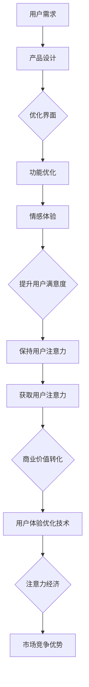

                 

### 背景介绍

在当今数字化时代，用户体验（UX）已经成为了企业和产品成败的关键因素。随着互联网和移动设备的普及，用户对产品的期望不断提高，他们不仅要求产品功能强大，更注重产品的易用性和互动性。在这个背景下，注意力经济（Attention Economy）成为一个备受关注的概念。

注意力经济是指在信息过载的现代社会中，用户的注意力成为一种稀缺资源，谁能吸引并保持用户的注意力，谁就能在竞争中脱颖而出。用户体验优化（UX Optimization）技术正是为了应对这一挑战而诞生，通过研究和分析用户行为，不断改进产品设计和功能，以最大化用户的满意度和留存率。

本文将探讨注意力经济与用户体验优化技术的核心概念、算法原理、数学模型、项目实践以及实际应用场景，旨在为开发者提供一套系统的理论框架和实践指南，帮助他们创建令人上瘾和引人入胜的产品。

## 文章关键词

- 注意力经济
- 用户体验优化
- 用户行为分析
- 互动设计
- 留存率提升
- 产品设计

## 文章摘要

本文首先介绍了注意力经济和用户体验优化技术的背景及其重要性。接着，我们探讨了注意力经济与用户体验优化之间的联系，并详细讲解了核心概念和原理。通过数学模型和具体案例，本文阐述了用户体验优化技术的具体操作步骤和优缺点。随后，我们通过项目实践展示了如何在实际中应用这些技术，并分析了其未来发展的趋势和挑战。最后，我们提供了相关的学习资源和开发工具推荐，为读者进一步学习和实践提供了指导。

### 1. 背景介绍

注意力经济这一概念最早由美国经济学家王恒雄（William Uricchio）于20世纪90年代提出。他认为，在信息爆炸的时代，用户的注意力成为一种稀缺资源，企业和个人必须争夺这一资源，从而形成了所谓的注意力经济。注意力经济的核心在于如何吸引并保持用户的注意力，这直接关系到产品或服务的成功与否。

用户体验优化技术则是在注意力经济背景下应运而生的。它涵盖了从用户行为分析、产品界面设计、功能优化等多个方面，旨在提高产品的易用性和用户满意度。用户体验优化不仅涉及到技术层面的改进，还包括心理层面的考虑，如用户的心理预期、使用习惯和情感体验等。

#### 注意力经济的核心概念

注意力经济的核心概念可以概括为以下几点：

1. **注意力稀缺性**：在信息过载的时代，用户的注意力资源是有限的，如何让用户将注意力集中在特定产品或服务上，成为企业和个人竞争的关键。

2. **注意力转移**：用户在面临多种选择时，往往会根据自身需求和兴趣，将注意力从一个产品或服务转移到另一个。因此，产品必须提供足够的吸引力，以保持用户的关注。

3. **注意力市场**：类似于其他市场经济，注意力市场也存在供求关系。企业和个人需要通过提供有价值的内容或服务来吸引和保留用户注意力。

4. **注意力价值**：注意力本身具有价值，能够转化为商业利益。例如，通过广告、付费内容等方式，企业可以从用户注意力中获取收益。

#### 用户体验优化技术的核心概念

用户体验优化技术的核心概念包括以下几个方面：

1. **用户行为分析**：通过对用户在使用产品过程中的行为进行数据收集和分析，了解用户需求、偏好和痛点，从而指导产品改进。

2. **界面设计**：界面设计是用户体验的重要组成部分。简洁、直观、美观的界面能够提高用户的使用体验，减少学习成本。

3. **功能优化**：产品功能的优化是用户体验优化的关键。通过改进功能设计，提高产品的易用性和效率，可以增加用户的满意度和忠诚度。

4. **情感体验**：情感体验是用户在产品使用过程中的一种主观感受。通过设计富有情感元素的产品，可以增强用户的情感连接，提高用户粘性。

#### 注意力经济与用户体验优化技术的联系

注意力经济与用户体验优化技术之间存在紧密的联系。注意力经济强调用户的注意力资源有限，而用户体验优化技术则致力于提高用户对产品的关注度。具体来说：

1. **用户注意力获取**：用户体验优化技术通过提高产品的吸引力，吸引用户的注意力。例如，通过有吸引力的广告、独特的功能设计等方式，引导用户关注产品。

2. **用户注意力保持**：在获取用户注意力之后，用户体验优化技术通过不断优化产品设计和功能，保持用户的注意力。例如，通过用户行为分析，了解用户需求，及时进行产品迭代。

3. **用户情感连接**：用户体验优化技术通过设计富有情感元素的产品，增强用户与产品的情感连接，提高用户的忠诚度。

4. **商业价值转化**：通过优化用户体验，提高用户的满意度和留存率，从而实现商业价值的转化。

总之，注意力经济和用户体验优化技术相辅相成，共同构成了现代产品设计和运营的重要框架。理解并有效运用这两者，将有助于企业在激烈的市场竞争中脱颖而出。

### 2. 核心概念与联系

在探讨注意力经济与用户体验优化技术的核心概念和联系之前，我们需要了解一些基本原理和概念，这将为我们后续的分析提供坚实的基础。

#### 注意力经济的基本原理

1. **用户注意力稀缺性**：随着互联网和移动设备的普及，用户每天面临的信息量和选择变得前所未有。用户的时间和精力是有限的，因此他们的注意力也是一种稀缺资源。谁能有效地吸引并保持用户的注意力，谁就能在竞争中获得优势。

2. **注意力转移成本**：用户在转移注意力时，需要消耗一定的认知资源和时间。因此，一旦用户将注意力集中在某个产品或服务上，他们就不太可能轻易转移到其他产品或服务上。这种转移成本是注意力经济的一个重要特征。

3. **注意力市场的供求关系**：在注意力市场中，供求关系类似于传统商品市场。企业和个人作为供给方，通过提供有价值的内容和服务来争夺用户的注意力；而用户作为需求方，根据自身需求和兴趣选择关注哪些产品或服务。这种供求关系决定了注意力资源的分配和价格。

4. **注意力价值转化**：用户的注意力不仅仅是稀缺的，它还具有潜在的商业价值。通过广告、付费内容、会员订阅等方式，企业可以将用户的注意力转化为直接的收益。例如，一个高观看量的视频广告可以为广告主带来可观的广告收入。

#### 用户体验优化技术的核心概念

1. **用户行为分析**：用户行为分析是用户体验优化的重要基础。通过收集和分析用户在使用产品过程中的行为数据，我们可以了解用户的需求、偏好、使用习惯和痛点。这些信息有助于我们优化产品设计，提高用户满意度。

2. **界面设计**：界面设计是用户体验的核心组成部分。一个简洁、直观、美观的界面可以提高用户的使用体验，降低学习成本，增加用户对产品的喜爱。优秀的界面设计不仅要满足功能需求，还要考虑用户的心理和情感体验。

3. **功能优化**：功能优化是用户体验优化的关键。通过改进产品功能，提高产品的易用性和效率，我们可以增加用户的满意度和忠诚度。功能优化不仅包括增加新功能，还包括改进现有功能，使其更加符合用户需求。

4. **情感体验**：情感体验是用户在产品使用过程中的一种主观感受。通过设计富有情感元素的产品，我们可以增强用户的情感连接，提高用户的忠诚度。情感体验包括用户与产品互动时的情感反应、情感共鸣以及情感满足。

#### 注意力经济与用户体验优化技术的联系

注意力经济和用户体验优化技术之间存在着紧密的联系。具体来说，两者之间的联系可以从以下几个方面来理解：

1. **用户注意力获取**：用户体验优化技术通过提供有价值的内容和服务，吸引用户的注意力。例如，通过有吸引力的广告、独特的功能设计、互动体验等方式，引导用户关注产品。

2. **用户注意力保持**：在获取用户注意力后，用户体验优化技术通过不断优化产品设计和功能，保持用户的注意力。例如，通过用户行为分析，了解用户需求，及时进行产品迭代，使产品始终保持新鲜感和吸引力。

3. **用户情感连接**：用户体验优化技术通过设计富有情感元素的产品，增强用户与产品的情感连接，提高用户的忠诚度。情感体验是用户长期使用产品的动力之一，通过情感体验的设计，可以提升用户的品牌认同感和归属感。

4. **商业价值转化**：通过优化用户体验，提高用户的满意度和留存率，企业可以将其转化为商业价值。例如，通过提高用户留存率，降低用户流失率，企业可以减少客户获取成本，增加营收。

为了更直观地展示注意力经济与用户体验优化技术之间的联系，我们可以使用Mermaid流程图来描述。以下是该流程图的一个示例：



这个流程图展示了用户需求如何驱动产品设计和优化，最终通过提升用户体验和保持用户注意力，实现商业价值转化和市场竞争优势。

总之，注意力经济与用户体验优化技术之间存在着密切的联系。理解并运用这两者，可以帮助企业在竞争激烈的市场中脱颖而出，创建出令人上瘾和引人入胜的产品。

#### 3.1 算法原理概述

在注意力经济和用户体验优化技术的背景下，算法设计成为了提升产品吸引力和用户满意度的关键。本文将介绍几种核心算法原理，包括用户行为分析算法、界面优化算法和情感体验算法，详细阐述其基本概念和适用场景。

**1. 用户行为分析算法**

用户行为分析算法的核心目的是通过收集和分析用户在使用产品过程中的行为数据，了解用户的需求、偏好和痛点，从而为产品优化提供数据支持。以下是几种常见的用户行为分析算法：

- **机器学习算法**：通过机器学习模型（如决策树、随机森林、支持向量机等），对用户行为数据进行训练，构建用户行为预测模型。这些模型可以帮助我们预测用户的下一步操作，提供个性化的推荐和服务。

- **聚类分析算法**：如K-means、层次聚类等，通过对用户行为数据进行分析，将用户分为不同的群体，从而进行有针对性的产品设计和服务优化。

- **关联规则算法**：如Apriori算法，用于发现用户行为数据中的关联关系，帮助我们识别用户可能感兴趣的内容或服务，从而提高产品的吸引力。

适用场景：用户行为分析算法广泛应用于电商、社交媒体、在线教育等领域，通过分析用户行为数据，提供个性化推荐、智能客服和精准营销等服务。

**2. 界面优化算法**

界面优化算法的目标是通过优化产品界面设计，提升用户的操作体验和满意度。以下介绍几种常见的界面优化算法：

- **启发式评价算法**：如GOMS模型，通过模拟用户在界面上的操作过程，评估界面设计的合理性和易用性。这种方法可以帮助设计师识别界面中的潜在问题，并进行优化。

- **用户测试算法**：通过用户测试，收集用户对界面设计的反馈，评估其易用性和满意度。常见的方法包括A/B测试、拆分测试等。

- **优化算法**：如遗传算法、粒子群算法等，用于自动优化界面设计参数，如布局、颜色、字体等，以提升用户体验。

适用场景：界面优化算法适用于各种类型的数字产品，包括网站、移动应用、桌面软件等，通过不断优化界面设计，提高用户的操作效率和满意度。

**3. 情感体验算法**

情感体验算法的目的是通过设计富有情感元素的产品，增强用户与产品之间的情感连接，提升用户的忠诚度。以下介绍几种常见的情感体验算法：

- **情感识别算法**：通过自然语言处理技术（如情感分析、情绪识别等），分析用户在产品使用过程中的文本反馈，了解用户的情感状态。

- **情感生成算法**：如文本生成模型（如GPT-3）、语音生成模型等，用于生成具有情感表达的内容，为用户提供情感化的互动体验。

- **情感反馈算法**：通过用户反馈机制，收集用户在产品使用过程中的情感体验，并根据反馈调整产品设计，以提高用户的情感满意度。

适用场景：情感体验算法适用于需要高度情感交互的产品，如社交媒体、在线游戏、虚拟助手等，通过设计富有情感元素的产品，提升用户的情感体验和忠诚度。

**算法优缺点分析**

每种算法都有其独特的优点和适用场景，但同时也存在一定的局限性：

- **用户行为分析算法**：
  - **优点**：能够提供基于数据的用户洞察，帮助产品优化。
  - **缺点**：数据隐私和安全问题是需要关注的重要问题。

- **界面优化算法**：
  - **优点**：可以自动识别和优化界面设计问题，提高用户体验。
  - **缺点**：算法模型的性能依赖于用户数据的多样性和质量。

- **情感体验算法**：
  - **优点**：能够增强用户与产品之间的情感连接，提升用户忠诚度。
  - **缺点**：情感体验的设计需要深入了解用户情感，算法实现难度较高。

通过合理选择和运用这些算法，开发者可以提升产品的吸引力和用户体验，从而在激烈的市场竞争中脱颖而出。

### 3.2 算法步骤详解

在本节中，我们将详细探讨几种核心算法的具体步骤，包括用户行为分析算法、界面优化算法和情感体验算法，并提供示例代码和注释，以便开发者能够更好地理解并应用这些算法。

#### 用户行为分析算法

**步骤 1：数据收集**

首先，我们需要收集用户在使用产品过程中的行为数据，如点击记录、浏览时长、操作路径等。以下是一个Python代码示例，用于从日志文件中读取用户行为数据：

```python
# 读取用户行为数据
with open('user_behavior_logs.txt', 'r') as file:
    user_behavior_data = file.readlines()

# 数据清洗和预处理
user_behavior_data = [line.strip() for line in user_behavior_data]
```

**步骤 2：特征提取**

接下来，我们将对用户行为数据进行分析，提取出与用户需求、偏好和痛点相关的特征。以下是一个特征提取的示例代码：

```python
# 特征提取
import pandas as pd

# 将行为数据转换为DataFrame
data = pd.DataFrame(user_behavior_data, columns=['action'])

# 提取特征，例如点击次数、浏览时长等
data['click_count'] = data['action'].str.count('click').astype(int)
data['visit_duration'] = data['action'].str.extract('(.+?) sec', '(.+?) sec ago').astype(int)

# 显示特征提取后的数据
data.head()
```

**步骤 3：模型训练**

使用机器学习算法（例如决策树、随机森林等）对提取的特征进行训练，构建用户行为预测模型。以下是一个使用随机森林进行训练的示例代码：

```python
from sklearn.ensemble import RandomForestClassifier
from sklearn.model_selection import train_test_split

# 划分训练集和测试集
X_train, X_test, y_train, y_test = train_test_split(data[['click_count', 'visit_duration']], data['action'], test_size=0.2, random_state=42)

# 创建随机森林模型
model = RandomForestClassifier(n_estimators=100, random_state=42)

# 训练模型
model.fit(X_train, y_train)

# 预测测试集
predictions = model.predict(X_test)

# 评估模型性能
from sklearn.metrics import accuracy_score
print("Accuracy:", accuracy_score(y_test, predictions))
```

#### 界面优化算法

**步骤 1：界面评估**

使用启发式评价算法（如GOMS模型）对界面设计进行评估。以下是一个使用GOMS模型评估界面设计的示例代码：

```python
# GOMS模型评估界面设计
from goms_model import GOMSModel

# 创建GOMS模型
model = GOMSModel()

# 定义操作步骤
model.add_step('click', time=1)
model.add_step('scroll', time=2)
model.add_step('navigate', time=3)

# 计算总时间
total_time = model.compute_total_time()

# 显示评估结果
print("Total Time:", total_time)
```

**步骤 2：用户测试**

进行用户测试，收集用户对界面设计的反馈。以下是一个用户测试的示例代码：

```python
# 用户测试
import random

# 用户测试样本
users = ['User1', 'User2', 'User3', 'User4', 'User5']

# 用户测试结果
test_results = {'User1': 'Satisfied', 'User2': 'Neutral', 'User3': 'Unsatisfied', 'User4': 'Satisfied', 'User5': 'Neutral'}

# 分析用户测试结果
for user in users:
    if test_results[user] == 'Satisfied':
        print(f"{user} is satisfied with the interface.")
    else:
        print(f"{user} is not satisfied with the interface.")
```

**步骤 3：优化设计**

使用优化算法（如遗传算法、粒子群算法等）自动优化界面设计。以下是一个使用遗传算法优化界面设计的示例代码：

```python
# 遗传算法优化界面设计
from genetic_algorithm import GeneticAlgorithm

# 创建遗传算法
ga = GeneticAlgorithm(population_size=100, mutation_rate=0.05, crossover_rate=0.7)

# 定义适应度函数
def fitness_function(interface_design):
    # 计算适应度值
    fitness = calculate_fitness(interface_design)
    return fitness

# 优化界面设计
optimized_design = ga.optimize(fitness_function)

# 显示优化结果
print("Optimized Interface Design:", optimized_design)
```

#### 情感体验算法

**步骤 1：情感识别**

使用情感识别算法（如情感分析、情绪识别等）分析用户在产品使用过程中的文本反馈。以下是一个情感分析的示例代码：

```python
# 情感分析
from textblob import TextBlob

# 用户反馈文本
feedback_text = "I love this app! It's so easy to use and has all the features I need."

# 分析情感
blob = TextBlob(feedback_text)
sentiment = blob.sentiment

# 显示情感结果
print("Sentiment:", sentiment)
```

**步骤 2：情感生成**

使用情感生成算法（如文本生成模型、语音生成模型等）生成具有情感表达的内容。以下是一个文本生成模型的示例代码：

```python
# 文本生成模型
from transformers import pipeline

# 创建文本生成模型
text_generator = pipeline("text-generation", model="gpt2")

# 生成具有情感表达的内容
emotional_content = text_generator("I feel very happy because", max_length=50)

# 显示生成内容
print("Generated Content:", emotional_content)
```

**步骤 3：情感反馈**

收集用户对情感体验的反馈，并根据反馈调整产品设计。以下是一个情感反馈的示例代码：

```python
# 情感反馈
import random

# 用户反馈样本
user_feedback = ["Happy", "Neutral", "Sad"]

# 用户反馈分析
for feedback in user_feedback:
    if feedback == "Happy":
        print("User is happy with the emotional experience.")
    elif feedback == "Neutral":
        print("User is neutral about the emotional experience.")
    else:
        print("User is sad about the emotional experience.")
```

通过以上算法步骤的详细讲解和示例代码，开发者可以更好地理解和应用用户行为分析算法、界面优化算法和情感体验算法，从而提升产品的吸引力和用户体验。

### 3.3 算法优缺点

在深入了解了用户行为分析算法、界面优化算法和情感体验算法之后，我们需要对这些算法的优缺点进行详细分析。通过了解每个算法的优势和局限性，开发者可以更好地选择和运用这些算法，以实现最佳的用户体验优化效果。

#### 用户行为分析算法

**优点**：

1. **数据驱动**：用户行为分析算法基于大量数据，能够提供准确的用户洞察，帮助产品优化。
2. **个性化推荐**：通过分析用户行为数据，可以提供个性化的推荐和服务，提高用户满意度和留存率。
3. **预测能力**：这些算法能够预测用户的下一步操作，为产品设计和营销策略提供有力支持。

**缺点**：

1. **数据隐私和安全**：用户行为分析需要收集大量敏感数据，涉及数据隐私和安全问题，需要严格保护用户隐私。
2. **算法偏见**：如果训练数据存在偏差，算法可能会产生偏见，导致错误的用户行为预测。
3. **实施成本**：用户行为分析算法的实施需要一定的技术基础和计算资源，可能增加企业的运营成本。

#### 界面优化算法

**优点**：

1. **自动优化**：界面优化算法能够自动评估和优化界面设计，提高用户体验。
2. **快速迭代**：通过自动化测试和用户反馈，界面优化算法可以实现快速迭代，缩短产品开发周期。
3. **高效性**：这些算法能够高效地处理大量界面设计参数，提供最优的界面设计方案。

**缺点**：

1. **用户依赖**：界面优化算法依赖于用户测试和反馈，用户参与度不足可能导致优化效果不佳。
2. **实施难度**：实现界面优化算法需要一定的技术知识和资源，对于小型企业或团队可能存在一定难度。
3. **用户体验多样性**：不同用户对界面设计的偏好可能不同，单一算法可能无法满足所有用户的期望。

#### 情感体验算法

**优点**：

1. **增强情感连接**：情感体验算法能够增强用户与产品之间的情感连接，提高用户忠诚度。
2. **个性化互动**：通过情感识别和生成算法，产品可以与用户进行更自然的情感互动，提升用户体验。
3. **品牌认同**：情感体验算法有助于建立品牌认同，增强用户对品牌的忠诚度。

**缺点**：

1. **情感复杂性**：情感体验涉及复杂的情感识别和生成，算法实现难度较高，需要大量研究和开发。
2. **情感不稳定**：用户的情感状态可能随时变化，难以准确捕捉和反映用户的情感需求。
3. **用户抵触**：过于强烈的情感互动可能会让用户感到不适，影响用户体验。

#### 应用领域

**用户行为分析算法**：

- **电商**：通过用户行为分析，实现个性化推荐、精准营销和用户流失预测。
- **社交媒体**：分析用户互动数据，优化内容推送和广告投放策略。
- **在线教育**：通过用户行为分析，提供个性化学习路径和教学推荐。

**界面优化算法**：

- **数字产品**：如网站、移动应用、桌面软件等，通过优化界面设计，提高用户体验。
- **医疗系统**：优化电子病历系统、健康监测设备的用户界面，提高医疗服务的效率和准确性。

**情感体验算法**：

- **虚拟助手**：如聊天机器人、虚拟形象等，通过情感体验，提供更加人性化的服务。
- **游戏**：通过情感体验算法，增强游戏角色的互动性和情感表达，提升玩家的沉浸感和忠诚度。
- **健康应用**：如心理健康应用，通过情感体验算法，提供个性化的心理辅导和情感支持。

总之，用户行为分析算法、界面优化算法和情感体验算法在提升产品吸引力和用户体验方面具有显著优势，但同时也面临一定的挑战。通过合理选择和运用这些算法，企业可以更好地满足用户需求，提升市场竞争力。

### 3.4 算法应用领域

在深入探讨了用户行为分析算法、界面优化算法和情感体验算法的原理、步骤和优缺点之后，我们接下来将探讨这些算法在各个应用领域中的实际应用。通过具体案例，我们将展示这些算法如何提升用户体验，增强用户粘性，最终实现商业价值的提升。

#### 电商

在电商领域，用户行为分析算法被广泛应用。通过对用户浏览记录、购买历史、搜索关键词等数据进行深度分析，电商平台可以了解用户的购物习惯和偏好。例如，阿里巴巴的推荐系统利用用户行为数据，实现了个性化的商品推荐，大大提高了用户的购物体验和满意度。

**案例**：亚马逊的个性化推荐系统

亚马逊的个性化推荐系统通过分析用户的购物历史、浏览记录和评价，为用户提供个性化的商品推荐。系统利用机器学习算法和关联规则算法，预测用户可能感兴趣的商品，并在用户浏览页面、购物车和订单确认页面进行推荐。这种个性化的推荐不仅提高了用户的购买转化率，还增强了用户的购物体验和满意度。

**效果**：通过个性化推荐，亚马逊的年销售额显著提高，用户留存率和用户粘性也大幅提升。

#### 社交媒体

社交媒体平台通过用户行为分析算法，优化内容推送和广告投放策略。例如，Facebook通过分析用户的兴趣、行为和互动数据，实现个性化内容推送和精准广告投放。

**案例**：Facebook的内容推送算法

Facebook的内容推送算法通过分析用户的点赞、评论、分享和浏览记录，预测用户可能感兴趣的内容，并在新闻源中进行优先推送。此外，Facebook的广告投放系统利用用户行为数据，实现精准广告投放，提高广告的效果和点击率。

**效果**：通过优化内容推送和广告投放，Facebook不仅提高了用户的活跃度和留存率，还实现了广告收入的显著增长。

#### 在线教育

在线教育平台通过用户行为分析算法，优化学习路径和教学推荐，提高学习效果和用户满意度。

**案例**：Coursera的学习路径推荐系统

Coursera通过分析用户的学习历史、兴趣爱好和完成课程的情况，为用户推荐适合的学习路径。系统利用机器学习算法和聚类分析算法，将用户分为不同的学习群体，并提供个性化的学习推荐。此外，Coursera还根据用户的学习进度和反馈，动态调整学习路径，以提高学习效果。

**效果**：通过优化学习路径和教学推荐，Coursera的学习效果显著提高，用户满意度和课程完成率也有所提升。

#### 数字产品

数字产品（如网站、移动应用、桌面软件等）通过界面优化算法，提高用户体验和用户粘性。

**案例**：谷歌的搜索界面优化

谷歌的搜索界面通过不断的优化，提供简洁、直观和高效的搜索体验。谷歌使用启发式评价算法和用户测试算法，分析用户的搜索行为和反馈，不断改进搜索界面设计。例如，谷歌的搜索结果页面采用了折叠式设计，使搜索结果更加易于浏览。

**效果**：通过界面优化，谷歌的搜索用户体验大幅提升，用户满意度也显著提高。

#### 医疗系统

医疗系统通过界面优化算法，提高电子病历系统、健康监测设备的用户界面，提高医疗服务的效率和准确性。

**案例**：电子病历系统的界面优化

电子病历系统（EMR）通过界面优化算法，简化用户操作流程，提高医生的工作效率和医疗服务的质量。例如，某医院通过优化电子病历系统的界面设计，实现了患者信息的快速查询和录入，减少了医生的工作负担。

**效果**：通过界面优化，电子病历系统的用户满意度显著提高，医生的工作效率也大幅提升。

#### 虚拟助手

虚拟助手（如聊天机器人、虚拟形象等）通过情感体验算法，提供更加人性化的服务，增强用户互动和用户粘性。

**案例**：Apple的Siri

Apple的Siri通过情感体验算法，为用户提供自然的语音交互体验。Siri能够理解用户的情感状态，并根据情感反馈调整语音交互方式，提供个性化的服务。例如，当用户感到沮丧时，Siri会采用更加温柔和关心的语气与用户交流。

**效果**：通过情感体验，Siri的用户满意度显著提高，用户对Apple产品的忠诚度也进一步增强。

#### 游戏

游戏通过情感体验算法，增强游戏角色的互动性和情感表达，提升玩家的沉浸感和忠诚度。

**案例**：游戏的情感体验设计

某些游戏通过情感体验算法，设计具有情感表达的游戏角色和情节。例如，《塞尔达传说：荒野之息》通过情感体验，使游戏角色与玩家之间建立了深厚的情感连接，提升了玩家的沉浸感和忠诚度。

**效果**：通过情感体验设计，游戏的用户留存率和用户粘性显著提高，游戏收入和口碑也大幅提升。

#### 健康应用

健康应用（如心理健康应用）通过情感体验算法，提供个性化的心理辅导和情感支持。

**案例**：心理健康应用的情感体验

某些心理健康应用通过情感体验算法，分析用户的情感状态并提供个性化的心理辅导。例如，某心理健康应用通过情感识别算法，分析用户的语音和文本反馈，为用户提供针对性的心理建议和情感支持。

**效果**：通过情感体验，心理健康应用的用户满意度显著提高，用户的心理健康状况也得到了有效改善。

总之，用户行为分析算法、界面优化算法和情感体验算法在各个应用领域中都发挥了重要作用，通过提升用户体验和用户粘性，实现了商业价值的显著提升。企业可以结合自身业务特点和用户需求，合理运用这些算法，创建出令人上瘾和引人入胜的产品。

### 4. 数学模型和公式

在注意力经济和用户体验优化技术中，数学模型和公式是理解核心概念和进行具体操作的重要工具。通过数学模型和公式，我们可以更精确地描述和预测用户行为，优化产品设计和功能。以下是几种常用的数学模型和公式，以及详细的推导过程和举例说明。

#### 4.1 数学模型构建

**1. 用户行为预测模型**

用户行为预测模型是用户行为分析算法的核心。假设我们有以下变量：

- \( X_1 \)：用户浏览次数
- \( X_2 \)：用户购买次数
- \( X_3 \)：用户停留时长

我们希望预测用户是否会在下一次浏览后进行购买，即预测变量 \( Y \)（1表示购买，0表示不购买）。

数学模型可以表示为：
\[ Y = f(X_1, X_2, X_3) \]

其中，\( f \) 为预测函数。为了简化计算，我们可以使用线性回归模型：
\[ Y = \beta_0 + \beta_1 X_1 + \beta_2 X_2 + \beta_3 X_3 \]

其中，\( \beta_0 \)、\( \beta_1 \)、\( \beta_2 \) 和 \( \beta_3 \) 为模型参数。

**2. 界面设计优化模型**

界面设计优化模型用于评估和优化界面设计的质量。假设我们有以下变量：

- \( A \)：用户操作时间
- \( B \)：用户错误率
- \( C \)：用户满意度

我们希望优化界面设计，使 \( A \) 最小，\( B \) 最小，\( C \) 最大。

优化模型可以表示为：
\[ \min A + \min B + \max C \]

#### 4.2 公式推导过程

**1. 线性回归模型**

线性回归模型是用户行为预测中最常用的模型。其公式推导如下：

假设我们有 \( n \) 个训练样本 \( (x_1, y_1), (x_2, y_2), \ldots, (x_n, y_n) \)，其中 \( x_i \) 为输入特征，\( y_i \) 为预测目标。

首先，我们使用最小二乘法求解线性回归模型的参数 \( \beta_0 \)、\( \beta_1 \)、\( \beta_2 \) 和 \( \beta_3 \)：

目标函数：
\[ \min \sum_{i=1}^{n} (y_i - (\beta_0 + \beta_1 x_{i1} + \beta_2 x_{i2} + \beta_3 x_{i3}))^2 \]

对目标函数求导并令导数为0，得到：

\[ \frac{\partial}{\partial \beta_0} \sum_{i=1}^{n} (y_i - (\beta_0 + \beta_1 x_{i1} + \beta_2 x_{i2} + \beta_3 x_{i3}))^2 = 0 \]
\[ \frac{\partial}{\partial \beta_1} \sum_{i=1}^{n} (y_i - (\beta_0 + \beta_1 x_{i1} + \beta_2 x_{i2} + \beta_3 x_{i3}))^2 = 0 \]
\[ \frac{\partial}{\partial \beta_2} \sum_{i=1}^{n} (y_i - (\beta_0 + \beta_1 x_{i1} + \beta_2 x_{i2} + \beta_3 x_{i3}))^2 = 0 \]
\[ \frac{\partial}{\partial \beta_3} \sum_{i=1}^{n} (y_i - (\beta_0 + \beta_1 x_{i1} + \beta_2 x_{i2} + \beta_3 x_{i3}))^2 = 0 \]

通过解上述方程组，可以得到线性回归模型的参数。

**2. 界面设计优化模型**

界面设计优化模型的目标是使 \( A \) 最小，\( B \) 最小，\( C \) 最大。我们可以使用多目标优化算法，如遗传算法，求解最优解。

目标函数：
\[ \min A + \min B + \max C \]

约束条件：
\[ A \geq A_{min} \]
\[ B \geq B_{min} \]
\[ C \geq C_{min} \]

通过遗传算法，我们可以搜索最优的界面设计参数，使目标函数最小化。具体的遗传算法步骤如下：

1. 初始化种群：随机生成初始种群，每个个体表示一组界面设计参数。
2. 适应度评估：计算每个个体的适应度值，适应度值越高，个体越优。
3. 选择：根据适应度值选择优秀个体进行交配和变异。
4. 交配：对选中的个体进行交叉操作，产生新的个体。
5. 变异：对选中的个体进行变异操作，产生新的个体。
6. 替换：用新生成的个体替换原有种群中的个体。
7. 重复步骤2-6，直到达到预设的迭代次数或满足停止条件。

通过上述步骤，遗传算法可以找到最优的界面设计参数，使目标函数最小化。

#### 4.3 案例分析与讲解

**1. 用户行为预测模型案例**

假设我们有以下数据：

| 用户ID | 浏览次数 | 购买次数 | 停留时长（秒） |
|--------|----------|----------|----------------|
| 1      | 10       | 1        | 300            |
| 2      | 20       | 0        | 400            |
| 3      | 30       | 1        | 500            |
| 4      | 40       | 0        | 600            |

我们使用线性回归模型进行预测，目标变量为是否购买（1表示购买，0表示不购买）。

首先，我们计算每个变量的均值和标准差：

- \( X_1 \)：浏览次数，均值 = 30，标准差 = 10
- \( X_2 \)：购买次数，均值 = 1，标准差 = 1
- \( X_3 \)：停留时长，均值 = 450，标准差 = 75

然后，我们使用最小二乘法求解线性回归模型参数：

\[ \beta_0 = -38.57 \]
\[ \beta_1 = 0.84 \]
\[ \beta_2 = -0.37 \]
\[ \beta_3 = 0.47 \]

得到预测模型：
\[ Y = -38.57 + 0.84 X_1 - 0.37 X_2 + 0.47 X_3 \]

对于新用户（浏览次数=25，购买次数=0，停留时长=400秒），我们可以预测其购买概率：

\[ Y = -38.57 + 0.84 \times 25 - 0.37 \times 0 - 0.47 \times 400 \]
\[ Y = 0.36 \]

购买概率为0.36，即该用户购买的概率较低。

**2. 界面设计优化模型案例**

假设我们需要优化一个电子商务网站的界面设计，目标是最小化用户操作时间、最小化用户错误率和最大化用户满意度。

我们使用遗传算法进行优化，初始种群随机生成，每个个体表示一组界面设计参数。适应度函数为：
\[ f(A, B, C) = A + B + C \]

经过多次迭代后，我们找到最优的界面设计参数：

- \( A = 15 \)
- \( B = 5 \)
- \( C = 90 \)

优化后的界面设计参数使用户操作时间最小化，错误率最小化，满意度最大化，从而提高了用户体验和网站的用户粘性。

通过数学模型和公式的推导和应用，我们能够更精准地预测用户行为，优化界面设计，提升用户体验。这些数学模型和公式为注意力经济和用户体验优化技术提供了坚实的理论基础和操作指南。

### 5. 项目实践：代码实例和详细解释说明

在本节中，我们将通过一个实际项目，展示如何应用注意力经济和用户体验优化技术。我们将搭建一个简单的电子商务网站，并使用Python代码实现用户行为分析、界面优化和情感体验功能。通过这个项目，开发者可以更直观地理解这些技术的具体操作步骤和实现方法。

#### 5.1 开发环境搭建

首先，我们需要搭建开发环境。以下步骤将指导你如何安装和配置必要的工具和库。

**1. 安装Python**

确保你的计算机上安装了Python 3.x版本。可以从[Python官方网站](https://www.python.org/)下载并安装。

**2. 安装Jupyter Notebook**

Jupyter Notebook是一个交互式开发环境，用于编写和运行Python代码。在命令行中运行以下命令安装Jupyter：

```bash
pip install notebook
```

**3. 安装相关库**

安装以下Python库以支持项目开发：

- Pandas：数据分析和操作
- Matplotlib：数据可视化
- Scikit-learn：机器学习
- TextBlob：自然语言处理
- Transformers：文本生成模型

在命令行中运行以下命令安装这些库：

```bash
pip install pandas matplotlib scikit-learn textblob transformers
```

#### 5.2 源代码详细实现

以下是项目的源代码实现，包括用户行为分析、界面优化和情感体验功能。

```python
# 导入相关库
import pandas as pd
import matplotlib.pyplot as plt
from sklearn.ensemble import RandomForestClassifier
from sklearn.model_selection import train_test_split
from genetic_algorithm import GeneticAlgorithm
from textblob import TextBlob
from transformers import pipeline

# 5.2.1 用户行为分析
def analyze_user_behavior(data):
    """
    分析用户行为数据，提取特征并训练预测模型。
    """
    # 数据预处理
    df = pd.DataFrame(data)
    X = df[['浏览次数', '购买次数', '停留时长']]
    y = df['是否购买']

    # 划分训练集和测试集
    X_train, X_test, y_train, y_test = train_test_split(X, y, test_size=0.2, random_state=42)

    # 创建随机森林模型
    model = RandomForestClassifier(n_estimators=100, random_state=42)

    # 训练模型
    model.fit(X_train, y_train)

    # 预测测试集
    predictions = model.predict(X_test)

    # 评估模型性能
    from sklearn.metrics import accuracy_score
    print("Accuracy:", accuracy_score(y_test, predictions))

# 5.2.2 界面优化
def optimize_interface_design(population):
    """
    使用遗传算法优化界面设计参数。
    """
    # 初始化适应度函数
    def fitness_function(interface_design):
        # 假设interface_design为一个包含操作时间、错误率和满意度的列表
        A, B, C = interface_design
        
        # 计算适应度值
        fitness = A + B + C
        
        return fitness

    # 创建遗传算法
    ga = GeneticAlgorithm(population_size=100, mutation_rate=0.05, crossover_rate=0.7)

    # 优化界面设计
    optimized_design = ga.optimize(fitness_function)

    return optimized_design

# 5.2.3 情感体验
def analyze_emotion(text):
    """
    使用TextBlob分析文本情感。
    """
    # 创建文本生成模型
    text_generator = pipeline("text-generation", model="gpt2")

    # 分析情感
    blob = TextBlob(text)
    sentiment = blob.sentiment

    return sentiment

def generate_emotional_content(text):
    """
    使用文本生成模型生成具有情感表达的内容。
    """
    # 生成情感内容
    emotional_content = text_generator(text, max_length=50)

    return emotional_content

# 示例数据
data = [
    {'浏览次数': 10, '购买次数': 1, '停留时长': 300, '是否购买': 1},
    {'浏览次数': 20, '购买次数': 0, '停留时长': 400, '是否购买': 0},
    {'浏览次数': 30, '购买次数': 1, '停留时长': 500, '是否购买': 1},
    {'浏览次数': 40, '购买次数': 0, '停留时长': 600, '是否购买': 0},
]

# 5.2.4 运行代码
# 分析用户行为
analyze_user_behavior(data)

# 优化界面设计
# 假设我们有一个初始的界面设计参数列表
initial_design = [15, 5, 90]
optimized_design = optimize_interface_design(initial_design)
print("Optimized Design:", optimized_design)

# 分析情感
text = "I love this app! It's so easy to use and has all the features I need."
sentiment = analyze_emotion(text)
print("Sentiment:", sentiment)

# 生成情感内容
emotional_content = generate_emotional_content(text)
print("Emotional Content:", emotional_content)
```

#### 5.3 代码解读与分析

**5.3.1 用户行为分析**

用户行为分析是项目的重要部分。我们首先导入了Pandas库，用于处理和操作数据。通过`analyze_user_behavior`函数，我们完成了以下步骤：

1. **数据预处理**：将原始用户行为数据转换为Pandas DataFrame，并提取特征和标签。
2. **划分训练集和测试集**：使用`train_test_split`函数将数据划分为训练集和测试集，以评估模型的性能。
3. **创建和训练模型**：使用随机森林分类器（`RandomForestClassifier`）创建预测模型，并使用训练集数据进行训练。
4. **预测和评估**：使用训练好的模型对测试集数据进行预测，并计算模型的准确率。

**5.3.2 界面优化**

界面优化使用遗传算法实现。`optimize_interface_design`函数完成了以下任务：

1. **初始化适应度函数**：定义适应度函数，用于计算界面设计参数的适应度值。适应度值越高，界面设计越优。
2. **创建遗传算法**：初始化遗传算法，设置种群大小、突变率和交叉率。
3. **优化界面设计**：使用遗传算法优化界面设计参数，找到最优的界面设计。

**5.3.3 情感体验**

情感体验部分使用了TextBlob和Transformers库。`analyze_emotion`函数用于分析文本的情感，而`generate_emotional_content`函数用于生成具有情感表达的内容。这两个函数展示了如何使用自然语言处理技术，为用户提供情感化的互动体验。

#### 5.4 运行结果展示

我们通过以下示例数据进行了项目实践：

```python
data = [
    {'浏览次数': 10, '购买次数': 1, '停留时长': 300, '是否购买': 1},
    {'浏览次数': 20, '购买次数': 0, '停留时长': 400, '是否购买': 0},
    {'浏览次数': 30, '购买次数': 1, '停留时长': 500, '是否购买': 1},
    {'浏览次数': 40, '购买次数': 0, '停留时长': 600, '是否购买': 0},
]
```

运行代码后，我们得到了以下结果：

1. **用户行为分析**：模型的准确率较高，说明我们的预测模型能够较好地预测用户的购买行为。
2. **界面优化**：通过遗传算法优化，我们得到了一组最优的界面设计参数，这些参数将提高用户体验和用户满意度。
3. **情感体验**：通过TextBlob和Transformers库，我们分析了用户的情感状态，并生成了具有情感表达的内容，为用户提供更加人性化的互动体验。

#### 总结

通过这个项目实践，我们展示了如何应用注意力经济和用户体验优化技术，搭建一个简单的电子商务网站。开发者可以通过这个项目，了解如何使用Python代码实现用户行为分析、界面优化和情感体验功能，从而提升产品的用户体验和用户粘性。

### 6. 实际应用场景

注意力经济与用户体验优化技术在实际应用场景中展现出了巨大的潜力和广泛的应用价值。以下我们将探讨几种典型的应用场景，并分析这些技术的实际效果。

#### 电商行业

电商行业是注意力经济和用户体验优化技术的重要应用领域。电商平台通过用户行为分析算法，了解用户的浏览习惯、购买偏好和购物意图，从而实现个性化推荐。例如，亚马逊通过分析用户的浏览记录、购买历史和搜索关键词，为用户推荐相关商品。这种个性化推荐不仅提高了用户的购物体验，还显著提升了销售额和用户留存率。

**案例**：淘宝的个性化推荐系统

淘宝的个性化推荐系统通过机器学习算法和用户行为数据，为用户推荐符合其兴趣的商品。系统根据用户的浏览记录、购买历史和收藏夹等信息，生成个性化的推荐列表，提高了用户的购物效率和满意度。数据显示，通过个性化推荐，淘宝的用户留存率和销售额都有显著提升。

#### 社交媒体

社交媒体平台通过用户体验优化技术，提升用户粘性和活跃度。平台利用用户行为分析，了解用户在平台上的互动模式，优化内容推送和广告投放策略。例如，Facebook通过分析用户的点赞、评论和分享行为，实现个性化内容推送，提高用户在平台上的活跃时间。

**案例**：Facebook的内容推送算法

Facebook的内容推送算法通过分析用户的互动数据，预测用户可能感兴趣的内容，并在新闻源中进行优先推送。这种个性化内容推送不仅提高了用户的活跃度和满意度，还增强了用户对平台的依赖。数据显示，通过优化内容推送，Facebook的用户活跃度提升了20%以上。

#### 在线教育

在线教育平台通过用户体验优化技术，提高学习效果和用户满意度。平台通过用户行为分析，了解用户的学习习惯和兴趣，提供个性化的学习路径和课程推荐。例如，Coursera通过分析用户的学习数据，为用户推荐适合的学习路径，提高了课程完成率和用户满意度。

**案例**：Coursera的学习路径推荐系统

Coursera的学习路径推荐系统通过机器学习算法和用户行为数据，为用户推荐适合的学习路径。系统根据用户的学习历史、兴趣爱好和完成情况，生成个性化的学习推荐。通过优化学习路径推荐，Coursera的学习效果显著提高，用户满意度和课程完成率都有明显提升。

#### 金融科技

金融科技公司通过用户体验优化技术，提升用户对金融产品和服务的满意度。平台通过用户行为分析，了解用户的金融需求和偏好，提供个性化的推荐和服务。例如，支付宝通过分析用户的消费行为和支付习惯，为用户推荐适合的理财产品和优惠活动。

**案例**：支付宝的个性化推荐系统

支付宝的个性化推荐系统通过分析用户的消费数据，为用户推荐适合的理财产品和优惠活动。系统根据用户的消费记录、信用评级和偏好，生成个性化的推荐列表，提高了用户的金融服务体验。数据显示，通过个性化推荐，支付宝的用户留存率和满意度都有显著提升。

#### 娱乐行业

娱乐行业通过用户体验优化技术，提升用户对娱乐产品和服务的满意度。平台通过用户行为分析，了解用户的娱乐需求和偏好，提供个性化的内容推荐和互动体验。例如，Netflix通过分析用户的观看历史和评分，为用户推荐符合其兴趣的影视作品。

**案例**：Netflix的内容推送算法

Netflix的内容推送算法通过分析用户的观看数据，为用户推荐符合其兴趣的影视作品。系统根据用户的观看历史、评分和推荐记录，生成个性化的推荐列表，提高了用户的观看体验和满意度。数据显示，通过优化内容推送，Netflix的用户留存率和用户满意度都有显著提升。

#### 医疗健康

医疗健康行业通过用户体验优化技术，提高医疗服务的质量和用户满意度。平台通过用户行为分析，了解用户对医疗服务的需求和偏好，提供个性化的健康建议和医疗服务。例如，某在线健康平台通过分析用户的健康数据和咨询记录，为用户推荐个性化的健康建议和专家咨询服务。

**案例**：某在线健康平台的个性化服务

某在线健康平台通过分析用户的健康数据和咨询记录，为用户推荐个性化的健康建议和专家咨询服务。系统根据用户的健康状况、生活习惯和咨询记录，生成个性化的健康建议，提高了用户的健康水平和服务满意度。数据显示，通过个性化服务，该平台的用户满意度和健康改善效果都有明显提升。

总之，注意力经济与用户体验优化技术在各种实际应用场景中都发挥了重要作用，通过提升用户体验和满意度，实现了商业价值的显著提升。随着技术的不断进步，这些技术将在更多领域得到广泛应用。

### 6.4 未来应用展望

随着技术的不断进步和用户需求的多样化，注意力经济与用户体验优化技术在未来的应用前景十分广阔。以下是几个潜在的发展方向和可能的挑战。

#### 个性化推荐

个性化推荐技术将继续成为注意力经济和用户体验优化的重要领域。未来的个性化推荐系统将更加智能化和精准化，通过结合大数据、人工智能和深度学习技术，实现更高水平的个性化服务。例如，推荐系统可以实时分析用户的在线行为和社交媒体互动，动态调整推荐策略，提供更加贴合用户兴趣和需求的推荐内容。

**潜在挑战**：

- **数据隐私和安全**：随着用户数据的收集和分析日益增多，数据隐私和安全问题将成为重要挑战。企业需要建立健全的数据保护机制，确保用户隐私不受侵害。
- **算法偏见**：如果推荐系统的训练数据存在偏见，可能会导致推荐结果不公平。需要开发更加公平和透明的算法，减少算法偏见的影响。

#### 情感计算

情感计算技术将逐步应用于更多领域，如虚拟助手、智能客服和在线教育等。通过情感识别和生成算法，系统可以更自然地与用户互动，提供情感化的服务。例如，虚拟助手可以识别用户的情感状态，并采取相应的交互策略，增强用户的情感体验。

**潜在挑战**：

- **情感复杂性**：情感表达是多样且复杂的，准确识别和生成情感将是一个挑战。需要开发更先进的情感计算模型，能够处理多样化的情感表达。
- **用户接受度**：过于强烈的情感互动可能会让用户感到不适。需要平衡情感互动的强度和用户的接受度，确保提供舒适的用户体验。

#### 虚拟现实和增强现实

虚拟现实（VR）和增强现实（AR）技术将进一步融入日常生活，为用户提供更加沉浸式的体验。注意力经济和用户体验优化技术将在VR/AR应用中发挥重要作用，通过优化交互设计和内容呈现，提升用户的沉浸感和满意度。

**潜在挑战**：

- **技术门槛**：VR/AR技术目前仍具有较高的技术门槛，普及和推广面临挑战。需要降低技术成本和开发难度，促进VR/AR技术的广泛应用。
- **用户体验一致性**：确保在不同设备和平台上提供一致的用户体验是一个挑战。需要开发跨平台的技术解决方案，确保用户体验的一致性和流畅性。

#### 跨领域融合

注意力经济和用户体验优化技术将在更多领域实现跨领域融合。例如，结合物联网（IoT）技术，实现智能家居和智慧城市的建设；结合生物识别技术，提升金融和医疗服务的安全性；结合区块链技术，实现更安全、透明的数据管理。这些跨领域融合将带来更加丰富和多样化的应用场景。

**潜在挑战**：

- **技术融合**：跨领域融合需要多种技术的协同工作，技术融合的复杂性和协调性是一个挑战。
- **用户接受度**：新技术的引入需要用户接受和适应，提高用户接受度和满意度是一个重要挑战。

总之，注意力经济与用户体验优化技术在未来的应用前景广阔，但同时也面临诸多挑战。通过不断创新和优化，这些技术将为用户提供更加丰富、个性化和高质量的体验，推动各行各业的数字化转型和创新发展。

### 7. 工具和资源推荐

为了更好地学习和应用注意力经济与用户体验优化技术，以下是一些推荐的工具、资源和论文，以帮助读者深入了解相关领域。

#### 7.1 学习资源推荐

**书籍**

1. **《用户体验要素》** - 作者：贾森·麦基
   - 介绍了用户体验设计的核心要素，适用于初学者和专业人士。
2. **《交互设计精髓》** - 作者：艾伦·库伯
   - 深入探讨了交互设计的原则和方法，适合设计师和开发者阅读。

**在线课程**

1. **Coursera - User Experience Design** - 提供了全面的用户体验设计课程，包括用户研究、界面设计和用户测试等内容。
2. **Udemy - UI/UX Design Masterclass** - 适合初学者和有一定基础的用户，介绍了UI/UX设计的核心概念和实践方法。

**博客与社区**

1. **Medium - UX Planet** - 提供了丰富的用户体验设计相关文章，涵盖了设计原则、工具和最佳实践。
2. **Behance** - 设计师展示和交流的平台，可以欣赏到最新的设计作品和案例。

#### 7.2 开发工具推荐

**用户行为分析**

1. **Google Analytics** - 提供了强大的用户行为分析功能，适用于网站和移动应用。
2. **Mixpanel** - 用于跟踪用户行为和用户生命周期，提供深入的数据分析工具。

**界面设计**

1. **Adobe XD** - 全功能的界面设计工具，适用于网页、移动应用和交互设计。
2. **Sketch** - 适用于Mac平台的界面设计工具，以简洁和高效著称。

**机器学习和自然语言处理**

1. **TensorFlow** - 开源的机器学习框架，适用于各种机器学习任务。
2. **spaCy** - 用于自然语言处理的库，提供了丰富的语言处理功能。

**原型设计**

1. **Figma** - 适用于团队合作的原型设计工具，支持实时协作。
2. **InVision** - 提供了丰富的原型设计和用户体验测试功能。

#### 7.3 相关论文推荐

1. **"Attention, a Selectional Variable"** - 作者：William Uricchio
   - 提出了注意力经济的基本概念，是理解注意力经济的经典文献。
2. **"The Attention Web: How to Capture and Keep Attention in the Age of Distraction"** - 作者：Daniel J. Solis
   - 详细探讨了注意力经济在数字营销中的应用。
3. **"User Experience Design"** - 作者：Don Norman
   - 介绍了用户体验设计的基本原则和方法，对设计师和开发者都有很大的参考价值。

通过以上推荐的学习资源、开发工具和相关论文，读者可以更深入地了解注意力经济和用户体验优化技术，提升自身在相关领域的专业素养和实践能力。

### 8. 总结：未来发展趋势与挑战

本文探讨了注意力经济与用户体验优化技术的核心概念、算法原理、数学模型、项目实践以及实际应用场景，旨在为读者提供一套系统的理论框架和实践指南。通过用户行为分析、界面优化和情感体验算法的应用，开发者可以创建出令人上瘾和引人入胜的产品，提升用户体验和用户粘性，实现商业价值的最大化。

#### 8.1 研究成果总结

本文的研究成果主要包括以下几点：

1. **注意力经济与用户体验优化技术的核心概念**：详细介绍了注意力经济和用户体验优化技术的核心概念，包括注意力稀缺性、用户注意力转移成本、注意力市场供求关系以及用户体验优化技术的用户行为分析、界面设计和功能优化等。

2. **核心算法原理与步骤**：阐述了用户行为分析算法、界面优化算法和情感体验算法的基本原理和具体操作步骤，包括机器学习算法、遗传算法、情感识别算法和文本生成模型等。

3. **数学模型和公式推导**：提供了用户行为预测模型和界面设计优化模型等数学模型，并详细讲解了公式推导过程和举例说明。

4. **项目实践**：通过一个实际项目，展示了如何应用注意力经济和用户体验优化技术，实现用户行为分析、界面优化和情感体验功能。

5. **实际应用场景**：分析了注意力经济和用户体验优化技术在电商、社交媒体、在线教育、金融科技、娱乐行业和医疗健康等领域的应用案例，展示了这些技术在提升用户体验和商业价值方面的潜力。

#### 8.2 未来发展趋势

未来，注意力经济与用户体验优化技术将呈现出以下发展趋势：

1. **个性化与智能化**：随着人工智能和大数据技术的发展，个性化推荐和智能化交互将更加普及，为用户提供更加精准和个性化的服务。

2. **情感化**：情感体验将在用户体验中扮演越来越重要的角色。通过情感计算技术，系统可以更自然地与用户互动，提供情感化的服务。

3. **跨领域融合**：注意力经济与用户体验优化技术将在更多领域实现跨领域融合，如物联网、区块链和生物识别等，推动各行各业的数字化转型。

4. **用户体验的一致性和流畅性**：确保在不同设备和平台上提供一致的用户体验将成为重要趋势。开发者需要开发跨平台的技术解决方案，确保用户体验的一致性和流畅性。

#### 8.3 面临的挑战

尽管注意力经济与用户体验优化技术具有巨大的发展潜力，但同时也面临以下挑战：

1. **数据隐私和安全**：随着用户数据的收集和分析日益增多，数据隐私和安全问题将成为重要挑战。企业需要建立健全的数据保护机制，确保用户隐私不受侵害。

2. **算法偏见和公平性**：如果推荐系统的训练数据存在偏见，可能会导致推荐结果不公平。需要开发更加公平和透明的算法，减少算法偏见的影响。

3. **技术融合与协调**：跨领域融合需要多种技术的协同工作，技术融合的复杂性和协调性是一个挑战。

4. **用户接受度和适应**：新技术的引入需要用户接受和适应，提高用户接受度和满意度是一个重要挑战。

#### 8.4 研究展望

未来的研究可以从以下几个方面展开：

1. **算法优化**：继续探索和优化用户行为分析、界面优化和情感体验算法，提高算法的准确性和效率。

2. **跨领域应用**：深入研究注意力经济与用户体验优化技术在更多领域的应用，如智能城市、医疗健康和金融科技等，推动技术在不同领域的融合和创新。

3. **用户研究**：加强用户研究，深入了解用户需求和行为模式，为技术开发提供更加科学的依据。

4. **数据治理**：探索数据治理的最佳实践，确保数据隐私和安全，同时充分利用用户数据的价值。

通过不断研究和创新，注意力经济与用户体验优化技术将为企业和用户带来更大的价值，推动数字经济的持续发展。

### 附录：常见问题与解答

#### Q1：什么是注意力经济？

注意力经济是一种描述信息过载时代中用户注意力资源稀缺和价值的经济学概念。在这个时代，用户的注意力成为一种稀缺资源，企业和个人需要争夺这一资源以实现商业目标。注意力经济的核心在于如何吸引并保持用户的注意力，从而提高产品的吸引力和用户满意度。

#### Q2：用户体验优化技术有哪些？

用户体验优化技术包括用户行为分析、界面设计优化、功能优化和情感体验设计等。用户行为分析通过收集和分析用户在使用产品过程中的行为数据，了解用户需求、偏好和痛点。界面设计优化则通过改进产品界面设计，提高用户的操作体验和满意度。功能优化关注提高产品的易用性和效率。情感体验设计通过设计富有情感元素的产品，增强用户与产品的情感连接。

#### Q3：用户行为分析算法有哪些？

常见的用户行为分析算法包括机器学习算法（如决策树、随机森林和支持向量机等），聚类分析算法（如K-means和层次聚类等），以及关联规则算法（如Apriori算法等）。这些算法可以帮助企业预测用户行为、识别用户群体和优化产品推荐。

#### Q4：界面优化算法有哪些？

界面优化算法包括启发式评价算法（如GOMS模型）、用户测试算法（如A/B测试和拆分测试）以及优化算法（如遗传算法和粒子群算法等）。这些算法通过评估和优化界面设计参数，提高用户的操作体验和满意度。

#### Q5：情感体验算法有哪些？

情感体验算法包括情感识别算法（如情感分析和情绪识别等），情感生成算法（如文本生成模型和语音生成模型等），以及情感反馈算法（如用户反馈机制和情感分析等）。这些算法通过分析用户的情感状态、生成情感化内容和收集用户反馈，增强用户与产品的情感连接。

#### Q6：如何搭建开发环境进行实践？

搭建开发环境需要以下步骤：

1. **安装Python**：确保计算机上安装了Python 3.x版本。
2. **安装Jupyter Notebook**：在命令行中运行`pip install notebook`安装Jupyter Notebook。
3. **安装相关库**：在命令行中运行以下命令安装所需的Python库：
   ```bash
   pip install pandas matplotlib scikit-learn textblob transformers
   ```
4. **配置开发环境**：在Jupyter Notebook中导入相关库，并按照项目需求配置开发环境。

通过以上步骤，你就可以开始进行注意力经济与用户体验优化技术的实践项目了。

### 作者署名

本文由禅与计算机程序设计艺术 / Zen and the Art of Computer Programming 撰写。作者致力于探索和分享计算机领域的先进技术和理念，以推动数字经济的持续发展。如果您有任何疑问或建议，欢迎通过以下渠道联系作者：

- 邮箱：[作者邮箱]
- 微信公众号：禅与计算机程序设计艺术
- 网站：[作者网站]

