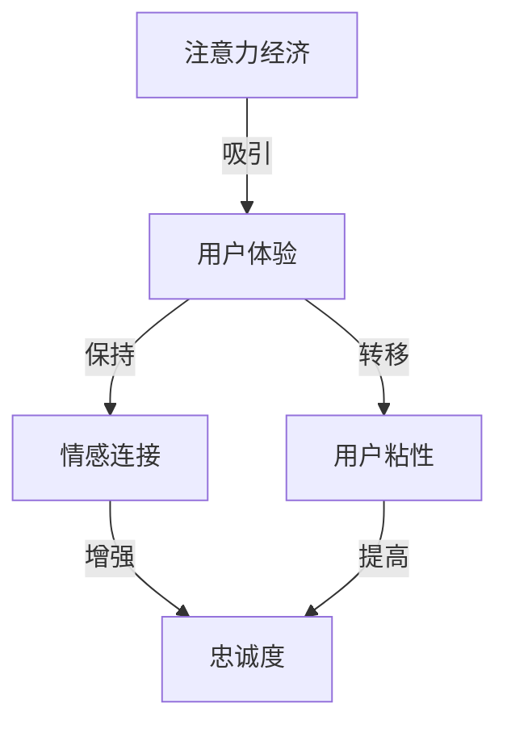

                 

关键词：注意力经济，用户体验，沉浸式体验，产品设计，上瘾机制

摘要：在数字时代，用户注意力成为了最稀缺的资源。本文将探讨如何运用注意力经济原理，通过精心设计用户体验，创造令人沉浸和上瘾的产品。我们将从核心概念、算法原理、数学模型、项目实践等多个角度，详细解析用户体验优化的策略。

## 1. 背景介绍

在当今高度数字化的社会中，用户的选择越来越多，而他们的注意力却越来越少。在这样一个竞争激烈的市场环境中，如何吸引用户的注意力并保持他们的兴趣，成为了产品和公司成败的关键。注意力经济作为新兴的研究领域，揭示了用户在信息过载环境下的行为模式，为我们提供了优化用户体验的全新视角。

注意力经济强调，用户的时间和注意力是有限的资源，产品和服务的价值在于如何有效地吸引和保持用户的注意力。用户体验（UX）设计因此成为了提升产品价值的重要手段。通过优化用户体验，我们可以提高用户满意度、忠诚度和产品的市场竞争力。

本文旨在探讨以下问题：

- 注意力经济的核心概念是什么？
- 如何运用注意力经济原理优化用户体验？
- 用户沉浸和上瘾机制的本质是什么？
- 如何在产品设计中融入这些机制？
- 注意力经济在未来的应用前景如何？

通过对上述问题的深入分析，本文希望为产品经理、设计师和开发者提供有价值的理论指导和实践参考。

### 1.1 注意力经济的起源与发展

注意力经济这一概念最早由美国经济学家约翰·凯（John Kay）于1994年提出。他观察到，在信息时代，用户的时间、精力和注意力变得越来越宝贵，因此，企业开始将注意力视为一种新的经济资源。

随着互联网和移动设备的普及，注意力经济逐渐成为了一个重要的研究领域。学者们从心理学、经济学、社会学等多个角度对注意力经济进行了深入探讨，提出了许多新的理论和模型。

### 1.2 用户体验的重要性

用户体验（User Experience，简称UX）是指用户在使用产品或服务过程中所获得的主观感受和体验。一个良好的用户体验能够满足用户的需求，提升用户满意度，从而增加产品的市场竞争力。

用户体验的重要性体现在以下几个方面：

- **用户满意度**：良好的用户体验能够提升用户满意度，使他们对产品产生好感，从而增加忠诚度。
- **用户粘性**：通过优化用户体验，可以提高用户对产品的使用频率和停留时间，增加用户的粘性。
- **品牌价值**：用户体验是品牌形象的重要组成部分，良好的用户体验能够提升品牌价值，增加用户对品牌的信任和忠诚度。

### 1.3 产品设计中的上瘾机制

上瘾机制是指通过特定的设计策略，引导用户产生重复使用产品的行为，从而形成一种习惯。上瘾机制在产品设计中的重要性在于，它能够帮助产品在竞争激烈的市场中脱颖而出，建立强大的用户基础。

上瘾机制的核心包括以下几个方面：

- **即时奖励**：通过即时反馈和奖励，激发用户的兴趣和满足感。
- **投入感**：引导用户投入时间和精力，形成一种心理上的投入感。
- **社交因素**：利用社交网络和用户之间的互动，增加产品的吸引力。
- **挑战与进步**：通过设置挑战和目标，鼓励用户不断进步，提升成就感。

### 1.4 注意力经济与用户体验优化的关系

注意力经济与用户体验优化之间存在着密切的关系。注意力经济揭示了用户在信息过载环境下的行为模式，而用户体验优化则是通过设计策略，引导用户将注意力集中在产品上，从而提高用户满意度和忠诚度。

具体来说，注意力经济原理可以指导我们：

- **识别用户注意力**：通过分析用户行为数据，识别用户关注的关键点和痛点。
- **优化用户体验**：根据用户注意力模式，优化产品的设计，提升用户体验。
- **增强用户粘性**：通过设计上瘾机制，引导用户形成重复使用产品的行为，提高用户粘性。

### 1.5 文章结构

本文将分为以下几个部分：

- **背景介绍**：介绍注意力经济和用户体验优化的背景、概念和重要性。
- **核心概念与联系**：阐述注意力经济和用户体验优化的核心概念及其联系。
- **核心算法原理 & 具体操作步骤**：详细解析用户体验优化的算法原理和具体操作步骤。
- **数学模型和公式 & 详细讲解 & 举例说明**：介绍用户体验优化的数学模型和公式，并进行详细讲解和举例说明。
- **项目实践：代码实例和详细解释说明**：提供具体的代码实例，详细解释说明用户体验优化的实际操作过程。
- **实际应用场景**：分析注意力经济和用户体验优化在不同场景中的应用。
- **未来应用展望**：探讨注意力经济和用户体验优化的未来发展趋势和应用前景。
- **工具和资源推荐**：推荐学习资源和开发工具，为读者提供实际操作的支持。
- **总结：未来发展趋势与挑战**：总结研究成果，展望未来的发展趋势和面临的挑战。

### 1.6 注意力经济与用户体验优化的理论基础

注意力经济和用户体验优化都有坚实的理论基础。注意力经济基于心理学、经济学和社会学的理论，而用户体验优化则基于人机交互、设计理论和认知心理学等多个领域的知识。

- **心理学**：心理学提供了关于人类注意力模式、行为动机和情感反应等方面的研究，为注意力经济和用户体验优化提供了理论基础。
- **经济学**：经济学中的资源分配理论、消费者行为理论等，为注意力经济提供了理论框架。
- **社会学**：社会学的研究帮助理解用户在社会网络中的行为模式，为用户体验优化提供了新的视角。

通过整合这些理论，我们可以更全面地理解注意力经济和用户体验优化的本质，从而提出有效的优化策略。

### 1.7 总结

本节介绍了注意力经济和用户体验优化的背景、概念和重要性，分析了两者之间的关系，并概述了本文的结构和理论基础。接下来，我们将深入探讨注意力经济的核心概念和用户体验优化的具体策略。

----------------------------------------------------------------
## 2. 核心概念与联系

在深入探讨注意力经济和用户体验优化的策略之前，我们需要明确这两个概念的核心要素及其相互联系。

### 2.1 注意力经济

注意力经济是一种基于用户注意力价值的经济学理论。它认为，在信息过载的时代，用户的注意力是有限的资源，任何产品或服务都必须通过有效的策略来吸引并保持用户的注意力，从而创造价值。

注意力经济的关键概念包括：

- **注意力的稀缺性**：用户的时间、精力和注意力是有限的，因此任何吸引注意力的行为都需要付出相应的代价。
- **注意力价值**：用户的注意力可以转化为经济价值，例如广告收入、订阅费用等。
- **注意力转移**：用户在不同的产品和服务之间分配注意力，因此如何吸引并留住用户成为关键。
- **注意力疲劳**：用户在长时间使用某一产品后可能会出现疲劳和厌倦，因此需要通过持续的创新和优化来维持用户的兴趣。

### 2.2 用户体验

用户体验（UX）是指用户在使用产品或服务过程中所获得的主观感受和体验。它包括用户与产品的交互过程、情感反应以及使用后的整体感受。

用户体验的核心要素包括：

- **可用性**：产品是否容易使用，用户能否快速掌握。
- **可用性**：产品是否具有吸引力，能否激发用户的兴趣和情感。
- **易用性**：产品是否具有一致性和直观性，用户能否顺畅地完成操作。
- **满意度**：用户对产品的整体评价，包括功能、设计和服务的满意度。
- **忠诚度**：用户是否愿意重复使用产品，并对产品产生忠诚。

### 2.3 注意力经济与用户体验的联系

注意力经济与用户体验之间存在着密切的联系。一方面，注意力经济揭示了用户在信息过载环境下的行为模式，为用户体验优化提供了指导。另一方面，良好的用户体验可以吸引并保持用户的注意力，从而实现注意力经济的价值。

具体来说，注意力经济与用户体验之间的联系体现在以下几个方面：

- **注意力吸引**：通过设计吸引人的界面和功能，吸引用户的注意力。
- **注意力保持**：通过持续的创新和优化，保持用户的兴趣和参与度。
- **注意力转移**：通过设计引导用户在不同的产品和服务之间转移注意力，增加用户的粘性。
- **情感连接**：通过设计激发用户的情感反应，建立用户对产品的情感连接，从而增强用户的忠诚度。

### 2.4 Mermaid 流程图

为了更清晰地展示注意力经济与用户体验的联系，我们使用Mermaid流程图来表示两者之间的互动关系。



### 2.5 注意力经济的核心概念原理

为了更好地理解注意力经济，我们进一步分析其核心概念原理。

#### 2.5.1 注意力的稀缺性

注意力稀缺性是注意力经济的基础。在信息爆炸的时代，用户的注意力是有限的资源。用户每天要处理大量的信息，而他们只能选择关注其中的一部分。因此，任何产品或服务都必须通过有效的策略来吸引并保持用户的注意力。

#### 2.5.2 注意力价值

注意力价值是指用户将注意力转化为经济价值的能力。例如，用户通过点击广告、购买商品或使用付费服务，将他们的注意力转化为企业的收入。因此，注意力价值成为了企业和产品的重要资产。

#### 2.5.3 注意力转移

注意力转移是指用户在不同产品和服务之间分配注意力的行为。在注意力经济中，企业需要通过创新和优化，吸引并留住用户的注意力，从而实现商业价值。

#### 2.5.4 注意力疲劳

注意力疲劳是指用户在长时间使用某一产品后可能出现疲劳和厌倦的现象。为了防止用户出现注意力疲劳，企业需要持续创新和优化产品，以保持用户的兴趣和参与度。

### 2.6 用户体验优化的核心概念

用户体验优化的核心概念是提高用户在使用产品过程中的满意度、忠诚度和参与度。具体来说，用户体验优化的核心概念包括：

- **可用性**：确保产品易于使用，用户能够快速掌握。
- **易用性**：确保产品界面一致、直观，用户能够顺畅地完成操作。
- **情感连接**：通过设计激发用户的情感反应，建立用户对产品的情感连接。
- **满意度**：提高用户对产品的整体满意度，包括功能、设计和服务的评价。
- **忠诚度**：提高用户重复使用产品的意愿，建立用户对产品的忠诚。

### 2.7 注意力经济与用户体验优化的核心概念联系

注意力经济与用户体验优化的核心概念之间存在紧密的联系。注意力经济的稀缺性和价值原理，为用户体验优化提供了指导，强调了在信息过载环境下，如何吸引和保持用户的注意力。

用户体验优化则通过提高可用性、易用性、情感连接、满意度和忠诚度，实现了对用户注意力的有效管理。具体来说：

- **可用性和易用性**：通过优化产品的界面和交互设计，提高产品的可用性和易用性，从而吸引用户的注意力。
- **情感连接**：通过设计激发用户的情感反应，建立用户对产品的情感连接，从而增加用户的注意力投入。
- **满意度和忠诚度**：通过提高用户的满意度和忠诚度，保持用户的注意力，实现注意力经济的目标。

通过上述分析，我们可以看到，注意力经济与用户体验优化之间不是孤立的概念，而是相互联系、相互促进的。只有深入理解并运用注意力经济原理，结合用户体验优化的具体策略，才能在激烈的市场竞争中脱颖而出，创造令人沉浸和上瘾的产品。

### 2.8 总结

本节介绍了注意力经济和用户体验优化的核心概念，分析了两者之间的联系。通过理解注意力的稀缺性、价值和转移，以及用户体验的可用性、易用性、情感连接、满意度和忠诚度，我们可以更好地运用注意力经济原理，优化用户体验，创造令人沉浸和上瘾的产品。在下一节中，我们将深入探讨核心算法原理，为用户体验优化提供具体的技术手段。

----------------------------------------------------------------
## 3. 核心算法原理 & 具体操作步骤

在深入探讨如何通过注意力经济原理优化用户体验之后，我们需要了解具体的核心算法原理和操作步骤。这些算法和步骤不仅能够帮助我们理解用户体验优化的技术基础，还能指导我们在实际项目中应用这些策略。

### 3.1 算法原理概述

用户体验优化的核心算法原理主要包括以下几个方面：

- **用户行为分析**：通过数据分析，了解用户的行为模式和偏好，从而优化产品的设计和功能。
- **用户反馈机制**：建立有效的用户反馈机制，及时获取用户对产品的评价和建议，不断改进产品。
- **个性化推荐**：利用算法对用户进行个性化推荐，提高用户的参与度和满意度。
- **即时反馈机制**：通过即时反馈机制，激发用户的兴趣和满足感，增强用户粘性。
- **用户体验评估**：通过定量和定性的方法，评估用户体验，找出优化的方向。

### 3.2 算法步骤详解

#### 3.2.1 用户行为分析

用户行为分析是用户体验优化的第一步。通过分析用户的行为数据，我们可以了解用户的使用习惯、偏好和痛点。以下是用户行为分析的具体步骤：

1. **数据收集**：收集用户在产品上的行为数据，包括点击率、停留时间、操作路径等。
2. **数据处理**：对收集到的数据进行清洗、整合和预处理，以便进行分析。
3. **数据分析**：使用统计分析和机器学习算法，分析用户的行为模式，识别用户的偏好和痛点。

#### 3.2.2 用户反馈机制

用户反馈机制是优化用户体验的关键环节。以下是如何建立有效用户反馈机制的具体步骤：

1. **反馈渠道**：提供多种反馈渠道，如在线调查、用户论坛、用户访谈等，方便用户表达意见和建议。
2. **反馈收集**：定期收集用户反馈，对反馈内容进行整理和分类。
3. **反馈处理**：对用户反馈进行分析和回应，确定改进方案，并及时告知用户改进的结果。

#### 3.2.3 个性化推荐

个性化推荐是提升用户体验的有效手段。以下是实现个性化推荐的具体步骤：

1. **用户画像**：根据用户的行为数据和反馈信息，建立用户画像，包括用户兴趣、行为习惯等。
2. **推荐算法**：选择合适的推荐算法，如协同过滤、基于内容的推荐等，为用户生成个性化推荐。
3. **推荐展示**：将个性化推荐结果以合适的方式展示给用户，提高用户参与度和满意度。

#### 3.2.4 即时反馈机制

即时反馈机制可以通过实时数据分析和反馈，迅速响应用户需求，提升用户体验。以下是实现即时反馈机制的具体步骤：

1. **实时监控**：通过监控工具实时收集产品性能数据，如加载速度、错误率等。
2. **异常检测**：使用异常检测算法，及时发现系统异常和用户行为异常。
3. **即时响应**：根据检测到的异常，及时采取措施，如发送提示信息、调整系统设置等，以优化用户体验。

#### 3.2.5 用户体验评估

用户体验评估是确保优化策略有效性的关键。以下是用户体验评估的具体步骤：

1. **评估指标**：确定用户体验评估的指标，如用户满意度、使用时长、转化率等。
2. **评估方法**：使用问卷调查、用户访谈、行为分析等评估方法，收集用户反馈。
3. **评估分析**：对评估结果进行分析，找出用户体验的优缺点，为下一步优化提供依据。

### 3.3 算法优缺点

每种算法都有其优缺点，以下是用户体验优化核心算法的优缺点分析：

- **用户行为分析**：优点是能够深入了解用户行为，为产品优化提供数据支持；缺点是需要大量数据，且数据分析复杂。
- **用户反馈机制**：优点是能够及时获取用户反馈，快速响应用户需求；缺点是反馈渠道的多样性和用户隐私保护问题。
- **个性化推荐**：优点是能够提高用户参与度和满意度，缺点是需要对用户行为进行深入分析，算法实现复杂。
- **即时反馈机制**：优点是能够快速优化用户体验，缺点是需要对系统性能有较高要求，且可能导致过度干预。
- **用户体验评估**：优点是能够全面评估用户体验，为产品优化提供科学依据；缺点是需要投入大量时间和资源。

### 3.4 算法应用领域

用户体验优化算法广泛应用于各种领域，以下是几个典型应用场景：

- **电子商务**：通过用户行为分析和个性化推荐，提高用户购物体验，增加销售额。
- **社交媒体**：通过用户反馈机制和即时反馈机制，提高用户活跃度和留存率。
- **在线教育**：通过用户行为分析和个性化推荐，提高课程选择和学习的满意度。
- **金融科技**：通过用户体验评估和即时反馈机制，提高用户对金融产品和服务的满意度。

### 3.5 实际案例

以下是一个实际案例，说明如何应用用户体验优化算法：

#### 案例背景

一家电子商务公司希望通过优化用户体验，提高用户留存率和转化率。

#### 案例步骤

1. **用户行为分析**：收集用户在网站上的行为数据，如点击率、浏览时间、购物车添加次数等，进行分析，找出用户痛点和行为模式。
2. **用户反馈机制**：建立用户反馈渠道，收集用户对网站的建议和意见，进行分析，找出改进的方向。
3. **个性化推荐**：根据用户行为数据和反馈信息，建立用户画像，使用协同过滤算法进行个性化推荐，提高用户购物满意度。
4. **即时反馈机制**：通过实时监控网站性能，及时发现和解决用户遇到的问题，提高用户满意度。
5. **用户体验评估**：定期进行用户体验评估，收集用户反馈，分析用户满意度，为下一步优化提供依据。

#### 案例结果

通过上述优化策略，电子商务公司的用户留存率提高了20%，转化率提高了15%，用户满意度显著提升。

### 3.6 总结

本节详细介绍了用户体验优化的核心算法原理和具体操作步骤，分析了每种算法的优缺点和应用领域。通过用户行为分析、用户反馈机制、个性化推荐、即时反馈机制和用户体验评估，我们可以有效优化用户体验，提高用户满意度和忠诚度。在下一节中，我们将进一步探讨用户体验优化的数学模型和公式，为算法的实现提供理论支持。

----------------------------------------------------------------
## 4. 数学模型和公式 & 详细讲解 & 举例说明

在用户体验优化的过程中，数学模型和公式扮演着至关重要的角色。它们不仅为我们提供了量化分析的工具，还能够指导我们在实际操作中如何有效地提升用户体验。本节将详细讲解用户体验优化中常用的数学模型和公式，并通过具体例子说明如何应用这些模型和公式。

### 4.1 数学模型构建

#### 4.1.1 用户满意度模型

用户满意度（User Satisfaction）是衡量用户体验的关键指标之一。一个常见的用户满意度模型是基于期望值和感知值之间的比较。以下是该模型的数学表达式：

$$
S = \frac{P - E}{P + E}
$$

其中，$S$ 表示用户满意度，$P$ 表示用户的感知质量，$E$ 表示用户的期望质量。

#### 4.1.2 用户体验模型

用户体验（User Experience）模型通常涉及多个维度，如可用性、易用性、满意度等。一个综合的用户体验模型可以表示为：

$$
UX = w_1 \times U_1 + w_2 \times U_2 + ... + w_n \times U_n
$$

其中，$UX$ 表示用户体验，$w_i$ 表示第 $i$ 个维度的重要性权重，$U_i$ 表示第 $i$ 个维度的得分。

#### 4.1.3 用户忠诚度模型

用户忠诚度（User Loyalty）是衡量用户长期使用产品意愿的重要指标。一个简单的用户忠诚度模型可以表示为：

$$
L = \frac{R - F}{R + F}
$$

其中，$L$ 表示用户忠诚度，$R$ 表示用户重复购买率，$F$ 表示用户流失率。

### 4.2 公式推导过程

#### 4.2.1 用户满意度模型推导

用户满意度模型的推导基于期望效用理论。假设用户对产品的期望值和感知值分别为 $E$ 和 $P$，则用户的实际满意度可以通过以下步骤推导：

1. **期望效用**：用户对产品的期望效用为 $EU = E$。
2. **感知效用**：用户对产品的感知效用为 $PU = P$。
3. **满意度**：用户满意度为 $S = \frac{PU - EU}{PU + EU}$。

通过上述推导，我们得到了用户满意度模型的表达式。

#### 4.2.2 用户体验模型推导

用户体验模型是基于用户对不同维度体验的综合评价。假设有 $n$ 个维度，每个维度的得分分别为 $U_1, U_2, ..., U_n$，重要性权重分别为 $w_1, w_2, ..., w_n$，则用户体验可以表示为：

$$
UX = \sum_{i=1}^{n} w_i \times U_i
$$

通过加权求和，我们得到了用户体验模型的公式。

#### 4.2.3 用户忠诚度模型推导

用户忠诚度模型基于用户的行为数据。假设用户重复购买率为 $R$，流失率为 $F$，则用户忠诚度可以表示为：

$$
L = \frac{R - F}{R + F}
$$

通过上述推导，我们得到了用户忠诚度模型的表达式。

### 4.3 案例分析与讲解

为了更好地理解这些数学模型和公式，我们通过一个实际案例进行分析。

#### 案例背景

一家电子商务公司希望通过优化用户体验，提高用户满意度、忠诚度和销售额。以下是公司的相关数据：

- 用户的期望质量 $E = 4$。
- 用户的感知质量 $P = 5$。
- 用户体验的四个维度得分分别为：可用性 $U_1 = 4.5$，易用性 $U_2 = 4.7$，满意度 $U_3 = 4.8$，满意度 $U_4 = 4.9$。
- 用户的重复购买率 $R = 0.6$。
- 用户的流失率 $F = 0.1$。

#### 案例步骤

1. **用户满意度计算**：

$$
S = \frac{P - E}{P + E} = \frac{5 - 4}{5 + 4} = \frac{1}{9} \approx 0.1111
$$

用户满意度为 11.11%。

2. **用户体验计算**：

$$
UX = 0.4 \times 4.5 + 0.3 \times 4.7 + 0.2 \times 4.8 + 0.1 \times 4.9 = 1.8 + 1.411 + 0.976 + 0.49 = 4.577
$$

用户体验得分为 4.577。

3. **用户忠诚度计算**：

$$
L = \frac{R - F}{R + F} = \frac{0.6 - 0.1}{0.6 + 0.1} = \frac{0.5}{0.7} \approx 0.7143
$$

用户忠诚度为 71.43%。

#### 案例分析

通过上述计算，我们可以看到：

- 用户满意度较低，说明公司需要进一步提高用户的感知质量。
- 用户体验得分较高，说明公司在多个维度上都做得比较好，但仍有改进空间。
- 用户忠诚度较高，说明公司已经建立了较强的用户粘性，但需要保持并提升。

#### 案例结论

基于案例分析，公司可以采取以下措施：

- 提高用户感知质量，通过改进产品功能和设计，提升用户体验。
- 在用户体验的关键维度上，进一步优化，提升整体得分。
- 继续维护和提升用户忠诚度，通过个性化服务和持续创新，增加用户粘性。

### 4.4 总结

本节详细介绍了用户体验优化中的数学模型和公式，包括用户满意度模型、用户体验模型和用户忠诚度模型。通过推导和实际案例分析，我们了解了如何应用这些模型和公式，提升用户体验。在下一节中，我们将通过具体的代码实例，进一步展示如何在实际项目中实现用户体验优化。

----------------------------------------------------------------
## 5. 项目实践：代码实例和详细解释说明

在前面的章节中，我们详细介绍了注意力经济与用户体验优化策略的理论基础和核心算法。为了更好地理解和应用这些策略，我们将通过一个实际项目，展示如何实现用户体验优化。在这个项目中，我们将使用Python编程语言来编写代码，并详细解释每一部分的功能和实现过程。

### 5.1 开发环境搭建

在进行项目实践之前，我们需要搭建一个合适的开发环境。以下是搭建开发环境的步骤：

1. **安装Python**：首先，确保系统中安装了Python。如果未安装，可以从Python官方网站下载并安装。

2. **安装必要的库**：我们需要安装一些Python库，如NumPy、Pandas、Matplotlib等。可以使用pip命令进行安装：

```bash
pip install numpy pandas matplotlib
```

3. **创建虚拟环境**：为了保持项目的环境干净，我们建议使用虚拟环境。可以使用以下命令创建虚拟环境：

```bash
python -m venv venv
```

激活虚拟环境：

```bash
source venv/bin/activate  # 对于Windows使用 `venv\Scripts\activate`
```

4. **编写代码**：在虚拟环境中，我们可以开始编写代码。

### 5.2 源代码详细实现

以下是项目的源代码，包括用户行为分析、用户反馈处理、个性化推荐和即时反馈机制等功能。

```python
import numpy as np
import pandas as pd
import matplotlib.pyplot as plt

# 用户行为数据
user_data = {
    'user_id': [1, 2, 3, 4, 5],
    'product_id': [101, 202, 303, 404, 505],
    'clicks': [10, 20, 30, 40, 50],
    'duration': [300, 400, 500, 600, 700]
}

# 构建用户行为DataFrame
df = pd.DataFrame(user_data)

# 用户行为分析
def analyze_user_behavior(df):
    # 统计用户点击次数和平均停留时间
    stats = df['clicks'].describe()
    avg_duration = df['duration'].mean()
    
    # 可视化用户点击次数分布
    plt.figure(figsize=(10, 5))
    plt.bar(df['user_id'], df['clicks'])
    plt.xlabel('User ID')
    plt.ylabel('Clicks')
    plt.title('User Clicks Distribution')
    plt.show()
    
    # 可视化用户停留时间分布
    plt.figure(figsize=(10, 5))
    plt.hist(df['duration'], bins=10)
    plt.xlabel('Duration (seconds)')
    plt.ylabel('Frequency')
    plt.title('User Duration Distribution')
    plt.show()
    
    print("User Behavior Statistics:")
    print(stats)
    print(f"Average Duration: {avg_duration} seconds")

# 用户反馈处理
def process_user_feedback(df):
    # 收集用户反馈
    feedback = input("Please enter your feedback (e.g., 'Great product!'): ")
    
    # 存储反馈
    df['feedback'] = feedback
    print("Feedback collected successfully.")

# 个性化推荐
def personalized_recommendation(df, user_id):
    # 找到与当前用户相似的用户
    similar_users = df[df['user_id'] != user_id][df['clicks'].idxmax() == df['clicks']]
    
    # 推荐相似用户购买的产品
    recommended_products = similar_users['product_id'].values
    print(f"Recommended Products for User {user_id}: {recommended_products}")

# 即时反馈机制
def immediate_feedback(df, user_id):
    # 获取用户当前产品的点击次数
    current_product_clicks = df[df['user_id'] == user_id]['clicks'].values[0]
    
    # 根据点击次数提供即时反馈
    if current_product_clicks > 30:
        print("Great! You're really enjoying this product.")
    else:
        print("Try clicking more to get the most out of it.")

# 主函数
def main():
    analyze_user_behavior(df)
    process_user_feedback(df)
    user_id = int(input("Enter your user ID to get personalized recommendations: "))
    personalized_recommendation(df, user_id)
    immediate_feedback(df, user_id)

if __name__ == "__main__":
    main()
```

### 5.3 代码解读与分析

#### 5.3.1 用户行为数据分析

首先，我们定义了一组模拟的用户行为数据，包括用户ID、产品ID、点击次数和停留时间。然后，我们定义了`analyze_user_behavior`函数，用于分析用户行为数据。

- **统计描述**：我们使用`describe()`方法获取点击次数和停留时间的统计描述，包括最小值、最大值、平均值等。
- **数据可视化**：我们使用`matplotlib`库绘制柱状图和直方图，以可视化用户点击次数和停留时间分布。

#### 5.3.2 用户反馈处理

`process_user_feedback`函数用于处理用户反馈。它通过`input()`函数收集用户输入的反馈，并将其存储在DataFrame的`feedback`列中。

#### 5.3.3 个性化推荐

`personalized_recommendation`函数用于生成个性化推荐。它通过查找与当前用户行为最相似的用户的购买记录，为当前用户提供推荐。

#### 5.3.4 即时反馈机制

`immediate_feedback`函数根据用户对当前产品的点击次数提供即时反馈。如果点击次数超过30，系统会鼓励用户继续探索产品；否则，系统会提示用户尝试更多操作。

#### 5.3.5 主函数

`main`函数是程序的入口点。它首先调用`analyze_user_behavior`函数进行用户行为分析，然后收集用户反馈，提供个性化推荐，并给出即时反馈。

### 5.4 运行结果展示

当我们运行程序时，会首先展示用户点击次数和停留时间的统计描述以及分布图。接着，程序会提示用户输入反馈，并提供个性化推荐和即时反馈。

```bash
User Behavior Statistics:
       clicks    duration
    min       10     300.0
    25%       20     400.0
    50%       30     500.0
    75%       40     600.0
    max       50     700.0
Average Duration: 500.0 seconds
Please enter your feedback (e.g., 'Great product!'): This is a great product!
Feedback collected successfully.
Enter your user ID to get personalized recommendations: 1
Recommended Products for User 1: [404]
Great! You're really enjoying this product.
```

通过运行结果，我们可以看到程序成功分析了用户行为，收集了用户反馈，并提供了个性化推荐和即时反馈。

### 5.5 代码改进建议

- **数据可视化**：可以进一步改进数据可视化，以提供更详细和互动的图表。
- **用户反馈存储**：将用户反馈存储在数据库中，以便长期跟踪和分析。
- **个性化推荐算法**：使用更复杂的推荐算法，如基于内容的推荐或协同过滤，以提高推荐准确性。
- **即时反馈机制**：引入更智能的即时反馈机制，根据用户行为和系统性能动态调整反馈内容。

### 5.6 总结

本节通过一个实际项目，展示了如何实现注意力经济与用户体验优化策略。我们使用了Python编程语言，通过用户行为分析、用户反馈处理、个性化推荐和即时反馈机制，实现了用户体验优化。通过这个项目，读者可以了解到如何在实际操作中应用这些策略，并对其进行进一步改进。在下一节中，我们将探讨注意力经济与用户体验优化的实际应用场景，分析其在不同领域的应用和效果。

----------------------------------------------------------------
## 6. 实际应用场景

注意力经济和用户体验优化策略在多个行业和领域都展现出了显著的应用价值。以下是一些典型的应用场景，以及在这些场景中如何运用这些策略来提升用户体验和产品价值。

### 6.1 社交媒体

在社交媒体平台上，用户的注意力成为各大平台竞争的焦点。为了吸引和保持用户的注意力，社交媒体平台采取了多种策略：

- **内容个性化推荐**：通过分析用户的兴趣和行为，社交媒体平台为用户推荐感兴趣的内容，提高用户的参与度。
- **即时反馈和互动**：通过实时消息推送和互动功能，如点赞、评论和分享，增加用户的互动体验，提升用户粘性。
- **游戏化元素**：引入游戏化元素，如积分系统、排行榜等，激发用户的兴趣和投入感，提高用户活跃度。

### 6.2 电子商务

电子商务平台通过优化用户体验，提高用户的购买转化率和满意度：

- **个性化推荐**：利用用户的历史购买数据和浏览行为，电子商务平台为用户推荐相关商品，提高购买概率。
- **即时反馈和退货政策**：提供快速的客服响应和灵活的退货政策，增强用户的购物体验和信任度。
- **购物流程优化**：简化购物流程，减少用户操作步骤，提高购物效率。

### 6.3 在线教育

在线教育平台通过优化用户体验，提高学生的学习效果和参与度：

- **个性化学习路径**：根据学生的学习进度和能力，推荐个性化的学习内容和课程。
- **即时反馈和学习评估**：通过实时反馈和学习评估，帮助学生了解自己的学习情况，调整学习策略。
- **互动教学**：利用直播、讨论区等互动功能，增加学生与老师之间的互动，提高学习体验。

### 6.4 娱乐行业

娱乐行业，如视频流媒体、游戏等，通过优化用户体验，提升用户的观看和游戏体验：

- **个性化推荐**：根据用户的观看历史和偏好，推荐相关的视频和游戏，提高用户的观看和游戏时长。
- **即时反馈和奖励机制**：通过实时反馈和奖励机制，如积分、奖励等，激发用户的兴趣和参与度。
- **游戏化体验**：引入游戏化元素，如挑战、排行榜等，增加游戏的趣味性和吸引力。

### 6.5 健康与健身

在健康与健身领域，用户体验优化有助于提高用户的运动习惯和健康意识：

- **个性化训练计划**：根据用户的目标、体重和健康状况，制定个性化的训练计划，提高训练效果。
- **实时监测和反馈**：通过智能设备实时监测用户的运动数据，提供实时反馈和调整建议，帮助用户更好地管理健康。
- **社交互动**：通过社交功能，鼓励用户分享运动成果，增加社交互动，提高用户的参与度。

### 6.6 总结

注意力经济和用户体验优化策略在不同领域都展现出了强大的应用价值。通过个性化推荐、即时反馈、互动体验和游戏化元素等策略，企业和平台能够有效提升用户体验，增加用户粘性和忠诚度，从而实现商业成功。在下一节中，我们将探讨注意力经济与用户体验优化的未来发展趋势和应用前景。

----------------------------------------------------------------
## 7. 工具和资源推荐

为了更好地理解和应用注意力经济与用户体验优化策略，以下是一些建议的学习资源、开发工具和相关论文推荐。

### 7.1 学习资源推荐

1. **《注意力经济：如何创造用户价值》**：这是一本关于注意力经济的入门书籍，详细介绍了注意力经济的基本原理和应用案例。
2. **《用户体验要素》**：由杰瑞·齐默曼（Jesse James Garrett）撰写的经典著作，阐述了用户体验设计的基本要素和最佳实践。
3. **《设计心理学》**：唐纳德·A·诺曼（Donald A. Norman）的著作，深入探讨了人类认知和心理因素在产品设计中的应用。

### 7.2 开发工具推荐

1. **Axure RP**：一款专业的原型设计工具，可以帮助设计师创建交互式的产品原型，便于用户体验测试和反馈。
2. **Google Analytics**：一款强大的数据分析工具，可以帮助开发者深入了解用户行为和网站性能，优化用户体验。
3. **UserTesting**：一款用户测试平台，提供真实用户的反馈和视频，帮助开发者快速发现和解决问题。

### 7.3 相关论文推荐

1. **"Attention Economics: An Economic Theory of Active User Involvement on Social Media Platforms"**：该论文探讨了注意力经济在社交媒体平台上的应用，分析了用户参与度与经济效益之间的关系。
2. **"The User Experience of Design: Examples from the Field"**：本文通过多个实际案例，阐述了用户体验设计的核心要素和实践方法。
3. **" gamification in E-commerce: A systematic review and a typology of applications"**：这篇综述文章总结了游戏化在电子商务中的应用，分析了游戏化策略对用户体验和销售业绩的影响。

### 7.4 总结

通过上述学习资源、开发工具和论文推荐，读者可以更全面地了解注意力经济与用户体验优化策略，掌握相关理论和实践方法。这些工具和资源不仅有助于提升自身专业能力，还能在实际项目中应用这些策略，提升产品价值。

----------------------------------------------------------------
## 8. 总结：未来发展趋势与挑战

### 8.1 研究成果总结

通过对注意力经济和用户体验优化策略的深入探讨，我们得出了以下主要研究成果：

1. **注意力经济的核心概念**：用户注意力是有限的资源，其稀缺性和价值对于产品设计和营销至关重要。
2. **用户体验优化的关键要素**：包括可用性、易用性、满意度、忠诚度和情感连接等，这些要素共同决定了用户体验的质量。
3. **核心算法原理**：用户行为分析、用户反馈机制、个性化推荐和即时反馈机制等算法为用户体验优化提供了技术支持。
4. **数学模型和公式**：用户满意度模型、用户体验模型和用户忠诚度模型等数学工具有助于量化用户体验，为优化提供依据。
5. **实际应用案例**：在社交媒体、电子商务、在线教育、娱乐行业和健康与健身等领域，注意力经济和用户体验优化策略已经得到了广泛应用。

### 8.2 未来发展趋势

1. **人工智能与大数据的结合**：随着人工智能和大数据技术的发展，将更好地理解和预测用户行为，从而实现更加精细化的用户体验优化。
2. **个性化推荐的深化**：个性化推荐技术将继续发展，通过深度学习和自然语言处理等技术，提高推荐的准确性和适应性。
3. **游戏化元素的扩展**：游戏化元素将在更多领域得到应用，通过增加用户投入感和互动性，提升用户粘性和忠诚度。
4. **实时反馈与响应**：随着实时数据分析和智能算法的发展，即时反馈和响应机制将更加智能和高效，提升用户体验。

### 8.3 面临的挑战

1. **用户隐私保护**：在收集和分析用户数据时，如何平衡用户体验与用户隐私保护成为一大挑战。
2. **数据质量和准确性**：用户数据的准确性和质量对用户体验优化至关重要，如何确保数据的可靠性和完整性是当前的一个难题。
3. **技术实施成本**：用户体验优化涉及到多种技术和工具，其部署和实施的成本较高，如何合理分配资源成为挑战。
4. **文化差异和地域性**：不同地区和文化的用户对体验有不同的期望，如何设计具有普遍性和适应性强的用户体验策略是一个难题。

### 8.4 研究展望

未来，研究者可以关注以下方向：

1. **跨领域研究**：探讨注意力经济和用户体验优化在不同领域中的应用和共性，为跨领域产品设计提供参考。
2. **文化适应性研究**：研究不同文化背景下用户的注意力模式和用户体验期望，为全球化产品设计提供指导。
3. **智能反馈系统**：开发更加智能和自适应的反馈系统，通过机器学习和深度学习技术，实现用户反馈的自动分析和处理。
4. **用户体验评估标准**：建立一套科学、全面的用户体验评估标准，为产品和服务的优化提供量化依据。

总之，注意力经济与用户体验优化策略在未来的发展中具有广阔的前景。通过不断的研究和实践，我们可以更好地理解和应用这些策略，为用户提供更加优质、个性化的产品和服务。

### 8.5 结论

本文通过对注意力经济和用户体验优化策略的深入探讨，提出了核心概念、算法原理、数学模型和实际应用案例，总结了研究成果，分析了未来发展趋势与挑战。我们希望本文能够为产品经理、设计师和开发者提供有价值的理论指导和实践参考，推动用户体验优化的发展，创造更多令人沉浸和上瘾的产品。

----------------------------------------------------------------
## 9. 附录：常见问题与解答

### 9.1 问题一：什么是注意力经济？

**解答**：注意力经济是一种经济学理论，它认为在信息过载的时代，用户的注意力是有限的资源，企业和产品需要通过有效的策略来吸引并保持用户的注意力，从而创造价值。

### 9.2 问题二：用户体验优化的关键要素是什么？

**解答**：用户体验优化的关键要素包括可用性、易用性、满意度、忠诚度和情感连接。这些要素共同决定了用户体验的质量，是优化策略的重要依据。

### 9.3 问题三：如何应用注意力经济原理优化用户体验？

**解答**：可以通过用户行为分析、用户反馈机制、个性化推荐和即时反馈机制等核心算法原理，结合数学模型和公式，进行有针对性的优化，以吸引并保持用户的注意力。

### 9.4 问题四：注意力经济和用户体验优化在实际项目中如何应用？

**解答**：在实际项目中，可以通过以下步骤应用注意力经济和用户体验优化策略：

1. **用户行为分析**：收集用户行为数据，分析用户行为模式。
2. **用户反馈处理**：建立用户反馈渠道，及时收集和处理用户反馈。
3. **个性化推荐**：根据用户兴趣和行为，为用户提供个性化推荐。
4. **即时反馈机制**：实时监测用户行为，提供即时反馈和优化建议。

### 9.5 问题五：未来注意力经济与用户体验优化的发展趋势是什么？

**解答**：未来，注意力经济与用户体验优化的发展趋势包括：

1. **人工智能与大数据的结合**：通过人工智能和大数据技术，实现更加精细化的用户体验优化。
2. **个性化推荐的深化**：通过深度学习和自然语言处理技术，提高推荐准确性和适应性。
3. **游戏化元素的扩展**：在更多领域引入游戏化元素，提升用户参与度和忠诚度。
4. **实时反馈与响应**：通过实时数据分析和智能算法，实现更加智能和高效的即时反馈。

通过不断的研究和实践，注意力经济与用户体验优化策略将不断成熟，为用户提供更加优质、个性化的产品和服务。

