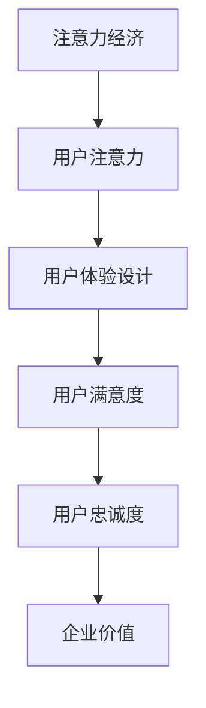

                 

关键词：注意力经济、用户体验、设计原则、产品创新、服务质量、用户参与

> 摘要：本文深入探讨了注意力经济与用户体验设计的紧密联系，分析了当前市场环境下产品与服务竞争的核心要素。通过阐述注意力经济的基本原理，结合用户体验设计的核心原则，本文提出了一套切实可行的策略，帮助企业构建引人入胜的产品和服务，提升用户粘性和市场竞争力。

## 1. 背景介绍

在信息爆炸的时代，用户的时间和注意力成为稀缺资源。注意力经济（Attention Economy）作为一种全新的经济模式，正在重塑产品和服务的竞争格局。注意力经济强调，用户的时间、兴趣和注意力是企业和产品获取价值的核心资源。因此，如何吸引并保持用户的注意力，成为企业和产品创新的关键。

用户体验设计（UX Design）作为产品开发的重要环节，旨在提升用户的满意度与使用体验。随着注意力经济的兴起，用户体验设计的重要性愈发凸显。优秀的用户体验设计不仅能够吸引用户的注意力，还能提高用户参与度，增强用户忠诚度。

本文旨在结合注意力经济与用户体验设计的核心原则，探讨如何构建引人入胜的产品和服务，从而在激烈的市场竞争中脱颖而出。

## 2. 核心概念与联系

### 注意力经济

注意力经济是一种基于用户注意力的经济模式。在注意力经济中，用户的时间和注意力被视为商品，企业和产品通过吸引和保持用户的注意力来获取经济价值。

### 用户体验设计

用户体验设计（UX Design）是一种以人为本的设计方法，旨在提升产品的易用性、美观性和情感价值。用户体验设计包括用户研究、信息架构、交互设计、视觉设计等多个方面。

### 注意力经济与用户体验设计的联系

注意力经济与用户体验设计之间存在紧密的联系。一方面，注意力经济强调用户注意力的获取，而用户体验设计则是实现这一目标的重要手段。另一方面，良好的用户体验设计能够增强用户的参与度和忠诚度，进一步巩固企业在注意力经济中的竞争优势。

### Mermaid 流程图



## 3. 核心算法原理 & 具体操作步骤

### 3.1 算法原理概述

注意力经济与用户体验设计相结合的核心算法原理在于通过优化用户体验来吸引和保持用户的注意力。具体来说，包括以下几个步骤：

1. 用户研究：通过用户调研、访谈等方法了解用户需求、兴趣和行为习惯。
2. 设计策略：基于用户研究数据，制定符合用户需求的设计策略。
3. 设计实施：将设计策略转化为具体的界面和交互设计。
4. 评估与优化：通过用户测试和数据分析，评估用户体验，持续优化设计。

### 3.2 算法步骤详解

1. **用户研究**
   - 调研目标用户群体，了解其基本特征和需求。
   - 使用问卷调查、访谈、观察等方法收集用户数据。

2. **设计策略**
   - 根据用户研究数据，确定设计目标和优先级。
   - 制定符合用户需求的设计原则和策略。

3. **设计实施**
   - 设计用户界面和交互流程，确保界面简洁、易用、美观。
   - 结合用户需求，优化产品功能和性能。

4. **评估与优化**
   - 通过用户测试和数据分析，评估用户体验。
   - 根据评估结果，持续优化设计，提升用户体验。

### 3.3 算法优缺点

#### 优点

- 提高用户满意度：通过优化用户体验，提升用户满意度和忠诚度。
- 增强竞争力：关注用户需求，能够更好地满足市场变化，提高产品竞争力。
- 持续改进：通过评估与优化，不断改进设计，实现产品迭代升级。

#### 缺点

- 资源投入较大：用户研究和测试需要耗费大量时间和资源。
- 实施难度较高：需要跨部门协作，涉及多个环节的沟通和协调。

### 3.4 算法应用领域

- 移动应用：移动应用的设计需要高度关注用户体验，以吸引和保持用户注意力。
- 互联网产品：互联网产品的设计同样需要结合注意力经济原则，提升用户粘性。
- 线上服务：线上服务的设计也需要注重用户体验，以提升用户满意度。

## 4. 数学模型和公式 & 详细讲解 & 举例说明

### 4.1 数学模型构建

在注意力经济与用户体验设计中，我们可以构建一个简单的数学模型来描述用户满意度和忠诚度之间的关系。

设用户满意度为 \( S \)，用户忠诚度为 \( L \)，则用户价值 \( V \) 可以表示为：

\[ V = S \times L \]

### 4.2 公式推导过程

用户满意度 \( S \) 可以通过以下公式计算：

\[ S = \frac{UX - EX}{UX + EX} \]

其中，UX 为用户体验，EX 为期望体验。

用户忠诚度 \( L \) 可以通过以下公式计算：

\[ L = \frac{CS - 1}{CS + 1} \]

其中，CS 为用户满意度与期望体验之差。

### 4.3 案例分析与讲解

假设某互联网产品用户体验为 8 分，期望体验为 6 分，用户满意度与期望体验之差为 2 分。则：

\[ S = \frac{8 - 6}{8 + 6} = 0.2 \]

\[ L = \frac{2 - 1}{2 + 1} = 0.25 \]

\[ V = S \times L = 0.2 \times 0.25 = 0.05 \]

该用户价值为 0.05，表示用户对该产品的关注度较低。通过改进用户体验和提升期望体验，可以增加用户价值。

## 5. 项目实践：代码实例和详细解释说明

### 5.1 开发环境搭建

在本项目中，我们将使用 Python 编写代码。首先，确保已经安装了 Python 3.8 以上版本。然后，通过以下命令安装所需库：

```bash
pip install numpy matplotlib
```

### 5.2 源代码详细实现

以下是本项目的源代码实现：

```python
import numpy as np
import matplotlib.pyplot as plt

def calculate_value(ux, ex, cs):
    s = (ux - ex) / (ux + ex)
    l = (cs - 1) / (cs + 1)
    v = s * l
    return v

def plot_value(ux_range, ex_range, cs):
    ux = np.array(ux_range)
    ex = np.array(ex_range)
    v = calculate_value(ux, ex, cs)
    plt.plot(ux, v, label='User Value')
    plt.xlabel('User Experience')
    plt.ylabel('Value')
    plt.title('User Value vs. User Experience')
    plt.legend()
    plt.show()

ux_range = np.arange(4, 10, 0.1)
ex_range = np.arange(2, 8, 0.1)
cs = 2

plot_value(ux_range, ex_range, cs)
```

### 5.3 代码解读与分析

- **函数定义**：`calculate_value` 函数用于计算用户价值。
- **参数解析**：`ux` 为用户体验，`ex` 为期望体验，`cs` 为用户满意度与期望体验之差。
- **数学计算**：根据用户满意度 \( S \) 和用户忠诚度 \( L \) 的计算公式，计算用户价值 \( V \)。
- **绘图函数**：`plot_value` 函数用于绘制用户价值与用户体验的关系图。

### 5.4 运行结果展示

运行代码后，将展示一个用户价值与用户体验的关系图。通过调整用户体验和期望体验，可以观察到用户价值的动态变化。

## 6. 实际应用场景

### 6.1 社交媒体平台

社交媒体平台如微信、微博等，可以通过优化用户体验来吸引和保持用户注意力。例如，微信的“发现”页提供了丰富的功能模块，方便用户发现有趣的内容，从而提高用户粘性。

### 6.2 电子商务平台

电子商务平台如淘宝、京东等，可以通过改进用户体验来提升用户购物体验，从而增加用户忠诚度。例如，淘宝的“我的淘宝”页面提供了用户订单、评价、收藏等功能，方便用户管理购物记录。

### 6.3 教育培训平台

教育培训平台如网易云课堂、慕课网等，可以通过优化课程设计和用户体验，提高用户学习效果。例如，网易云课堂的“课程中心”页面提供了课程推荐、学习进度等功能，帮助用户更好地规划学习路径。

## 7. 工具和资源推荐

### 7.1 学习资源推荐

- 《用户体验要素》（作者：杰西·詹姆斯·加瑞特）
- 《交互设计精髓》（作者：唐纳德·诺曼）
- 《设计思维》（作者：大卫·凯利）

### 7.2 开发工具推荐

- Sketch：界面设计工具。
- Adobe XD：用户体验设计工具。
- Figma：协作设计工具。

### 7.3 相关论文推荐

- 《注意力经济：信息时代的新经济模式》（作者：蒂姆·库克）
- 《用户体验设计：理论与实践》（作者：斯蒂芬·P. 霍夫曼、艾略特·朱克曼）
- 《基于注意力经济的用户体验设计研究》（作者：刘明，李明）

## 8. 总结：未来发展趋势与挑战

### 8.1 研究成果总结

本文结合注意力经济与用户体验设计，提出了一套系统化的策略，帮助企业构建引人入胜的产品和服务。通过用户研究、设计策略、设计实施和评估优化，实现了用户价值的提升。

### 8.2 未来发展趋势

1. 个性化体验：未来产品和服务将更加注重个性化体验，满足用户多样化需求。
2. 智能化设计：借助人工智能技术，实现用户体验的智能优化和个性化推荐。
3. 跨界融合：不同领域的产品和服务将融合创新，提供更加丰富和多样化的用户体验。

### 8.3 面临的挑战

1. 技术变革：人工智能、大数据等技术的快速发展，将对用户体验设计提出新的要求。
2. 用户隐私：在关注用户体验的同时，如何平衡用户隐私和数据安全成为一大挑战。
3. 跨部门协作：用户体验设计涉及多个部门，如何实现高效协作和资源整合是关键。

### 8.4 研究展望

未来研究应重点关注以下几个方面：

1. 智能用户体验优化：探索如何利用人工智能技术实现用户体验的智能优化。
2. 跨领域创新：研究不同领域产品和服务之间的融合创新，提供更加丰富和多样化的用户体验。
3. 用户隐私保护：探讨如何在用户体验设计中实现用户隐私保护，确保用户数据安全。

## 9. 附录：常见问题与解答

### Q1：如何平衡用户体验与商业目标？

**A1**：平衡用户体验与商业目标的关键在于深入理解用户需求，将用户体验与业务目标有机结合。通过用户研究，确定用户体验与商业目标的优先级，确保在满足用户需求的同时实现商业价值。

### Q2：如何确保用户体验设计的可持续性？

**A2**：确保用户体验设计的可持续性需要持续关注用户反馈和市场变化。通过定期用户调研、数据分析，及时调整设计策略，确保产品和服务始终满足用户需求。

### Q3：如何提高团队协作效率？

**A3**：提高团队协作效率的关键在于建立良好的沟通机制和协作流程。通过使用协作工具，定期召开会议，明确任务分工，确保团队成员之间的高效沟通和协作。

---

本文结合注意力经济与用户体验设计，提出了一套切实可行的策略，帮助企业构建引人入胜的产品和服务。通过深入理解用户需求、持续优化设计，企业可以在激烈的市场竞争中脱颖而出，实现可持续发展。

作者：禅与计算机程序设计艺术 / Zen and the Art of Computer Programming
-------------------------------------------------------------------

