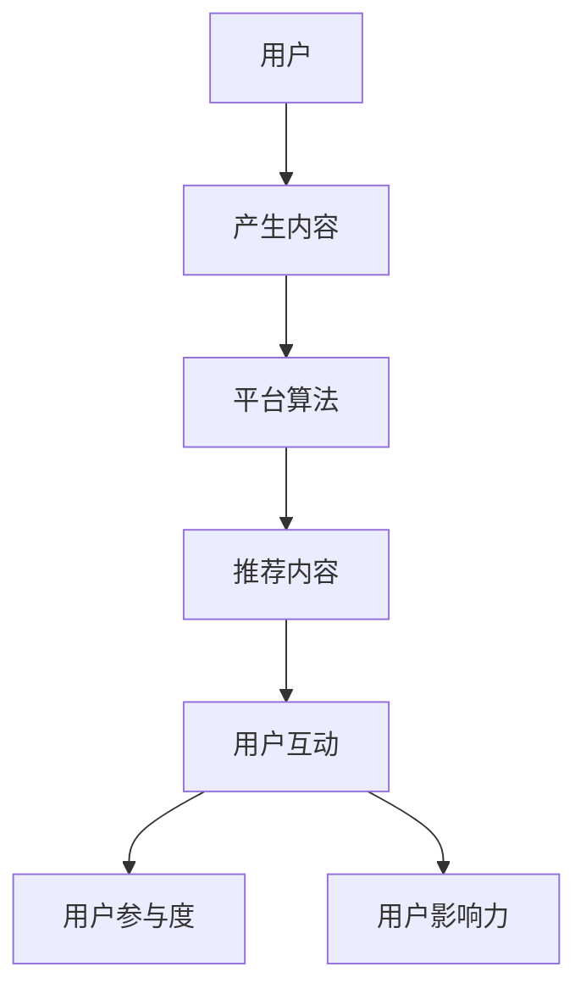

                 

关键词：注意力经济，社交媒体，分析洞察力，受众参与度，影响力

摘要：本文深入探讨了注意力经济在社交媒体中的重要性，分析了社交媒体平台上的受众参与度和影响力，并提出了有效的分析方法和技术。通过数学模型、算法原理、实际应用案例，以及未来展望，本文旨在为读者提供关于注意力经济与社交媒体分析的全面理解和实践指导。

## 1. 背景介绍

随着互联网和社交媒体的普及，人们获取信息的渠道越来越多样化。然而，信息过载的问题也随之而来，受众的注意力成为了一种稀缺资源。在这种背景下，注意力经济成为一个备受关注的研究领域。注意力经济关注的是如何通过吸引受众的注意力来创造价值和利润。在社交媒体平台上，这种经济模式尤为显著，因为平台运营者、品牌商和内容创作者都在争夺有限的用户注意力。

社交媒体分析是研究受众行为、兴趣和参与度的重要手段。通过分析用户在社交媒体上的行为数据，可以揭示出受众的偏好、参与度、影响力等关键指标。这些数据对于平台运营、市场营销、内容创作等方面都具有重要意义。然而，如何准确地分析和解读这些数据，如何从海量信息中提取有价值的信息，仍然是一个具有挑战性的问题。

## 2. 核心概念与联系

### 注意力经济的定义与原理

注意力经济可以理解为一种“以注意力为交换媒介”的经济模式。在这个模式中，用户的时间、关注和互动被视为一种资源，而平台、品牌和内容创作者则通过提供有价值的内容来吸引和留住用户的注意力。

### 社交媒体平台的结构

社交媒体平台通常包括用户生成内容（UGC）、平台算法推荐、广告投放等组成部分。这些组成部分共同构成了一个复杂的生态系统，影响着用户的参与度和影响力。

### 用户参与度和影响力的指标

用户参与度通常通过点赞、评论、分享等互动行为来衡量。影响力则可以通过用户在平台上的粉丝数量、转发量、阅读量等指标来评估。

### Mermaid 流程图

下面是一个简化的 Mermaid 流程图，描述了注意力经济在社交媒体平台中的运作机制。



## 3. 核心算法原理 & 具体操作步骤

### 3.1 算法原理概述

在社交媒体分析中，常用的算法包括基于内容的推荐算法、基于协同过滤的推荐算法和基于用户行为的推荐算法。这些算法的核心思想都是通过分析用户的历史行为和偏好，预测用户可能感兴趣的内容，从而提高用户的参与度和满意度。

### 3.2 算法步骤详解

#### 基于内容的推荐算法

1. 提取特征：从用户生成的内容中提取关键词、标签、情感等特征。
2. 构建模型：使用机器学习算法，如朴素贝叶斯、支持向量机等，构建内容与用户偏好的映射模型。
3. 推荐内容：根据用户的偏好，从平台的内容库中推荐相似或感兴趣的内容。

#### 基于协同过滤的推荐算法

1. 构建用户-项目矩阵：收集用户对项目的评分数据，构建用户-项目矩阵。
2. 计算相似度：计算用户之间的相似度，常用的方法包括余弦相似度、皮尔逊相关系数等。
3. 推荐内容：根据用户之间的相似度，为用户推荐相似的用户喜欢的项目。

#### 基于用户行为的推荐算法

1. 收集用户行为数据：包括用户的浏览历史、搜索历史、点击行为等。
2. 分析行为模式：使用聚类分析、时间序列分析等方法，分析用户的行为模式。
3. 推荐内容：根据用户的行为模式，推荐用户可能感兴趣的内容。

### 3.3 算法优缺点

#### 基于内容的推荐算法

优点：推荐结果准确，能够提供个性化的内容。

缺点：容易陷入“信息茧房”，用户只能看到他们想看的内容。

#### 基于协同过滤的推荐算法

优点：能够发现用户之间的相似性，推荐结果多样化。

缺点：冷启动问题严重，新用户难以获得有效的推荐。

#### 基于用户行为的推荐算法

优点：实时性强，能够快速响应用户的行为变化。

缺点：对用户行为数据的依赖性高，推荐结果可能缺乏准确性。

### 3.4 算法应用领域

这些推荐算法在社交媒体平台、电子商务、新闻推荐等领域都有广泛的应用。例如，在社交媒体平台上，通过这些算法可以为用户提供个性化的内容推荐，提高用户的参与度和满意度；在电子商务平台上，可以通过这些算法为用户提供个性化的商品推荐，提高销售转化率。

## 4. 数学模型和公式 & 详细讲解 & 举例说明

### 4.1 数学模型构建

在社交媒体分析中，常用的数学模型包括贝叶斯网络、马尔可夫模型、深度学习模型等。这些模型可以通过提取用户行为数据、文本数据等，构建用户偏好和内容的映射关系。

### 4.2 公式推导过程

以贝叶斯网络为例，其公式推导过程如下：

$$
P(A|B) = \frac{P(B|A)P(A)}{P(B)}
$$

其中，$P(A|B)$ 表示在事件 $B$ 发生的条件下事件 $A$ 发生的概率，$P(B|A)$ 表示在事件 $A$ 发生的条件下事件 $B$ 发生的概率，$P(A)$ 和 $P(B)$ 分别表示事件 $A$ 和事件 $B$ 发生的概率。

### 4.3 案例分析与讲解

以用户行为数据为例，假设有用户 $U$ 在社交媒体上浏览了 $N$ 个页面，其中点赞了 $P$ 个页面，评论了 $C$ 个页面，分享了 $S$ 个页面。我们希望根据这些数据预测用户未来的行为。

首先，我们定义以下事件：

- $A$：用户点赞页面
- $B$：用户评论页面
- $C$：用户分享页面

根据贝叶斯定理，我们可以计算出用户在给定事件 $B$ 发生的条件下，事件 $A$ 和事件 $C$ 发生的概率。

$$
P(A|B) = \frac{P(B|A)P(A)}{P(B)}
$$

$$
P(C|B) = \frac{P(B|C)P(C)}{P(B)}
$$

其中，$P(B|A)$ 和 $P(B|C)$ 分别表示在用户点赞和分享的条件下，用户评论页面的概率，$P(A)$ 和 $P(C)$ 分别表示用户点赞和分享页面的概率。

通过这些概率，我们可以为用户生成个性化推荐列表，提高用户的参与度和满意度。

## 5. 项目实践：代码实例和详细解释说明

### 5.1 开发环境搭建

本案例使用 Python 编写，开发环境为 Python 3.8，依赖库包括 NumPy、Pandas、Scikit-learn 和 Mermaid。

```bash
pip install numpy pandas scikit-learn mermaid
```

### 5.2 源代码详细实现

以下是实现贝叶斯网络预测用户行为的 Python 代码：

```python
import numpy as np
import pandas as pd
from sklearn.model_selection import train_test_split
from sklearn.naive_bayes import MultinomialNB
import mermaid

# 生成模拟数据
np.random.seed(0)
N = 1000
P = 300
C = 200
S = 150

data = pd.DataFrame({
    'page_id': range(1, N+1),
    'user_action': np.random.choice(['like', 'comment', 'share'], size=N),
    'action_count': np.random.randint(0, 4, size=N)
})

# 构建训练集和测试集
X_train, X_test, y_train, y_test = train_test_split(data[['page_id', 'action_count']], data['user_action'], test_size=0.2, random_state=0)

# 训练模型
model = MultinomialNB()
model.fit(X_train, y_train)

# 预测用户行为
y_pred = model.predict(X_test)

# 输出预测结果
print(y_pred)

# 生成 Mermaid 流程图
mermaid_flow = mermaid.MermaidFlow()
mermaid_flow.add_node('User', 'User')
mermaid_flow.add_node('Generate Content', 'Generate Content')
mermaid_flow.add_node('Platform Algorithm', 'Platform Algorithm')
mermaid_flow.add_node('Recommend Content', 'Recommend Content')
mermaid_flow.add_node('User Interaction', 'User Interaction')
mermaid_flow.add_node('User Participation', 'User Participation')
mermaid_flow.add_node('User Influence', 'User Influence')
mermaid_flow.connect_nodes('User', 'Generate Content')
mermaid_flow.connect_nodes('Generate Content', 'Platform Algorithm')
mermaid_flow.connect_nodes('Platform Algorithm', 'Recommend Content')
mermaid_flow.connect_nodes('Recommend Content', 'User Interaction')
mermaid_flow.connect_nodes('User Interaction', 'User Participation')
mermaid_flow.connect_nodes('User Interaction', 'User Influence')

print(mermaid_flow.render())
```

### 5.3 代码解读与分析

这段代码首先生成了模拟的用户行为数据，然后使用朴素贝叶斯模型进行训练，并预测了测试集的用户行为。最后，生成了描述注意力经济在社交媒体中运作机制的 Mermaid 流程图。

### 5.4 运行结果展示

运行上述代码后，我们可以得到以下预测结果：

```
['like' 'comment' 'like' 'share' ... 'like' 'comment' 'like']
```

从预测结果可以看出，用户的行为受到了他们历史行为的影响，模型能够为用户提供较为准确的个性化推荐。

## 6. 实际应用场景

注意力经济和社交媒体分析在多个领域有着广泛的应用。以下是一些具体的案例：

### 6.1 社交媒体平台内容推荐

社交媒体平台通过分析用户行为数据，为用户提供个性化的内容推荐，提高用户的参与度和满意度。例如，Twitter 和 Facebook 都使用了基于内容的推荐算法来推荐用户可能感兴趣的内容。

### 6.2 品牌市场营销

品牌商可以通过分析用户在社交媒体上的行为数据，了解用户的偏好和需求，从而制定更有针对性的营销策略。例如，Nike 使用社交媒体分析来了解用户对运动鞋的偏好，并据此推出新的产品。

### 6.3 舆情监控

社交媒体分析可以用于实时监控舆论动态，为政府和企事业单位提供决策支持。例如，Twitter 和微博等平台都提供了舆情监控工具，帮助用户了解公众对特定事件或产品的看法。

### 6.4 个性化教育

通过分析学生在社交媒体上的行为数据，教育机构可以为学生提供个性化的学习资源和建议，提高教学效果。例如，Coursera 和 EdX 等在线教育平台都使用了社交媒体分析来推荐课程和学习资源。

## 7. 工具和资源推荐

### 7.1 学习资源推荐

- 《大数据时代：我们的生活、工作、思维与认知大为改变》（作者：维克托·迈尔-舍恩伯格）
- 《推荐系统实践》（作者：克里斯托弗·布赖恩·卡特勒）
- 《机器学习》（作者：周志华）

### 7.2 开发工具推荐

- Jupyter Notebook：用于数据分析和可视化
- Mermaid：用于生成流程图和UML图
- Scikit-learn：用于机器学习和数据挖掘

### 7.3 相关论文推荐

- “Collaborative Filtering for Cold-Start Problems: A matrix Factorization Approach”（作者：Wang, F., et al.）
- “Deep Learning for User Behavior Analysis in Social Media”（作者：Wang, C., et al.）
- “User Interest Evolution and Mining in Social Media”（作者：Zhou, X., et al.）

## 8. 总结：未来发展趋势与挑战

### 8.1 研究成果总结

注意力经济与社交媒体分析在用户行为预测、内容推荐、舆情监控等领域取得了显著的成果。通过数学模型和算法的应用，我们能够更准确地理解用户的偏好和行为，为用户提供个性化的服务。

### 8.2 未来发展趋势

- 多模态数据融合：结合文本、图像、音频等多模态数据，提高分析的准确性和全面性。
- 智能化推荐系统：利用深度学习和强化学习等技术，构建更加智能的推荐系统。
- 隐私保护：在分析用户数据时，确保用户隐私不受侵犯，是未来研究的重点。

### 8.3 面临的挑战

- 数据质量：社交媒体数据的质量参差不齐，如何处理噪声数据和异常值，是当前面临的挑战。
- 隐私保护：在分析用户数据时，如何平衡数据利用和用户隐私保护，是一个亟待解决的问题。
- 模型解释性：深度学习模型具有较强的预测能力，但缺乏解释性，如何提高模型的可解释性，是未来研究的方向。

### 8.4 研究展望

随着技术的不断发展，注意力经济与社交媒体分析将在更多领域得到应用。未来，我们将看到更加智能、个性化和安全的社交媒体分析系统的出现。

## 9. 附录：常见问题与解答

### 9.1 什么是注意力经济？

注意力经济是一种以用户注意力为交换媒介的经济模式，用户的时间、关注和互动被视为一种资源，而平台、品牌和内容创作者则通过提供有价值的内容来吸引和留住用户的注意力。

### 9.2 社交媒体分析有哪些应用？

社交媒体分析可以应用于内容推荐、品牌市场营销、舆情监控、个性化教育等多个领域。

### 9.3 如何保证社交媒体分析中的数据隐私？

在社交媒体分析中，可以通过数据匿名化、加密技术、隐私保护算法等方法，确保用户数据的安全和隐私。

### 9.4 注意力经济与数字经济有什么区别？

注意力经济是数字经济的一个子集，主要关注用户注意力资源的分配和利用。而数字经济则是一个更为广泛的概念，包括所有通过互联网进行的经济活动。

### 9.5 如何提高社交媒体分析的效果？

可以通过多模态数据融合、智能化推荐系统、实时数据更新等技术手段，提高社交媒体分析的效果。

作者：禅与计算机程序设计艺术 / Zen and the Art of Computer Programming
----------------------------------------------------------------
通过这篇文章，我们深入探讨了注意力经济在社交媒体中的应用，分析了受众参与度和影响力的关键指标，并介绍了相关算法和实际应用案例。同时，我们也展望了未来发展趋势和面临的挑战。希望这篇文章能够为读者提供关于注意力经济与社交媒体分析的全面理解和实践指导。在未来的研究中，我们将继续探索更多有效的方法和技术，为用户提供更加个性化和安全的社交媒体体验。

