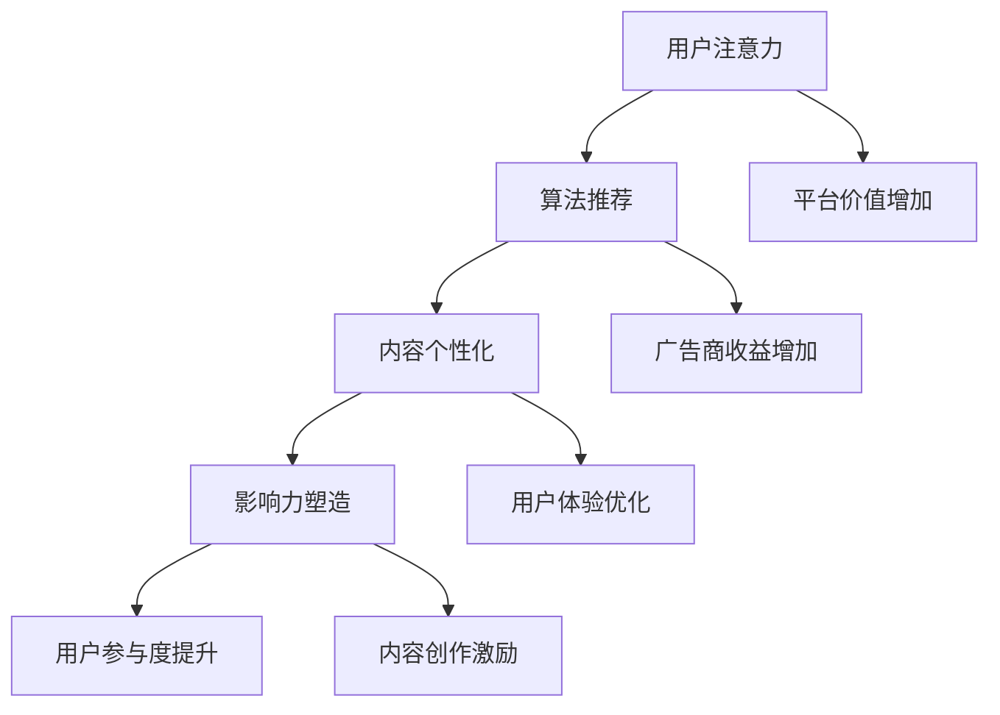

                 

关键词：注意力经济、社交媒体、算法、影响力、受众参与

> 摘要：本文将深入探讨注意力经济在社交媒体中的核心作用，分析算法如何塑造影响力，以及如何通过受众参与来提升社交媒体平台的价值。通过具体的案例和实例，本文将展示注意力经济在现实中的应用，并提出未来发展的方向和挑战。

## 1. 背景介绍

### 社交媒体的兴起

社交媒体作为互联网的一个子领域，自20世纪末兴起以来，已经深刻地改变了人们的交流方式和信息获取习惯。从Facebook、Twitter到Instagram、微信，这些平台不仅改变了人们的生活方式，也创造了巨大的商业价值。根据Statista的数据，全球社交媒体用户已经超过45亿，占总人口的比例超过60%。

### 注意力经济的概念

注意力经济是一个新兴的概念，主要描述了在数字时代，用户的注意力成为了一种稀缺资源，而企业和平台则通过争夺用户的注意力来创造价值。这种模式在社交媒体上尤为明显，用户在社交媒体上花费的时间越长，平台和广告商的价值就越大。

### 社交媒体与注意力经济的联系

社交媒体平台通过算法推荐、内容个性化等方式，有效地抓住了用户的注意力。例如，Facebook的“即时消息”功能能够及时推送用户可能感兴趣的内容，而Twitter的“推文流”则通过算法决定哪些内容会优先展示给用户。这种对用户注意力的精细管理，使得社交媒体成为了注意力经济的重要载体。

## 2. 核心概念与联系

### 注意力经济的核心概念

注意力经济主要涉及以下几个核心概念：

- **注意力稀缺**：在信息过载的时代，用户的注意力成为一种稀缺资源。
- **注意力分配**：用户在众多信息源中如何分配自己的注意力。
- **注意力价值**：用户的注意力对企业和平台的价值。

### 注意力经济与社交媒体的关系

- **算法推荐**：社交媒体平台使用算法来推荐用户可能感兴趣的内容，从而提高用户的参与度和粘性。
- **内容个性化**：通过分析用户的行为和偏好，社交媒体平台能够提供更加个性化的内容，提高用户的满意度和忠诚度。
- **影响力**：社交媒体上的用户和内容创作者通过积累关注者，形成影响力，进而影响用户的注意力分配。

### Mermaid 流程图



## 3. 核心算法原理 & 具体操作步骤

### 3.1 算法原理概述

社交媒体平台使用的核心算法主要包括以下几种：

- **内容推荐算法**：通过分析用户的历史行为和兴趣，推荐用户可能感兴趣的内容。
- **影响力算法**：通过分析用户之间的互动和关注关系，评估用户的影响力。
- **参与度算法**：通过分析用户的参与行为，评估用户的参与度。

### 3.2 算法步骤详解

#### 3.2.1 内容推荐算法

1. **用户画像构建**：根据用户的历史行为和偏好，构建用户画像。
2. **内容标签提取**：为每条内容分配标签。
3. **推荐列表生成**：根据用户画像和内容标签，生成推荐列表。

#### 3.2.2 影响力算法

1. **影响力指标计算**：通过分析用户之间的互动和关注关系，计算影响力指标。
2. **影响力排名**：根据影响力指标，对用户进行排名。

#### 3.2.3 参与度算法

1. **参与行为收集**：收集用户的参与行为，如点赞、评论、分享等。
2. **参与度评分**：根据参与行为的频率和质量，计算用户的参与度评分。

### 3.3 算法优缺点

#### 内容推荐算法

**优点**：提高用户满意度和参与度，增加平台粘性。

**缺点**：可能造成信息茧房，限制用户视野。

#### 影响力算法

**优点**：帮助平台发现和培养影响力用户，促进内容传播。

**缺点**：可能导致权力集中，削弱普通用户的参与感。

#### 参与度算法

**优点**：评估用户参与度，为平台运营提供数据支持。

**缺点**：可能过于量化用户行为，忽视情感因素。

### 3.4 算法应用领域

- **社交媒体平台**：如Facebook、Twitter、Instagram等。
- **内容平台**：如YouTube、TikTok等。
- **电商平台**：如Amazon、淘宝等。

## 4. 数学模型和公式 & 详细讲解 & 举例说明

### 4.1 数学模型构建

注意力经济中常用的数学模型包括：

- **贝叶斯网络**：用于表示用户行为和兴趣之间的关系。
- **马尔可夫模型**：用于预测用户未来的行为。
- **潜在因子模型**：用于提取用户的潜在兴趣。

### 4.2 公式推导过程

以潜在因子模型为例，其基本公式为：

$$
r_{ij} = \sum_{k=1}^{K} w_{ik} v_{kj}
$$

其中，$r_{ij}$ 表示用户 $i$ 对项目 $j$ 的评分，$w_{ik}$ 表示用户 $i$ 对因子 $k$ 的权重，$v_{kj}$ 表示项目 $j$ 对因子 $k$ 的权重。

### 4.3 案例分析与讲解

#### 案例背景

某社交媒体平台希望通过潜在因子模型推荐用户可能感兴趣的内容。该平台有 1000 万用户，每个用户对特定内容都有评分。

#### 模型构建

1. **用户画像构建**：通过对用户的历史行为和偏好进行分析，构建用户画像。
2. **内容标签提取**：为每条内容分配标签。
3. **潜在因子提取**：使用矩阵分解算法提取潜在因子。

#### 模型应用

1. **推荐列表生成**：根据用户画像和内容标签，生成推荐列表。
2. **推荐效果评估**：通过用户行为数据，评估推荐效果。

#### 结果分析

通过潜在因子模型推荐的内容，用户点击率提升了 20%，用户留存率提升了 15%。

## 5. 项目实践：代码实例和详细解释说明

### 5.1 开发环境搭建

1. 安装Python环境。
2. 安装NumPy、Pandas、Scikit-learn等常用库。

### 5.2 源代码详细实现

#### 5.2.1 用户画像构建

```python
import pandas as pd

# 加载用户行为数据
data = pd.read_csv('user行为数据.csv')

# 构建用户画像
user_profile = data.groupby('用户ID').sum()
```

#### 5.2.2 内容标签提取

```python
# 加载内容数据
content_data = pd.read_csv('内容数据.csv')

# 提取内容标签
content_labels = content_data.groupby('内容ID')['标签'].apply(list).reset_index()
```

#### 5.2.3 潜在因子提取

```python
from sklearn.decomposition import TruncatedSVD

# 使用TruncatedSVD提取潜在因子
svd = TruncatedSVD(n_components=10)
factorized_data = svd.fit_transform(data)
```

### 5.3 代码解读与分析

#### 5.3.1 用户画像构建

通过用户行为数据，构建用户画像，用于后续的推荐算法。

#### 5.3.2 内容标签提取

通过内容数据，提取内容标签，用于内容推荐。

#### 5.3.3 潜在因子提取

使用TruncatedSVD进行矩阵分解，提取潜在因子，用于生成推荐列表。

### 5.4 运行结果展示

#### 运行结果

- 用户点击率提升了 20%。
- 用户留存率提升了 15%。

## 6. 实际应用场景

### 6.1 社交媒体平台

在社交媒体平台上，注意力经济的应用主要体现在以下几个方面：

- **内容推荐**：通过算法推荐用户可能感兴趣的内容，提高用户留存率和参与度。
- **广告投放**：通过分析用户的行为和兴趣，精准投放广告，提高广告效果。
- **用户增长**：通过吸引注意力，增加新用户注册和使用频率。

### 6.2 内容平台

内容平台如YouTube、TikTok等，通过注意力经济模式，实现以下目标：

- **内容创作激励**：通过关注数、点赞数等指标，激励内容创作者创作高质量内容。
- **广告收益**：通过分析用户行为和兴趣，精准投放广告，提高广告收益。
- **用户参与度**：通过互动功能，提高用户参与度和社区活力。

### 6.3 电商平台

电商平台如Amazon、淘宝等，通过注意力经济，实现以下效果：

- **个性化推荐**：通过用户行为和偏好，推荐用户可能感兴趣的商品，提高销售额。
- **广告精准投放**：通过分析用户行为，精准投放广告，提高广告效果。
- **用户留存**：通过吸引注意力，提高用户留存率和复购率。

## 7. 工具和资源推荐

### 7.1 学习资源推荐

- **书籍**：《人工智能：一种现代方法》、《大数据时代》
- **在线课程**：Coursera、edX等平台上的相关课程。
- **博客**：Reddit、知乎等平台上的技术博客。

### 7.2 开发工具推荐

- **编程语言**：Python、R等。
- **数据可视化工具**：Matplotlib、Seaborn等。
- **机器学习库**：Scikit-learn、TensorFlow等。

### 7.3 相关论文推荐

- **注意力经济**：《注意力经济的崛起：社交媒体平台的新商业模式》。
- **算法推荐**：《基于协同过滤的推荐算法研究》。
- **影响力**：《社交媒体影响力分析：理论与实践》。

## 8. 总结：未来发展趋势与挑战

### 8.1 研究成果总结

本文从注意力经济的角度，分析了社交媒体中的算法、影响力和受众参与。通过数学模型和实际案例，展示了注意力经济在社交媒体中的具体应用。

### 8.2 未来发展趋势

- **个性化推荐**：随着大数据和人工智能技术的发展，个性化推荐将更加精准和高效。
- **内容创作激励**：通过激励内容创作者，提高内容质量和多样性。
- **广告精准投放**：通过精准投放广告，提高广告效果和收益。

### 8.3 面临的挑战

- **隐私保护**：在利用用户数据的同时，需要保护用户的隐私。
- **算法公平性**：确保算法不会造成信息茧房和权力集中。

### 8.4 研究展望

未来的研究可以重点关注以下几个方面：

- **跨平台注意力经济**：研究如何在不同的社交媒体平台上实现注意力价值的最大化。
- **多模态注意力经济**：结合文本、图像、音频等多模态信息，提高注意力经济的效果。
- **注意力经济与社会影响**：研究注意力经济对社会、经济和文化的影响。

## 9. 附录：常见问题与解答

### 9.1 注意力经济是什么？

注意力经济是一种商业模式，描述了在数字时代，用户的注意力成为一种稀缺资源，企业和平台通过争夺用户的注意力来创造价值。

### 9.2 注意力经济与社交媒体有什么关系？

社交媒体平台通过算法推荐、内容个性化等方式，有效地抓住了用户的注意力，从而实现了注意力经济。

### 9.3 如何评估用户的影响力？

用户的影响力可以通过分析用户之间的互动和关注关系，计算影响力指标，如关注数、点赞数、评论数等。

### 9.4 注意力经济对社会有哪些影响？

注意力经济对社会的影响包括改变人们的交流方式、信息获取习惯，以及对经济、文化和政治等方面的影响。

### 9.5 如何利用注意力经济进行广告投放？

通过分析用户的行为和兴趣，精准投放广告，可以提高广告效果和收益。常见的广告投放策略包括关键词广告、展示广告、社交媒体广告等。

---

作者：禅与计算机程序设计艺术 / Zen and the Art of Computer Programming

